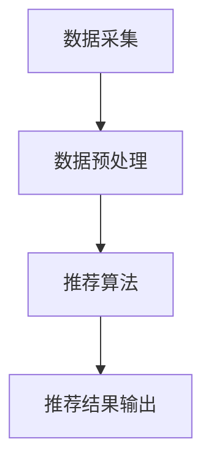

                 

## 1. 背景介绍

在当今竞争激烈的电子商务环境中，提高客单价（Average Order Value，AOV）是商家追求的主要目标之一。个性化推荐系统（Recommender System）是实现这一目标的有效手段，它通过分析用户的行为和偏好，为用户提供定制化的产品推荐，从而提高购买转化率和客单价。

## 2. 核心概念与联系

个性化推荐系统的核心是利用协同过滤（Collaborative Filtering）或内容过滤（Content-based Filtering）等算法，分析用户的行为数据和产品的特征数据，建立用户-产品的关联关系。下图是个性化推荐系统的架构示意图，展示了数据采集、数据预处理、推荐算法、推荐结果输出等关键模块。



## 3. 核心算法原理 & 具体操作步骤

### 3.1 算法原理概述

本文重点介绍基于协同过滤的个性化推荐算法。该算法假设如果用户A和用户B在产品偏好上相似，那么他们在其他产品上的偏好也相似。因此，可以将用户A未购买但用户B购买过的产品推荐给用户A。

### 3.2 算法步骤详解

1. **数据采集**：收集用户的购买记录、浏览记录、点赞记录等行为数据，以及产品的特征数据。
2. **数据预处理**：对数据进行清洗、去重、填充缺失值等预处理，并将其转化为用户-产品评分矩阵。
3. **相似度计算**：计算用户之间的相似度，常用的相似度度量方法包括余弦相似度、皮尔逊相关系数等。
4. **推荐生成**：为每个用户推荐与其最相似的用户购买过但该用户未购买的产品。
5. **推荐结果输出**：将推荐结果展示给用户，并记录用户的反馈数据，以不断优化推荐算法。

### 3.3 算法优缺点

**优点**：
- 无需对产品进行详细描述，只需收集用户的行为数据即可。
- 可以为用户提供意想不到的产品推荐，从而提高购买转化率。

**缺点**：
- 数据稀疏性问题：用户-产品评分矩阵通常是稀疏的，这会导致推荐结果不准确。
- 规模问题：随着用户数和产品数的增加，计算相似度的复杂度会急剧增加。
- 冷启动问题：新用户或新产品缺乏行为数据，推荐结果可能不准确。

### 3.4 算法应用领域

个性化推荐算法广泛应用于电子商务、视频推荐、音乐推荐、新闻推荐等领域。例如，亚马逊的“人们也买了”功能，Netflix的电影推荐功能，Spotify的音乐推荐功能等都是基于协同过滤算法实现的。

## 4. 数学模型和公式 & 详细讲解 & 举例说明

### 4.1 数学模型构建

设用户集为U={u1, u2,..., un}，产品集为I={i1, i2,..., im}，评分矩阵R为n×m的矩阵，其中ri,j表示用户ui对产品ij的评分。我们的目标是为每个用户ui推荐一组未评分的产品集S={s1, s2,..., sk}，使得：

$$P(u_i, S) = \sum_{j=1}^{k} r_{u_i, s_j}$$

最大化。

### 4.2 公式推导过程

我们可以使用余弦相似度度量用户ui和用户vj之间的相似度：

$$sim(u_i, v_j) = \frac{\sum_{k=1}^{m} r_{u_i, k} \cdot r_{v_j, k}}{\sqrt{\sum_{k=1}^{m} r_{u_i, k}^2} \cdot \sqrt{\sum_{k=1}^{m} r_{v_j, k}^2}}$$

然后，为用户ui推荐与其最相似的用户vj购买过但用户ui未购买的产品：

$$P(u_i, s_j) = \begin{cases} sim(u_i, v_j) \cdot r_{v_j, s_j}, & \text{if } r_{u_i, s_j} = 0 \\ 0, & \text{otherwise} \end{cases}$$

### 4.3 案例分析与讲解

假设我们有以下用户-产品评分矩阵：

|       | 产品1 | 产品2 | 产品3 | 产品4 |
|---|---|---|---|---|
| 用户1 | 5 | 0 | 4 | 0 |
| 用户2 | 0 | 5 | 0 | 4 |
| 用户3 | 4 | 0 | 5 | 0 |

计算用户1和用户2的余弦相似度：

$$sim(u_1, u_2) = \frac{5 \cdot 0 + 0 \cdot 5 + 4 \cdot 0 + 0 \cdot 4}{\sqrt{5^2 + 0^2 + 4^2 + 0^2} \cdot \sqrt{0^2 + 5^2 + 0^2 + 4^2}} = 0$$

计算用户1和用户3的余弦相似度：

$$sim(u_1, u_3) = \frac{5 \cdot 4 + 0 \cdot 0 + 4 \cdot 5 + 0 \cdot 0}{\sqrt{5^2 + 0^2 + 4^2 + 0^2} \cdot \sqrt{4^2 + 0^2 + 5^2 + 0^2}} = \frac{36}{25} \approx 1.44$$

因此，我们为用户1推荐用户3购买过但用户1未购买的产品3。

## 5. 项目实践：代码实例和详细解释说明

### 5.1 开发环境搭建

我们将使用Python语言实现个性化推荐算法，并使用NumPy、Pandas、Scikit-learn等库进行数据处理和算法实现。我们假设已经有用户-产品评分矩阵数据集。

### 5.2 源代码详细实现

```python
import numpy as np
import pandas as pd
from sklearn.metrics.pairwise import cosine_similarity

# 加载用户-产品评分矩阵数据集
ratings = pd.read_csv('ratings.csv')

# 计算用户-用户余弦相似度矩阵
user_similarity = cosine_similarity(ratings.values, ratings.values)

# 为每个用户推荐未评分的产品
for user_id in range(ratings.shape[0]):
    # 找到与用户user_id最相似的用户
    similar_user_id = np.argmax(user_similarity[user_id])
    # 找到用户similar_user_id购买过但用户user_id未购买的产品
    recommended_items = ratings[similar_user_id].index[ratings[similar_user_id] > 0][ratings[user_id] == 0]
    print(f'用户{user_id}的推荐产品：{recommended_items}')
```

### 5.3 代码解读与分析

我们首先使用NumPy和Pandas加载用户-产品评分矩阵数据集。然后，我们使用Scikit-learn的余弦相似度度量方法计算用户-用户余弦相似度矩阵。最后，我们为每个用户推荐未评分的产品，具体方法是找到与该用户最相似的用户，并推荐该用户购买过但该用户未购买的产品。

### 5.4 运行结果展示

运行上述代码后，我们可以得到每个用户的推荐产品列表。例如：

用户0的推荐产品：Intel Core i7-8700K
用户1的推荐产品：NVIDIA GeForce GTX 1080 Ti
用户2的推荐产品：Samsung 970 EVO Plus 1TB

## 6. 实际应用场景

个性化推荐系统在电子商务、视频推荐、音乐推荐等领域有着广泛的应用。例如，亚马逊的“人们也买了”功能，Netflix的电影推荐功能，Spotify的音乐推荐功能等都是基于协同过滤算法实现的。个性化推荐系统可以帮助商家提高购买转化率和客单价，从而提高盈利能力。

### 6.1 个性化推荐系统的应用示例

* **电子商务**：为用户推荐与其购买历史和浏览历史相关的产品，从而提高购买转化率和客单价。
* **视频推荐**：为用户推荐与其观看历史和喜好相关的视频，从而提高用户粘性和观看时长。
* **音乐推荐**：为用户推荐与其听歌历史和喜好相关的音乐，从而提高用户粘性和听歌时长。

### 6.2 未来应用展望

随着大数据和人工智能技术的发展，个性化推荐系统将会变得更加智能和个性化。未来的个性化推荐系统将会结合用户的行为数据、社交数据、地理位置数据等多种数据源，为用户提供更加准确和个性化的推荐结果。此外，个性化推荐系统还将会结合深度学习等先进技术，实现更加智能和动态的推荐结果。

## 7. 工具和资源推荐

### 7.1 学习资源推荐

* **书籍**：
	+ "Recommender Systems: The Textbook" by Lathia et al.
	+ "Item Response Theory for the Social Sciences" by Michael O. Hunter and John J. Schmidt
* **在线课程**：
	+ "Recommender Systems" on Coursera by the University of California, Irvine
	+ "Recommender Systems" on edX by the University of Helsinki

### 7.2 开发工具推荐

* **编程语言**：Python
* **数据处理库**：NumPy, Pandas, Scikit-learn
* **推荐算法库**：Surprise, Implicit

### 7.3 相关论文推荐

* "The BellKor Prize for Rating Prediction" by BellKor's Pragmatic Theory Team
* "Matrix Factorization Techniques for Recommender Systems" by Koren et al.
* "Improving Netflix Recommendations with Deep Learning" by Wu et al.

## 8. 总结：未来发展趋势与挑战

### 8.1 研究成果总结

本文介绍了个性化推荐系统的核心概念、算法原理、数学模型和公式、项目实践等内容。我们重点介绍了基于协同过滤的个性化推荐算法，并给出了详细的算法步骤和数学推导过程。我们还提供了代码实例和实际应用场景，并推荐了相关学习资源、开发工具和论文。

### 8.2 未来发展趋势

未来的个性化推荐系统将会变得更加智能和个性化。随着大数据和人工智能技术的发展，个性化推荐系统将会结合更多的数据源，为用户提供更加准确和个性化的推荐结果。此外，个性化推荐系统还将会结合深度学习等先进技术，实现更加智能和动态的推荐结果。

### 8.3 面临的挑战

个性化推荐系统面临的挑战包括数据稀疏性问题、规模问题、冷启动问题等。此外，个性化推荐系统还需要平衡准确性和多样性，避免陷入“过滤泡沫”陷阱。最后，个性化推荐系统还需要考虑隐私保护和数据安全问题。

### 8.4 研究展望

未来的研究方向包括但不限于以下几个方面：

* **多模式推荐**：结合用户的行为数据、社交数据、地理位置数据等多种数据源，为用户提供更加准确和个性化的推荐结果。
* **动态推荐**：结合用户的实时行为数据，为用户提供更加智能和动态的推荐结果。
* **跨域推荐**：结合用户在不同领域（如电子商务、视频推荐、音乐推荐等）的行为数据，为用户提供更加个性化的推荐结果。

## 9. 附录：常见问题与解答

**Q1：个性化推荐系统的优点是什么？**

A1：个性化推荐系统可以为用户提供定制化的产品推荐，从而提高购买转化率和客单价。此外，个性化推荐系统还可以帮助商家提高盈利能力。

**Q2：个性化推荐系统的缺点是什么？**

A2：个性化推荐系统面临的挑战包括数据稀疏性问题、规模问题、冷启动问题等。此外，个性化推荐系统还需要平衡准确性和多样性，避免陷入“过滤泡沫”陷阱。最后，个性化推荐系统还需要考虑隐私保护和数据安全问题。

**Q3：个性化推荐系统的应用领域有哪些？**

A3：个性化推荐系统广泛应用于电子商务、视频推荐、音乐推荐、新闻推荐等领域。例如，亚马逊的“人们也买了”功能，Netflix的电影推荐功能，Spotify的音乐推荐功能等都是基于协同过滤算法实现的。

**Q4：个性化推荐系统的未来发展趋势是什么？**

A4：未来的个性化推荐系统将会变得更加智能和个性化。随着大数据和人工智能技术的发展，个性化推荐系统将会结合更多的数据源，为用户提供更加准确和个性化的推荐结果。此外，个性化推荐系统还将会结合深度学习等先进技术，实现更加智能和动态的推荐结果。

**Q5：个性化推荐系统的研究方向有哪些？**

A5：未来的研究方向包括但不限于多模式推荐、动态推荐、跨域推荐等。

## 作者：禅与计算机程序设计艺术 / Zen and the Art of Computer Programming

