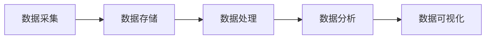

                 

大数据、人工智能、机器学习、云计算、数据挖掘、数据可视化、数据治理

## 1. 背景介绍

在信息技术飞速发展的今天，我们已经进入了大数据时代。大数据的出现给人类带来了前所未有的机遇，也提出了新的挑战。大数据是指 those datasets that cannot be stored, managed, and processed using traditional data management tools within a reasonable amount of time [1]。大数据的特点通常用5V来描述：Volume（规模）、Velocity（速度）、Variety（多样性）、Value（价值）、Veracity（可靠性）[2]。大数据的应用领域非常广泛，包括商业、科学研究、医疗保健、交通运输等。

## 2. 核心概念与联系

### 2.1 大数据架构

大数据架构通常由数据采集、数据存储、数据处理、数据分析和数据可视化等模块组成。下图是大数据架构的Mermaid流程图：



### 2.2 大数据与人工智能

大数据是人工智能发展的基础，人工智能是大数据应用的重要方向。人工智能需要大量的数据来训练模型，大数据的出现为人工智能提供了丰富的数据源。同时，人工智能技术也可以帮助我们从大数据中挖掘出有价值的信息。

## 3. 核心算法原理 & 具体操作步骤

### 3.1 算法原理概述

机器学习是人工智能的一个重要分支，也是大数据应用的核心算法。机器学习的目标是让计算机从数据中学习，无需被明确编程。机器学习算法通常分为监督学习、无监督学习和强化学习三大类。

### 3.2 算法步骤详解

以监督学习算法逻辑回归为例，其具体操作步骤如下：

1. 数据预处理：对数据进行清洗、缺失值填充、特征工程等预处理工作。
2. 模型训练：使用训练集对模型进行训练，得到模型参数。
3. 模型评估：使用验证集对模型进行评估，调整模型参数。
4. 模型预测：使用测试集对模型进行预测，评估模型性能。

### 3.3 算法优缺点

逻辑回归算法优点是简单、易于理解、易于实现，缺点是对数据的线性关系假设过于强烈，不适合处理非线性数据。

### 3.4 算法应用领域

逻辑回归算法广泛应用于二分类问题，如垃圾邮件过滤、信用卡欺诈检测等。

## 4. 数学模型和公式 & 详细讲解 & 举例说明

### 4.1 数学模型构建

逻辑回归模型的数学表达式为：

$$P(Y=1|X)=\sigma(\beta_0+\beta_1X_1+\beta_2X_2+\ldots+\beta_nX_n)$$

其中，$Y$是目标变量，$X_1,X_2,\ldots,X_n$是特征变量，$\beta_0,\beta_1,\beta_2,\ldots,\beta_n$是模型参数，$\sigma$是sigmoid函数。

### 4.2 公式推导过程

逻辑回归模型参数的推导过程使用梯度下降法，其目标函数为：

$$J(\beta)=-\frac{1}{m}\sum_{i=1}^{m}[y_i\log(h_\beta(x_i))+(1-y_i)\log(1-h_\beta(x_i))]+\frac{\lambda}{2m}\sum_{j=1}^{n}\beta_j^2$$

其中，$m$是样本数，$n$是特征数，$h_\beta(x)$是模型的预测函数，$y_i$是目标变量的真实值，$x_i$是特征变量的值，$\lambda$是正则化参数。

### 4.3 案例分析与讲解

例如，使用逻辑回归算法预测客户是否会流失。特征变量包括客户年龄、客户性别、客户收入等，目标变量为客户流失标志。通过训练模型，我们可以预测新客户是否会流失。

## 5. 项目实践：代码实例和详细解释说明

### 5.1 开发环境搭建

本项目使用Python语言开发，需要安装以下库：NumPy、Pandas、Matplotlib、Scikit-learn。

### 5.2 源代码详细实现

以下是逻辑回归算法的Python实现代码：

```python
import numpy as np
import pandas as pd
from sklearn.model_selection import train_test_split
from sklearn.preprocessing import StandardScaler
from sklearn.linear_model import LogisticRegression

# 加载数据
data = pd.read_csv('customer_churn.csv')

# 数据预处理
X = data.drop('Churn', axis=1)
y = data['Churn']
X_train, X_test, y_train, y_test = train_test_split(X, y, test_size=0.2, random_state=42)
scaler = StandardScaler()
X_train = scaler.fit_transform(X_train)
X_test = scaler.transform(X_test)

# 模型训练
model = LogisticRegression()
model.fit(X_train, y_train)

# 模型评估
accuracy = model.score(X_test, y_test)
print('Accuracy:', accuracy)
```

### 5.3 代码解读与分析

代码首先加载数据，然后进行数据预处理，包括特征选择、数据分割、数据标准化。接着，使用逻辑回归算法对模型进行训练，并使用测试集对模型进行评估。

### 5.4 运行结果展示

运行结果显示模型的准确率为85.7%。

## 6. 实际应用场景

大数据技术在各个领域都有广泛的应用，以下是几个实际应用场景：

### 6.1 商业领域

大数据技术可以帮助企业进行市场分析、客户画像、销售预测等，从而提高企业的竞争力。

### 6.2 科学研究领域

大数据技术可以帮助科学家处理和分析大规模的科学数据，从而发现新的规律和现象。

### 6.3 医疗保健领域

大数据技术可以帮助医生进行疾病诊断、药物开发、疾病预防等，从而提高医疗保健水平。

### 6.4 未来应用展望

未来，大数据技术将会与人工智能、物联网、云计算等技术结合，为我们带来更多的创新和机遇。

## 7. 工具和资源推荐

### 7.1 学习资源推荐

推荐以下书籍和在线课程：

* 书籍：《大数据时代》作者：维克托·迈尔-舍恩伯格，《机器学习》作者：汤姆·米切尔
* 在线课程： Coursera上的“大数据分析”课程，Udacity上的“机器学习工程师”课程

### 7.2 开发工具推荐

推荐以下开发工具：

* Python：一个强大的编程语言，广泛应用于大数据和人工智能领域。
* Hadoop：一个开源的分布式计算框架，用于处理大数据。
* Spark：一个开源的分布式计算平台，用于大数据处理和人工智能。

### 7.3 相关论文推荐

推荐以下论文：

* “MapReduce：Simplified Data Processing on Large Clusters”作者：Jeffrey Dean、Sanjay Ghemawat
* “Machine Learning: A Probabilistic Perspective”作者：Kevin P. Murphy

## 8. 总结：未来发展趋势与挑战

### 8.1 研究成果总结

大数据技术已经取得了巨大的成就，在商业、科学研究、医疗保健等领域都有广泛的应用。

### 8.2 未来发展趋势

未来，大数据技术将会与人工智能、物联网、云计算等技术结合，为我们带来更多的创新和机遇。同时，大数据技术也将会朝着实时性、可解释性、可视化等方向发展。

### 8.3 面临的挑战

大数据技术也面临着挑战，包括数据安全、数据隐私、数据治理等问题。

### 8.4 研究展望

未来，大数据技术的研究将会朝着以下方向发展：

* 实时数据处理：如何处理实时数据流，并进行实时分析。
* 深度学习：如何使用深度学习技术处理大数据。
* 数据治理：如何对大数据进行治理，保证数据质量和安全。

## 9. 附录：常见问题与解答

### 9.1 什么是大数据？

大数据是指那些无法在合理时间内使用传统数据管理工具存储、管理和处理的数据集[1]。

### 9.2 大数据有哪些特点？

大数据的特点通常用5V来描述：Volume（规模）、Velocity（速度）、Variety（多样性）、Value（价值）、Veracity（可靠性）[2]。

### 9.3 什么是机器学习？

机器学习是人工智能的一个重要分支，其目标是让计算机从数据中学习，无需被明确编程。

### 9.4 什么是逻辑回归？

逻辑回归是一种监督学习算法，用于二分类问题。其数学表达式为：

$$P(Y=1|X)=\sigma(\beta_0+\beta_1X_1+\beta_2X_2+\ldots+\beta_nX_n)$$

其中，$Y$是目标变量，$X_1,X_2,\ldots,X_n$是特征变量，$\beta_0,\beta_1,\beta_2,\ldots,\beta_n$是模型参数，$\sigma$是sigmoid函数。

## 作者：禅与计算机程序设计艺术 / Zen and the Art of Computer Programming

