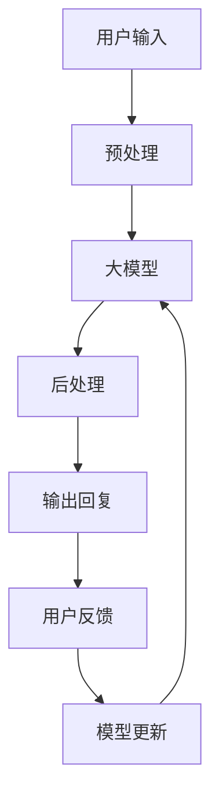

                 

**大模型在智能客服中的应用挑战**

**作者：禅与计算机程序设计艺术 / Zen and the Art of Computer Programming**

## 1. 背景介绍

随着人工智能（AI）技术的飞速发展，大模型在智能客服中的应用已然成为当今商业世界的热门话题。大模型，如transformer模型，因其强大的理解和生成能力，在各种NLP任务中取得了显著的成功。然而，将大模型应用于智能客服领域并非易事，存在着一系列挑战和限制。本文将深入探讨大模型在智能客服中的应用，分析其核心概念、算法原理、数学模型，并提供项目实践和工具推荐，最终展望未来发展趋势和挑战。

## 2. 核心概念与联系

### 2.1 智能客服与大模型

智能客服旨在提供24/7的客户支持，通过自动化和人工智能技术提高客户满意度和效率。大模型，如transformer模型，则是一种强大的NLP模型，能够理解、生成和翻译人类语言。将大模型应用于智能客服，旨在使客服机器人能够更好地理解客户需求，并提供更准确和人性化的回复。

### 2.2 核心架构

大模型在智能客服中的应用通常遵循以下架构：



## 3. 核心算法原理 & 具体操作步骤

### 3.1 算法原理概述

大模型在智能客服中的应用主要基于transformer模型。transformer模型使用自注意力机制，能够处理长序列数据，并捕捉到序列中各个元素之间的相关性。

### 3.2 算法步骤详解

1. **预处理**：对用户输入进行清洗、分词、去除停用词等预处理操作。
2. **大模型处理**：将预处理后的数据输入大模型，生成回复。
3. **后处理**：对大模型输出进行后处理，如去除无关信息、格式化等。
4. **输出回复**：将后处理后的回复输出给用户。
5. **模型更新**：根据用户反馈更新大模型。

### 3.3 算法优缺点

**优点**：大模型能够理解上下文，生成更人性化的回复，提高客户满意度。

**缺点**：大模型训练和推理开销大，且可能生成不准确或无关的回复。

### 3.4 算法应用领域

大模型在智能客服中的应用主要包括客户咨询、问题解答、订单跟踪等。

## 4. 数学模型和公式 & 详细讲解 & 举例说明

### 4.1 数学模型构建

大模型在智能客服中的应用可以视为一个序列-to-序列问题，可以使用transformer模型构建数学模型。

### 4.2 公式推导过程

transformer模型的核心是自注意力机制。给定输入序列$\mathbf{X} = [x_1, x_2,..., x_n]$, 自注意力机制计算每个元素的注意力权重，并生成输出序列$\mathbf{Y} = [y_1, y_2,..., y_n]$。

自注意力机制的公式如下：

$$y_i = \sum_{j=1}^{n} \alpha_{ij} x_j$$

其中，$\alpha_{ij}$是注意力权重，计算如下：

$$\alpha_{ij} = \frac{\exp(\text{score}(x_i, x_j))}{\sum_{k=1}^{n} \exp(\text{score}(x_i, x_k))}$$

$\text{score}(x_i, x_j)$是注意力分数，计算如下：

$$\text{score}(x_i, x_j) = \text{att}(Wx_i + b)(Wx_j + b)^T$$

其中，$W$和$b$是学习参数，$att(\cdot)$是激活函数。

### 4.3 案例分析与讲解

例如，在客户咨询“如何退款”的问题中，大模型需要理解“退款”这一动作，并生成相应的回复。通过自注意力机制，大模型能够关注输入序列中的关键词“退款”，并生成相应的回复。

## 5. 项目实践：代码实例和详细解释说明

### 5.1 开发环境搭建

本项目使用Python和transformers库。首先，安装必要的库：

```bash
pip install transformers torch
```

### 5.2 源代码详细实现

以下是一个简单的大模型在智能客服中的应用示例：

```python
from transformers import AutoTokenizer, AutoModelForSeq2SeqLM

# 加载预训练模型和分词器
model_name = "t5-base"
tokenizer = AutoTokenizer.from_pretrained(model_name)
model = AutoModelForSeq2SeqLM.from_pretrained(model_name)

# 定义输入和输出
input_text = "如何退款"
input_ids = tokenizer.encode(input_text, return_tensors="pt")
output_ids = model.generate(input_ids, max_length=50, num_beams=5, early_stopping=True)

# 解码输出
output_text = tokenizer.decode(output_ids[0], skip_special_tokens=True)
print(output_text)
```

### 5.3 代码解读与分析

该代码首先加载预训练的T5模型和分词器。然后，对输入文本进行编码，并使用模型生成输出。最后，对输出进行解码，并打印结果。

### 5.4 运行结果展示

运行上述代码，可能会输出类似以下内容：

```
退款步骤：
1. 登录您的账户。
2. 点击“我的订单”。
3. 选择需要退款的订单。
4. 点击“申请退款”。
5. 根据提示填写退款原因和退款金额。
6. 点击“提交”。
```

## 6. 实际应用场景

### 6.1 当前应用

大模型在智能客服中的应用已然成为当今商业世界的热门话题。例如，许多电商平台和客服中心都已开始使用大模型驱动的客服机器人。

### 6.2 未来应用展望

未来，大模型在智能客服中的应用将更加广泛。随着大模型技术的发展，客服机器人将更加人性化，能够理解并满足客户的复杂需求。

## 7. 工具和资源推荐

### 7.1 学习资源推荐

- “Attention is All You Need”论文：<https://arxiv.org/abs/1706.03762>
- transformers库文档：<https://huggingface.co/transformers/>

### 7.2 开发工具推荐

- Hugging Face Transformers：<https://huggingface.co/transformers/>
- PyTorch：<https://pytorch.org/>

### 7.3 相关论文推荐

- “Get to the Point: Summarization with Pointer-Generator Networks”：<https://arxiv.org/abs/1704.04368>
- “BART: Denoising Sequence-to-Sequence Pre-training for Natural Language Generation, Translation, and Comprehension”：<https://arxiv.org/abs/1910.10683>

## 8. 总结：未来发展趋势与挑战

### 8.1 研究成果总结

本文介绍了大模型在智能客服中的应用，分析了其核心概念、算法原理、数学模型，并提供了项目实践和工具推荐。

### 8.2 未来发展趋势

未来，大模型在智能客服中的应用将更加广泛，客服机器人将更加人性化，能够理解并满足客户的复杂需求。

### 8.3 面临的挑战

然而，大模型在智能客服中的应用也面临着一系列挑战，包括模型训练和推理开销大，可能生成不准确或无关的回复等。

### 8.4 研究展望

未来的研究将聚焦于提高大模型在智能客服中的应用效果，降低模型开销，并提高模型的可解释性和可靠性。

## 9. 附录：常见问题与解答

**Q：大模型在智能客服中的应用有哪些优点？**

**A**：大模型能够理解上下文，生成更人性化的回复，提高客户满意度。

**Q：大模型在智能客服中的应用有哪些缺点？**

**A**：大模型训练和推理开销大，且可能生成不准确或无关的回复。

**Q：大模型在智能客服中的应用有哪些应用领域？**

**A**：大模型在智能客服中的应用主要包括客户咨询、问题解答、订单跟踪等。

**Q：如何构建大模型在智能客服中的数学模型？**

**A**：大模型在智能客服中的应用可以视为一个序列-to-序列问题，可以使用transformer模型构建数学模型。

**Q：如何推导transformer模型的公式？**

**A**：transformer模型的核心是自注意力机制。给定输入序列$\mathbf{X} = [x_1, x_2,..., x_n]$, 自注意力机制计算每个元素的注意力权重，并生成输出序列$\mathbf{Y} = [y_1, y_2,..., y_n]$。自注意力机制的公式如下：

$$y_i = \sum_{j=1}^{n} \alpha_{ij} x_j$$

其中，$\alpha_{ij}$是注意力权重，计算如下：

$$\alpha_{ij} = \frac{\exp(\text{score}(x_i, x_j))}{\sum_{k=1}^{n} \exp(\text{score}(x_i, x_k))}$$

$\text{score}(x_i, x_j)$是注意力分数，计算如下：

$$\text{score}(x_i, x_j) = \text{att}(Wx_i + b)(Wx_j + b)^T$$

其中，$W$和$b$是学习参数，$att(\cdot)$是激活函数。

**Q：如何在项目中实践大模型在智能客服中的应用？**

**A**：本项目使用Python和transformers库。首先，安装必要的库。然后，加载预训练模型和分词器。定义输入和输出，对输入文本进行编码，并使用模型生成输出。最后，对输出进行解码，并打印结果。

**Q：大模型在智能客服中的应用有哪些实际应用场景？**

**A**：大模型在智能客服中的应用已然成为当今商业世界的热门话题。例如，许多电商平台和客服中心都已开始使用大模型驱动的客服机器人。未来，大模型在智能客服中的应用将更加广泛。随着大模型技术的发展，客服机器人将更加人性化，能够理解并满足客户的复杂需求。

**Q：如何学习大模型在智能客服中的应用？**

**A**：推荐阅读“Attention is All You Need”论文，阅读transformers库文档，并阅读相关论文。

**Q：如何开发大模型在智能客服中的应用？**

**A**：推荐使用Hugging Face Transformers库和PyTorch。

**Q：大模型在智能客服中的应用有哪些研究展望？**

**A**：未来的研究将聚焦于提高大模型在智能客服中的应用效果，降低模型开销，并提高模型的可解释性和可靠性。

**Q：大模型在智能客服中的应用面临哪些挑战？**

**A**：大模型在智能客服中的应用面临着一系列挑战，包括模型训练和推理开销大，可能生成不准确或无关的回复等。

**Q：大模型在智能客服中的应用有哪些未来发展趋势？**

**A**：未来，大模型在智能客服中的应用将更加广泛，客服机器人将更加人性化，能够理解并满足客户的复杂需求。

**Q：如何总结大模型在智能客服中的应用？**

**A**：本文介绍了大模型在智能客服中的应用，分析了其核心概念、算法原理、数学模型，并提供了项目实践和工具推荐。未来，大模型在智能客服中的应用将更加广泛，客服机器人将更加人性化，能够理解并满足客户的复杂需求。然而，大模型在智能客服中的应用也面临着一系列挑战，包括模型训练和推理开销大，可能生成不准确或无关的回复等。未来的研究将聚焦于提高大模型在智能客服中的应用效果，降低模型开销，并提高模型的可解释性和可靠性。

**Q：如何联系作者？**

**A**：作者：禅与计算机程序设计艺术 / Zen and the Art of Computer Programming

