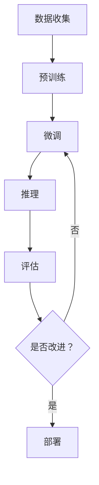

                 

**大模型时代下的新型学习方式**

**作者：禅与计算机程序设计艺术 / Zen and the Art of Computer Programming**

## 1. 背景介绍

在人工智能（AI）领域，我们正处于大模型（Large Language Models, LLMs）的时代。这些模型通过处理大量文本数据，学习到丰富的语言理解和生成能力。然而，大模型的学习方式与传统的机器学习模型有着显著的不同。本文将深入探讨大模型时代下的新型学习方式，包括其核心概念、算法原理、数学模型，并提供项目实践和工具推荐。

## 2. 核心概念与联系

### 2.1 核心概念

- **自回归模型（Autoregressive Models）**：大多数大模型都是自回归模型的变种，它们预测下一个 token（单词、字符等）基于之前的 token。
- **转换器（Transformer）架构**：大多数大模型使用转换器架构，它由自注意力机制（Self-Attention）和前向传播网络（Feed-Forward Network）组成。
- **预训练（Pre-training）和微调（Fine-tuning）**：大模型通常先在大量文本数据上进行预训练，然后在特定任务上进行微调。

### 2.2 核心概念联系 Mermaid 流程图



## 3. 核心算法原理 & 具体操作步骤

### 3.1 算法原理概述

大模型的核心是转换器架构，它使用自注意力机制来处理序列数据。自注意力机制允许模型在处理序列时考虑到序列的上下文，从而提高模型的理解和生成能力。

### 3.2 算法步骤详解

1. **输入表示（Input Embedding）**：将输入 token 映射为向量表示。
2. **位置编码（Positional Encoding）**：为序列中的每个 token 添加位置信息。
3. **编码器（Encoder）**：使用多个转换器块（由自注意力机制和前向传播网络组成）处理输入序列。
4. **解码器（Decoder）**：使用多个转换器块生成输出序列，并使用自注意力机制和编码器-解码器注意力机制（Encoder-Decoder Attention）考虑到输入序列的上下文。
5. **输出表示（Output Embedding）**：将输出向量表示转换为 token。

### 3.3 算法优缺点

**优点**：
- 可以处理长序列数据，因为它使用自注意力机制而不是递归或卷积操作。
- 可以并行化计算，因为它不依赖于序列的顺序。

**缺点**：
- 计算复杂度高，需要大量的计算资源。
- 训练数据要求高，需要大量的高质量文本数据。

### 3.4 算法应用领域

大模型在自然语言处理（NLP）领域有着广泛的应用，包括文本生成、机器翻译、问答系统、文本分类等。此外，大模型也开始应用于其他领域，如计算机视觉和生物信息学。

## 4. 数学模型和公式 & 详细讲解 & 举例说明

### 4.1 数学模型构建

大模型的数学模型可以表示为：

$$P(\mathbf{x}) = \prod_{i=1}^{n} P(\mathbf{x}_i | \mathbf{x}_{<i})$$

其中 $\mathbf{x}$ 是输入序列，$\mathbf{x}_i$ 是序列中的第 $i$ 个 token，$\mathbf{x}_{<i}$ 是序列中的前 $i-1$ 个 token。

### 4.2 公式推导过程

自注意力机制的数学模型可以表示为：

$$\text{Attention}(\mathbf{Q}, \mathbf{K}, \mathbf{V}) = \text{softmax}\left(\frac{\mathbf{Q}\mathbf{K}^\top}{\sqrt{d_k}}\right) \mathbf{V}$$

其中 $\mathbf{Q}$, $\mathbf{K}$, $\mathbf{V}$ 分别是查询（Query）、键（Key）、值（Value）矩阵，$\mathbf{K}^\top$ 是 $\mathbf{K}$ 的转置，$\sqrt{d_k}$ 是缩放因子，其中 $d_k$ 是键矩阵的维度。

### 4.3 案例分析与讲解

例如，在机器翻译任务中，输入序列 $\mathbf{x}$ 是源语言句子，输出序列 $\mathbf{y}$ 是目标语言句子。大模型学习到的分布 $P(\mathbf{y} | \mathbf{x})$ 可以用于生成目标语言句子。

## 5. 项目实践：代码实例和详细解释说明

### 5.1 开发环境搭建

大模型的开发通常需要GPU加速，因此需要安装 CUDA 并配置好 Python 环境。推荐使用 PyTorch、Transformers 库和 Hugging Face 的 Transformers 库。

### 5.2 源代码详细实现

以下是一个简单的大模型训练示例：

```python
from transformers import AutoTokenizer, AutoModelForCausalLM, Trainer, TrainingArguments

tokenizer = AutoTokenizer.from_pretrained("t5-base")
model = AutoModelForCausalLM.from_pretrained("t5-base")

def encode(examples):
    return tokenizer(examples["text"], truncation=True, padding=True)

training_args = TrainingArguments(
    output_dir="./results",
    num_train_epochs=3,
    per_device_train_batch_size=16,
    per_device_eval_batch_size=64,
    warmup_steps=500,
    weight_decay=0.01,
    logging_dir="./logs",
)

trainer = Trainer(
    model=model,
    args=training_args,
    train_dataset=train_dataset.map(encode, batched=True),
    eval_dataset=eval_dataset.map(encode, batched=True),
)

trainer.train()
```

### 5.3 代码解读与分析

这段代码使用 Hugging Face 的 Transformers 库训练一个大型语言模型（T5）进行文本生成任务。它首先加载预训练模型和分词器，然后定义训练参数，并使用 Trainer 类进行训练。

### 5.4 运行结果展示

训练完成后，模型可以用于生成文本。例如，输入 "翻译成法语：我爱你"，模型可以输出 "Je t'aime"。

## 6. 实际应用场景

### 6.1 当前应用

大模型在各种 NLP 任务中得到广泛应用，包括文本生成、机器翻译、问答系统、文本分类等。它们也开始应用于其他领域，如计算机视觉和生物信息学。

### 6.2 未来应用展望

未来，大模型有望在更多领域得到应用，如自动驾驶、医疗诊断等。此外，多模式大模型（可以处理文本、图像、音频等多模式数据）也将是一个重要的研究方向。

## 7. 工具和资源推荐

### 7.1 学习资源推荐

- "Attention is All You Need" 论文：<https://arxiv.org/abs/1706.03762>
- "Language Models are Few-Shot Learners" 论文：<https://arxiv.org/abs/2005.14165>
- Hugging Face 文档：<https://huggingface.co/transformers/>

### 7.2 开发工具推荐

- PyTorch：<https://pytorch.org/>
- Transformers 库：<https://huggingface.co/transformers/>
- CUDA：<https://developer.nvidia.com/cuda-downloads>

### 7.3 相关论文推荐

- "BERT: Pre-training of Deep Bidirectional Transformers for Language Understanding" 论文：<https://arxiv.org/abs/1810.04805>
- "T5: Text-to-Text Transfer Transformer" 论文：<https://arxiv.org/abs/1910.10683>

## 8. 总结：未来发展趋势与挑战

### 8.1 研究成果总结

大模型在 NLP 任务中取得了显著的成功，并开始应用于其他领域。它们的学习方式与传统的机器学习模型有着显著的不同，需要大量的计算资源和高质量的文本数据。

### 8.2 未来发展趋势

未来，大模型有望在更多领域得到应用，并与其他模型（如生成式对抗网络）结合，以提高模型的能力。此外，多模式大模型也将是一个重要的研究方向。

### 8.3 面临的挑战

大模型面临的挑战包括计算资源的限制、数据的获取和质量、模型的解释性等。此外，大模型也面临着伦理和安全方面的挑战，如偏见、误导等。

### 8.4 研究展望

未来的研究将关注于提高大模型的效率、解释性和泛化能力。此外，研究也将关注于大模型的安全性和伦理问题。

## 9. 附录：常见问题与解答

**Q：大模型需要多少计算资源？**

**A：**大模型通常需要大量的 GPU 资源进行训练。例如，训练一个 T5-11B 模型需要数千个 GPU 天的计算资源。

**Q：大模型需要多少数据？**

**A：**大模型需要大量的高质量文本数据进行预训练。例如，T5-11B 模型使用了 37 个语言的 75 亿个 token 的数据进行预训练。

**Q：大模型是如何进行微调的？**

**A：**大模型通常在特定任务上进行微调，即使用少量的标记数据进行端到端的训练。微调可以有效地适应大模型到特定任务，并提高模型的性能。

**Q：大模型是否会泄露训练数据？**

**A：**大模型可能会泄露训练数据，因为它们学习到的表示可能包含原始数据的信息。因此，在使用大模型时需要考虑数据隐私和安全问题。

**Q：大模型是否会产生偏见？**

**A：**大模型可能会产生偏见，因为它们学习到的表示可能包含原始数据中的偏见。因此，在使用大模型时需要考虑偏见问题，并采取相应的措施进行偏见检测和缓解。

## 结束语

大模型时代下的新型学习方式为 AI 研究和应用带来了新的机遇和挑战。通过理解大模型的核心概念、算法原理和数学模型，我们可以更好地开发和应用大模型，并推动 AI 技术的发展。未来，大模型有望在更多领域得到应用，并与其他模型结合，以提高模型的能力。然而，大模型也面临着计算资源、数据、解释性、安全性和伦理等挑战。我们需要不断地研究和改进大模型，以克服这些挑战，并推动 AI 技术的发展。

**作者：禅与计算机程序设计艺术 / Zen and the Art of Computer Programming**

