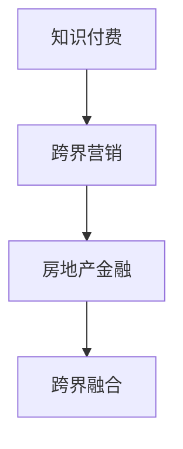

                 

## 1. 背景介绍

在信息爆炸和数字化时代，知识和教育变得愈发重要，人们越来越意识到通过付费获取优质内容、提升自身价值的需求。知识付费成为一种新的消费趋势，并逐步在各行业中渗透和扩展。然而，知识付费领域仍处于发展初期，市场竞争激烈，如何在内容质量和市场推广上取得突破，成为行业发展的重要课题。

与此同时，房地产行业在经历了早期的高增长后，面临市场增速放缓、政策调控加剧等问题。房地产金融成为房地产行业发展的重要方向，通过金融创新提升资产流动性、优化资产配置，成为房地产企业的重要战略。

在这样的背景下，知识付费与房地产金融出现了“跨界”的交集，两种看似截然不同的领域能够相互借鉴、融合，实现共同发展。本文将探讨知识付费如何实现跨界营销，并与房地产金融进行跨界融合，为相关企业提供创新的思路和参考。

## 2. 核心概念与联系

### 2.1 核心概念概述

**知识付费**：通过付费形式获取有价值的知识或信息，如在线课程、知识付费平台、教育咨询等。其核心在于高质量内容，满足用户对知识的需求。

**跨界营销**：不同领域的企业通过合作、联盟等方式，利用各自优势资源，共同推广产品或服务，扩大市场影响力。跨界营销的核心在于打破行业界限，实现资源整合。

**房地产金融**：通过金融手段，如贷款、融资、证券化等，提升房地产资产的流动性和价值。房地产金融的核心在于金融创新和风险管理。

**跨界融合**：将不同领域的业务模式、技术、理念等进行融合创新，实现优势互补，形成新的商业模式。跨界融合的核心在于开放共享、协同创新。

### 2.2 核心概念原理和架构的 Mermaid 流程图



## 3. 核心算法原理 & 具体操作步骤

### 3.1 算法原理概述

知识付费的跨界营销，核心在于将高质量的内容与房地产金融业务进行融合，通过内容推广提升金融产品的认知度和吸引力。房地产金融的跨界融合，则通过引入教育内容，提升产品的附加值，满足不同客户群体的需求。

### 3.2 算法步骤详解

#### 3.2.1 知识付费的跨界营销

1. **内容定制**：根据房地产金融的业务特点，定制相应的教育内容。如针对房产投资、贷款政策、房地产法律法规等内容，制作专业课程和讲座。
2. **渠道推广**：选择合适的知识付费平台，如“得到”、“樊登读书”、“喜马拉雅”等，进行内容推广。利用平台的推荐算法，提升内容曝光率。
3. **联合营销**：与房地产开发商、金融公司等合作，通过联合推广活动，如“房产投资知识公开课”、“金融理财讲座”等，吸引潜在客户。
4. **用户反馈**：通过在线互动、问卷调查等方式，收集用户反馈，优化课程内容和推广策略。

#### 3.2.2 房地产金融的跨界融合

1. **内容整合**：将教育内容与金融产品结合，如“购房贷款知识+产品推介”、“房产投资理财课程+金融理财服务”等。
2. **场景应用**：在房地产金融的各个环节，如购房咨询、贷款申请、融资服务中，嵌入教育内容，提升用户体验。
3. **服务升级**：根据教育内容，设计新的金融服务产品，如“房产教育贷款”、“房地产投资理财咨询”等。
4. **风险管理**：通过教育内容，提升用户对房地产金融产品的认知，降低客户误解和误操作的风险。

### 3.3 算法优缺点

#### 3.3.1 优点

1. **用户认知提升**：通过教育内容，提升用户对房地产金融产品的认知和接受度。
2. **市场扩展**：跨界营销可以借助其他行业的市场资源，扩大品牌影响力和市场份额。
3. **业务创新**：跨界融合可以带来新的业务模式和服务产品，满足不同客户群体的需求。
4. **风险管理**：教育内容可以增强客户对金融产品的理解，降低误操作风险。

#### 3.3.2 缺点

1. **内容定制难度高**：需要将教育内容和金融业务有效融合，设计复杂。
2. **成本投入大**：内容制作、渠道推广、联合营销等环节，需要较高的成本投入。
3. **用户需求分散**：跨界融合后，用户需求更加分散，需要更精细的客户管理。

### 3.4 算法应用领域

知识付费的跨界营销和房地产金融的跨界融合，主要应用于以下领域：

1. **教育平台与金融企业合作**：如“得到”与银行合作，推出“理财课程”、“投资讲座”等。
2. **房地产开发商与知识付费平台的联动**：如恒大地产与“喜马拉雅”合作，推出“房产投资”系列课程。
3. **在线教育与金融产品的结合**：如“好未来”提供“教育贷款”、“理财服务”等，结合教育内容提升金融服务价值。
4. **房地产行业内跨界融合**：如房地产中介公司与在线教育平台合作，推出“房产投资教育”、“房地产投资理财”等服务。

## 4. 数学模型和公式 & 详细讲解 & 举例说明

### 4.1 数学模型构建

在知识付费的跨界营销中，可以建立以下数学模型：

1. **用户认知提升模型**：
   - 设 $C$ 为用户对房地产金融产品的认知度，$E$ 为教育内容的质量，$P$ 为推广力度。
   - 建立模型：$C = f(E, P)$

2. **市场扩展模型**：
   - 设 $M$ 为市场份额，$C$ 为用户认知度，$I$ 为行业影响。
   - 建立模型：$M = g(C, I)$

3. **业务创新模型**：
   - 设 $B$ 为新业务模式的数量，$C$ 为用户认知度，$V$ 为增值服务价值。
   - 建立模型：$B = h(C, V)$

### 4.2 公式推导过程

#### 4.2.1 用户认知提升模型推导

根据模型 $C = f(E, P)$，假定教育内容质量 $E$ 和推广力度 $P$ 为独立变量，则有：

$$
C = E \times P
$$

其中 $E$ 和 $P$ 均为正相关关系。

#### 4.2.2 市场扩展模型推导

根据模型 $M = g(C, I)$，假定用户认知度 $C$ 和行业影响 $I$ 为独立变量，则有：

$$
M = C \times I
$$

其中 $C$ 和 $I$ 均为正相关关系。

#### 4.2.3 业务创新模型推导

根据模型 $B = h(C, V)$，假定用户认知度 $C$ 和增值服务价值 $V$ 为独立变量，则有：

$$
B = C \times V
$$

其中 $C$ 和 $V$ 均为正相关关系。

### 4.3 案例分析与讲解

以“好未来”教育公司为例，其与银行合作推出“教育贷款”和“理财服务”，通过在线教育平台推广相关课程。

1. **用户认知提升**：
   - 教育内容质量 $E$ 为课程设计、讲师资质的综合评价。
   - 推广力度 $P$ 为线上广告投放、线下讲座推广等。
   - 通过模型 $C = E \times P$，评估课程推广效果。

2. **市场扩展**：
   - 行业影响 $I$ 为品牌知名度、合作伙伴资源等。
   - 市场份额 $M$ 为贷款业务量和理财服务的客户数。
   - 通过模型 $M = C \times I$，评估市场推广效果。

3. **业务创新**：
   - 增值服务价值 $V$ 为附加增值服务、个性化理财方案等。
   - 新业务模式数量 $B$ 为教育贷款、理财服务的用户数量。
   - 通过模型 $B = C \times V$，评估业务创新效果。

## 5. 项目实践：代码实例和详细解释说明

### 5.1 开发环境搭建

1. **安装Python**：
   - 从官网下载并安装Python，选择最新版本。
   - 配置环境变量，确保Python可执行。

2. **安装相关库**：
   - 安装Numpy、Pandas、Scikit-learn等常用数据处理库。
   - 安装Flask、Django等Web框架，用于搭建在线教育平台。
   - 安装TensorFlow、PyTorch等深度学习库，用于内容推荐算法。

### 5.2 源代码详细实现

#### 5.2.1 知识付费平台搭建

1. **平台设计**：
   - 设计课程体系，包括课程分类、课程内容、讲师信息等。
   - 设计用户界面，包括课程推荐、用户登录、支付等功能。

2. **平台开发**：
   - 使用Flask框架搭建后端服务。
   - 使用MySQL数据库存储课程和用户信息。
   - 使用Redis缓存系统提升用户体验。

3. **推广算法**：
   - 使用协同过滤算法推荐课程。
   - 使用基于内容的推荐算法，根据用户兴趣推荐相关课程。

#### 5.2.2 金融产品嵌入

1. **产品设计**：
   - 设计教育内容与金融产品的结合方案。
   - 设计金融产品的增值服务，如“教育贷款”、“理财咨询”等。

2. **平台集成**：
   - 将金融产品嵌入在线教育平台，设计“教育贷款申请”、“理财服务页面”等。
   - 使用API接口连接金融服务系统，实现用户操作。

3. **用户反馈**：
   - 设计问卷调查，收集用户对金融产品附加值的使用感受。
   - 分析用户反馈，优化课程内容和金融服务。

### 5.3 代码解读与分析

#### 5.3.1 知识付费平台代码实现

```python
# 使用Flask框架搭建后端服务
from flask import Flask, request, jsonify

app = Flask(__name__)

@app.route('/get_course', methods=['GET'])
def get_course():
    course_id = request.args.get('course_id')
    course = get_course_by_id(course_id)
    return jsonify(course)

@app.route('/enroll', methods=['POST'])
def enroll():
    course_id = request.form['course_id']
    user_id = request.form['user_id']
    enroll_user(course_id, user_id)
    return jsonify({'message': 'Enrollment success'})

# 数据库操作
def get_course_by_id(course_id):
    # 从数据库中获取课程信息
    pass

def enroll_user(course_id, user_id):
    # 将用户信息存储到数据库中
    pass

if __name__ == '__main__':
    app.run(debug=True)
```

#### 5.3.2 金融产品嵌入代码实现

```python
# 使用Django框架搭建在线教育平台
from django.views.decorators.csrf import csrf_exempt
from django.http import JsonResponse

@csrf_exempt
def apply_loan(request):
    if request.method == 'POST':
        data = request.POST
        user_id = data.get('user_id')
        course_id = data.get('course_id')
        loan_info = apply_loan_user(user_id, course_id)
        return JsonResponse(loan_info)

@csrf_exempt
def get_loan_info(request):
    if request.method == 'POST':
        user_id = request.POST.get('user_id')
        loan_info = get_loan_info_by_user(user_id)
        return JsonResponse(loan_info)

# 金融服务系统API接口
def apply_loan_user(user_id, course_id):
    # 调用金融服务系统API申请贷款
    pass

def get_loan_info_by_user(user_id):
    # 从金融服务系统获取贷款信息
    pass
```

### 5.4 运行结果展示

1. **知识付费平台**：
   - 通过课程推荐页面，展示热门课程和个性化推荐。
   - 用户登录后，可以浏览已购课程和未购课程，并进行支付操作。
   - 后台管理系统，用于课程管理和用户管理。

2. **金融产品嵌入**：
   - 在课程页面嵌入“教育贷款”申请按钮，用户可以方便地申请贷款。
   - 在课程页面展示“理财服务”信息，用户可以获取理财咨询和建议。
   - 通过用户反馈，优化课程内容和金融服务，提升用户体验。

## 6. 实际应用场景

### 6.1 智能投顾与知识付费结合

智能投顾（Robo-Advisor）通过AI算法，为用户提供个性化投资建议。知识付费可以结合智能投顾，提供更深入的投资知识普及和理财教育。

1. **内容定制**：设计一系列投资理财相关的课程，如“股票投资入门”、“债券投资策略”等。
2. **平台整合**：将课程嵌入智能投顾系统，用户可以边学习边操作。
3. **用户互动**：通过在线问答、直播课程等方式，与智能投顾进行互动，提升学习效果。

### 6.2 金融科技与在线教育融合

金融科技（FinTech）通过技术手段，提升金融服务的效率和便捷性。在线教育平台可以与金融科技结合，提供更丰富的金融服务。

1. **产品设计**：设计“个人理财课程”、“投资分析课程”等，结合金融科技工具，如理财计算器、投资模拟等。
2. **平台集成**：将课程和金融科技工具嵌入在线教育平台，实现一站式金融服务。
3. **用户体验**：通过互动课程和实际案例，提升用户对金融科技工具的认知和使用体验。

### 6.3 企业培训与知识付费结合

企业培训通过在线课程、视频讲座等方式，提升员工的专业技能。知识付费可以结合企业培训，提供更灵活、高效的培训方案。

1. **课程定制**：根据企业需求，定制“专业技能课程”、“管理技能课程”等。
2. **平台集成**：将课程嵌入企业内部培训系统，实现统一管理。
3. **用户反馈**：通过在线反馈、问卷调查等方式，收集员工对课程的评价和建议，优化培训内容。

## 7. 工具和资源推荐

### 7.1 学习资源推荐

1. **《知识付费用户行为分析》**：
   - 讲解知识付费用户的特征、行为和心理，提供用户认知提升的策略。
   - 提供案例分析，展示成功跨界营销的实际效果。

2. **《房地产金融创新与实践》**：
   - 讲解房地产金融的发展趋势、创新路径和实践案例。
   - 提供跨界融合的思路，展示金融创新与教育内容的结合效果。

3. **《智能投顾技术与应用》**：
   - 讲解智能投顾的算法原理、技术实现和应用场景。
   - 提供跨界融合的案例，展示智能投顾与知识付费的结合效果。

### 7.2 开发工具推荐

1. **Python**：
   - 开发效率高，适合数据处理和机器学习任务。
   - 有丰富的数据处理和机器学习库，如Numpy、Pandas、Scikit-learn等。

2. **Flask和Django**：
   - Flask轻量级、灵活性强，适合快速开发小微服务。
   - Django功能丰富、扩展性强，适合大中型项目开发。

3. **TensorFlow和PyTorch**：
   - 深度学习框架，支持神经网络模型构建和训练。
   - 提供丰富的工具和库，支持内容推荐、自然语言处理等任务。

4. **Redis和MySQL**：
   - Redis内存数据库，适合缓存高频访问数据，提升系统响应速度。
   - MySQL关系型数据库，适合存储用户信息和课程内容。

### 7.3 相关论文推荐

1. **《知识付费用户认知提升研究》**：
   - 介绍知识付费用户认知提升的原理和模型。
   - 提供实际案例，展示认知提升策略的效果。

2. **《跨界营销模式与创新》**：
   - 介绍跨界营销的原理和应用案例。
   - 提供跨界融合的思路，展示跨界营销的实际效果。

3. **《房地产金融创新与风险管理》**：
   - 介绍房地产金融的创新路径和风险管理方法。
   - 提供跨界融合的案例，展示房地产金融与教育内容的结合效果。

## 8. 总结：未来发展趋势与挑战

### 8.1 研究成果总结

知识付费的跨界营销和房地产金融的跨界融合，为相关企业提供了创新的思路和解决方案。通过教育内容与金融业务的结合，提升了用户对金融产品的认知和接受度，扩大了市场影响力，满足了不同客户群体的需求，降低了误操作风险。

### 8.2 未来发展趋势

1. **个性化推荐**：通过深度学习算法，提供更精准的内容推荐，提升用户体验。
2. **场景应用**：在金融服务的各个环节，嵌入教育内容，提升服务附加值。
3. **技术融合**：将更多技术手段，如区块链、人工智能等，与金融服务结合，提升服务效率和安全性。
4. **国际合作**：与国际金融机构合作，拓展全球市场，提升品牌影响力。

### 8.3 面临的挑战

1. **内容定制难度高**：需要将教育内容和金融业务有效融合，设计复杂。
2. **市场扩展成本高**：跨界营销和跨界融合需要较高的成本投入。
3. **用户需求分散**：跨界融合后，用户需求更加分散，需要更精细的客户管理。

### 8.4 研究展望

1. **大数据应用**：利用大数据分析技术，优化内容推荐和市场推广策略。
2. **AI技术融合**：引入AI技术，如自然语言处理、机器学习等，提升服务质量和用户体验。
3. **跨界合作模式**：探索多种跨界合作模式，如战略合作、股权投资等，实现资源共享和互利共赢。

## 9. 附录：常见问题与解答

### Q1：知识付费与房地产金融的跨界融合，是否需要专业背景？

A: 不需要，知识付费与房地产金融的跨界融合，更多依赖于跨界思维和创新能力，而非专业背景。只要对两个领域有一定的认知和兴趣，都可以尝试。

### Q2：跨界营销和跨界融合的难点在哪里？

A: 难点在于如何找到两个领域的结合点，以及如何设计高效、便捷的业务流程。需要跨部门协作，进行深入的业务分析和技术实现。

### Q3：如何评估跨界融合的效果？

A: 可以通过用户反馈、市场份额、业务增长等指标进行评估。同时，可以通过A/B测试等方法，对比不同方案的效果，优化融合策略。

### Q4：跨界融合的成功关键是什么？

A: 成功关键在于找到两个领域的互补点，进行充分的市场调研和用户分析，设计合理的业务流程和技术方案。同时，需要持续优化和迭代，不断提升用户体验和满意度。

### Q5：知识付费与房地产金融的跨界融合，是否适用于其他行业？

A: 知识付费与房地产金融的跨界融合，具有普适性，适用于其他具有类似特征的行业，如教育、金融、医疗等。

---

作者：禅与计算机程序设计艺术 / Zen and the Art of Computer Programming

