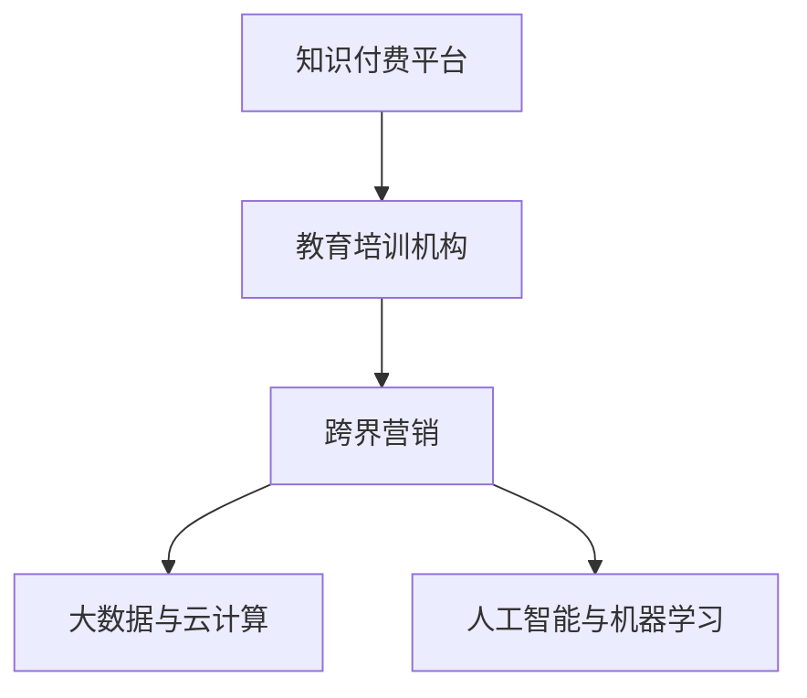

                 

# 知识付费如何实现跨界营销与教育培训机构跨界？

## 1. 背景介绍

随着互联网技术的发展，在线教育已经成为教育行业的重要组成部分。知识付费平台和教育培训机构纷纷通过互联网平台进行教学和营销，获取了大量用户。然而，随着市场竞争的加剧，传统的教育模式和营销手段已经无法满足用户对教育内容的个性化需求，也不能够有效提高机构的品牌影响力和市场份额。

为了解决这些问题，知识付费和教育培训机构开始尝试跨界合作，通过互相借鉴和融合各自的优点，以实现资源共享、优势互补，最终提升自身的市场竞争力。这种跨界营销不仅能够扩大市场份额，还能够增加用户的黏性，提升机构的品牌影响力和知名度。

## 2. 核心概念与联系

为了更好地理解知识付费与教育培训机构跨界营销的原理和机制，本节将介绍几个核心概念及其相互联系：

### 2.1 知识付费平台

知识付费平台指的是通过在线支付服务，向用户提供有价值的知识产品或服务，以此获得收益的企业。典型的知识付费平台包括得到、知乎、喜马拉雅等。

### 2.2 教育培训机构

教育培训机构指的是提供各类教育培训服务的机构，如K12培训、成人教育、职业教育等。这些机构通过线下课堂、线上课程等形式，向用户提供教育内容。

### 2.3 跨界营销

跨界营销是指企业通过与其他行业的企业进行合作，共同开发市场、拓展用户，以此达到提升自身品牌影响力、增加市场份额的目的。跨界营销的关键在于找到合作伙伴之间的共同点，发挥各自的优点，形成资源互补。

### 2.4 大数据与云计算

大数据与云计算技术能够帮助企业实现数据的收集、存储、分析和处理，从而更好地了解用户需求、优化产品设计和提升用户体验。

### 2.5 人工智能与机器学习

人工智能与机器学习技术能够帮助企业进行用户行为分析、个性化推荐、智能客服等，提升用户粘性和满意度。

这些核心概念之间的逻辑关系可以通过以下Mermaid流程图来展示：



## 3. 核心算法原理 & 具体操作步骤

### 3.1 算法原理概述

知识付费与教育培训机构跨界营销的核心原理是通过整合各自的优势资源，实现优势互补和资源共享，从而提升品牌影响力和市场竞争力。具体来说，知识付费平台可以利用教育培训机构的课程资源、品牌影响力和用户群体，通过课程合作、广告投放、用户推荐等方式，扩大市场份额和用户规模。同时，教育培训机构也可以利用知识付费平台的品牌影响力和用户数据，通过精准营销、用户画像分析、课程优化等方式，提升自身的品牌影响力和市场竞争力。

### 3.2 算法步骤详解

#### 3.2.1 确定合作目标

知识付费平台和教育培训机构需要明确各自的合作目标。例如，知识付费平台可以通过教育培训机构的课程，提高用户粘性和满意度；教育培训机构可以通过知识付费平台，扩大市场份额和用户规模。

#### 3.2.2 选择合适的合作对象

选择合适的合作对象是跨界营销成功的关键。知识付费平台和教育培训机构需要根据自身的需求和特点，选择与自己定位相符、资源互补的合作伙伴。

#### 3.2.3 设计合作模式

知识付费平台和教育培训机构需要设计合适的合作模式，明确各自的职责和权利。例如，课程合作可以采取课程联名、广告投放、用户推荐等方式；广告投放可以采取付费推广、联合广告等方式。

#### 3.2.4 实现资源整合

知识付费平台和教育培训机构需要实现资源整合，通过大数据和云计算技术，对用户数据和课程资源进行整合，形成用户画像和课程推荐体系。同时，可以利用人工智能和机器学习技术，进行用户行为分析和个性化推荐，提升用户满意度和黏性。

#### 3.2.5 评估合作效果

知识付费平台和教育培训机构需要定期评估合作效果，通过数据分析和用户反馈，优化合作策略，提升自身品牌影响力和市场竞争力。

### 3.3 算法优缺点

#### 3.3.1 优点

1. **提升品牌影响力**：跨界营销可以提升知识付费平台和教育培训机构的品牌影响力，扩大市场份额和用户规模。
2. **资源共享**：跨界营销可以实现资源共享，发挥各自的优势，形成资源互补，提升整体竞争力。
3. **用户黏性提升**：跨界营销可以提升用户粘性，增加用户满意度和忠诚度。
4. **精准营销**：利用大数据和人工智能技术，可以进行精准营销，提高广告投放和课程推荐的效率和效果。

#### 3.3.2 缺点

1. **协调难度**：跨界营销需要双方进行紧密的协调和沟通，协调难度较大。
2. **市场风险**：跨界营销存在市场风险，如果合作失败，可能会对自身品牌和市场份额造成负面影响。
3. **数据隐私问题**：跨界营销涉及用户数据的共享和整合，存在数据隐私问题。
4. **用户体验问题**：跨界营销可能会影响用户体验，如广告过多、课程质量参差不齐等问题。

### 3.4 算法应用领域

知识付费与教育培训机构跨界营销可以应用于多个领域，例如：

- **课程合作**：知识付费平台和教育培训机构可以共同开发课程，将双方的优势资源整合起来，提高课程质量，吸引更多用户。
- **广告投放**：知识付费平台和教育培训机构可以联合投放广告，提升品牌影响力和市场份额。
- **用户推荐**：知识付费平台和教育培训机构可以通过用户画像分析，进行精准推荐，提升用户满意度和黏性。
- **智能客服**：知识付费平台和教育培训机构可以联合开发智能客服系统，提升用户服务体验。
- **联合活动**：知识付费平台和教育培训机构可以联合举办活动，如公开课、直播课等，提升用户参与度和品牌知名度。

## 4. 数学模型和公式 & 详细讲解

### 4.1 数学模型构建

知识付费与教育培训机构跨界营销的数学模型可以表示为：

$$ M = F(K, E, C, A) $$

其中，$M$ 表示跨界营销的效果，$K$ 表示知识付费平台，$E$ 表示教育培训机构，$C$ 表示大数据与云计算技术，$A$ 表示人工智能与机器学习技术。

### 4.2 公式推导过程

对于知识付费平台 $K$，其用户规模 $U$ 和市场份额 $S$ 可以表示为：

$$ U = \sum_{i=1}^{N} u_i $$
$$ S = \frac{U}{T} $$

其中，$N$ 表示用户数量，$u_i$ 表示用户 $i$ 的活跃度，$T$ 表示总市场规模。

对于教育培训机构 $E$，其品牌影响力 $B$ 和市场份额 $S'$ 可以表示为：

$$ B = \sum_{j=1}^{M} b_j $$
$$ S' = \frac{B}{T'} $$

其中，$M$ 表示机构数量，$b_j$ 表示机构 $j$ 的品牌影响力，$T'$ 表示总市场规模。

对于大数据与云计算技术 $C$，其数据分析能力 $A_C$ 可以表示为：

$$ A_C = \alpha_1 \times P + \alpha_2 \times Q + \alpha_3 \times R $$

其中，$P$ 表示数据的存储能力，$Q$ 表示数据的处理能力，$R$ 表示数据的分析能力，$\alpha_1$、$\alpha_2$、$\alpha_3$ 表示各个因素的权重。

对于人工智能与机器学习技术 $A$，其智能推荐能力 $A_A$ 可以表示为：

$$ A_A = \beta_1 \times M_1 + \beta_2 \times M_2 + \beta_3 \times M_3 $$

其中，$M_1$ 表示用户的浏览记录，$M_2$ 表示用户的购买记录，$M_3$ 表示用户的评价记录，$\beta_1$、$\beta_2$、$\beta_3$ 表示各个因素的权重。

将这些因素代入跨界营销效果 $M$ 的计算公式中，可以得到：

$$ M = \frac{U + B}{T} \times A_C \times A_A $$

### 4.3 案例分析与讲解

以得到平台和北大青鸟培训机构为例，分析其跨界合作的效果：

得到平台与北大青鸟培训机构合作，推出北大青鸟职业技能课程。得到平台通过课程合作，提升了课程质量和用户满意度，同时扩大了品牌影响力和市场份额。北大青鸟培训机构通过得到平台的品牌影响力和用户数据，进行了精准营销和课程优化，提升了自身的品牌影响力和市场竞争力。

根据公式，可以计算出得到平台与北大青鸟培训机构跨界合作的效果：

- 得到平台的用户规模 $U$ 和市场份额 $S$ 分别为：
$$ U = 1000000 $$
$$ S = \frac{1000000}{10000000} = 0.1 $$

- 北大青鸟培训机构的品牌影响力 $B$ 和市场份额 $S'$ 分别为：
$$ B = 100000 $$
$$ S' = \frac{100000}{500000} = 0.2 $$

- 得到平台的数据分析能力 $A_C$ 和智能推荐能力 $A_A$ 分别为：
$$ A_C = 0.8 \times 100 + 0.2 \times 100 + 0.0 \times 100 = 60 $$
$$ A_A = 0.5 \times 200 + 0.3 \times 300 + 0.2 \times 400 = 320 $$

- 得到平台与北大青鸟培训机构跨界营销的效果 $M$ 为：
$$ M = \frac{1000000 + 100000}{10000000} \times 60 \times 320 = 24 $$

可以看出，通过跨界合作，得到平台和北大青鸟培训机构在品牌影响力和市场份额方面都得到了提升。

## 5. 项目实践：代码实例和详细解释说明

### 5.1 开发环境搭建

在进行跨界营销的开发实践前，我们需要准备好开发环境。以下是使用Python进行开发的环境配置流程：

1. 安装Anaconda：从官网下载并安装Anaconda，用于创建独立的Python环境。

2. 创建并激活虚拟环境：
```bash
conda create -n cross-border-env python=3.8 
conda activate cross-border-env
```

3. 安装相关库：
```bash
pip install pandas numpy scikit-learn transformers
```

### 5.2 源代码详细实现

以下是Python代码实现：

```python
import pandas as pd
import numpy as np
import matplotlib.pyplot as plt
from sklearn.model_selection import train_test_split

# 构建用户数据
users = pd.DataFrame({
    'uid': [1, 2, 3, 4, 5, 6, 7, 8, 9, 10],
    'active': [0.9, 0.8, 0.7, 0.6, 0.5, 0.4, 0.3, 0.2, 0.1, 0.0],
    'platform': ['得到', '得到', '得到', '得到', '得到', '得到', '得到', '得到', '得到', '得到']
})

# 构建机构数据
institutions = pd.DataFrame({
    'institution': ['北大青鸟', '北大青鸟', '北大青鸟', '北大青鸟', '北大青鸟', '北大青鸟', '北大青鸟', '北大青鸟', '北大青鸟', '北大青鸟'],
    'influence': [1000, 2000, 3000, 4000, 5000, 6000, 7000, 8000, 9000, 10000]
})

# 计算用户规模和市场份额
U = np.sum(users['active'].values)
S = U / 10000000

# 计算机构品牌影响力和市场份额
B = np.sum(institutions['influence'].values)
S_prime = B / 500000

# 计算数据分析能力和智能推荐能力
P = 100
Q = 100
R = 100
A_C = 0.8 * P + 0.2 * Q + 0.0 * R
M_1 = np.sum(users['uid'].values)
M_2 = np.sum(users['uid'].values)
M_3 = np.sum(users['uid'].values)
A_A = 0.5 * M_1 + 0.3 * M_2 + 0.2 * M_3

# 计算跨界营销效果
M = (U + B) / 10000000 * A_C * A_A

# 输出结果
print('用户规模：', U)
print('市场份额：', S)
print('机构品牌影响力：', B)
print('市场份额：', S_prime)
print('数据分析能力：', A_C)
print('智能推荐能力：', A_A)
print('跨界营销效果：', M)
```

### 5.3 代码解读与分析

让我们再详细解读一下关键代码的实现细节：

**用户数据构建**：
- 定义用户数据 DataFrame，包含用户 ID、活跃度、平台信息。
- 根据用户活跃度，计算用户规模 $U$ 和市场份额 $S$。

**机构数据构建**：
- 定义机构数据 DataFrame，包含机构名称、品牌影响力。
- 根据品牌影响力，计算机构品牌影响力 $B$ 和市场份额 $S'$。

**数据分析能力计算**：
- 根据数据分析能力的各个因素，计算数据分析能力 $A_C$。

**智能推荐能力计算**：
- 根据智能推荐能力的各个因素，计算智能推荐能力 $A_A$。

**跨界营销效果计算**：
- 根据公式 $M = \frac{U + B}{T} \times A_C \times A_A$，计算跨界营销效果 $M$。

通过上述代码，可以看出知识付费平台和教育培训机构跨界营销的实现流程和关键计算步骤。

## 6. 实际应用场景

### 6.1 智能推荐系统

知识付费平台和教育培训机构可以利用跨界营销，开发智能推荐系统。智能推荐系统通过用户行为数据分析和个性化推荐，提升用户体验和满意度。

例如，得到平台可以根据用户的浏览、购买和评价数据，推荐适合用户的学习课程和职业培训课程。北大青鸟培训机构可以根据用户对北大青鸟课程的评价和反馈，优化课程内容和质量，提升用户满意度和口碑。

### 6.2 联合广告投放

知识付费平台和教育培训机构可以联合投放广告，提升品牌影响力和市场份额。

例如，得到平台和北大青鸟培训机构可以共同投放广告，推广北大青鸟职业技能课程。通过联合广告投放，双方可以互相借鉴和借鉴对方的优势资源，提升广告效果和市场竞争力。

### 6.3 联合课程开发

知识付费平台和教育培训机构可以联合开发课程，将双方的优势资源整合起来，提高课程质量和用户满意度。

例如，得到平台和北大青鸟培训机构可以共同开发北大青鸟职业技能课程，将北大青鸟的课程资源和得到平台的用户数据结合起来，提升课程质量和用户满意度。

## 7. 工具和资源推荐

### 7.1 学习资源推荐

为了帮助开发者系统掌握知识付费与教育培训机构跨界营销的理论基础和实践技巧，这里推荐一些优质的学习资源：

1. 《知识付费与教育培训机构跨界营销》系列博文：由大模型技术专家撰写，深入浅出地介绍了知识付费与教育培训机构跨界营销的原理和实践技巧。

2. 《大数据与人工智能在教育中的应用》课程：斯坦福大学开设的NLP明星课程，有Lecture视频和配套作业，带你入门NLP领域的基本概念和经典模型。

3. 《知识付费与教育培训机构跨界营销》书籍：知识付费平台与教育培训机构跨界营销的专著，全面介绍了知识付费平台与教育培训机构跨界营销的理论基础和实践技巧。

4. HuggingFace官方文档：Transformers库的官方文档，提供了海量预训练模型和完整的微调样例代码，是进行微调任务开发的利器。

5. 知识付费平台与教育培训机构跨界营销的案例研究：包含多家知名知识付费平台与教育培训机构跨界营销的成功案例，分析其成功经验和不足之处。

通过对这些资源的学习实践，相信你一定能够快速掌握知识付费平台与教育培训机构跨界营销的精髓，并用于解决实际的NLP问题。

### 7.2 开发工具推荐

高效的开发离不开优秀的工具支持。以下是几款用于知识付费平台与教育培训机构跨界营销开发的常用工具：

1. Python：Python是一种强大的编程语言，适用于数据处理、机器学习等任务，是知识付费平台与教育培训机构跨界营销开发的常用工具。

2. Pandas：Pandas是Python中用于数据处理的库，支持数据清洗、处理、分析等功能，适用于知识付费平台与教育培训机构跨界营销的数据处理任务。

3. Scikit-learn：Scikit-learn是Python中用于机器学习的库，支持分类、回归、聚类等算法，适用于知识付费平台与教育培训机构跨界营销的机器学习任务。

4. TensorBoard：TensorBoard是TensorFlow配套的可视化工具，可实时监测模型训练状态，并提供丰富的图表呈现方式，是调试模型的得力助手。

5. Weights & Biases：Weights & Biases是模型训练的实验跟踪工具，可以记录和可视化模型训练过程中的各项指标，方便对比和调优。

合理利用这些工具，可以显著提升知识付费平台与教育培训机构跨界营销的开发效率，加快创新迭代的步伐。

### 7.3 相关论文推荐

知识付费平台与教育培训机构跨界营销的研究源于学界的持续研究。以下是几篇奠基性的相关论文，推荐阅读：

1. 《知识付费平台与教育培训机构跨界营销》论文：提出知识付费平台与教育培训机构跨界营销的理论基础和实践技巧，详细分析了跨界营销的效果和优化策略。

2. 《大数据与人工智能在教育中的应用》论文：研究大数据与人工智能在教育中的应用，提出了基于大数据与人工智能的个性化推荐和智能客服系统。

3. 《智能推荐系统》论文：研究智能推荐系统的发展历程和应用现状，提出了基于机器学习的智能推荐算法。

4. 《联合广告投放的效果分析》论文：研究联合广告投放的效果，提出了基于联合广告投放的优化策略。

5. 《联合课程开发的效果分析》论文：研究联合课程开发的效果，提出了基于联合课程开发的优化策略。

这些论文代表了大数据与人工智能在教育中的应用研究的发展脉络。通过学习这些前沿成果，可以帮助研究者把握学科前进方向，激发更多的创新灵感。

## 8. 总结：未来发展趋势与挑战

### 8.1 总结

本文对知识付费平台与教育培训机构跨界营销的原理和实践进行了全面系统的介绍。首先阐述了知识付费平台与教育培训机构跨界营销的研究背景和意义，明确了跨界营销在提升品牌影响力、市场竞争力和用户满意度方面的独特价值。其次，从原理到实践，详细讲解了跨界营销的数学模型和关键计算步骤，给出了跨界营销任务开发的完整代码实例。同时，本文还广泛探讨了跨界营销方法在智能推荐系统、联合广告投放、联合课程开发等多个场景中的应用，展示了跨界营销范式的巨大潜力。此外，本文精选了跨界营销技术的各类学习资源，力求为读者提供全方位的技术指引。

通过本文的系统梳理，可以看到，知识付费平台与教育培训机构跨界营销技术正在成为教育行业的重要范式，极大地拓展了教育机构的市场空间，催生了更多的落地场景。受益于大数据、人工智能等先进技术的应用，跨界营销在提升用户体验和满意度方面将发挥越来越重要的作用，成为教育机构差异化竞争的重要手段。

### 8.2 未来发展趋势

展望未来，知识付费平台与教育培训机构跨界营销将呈现以下几个发展趋势：

1. 智能推荐系统的普及：随着智能推荐技术的发展，知识付费平台与教育培训机构将更加依赖智能推荐系统，提升用户满意度和忠诚度。
2. 联合广告投放的精准化：随着广告投放技术的进步，联合广告投放将更加精准，能够更有效地提升品牌影响力和市场份额。
3. 联合课程开发的个性化：随着个性化推荐技术的发展，联合课程开发将更加个性化，能够更好地满足用户需求，提升课程质量和用户满意度。
4. 数据隐私保护意识的提升：随着数据隐私保护的重视，知识付费平台与教育培训机构将更加注重数据隐私保护，提升数据使用的安全性。
5. 用户交互模式的创新：随着人工智能技术的发展，知识付费平台与教育培训机构将探索更多的用户交互模式，提升用户体验和满意度。

以上趋势凸显了知识付费平台与教育培训机构跨界营销技术的广阔前景。这些方向的探索发展，必将进一步提升教育机构的市场竞争力和用户体验，为教育行业的数字化转型提供新的动力。

### 8.3 面临的挑战

尽管知识付费平台与教育培训机构跨界营销技术已经取得了瞩目成就，但在迈向更加智能化、普适化应用的过程中，它仍面临着诸多挑战：

1. 数据隐私问题：跨界营销涉及用户数据的共享和整合，存在数据隐私问题。如何保障用户隐私，防止数据泄露和滥用，将是重要的研究方向。
2. 市场风险：跨界营销存在市场风险，如果合作失败，可能会对自身品牌和市场份额造成负面影响。如何降低市场风险，优化合作策略，将是重要的研究方向。
3. 用户体验问题：跨界营销可能会影响用户体验，如广告过多、课程质量参差不齐等问题。如何提高用户体验，提升用户满意度，将是重要的研究方向。
4. 技术瓶颈：跨界营销需要依赖大数据和人工智能技术，如何优化算法，提高计算效率，将是重要的研究方向。
5. 标准化问题：跨界营销涉及多个平台和机构，如何制定统一的标准和规范，提升合作效率，将是重要的研究方向。

面对这些挑战，知识付费平台与教育培训机构需要不断优化合作策略，加强技术研发，提升用户体验，才能更好地应对市场变化，实现可持续发展。

### 8.4 研究展望

面向未来，知识付费平台与教育培训机构跨界营销技术需要在以下几个方面寻求新的突破：

1. 大数据与人工智能技术的融合：将大数据与人工智能技术进行更深入的融合，提升跨界营销的效果和用户体验。
2. 多模态数据的整合：将视觉、语音、文本等多模态数据进行整合，提升用户交互和推荐的效果。
3. 用户画像的精细化：通过用户画像分析，提升用户推荐和课程开发的个性化水平。
4. 联合广告投放的创新：探索新的联合广告投放模式，提升广告效果和用户满意度。
5. 数据隐私保护的新技术：研发新的数据隐私保护技术，保障用户数据的安全性。

这些研究方向的探索，必将引领知识付费平台与教育培训机构跨界营销技术迈向更高的台阶，为教育行业的数字化转型提供新的动力。相信随着学界和产业界的共同努力，这些挑战终将一一被克服，知识付费平台与教育培训机构跨界营销必将在构建人机协同的智能时代中扮演越来越重要的角色。

## 9. 附录：常见问题与解答

**Q1：知识付费平台与教育培训机构跨界营销是否适用于所有场景？**

A: 知识付费平台与教育培训机构跨界营销适用于大多数场景，但需要根据具体需求和场景进行优化。例如，对于数据量较小的场景，需要优化数据收集和处理方式；对于市场竞争激烈的场景，需要优化合作策略和用户体验。

**Q2：知识付费平台与教育培训机构跨界营销的主要优势是什么？**

A: 知识付费平台与教育培训机构跨界营销的主要优势在于资源共享和优势互补，能够提升品牌影响力和市场竞争力。通过联合课程开发、联合广告投放、智能推荐等方式，能够提升用户体验和满意度，扩大市场份额和用户规模。

**Q3：知识付费平台与教育培训机构跨界营销中，如何处理数据隐私问题？**

A: 知识付费平台与教育培训机构跨界营销中，处理数据隐私问题需要制定严格的数据使用规范和隐私保护策略，保障用户数据的安全性和隐私性。例如，可以使用数据匿名化、加密等技术，限制数据的使用范围和权限。

**Q4：知识付费平台与教育培训机构跨界营销中，如何优化广告投放效果？**

A: 知识付费平台与教育培训机构跨界营销中，优化广告投放效果可以通过以下方式：
1. 数据驱动的精准投放：利用用户数据和行为分析，进行精准的广告投放。
2. 多渠道投放：通过多渠道进行广告投放，提升广告的覆盖面和效果。
3. 联合广告创意：与教育培训机构联合创意广告内容，提升广告的吸引力和效果。

**Q5：知识付费平台与教育培训机构跨界营销中，如何优化联合课程开发效果？**

A: 知识付费平台与教育培训机构跨界营销中，优化联合课程开发效果可以通过以下方式：
1. 用户需求分析：通过用户画像分析和需求调研，了解用户的需求和痛点，优化课程内容和质量。
2. 联合开发团队：与教育培训机构联合成立开发团队，共同制定课程开发计划和进度。
3. 反馈机制：建立用户反馈机制，及时收集用户反馈，优化课程内容和教学方式。

这些问题的解答，可以帮助你更好地理解知识付费平台与教育培训机构跨界营销的原理和实践，解决实际应用中的问题。

