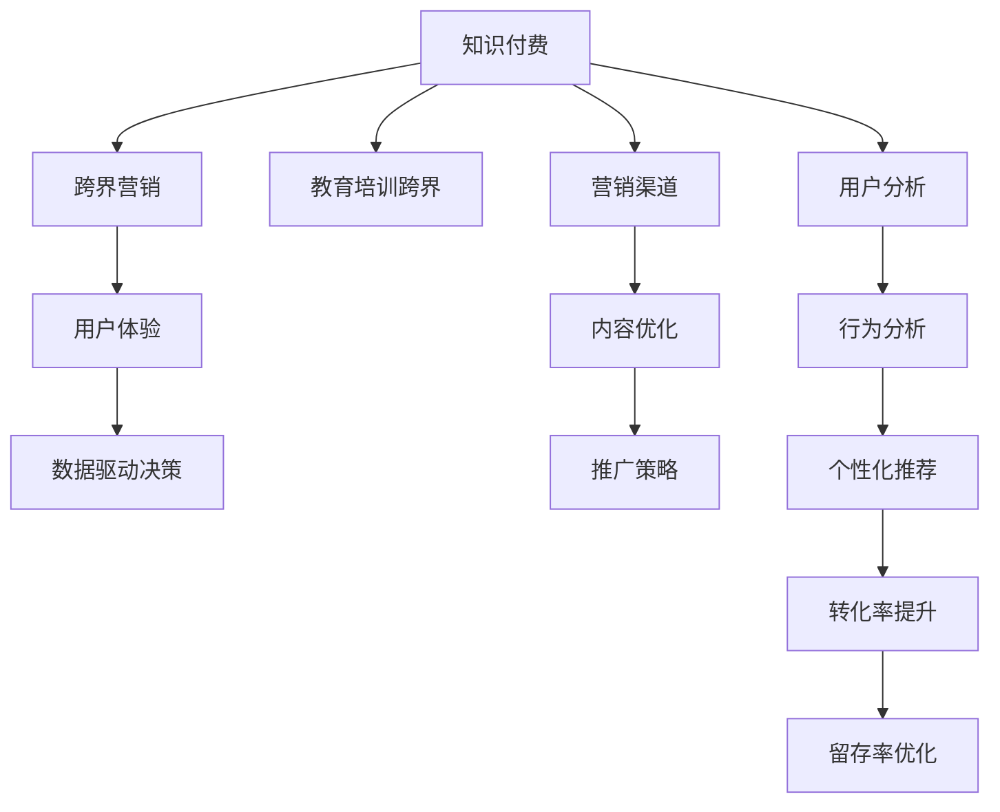

                 

# 知识付费如何实现跨界营销与教育培训跨界？

## 1. 背景介绍

### 1.1 问题由来
随着知识付费市场的不断扩展，越来越多的企业和个人开始利用知识付费模式，通过在线课程、培训讲座等方式，传播专业知识、技能和经验。然而，随着竞争的加剧，如何有效吸引用户、提升转化率，成为了知识付费企业亟需解决的问题。

在此背景下，知识付费企业开始探索跨界营销与教育培训跨界的新模式。通过结合教育培训与营销手段，知识付费企业能够更好地满足用户需求，提升自身影响力。

### 1.2 问题核心关键点
1. **跨界营销**：将营销手段与教育培训内容深度融合，通过多渠道、多形式的活动，吸引更多潜在用户，提升品牌知名度和用户粘性。
2. **教育培训跨界**：通过引入跨领域、跨行业的专业知识，丰富教育培训内容，提升课程质量，吸引更多目标用户。

## 2. 核心概念与联系

### 2.1 核心概念概述

为更好地理解知识付费跨界营销与教育培训跨界的实现方法，本节将介绍几个密切相关的核心概念：

- **知识付费**：指用户通过付费获取知识或技能的一种商业模式，包括在线课程、电子书、视频教程等形式。
- **跨界营销**：指结合不同领域的资源和手段，通过多渠道、多形式的整合营销活动，提升品牌影响力。
- **教育培训跨界**：指引入不同领域的专业知识和技能，丰富教育培训内容，提升课程价值。
- **用户体验(UX)**：指通过设计和优化产品、服务流程，提升用户满意度和使用体验，增强用户粘性。
- **数据驱动(Drive)决策**：指通过数据收集、分析和应用，指导营销和教育培训策略，提升决策精准度。

这些核心概念之间的逻辑关系可以通过以下Mermaid流程图来展示：



这个流程图展示了这个体系的主要要素和它们之间的联系：

1. 知识付费是核心，通过付费形式获取知识和技能。
2. 跨界营销与教育培训跨界，通过整合不同资源和内容，提升用户体验。
3. 用户体验和数据驱动决策，通过优化流程和利用数据分析，增强用户粘性。
4. 营销渠道、内容优化和推广策略，通过多渠道和多形式的整合营销，提升品牌影响力和转化率。
5. 用户分析和行为分析，通过深入了解用户行为和需求，优化课程内容和推广策略。

## 3. 核心算法原理 & 具体操作步骤

### 3.1 算法原理概述

知识付费跨界营销与教育培训跨界的实现，本质上是将营销和教育培训深度结合，通过多渠道、多形式的整合营销活动，提升品牌影响力和用户粘性。同时，通过引入跨领域的专业知识和技能，丰富教育培训内容，提升课程价值。

核心思想是通过营销手段吸引潜在用户，再通过教育培训内容满足用户需求，形成完整的用户旅程。在这个过程中，用户体验和数据驱动决策起着至关重要的作用。

### 3.2 算法步骤详解

基于上述理论，知识付费跨界营销与教育培训跨界的实现步骤主要包括以下几个关键步骤：

**Step 1: 数据收集与分析**
- 收集用户行为数据、课程反馈数据、社交媒体数据等，使用户画像和行为特征更加立体。
- 通过数据清洗、数据标注等技术手段，提升数据质量和分析效率。

**Step 2: 用户画像与需求分析**
- 利用机器学习算法，如聚类、分类等，构建用户画像，分析用户兴趣、需求和痛点。
- 通过用户画像，识别目标用户群体，设计有针对性的营销策略和教育培训内容。

**Step 3: 跨界内容设计**
- 引入跨领域专业知识，如金融、心理学、设计等，丰富课程内容。
- 设计跨界活动，如跨界讲座、联合课程等，增强课程的吸引力和实用性。

**Step 4: 营销策略与渠道整合**
- 设计多渠道、多形式的整合营销活动，如社交媒体推广、线上线下联动等。
- 利用广告投放、内容营销等手段，提升课程曝光率和用户参与度。

**Step 5: 教育培训优化与反馈**
- 根据用户反馈和行为数据，不断优化课程内容和教学方式，提升课程质量和用户满意度。
- 通过数据驱动决策，调整推广策略，提升转化率和留存率。

### 3.3 算法优缺点

知识付费跨界营销与教育培训跨界方法具有以下优点：
1. **提升用户粘性**：通过多渠道、多形式的整合营销活动，增强用户对知识付费平台的黏性。
2. **丰富课程内容**：引入跨领域的专业知识和技能，提升课程质量和实用价值。
3. **提高转化率**：通过精准的用户画像和需求分析，设计有针对性的营销策略，提升课程转化率。
4. **优化用户体验**：通过数据驱动决策，不断优化课程内容和推广策略，提升用户满意度。

同时，该方法也存在一定的局限性：
1. **资源投入大**：需要大量时间和资源进行数据收集、分析和用户画像构建。
2. **内容设计复杂**：跨界内容设计需要专业知识与技能整合，设计复杂且需持续迭代。
3. **技术要求高**：需要高级数据分析和机器学习技能，对技术要求较高。
4. **效果依赖数据**：数据分析和用户画像的准确性直接影响跨界营销和教育培训的效果。

尽管存在这些局限性，但就目前而言，知识付费跨界营销与教育培训跨界方法仍是最主流的方式之一，能够有效提升品牌影响力和用户转化率。

### 3.4 算法应用领域

知识付费跨界营销与教育培训跨界方法在多个领域中得到广泛应用：

- **在线教育**：通过跨界内容设计和整合营销活动，提升课程质量和用户参与度。
- **职业培训**：引入跨领域的专业知识，丰富职业培训课程内容，提升实战能力。
- **企业培训**：结合跨界营销手段，提升企业内部培训的覆盖率和效果。
- **个人成长**：通过跨界内容，如跨界讲座、联合课程等，促进个人技能提升和职业发展。

除了这些传统领域外，跨界营销与教育培训跨界方法也被创新性地应用到更多场景中，如社交电商、健康管理、兴趣爱好等，为知识付费和教育培训带来了新的创新点和增长点。

## 4. 数学模型和公式 & 详细讲解 & 举例说明

### 4.1 数学模型构建

在知识付费跨界营销与教育培训跨界的实践中，我们可以使用以下数学模型来描述其运作过程：

- **用户画像模型**：通过聚类算法对用户行为数据进行分析，构建用户画像，表示为 $\mathbf{U} = (u_1, u_2, \ldots, u_n)$，其中 $u_i$ 表示第 $i$ 个用户的行为特征向量。

- **需求分析模型**：通过分类算法对用户需求进行分类，确定用户感兴趣的主题，表示为 $\mathbf{D} = (d_1, d_2, \ldots, d_m)$，其中 $d_j$ 表示第 $j$ 个用户感兴趣的主题。

- **营销效果模型**：通过回归分析评估营销活动对用户转化率和留存率的影响，表示为 $C = (c_1, c_2, \ldots, c_n)$，其中 $c_i$ 表示第 $i$ 个用户参与营销活动后的转化率和留存率。

### 4.2 公式推导过程

以下我们以用户画像模型和需求分析模型为例，推导其数学公式。

**用户画像模型**：
假设用户行为数据包括浏览、搜索、购买、评论等行为，表示为 $X = (x_1, x_2, \ldots, x_n)$，其中 $x_i$ 表示第 $i$ 个用户的行为记录。
利用K-means聚类算法，对行为数据进行聚类，得到用户画像 $\mathbf{U} = (u_1, u_2, \ldots, u_n)$，其中 $u_i$ 表示第 $i$ 个用户的聚类中心。

**需求分析模型**：
假设用户对课程的需求数据包括评分、评价、点赞等，表示为 $Y = (y_1, y_2, \ldots, y_m)$，其中 $y_i$ 表示第 $i$ 个用户对课程的需求评分。
利用SVM分类算法，对需求数据进行分类，得到用户需求 $\mathbf{D} = (d_1, d_2, \ldots, d_m)$，其中 $d_j$ 表示第 $j$ 个用户感兴趣的主题。

### 4.3 案例分析与讲解

以在线教育平台为例，展示知识付费跨界营销与教育培训跨界的具体应用：

**案例背景**：某在线教育平台希望通过跨界营销与教育培训跨界提升品牌影响力和用户粘性。

**数据分析**：
1. 收集平台用户的行为数据，包括浏览、搜索、购买、评论等。
2. 使用K-means聚类算法，对用户行为数据进行聚类，得到用户画像 $\mathbf{U} = (u_1, u_2, \ldots, u_n)$。
3. 收集用户对课程的评分、评价、点赞等需求数据，使用SVM分类算法，对需求数据进行分类，得到用户需求 $\mathbf{D} = (d_1, d_2, \ldots, d_m)$。

**内容设计**：
1. 根据用户画像，设计跨界活动，如跨界讲座、联合课程等。
2. 引入跨领域专业知识，如金融、心理学、设计等，丰富课程内容。

**营销策略**：
1. 利用广告投放、内容营销等手段，提升课程曝光率和用户参与度。
2. 设计多渠道、多形式的整合营销活动，如社交媒体推广、线上线下联动等。

**教育培训优化**：
1. 根据用户反馈和行为数据，不断优化课程内容和教学方式。
2. 通过数据驱动决策，调整推广策略，提升转化率和留存率。

通过上述步骤，平台能够有效提升品牌影响力和用户粘性，同时也丰富了课程内容，提升了用户满意度和转化率。

## 5. 项目实践：代码实例和详细解释说明

### 5.1 开发环境搭建

在进行知识付费跨界营销与教育培训跨界实践前，我们需要准备好开发环境。以下是使用Python进行K-means聚类和SVM分类的环境配置流程：

1. 安装Anaconda：从官网下载并安装Anaconda，用于创建独立的Python环境。

2. 创建并激活虚拟环境：
```bash
conda create -n pythoenv python=3.8 
conda activate pythoenv
```

3. 安装Scikit-Learn和Scikit-cluster：
```bash
pip install scikit-learn scikit-cluster
```

4. 安装K-means和SVM算法库：
```bash
pip install sklearn
```

完成上述步骤后，即可在`pythoenv`环境中开始项目实践。

### 5.2 源代码详细实现

下面以用户画像构建和需求分析为例，给出K-means聚类和SVM分类的Python代码实现。

```python
from sklearn.cluster import KMeans
from sklearn.svm import SVC
import pandas as pd

# 读取用户行为数据
data = pd.read_csv('user_behavior.csv')

# 用户行为数据
X = data[['浏览时间', '购买次数', '搜索次数', '评论次数']]

# 使用K-means算法对用户行为数据进行聚类
kmeans = KMeans(n_clusters=5)
kmeans.fit(X)
user_profiles = kmeans.labels_

# 读取用户需求数据
demand_data = pd.read_csv('user_demand.csv')

# 用户需求数据
Y = demand_data['评分']

# 使用SVM对用户需求进行分类
svm = SVC()
svm.fit(X, Y)
user_themes = svm.predict(user_profiles)

# 输出用户画像和需求分析结果
print('用户画像：', user_profiles)
print('用户需求：', user_themes)
```

### 5.3 代码解读与分析

让我们再详细解读一下关键代码的实现细节：

**用户画像构建**：
1. 使用`pd.read_csv`方法读取用户行为数据，存放在变量`X`中。
2. 使用`KMeans`算法，对用户行为数据进行聚类，得到用户画像，存放在变量`user_profiles`中。
3. 输出用户画像结果，以供后续内容设计参考。

**需求分析**：
1. 使用`pd.read_csv`方法读取用户需求数据，存放在变量`Y`中。
2. 使用`SVC`算法，对用户需求数据进行分类，得到用户需求，存放在变量`user_themes`中。
3. 输出用户需求结果，以供后续营销策略设计参考。

**营销策略设计**：
1. 根据用户画像和需求分析结果，设计跨界活动和课程内容。
2. 利用广告投放、内容营销等手段，提升课程曝光率和用户参与度。

**教育培训优化**：
1. 根据用户反馈和行为数据，不断优化课程内容和教学方式。
2. 通过数据驱动决策，调整推广策略，提升转化率和留存率。

通过上述步骤，可以实现知识付费跨界营销与教育培训跨界的方法，提升平台的用户粘性和品牌影响力。

## 6. 实际应用场景

### 6.1 智能客服系统

基于知识付费跨界营销与教育培训跨界的理念，智能客服系统可以引入跨界营销手段，提升用户参与度和满意度。具体而言：

- 平台可以在智能客服系统中引入跨界讲座、联合课程等跨界活动，增加用户粘性。
- 通过数据分析和用户画像，定制个性化的智能客服策略，提升用户满意度。

### 6.2 金融理财平台

在金融理财平台中，通过跨界营销与教育培训跨界，可以提升用户理财知识和技能，增强用户粘性。具体而言：

- 平台可以引入跨领域的专业知识，如金融、投资、税务等，设计丰富多样的理财课程。
- 通过多渠道、多形式的整合营销活动，提升课程曝光率和用户参与度。

### 6.3 健康管理平台

健康管理平台可以通过跨界营销与教育培训跨界，提升用户健康意识和技能，增强用户粘性。具体而言：

- 平台可以引入跨领域的专业知识，如营养、运动、心理等，设计健康管理课程。
- 通过跨界讲座、联合课程等活动，提升用户健康意识和参与度。

### 6.4 未来应用展望

随着知识付费跨界营销与教育培训跨界方法的发展，未来的应用场景将更加广泛，为不同行业带来新的增长点。

- **在线教育**：通过跨界内容设计和整合营销活动，提升课程质量和用户参与度。
- **职业培训**：引入跨领域的专业知识，丰富职业培训课程内容，提升实战能力。
- **企业培训**：结合跨界营销手段，提升企业内部培训的覆盖率和效果。
- **个人成长**：通过跨界内容，如跨界讲座、联合课程等，促进个人技能提升和职业发展。

此外，在社交电商、健康管理、兴趣爱好等更多领域，跨界营销与教育培训跨界方法也将得到广泛应用，为知识付费和教育培训带来新的创新点和增长点。

## 7. 工具和资源推荐

### 7.1 学习资源推荐

为了帮助开发者系统掌握知识付费跨界营销与教育培训跨界的理论基础和实践技巧，这里推荐一些优质的学习资源：

1. 《知识付费商业模型与实践》系列博文：由知识付费专家撰写，深入浅出地介绍了知识付费的商业模型、市场分析和用户行为研究等前沿话题。

2. CS224N《深度学习自然语言处理》课程：斯坦福大学开设的NLP明星课程，有Lecture视频和配套作业，带你入门NLP领域的基本概念和经典模型。

3. 《知识付费用户行为分析》书籍：详细介绍了知识付费用户行为数据的收集、分析和应用，是实践知识付费跨界营销与教育培训跨界的重要工具。

4. Kaggle在线竞赛：提供丰富的数据集和竞赛任务，通过实践锻炼数据分析和机器学习技能，提升解决实际问题的能力。

5. Coursera《机器学习》课程：由斯坦福大学Andrew Ng教授主讲，系统讲解了机器学习和数据分析的理论与实践。

通过对这些资源的学习实践，相信你一定能够快速掌握知识付费跨界营销与教育培训跨界的精髓，并用于解决实际的业务问题。

### 7.2 开发工具推荐

高效的开发离不开优秀的工具支持。以下是几款用于知识付费跨界营销与教育培训跨界开发的常用工具：

1. Python：作为数据科学和机器学习的主要语言，Python提供了丰富的数据处理和分析库，如Pandas、Scikit-learn等。
2. R：适合数据可视化和统计分析，广泛应用于数据科学和商业分析领域。
3. Jupyter Notebook：支持Python、R等语言，能够实现高效的代码开发和数据探索。
4. Tableau：数据可视化工具，能够将复杂的数据分析结果以直观的图表形式呈现，方便业务决策。
5. Google Analytics：在线分析工具，能够实时监控和分析网站流量和用户行为，优化营销策略。

合理利用这些工具，可以显著提升知识付费跨界营销与教育培训跨界任务的开发效率，加快创新迭代的步伐。

### 7.3 相关论文推荐

知识付费跨界营销与教育培训跨界技术的发展源于学界的持续研究。以下是几篇奠基性的相关论文，推荐阅读：

1. "Knowledge Peening: A New Paradigm for Knowledge Sharing"：探讨了知识付费的商业模型和市场分析，提出了知识付费跨界营销的新范式。
2. "User Behavioral Analytics for Online Education"：介绍了在线教育平台用户行为数据的收集、分析和应用，提供了用户画像和需求分析的方法。
3. "Cross-Domain Knowledge Transfer in Online Learning"：研究了跨领域知识在在线学习中的应用，展示了如何通过跨界内容提升课程价值。
4. "Effective Cross-Promotion Strategies for E-Learning Platforms"：探讨了在线教育平台跨界营销的手段和策略，提供了多渠道、多形式的整合营销方法。
5. "Machine Learning in Financial Education"：研究了机器学习在金融理财教育中的应用，展示了如何通过数据分析提升用户理财技能。

这些论文代表了大知识付费跨界营销与教育培训跨界技术的发展脉络。通过学习这些前沿成果，可以帮助研究者把握学科前进方向，激发更多的创新灵感。

## 8. 总结：未来发展趋势与挑战

### 8.1 总结

本文对知识付费跨界营销与教育培训跨界的实现方法进行了全面系统的介绍。首先阐述了知识付费和跨界营销的概念和意义，明确了跨界营销与教育培训跨界在提升品牌影响力和用户粘性方面的独特价值。其次，从原理到实践，详细讲解了知识付费跨界营销与教育培训跨界的数学模型和操作步骤，给出了具体的代码实现。同时，本文还广泛探讨了该方法在多个行业领域的应用前景，展示了其广阔的潜力和应用价值。

通过本文的系统梳理，可以看到，知识付费跨界营销与教育培训跨界方法正在成为知识付费领域的重要范式，极大地拓展了知识付费平台的市场和用户基础。受益于多渠道、多形式的整合营销活动，知识付费平台能够在激烈的市场竞争中脱颖而出，赢得更多的用户信任和支持。

### 8.2 未来发展趋势

展望未来，知识付费跨界营销与教育培训跨界技术将呈现以下几个发展趋势：

1. **数据驱动决策**：随着大数据和机器学习技术的发展，知识付费平台将更加依赖数据驱动决策，优化营销和教育培训策略。
2. **个性化推荐**：利用用户画像和需求分析，实现个性化推荐，提升用户体验和转化率。
3. **跨领域合作**：与其他行业领域的专家和机构合作，引入跨领域的专业知识，丰富教育培训内容。
4. **多渠道整合**：通过多渠道、多形式的整合营销活动，提升品牌影响力和用户粘性。
5. **持续优化**：利用用户反馈和行为数据，不断优化课程内容和推广策略，提升用户满意度和转化率。

以上趋势凸显了知识付费跨界营销与教育培训跨界技术的广阔前景。这些方向的探索发展，必将进一步提升知识付费平台的用户基础和品牌影响力，为知识付费和教育培训带来新的增长点。

### 8.3 面临的挑战

尽管知识付费跨界营销与教育培训跨界方法已经取得了显著成果，但在迈向更加智能化、普适化应用的过程中，它仍面临着诸多挑战：

1. **数据质量和隐私**：数据质量和用户隐私是知识付费跨界营销与教育培训跨界的重要基础，但数据收集和处理过程中可能存在数据泄露和隐私侵犯的风险。
2. **内容质量控制**：跨界内容设计和引入需要严格的质量控制，确保内容的科学性和实用性。
3. **用户参与度**：跨界营销和教育培训跨界的效果很大程度上取决于用户参与度，如何设计有吸引力的活动和内容，提升用户参与度，仍是一大挑战。
4. **技术实现难度**：跨界营销与教育培训跨界方法涉及多领域知识的整合，技术实现难度较大。
5. **市场竞争激烈**：知识付费市场竞争激烈，如何在众多平台中脱颖而出，提升品牌影响力和用户粘性，仍需不断创新和优化。

尽管存在这些挑战，但知识付费跨界营销与教育培训跨界方法仍具有广阔的市场前景和发展空间，相信在学界和产业界的共同努力下，这些挑战终将逐一被克服。

### 8.4 研究展望

面对知识付费跨界营销与教育培训跨界所面临的挑战，未来的研究需要在以下几个方面寻求新的突破：

1. **数据隐私保护**：研究如何保护用户隐私和数据安全，确保数据收集和使用过程中的合规性。
2. **内容质量提升**：开发内容质量控制的算法和技术手段，提升跨界内容的设计和引入效率。
3. **用户参与度提升**：设计有吸引力的跨界活动和内容，提升用户参与度和满意度。
4. **技术自动化**：开发自动化的数据分析和机器学习工具，降低技术实现难度，提升效率。
5. **市场竞争策略**：研究跨界营销与教育培训跨界的市场竞争策略，提升品牌影响力和用户粘性。

这些研究方向的研究成果将推动知识付费跨界营销与教育培训跨界方法不断进步，为知识付费和教育培训带来更多的创新和价值。

## 9. 附录：常见问题与解答

**Q1：知识付费跨界营销与教育培训跨界方法适用于所有知识付费平台吗？**

A: 知识付费跨界营销与教育培训跨界方法在大多数知识付费平台上都能取得不错的效果，特别是对于数据量较大的平台。但对于一些用户量较小的平台，数据收集和分析的难度较大，需要投入更多资源。

**Q2：如何设计有吸引力的跨界活动？**

A: 设计有吸引力的跨界活动需要考虑以下几点：
1. 结合用户兴趣和需求，设计有针对性的活动内容。
2. 采用多样化的活动形式，如讲座、直播、互动问答等，增强用户参与感。
3. 利用社交媒体和在线平台进行推广，扩大活动影响力。
4. 提供奖品和激励，如优惠券、积分等，吸引用户参与。

**Q3：如何评估跨界营销与教育培训跨界的效果？**

A: 评估跨界营销与教育培训跨界的效果需要综合考虑以下指标：
1. 用户参与度：通过统计活动参与人数、评论数量等指标，评估用户参与度。
2. 用户转化率：统计活动前后的用户转化率，评估活动对转化率的影响。
3. 用户满意度：通过用户反馈和评价，评估用户对活动和内容的满意度。
4. 品牌影响力：通过社交媒体的曝光量和互动量等指标，评估品牌影响力的提升效果。

通过综合评估这些指标，可以全面了解跨界营销与教育培训跨界的效果，指导后续的优化和改进。

**Q4：如何保护用户隐私和数据安全？**

A: 保护用户隐私和数据安全是知识付费跨界营销与教育培训跨界的重要基础，具体措施包括：
1. 数据匿名化：对用户数据进行匿名化处理，确保用户隐私保护。
2. 数据加密：采用加密技术，保护数据在传输和存储过程中的安全性。
3. 合规性审查：确保数据收集和使用过程符合相关法律法规和隐私政策。
4. 用户授权：明确告知用户数据收集和使用目的，获得用户授权。

通过这些措施，可以提升数据安全和用户隐私保护的保障水平，增强用户信任和平台信誉。

**Q5：如何提高跨界内容的质量控制？**

A: 提高跨界内容的质量控制需要建立多层次的审核机制，具体措施包括：
1. 内容专家评审：邀请领域专家对内容进行评审，确保内容的科学性和实用性。
2. 用户反馈机制：建立用户反馈渠道，收集用户对内容的意见和建议，不断改进内容质量。
3. 内容优化算法：开发内容优化算法，提升跨界内容的设计和引入效率。

通过这些措施，可以提升跨界内容的质量和用户满意度，增强平台的品牌影响力和用户粘性。

---

作者：禅与计算机程序设计艺术 / Zen and the Art of Computer Programming

