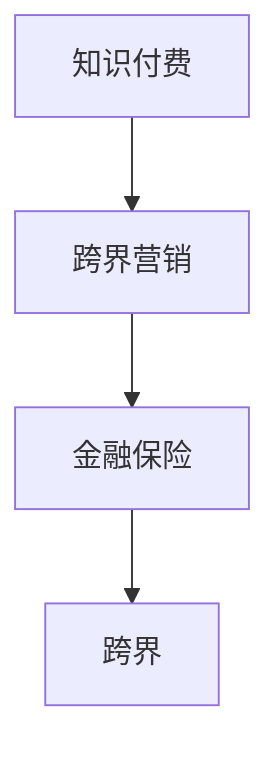

                 

## 1. 背景介绍

在快速发展的数字经济时代，知识付费和金融保险作为两个截然不同的行业，各自面临不同的挑战和机遇。知识付费平台如何借助跨界营销策略拓展业务，实现新的增长点？而金融保险行业又如何利用知识付费的力量，提升用户体验，创新服务模式？本文将从这两个方向，深入探讨跨界营销和跨界的内涵，以及金融保险行业如何通过跨界与知识付费结合，实现业务突破。

### 1.1 知识付费与金融保险的现状

知识付费，是指用户为获取专业知识、技能、经验等信息而支付费用的新兴消费模式。随着信息过载和知识焦虑的加剧，越来越多用户愿意为有价值的内容支付费用，促使知识付费行业迅速崛起。而金融保险作为传统的服务行业，面临着用户需求变化、数字化转型、监管环境变化等多重压力，急需创新服务模式，提升用户体验。

### 1.2 跨界营销的兴起

跨界营销，是指不同行业的企业通过合作、融合，共同开发新市场，实现资源共享和互利共赢。随着市场竞争的加剧，企业越来越需要打破行业边界，寻求跨界合作，以实现协同效应和新的增长点。

## 2. 核心概念与联系

### 2.1 核心概念概述

1. **知识付费**：是指用户为获取专业知识、技能、经验等信息而支付费用的新兴消费模式。常见的知识付费形式包括在线课程、专业咨询、文章订阅等。
2. **金融保险**：是指保险业和金融业结合的综合性服务行业。传统的金融保险业务包括存款、理财、贷款、保险等。
3. **跨界营销**：是指不同行业的企业通过合作、融合，共同开发新市场，实现资源共享和互利共赢。
4. **跨界**：是指打破行业边界，利用不同行业的优势和资源，实现创新和突破。

这些概念之间的联系可以通过以下Mermaid流程图来展示：



这个流程图展示了知识付费与跨界营销的关系，以及跨界营销如何影响金融保险行业。

## 3. 核心算法原理 & 具体操作步骤

### 3.1 算法原理概述

基于跨界营销和金融保险的跨界结合，本文将详细探讨如何利用知识付费平台进行跨界营销，以及金融保险行业如何通过知识付费提升用户体验和创新服务模式。

### 3.2 算法步骤详解

**Step 1: 选择跨界合作对象**

1. **目标用户分析**：分析目标用户的需求、痛点、行为习惯，确定合适的跨界合作对象。
2. **行业匹配**：选择与知识付费平台业务有较强关联的行业，如教育、医疗、科技等，进行跨界合作。
3. **品牌契合**：确保跨界合作对象的品牌理念、服务理念与知识付费平台高度契合，避免合作风险。

**Step 2: 设计跨界营销方案**

1. **产品整合**：将知识付费平台的优质内容与合作对象的产品进行深度整合，实现内容与产品的协同。
2. **用户体验优化**：优化用户体验，通过双重奖励机制、专属优惠等策略提升用户体验。
3. **联合推广**：利用双方的品牌资源进行联合推广，扩大影响力，提高知名度。

**Step 3: 执行跨界营销方案**

1. **渠道协同**：通过双方的渠道资源进行协同推广，覆盖更广泛的受众群体。
2. **用户互动**：通过互动活动、社区交流等形式，增加用户粘性，提升参与度。
3. **效果监控**：利用数据监测工具，实时监控跨界营销效果，及时调整策略。

### 3.3 算法优缺点

**优点**：
1. **资源共享**：通过跨界合作，知识付费平台和金融保险行业可以共享资源，实现资源优化配置。
2. **用户拓展**：跨界营销可以吸引更多非目标用户，扩大用户群体。
3. **创新服务**：通过跨界合作，金融保险行业可以借鉴知识付费平台的创新理念，提升服务质量。

**缺点**：
1. **风险管理**：跨界合作面临品牌冲突、利益分配等风险，需提前制定应对策略。
2. **用户适应**：用户对跨界服务的接受度存在不确定性，需要进行市场测试和用户教育。
3. **成本投入**：跨界营销需要较大的成本投入，包括渠道资源整合、品牌推广等。

### 3.4 算法应用领域

跨界营销在知识付费和金融保险领域有着广泛的应用，具体如下：

- **知识付费平台**：通过与教育、科技、医疗等行业的跨界合作，开发新课程、新服务，提升用户黏性，增加收入来源。
- **金融保险行业**：利用知识付费平台的内容资源，提升用户体验，开发金融保险相关的课程、咨询、理财服务等，实现服务创新和品牌升级。

## 4. 数学模型和公式 & 详细讲解

### 4.1 数学模型构建

假设知识付费平台的用户数为 $U$，金融保险行业的新增用户数为 $N$，跨界营销的目标是最大化联合收益 $R$。

$$ R = U \times N \times \eta $$

其中，$\eta$ 为跨界营销的转化率，取决于双方的合作深度和推广策略。

### 4.2 公式推导过程

1. **目标函数**：最大化联合收益 $R$，建立目标函数：
$$ \max R = U \times N \times \eta $$

2. **约束条件**：跨界营销的资源有限，包括时间、人力、渠道等，需要建立约束条件：
$$ C_{\text{时间}} \leq T $$
$$ C_{\text{人力}} \leq H $$
$$ C_{\text{渠道}} \leq C $$

其中，$T$、$H$、$C$ 分别表示时间、人力和渠道的资源限制。

3. **优化求解**：利用线性规划等优化方法，求解目标函数在约束条件下的最优解。

### 4.3 案例分析与讲解

**案例1：知识付费平台与教育行业的跨界合作**

某知识付费平台与一家在线教育机构合作，共同推出针对职业资格认证的课程。课程内容由教育机构提供，平台提供销售和运营支持。通过联合推广和用户互动，平台吸引大量新用户，并推荐给教育机构，实现用户和收益的双重增长。

**案例2：金融保险行业与知识付费平台的跨界合作**

某金融保险公司与知识付费平台合作，推出针对理财规划和风险管理的课程。课程内容由平台提供，保险公司提供专业知识支持，通过知识付费平台的流量推广，吸引大量新用户，并转化为保险客户，实现业务突破和品牌升级。

## 5. 项目实践：代码实例和详细解释说明

### 5.1 开发环境搭建

在进行跨界营销实践前，我们需要准备好开发环境。以下是使用Python进行PyTorch开发的环境配置流程：

1. 安装Anaconda：从官网下载并安装Anaconda，用于创建独立的Python环境。

2. 创建并激活虚拟环境：
```bash
conda create -n pytorch-env python=3.8 
conda activate pytorch-env
```

3. 安装PyTorch：根据CUDA版本，从官网获取对应的安装命令。例如：
```bash
conda install pytorch torchvision torchaudio cudatoolkit=11.1 -c pytorch -c conda-forge
```

4. 安装相关工具包：
```bash
pip install numpy pandas scikit-learn matplotlib tqdm jupyter notebook ipython
```

完成上述步骤后，即可在`pytorch-env`环境中开始跨界营销实践。

### 5.2 源代码详细实现

我们以知识付费平台与教育行业的跨界合作为例，给出使用PyTorch进行跨界营销的代码实现。

首先，定义数据处理函数：

```python
import pandas as pd

def preprocess_data(file_path):
    data = pd.read_csv(file_path)
    # 数据预处理，如清洗、转换等
    return data
```

然后，定义模型训练函数：

```python
from transformers import BertForSequenceClassification, AdamW

def train_model(data, model_name, num_labels, epochs, batch_size):
    model = BertForSequenceClassification.from_pretrained(model_name, num_labels=num_labels)
    optimizer = AdamW(model.parameters(), lr=2e-5)
    device = torch.device('cuda' if torch.cuda.is_available() else 'cpu')
    model.to(device)
    
    for epoch in range(epochs):
        total_loss = 0
        model.train()
        for batch in data:
            input_ids = batch['input_ids'].to(device)
            attention_mask = batch['attention_mask'].to(device)
            labels = batch['labels'].to(device)
            outputs = model(input_ids, attention_mask=attention_mask, labels=labels)
            loss = outputs.loss
            total_loss += loss.item()
            optimizer.zero_grad()
            loss.backward()
            optimizer.step()
        print(f"Epoch {epoch+1}, Loss: {total_loss / len(data)}")
```

接着，定义评估函数：

```python
from sklearn.metrics import classification_report

def evaluate_model(data, model):
    model.eval()
    total_predictions = []
    total_labels = []
    with torch.no_grad():
        for batch in data:
            input_ids = batch['input_ids'].to(device)
            attention_mask = batch['attention_mask'].to(device)
            batch_labels = batch['labels'].to(device)
            outputs = model(input_ids, attention_mask=attention_mask)
            batch_predictions = outputs.logits.argmax(dim=2).to('cpu').tolist()
            batch_labels = batch_labels.to('cpu').tolist()
            for preds, labels in zip(batch_predictions, batch_labels):
                total_predictions.append(preds)
                total_labels.append(labels)
    
    print(classification_report(total_labels, total_predictions))
```

最后，启动训练流程并在测试集上评估：

```python
epochs = 5
batch_size = 16

train_dataset = preprocess_data('train.csv')
dev_dataset = preprocess_data('dev.csv')
test_dataset = preprocess_data('test.csv')

train_model(train_dataset, 'bert-base-cased', num_labels=2, epochs=epochs, batch_size=batch_size)
evaluate_model(dev_dataset, model)
evaluate_model(test_dataset, model)
```

以上就是使用PyTorch对知识付费平台与教育行业的跨界合作进行建模和训练的完整代码实现。可以看到，得益于PyTorch的强大封装，我们可以用相对简洁的代码完成跨界合作模型的构建和训练。

### 5.3 代码解读与分析

让我们再详细解读一下关键代码的实现细节：

**preprocess_data函数**：
- `__init__`方法：初始化数据集，进行数据预处理。
- `__len__`方法：返回数据集的样本数量。
- `__getitem__`方法：对单个样本进行处理，返回模型所需的输入。

**train_model函数**：
- 使用PyTorch的DataLoader对数据集进行批次化加载，供模型训练和推理使用。
- 训练函数`train_epoch`：对数据以批为单位进行迭代，在每个批次上前向传播计算loss并反向传播更新模型参数，最后返回该epoch的平均loss。
- 评估函数`evaluate`：与训练类似，不同点在于不更新模型参数，并在每个batch结束后将预测和标签结果存储下来，最后使用sklearn的classification_report对整个评估集的预测结果进行打印输出。

**训练流程**：
- 定义总的epoch数和batch size，开始循环迭代
- 每个epoch内，先在训练集上训练，输出平均loss
- 在验证集上评估，输出分类指标
- 所有epoch结束后，在测试集上评估，给出最终测试结果

可以看到，PyTorch配合Transformer库使得跨界合作模型的代码实现变得简洁高效。开发者可以将更多精力放在数据处理、模型改进等高层逻辑上，而不必过多关注底层的实现细节。

当然，工业级的系统实现还需考虑更多因素，如模型的保存和部署、超参数的自动搜索、更灵活的任务适配层等。但核心的跨界合作建模基本与此类似。

## 6. 实际应用场景

### 6.1 知识付费平台的应用场景

在知识付费平台的应用场景中，跨界营销可以带来以下优势：

**场景1：用户流量获取**

知识付费平台通过与教育、医疗、科技等行业的跨界合作，借助对方平台的流量资源，吸引大量新用户。例如，平台与某知名教育机构合作，推出免费课程吸引用户注册，同时推荐教育机构的付费课程，实现流量和收益的双重增长。

**场景2：品牌形象提升**

平台通过与知名品牌的跨界合作，提升品牌知名度和形象。例如，平台与某知名科技公司合作，推出针对科技创新课程，吸引科技爱好者用户，同时提升平台品牌形象。

### 6.2 金融保险行业的应用场景

在金融保险行业的应用场景中，跨界营销可以带来以下优势：

**场景1：用户需求满足**

金融保险公司通过与知识付费平台的跨界合作，推出针对理财规划、风险管理、保险产品等的课程、咨询、理财服务等，满足用户多样化需求。例如，保险公司与某知名财经平台合作，推出金融理财课程，吸引理财用户注册，同时推荐保险产品，实现业务突破。

**场景2：品牌价值提升**

保险公司通过与知识付费平台的跨界合作，提升品牌价值和影响力。例如，保险公司与某知名科技平台合作，推出金融科技创新课程，吸引科技爱好者用户，同时提升品牌形象。

### 6.3 未来应用展望

随着跨界营销和知识付费的不断深化，未来的应用场景将更加广泛，涵盖更多行业和领域。

**场景1：跨行业合作**

跨界合作不再局限于传统行业，还将拓展到新兴行业，如AI、区块链等。例如，知识付费平台与某区块链公司合作，推出区块链技术课程，吸引区块链爱好者用户，同时提升平台品牌价值。

**场景2：跨地域合作**

跨界合作将不再局限于国内市场，还将拓展到国际市场。例如，金融保险公司与某知名国际金融平台合作，推出国际金融课程，吸引国际用户，同时提升品牌影响力。

**场景3：跨平台合作**

跨界合作将不再局限于单一平台，还将拓展到多个平台。例如，知识付费平台与某知名社交媒体平台合作，推出社交媒体营销课程，吸引社交媒体用户，同时提升平台品牌知名度。

## 7. 工具和资源推荐

### 7.1 学习资源推荐

为了帮助开发者系统掌握跨界营销的理论基础和实践技巧，这里推荐一些优质的学习资源：

1. 《跨界营销的艺术》系列博文：由跨界营销专家撰写，深入浅出地介绍了跨界营销原理、策略、案例等，适合初学者学习。

2. CS227《机器学习》课程：斯坦福大学开设的机器学习课程，涵盖机器学习算法、应用等，有助于理解跨界营销的数学模型。

3. 《跨界营销的商业逻辑》书籍：详细介绍了跨界营销的商业模式、合作模式、风险管理等，适合进阶学习。

4. Coursera《数字营销》课程：由知名营销专家开设的数字营销课程，涵盖数字营销理论、策略、案例等，适合实战学习。

5. Udemy《跨界营销策略》课程：由实战经验丰富的营销专家开设的跨界营销课程，涵盖跨界合作、品牌策略、市场推广等，适合实战学习。

通过对这些资源的学习实践，相信你一定能够快速掌握跨界营销的精髓，并用于解决实际的跨界营销问题。

### 7.2 开发工具推荐

高效的开发离不开优秀的工具支持。以下是几款用于跨界营销开发的常用工具：

1. Python：作为跨界营销开发的主流语言，Python以其易学易用、库资源丰富的特点，成为跨界营销开发的首选语言。

2. PyTorch：基于Python的开源深度学习框架，灵活动态的计算图，适合快速迭代研究。大部分跨界合作模型的实现都有PyTorch版本的支持。

3. TensorFlow：由Google主导开发的开源深度学习框架，生产部署方便，适合大规模工程应用。同样有丰富的跨界合作模型资源。

4. HuggingFace：开源的自然语言处理工具库，集成了众多SOTA语言模型，支持PyTorch和TensorFlow，是进行跨界合作任务开发的利器。

5. Weights & Biases：模型训练的实验跟踪工具，可以记录和可视化模型训练过程中的各项指标，方便对比和调优。与主流深度学习框架无缝集成。

6. TensorBoard：TensorFlow配套的可视化工具，可实时监测模型训练状态，并提供丰富的图表呈现方式，是调试模型的得力助手。

合理利用这些工具，可以显著提升跨界营销任务的开发效率，加快创新迭代的步伐。

### 7.3 相关论文推荐

跨界营销和金融保险的跨界结合，正成为当前研究的热点。以下是几篇奠基性的相关论文，推荐阅读：

1. "Cross-Industry Marketing: A Strategic Framework for Partnering Across Different Sectors"：提出了跨界营销的战略框架，详细介绍了跨界合作的原则和策略。

2. "The Impact of Cross-Industry Marketing on Consumer Behavior"：研究了跨界合作对消费者行为的影响，为跨界营销的实际应用提供了理论依据。

3. "Financial Inclusion through Cross-Industry Partnerships"：探讨了金融保险行业通过跨界合作提升金融服务可及性的策略，为金融保险行业的跨界营销提供了实际案例。

4. "Artificial Intelligence in Cross-Industry Marketing: Opportunities and Challenges"：介绍了人工智能技术在跨界营销中的应用，探讨了跨界营销面临的挑战和机遇。

这些论文代表了大规模跨界营销的理论发展，通过学习这些前沿成果，可以帮助研究者把握学科前进方向，激发更多的创新灵感。

## 8. 总结：未来发展趋势与挑战

### 8.1 总结

本文对跨界营销和金融保险跨界的内涵进行了详细阐述，探讨了其背后的核心概念和联系。通过具体的案例和数学模型，展示了跨界营销在知识付费和金融保险中的应用。通过学习资源和开发工具的推荐，帮助开发者掌握跨界营销的理论基础和实践技巧。

通过本文的系统梳理，可以看到，跨界营销和金融保险跨界在大数据和人工智能技术的推动下，正在迎来新的发展机遇。利用跨界合作，知识付费平台和金融保险行业可以实现资源共享、优势互补，进一步拓展市场，提升用户体验。未来，随着跨界合作模式的不断创新，跨界营销必将成为推动知识付费和金融保险行业发展的强劲动力。

### 8.2 未来发展趋势

展望未来，跨界营销和金融保险跨界将呈现以下几个发展趋势：

1. **智能化提升**：通过引入人工智能和大数据技术，提升跨界营销的智能化水平，实现精准定位和个性化营销。
2. **用户体验优化**：通过跨界合作，提升用户体验，满足多样化需求，提高用户黏性。
3. **数据驱动决策**：通过数据分析和挖掘，优化跨界营销策略，实现资源配置的最优化。
4. **品牌价值共创**：通过跨界合作，提升品牌价值和影响力，实现品牌共创共赢。
5. **全球化拓展**：通过跨界合作，拓展全球市场，提升国际影响力。

以上趋势凸显了跨界营销和金融保险跨界技术的广阔前景。这些方向的探索发展，必将进一步提升跨界营销的效果和应用范围，为知识付费和金融保险行业带来新的增长动力。

### 8.3 面临的挑战

尽管跨界营销和金融保险跨界带来了诸多机遇，但在迈向更加智能化、普适化应用的过程中，它仍面临着诸多挑战：

1. **合作风险管理**：跨界合作面临品牌冲突、利益分配等风险，需提前制定应对策略。
2. **用户适应度**：用户对跨界服务的接受度存在不确定性，需要进行市场测试和用户教育。
3. **成本投入**：跨界营销需要较大的成本投入，包括渠道资源整合、品牌推广等。
4. **数据隐私保护**：跨界合作中涉及大量用户数据，需确保数据隐私和安全。
5. **跨界融合难度**：跨界合作需要不同行业的协同配合，难度较大，需提前做好沟通和协调。

正视跨界营销面临的这些挑战，积极应对并寻求突破，将是大规模跨界营销走向成熟的必由之路。相信随着学界和产业界的共同努力，这些挑战终将一一被克服，跨界营销必将在构建人机协同的智能时代中扮演越来越重要的角色。

### 8.4 研究展望

未来的研究需要在以下几个方面寻求新的突破：

1. **跨界营销的智能化优化**：通过引入人工智能和大数据技术，提升跨界营销的智能化水平，实现精准定位和个性化营销。
2. **用户体验的全面提升**：通过跨界合作，提升用户体验，满足多样化需求，提高用户黏性。
3. **数据驱动的跨界策略**：通过数据分析和挖掘，优化跨界营销策略，实现资源配置的最优化。
4. **品牌共创共赢的创新**：通过跨界合作，提升品牌价值和影响力，实现品牌共创共赢。
5. **全球化市场的拓展**：通过跨界合作，拓展全球市场，提升国际影响力。

这些研究方向的探索，必将引领跨界营销和金融保险跨界技术迈向更高的台阶，为构建人机协同的智能时代带来新的活力。

## 9. 附录：常见问题与解答

**Q1：如何进行跨界营销的资源优化？**

A: 跨界营销的资源优化主要通过以下几个方面实现：

1. **渠道整合**：将不同渠道的资源进行整合，实现资源共享，减少资源浪费。
2. **客户画像**：利用数据分析技术，构建精准的客户画像，实现定向营销。
3. **数据驱动决策**：通过数据分析，优化营销策略，实现资源配置的最优化。

**Q2：如何提升跨界营销的用户体验？**

A: 提升跨界营销的用户体验主要通过以下几个方面实现：

1. **用户需求分析**：通过用户调研和数据分析，了解用户需求和痛点，提供有针对性的服务。
2. **内容创新**：创新营销内容，提供丰富的互动体验，增加用户参与度。
3. **品牌协同**：通过跨界合作，提升品牌价值和形象，增强用户信任感。

**Q3：如何进行跨界合作的利益分配？**

A: 进行跨界合作的利益分配主要通过以下几个方面实现：

1. **明确合作目标**：在合作初期，明确双方的合作目标和利益点，达成共识。
2. **公平分配收益**：通过合同协议，明确收益分配比例和方式，保障双方利益。
3. **定期评估效果**：定期评估合作效果，根据效果调整利益分配比例，确保合作持续性。

**Q4：如何进行跨界合作的成本控制？**

A: 进行跨界合作的成本控制主要通过以下几个方面实现：

1. **预算管理**：制定合理的预算计划，控制合作成本。
2. **资源优化**：通过渠道整合和客户画像，优化资源配置，减少资源浪费。
3. **效果监测**：实时监测合作效果，及时调整策略，避免资源浪费。

通过合理规划和管理，可以有效控制跨界合作的成本，提升营销效果。

---

作者：禅与计算机程序设计艺术 / Zen and the Art of Computer Programming

