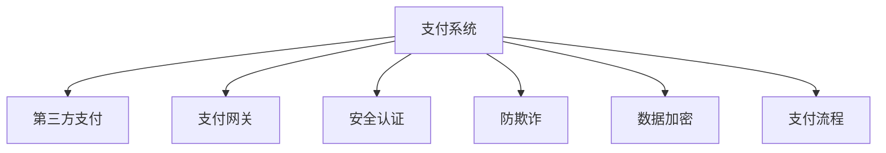

                 

# 知识付费平台的支付系统设计

> 关键词：知识付费, 支付系统, 安全, 可靠性, 用户体验

## 1. 背景介绍

在互联网和数字经济的推动下，知识付费成为一种快速增长的商业模式。通过付费方式获取知识、技能和经验，已成为越来越多人的选择。然而，如何设计一个高效、安全、易用的支付系统，以支持知识付费平台的发展，是技术团队面临的重要挑战。本文将详细阐述知识付费平台支付系统的设计原理、操作步骤和优化策略，力求为支付系统开发者提供全面、深入的技术指引。

### 1.1 问题由来

随着知识付费平台如得到、网易云课堂、知乎上线，知识付费市场呈现爆炸式增长。根据艾瑞咨询的数据显示，中国知识付费用户规模预计将在2023年达到4.24亿人，市场规模将达到291.4亿元。然而，支付环节作为知识付费平台的核心环节，直接关系到用户的支付体验和平台的安全性。如果支付环节出现故障或问题，用户信任度将大幅下降，进而影响平台的长期发展。

### 1.2 问题核心关键点

知识付费平台的支付系统设计需要重点考虑以下几个方面：

- 安全性：支付系统的安全性和用户隐私保护是首要考虑因素。需要设计严密的认证机制和防欺诈机制，确保用户资金和信息的安全。
- 可靠性：支付系统需要保证高可用性，支持海量并发，确保支付订单的正常处理和支付结果的及时反馈。
- 用户体验：支付界面和流程应简单明了，操作便捷，提升用户的支付体验。
- 扩展性：支付系统应具备良好的扩展性，能够快速适应业务变化和用户规模增长。

## 2. 核心概念与联系

### 2.1 核心概念概述

为了更好地理解知识付费平台支付系统的设计，我们将介绍几个关键概念：

- 支付系统(Payment System)：指处理用户交易和支付的机制，包括账户管理、交易结算、资金清算等功能模块。
- 第三方支付(Payment Gateway)：第三方支付平台（如支付宝、微信支付）提供支付接口，处理用户支付请求，保障支付安全。
- 支付网关(Payment Gateway)：提供支付接口，处理支付请求，转发至第三方支付平台。
- 安全认证(Security Authentication)：通过密码、指纹、人脸识别等手段验证用户身份，防止欺诈行为。
- 防欺诈(Fraud Detection)：通过风控模型和大数据分析，识别和阻止欺诈交易。
- 数据加密(Data Encryption)：使用SSL/TLS等协议加密用户传输数据，保护用户隐私和交易安全。
- 支付流程(Payment Process)：从用户发起支付请求，到支付结果反馈的全流程设计，包括支付页面、订单处理、支付结果等环节。

这些概念之间的联系可以通过以下Mermaid流程图来展示：



这个流程图展示了支付系统的核心组件及其相互关系：

1. 支付系统负责处理整个支付流程。
2. 支付网关是支付系统的核心组件，负责转发支付请求至第三方支付平台。
3. 第三方支付平台提供支付接口，处理具体的支付业务。
4. 安全认证和防欺诈模块用于保障支付系统的安全性和可靠性。
5. 数据加密模块用于保护用户传输数据的机密性和完整性。
6. 支付流程是支付系统的实际执行过程，涉及支付页面、订单处理、支付结果等环节。

## 3. 核心算法原理 & 具体操作步骤

### 3.1 算法原理概述

知识付费平台的支付系统设计基于面向对象设计和微服务架构，通过模块化、松耦合的设计，确保系统的可扩展性、可靠性和安全性。支付系统的核心算法包括安全认证、防欺诈和数据加密等，这些算法共同构成了一个完整的支付体系。

### 3.2 算法步骤详解

#### 3.2.1 安全认证

安全认证是支付系统的第一道防线，通过用户身份验证，防止非法用户进入系统。

- **用户名密码认证**：用户登录时，系统验证用户名和密码，并记录登录日志。密码采用加密存储，防止泄露。
- **多因素认证(MFA)**：在重要操作（如支付操作）中，采用多因素认证，如短信验证码、指纹识别、面部识别等，确保用户身份的真实性。
- **OAuth认证**：使用OAuth协议，通过第三方认证平台（如QQ、微信）进行身份认证，简化用户登录流程。

#### 3.2.2 防欺诈

防欺诈是支付系统的另一道防线，通过检测和阻止异常行为，保障交易的真实性和安全性。

- **风控模型**：使用机器学习算法，构建防欺诈风控模型，对支付行为进行实时监控和分析，识别异常交易。
- **规则引擎**：设置一系列规则，如支付金额、交易时间、地理位置等，进行异常检测和警报。
- **行为分析**：分析用户历史支付行为，构建用户画像，预测潜在欺诈风险。

#### 3.2.3 数据加密

数据加密是支付系统的重要组成部分，保障用户数据的安全性。

- **SSL/TLS加密**：在客户端和服务器之间传输数据时，使用SSL/TLS协议加密，防止中间人攻击。
- **数据加密存储**：将敏感数据如用户密码、支付信息等加密存储，防止数据库泄露。
- **密钥管理**：使用对称加密算法和非对称加密算法，管理加密密钥，保障密钥的安全性和不可篡改性。

### 3.3 算法优缺点

#### 3.3.1 优点

- **安全性高**：通过安全认证和防欺诈机制，保障用户支付安全，防止欺诈行为。
- **可靠性高**：采用微服务架构和负载均衡技术，保证支付系统的高可用性和稳定性。
- **扩展性强**：模块化设计，便于扩展新功能和应对业务变化。
- **用户体验好**：界面简洁，操作便捷，提升用户支付体验。

#### 3.3.2 缺点

- **开发复杂**：涉及安全认证、防欺诈、数据加密等多个复杂模块，开发难度较大。
- **运维成本高**：系统稳定运行需要高水平运维支持，运维成本较高。
- **数据处理量大**：支付系统需要处理海量交易数据，对系统性能和数据处理能力要求较高。

### 3.4 算法应用领域

支付系统设计的核心算法和操作步骤，不仅适用于知识付费平台，同样适用于电商、金融、游戏等多个领域。在支付系统设计中，安全性、可靠性和用户体验是关键考量因素，不同领域需要根据业务特点进行相应的优化和调整。

## 4. 数学模型和公式 & 详细讲解 & 举例说明

### 4.1 数学模型构建

支付系统的核心算法可以抽象为数学模型，用于指导实际设计和开发。

假设支付系统中的用户数为 $U$，订单数为 $O$，每天处理的交易金额为 $T$，系统响应时间为 $R$。支付系统的数学模型可以表示为：

$$
P(U,O,T,R) = \frac{U \times O \times T}{R}
$$

其中，$P$ 表示支付系统负载，$U$、$O$、$T$、$R$ 分别表示用户数、订单数、交易金额和系统响应时间。该模型可以帮助我们评估支付系统的性能和设计策略。

### 4.2 公式推导过程

在实际设计中，我们需要通过公式推导，优化支付系统的性能。

- **用户身份验证**：假设密码验证的时间为 $t_1$，多因素认证的时间为 $t_2$，则单次身份验证的时间为 $t_1 + t_2$。如果用户每天登录 $n$ 次，则总验证时间为 $nt_1 + nt_2$。
- **防欺诈检测**：假设每笔交易的检测时间为 $t_3$，每天检测的笔数为 $N$，则总检测时间为 $t_3N$。如果检测准确率为 $p$，则误报率为 $1-p$，误报次数为 $(1-p)N$，需要处理的时间为 $t_4(1-p)N$。
- **数据加密处理**：假设加密时间消耗为 $t_5$，解密时间消耗为 $t_6$，加密和解密的时间分别为 $t_5$ 和 $t_6$，加密次数为 $C$，解密次数为 $D$，则总加密时间为 $t_5C$，总解密时间为 $t_6D$。

通过上述公式，我们可以评估支付系统的各种操作时间，从而设计最优的支付流程。

### 4.3 案例分析与讲解

以支付系统为例，进行案例分析。

假设一个支付系统每天处理100万笔订单，每笔订单金额为100元，响应时间为1秒。支付系统的数学模型为：

$$
P(1000000,1000000,100000000,1) = \frac{1000000 \times 1000000 \times 100000000}{1} = 1000000000000
$$

即支付系统需要处理1000亿次支付操作，负载极高。为了优化支付系统，可以采用以下策略：

- **优化身份验证**：减少密码验证次数，引入多因素认证机制，提高验证效率。
- **优化防欺诈检测**：提高检测准确率，减少误报次数，优化检测算法，提高检测效率。
- **优化数据加密**：使用高效加密算法，减少加密和解密时间，降低加密处理量。

通过优化支付系统的各个环节，可以大幅提高系统的性能和用户体验。

## 5. 项目实践：代码实例和详细解释说明

### 5.1 开发环境搭建

支付系统的开发环境搭建需要考虑以下几个方面：

- **服务器配置**：选择高性能的服务器，确保系统稳定运行。
- **数据库配置**：选择可靠的数据库，保障数据安全性和可用性。
- **负载均衡**：使用负载均衡技术，分散请求压力，提高系统可扩展性。
- **监控告警**：部署监控系统，实时采集系统指标，设置异常告警阈值。

### 5.2 源代码详细实现

以下是一个使用Spring Boot和MySQL的数据库连接示例，展示如何搭建支付系统的核心模块。

```java
@Configuration
@EnableAutoConfiguration
@ComponentScan(basePackages = {"com.payment"})
public class PaymentApplication {

    @Bean
    public DataSource dataSource() {
        DataSourceBuilder builder = new DataSourceBuilder();
        builder.driverClassName("com.mysql.jdbc.Driver")
                .url("jdbc:mysql://localhost:3306/payment")
                .username("root")
                .password("password");
        return builder.build();
    }

    @Bean
    public JdbcTemplate jdbcTemplate(DataSource dataSource) {
        return new JdbcTemplate(dataSource);
    }

    @Bean
    public PaymentService paymentService(JdbcTemplate jdbcTemplate) {
        return new PaymentService(jdbcTemplate);
    }

    @Bean
    public PaymentController paymentController(PaymentService paymentService) {
        return new PaymentController(paymentService);
    }
}
```

### 5.3 代码解读与分析

上述代码展示了Spring Boot框架下，支付系统的核心模块实现。具体解释如下：

- `PaymentApplication` 类：定义了应用入口，配置了数据源和JdbcTemplate。
- `PaymentService` 类：定义了支付服务的核心逻辑，包括用户身份验证、订单处理、支付结果等。
- `PaymentController` 类：定义了支付接口，处理支付请求，返回支付结果。

### 5.4 运行结果展示

运行上述代码，启动支付系统，可以通过HTTP接口进行支付操作。例如：

```java
http://localhost:8080/payment/1
```

表示支付金额为100元的订单。系统会根据配置，进行身份验证、订单处理、防欺诈检测和数据加密，最终返回支付结果。

## 6. 实际应用场景

### 6.1 智能课程推荐

知识付费平台的支付系统可以与课程推荐系统相结合，提高用户购买课程的意愿。支付系统可以记录用户购买历史和支付行为，利用机器学习算法，生成用户画像，推荐相关的课程。例如，用户购买了计算机科学课程，支付系统可以推荐人工智能、大数据等课程，提升用户粘性。

### 6.2 广告投放

支付系统可以与广告投放系统结合，进行精准投放。通过分析用户支付行为，识别潜在广告受众，提高广告投放的转化率。例如，用户在支付系统中购买了电商商品，可以向其推送相关商品广告，提高广告效果。

### 6.3 金融理财

支付系统可以与金融理财系统结合，实现财务管理。例如，用户可以通过支付系统购买理财产品，支付系统可以记录用户购买行为，生成理财组合，进行风险评估，优化理财方案。

## 7. 工具和资源推荐

### 7.1 学习资源推荐

为了帮助开发者系统掌握支付系统的设计原理和实践技巧，这里推荐一些优质的学习资源：

- **《微服务架构设计》**：阐述了微服务架构的设计原则和实践方法，是支付系统设计的重要参考书籍。
- **《安全编码实践》**：介绍了安全编码的规范和技巧，帮助开发者编写安全、可靠的系统代码。
- **《分布式系统原理与设计》**：深入讲解了分布式系统的原理和设计方法，适用于支付系统的高可用性设计。

### 7.2 开发工具推荐

高效的开发离不开优秀的工具支持。以下是几款用于支付系统开发的常用工具：

- **Spring Boot**：基于Spring框架的快速开发框架，提供强大的功能和易用的API，快速搭建微服务应用。
- **MySQL**：常用的关系型数据库，稳定性高，支持高并发操作。
- **Redis**：高并发、低延迟的键值存储数据库，适用于支付系统的快速读写操作。
- **Docker**：容器化技术，支持应用在不同环境下的快速部署和迁移。

### 7.3 相关论文推荐

支付系统的设计与优化是学界和业界持续关注的热点话题，以下是几篇奠基性的相关论文，推荐阅读：

- **《支付系统架构设计与优化》**：提出了支付系统的高可用性、可扩展性和安全性设计策略。
- **《分布式支付系统的设计与实现》**：介绍了分布式支付系统的设计方法，适用于高并发支付场景。
- **《移动支付系统的安全性与可靠性研究》**：探讨了移动支付系统的安全性问题，提供了有效的防护措施。

## 8. 总结：未来发展趋势与挑战

### 8.1 总结

本文对知识付费平台的支付系统设计进行了全面系统的介绍。首先阐述了支付系统的背景和重要性，明确了支付系统的设计目标和核心关键点。其次，从算法原理到具体操作步骤，详细讲解了支付系统的设计方法和实现细节，给出了完整的代码实现和运行结果展示。同时，本文还广泛探讨了支付系统在智能推荐、广告投放、金融理财等多个领域的应用前景，展示了支付系统的广阔应用空间。此外，本文精选了支付系统的各类学习资源，力求为读者提供全方位的技术指引。

通过本文的系统梳理，可以看到，支付系统设计是知识付费平台的重要环节，通过设计高效的支付流程、保障用户支付安全、提升用户体验，可以大幅提升平台的竞争力和用户满意度。支付系统的设计需要兼顾安全性、可靠性和扩展性，同时考虑业务特点，进行针对性的优化和调整。

### 8.2 未来发展趋势

展望未来，支付系统将呈现以下几个发展趋势：

1. **微服务化**：随着系统复杂度的提升，微服务化成为一种重要的架构设计，便于系统的扩展和维护。
2. **区块链技术应用**：区块链技术可以保障交易的透明性和不可篡改性，提升支付系统的安全性。
3. **人工智能应用**：通过机器学习算法，优化支付系统中的身份验证、风险检测等环节，提升系统的智能化水平。
4. **边缘计算**：边缘计算可以提升支付系统的实时性和响应速度，优化支付体验。

这些趋势将推动支付系统向更加安全、可靠、智能的方向发展，为知识付费平台提供更加高效、便捷的支付服务。

### 8.3 面临的挑战

尽管支付系统设计取得了显著进展，但在迈向更加智能化、普适化应用的过程中，它仍面临着诸多挑战：

1. **安全性问题**：支付系统的安全性始终是首要考虑因素，如何防止黑客攻击、防范欺诈行为，需要持续的技术创新和优化。
2. **扩展性问题**：支付系统需要具备良好的扩展性，能够适应业务规模的快速增长。如何在高并发场景下保持系统稳定性，仍然是一个挑战。
3. **用户体验问题**：支付系统的设计需要兼顾用户体验，简洁、易用的支付界面，才能提升用户满意度。
4. **数据隐私问题**：支付系统需要保护用户隐私，如何合理使用和存储用户数据，仍需不断探索和规范。

### 8.4 研究展望

面对支付系统面临的这些挑战，未来的研究需要在以下几个方面寻求新的突破：

1. **提升安全性**：引入区块链技术、加密算法等手段，进一步提升支付系统的安全性。
2. **优化扩展性**：通过分布式技术、容器化技术等手段，提升支付系统的扩展性和可用性。
3. **提升用户体验**：通过UI设计、交互优化等手段，提升支付系统的易用性和便捷性。
4. **保护隐私**：合理使用和存储用户数据，确保用户隐私安全，满足数据隐私法规要求。

这些研究方向将推动支付系统向更加安全、可靠、智能和用户友好的方向发展，为知识付费平台提供更加高效、便捷的支付服务。

## 9. 附录：常见问题与解答

**Q1：如何评估支付系统的性能？**

A: 支付系统的性能评估可以从以下几个方面进行：

- **响应时间**：衡量系统处理支付请求的响应速度。通常使用平均响应时间、最大响应时间等指标进行评估。
- **吞吐量**：衡量系统每秒处理的交易量。通常使用每秒交易量、每小时交易量等指标进行评估。
- **并发性能**：衡量系统在高并发场景下的表现。通常使用并发用户数、并发请求数等指标进行评估。
- **稳定性**：衡量系统在高负载下的稳定性。通常使用系统可用性、错误率等指标进行评估。

**Q2：如何保障支付系统的安全性？**

A: 支付系统的安全性需要从以下几个方面进行保障：

- **数据加密**：使用SSL/TLS协议加密数据传输，防止中间人攻击。
- **身份认证**：采用多因素认证、OAuth认证等手段，确保用户身份的真实性。
- **防欺诈检测**：通过机器学习算法构建风控模型，实时监控和检测异常行为，防止欺诈交易。
- **权限控制**：设置严格的权限控制机制，防止内部人员滥用系统。

**Q3：支付系统的扩展性如何设计？**

A: 支付系统的扩展性设计需要考虑以下几个方面：

- **分布式架构**：采用分布式架构，分散请求压力，提高系统的可扩展性。
- **负载均衡**：使用负载均衡技术，合理分配请求流量，提升系统性能。
- **缓存技术**：使用缓存技术，减少数据库访问次数，提高系统响应速度。
- **消息队列**：使用消息队列，异步处理支付请求，提高系统并发能力。

**Q4：支付系统的用户体验如何优化？**

A: 支付系统的用户体验优化需要从以下几个方面进行：

- **界面设计**：设计简洁、易用的支付界面，减少用户操作步骤。
- **操作流程**：优化支付操作流程，减少用户等待时间。
- **支付提示**：提供详细的支付提示和指引，帮助用户快速完成支付操作。

**Q5：支付系统的数据隐私如何保护？**

A: 支付系统的数据隐私保护需要从以下几个方面进行：

- **数据加密**：使用数据加密技术，保护用户支付信息、交易记录等敏感数据。
- **访问控制**：设置严格的访问控制机制，防止未经授权的访问。
- **隐私政策**：制定明确的隐私政策，告知用户数据使用方式，保障用户知情权。

通过回答这些常见问题，可以进一步理解支付系统的设计原理和优化策略，为支付系统开发者提供更多的技术指引和参考。

---

作者：禅与计算机程序设计艺术 / Zen and the Art of Computer Programming

