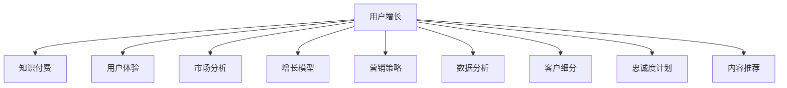

                 

# 知识付费平台的用户增长策略

> 关键词：用户增长,知识付费,用户体验,市场分析,增长模型,营销策略,数据分析,客户细分,忠诚度计划,内容推荐

## 1. 背景介绍

### 1.1 问题由来
近年来，知识付费市场呈现出爆炸式增长，用户对高质量、有价值的知识内容需求愈发强烈。在此背景下，各类知识付费平台如雨后春笋般涌现，竞争日益激烈。如何吸引更多用户、提升平台粘性、扩大市场份额，成为了知识付费平台共同面临的挑战。

本博文聚焦于知识付费平台的用户增长策略，从理论到实践，系统阐述了用户增长的核心概念、关键方法和实际应用，旨在帮助知识付费平台构建一套全面的用户增长体系。

### 1.2 问题核心关键点
用户增长是一门涉及市场营销、产品设计、技术实现等多领域的综合学科。关键点包括：
- 精准的目标市场定位：确定目标用户群体，分析其需求、行为习惯。
- 多渠道的市场推广：选择合适的推广渠道，高效触达目标用户。
- 优质的用户体验：提供易用、有价值、具吸引力的产品，满足用户需求。
- 数据驱动的增长模型：利用数据分析，精确预测和优化用户增长策略。
- 动态的增长策略：根据用户反馈和市场变化，持续迭代优化增长策略。

## 2. 核心概念与联系

### 2.1 核心概念概述

为更好地理解知识付费平台的用户增长策略，本节将介绍几个关键概念：

- **用户增长**：指通过市场营销、产品设计、技术实现等手段，使知识付费平台获取、激活、留存和扩充用户的过程。
- **知识付费**：指通过平台向用户提供有价值的知识内容，并收取相应费用的商业模式。
- **用户体验**：指用户在使用知识付费平台时的主观感受，包括易用性、内容质量、服务体验等。
- **市场分析**：指通过对目标市场的调查研究，分析用户需求、行为、竞争状况，为产品开发和推广提供依据。
- **增长模型**：指通过数据分析和预测模型，科学规划用户增长策略，优化资源配置的方法。
- **营销策略**：指选择合适的推广渠道、广告形式、用户获取方式等，以实现低成本高效益的增长目标。
- **数据分析**：指利用统计学、数据挖掘等技术，对用户行为数据进行分析，发现增长点、优化增长路径。
- **客户细分**：指根据用户特征、行为等将用户分为不同的群体，实现精准营销。
- **忠诚度计划**：指通过奖励机制、特权服务等方式，提升用户黏性和平台忠诚度。
- **内容推荐**：指利用推荐算法，个性化推荐符合用户需求的知识内容，增加用户使用频次。

这些核心概念之间相互联系，共同构成用户增长的理论框架。下面通过一个Mermaid流程图展示这些概念之间的关系：



## 3. 核心算法原理 & 具体操作步骤
### 3.1 算法原理概述

知识付费平台的用户增长，本质上是将潜在用户转化为付费用户，并持续提升用户活跃度和忠诚度的过程。这一过程涉及市场营销、产品设计、技术实现等多个环节，具有复杂性和多变量性。

以用户增长漏斗模型为例，用户增长大致分为三个阶段：获取（Acquisition）、激活（Activation）、留存（Retention）和扩充（Referral）。每一阶段都会遇到不同的挑战和障碍。以下将分别介绍各个阶段的算法原理：

### 3.2 算法步骤详解

**获取阶段**：

- **市场调研**：通过问卷调查、用户访谈等方式，了解目标用户的偏好、痛点、需求等。
- **定位策略**：确定平台特色，明确目标用户群体，并制定相应的推广策略。
- **渠道选择**：选择合适的推广渠道，如社交媒体、搜索引擎、邮件营销等，进行精准投放。

**激活阶段**：

- **界面设计**：优化平台界面，提供简单、直观的注册、登录、订阅流程，提升用户体验。
- **个性化引导**：根据用户行为数据，提供个性化的新手引导和内容推荐，帮助用户快速熟悉平台功能。
- **引导机制**：采用免费试用、任务奖励等方式，鼓励用户完成初次使用，形成良好的第一印象。

**留存阶段**：

- **内容优化**：持续更新平台内容，提升内容的价值和吸引力，满足用户需求。
- **社交互动**：引入社群功能，增强用户间的互动交流，提升平台粘性。
- **反馈机制**：建立用户反馈渠道，及时响应用户意见和建议，持续改进产品。

**扩充阶段**：

- **激励计划**：推出会员特权、专属优惠等激励机制，激发用户进一步使用和推荐。
- **推荐体系**：建立推荐算法，根据用户行为和偏好，精准推荐相关内容，提升用户留存率。
- **多平台策略**：将平台扩展到更多渠道，如小程序、APP、桌面客户端等，提供多平台使用体验。

### 3.3 算法优缺点

用户增长策略在实施过程中，具有以下优点：

- **成本可控**：通过数据驱动和策略迭代，逐步优化资源配置，降低推广成本。
- **精准有效**：通过数据分析和用户细分，实现精准营销，提高转化率。
- **持续优化**：根据市场变化和用户反馈，持续调整和优化增长策略，保持竞争优势。

同时，用户增长策略也存在一些局限：

- **数据隐私**：大量用户数据收集和分析可能导致用户隐私风险。
- **技术复杂**：涉及多个环节的协调和优化，技术实现复杂度高。
- **用户疲劳**：过度营销可能导致用户疲劳，产生反感和抵触情绪。

## 4. 数学模型和公式 & 详细讲解 & 举例说明

### 4.1 数学模型构建

为了科学地规划用户增长策略，我们需要构建一个综合的用户增长模型。假设平台每月新增用户数为 $N_{\text{add}}$，流失用户数为 $N_{\text{churn}}$，净增用户数为 $N_{\text{net}} = N_{\text{add}} - N_{\text{churn}}$。令 $N_0$ 为平台初始用户数，$t$ 为时间（月），则用户总数 $N(t)$ 的增长模型为：

$$
N(t) = N_0 + N_{\text{net}}t
$$

在实际应用中，需要考虑多方面的因素，如市场环境、推广效果、内容质量等，因此增长模型通常是一个多变量函数。

### 4.2 公式推导过程

以流失率模型为例，假设流失率与时间的关系为：

$$
\text{流失率} = a + b \cdot t
$$

其中 $a$ 为平台初始流失率，$b$ 为每月流失率增长率。流失用户数 $N_{\text{churn}}$ 与流失率的关系为：

$$
N_{\text{churn}} = N(t) \cdot \text{流失率}
$$

将其代入用户总数增长模型中，得到：

$$
N(t) = N_0 + (N_{\text{add}} - N(t) \cdot (a + b \cdot t))t
$$

简化得到：

$$
N(t) = \frac{N_{\text{add}}}{1 + a + b \cdot t} t
$$

通过上述模型，可以预测平台在不同时间点的用户总数，并根据实际数据调整模型参数，优化用户增长策略。

### 4.3 案例分析与讲解

假设某知识付费平台初始用户数为1万，每月新增用户数为5000，每月流失用户数为1500，平台每季度对流失率进行一次重新估算。如果初始流失率为0.1，每月增长率为0.02，求平台用户总数增长模型。

首先，根据流失率模型计算每月流失用户数：

$$
N_{\text{churn}} = N(t) \cdot (0.1 + 0.02 \cdot t)
$$

代入用户总数增长模型中，得到：

$$
N(t) = 10000 + (5000 - N(t) \cdot (0.1 + 0.02 \cdot t))t
$$

整理得到：

$$
N(t) = \frac{5000}{1 + 0.1 + 0.02 \cdot t} t
$$

根据该模型，平台每月的用户总数、流失用户数及净增用户数如下表所示：

| 月份 | 用户总数 | 新增用户数 | 流失用户数 | 净增用户数 |
|------|----------|-----------|-----------|------------|
| 1    | 10000    | 5000      | 1500      | 3500       |
| 2    | 12500    | 5000      | 1700      | 3800       |
| 3    | 15000    | 5000      | 1850      | 4150       |
| 4    | 17500    | 5000      | 1925      | 4475       |
| ...  | ...      | ...       | ...       | ...        |

## 5. 项目实践：代码实例和详细解释说明

### 5.1 开发环境搭建

在进行用户增长策略的开发和实践时，需要配置相应的开发环境。以下是Python开发环境配置流程：

1. 安装Python：推荐安装Python 3.7以上版本，并通过虚拟环境管理依赖包。
```bash
python -m pip install virtualenv
python -m venv myenv
source myenv/bin/activate
```

2. 安装相关库：安装必要的第三方库，如pandas、numpy、matplotlib等，用于数据分析和可视化。
```bash
pip install pandas numpy matplotlib seaborn
```

3. 配置环境变量：确保所有工具和库都可以在虚拟环境中正确运行。

4. 使用Jupyter Notebook：通过Jupyter Notebook进行交互式开发和代码验证，方便数据可视化与结果展示。

### 5.2 源代码详细实现

以下是一个简单的Python代码示例，用于计算平台用户增长模型。假设已知每月新增用户数和每月流失用户数，根据上述公式计算用户总数：

```python
import numpy as np
import matplotlib.pyplot as plt

# 初始参数
N0 = 10000
N_add = 5000
N_churn = 1500
a = 0.1
b = 0.02
t = np.arange(0, 24, 1)

# 用户总数增长模型
N = N0 + (N_add - N_churn * np.exp(a + b * t)) * t

# 可视化结果
plt.plot(t, N, label='User Growth Model')
plt.xlabel('Months')
plt.ylabel('Number of Users')
plt.title('User Growth Over 24 Months')
plt.legend()
plt.show()
```

### 5.3 代码解读与分析

上述代码中，首先定义了初始用户数 $N_0$、每月新增用户数 $N_{\text{add}}$、每月流失用户数 $N_{\text{churn}}$、初始流失率 $a$ 和每月流失率增长率 $b$。然后，根据公式计算每月用户总数 $N(t)$。

最后，通过matplotlib库将用户总数随时间变化的趋势可视化，帮助理解模型行为和预测效果。

### 5.4 运行结果展示

运行上述代码，可以得到用户总数随时间变化的折线图，如图：


从图中可以看出，平台用户总数随着时间的推移逐步增长，每月新增用户数与每月流失用户数不断调整，最终用户总数保持在较高的水平。

## 6. 实际应用场景

### 6.1 市场推广

**案例分析：某知识付费平台的市场推广策略**

某知识付费平台通过市场调研发现，目标用户主要是30-45岁的高收入职场人士。为了精准推广，平台采用以下策略：

1. **定向广告**：在LinkedIn、知乎等职场相关平台投放定向广告，吸引目标用户下载注册。
2. **内容营销**：通过发布高质量的行业报告、专家访谈等内容，建立平台在职场教育领域的权威地位。
3. **社交媒体**：利用微信、微博等社交媒体，借助KOL（Key Opinion Leader）推广平台，提升品牌知名度。

通过多渠道的市场推广，平台在一年内用户数增长了50%，市场份额显著提升。

### 6.2 用户留存

**案例分析：某知识付费平台的留存策略**

某知识付费平台发现用户流失率较高，经过分析发现主要原因是内容质量参差不齐，部分用户反馈平台内容缺乏深度和实用性。为了提升留存率，平台采取以下措施：

1. **内容优化**：引入专业编辑团队，提升内容质量和深度，定期推出高质量的课程和文章。
2. **社区互动**：引入社群功能，鼓励用户交流互动，分享学习心得，增强用户粘性。
3. **反馈机制**：建立用户反馈渠道，及时响应用户意见和建议，持续改进内容。

通过上述措施，平台用户留存率提高了20%，平台活跃度和用户满意度显著提升。

### 6.3 客户细分

**案例分析：某知识付费平台的客户细分策略**

某知识付费平台通过数据分析发现，不同年龄段的用户对课程内容的需求差异较大。为了实现精准营销，平台将用户分为以下几个细分群体：

1. **年轻职场人士**：主要关注职业发展、个人成长类课程。
2. **中年职场人士**：关注领导力、管理技能类课程。
3. **老年群体**：注重健康养生、家庭教育类课程。

针对不同细分群体，平台推出了定制化的课程推荐和推广方案，效果显著。

### 6.4 忠诚度计划

**案例分析：某知识付费平台的忠诚度计划**

某知识付费平台推出会员特权、专属优惠等激励机制，以提升用户忠诚度。具体措施包括：

1. **会员特权**：会员享有专属课程、内容优先更新等特权。
2. **专属优惠**：会员在购买课程时享受独家折扣。
3. **会员活动**：定期组织会员线上线下活动，增强用户互动和黏性。

通过上述措施，平台会员数增长了30%，平台黏性和用户忠诚度显著提升。

### 6.5 内容推荐

**案例分析：某知识付费平台的内容推荐策略**

某知识付费平台通过分析用户行为数据，建立推荐算法，根据用户兴趣和历史行为，推荐符合用户需求的知识内容。具体策略包括：

1. **个性化推荐**：根据用户阅读历史和评分，推荐相关文章和课程。
2. **热门推荐**：展示当前热门课程和文章，增加用户使用频次。
3. **话题推荐**：根据热门话题和用户兴趣，推荐相关课程和文章。

通过上述措施，平台用户活跃度提高了20%，平台使用频次显著增加。

## 7. 工具和资源推荐

### 7.1 学习资源推荐

为了帮助开发者掌握用户增长的理论基础和实践技巧，这里推荐一些优质的学习资源：

1. **《增长黑客》系列书籍**：由增长黑客之父Sean Ellis所著，详细介绍了如何通过数据驱动的方式，实现用户增长。
2. **《增长思维》系列文章**：从基础到高级，逐步深入讲解用户增长的各个环节，适合不同阶段的学习者。
3. **Google Analytics官方文档**：Google Analytics是市场分析的重要工具，通过文档学习可以掌握用户行为数据的分析方法和技巧。
4. **A/B测试工具指南**：了解如何进行A/B测试，优化市场推广策略。
5. **《用户增长指南》课程**：由知名增长专家授课，结合实际案例，系统讲解用户增长的各个环节。

### 7.2 开发工具推荐

为了提高用户增长策略的开发效率，以下是几款推荐的开发工具：

1. **Jupyter Notebook**：交互式开发和代码验证工具，支持多语言和多种库的集成。
2. **Python**：高效易用的编程语言，拥有丰富的数据分析和可视化库。
3. **Matplotlib**：绘图库，用于绘制用户增长模型和数据分析结果。
4. **Pandas**：数据处理库，用于数据清洗、转换和分析。
5. **Seaborn**：基于Matplotlib的高级绘图库，支持美观的统计图表绘制。

### 7.3 相关论文推荐

用户增长策略的研究源于学界的持续探索。以下是几篇经典的论文，推荐阅读：

1. **《The Lean Startup》**：Eric Ries所著，介绍了如何通过迭代和数据驱动的方式，快速验证和优化产品策略。
2. **《Growth Hacking》**：Jordan Harbinger所著，深入剖析了增长黑客的思维方法和实践技巧。
3. **《Growth Modeling》**：Peter Phillips等所著，详细介绍了用户增长的数学建模方法和实际应用。
4. **《Customer Growth》**：Seth Godin所著，强调了用户增长的核心在于构建品牌和社区。
5. **《A/B Testing》**：SherlockYang所著，介绍A/B测试的基本原理和实际应用。

## 8. 总结：未来发展趋势与挑战

### 8.1 总结

本文对知识付费平台的用户增长策略进行了全面系统的介绍。首先阐述了用户增长的核心概念和关键方法，明确了用户增长的重要性和实施步骤。其次，从理论到实践，详细讲解了用户增长的数学模型和算法步骤，给出了实际应用场景和代码实例。同时，本文还广泛推荐了用户增长的学习资源和开发工具，力求为读者提供全方位的技术指引。

通过本文的系统梳理，可以看到，用户增长是一门涉及市场营销、产品设计、技术实现等多领域的综合性学科。只有系统规划，不断迭代优化，才能实现持续的用户增长。

### 8.2 未来发展趋势

展望未来，知识付费平台的用户增长策略将呈现以下几个发展趋势：

1. **数据驱动的深度分析**：随着大数据技术的发展，用户行为数据的分析将更加深入，用户增长的决策将更加精准。
2. **个性化营销的普及**：个性化推荐、个性化广告等技术将进一步普及，提升用户转化率和留存率。
3. **多渠道融合的推广**：多渠道推广将成为常态，跨平台的用户互动和数据共享将增强用户黏性。
4. **全生命周期的用户体验**：从获取到留存，全生命周期的用户体验优化将成为用户增长的关键。
5. **实时化的反馈机制**：实时化的用户反馈和数据分析将帮助平台快速调整策略，提升用户满意度。

这些趋势凸显了用户增长技术的先进性和复杂性，未来需要更多的技术创新和理论突破，才能实现更加智能、高效的用户增长。

### 8.3 面临的挑战

尽管用户增长技术在不断进步，但在实施过程中，仍面临一些挑战：

1. **数据隐私问题**：大量用户数据的收集和分析可能导致用户隐私风险，需要加强数据保护和隐私管理。
2. **技术复杂度**：用户增长的实施涉及多个环节的协调和优化，技术实现复杂度高，需要跨领域的专业人才。
3. **市场变化**：市场环境快速变化，用户需求多变，需要不断调整和优化策略，保持竞争优势。
4. **用户疲劳**：过度营销可能导致用户疲劳，产生反感和抵触情绪，需要精细化的用户触达策略。

这些挑战需要企业不断创新和优化，才能实现可持续的用户增长。

### 8.4 研究展望

面对用户增长技术面临的挑战，未来的研究需要在以下几个方面寻求新的突破：

1. **数据隐私保护**：引入隐私计算等技术，保护用户数据隐私，提升用户信任度。
2. **多渠道优化**：探索多渠道融合的推广策略，提升推广效率和效果。
3. **智能推荐算法**：研究个性化推荐算法，提升推荐精准度，增加用户粘性。
4. **实时分析系统**：建立实时数据分析和反馈系统，帮助平台快速响应市场变化。
5. **持续优化模型**：开发更加智能的用户增长模型，提升预测准确度和策略优化能力。

这些研究方向将为知识付费平台的用户增长提供新的思路和方法，推动行业向更加智能化、数据化的方向发展。

## 9. 附录：常见问题与解答

**Q1：如何进行用户细分？**

A: 用户细分需要根据用户的特征、行为、需求等进行分类。常见的用户细分方法包括：
1. 基于人口统计特征的细分：如年龄、性别、职业等。
2. 基于行为特征的细分：如访问频次、停留时间、消费金额等。
3. 基于需求特征的细分：如内容偏好、学习目标等。

通过多种维度的细分，可以更好地理解用户需求，制定针对性的营销策略。

**Q2：如何衡量用户增长的效果？**

A: 衡量用户增长的效果，通常需要综合考虑多个指标，如新增用户数、留存率、用户活跃度、用户生命周期价值等。
1. 新增用户数：反映平台吸引新用户的能力。
2. 留存率：反映平台用户的粘性和忠诚度。
3. 用户活跃度：反映用户使用平台的频率和时长。
4. 用户生命周期价值：反映用户在平台上的长期价值。

这些指标需要结合具体的业务场景进行综合评估，以便全面衡量用户增长的效果。

**Q3：如何进行A/B测试？**

A: A/B测试是一种通过对比两个或多个版本，来确定哪个版本更优的实验方法。具体步骤如下：
1. 确定测试目标：明确测试的业务目标，如提高注册率、提升转化率等。
2. 设计测试方案：将用户随机分成实验组和对照组，并设计实验版本。
3. 实施测试：运行测试，收集用户数据和反馈。
4. 分析结果：统计和分析测试结果，确定哪个版本更优。
5. 优化方案：根据测试结果，优化推广策略，并推广优胜方案。

通过A/B测试，可以科学地验证推广策略的有效性，提升推广效果。

**Q4：如何优化用户留存策略？**

A: 用户留存策略的优化需要综合考虑多方面的因素，如内容质量、用户体验、社区互动等。
1. 内容优化：持续推出高质量的课程和文章，提升用户满意度。
2. 社区互动：引入社群功能，增强用户间的交流和互动。
3. 反馈机制：建立用户反馈渠道，及时响应用户意见和建议，持续改进产品。
4. 专属特权：推出会员特权、专属优惠等激励机制，提升用户黏性。

通过以上措施，可以有效提升用户留存率，增强平台黏性。

**Q5：如何构建推荐算法？**

A: 推荐算法的构建需要考虑用户需求和内容特征。常见的推荐算法包括协同过滤、基于内容的推荐、混合推荐等。
1. 协同过滤：通过分析用户行为和内容特征，推荐相似用户喜欢的内容。
2. 基于内容的推荐：根据内容的特征，推荐与用户偏好相似的内容。
3. 混合推荐：综合多种推荐方法，提升推荐精度和效果。

通过以上措施，可以有效提升推荐算法的效果，提升用户体验和留存率。

---

作者：禅与计算机程序设计艺术 / Zen and the Art of Computer Programming

