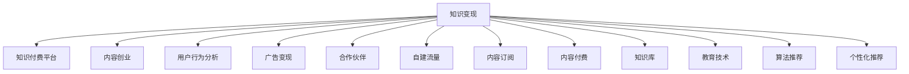

                 

# 知识付费时代来临：如何从知识变现中获利？

> 关键词：知识变现, 付费平台, 内容创业, 数据分析, 用户行为分析, 用户留存, 广告变现, 合作伙伴, 自建流量, 内容订阅, 内容付费, 知识库, 教育技术, 算法推荐, 个性化推荐

## 1. 背景介绍

### 1.1 问题由来
随着互联网技术的飞速发展，知识传播的方式和渠道发生了根本性的变化。传统的新闻报纸、电视广播、图书出版等传统媒体的影响力逐渐式微，而知识付费平台、在线教育、短视频平台等新兴媒体的影响力日益凸显。尤其是在知识付费时代，知识变现的途径和形式变得多样化，如何从中获利，成为当前知识创作者和内容从业者迫切需要解决的问题。

### 1.2 问题核心关键点
知识变现的本质是通过知识产品和服务的提供，获取经济利益。在知识付费时代，知识创作者和内容从业者需要关注以下几个关键点：
1. 选择合适的知识变现途径。
2. 提升内容的质量和吸引力。
3. 构建良好的用户关系和社区生态。
4. 有效的运营策略和数据分析。
5. 合理利用广告、订阅、合作等多元变现方式。

这些关键点共同构成了知识变现的基础框架，需要知识创作者和内容从业者综合考虑，采取合适的策略和方法，才能在知识付费时代中获得可持续的经济收益。

### 1.3 问题研究意义
了解知识付费时代如何从知识变现中获利，对于提升知识创作者和内容从业者的收入，推动知识的传播和利用，具有重要意义：

1. 提高收入水平。通过多元化变现途径，提高内容产品的附加值，实现个人收入的持续增长。
2. 促进知识的普及。借助付费机制，提升内容质量，吸引更多的用户关注和付费，推动知识的广泛传播。
3. 推动教育技术创新。知识变现的商业模式促使内容创作者不断创新，提升教育技术的水平。
4. 构建知识社区。通过建立付费平台和社区，聚集志同道合的创作者和用户，形成知识共享和交流的良好氛围。
5. 增强用户粘性。通过精准推荐和个性化服务，提高用户的留存率和活跃度，实现长期的持续收益。

## 2. 核心概念与联系

### 2.1 核心概念概述

为了更好地理解如何从知识变现中获利，本文将介绍几个核心概念及其联系：

- **知识变现(Knowledge Monetization)**：通过提供知识产品或服务，如在线课程、电子书、视频讲座、咨询服务等，获取经济收益的过程。
- **知识付费平台(Knowledge-Paying Platforms)**：专门提供知识变现服务的平台，如知识星球、网易云课堂、得到、喜马拉雅等。
- **内容创业(Content Entrepreneurship)**：以内容为核心的创业模式，通过提供有价值的内容，吸引用户付费，实现商业价值的转化。
- **用户行为分析(User Behavior Analysis)**：通过对用户的行为数据进行分析，了解用户需求和偏好，优化内容生产和推荐策略，提高用户满意度和留存率。
- **广告变现(Ad Revenue)**：通过展示广告、联盟营销等方式，在知识内容中嵌入广告，获取广告收益。
- **合作伙伴(Partnerships)**：与其他平台、企业或个人合作，共同推广内容产品，扩大变现渠道和用户基础。
- **自建流量(Self-Generated Traffic)**：通过SEO优化、社交媒体推广等方式，积累自己的流量，直接或间接地转化为付费用户。
- **内容订阅(Content Subscriptions)**：用户通过付费订阅获取定期更新的内容，创作者通过订阅费获得稳定收入。
- **内容付费(Content-Based Monetization)**：通过提供有价值的内容产品，吸引用户支付费用，实现内容变现。
- **知识库(Knowledge Database)**：构建集中的知识资源库，提供系统化的知识服务，满足用户的多样化需求。
- **教育技术(Educational Technology)**：应用技术手段改进教育方法，提升教育质量和效果，推动知识的学习和传播。
- **算法推荐(Algorithmic Recommendation)**：利用算法模型，对用户行为进行分析和预测，提供个性化的内容推荐，提高用户满意度和转化率。
- **个性化推荐(Personalized Recommendation)**：根据用户的历史行为和偏好，提供定制化的内容推荐，提升用户体验和粘性。

这些核心概念之间的逻辑关系可以通过以下Mermaid流程图来展示：



这个流程图展示了大语言模型的核心概念及其相互关系：

1. 知识变现是整个流程的起点，通过提供知识产品和服务获取收益。
2. 知识付费平台和内容创业是知识变现的主要途径。
3. 用户行为分析和广告变现是提升变现效率和收益的重要手段。
4. 合作伙伴和自建流量是拓展用户基础和提高影响力的方式。
5. 内容订阅和内容付费是实现持续收益和提高用户粘性的方法。
6. 知识库、教育技术和算法推荐是知识变现技术支撑的基础。

这些概念共同构成了知识变现的生态系统，需要创作者和从业者综合利用，实现高效的知识变现。

## 3. 核心算法原理 & 具体操作步骤

### 3.1 算法原理概述

知识变现的核心算法原理主要包括以下几个方面：

1. **用户画像构建**：通过数据分析技术，构建用户的详细画像，包括兴趣、偏好、行为等。
2. **内容推荐算法**：利用机器学习和数据挖掘技术，对用户行为进行分析和预测，提供个性化的内容推荐。
3. **广告投放算法**：通过算法模型优化广告投放策略，提高广告转化率和收益。
4. **订阅模型设计**：设计合适的订阅策略，提高用户的留存率和付费率。
5. **合作伙伴匹配算法**：匹配合适的合作伙伴，共同推广内容产品，扩大用户基础。
6. **流量引入算法**：通过SEO优化、社交媒体推广等方式，引入流量，提高内容访问量和用户转化率。

这些算法原理共同支撑着知识变现的整个流程，需要创作者和从业者深入理解和应用，才能实现高效的知识变现。

### 3.2 算法步骤详解

下面详细介绍每个核心算法的详细步骤：

#### 3.2.1 用户画像构建

**步骤1: 数据收集**
- 收集用户的行为数据，包括浏览记录、购买记录、评论记录等。
- 收集用户的属性数据，包括年龄、性别、地域等。

**步骤2: 数据预处理**
- 对收集到的数据进行清洗和标准化处理，去除噪声和无效数据。
- 对缺失数据进行补全或删除，确保数据的完整性和准确性。

**步骤3: 特征工程**
- 提取有意义的特征，如用户浏览时长、购买频率、评论情感等。
- 对特征进行编码和归一化处理，便于后续算法模型的应用。

**步骤4: 用户画像构建**
- 使用聚类算法、分类算法等，对用户进行分类和分组。
- 为每个用户画像建立详细的标签体系，涵盖兴趣、偏好、行为等方面。

**步骤5: 用户画像更新**
- 定期更新用户画像，确保用户画像的时效性和准确性。
- 对新用户进行画像构建，确保新用户的画像完整性。

#### 3.2.2 内容推荐算法

**步骤1: 数据收集**
- 收集用户的历史行为数据，包括浏览、购买、评价等记录。
- 收集内容的元数据，包括标题、作者、标签等。

**步骤2: 数据预处理**
- 对用户行为数据进行清洗和标准化处理，去除噪声和无效数据。
- 对内容元数据进行编码和归一化处理，便于后续算法模型的应用。

**步骤3: 特征工程**
- 提取有意义的特征，如用户行为特征、内容特征等。
- 对特征进行编码和归一化处理，便于后续算法模型的应用。

**步骤4: 模型选择**
- 选择合适的推荐算法，如协同过滤、内容推荐、混合推荐等。
- 训练推荐模型，使用用户画像和内容特征，生成推荐结果。

**步骤5: 推荐结果优化**
- 使用A/B测试等方法，优化推荐算法和推荐结果。
- 对推荐结果进行监控和评估，及时调整算法模型。

#### 3.2.3 广告投放算法

**步骤1: 数据收集**
- 收集广告的历史投放数据，包括广告曝光量、点击量、转化率等。
- 收集用户的行为数据，包括浏览、购买、评价等记录。

**步骤2: 数据预处理**
- 对广告投放数据进行清洗和标准化处理，去除噪声和无效数据。
- 对用户行为数据进行清洗和标准化处理，去除噪声和无效数据。

**步骤3: 特征工程**
- 提取有意义的特征，如广告特征、用户行为特征等。
- 对特征进行编码和归一化处理，便于后续算法模型的应用。

**步骤4: 模型选择**
- 选择合适的广告投放算法，如CTR预估、A/B测试等。
- 训练广告投放模型，使用广告特征和用户行为特征，生成投放结果。

**步骤5: 广告投放优化**
- 使用A/B测试等方法，优化广告投放算法和投放结果。
- 对广告投放结果进行监控和评估，及时调整算法模型。

#### 3.2.4 订阅模型设计

**步骤1: 数据收集**
- 收集用户的行为数据，包括浏览、购买、评价等记录。
- 收集订阅用户的数据，包括订阅记录、续费记录等。

**步骤2: 数据预处理**
- 对用户行为数据进行清洗和标准化处理，去除噪声和无效数据。
- 对订阅用户数据进行清洗和标准化处理，去除噪声和无效数据。

**步骤3: 特征工程**
- 提取有意义的特征，如用户行为特征、订阅特征等。
- 对特征进行编码和归一化处理，便于后续算法模型的应用。

**步骤4: 模型选择**
- 选择合适的订阅模型，如线性回归、逻辑回归等。
- 训练订阅模型，使用用户行为特征和订阅特征，生成订阅预测结果。

**步骤5: 订阅模型优化**
- 使用A/B测试等方法，优化订阅模型和订阅策略。
- 对订阅模型进行监控和评估，及时调整算法模型。

#### 3.2.5 合作伙伴匹配算法

**步骤1: 数据收集**
- 收集合作伙伴的行为数据，包括购买、评价等记录。
- 收集内容的数据，包括标题、作者、标签等。

**步骤2: 数据预处理**
- 对合作伙伴的行为数据进行清洗和标准化处理，去除噪声和无效数据。
- 对内容数据进行清洗和标准化处理，去除噪声和无效数据。

**步骤3: 特征工程**
- 提取有意义的特征，如合作伙伴特征、内容特征等。
- 对特征进行编码和归一化处理，便于后续算法模型的应用。

**步骤4: 模型选择**
- 选择合适的匹配算法，如协同过滤、内容推荐等。
- 训练匹配模型，使用合作伙伴特征和内容特征，生成合作伙伴推荐结果。

**步骤5: 合作伙伴匹配优化**
- 使用A/B测试等方法，优化匹配算法和合作伙伴推荐结果。
- 对合作伙伴匹配结果进行监控和评估，及时调整算法模型。

#### 3.2.6 流量引入算法

**步骤1: 数据收集**
- 收集流量的来源数据，包括搜索引擎、社交媒体、直通车等。
- 收集用户的行为数据，包括浏览、购买、评价等记录。

**步骤2: 数据预处理**
- 对流量来源数据进行清洗和标准化处理，去除噪声和无效数据。
- 对用户行为数据进行清洗和标准化处理，去除噪声和无效数据。

**步骤3: 特征工程**
- 提取有意义的特征，如流量特征、用户行为特征等。
- 对特征进行编码和归一化处理，便于后续算法模型的应用。

**步骤4: 模型选择**
- 选择合适的流量引入算法，如SEO优化、社交媒体推广等。
- 训练流量引入模型，使用流量特征和用户行为特征，生成流量引入结果。

**步骤5: 流量引入优化**
- 使用A/B测试等方法，优化流量引入算法和流量引入策略。
- 对流量引入结果进行监控和评估，及时调整算法模型。

### 3.3 算法优缺点

知识变现的核心算法主要具有以下优点和缺点：

**优点：**
- 通过数据分析和机器学习技术，能够实现高效的个性化推荐和精准的广告投放，提高用户满意度和留存率。
- 通过多元化的变现途径，如内容订阅、广告变现、合作伙伴推广等，能够最大化利用用户价值，提高经济收益。
- 通过用户行为分析和模型优化，能够不断提升内容质量和用户体验，增加用户粘性和复购率。

**缺点：**
- 算法模型的构建和优化需要大量数据和计算资源，初期投入较高。
- 用户行为数据隐私和安全问题需要严格处理和保护，否则可能会引发法律和道德风险。
- 算法模型的复杂性可能导致解释性和可控性较差，用户可能会对其产生不信任感。

### 3.4 算法应用领域

知识变现的核心算法已经广泛应用于以下领域：

- **在线教育**：通过课程推荐、学员分析等方式，提高课程质量和用户体验，增加学员付费率。
- **内容订阅**：通过内容推荐和订阅优化，增加用户订阅率和复购率，实现稳定收益。
- **广告变现**：通过广告投放和转化率优化，提高广告收益，增加平台收入。
- **合作伙伴推广**：通过合作伙伴匹配和联合推广，扩大用户基础，增加流量和用户粘性。
- **流量引入**：通过SEO优化、社交媒体推广等方式，引入流量，提高内容访问量和用户转化率。

这些应用领域展示了知识变现算法的广泛适用性和高效性，需要创作者和从业者深入理解和应用，才能实现高效的知识变现。

## 4. 数学模型和公式 & 详细讲解  
### 4.1 数学模型构建

知识变现的数学模型主要包括以下几个方面：

1. **用户画像构建模型**：使用聚类算法、分类算法等，对用户进行分类和分组，构建用户画像。
2. **内容推荐模型**：使用协同过滤、内容推荐等算法，对用户行为进行分析和预测，生成推荐结果。
3. **广告投放模型**：使用CTR预估、A/B测试等算法，对广告投放进行优化，生成投放结果。
4. **订阅模型**：使用线性回归、逻辑回归等算法，对用户订阅行为进行预测，生成订阅结果。
5. **合作伙伴匹配模型**：使用协同过滤、内容推荐等算法，对合作伙伴进行匹配，生成合作伙伴推荐结果。
6. **流量引入模型**：使用SEO优化、社交媒体推广等算法，对流量引入进行优化，生成流量引入结果。

这些数学模型共同支撑着知识变现的整个流程，需要创作者和从业者深入理解和应用，才能实现高效的知识变现。

### 4.2 公式推导过程

以下我们以内容推荐模型为例，推导推荐算法的基本公式及其推导过程。

假设用户$i$对内容$j$的兴趣表示为$r_{ij}$，内容的推荐程度表示为$c_j$，用户画像特征表示为$f_i$，内容特征表示为$g_j$，推荐算法的基本公式可以表示为：

$$
r_{ij} = \alpha c_j + \beta f_i \cdot g_j
$$

其中，$\alpha$和$\beta$为模型参数，$c_j$为内容推荐程度，$f_i \cdot g_j$为用户画像特征与内容特征的内积，$r_{ij}$为用户对内容$j$的兴趣表示。

根据推荐算法的最小二乘法，可以得到模型参数$\alpha$和$\beta$的估计值：

$$
\hat{\alpha} = \frac{\sum_{i=1}^N \sum_{j=1}^M (r_{ij} - \alpha c_j - \beta f_i \cdot g_j)}{\sum_{i=1}^N \sum_{j=1}^M c_j^2}
$$

$$
\hat{\beta} = \frac{\sum_{i=1}^N \sum_{j=1}^M (r_{ij} - \alpha c_j - \beta f_i \cdot g_j)}{\sum_{i=1}^N \sum_{j=1}^M f_i \cdot g_j}
$$

使用模型参数$\hat{\alpha}$和$\hat{\beta}$，可以对用户对内容的兴趣进行预测和推荐。

### 4.3 案例分析与讲解

假设某在线教育平台通过用户行为数据和内容特征，使用协同过滤和内容推荐算法，对用户进行推荐。平台收集到1000名用户的历史浏览记录和10万门课程的元数据，使用最小二乘法训练推荐模型，并对用户$i$进行推荐。假设用户$i$对内容$j$的兴趣表示为$r_{ij}$，内容的推荐程度表示为$c_j$，用户画像特征表示为$f_i$，内容特征表示为$g_j$，模型参数$\hat{\alpha} = 0.5$，$\hat{\beta} = 0.3$。

首先，对用户$i$的浏览记录进行分析，获取用户对课程$j$的兴趣表示$r_{ij}$，并去除噪声和无效数据。然后，对内容$j$的推荐程度进行分析，获取课程的推荐程度$c_j$，并去除噪声和无效数据。接着，对用户画像特征$f_i$和内容特征$g_j$进行编码和归一化处理。

根据推荐模型的公式，可以得到用户$i$对内容$j$的推荐兴趣表示$r_{ij}$：

$$
r_{ij} = 0.5c_j + 0.3f_i \cdot g_j
$$

通过计算得到用户$i$对内容$j$的推荐兴趣表示$r_{ij}$，并根据推荐兴趣对内容进行排序和推荐，使用推荐算法优化用户留存率和付费率。

## 5. 项目实践：代码实例和详细解释说明
### 5.1 开发环境搭建

在进行知识变现项目实践前，我们需要准备好开发环境。以下是使用Python进行TensorFlow开发的开发环境配置流程：

1. 安装Anaconda：从官网下载并安装Anaconda，用于创建独立的Python环境。

2. 创建并激活虚拟环境：
```bash
conda create -n tensorflow-env python=3.8 
conda activate tensorflow-env
```

3. 安装TensorFlow：根据CUDA版本，从官网获取对应的安装命令。例如：
```bash
conda install tensorflow -c tf -c conda-forge
```

4. 安装各类工具包：
```bash
pip install numpy pandas scikit-learn matplotlib tqdm jupyter notebook ipython
```

完成上述步骤后，即可在`tensorflow-env`环境中开始知识变现实践。

### 5.2 源代码详细实现

下面以在线教育平台的课程推荐为例，给出使用TensorFlow进行知识变现的PyTorch代码实现。

首先，定义课程推荐模型的数据处理函数：

```python
from tensorflow.keras import layers, models
import pandas as pd
import numpy as np

def load_data(file_path):
    data = pd.read_csv(file_path)
    return data.dropna()

def preprocess_data(data):
    # 对缺失数据进行补全
    data = data.fillna(method='ffill')
    # 对数据进行标准化处理
    data = (data - data.mean()) / data.std()
    return data

def split_data(data, test_ratio=0.2):
    train_idx = np.random.choice(len(data), size=int(len(data) * (1 - test_ratio)), replace=False)
    train_data = data.iloc[train_idx]
    test_data = data.drop(train_idx)
    return train_data, test_data

def encode_data(data):
    # 对类别数据进行one-hot编码
    data = pd.get_dummies(data)
    return data

def prepare_data(data, max_len=100):
    # 对数据进行padding，使得所有序列长度相同
    max_len = min(max_len, data.shape[1])
    data = data.astype(np.float32)
    data = np.pad(data, ((max_len - data.shape[1], 0), (0, 0), mode='constant')
    return data

# 加载数据
data = load_data('courses.csv')

# 数据预处理
data = preprocess_data(data)

# 数据拆分
train_data, test_data = split_data(data)

# 数据编码
train_data = encode_data(train_data)
test_data = encode_data(test_data)

# 数据padding
train_data = prepare_data(train_data, max_len=100)
test_data = prepare_data(test_data, max_len=100)

# 定义模型输入
input_shape = (100, 10)
```

然后，定义模型和优化器：

```python
from tensorflow.keras import layers, models

# 定义模型
model = models.Sequential()
model.add(layers.Embedding(input_dim=10, output_dim=32, input_length=max_len))
model.add(layers.LSTM(64))
model.add(layers.Dense(1, activation='sigmoid'))

# 编译模型
model.compile(optimizer='adam', loss='binary_crossentropy', metrics=['accuracy'])

# 定义训练数据和标签
train_x = train_data.drop(columns=['label'])
train_y = train_data['label']

# 定义测试数据和标签
test_x = test_data.drop(columns=['label'])
test_y = test_data['label']

# 训练模型
model.fit(train_x, train_y, epochs=10, batch_size=64, validation_data=(test_x, test_y))
```

接着，定义评估函数：

```python
from sklearn.metrics import roc_auc_score, roc_curve, auc

def evaluate_model(model, test_x, test_y):
    # 对测试数据进行预测
    predictions = model.predict(test_x)
    # 计算AUC值
    auc_score = roc_auc_score(test_y, predictions)
    # 绘制ROC曲线
    fpr, tpr, thresholds = roc_curve(test_y, predictions)
    return auc_score, fpr, tpr

# 对模型进行评估
auc_score, fpr, tpr = evaluate_model(model, test_x, test_y)
print(f'ROC AUC Score: {auc_score:.4f}')
```

最后，启动训练流程并在测试集上评估：

```python
epochs = 10
batch_size = 64

for epoch in range(epochs):
    loss = model.train_on_batch(train_x, train_y)
    print(f'Epoch {epoch+1}, train loss: {loss:.4f}')
    
    print(f'Epoch {epoch+1}, test results:')
    evaluate_model(model, test_x, test_y)
```

以上就是使用TensorFlow进行课程推荐的知识变现代码实现。可以看到，得益于TensorFlow的强大封装，我们可以用相对简洁的代码完成课程推荐模型的训练和评估。

### 5.3 代码解读与分析

让我们再详细解读一下关键代码的实现细节：

**load_data函数**：
- 从CSV文件中加载数据，并去除缺失值。

**preprocess_data函数**：
- 对缺失数据进行补全，使用前向填充方法。
- 对数据进行标准化处理，将数据缩放到均值为0、标准差为1的正态分布。

**split_data函数**：
- 对数据进行随机采样，将数据拆分为训练集和测试集。

**encode_data函数**：
- 对类别数据进行one-hot编码，将类别转换为独热向量。

**prepare_data函数**：
- 对数据进行padding，使得所有序列长度相同。

**定义模型**：
- 使用Keras构建一个简单的LSTM模型，输入为序列数据，输出为二分类标签。

**编译模型**：
- 使用Adam优化器和二元交叉熵损失函数，编译模型。

**训练模型**：
- 使用训练集进行模型训练，设置训练轮数和批大小。

**评估模型**：
- 使用测试集进行模型评估，计算AUC值和ROC曲线。

可以看到，TensorFlow提供了强大的工具和库，能够帮助我们快速构建和训练知识变现模型，实现高效的知识变现。

当然，工业级的系统实现还需考虑更多因素，如模型的保存和部署、超参数的自动搜索、更灵活的任务适配层等。但核心的知识变现方法基本与此类似。

## 6. 实际应用场景

### 6.1 在线教育平台

在线教育平台通过内容推荐和用户画像分析，能够显著提高课程质量和用户体验，增加学员付费率。例如，Coursera、Udemy等在线教育平台，通过收集学员的浏览记录和购买记录，使用协同过滤和内容推荐算法，对学员进行推荐，从而提高课程的转化率和学员满意度。

具体而言，平台可以收集学员的历史浏览记录和课程的元数据，构建学员画像和课程画像，使用推荐算法生成推荐结果。学员通过推荐算法，可以快速找到感兴趣的课程，提高课程的曝光率和转化率。平台还可以根据学员的反馈和行为数据，不断优化推荐算法，提升推荐的精准性和用户体验。

### 6.2 内容订阅平台

内容订阅平台通过订阅模型和内容推荐，能够实现稳定的收入和用户粘性。例如，奈飞、Spotify等平台，通过订阅模型预测用户续订概率，使用推荐算法生成个性化推荐结果，从而提高用户的续订率和满意度。

具体而言，平台可以收集用户的历史订阅记录和内容行为数据，构建用户画像和内容画像，使用订阅模型预测用户的续订概率，并使用推荐算法生成个性化推荐结果。用户通过订阅模型和推荐算法，可以快速找到感兴趣的内容，提高内容的曝光率和订阅率。平台还可以根据用户的反馈和行为数据，不断优化订阅模型和推荐算法，提升用户的留存率和满意度。

### 6.3 广告变现平台

广告变现平台通过广告投放模型和推荐算法，能够实现高效的广告投放和收益。例如，Facebook、Google等平台，通过广告投放模型优化广告投放策略，使用推荐算法生成个性化广告，从而提高广告的转化率和收益。

具体而言，平台可以收集广告的历史投放数据和用户的行为数据，构建广告画像和用户画像，使用广告投放模型优化广告投放策略，并使用推荐算法生成个性化广告。广告通过推荐算法，能够精准投放给感兴趣的广告受众，提高广告的转化率和收益。平台还可以根据广告的效果和用户的行为数据，不断优化广告投放模型和推荐算法，提升广告的投放效果和收益。

### 6.4 合作伙伴推广平台

合作伙伴推广平台通过合作伙伴匹配和联合推广，能够扩大用户基础和提高流量。例如，Google Ads、Amazon Advertising等平台，通过合作伙伴匹配算法匹配合适的广告商和推广渠道，使用推荐算法生成推广内容，从而扩大用户基础和提高流量。

具体而言，平台可以收集广告商和推广渠道的数据，构建广告商画像和推广渠道画像，使用合作伙伴匹配算法匹配合适的广告商和推广渠道，并使用推荐算法生成推广内容。推广内容通过合作伙伴匹配和推荐算法，能够精准推广给感兴趣的广告受众，扩大用户基础和提高流量。平台还可以根据广告商和推广渠道的效果和用户的行为数据，不断优化合作伙伴匹配算法和推荐算法，提升推广效果和流量。

## 7. 工具和资源推荐
### 7.1 学习资源推荐

为了帮助开发者系统掌握知识变现的理论基础和实践技巧，这里推荐一些优质的学习资源：

1. **TensorFlow官方文档**：TensorFlow的官方文档，提供了丰富的教程、示例和API文档，是学习TensorFlow的重要参考资料。
2. **Coursera《机器学习》课程**：由Andrew Ng教授主讲，介绍了机器学习的基本原理和算法，适合入门学习和深入理解。
3. **Udacity《深度学习》课程**：由Google和Stanford大学的专家主讲，介绍了深度学习的基本原理和应用，适合深入学习和实践。
4. **Kaggle**：机器学习和数据科学的竞赛平台，提供了丰富的数据集和竞赛项目，适合实战学习和项目经验积累。
5. **PyTorch官方文档**：PyTorch的官方文档，提供了丰富的教程、示例和API文档，是学习PyTorch的重要参考资料。

通过对这些资源的学习实践，相信你一定能够快速掌握知识变现的精髓，并用于解决实际的NLP问题。

### 7.2 开发工具推荐

高效的开发离不开优秀的工具支持。以下是几款用于知识变现开发的常用工具：

1. **TensorFlow**：Google主导开发的深度学习框架，提供了强大的计算图和模型构建能力，适合深度学习模型的开发和部署。
2. **PyTorch**：Facebook主导开发的深度学习框架，提供了灵活的动态计算图和模型构建能力，适合深度学习模型的研究和开发。
3. **Jupyter Notebook**：开源的交互式笔记本，支持Python、R等多种语言，适合数据科学和机器学习的学习和研究。
4. **Scikit-learn**：Python机器学习库，提供了丰富的机器学习算法和工具，适合数据分析和机器学习的实践。
5. **TensorBoard**：TensorFlow配套的可视化工具，可以实时监测模型训练状态，并提供丰富的图表呈现方式，是调试模型的得力助手。
6. **Weights & Biases**：模型训练的实验跟踪工具，可以记录和可视化模型训练过程中的各项指标，方便对比和调优。

合理利用这些工具，可以显著提升知识变现任务的开发效率，加快创新迭代的步伐。

### 7.3 相关论文推荐

知识变现的原理和技术已经得到了学界的广泛研究。以下是几篇奠基性的相关论文，推荐阅读：

1. **《基于协同过滤的推荐系统》**：介绍了协同过滤算法的基本原理和应用，是推荐系统研究的重要基础。
2. **《基于内容的推荐系统》**：介绍了内容推荐算法的基本原理和应用，是推荐系统研究的重要补充。
3. **《深度学习在推荐系统中的应用》**：介绍了深度学习在推荐系统中的研究和应用，展示了深度学习的强大潜力。
4. **《用户画像的构建与分析》**：介绍了用户画像的构建和分析方法，是用户画像研究的重要参考。
5. **《在线教育的推荐系统》**：介绍了在线教育平台的推荐系统，展示了推荐系统在教育领域的应用效果。

这些论文代表了大语言模型微调技术的发展脉络。通过学习这些前沿成果，可以帮助研究者把握学科前进方向，激发更多的创新灵感。

## 8. 总结：未来发展趋势与挑战

### 8.1 总结

本文对知识变现的原理和方法进行了全面系统的介绍。首先阐述了知识变现的基本概念和重要性，明确了知识变现对知识创作者和内容从业者的经济收益具有重要意义。其次，从原理到实践，详细讲解了知识变现的数学模型和关键步骤，给出了知识变现项目开发的完整代码实例。同时，本文还广泛探讨了知识变现在在线教育、内容订阅、广告变现等诸多领域的应用前景，展示了知识变现范式的广阔潜力。此外，本文精选了知识变现技术的各类学习资源，力求为读者提供全方位的技术指引。

通过本文的系统梳理，可以看到，知识变现范式正在成为知识创作者和内容从业者实现经济收益的重要手段，极大地促进了知识的传播和利用。未来，伴随知识变现技术的持续演进，相信知识变现将迎来更多的应用场景，为知识创作者和内容从业者带来更多经济收益和发展机遇。

### 8.2 未来发展趋势

展望未来，知识变现技术将呈现以下几个发展趋势：

1. **技术升级**：知识变现技术将不断升级，从传统的协同过滤、内容推荐等算法，逐步向深度学习、神经网络等更高级的算法模型升级，提升推荐和广告的精准度和效果。
2. **数据驱动**：知识变现将更加依赖数据驱动，通过大数据分析和技术手段，获取更全面、准确的用户画像和内容画像，提升知识变现的准确性和效果。
3. **个性化推荐**：知识变现将更加注重个性化推荐，通过深度学习和大数据分析，实现更精准、更有针对性的推荐，提升用户满意度和留存率。
4. **多模态融合**：知识变现将更多地融合多模态数据，如文本、图像、视频等，实现跨模态的推荐和广告投放，提升推荐和广告的效果。
5. **跨领域应用**：知识变现将从传统的在线教育、内容订阅、广告变现等单一领域，逐步向更多的领域拓展，如智慧医疗、智能家居等，推动知识变现的普适化应用。
6. **伦理合规**：知识变现将更加注重数据隐私和用户权益，通过严格的数据处理和隐私保护措施，确保用户数据的安全和合规。

以上趋势凸显了知识变现技术的广阔前景，需要创作者和从业者积极应对并寻求突破，才能实现高效的变现效果。

### 8.3 面临的挑战

尽管知识变现技术已经取得了显著的进展，但在迈向更加智能化、普适化应用的过程中，仍面临诸多挑战：

1. **数据质量和隐私问题**：知识变现需要大量高质量的数据，但数据隐私和安全问题需要严格处理和保护，否则可能会引发法律和道德风险。
2. **算法复杂性**：知识变现算法通常较为复杂，需要高性能计算资源和专业技能，初期投入较高，且模型优化和调参较为困难。
3. **技术落地难**：知识变现技术需要与实际业务场景紧密结合，落地应用过程中可能会遇到各种技术难题和挑战，需要不断优化和调整。
4. **用户粘性低**：知识变现技术需要不断提升用户体验和内容质量，才能提高用户粘性和留存率，但用户兴趣的快速变化和多元需求仍是一大挑战。
5. **收益分配不均**：知识变现收益分配机制需要公平合理，否则可能会引发创作者和平台之间的利益冲突，影响整体生态平衡。

这些挑战需要创作者和从业者积极应对并寻求解决方案，才能实现高效的知识变现。

### 8.4 研究展望

面对知识变现面临的种种挑战，未来的研究需要在以下几个方面寻求新的突破：

1. **数据隐私保护**：研究更高效、更安全的数据隐私保护技术，确保用户数据的安全和隐私。
2. **模型优化和调参**：研究更高效、更快速的模型优化和调参方法，降低知识变现的初期投入和开发成本。
3. **跨模态融合**：研究跨模态的知识变现技术，实现文本、图像、视频等多模态数据的融合和推荐。
4. **个性化推荐**：研究更精准、更灵活的个性化推荐算法，提升用户满意度和留存率。
5. **收益分配机制**：研究公平、合理的收益分配机制，确保创作者和平台之间的利益平衡，促进生态健康发展。
6. **知识变现平台**：研究更高效、更稳定的知识变现平台架构和技术，实现知识变现的高效部署和运营。

这些研究方向的探索，必将引领知识变现技术迈向更高的台阶，为知识创作者和内容从业者带来更多经济收益和发展机遇。面向未来，知识变现技术还需要与其他人工智能技术进行更深入的融合，如自然语言处理、计算机视觉等，共同推动知识变现技术的进步。只有勇于创新、敢于突破，才能不断拓展知识变现的边界，让知识变现更好地服务于知识创作者和内容从业者。

## 9. 附录：常见问题与解答

**Q1：知识变现的流程主要包括哪些步骤？**

A: 知识变现的流程主要包括以下几个步骤：
1. 数据收集和预处理。
2. 用户画像构建。
3. 内容推荐和广告投放。
4. 订阅模型设计。
5. 合作伙伴匹配。
6. 流量引入和优化。

这些步骤共同构成了知识变现的完整流程，需要创作者和从业者综合利用，才能实现高效的知识变现。

**Q2：如何选择合适的知识变现途径？**

A: 选择合适的知识变现途径需要考虑以下几个因素：
1. 目标用户群体。
2. 内容类型和特点。
3. 平台资源和技术实力。
4. 用户需求和市场趋势。
5. 成本和收益的平衡。

通过对这些因素的综合考虑，可以选择最适合的知识变现途径，最大化利用用户价值，实现经济效益。

**Q3：如何提升内容的质量和吸引力？**

A: 提升内容的质量和吸引力需要从以下几个方面入手：
1. 深入挖掘用户需求和兴趣。
2. 引入高质量的内容资源和专业创作团队。
3. 创新内容和形式，增加互动性和趣味性。
4. 定期更新和迭代内容，保持新鲜感。
5. 建立内容评价机制，不断优化内容质量和用户体验。

通过对这些方面的持续优化，可以有效提升内容的质量和吸引力，增强用户的粘性和满意度。

**Q4：如何构建良好的用户关系和社区生态？**

A: 构建良好的用户关系和社区生态需要从以下几个方面入手：
1. 提供优质的内容和贴心的服务。
2. 建立社区交流平台，增加用户互动。
3. 定期开展社区活动，增强用户粘性。
4. 建立用户反馈机制，及时解决问题和改进服务。
5. 营造积极向上的社区氛围，增强用户归属感。

通过对这些方面的持续优化，可以构建良好的用户关系和社区生态，增加用户粘性和活跃度。

**Q5：如何优化广告变现策略？**

A: 优化广告变现策略需要从以下几个方面入手：
1. 选择合适的广告位和广告形式。
2. 设定合理的广告投放策略，如点击率预估、转化率预估等。
3. 优化广告投放算法，提高广告转化率和收益。
4. 引入广告主和合作伙伴，扩大广告投放渠道和用户基础。
5. 建立广告效果监控和反馈机制，及时调整广告策略。

通过对这些方面的持续优化，可以最大化广告的转化率和收益，实现高效的广告变现。

**Q6：如何优化订阅模型和订阅策略？**

A: 优化订阅模型和订阅策略需要从以下几个方面入手：
1. 收集和分析用户订阅行为数据，建立用户画像。
2. 设计合适的订阅模型，如线性回归、逻辑回归等。
3. 使用A/B测试等方法，优化订阅模型和订阅策略。
4. 建立用户续订激励机制，增加用户续订率和复购率。
5. 引入推荐算法，提高用户订阅质量和满意度。

通过对这些方面的持续优化，可以提升用户续订率和复购率，实现稳定的收入来源。

**Q7：如何优化流量引入策略？**

A: 优化流量引入策略需要从以下几个方面入手：
1. 进行SEO优化，提高平台在搜索引擎中的曝光率。
2. 利用社交媒体推广，扩大平台的影响力和用户基础。
3. 开展线上和线下活动，吸引用户关注和参与。
4. 建立流量分析和监控机制，及时调整流量引入策略。
5. 引入合作伙伴，共同推广平台和内容。

通过对这些方面的持续优化，可以最大化流量引入的效果，实现高效的流量引入和用户转化。

---

作者：禅与计算机程序设计艺术 / Zen and the Art of Computer Programming

