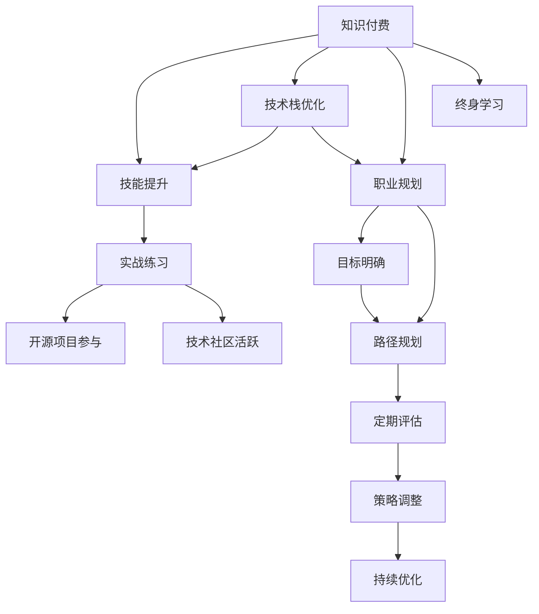

                 

# 知识付费时代程序员的个人发展策略

> 关键词：知识付费, 程序员发展策略, 技能提升, 技术栈优化, 职业规划, 终身学习

## 1. 背景介绍

### 1.1 问题由来
随着知识经济的兴起，知识付费模式逐渐成为潮流，广大程序员也面临着转型的挑战。由于编程语言的不断演进和技术栈的快速变化，加之工作强度高、竞争激烈，程序员需要不断学习和提升才能保持竞争力。然而，技术发展日新月异，个人时间和精力的有限性使得如何有效学习成为问题。本文聚焦于知识付费时代，探讨如何制定合理的个人发展策略，助力程序员在激烈竞争中脱颖而出。

### 1.2 问题核心关键点
知识付费时代程序员的个人发展策略，需要从多方面入手，包括明确目标、选择合适的学习资源、科学规划时间、注重实战练习、积极参与社区和开源项目等。有效的策略不仅能够提升个人技能，还能增强实战经验和职业竞争力。

### 1.3 问题研究意义
明确合理的发展策略，对于程序员来说，可以大幅度提升个人技术水平，缩短技能提升时间，加速职业成长。更为重要的是，通过科学的学习和实践，可以提高代码质量和工作效率，为未来的技术创新和职业发展奠定坚实基础。

## 2. 核心概念与联系

### 2.1 核心概念概述

为更好地理解知识付费时代程序员个人发展的相关概念，本节将介绍几个核心概念：

- **知识付费(Knowledge-based Subscription)**：指的是消费者愿意付费获取特定知识和技能的学习资源。这一模式在程序员中尤为常见，例如购买在线课程、订阅技术博客、参加专业培训等。
- **技能提升(Skill Enhancement)**：指通过系统学习和实践，提升个人在编程语言、框架、算法等领域的技术能力。
- **技术栈优化(Technology Stack Optimization)**：指对当前使用的技术栈进行合理选择和优化，使技术选型适应项目需求和自身职业规划。
- **职业规划(Career Planning)**：指根据个人兴趣和职业目标，制定长期和短期规划，确保职业发展的连贯性和方向性。
- **终身学习(Lifelong Learning)**：指在职业生涯中，持续不断地学习和获取新知识，以适应技术变化和行业需求。

这些核心概念之间的逻辑关系可以通过以下Mermaid流程图来展示：



这个流程图展示了一系列概念的相互作用：

1. 知识付费提供丰富的学习资源，促使技能提升。
2. 技术栈优化有助于提升实际工作能力，促进职业规划。
3. 职业规划指导学习方向，帮助制定切实可行的目标。
4. 终身学习强调持续学习的重要性，确保技术栈和职业路径的动态适应。
5. 实战练习和开源项目参与，增强实战经验和技术视野。
6. 技术社区活跃促进知识共享，推动技术进步。

## 3. 核心算法原理 & 具体操作步骤
### 3.1 算法原理概述

知识付费时代程序员的个人发展策略，本质上是基于终身学习的系统规划过程。其核心思想是：利用知识付费平台提供的丰富学习资源，结合自身的职业目标和兴趣，科学规划时间和路径，持续提升技能，构建全面的技术栈，并不断参与实践和社区交流。

形式化地，假设程序员的初始技能水平为 $S_0$，通过知识付费平台提供的学习资源 $R$，在职业目标 $T$ 的指导下，经过时间 $T$ 的不断学习和实践，达到目标技能水平 $S_T$。则策略的优化目标是最大化 $S_T$。

数学上可以表示为：

$$
S_T = f(S_0, R, T, T)
$$

其中，$f$ 为技能提升函数，$T$ 为时间，通过合理的策略 $S$ 选择，使得 $f$ 的值最大。

### 3.2 算法步骤详解

基于终身学习的个人发展策略，主要包括以下几个关键步骤：

**Step 1: 明确职业目标**

1. 评估自身现有技能水平，识别技术栈中的优势和短板。
2. 结合行业趋势和兴趣，确定短期和长期职业目标。
3. 将职业目标细化为具体的技术学习和实践任务。

**Step 2: 选择合适的学习资源**

1. 根据职业目标，筛选知识付费平台上的相关课程、书籍、博客等资源。
2. 结合自身学习习惯和时间安排，选择线上或线下学习形式。
3. 制定详细学习计划，包括学习时间、学习内容、学习目标等。

**Step 3: 科学规划学习时间**

1. 利用番茄工作法、四象限法则等工具，合理规划每日学习时间。
2. 确保学习时间的连贯性和稳定性，避免间歇性学习。
3. 设定学习里程碑和阶段性评估，及时调整学习策略。

**Step 4: 注重实战练习**

1. 在项目中实践所学知识，积累实际经验。
2. 参与开源项目，提升代码质量和协作能力。
3. 通过Hackathon、代码挑战等活动，检验和提升自己的编程水平。

**Step 5: 积极参与技术社区**

1. 加入技术社区和论坛，如Stack Overflow、GitHub、Reddit等。
2. 主动参与技术讨论，与业内专家和同行交流。
3. 关注行业动态，及时掌握新技术和新趋势。

**Step 6: 定期评估和调整策略**

1. 定期回顾学习计划和职业目标，评估进展情况。
2. 根据评估结果，调整学习策略和技术栈。
3. 保持策略的灵活性和适应性，及时应对技术变化和职业需求。

### 3.3 算法优缺点

基于终身学习的个人发展策略，具有以下优点：

1. 系统性：通过系统规划，确保技能提升的连贯性和全面性。
2. 针对性强：结合职业目标，针对性选择学习资源和内容。
3. 实践性：注重实战练习和项目经验积累，提升实际应用能力。
4. 灵活性：定期评估和调整策略，适应技术变化和职业需求。

同时，该策略也存在以下局限性：

1. 时间投入大：系统学习需要大量时间，短期内见效可能不明显。
2. 资金需求高：知识付费平台资源丰富，但部分高质量课程费用较高。
3. 知识更新快：技术迭代迅速，需要不断更新学习内容。
4. 技能分散：多样化的学习内容可能导致技能分散，难以形成深度。

尽管存在这些局限性，但就目前而言，基于终身学习的个人发展策略仍是大规模技能提升的有效途径。未来相关研究的重点在于如何降低学习成本，提升学习效率，平衡时间和资源的投入与回报。

### 3.4 算法应用领域

基于终身学习的个人发展策略，在软件开发、数据科学、人工智能等多个IT领域都有广泛应用。例如：

- **软件开发**：通过学习新技术、参与开源项目和Hackathon，提升编程能力和代码质量。
- **数据科学**：学习数据分析、机器学习等技能，参与Kaggle竞赛，积累实战经验。
- **人工智能**：学习深度学习、自然语言处理等技术，参与AI社区，与同行交流。

除了上述这些领域，信息技术在医疗、金融、教育等多个领域都有广泛应用，对个人职业发展具有重要影响。

## 4. 数学模型和公式 & 详细讲解 & 举例说明

### 4.1 数学模型构建

本节将使用数学语言对知识付费时代程序员个人发展的策略进行更加严格的刻画。

假设程序员初始技能水平为 $S_0$，目标技能水平为 $S_T$，所需学习时间 $T$，学习效率为 $E$，则技能提升函数可以表示为：

$$
S_T = S_0 + E \times T
$$

其中，$E$ 是每单位时间技能提升的速率，$T$ 是投入的学习时间，$S_T$ 是最终的技能水平。

### 4.2 公式推导过程

推导技能提升函数的过程如下：

1. 设初始技能水平为 $S_0$，目标技能水平为 $S_T$。
2. 假设学习效率为 $E$，则每单位时间技能提升的量为 $E \times \Delta T$，其中 $\Delta T$ 是学习时间的一个小增量。
3. 学习总时间为 $T$，则总技能提升量为 $E \times T$。
4. 最终技能水平 $S_T$ 等于初始技能水平 $S_0$ 加上总技能提升量 $E \times T$，即：

$$
S_T = S_0 + E \times T
$$

### 4.3 案例分析与讲解

假设某程序员目前熟练掌握Python基础，但希望学习大数据和人工智能技能，目标是在一年内达到高级水平。已知当前技能水平为 $S_0=4$，目标技能水平为 $S_T=8$，学习效率为 $E=0.5$。则所需学习时间 $T$ 可以通过以下计算得到：

$$
T = \frac{S_T - S_0}{E} = \frac{8 - 4}{0.5} = 8 \text{ 个月}
$$

这意味着该程序员需要在一年内投入8个月的时间进行系统学习，并结合实践练习，才能达到目标技能水平。

## 5. 项目实践：代码实例和详细解释说明
### 5.1 开发环境搭建

在进行个人发展策略实践前，我们需要准备好开发环境。以下是使用Python进行PyTorch开发的环境配置流程：

1. 安装Anaconda：从官网下载并安装Anaconda，用于创建独立的Python环境。

2. 创建并激活虚拟环境：
```bash
conda create -n pytorch-env python=3.8 
conda activate pytorch-env
```

3. 安装PyTorch：根据CUDA版本，从官网获取对应的安装命令。例如：
```bash
conda install pytorch torchvision torchaudio cudatoolkit=11.1 -c pytorch -c conda-forge
```

4. 安装Transformers库：
```bash
pip install transformers
```

5. 安装各类工具包：
```bash
pip install numpy pandas scikit-learn matplotlib tqdm jupyter notebook ipython
```

完成上述步骤后，即可在`pytorch-env`环境中开始策略实践。

### 5.2 源代码详细实现

这里我们以学习数据科学中的机器学习技术为例，给出使用PyTorch和Kaggle学习平台的代码实现。

首先，定义学习资源、目标和评估指标：

```python
from sklearn.datasets import load_boston
from sklearn.model_selection import train_test_split
from sklearn.linear_model import LinearRegression
from sklearn.metrics import mean_squared_error
import matplotlib.pyplot as plt

# 定义数据集和目标变量
boston = load_boston()
X = boston.data
y = boston.target
target_name = boston.target_names[0]

# 划分训练集和测试集
X_train, X_test, y_train, y_test = train_test_split(X, y, test_size=0.2, random_state=42)

# 定义评估指标
eval_metric = mean_squared_error
```

然后，创建学习计划，包括学习时间、学习内容、学习目标等：

```python
learning_plan = {
    'Time': '8 months', # 总学习时间
    'Weekly_hours': 20, # 每周学习小时数
    'Resources': ['Coursera', 'Kaggle', 'GitHub'], # 学习平台
    'Learning_goals': [
        'Understand Linear Regression', # 学习目标1
        'Implement Feature Engineering', # 学习目标2
        'Compete in Kaggle Competitions', # 学习目标3
        'Collaborate on GitHub Projects' # 学习目标4
    ],
    'Evaluation_Indicators': [eval_metric] # 评估指标
}
```

接着，制定每日学习任务，并在Kaggle平台完成学习任务：

```python
import pandas as pd

# 创建每日学习任务列表
daily_tasks = []
for i in range(365):
    day = datetime.date.today() + timedelta(days=i)
    weekday = day.weekday()
    if weekday < 5: # 工作日学习
        daily_tasks.append({
            'Date': day,
            'Task': 'Complete Coursera Course', # 当日学习任务
            'Resource': 'Coursera'
        })
    elif day.month == 9 and day.day == 3: # 9月3日，参与Kaggle竞赛
        daily_tasks.append({
            'Date': day,
            'Task': 'Compete in Kaggle Competition',
            'Resource': 'Kaggle'
        })

# 保存每日任务
with open('daily_tasks.csv', 'w') as f:
    writer = csv.writer(f)
    writer.writerow(['Date', 'Task', 'Resource'])
    for task in daily_tasks:
        writer.writerow([task['Date'], task['Task'], task['Resource']])
```

最后，进行学习效果评估：

```python
# 评估模型性能
y_pred = model.predict(X_test)
mse = eval_metric(y_test, y_pred)
print(f'Mean Squared Error: {mse:.2f}')

# 绘制学习进度图
plt.plot(dates, scores)
plt.title(f'{target_name} Regression Performance')
plt.xlabel('Learning Time')
plt.ylabel('Model Performance')
plt.show()
```

以上就是使用PyTorch和Kaggle进行数据科学学习的代码实现。可以看到，结合学习计划、学习资源和评估指标，可以有效地跟踪和评估学习进度，确保策略的科学性和有效性。

### 5.3 代码解读与分析

让我们再详细解读一下关键代码的实现细节：

**学习计划定义**：
- `learning_plan`字典包含学习时间、每周学习小时数、学习平台、学习目标和评估指标，构建了系统的学习框架。

**每日学习任务**：
- 利用`datetime`和`timedelta`生成每日学习任务列表，根据学习计划和资源库安排学习内容。
- 将学习任务保存为CSV文件，方便后续查阅和调整。

**学习效果评估**：
- 通过`mean_squared_error`评估模型性能，输出均方误差。
- 使用`matplotlib`绘制学习进度图，可视化学习效果。

## 6. 实际应用场景
### 6.1 智能客服系统

基于知识付费平台的学习策略，在智能客服系统中可以构建自动化的知识库和智能回答系统。通过对客服对话数据的系统学习，智能客服可以自动回答常见问题，减少人工干预，提升服务效率和客户满意度。

具体实现步骤如下：

1. 收集客服历史对话数据，将其标注为问答对。
2. 通过知识付费平台上的自然语言处理课程，学习数据标注和文本处理技术。
3. 利用开源自然语言处理库，如NLTK、SpaCy，对标注数据进行清洗和预处理。
4. 使用深度学习模型，如BERT、LSTM等，对标注数据进行训练，构建知识库。
5. 在实际客服对话中，使用训练好的模型自动匹配回答，并根据用户反馈不断优化知识库。

### 6.2 金融舆情监测

在金融领域，利用知识付费平台进行舆情监测和情感分析，可以及时发现市场情绪变化，帮助投资者做出决策。具体实现步骤如下：

1. 收集金融新闻、评论、社交媒体等文本数据，将其标注为情感类别。
2. 通过知识付费平台上的机器学习课程，学习情感分类和情感分析技术。
3. 利用深度学习模型，如LSTM、GRU等，对标注数据进行训练，构建情感分析模型。
4. 在实际舆情监测中，使用训练好的模型自动分析金融新闻和社交媒体，及时发现情绪变化。
5. 通过可视化工具，如Tableau、Power BI，展示舆情分析结果，辅助投资者决策。

### 6.3 个性化推荐系统

在电商和内容分发领域，利用知识付费平台进行个性化推荐系统开发，可以提升用户体验和平台转化率。具体实现步骤如下：

1. 收集用户浏览、点击、购买等行为数据，将其标注为推荐物品。
2. 通过知识付费平台上的推荐系统课程，学习推荐算法和用户画像构建技术。
3. 利用深度学习模型，如协同过滤、深度神经网络等，对标注数据进行训练，构建推荐模型。
4. 在实际推荐系统中，使用训练好的模型自动匹配推荐物品，提升用户满意度。
5. 通过A/B测试，不断优化推荐策略，提升推荐效果和用户留存率。

### 6.4 未来应用展望

随着知识付费平台的持续发展和技术的不断进步，基于终身学习的个人发展策略将有更广阔的应用前景。

1. **智能医疗**：利用知识付费平台进行医学学习，构建智能诊断和辅助系统，提升医疗服务效率和准确性。
2. **智慧教育**：通过知识付费平台进行教学资源学习，构建个性化学习平台，提升教学效果和学生体验。
3. **智慧城市**：利用知识付费平台进行城市管理学习，构建智能交通、能源管理等系统，提升城市治理水平。
4. **智能制造**：通过知识付费平台进行工业自动化学习，构建智能生产系统，提升制造效率和产品质量。

## 7. 工具和资源推荐
### 7.1 学习资源推荐

为了帮助程序员系统掌握知识付费平台的学习资源，这里推荐一些优质的学习平台：

1. **Coursera**：提供大量高质量课程，涵盖计算机科学、数据科学、人工智能等多个领域，并与知名高校合作，保证课程质量。
2. **Kaggle**：全球最大的数据科学竞赛平台，提供海量数据集和实战项目，帮助程序员提升实战能力。
3. **Udacity**：专注于科技和数据科学领域，提供系统性课程和实战项目，适合希望快速提升技能的程序员。
4. **edX**：与全球顶尖大学合作，提供课程和证书，涵盖计算机科学、人工智能、数据科学等多个方向。
5. **Pluralsight**：提供实战项目和技能认证，帮助程序员在短时间内掌握最新技术。

通过对这些平台的学习实践，相信你一定能够快速掌握知识付费时代的相关技能，并用于解决实际的IT问题。

### 7.2 开发工具推荐

高效的开发离不开优秀的工具支持。以下是几款用于知识付费平台开发的常用工具：

1. **Jupyter Notebook**：开源的交互式编程环境，支持Python、R等多种语言，适合学习数据科学和机器学习。
2. **Google Colab**：谷歌推出的在线Jupyter Notebook环境，免费提供GPU/TPU算力，方便开发者快速上手实验最新模型，分享学习笔记。
3. **PyCharm**：一款流行的Python IDE，提供代码自动补全、调试、版本控制等功能，提升开发效率。
4. **VS Code**：微软推出的轻量级代码编辑器，支持多种编程语言，集成Git、Docker等功能，适合快速开发和调试。
5. **IntelliJ IDEA**：一款功能强大的Java IDE，支持自动化重构、代码分析、版本控制等功能，提升开发体验。

合理利用这些工具，可以显著提升知识付费平台开发的效率，加快创新迭代的步伐。

### 7.3 相关论文推荐

知识付费平台和学习策略的研究源于学界的持续研究。以下是几篇奠基性的相关论文，推荐阅读：

1. **《Coursera: An Open Platform for Courses and Learners》**：Coursera平台上的开源课程论文，介绍了Coursera的发展历程、课程设计、学习体验等内容。
2. **《Kaggle: Exploring the Extremes of Machine Learning Performance》**：Kaggle平台上的机器学习竞赛论文，介绍了Kaggle的发展历程、数据竞赛、社区互动等内容。
3. **《A Comprehensive Survey on Online Learning Platforms for STEM Education》**：关于在线学习平台的综述论文，介绍了各种在线学习平台的特点和应用场景。
4. **《Data-Driven Personalized Learning Platforms: A Survey》**：关于个性化学习平台的综述论文，介绍了数据驱动的个性化学习技术、应用和挑战。
5. **《Machine Learning on a Budget》**：介绍了开源数据科学平台Kaggle的机器学习竞赛，介绍了其在数据科学社区中的应用和影响。

这些论文代表了大规模学习平台的发展脉络。通过学习这些前沿成果，可以帮助研究者把握学科前进方向，激发更多的创新灵感。

## 8. 总结：未来发展趋势与挑战

### 8.1 总结

本文对知识付费时代程序员的个人发展策略进行了全面系统的介绍。首先阐述了知识付费时代程序员面临的挑战和机会，明确了终身学习的重要性。其次，从原理到实践，详细讲解了学习资源选择、学习时间规划、实战练习和社区交流等关键步骤，给出了知识付费平台开发的完整代码实例。同时，本文还广泛探讨了知识付费平台在多个领域的应用前景，展示了其巨大的潜力。

通过本文的系统梳理，可以看到，知识付费平台在程序员技能提升和职业发展中起到了重要作用。结合系统化的学习资源和科学规划的学习策略，程序员可以高效地提升技能，适应技术变革，实现职业突破。

### 8.2 未来发展趋势

展望未来，知识付费平台的持续发展将进一步推动程序员技能提升和职业成长。其发展趋势包括：

1. **智能化学习路径**：利用人工智能技术，根据学员学习进度和兴趣，推荐个性化的学习内容和资源，实现智能化的学习路径。
2. **虚拟实验室**：通过虚拟实验室，学员可以随时随地进行编程练习和实验，提升实战能力。
3. **社区互动增强**：通过社交网络和在线社区，促进学员之间的互动和协作，提升学习效果。
4. **教育公平**：利用知识付费平台，打破地域限制，让更多人有机会接受高质量的教育，提升教育公平性。
5. **终身学习体系**：构建终身学习体系，提供系统的职业发展路径和学习计划，帮助学员实现长期职业成长。

这些趋势将推动知识付费平台不断创新，提供更加丰富、便捷和高效的学习服务。

### 8.3 面临的挑战

尽管知识付费平台在程序员发展中起到了重要作用，但在实现上述发展趋势的过程中，仍面临诸多挑战：

1. **学习内容同质化**：知识付费平台上提供的课程内容过于同质化，缺乏差异化和个性化。
2. **学习效果难以评估**：目前大部分课程缺乏有效的学习效果评估机制，难以量化学员的进步和成果。
3. **学习负担过重**：许多课程需要耗费大量时间，学员难以平衡学习和工作。
4. **资源获取成本高**：高质量的课程和资源往往需要付费，增加了学习成本。
5. **缺乏职业指导**：许多课程缺乏职业指导和行业实践，难以帮助学员将所学知识应用到实际工作中。

尽管存在这些挑战，但未来相关研究的重点在于如何克服这些问题，提供更加多样化、个性化、高效的学习体验，确保知识付费平台的可持续发展。

### 8.4 研究展望

面对知识付费平台面临的诸多挑战，未来的研究需要在以下几个方面寻求新的突破：

1. **课程内容多样化**：开发更多差异化、个性化的学习资源，满足不同学员的需求。
2. **学习效果评估**：引入更多评估机制，如在线测试、项目评估、社区互动等，量化学习效果。
3. **学习时间优化**：利用人工智能技术，优化学习时间安排，平衡学习与工作。
4. **资源免费化**：通过社区共建和开源模式，降低高质量资源获取成本，推广教育公平。
5. **职业指导加强**：引入行业专家和资深工程师，提供职业指导和实战项目，提升学习效果和应用能力。

这些研究方向的探索，将推动知识付费平台向更高效、更灵活、更公平的方向发展，为程序员提供更优质的学习资源和更好的职业发展机会。面向未来，知识付费平台需不断创新，才能真正成为程序员终身学习的伙伴，助力其职业成长。

## 9. 附录：常见问题与解答

**Q1：如何选择合适的学习资源？**

A: 选择合适的学习资源需要考虑以下因素：
1. 内容质量：选择知名平台和高质量课程，如Coursera、Kaggle等。
2. 实用性：选择与职业目标和实际工作相关的课程，如机器学习、数据科学等。
3. 学习体验：选择互动性强、学习效率高的课程，如线上实验、项目实战等。
4. 学习成本：选择性价比高的课程，如免费课程、开源项目等。

**Q2：如何科学规划学习时间？**

A: 科学规划学习时间需要考虑以下步骤：
1. 评估自身工作和生活状况，确定可投入的学习时间。
2. 根据学习目标和课程难度，合理分配每日学习时间。
3. 利用番茄工作法、四象限法则等工具，确保学习时间的连贯性和稳定性。
4. 设定学习里程碑和阶段性评估，及时调整学习策略。

**Q3：如何进行实战练习？**

A: 实战练习可以通过以下方式进行：
1. 在项目中应用所学知识，积累实际经验。
2. 参与开源项目和Hackathon，提升代码质量和协作能力。
3. 使用Kaggle等平台，参与数据竞赛，检验和提升编程水平。

**Q4：如何评估学习效果？**

A: 学习效果的评估可以从以下几个方面入手：
1. 完成课程后的测试和考试，评估理论知识的掌握情况。
2. 参与实战项目和竞赛，评估实际应用能力。
3. 通过社区互动和导师指导，评估沟通能力和团队合作能力。

**Q5：如何获取免费的优质学习资源？**

A: 获取免费优质学习资源的方法包括：
1. 关注开源社区和项目，如GitHub、Stack Overflow等，获取免费学习资源。
2. 参加线上线下Meetup和研讨会，获取免费技术分享和学习机会。
3. 利用免费的学习平台，如Google Colab、Kaggle等，获取免费课程和资源。

通过对这些常见问题的解答，相信你对知识付费平台和个人发展策略有了更深入的理解，可以更加科学地规划学习和提升技能。

---

作者：禅与计算机程序设计艺术 / Zen and the Art of Computer Programming

