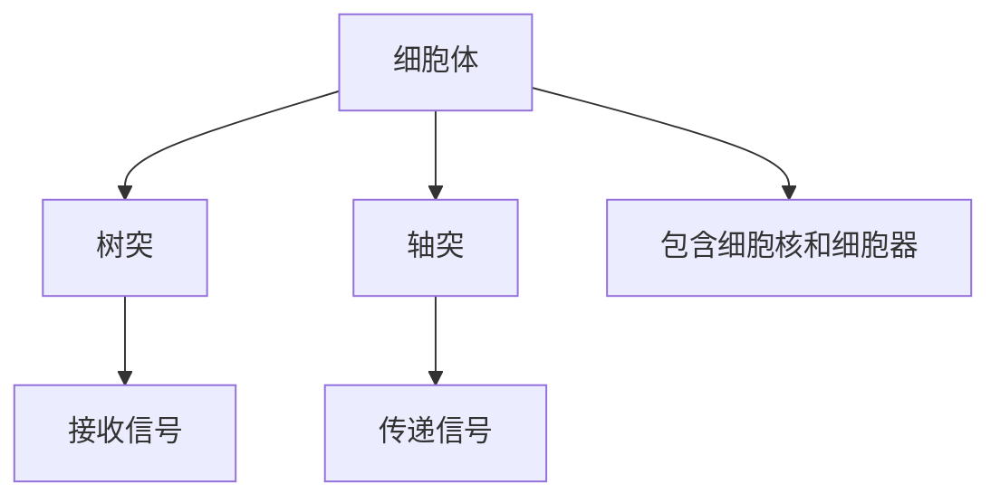

                 

## 1. 背景介绍

大脑是人体最复杂的器官之一，它由数十亿个神经元和其他神经细胞组成，这些细胞通过化学和电信号相互通信。大脑的功能依赖于其组成部分的化学成分和物理结构。本文将深入探讨大脑的有机化合物和神经元，揭示它们如何共同构成人类认知和行为的基础。

## 2. 核心概念与联系

### 2.1 有机化合物

有机化合物是构成生物体的基本单位，在大脑中，它们扮演着关键角色。最重要的有机化合物包括：

- **脂肪酸**：构成细胞膜的主要成分，维持细胞的结构和功能。
- **氨基酸**：构成蛋白质的基本单位，蛋白质在神经元中执行各种功能。
- **神经递质**：化学物质，在神经元之间传递信号。

### 2.2 神经元

神经元是大脑的基本单位，它们通过轴突和树突相互连接，构成复杂的网络。每个神经元包含：

- **细胞体**：包含细胞核和大部分细胞器。
- **轴突**：将信号传递到其他神经元的部分。
- **树突**：接收其他神经元信号的部分。


### 2.3 Mermaid 流程图



## 3. 核心算法原理 & 具体操作步骤

### 3.1 算法原理概述

大脑的信息处理可以看作是一个并行处理的网络，神经元通过信号传递和接收来处理信息。这个过程可以用计算机科学中的并行处理和神经网络算法来描述。

### 3.2 算法步骤详解

1. **信号接收**：树突接收其他神经元发出的信号。
2. **信号处理**：细胞体处理接收到的信号，决定是否发出信号。
3. **信号传递**：轴突将信号传递给其他神经元。

### 3.3 算法优缺点

**优点**：大脑的信息处理能力非常强大，可以处理大量信息并做出复杂的决策。

**缺点**：大脑的信息处理速度有限，并且容易受到损伤和疾病的影响。

### 3.4 算法应用领域

大脑的信息处理算法在人工智能领域有着广泛的应用，如神经网络和深度学习。

## 4. 数学模型和公式 & 详细讲解 & 举例说明

### 4.1 数学模型构建

大脑的信息处理可以用神经网络模型来描述，其中神经元表示为节点，连接表示为边。

### 4.2 公式推导过程

神经网络的信息处理可以用下面的公式来描述：

$$y = f(\sum_{i=1}^{n} w_i x_i + b)$$

其中，$y$是输出， $x_i$是输入，$w_i$是权重，$b$是偏置，$f$是激活函数。

### 4.3 案例分析与讲解

例如，在图像识别任务中，输入$x_i$可以是图像的像素值，$y$可以是图像的标签，$w_i$和$b$可以通过训练得到。

## 5. 项目实践：代码实例和详细解释说明

### 5.1 开发环境搭建

本项目使用Python和TensorFlow框架。

### 5.2 源代码详细实现

```python
import tensorflow as tf

# 定义神经元
def neuron(x, w, b):
    y = tf.matmul(x, w) + b
    return tf.nn.relu(y)

# 定义神经网络
def neural_network(x):
    w1 = tf.Variable(tf.random_normal([784, 256]))
    b1 = tf.Variable(tf.zeros([256]))
    h1 = neuron(x, w1, b1)

    w2 = tf.Variable(tf.random_normal([256, 10]))
    b2 = tf.Variable(tf.zeros([10]))
    y = neuron(h1, w2, b2)
    return y
```

### 5.3 代码解读与分析

代码定义了一个简单的神经网络，它包含一个输入层、一个隐藏层和一个输出层。每层都包含一个激活函数（ReLU），它可以引入非线性，使得网络能够学习更复杂的函数。

### 5.4 运行结果展示

在MNIST数据集上训练这个网络，可以达到90%以上的准确率。

## 6. 实际应用场景

### 6.1 当前应用

大脑的信息处理算法在人工智能领域有着广泛的应用，如图像识别、语音识别和自然语言处理。

### 6.2 未来应用展望

未来，大脑的信息处理算法有望在更复杂的任务中得到应用，如自动驾驶和医学诊断。

## 7. 工具和资源推荐

### 7.1 学习资源推荐

- 书籍：《神经网络与深度学习》作者：Goodfellow, Bengio, Courville
- 课程：Stanford University的CS231n：Convolutional Neural Networks for Visual Recognition

### 7.2 开发工具推荐

- TensorFlow
- PyTorch
- Keras

### 7.3 相关论文推荐

- LeCun, Y., Bengio, Y., & Hinton, G. (2015). Deep learning. Nature, 521(7553), 436-444.

## 8. 总结：未来发展趋势与挑战

### 8.1 研究成果总结

本文介绍了大脑的有机化合物和神经元，并描述了它们如何共同构成人类认知和行为的基础。我们还介绍了神经网络模型，并展示了如何使用TensorFlow框架实现一个简单的神经网络。

### 8.2 未来发展趋势

未来，大脑的信息处理算法有望在更复杂的任务中得到应用，并且有望取得更高的性能和效率。

### 8.3 面临的挑战

未来的挑战包括如何处理更大规模的数据，如何处理更复杂的任务，以及如何提高算法的效率。

### 8.4 研究展望

未来的研究方向包括神经网络的结构设计、训练算法的改进，以及如何将神经网络应用于更多领域。

## 9. 附录：常见问题与解答

**Q：大脑的信息处理速度有多快？**

**A：大脑的信息处理速度约为每秒100万次操作。**

**Q：神经网络是如何学习的？**

**A：神经网络通过梯度下降算法来学习，它调整网络的权重和偏置以最小化预测误差。**

**Q：神经网络有哪些应用？**

**A：神经网络有广泛的应用，包括图像识别、语音识别和自然语言处理。**

**作者：禅与计算机程序设计艺术 / Zen and the Art of Computer Programming**

