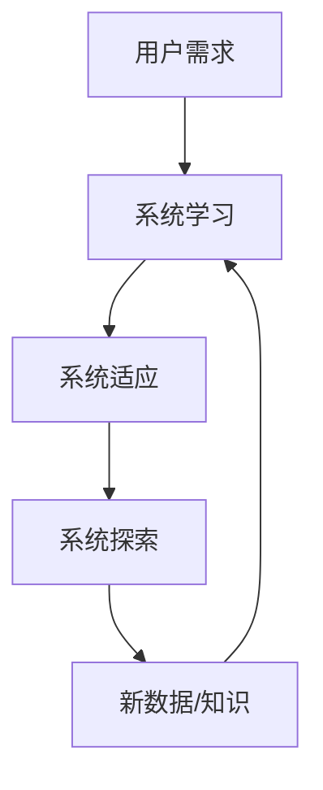

                 

## 1. 背景介绍

好奇心是人类与生俱来的一种本能，它驱使我们去探索未知，寻求新的知识和体验。在计算机科学领域，好奇心同样扮演着至关重要的角色。它是推动技术创新和发展的动力，是我们不断追求更高效、更智能、更人性化的软件系统的源泉。

本文将深入探讨好奇心在计算机科学中的作用，重点关注它如何影响软件架构设计。我们将从核心概念开始，然后介绍关键算法和数学模型，并提供实际的项目实践和工具资源。最后，我们将总结未来发展趋势和挑战，并提供常见问题的解答。

## 2. 核心概念与联系

### 2.1 好奇心驱动的软件架构

好奇心驱动的软件架构是一种新颖的架构设计理念，它将好奇心作为设计的核心动力。这种架构鼓励系统不断学习和适应，从而提高其智能和灵活性。它的核心概念包括：

- **自适应**：系统能够根据环境变化和用户需求调整其行为。
- **学习**：系统能够从数据中学习，不断改进其性能和决策。
- **探索**：系统主动寻求新的数据和知识，以丰富其经验。

### 2.2 好奇心驱动的软件架构原理架构图



## 3. 核心算法原理 & 具体操作步骤

### 3.1 算法原理概述

好奇心驱动的软件架构通常基于机器学习和人工智能算法。其中，强化学习是一种常用的算法，它鼓励系统通过尝试不同的行为来学习和适应环境。

### 3.2 算法步骤详解

1. **状态观察**：系统观察当前环境状态。
2. **动作选择**：系统选择一个动作，根据好奇心的驱动，系统可能会选择探索新的动作。
3. **结果反馈**：系统执行动作后，环境提供反馈，系统根据反馈更新其学习模型。
4. **学习更新**：系统更新其学习模型，以改进其决策。

### 3.3 算法优缺点

**优点**：

- 系统能够适应环境变化。
- 系统能够学习和改进其决策。
- 系统主动寻求新的数据和知识。

**缺点**：

- 学习过程可能需要大量的时间和资源。
- 系统可能会面临过度探索或过度学习的问题。
- 系统的决策可能会受到学习数据的偏见影响。

### 3.4 算法应用领域

好奇心驱动的软件架构可以应用于各种领域，包括自动驾驶、医疗诊断、金融风险管理等。它特别适用于那些环境动态变化、需要不断学习和适应的系统。

## 4. 数学模型和公式 & 详细讲解 & 举例说明

### 4.1 数学模型构建

强化学习的数学模型通常基于马尔可夫决策过程（MDP）。MDP是一种随机过程，它由状态转移概率和奖励函数定义。

### 4.2 公式推导过程

给定状态$s_t$和动作$a_t$，下一个状态$s_{t+1}$和奖励$r_{t+1}$由转移概率$P(s_{t+1}|s_t,a_t)$和奖励函数$R(s_t,a_t,s_{t+1})$决定。学习目标是找到最优策略$\pi^*$，使得期望回报最大化：

$$J^{\pi}(s) = E[R_{t} + \gamma R_{t+1} + \gamma^2 R_{t+2} + \cdots | s_t = s, \pi]$$

其中$\gamma$是折扣因子，控制未来回报的重要性。

### 4.3 案例分析与讲解

例如，在自动驾驶系统中，状态$s_t$可以表示当前车辆的位置、速度和方向，动作$a_t$可以表示加速、减速或转向。转移概率$P(s_{t+1}|s_t,a_t)$描述了根据当前状态和动作，车辆将处于下一个状态的概率。奖励函数$R(s_t,a_t,s_{t+1})$可以根据安全性、舒适性和效率等因素设计。

## 5. 项目实践：代码实例和详细解释说明

### 5.1 开发环境搭建

我们将使用Python和Stable Baselines3库来实现一个简单的强化学习算法。首先，安装必要的库：

```bash
pip install stable-baselines3[extra] gym[extra] numpy pandas
```

### 5.2 源代码详细实现

以下是一个简单的Q-Learning算法的实现：

```python
import gym
import numpy as np
import pandas as pd
from stable_baselines3 import QLearning
from stable_baselines3.common.policies import MlpPolicy
from stable_baselines3.common.vec_env import DummyVecEnv

# 创建环境
env = gym.make('CartPole-v1')
env = DummyVecEnv([lambda: env])

# 创建QLearning算法实例
model = QLearning(MlpPolicy, env, n_steps=2048)

# 训练模型
model.learn(total_timesteps=25000)

# 保存模型
model.save("cartpole_ql")
```

### 5.3 代码解读与分析

我们首先创建了一个CartPole环境，这是一个简单的控制任务，目标是保持一根杆子在一个小车上保持直立。然后，我们创建了一个QLearning算法实例，并使用Stable Baselines3库提供的MlpPolicy（多层感知机策略）来定义策略网络。我们设置了n_steps=2048，表示每个更新周期使用2048个样本。最后，我们训练模型，并保存它。

### 5.4 运行结果展示

训练好的模型可以通过以下代码测试：

```python
from stable_baselines3 import QLearning
from stable_baselines3.common.policies import MlpPolicy
from stable_baselines3.common.vec_env import DummyVecEnv

# 加载模型
model = QLearning.load("cartpole_ql")

# 创建环境
env = gym.make('CartPole-v1')
env = DummyVecEnv([lambda: env])

# 测试模型
obs = env.reset()
while True:
    action, _states = model.predict(obs)
    obs, rewards, dones, info = env.step(action)
    env.render()
    if dones[0]:
        obs = env.reset()
```

运行这段代码，您将看到小车如何保持杆子直立。

## 6. 实际应用场景

### 6.1 当前应用

好奇心驱动的软件架构已经在各种领域得到应用，包括：

- **自动驾驶**：系统学习路况，适应交通规则，并探索新的路线。
- **医疗诊断**：系统学习病例，适应新的症状，并探索新的治疗方案。
- **金融风险管理**：系统学习市场变化，适应新的风险，并探索新的投资策略。

### 6.2 未来应用展望

未来，好奇心驱动的软件架构有望在更多领域得到应用，包括：

- **人工智能助手**：系统学习用户习惯，适应新的需求，并主动提供帮助。
- **智能家居**：系统学习家庭活动模式，适应新的需求，并主动提供服务。
- **虚拟现实**：系统学习用户行为，适应新的环境，并提供个性化体验。

## 7. 工具和资源推荐

### 7.1 学习资源推荐

- **书籍**："Reinforcement Learning: An Introduction" by Richard S. Sutton and Andrew G. Barto
- **在线课程**：Coursera的"Reinforcement Learning"课程
- **文档**：Stable Baselines3的官方文档（<https://stable-baselines3.readthedocs.io/en/master/>）

### 7.2 开发工具推荐

- **Python**：一个强大的编程语言，支持丰富的机器学习库。
- **Stable Baselines3**：一个基于PyTorch的强化学习库。
- **Gym**：一个开源的机器学习环境库。

### 7.3 相关论文推荐

- "Human-level control through deep reinforcement learning" by DeepMind
- "Mastering Chess and Shogi by Self-Play with a General Reinforcement Learning Algorithm" by AlphaZero
- "Deep Reinforcement Learning for Continuous Control" by DeepMind

## 8. 总结：未来发展趋势与挑战

### 8.1 研究成果总结

好奇心驱动的软件架构已经取得了显著的研究成果，包括自动驾驶、医疗诊断和金融风险管理等领域的应用。

### 8.2 未来发展趋势

未来，好奇心驱动的软件架构有望在更多领域得到应用，并与其他人工智能技术结合，提供更智能、更人性化的体验。

### 8.3 面临的挑战

好奇心驱动的软件架构面临的挑战包括学习过程的资源需求、过度探索或过度学习的问题，以及学习数据的偏见问题。

### 8.4 研究展望

未来的研究将关注如何提高学习效率、如何避免过度探索或过度学习，以及如何减少学习数据的偏见。

## 9. 附录：常见问题与解答

**Q：好奇心驱动的软件架构需要大量的数据吗？**

**A**：是的，好奇心驱动的软件架构通常需要大量的数据来学习。然而，一些技术，如模拟学习和生成对抗网络，可以帮助生成额外的数据。

**Q：好奇心驱动的软件架构是否会导致系统过度探索？**

**A**：是的，好奇心驱动的软件架构可能会导致系统过度探索，从而浪费资源。因此，需要设计合适的探索策略，平衡探索和利用。

**Q：好奇心驱动的软件架构是否会受到学习数据的偏见影响？**

**A**：是的，好奇心驱动的软件架构可能会受到学习数据的偏见影响。因此，需要注意数据收集和预处理的过程，并考虑使用偏见调整技术。

---

作者：禅与计算机程序设计艺术 / Zen and the Art of Computer Programming

