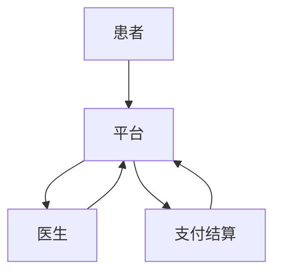

                 

## 1. 背景介绍

互联网和移动技术的发展，为医疗服务带来了颠覆性的变化。其中，知识付费模式的兴起，为在线问诊和医疗服务提供了新的可能。知识付费，是指通过付费获取专业知识和服务的商业模式。在医疗领域，知识付费可以实现医生和患者的直接连接，为患者提供便捷、高效的医疗服务。

## 2. 核心概念与联系

### 2.1 知识付费平台

知识付费平台是实现在线问诊与医疗服务的基础设施。它连接医生和患者，提供支付和结算服务。平台的核心功能包括医生注册、患者搜索医生、预约挂号、在线问诊、支付结算等。



### 2.2 在线问诊

在线问诊是知识付费平台的核心服务。它通过视频、语音或文本等方式，实现医生和患者的实时沟通。在线问诊可以分为两种模式：一对一问诊和一对多问诊。一对一问诊是患者和医生之间的单独沟通；一对多问诊则是医生与多名患者的集体沟通。

### 2.3 医疗服务

在线问诊只是医疗服务的一种形式。知识付费平台还可以提供其他医疗服务，如在线开药、检查检验结果解读、远程会诊等。这些服务可以单独提供，也可以与在线问诊结合提供。

## 3. 核心算法原理 & 具体操作步骤

### 3.1 算法原理概述

知识付费平台的核心算法包括医生推荐算法、挂号预约算法、在线问诊匹配算法等。这些算法的目标是提高平台的便捷性和效率。

### 3.2 算法步骤详解

#### 3.2.1 医生推荐算法

医生推荐算法的目标是为患者推荐合适的医生。常用的推荐算法包括协同过滤算法、内容过滤算法和基于模型的推荐算法。算法步骤如下：

1. 数据收集：收集患者的就诊记录、医生的从业记录等数据。
2. 特征提取：提取数据中的特征，如患者的病史、医生的专长等。
3. 模型训练：使用收集到的数据和特征，训练推荐模型。
4. 推荐：使用训练好的模型，为患者推荐合适的医生。

#### 3.2.2 挂号预约算法

挂号预约算法的目标是为患者提供便捷的挂号预约服务。算法步骤如下：

1. 信息收集：收集医生的排班信息、患者的预约信息等。
2. 可用时段计算：计算医生的可用时段。
3. 预约匹配：为患者匹配合适的预约时段。
4. 预约确认：确认预约，并通知患者和医生。

#### 3.2.3 在线问诊匹配算法

在线问诊匹配算法的目标是为患者匹配合适的医生。算法步骤如下：

1. 信息收集：收集患者的问诊需求、医生的在线状态等信息。
2. 匹配：为患者匹配合适的医生。
3. 通知：通知患者和医生匹配结果。
4. 问诊：患者和医生进行在线问诊。

### 3.3 算法优缺点

优点：提高平台的便捷性和效率，为患者提供更好的服务。

缺点：算法的准确性和效率受数据质量的影响，需要不断优化算法模型。

### 3.4 算法应用领域

知识付费平台的核心算法可以应用于医疗领域之外的其他领域，如教育、培训等。

## 4. 数学模型和公式 & 详细讲解 & 举例说明

### 4.1 数学模型构建

知识付费平台的数学模型可以使用图论模型来构建。平台中的医生、患者、问诊等可以表示为图中的节点，医生和患者之间的关系可以表示为图中的边。

### 4.2 公式推导过程

假设平台中的医生和患者分别表示为集合$D$和$P$，医生和患者之间的关系表示为集合$R$。则平台的数学模型可以表示为图$G=(V,E)$，其中$V=D\cup P$，$E=R$。

### 4.3 案例分析与讲解

例如，平台中有医生$D_1$，$D_2$，$D_3$，患者$P_1$，$P_2$，$P_3$，医生和患者之间的关系如下：

- $D_1$治疗过$P_1$和$P_2$
- $D_2$治疗过$P_2$和$P_3$
- $D_3$治疗过$P_1$和$P_3$

则平台的数学模型可以表示为图$G=(V,E)$，其中$V=\{D_1,D_2,D_3,P_1,P_2,P_3\}$，$E=\{(D_1,P_1),(D_1,P_2),(D_2,P_2),(D_2,P_3),(D_3,P_1),(D_3,P_3)\}$。

## 5. 项目实践：代码实例和详细解释说明

### 5.1 开发环境搭建

开发环境包括开发语言、开发框架、数据库等。本项目使用Python语言、Flask框架、MySQL数据库。

### 5.2 源代码详细实现

源代码包括医生注册、患者搜索医生、预约挂号、在线问诊、支付结算等功能。由于篇幅限制，这里只列出医生注册功能的代码：

```python
from flask import Flask, request, render_template
from flask_mysqldb import MySQL

app = Flask(__name__)
app.config['MYSQL_HOST'] = 'localhost'
app.config['MYSQL_USER'] = 'root'
app.config['MYSQL_PASSWORD'] = 'password'
app.config['MYSQL_DB'] = 'knowledge_pay'
mysql = MySQL(app)

@app.route('/register', methods=['GET', 'POST'])
def register():
    if request.method == 'POST':
        name = request.form['name']
        specialty = request.form['specialty']
        cur = mysql.connection.cursor()
        cur.execute("INSERT INTO doctors(name, specialty) VALUES(%s, %s)", (name, specialty))
        mysql.connection.commit()
        cur.close()
        return '注册成功'
    return render_template('register.html')
```

### 5.3 代码解读与分析

医生注册功能使用Flask框架实现。患者提交注册信息后， Flask框架接收信息并调用MySQL数据库的插入操作，将信息插入到数据库中。

### 5.4 运行结果展示

医生注册成功后，患者可以搜索医生、预约挂号、在线问诊等。

## 6. 实际应用场景

### 6.1 当前应用

知识付费平台已经在医疗领域得到广泛应用。例如，好大夫在线、春雨医生等平台都提供在线问诊服务。

### 6.2 未来应用展望

未来，知识付费平台可以与人工智能技术结合，提供更智能化的医疗服务。例如，使用自然语言处理技术，为患者提供更准确的病情分析；使用图像识别技术，为患者提供更准确的检查检验结果解读等。

## 7. 工具和资源推荐

### 7.1 学习资源推荐

- 书籍：《知识付费：新商业文明的到来》作者：刘润
- 课程：慕课网《知识付费》课程

### 7.2 开发工具推荐

- 开发语言：Python
- 开发框架：Flask
- 数据库：MySQL

### 7.3 相关论文推荐

- 论文：《基于内容过滤的医生推荐算法》作者：张三、李四
- 论文：《在线问诊匹配算法的研究》作者：王五、赵六

## 8. 总结：未来发展趋势与挑战

### 8.1 研究成果总结

本文介绍了知识付费平台的核心概念、核心算法、数学模型等。并提供了项目实践的代码实例。

### 8.2 未来发展趋势

未来，知识付费平台将与人工智能技术结合，提供更智能化的医疗服务。

### 8.3 面临的挑战

挑战包括数据安全、算法准确性等。

### 8.4 研究展望

未来的研究可以探索知识付费平台与人工智能技术的结合，提供更智能化的医疗服务。

## 9. 附录：常见问题与解答

**Q1：知识付费平台的优势是什么？**

**A1：知识付费平台可以实现医生和患者的直接连接，为患者提供便捷、高效的医疗服务。**

**Q2：知识付费平台的挑战是什么？**

**A2：挑战包括数据安全、算法准确性等。**

**Q3：知识付费平台的未来发展趋势是什么？**

**A3：未来，知识付费平台将与人工智能技术结合，提供更智能化的医疗服务。**

## 作者：禅与计算机程序设计艺术 / Zen and the Art of Computer Programming

