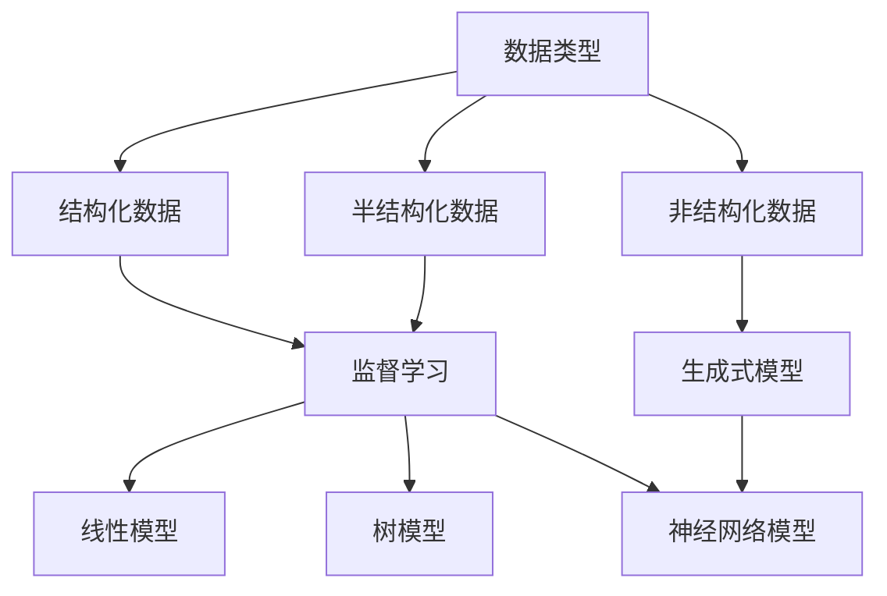

                 

## 1. 背景介绍

在当今的数字化时代，人工智能（AI）已经渗透到我们的日常生活和工作中，从语音助手到自动驾驶汽车，再到智能客服，AI 工具无处不在。然而，面对数不胜数的 AI 工具，如何选择适合自己的 AI 工具呢？本文将提供一套系统的方法，帮助您选择最适合您需求的 AI 工具。

## 2. 核心概念与联系

在选择 AI 工具之前，我们需要理解一些核心概念。AI 工具的选择通常取决于您的需求和数据。以下是一些关键概念：

- **数据类型**：结构化数据（如 CSV 文件）、半结构化数据（如 JSON 文件）或非结构化数据（如文本、图像、音频）。
- **任务类型**：监督学习（分类、回归）、无监督学习（聚类）、强化学习（决策过程）或生成式模型（文本生成、图像生成）。
- **模型类型**：线性模型（逻辑回归）、树模型（决策树、随机森林）、神经网络模型（CNN、RNN、Transformer）等。

以下是这些概念的关系示意图：



## 3. 核心算法原理 & 具体操作步骤

### 3.1 算法原理概述

选择 AI 工具的关键是理解其背后的算法原理。例如，如果您需要处理文本数据，您可能需要选择基于 transformer 模型的 AI 工具，如 BERT。

### 3.2 算法步骤详解

选择 AI 工具的过程可以分为以下几个步骤：

1. **定义需求**：明确您的需求，包括数据类型、任务类型和模型类型。
2. **收集数据**：收集与您的需求相关的数据。
3. **预处理数据**：清洗、转换和标准化数据。
4. **选择 AI 工具**：基于您的需求和数据，选择合适的 AI 工具。
5. **训练模型**：使用选择的 AI 工具训练模型。
6. **评估模型**：评估模型的性能。
7. **部署模型**：将模型部署到生产环境中。

### 3.3 算法优缺点

每种 AI 工具都有其优缺点。例如，基于 transformer 的模型在处理文本数据方面表现出色，但计算开销很大。因此，在选择 AI 工具时，您需要权衡其优缺点。

### 3.4 算法应用领域

不同的 AI 工具适用于不同的领域。例如，在自然语言处理领域，BERT 表现出色；在图像分类领域，ResNet 表现出色。

## 4. 数学模型和公式 & 详细讲解 & 举例说明

### 4.1 数学模型构建

在选择 AI 工具时，理解其数学模型是很有帮助的。例如，线性回归的数学模型是：

$$y = wx + b$$

其中，$y$ 是目标变量，$x$ 是特征向量，$w$ 是权重，$b$ 是偏置项。

### 4.2 公式推导过程

理解数学模型的推导过程有助于您选择合适的 AI 工具。例如，线性回归的权重和偏置项可以通过最小化平方误差来学习：

$$\min_w, b \sum_{i=1}^{n} (y_i - wx_i - b)^2$$

### 4.3 案例分析与讲解

让我们以一个简单的例子来说明如何选择 AI 工具。假设您需要构建一个文本分类器，用于将电子邮件分类为“ spam”或“ham”（非垃圾邮件）。在这种情况下，您的数据是非结构化的文本数据，任务类型是监督学习（分类），模型类型可以是神经网络模型。因此，您可以选择基于 transformer 的模型，如 BERT。

## 5. 项目实践：代码实例和详细解释说明

### 5.1 开发环境搭建

在开始编写代码之前，您需要搭建开发环境。对于大多数 AI 项目，您需要安装 Python、TensorFlow 和 PyTorch 等库。

### 5.2 源代码详细实现

以下是使用 BERT 进行文本分类的 Python 代码示例：

```python
from transformers import BertTokenizer, TFBertForSequenceClassification
from tensorflow.keras.preprocessing.sequence import pad_sequences

# Load pre-trained model tokenizer (vocabulary)
tokenizer = BertTokenizer.from_pretrained('bert-base-uncased')

# Tokenize all of the sentences and map the tokens to their word IDs
input_ids = []
attention_masks = []

# For every sentence
for sent in sentences:
    # `encode_plus` will:
    #   (1) Tokenize the sentence
    #   (2) Prepend the `[CLS]` token to the start
    #   (3) Append the `[SEP]` token to the end
    #   (4) Map tokens to their IDs
    #   (5) Pad or truncate the sentence to `max_length`
    #   (6) Create attention masks for [PAD] tokens
    encoded_dict = tokenizer.encode_plus(
        sent,
        add_special_tokens = True,
        max_length = 64,
        pad_to_max_length = True,
        return_attention_mask = True,
        return_tensors = 'tf',
    )

    # Add the encoded sentence to the list
    input_ids.append(encoded_dict['input_ids'])

    # And its attention mask (simply differentiates padding from non-padding)
    attention_masks.append(encoded_dict['attention_mask'])

# Convert the lists into tensors
input_ids = tf.concat(input_ids, 0)
attention_masks = tf.concat(attention_masks, 0)

# Load pre-trained model (weights)
model = TFBertForSequenceClassification.from_pretrained('bert-base-uncased',
                                                        num_labels = 2,
                                                        from_tf = True)

# Train the model
model.compile(optimizer=tf.keras.optimizers.Adam(learning_rate=3e-5, epsilon=1e-08, clipnorm=1.0),
              loss=tf.keras.losses.SparseCategoricalCrossentropy(from_logits=True),
              metrics=[tf.keras.metrics.SparseCategoricalAccuracy('accuracy')])

model.fit(input_ids, labels, batch_size=32, epochs=4, validation_data=(val_input_ids, val_labels))
```

### 5.3 代码解读与分析

这段代码使用 BERT 进行文本分类。它首先加载预训练的 BERT 模型和分词器。然后，它对句子进行分词，并将分词结果映射到其 ID。它还创建注意力掩码，用于区分填充和非填充令牌。最后，它训练模型。

### 5.4 运行结果展示

运行这段代码后，您应该会看到模型的训练过程和性能指标。

## 6. 实际应用场景

AI 工具在各种领域都有实际应用。例如，在医疗保健领域，AI 工具用于疾病诊断和药物发现。在金融领域，AI 工具用于风险评估和欺诈检测。在零售业，AI 工具用于客户细分和个性化推荐。

### 6.1 当前应用

当前，AI 工具正在各种领域得到广泛应用。例如，在自然语言处理领域，BERT 已经成为标准模型，用于各种任务，从文本分类到命名实体识别。

### 6.2 未来应用展望

未来，AI 工具的应用将会更加广泛。例如，在自动驾驶汽车领域，AI 工具将用于感知和决策。在人工智能道德领域，AI 工具将用于帮助我们理解和评估 AI 的道德影响。

## 7. 工具和资源推荐

### 7.1 学习资源推荐

以下是一些学习 AI 的优秀资源：

- **课程**：快速机器学习（Fast.ai）、Hands-on Machine Learning with Scikit-Learn, Keras, and TensorFlow
- **书籍**： Pattern Recognition and Machine Learning、Deep Learning
- **在线资源**：Kaggle、Towards Data Science

### 7.2 开发工具推荐

以下是一些开发 AI 的优秀工具：

- **开发环境**：Jupyter Notebook、Google Colab
- **库**：TensorFlow、PyTorch、Keras
- **框架**：Scikit-learn、XGBoost、LightGBM

### 7.3 相关论文推荐

以下是一些 AI 相关的优秀论文：

- **自然语言处理**：BERT: Pre-training of Deep Bidirectional Transformers for Language Understanding、ELMo: Deep Contextualized Word Representations
- **计算机视觉**：ResNet、VGG
- **强化学习**：Deep Q-Network、Proximal Policy Optimization

## 8. 总结：未来发展趋势与挑战

### 8.1 研究成果总结

AI 工具的发展已经取得了显著的成果。例如，在自然语言处理领域，BERT 等模型已经取得了 state-of-the-art 的性能。在计算机视觉领域，ResNet 等模型已经取得了 state-of-the-art 的性能。

### 8.2 未来发展趋势

未来，AI 工具的发展将会朝着以下方向前进：

- **自监督学习**：自监督学习将会成为 AI 研究的热点，因为它可以帮助我们从无标签数据中学习。
- **生成式模型**：生成式模型将会成为 AI 研究的热点，因为它们可以帮助我们生成新的数据。
- **可解释 AI**：可解释 AI 将会成为 AI 研究的热点，因为它可以帮助我们理解 AI 的决策过程。

### 8.3 面临的挑战

然而，AI 工具的发展也面临着挑战：

- **数据隐私**：AI 通常需要大量的数据，但收集和使用数据可能会侵犯隐私。
- **算法偏见**：AI 可能会受到训练数据的偏见影响，从而导致算法偏见。
- **计算资源**：AI 通常需要大量的计算资源，这可能会导致成本高昂。

### 8.4 研究展望

未来，AI 研究将会朝着以下方向前进：

- **多模式学习**：多模式学习将会成为 AI 研究的热点，因为它可以帮助我们处理多模式数据。
- **跨模态学习**：跨模态学习将会成为 AI 研究的热点，因为它可以帮助我们处理不同模态的数据。
- **自适应学习**：自适应学习将会成为 AI 研究的热点，因为它可以帮助我们适应不断变化的环境。

## 9. 附录：常见问题与解答

**Q：如何选择适合自己的 AI 工具？**

**A**：选择 AI 工具的关键是理解其背后的算法原理，并权衡其优缺点。您需要根据您的需求和数据选择合适的 AI 工具。

**Q：如何评估 AI 工具的性能？**

**A**：评估 AI 工具的性能通常取决于任务类型。例如，在分类任务中，您可以使用准确率、精确度、召回率和 F1 分数等指标。

**Q：如何部署 AI 工具？**

**A**：部署 AI 工具的过程取决于您的部署环境。例如，如果您使用云平台部署 AI 工具，您需要将模型导出为 ONNX 格式，并部署到云平台上。

## 作者：禅与计算机程序设计艺术 / Zen and the Art of Computer Programming

