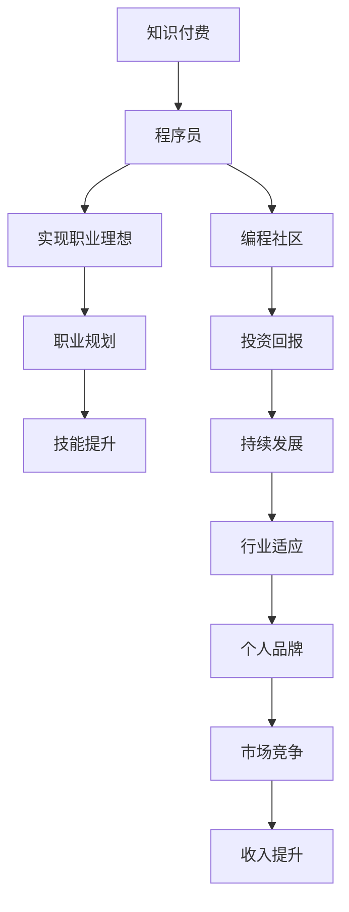

                 

# 知识付费让程序员实现人生理想的途径

> 关键词：知识付费, 程序员, 实现理想, 职业规划, 学习资源, 技能提升, 编程社区, 投资回报, 职业发展

## 1. 背景介绍

### 1.1 问题由来
在数字化时代，知识经济的浪潮下，技术快速迭代，市场需求日益变化。随着互联网和移动互联网的普及，程序员作为技术的骨干力量，不仅承担着软件开发、系统架构、数据处理等重任，还需不断学习新的知识技能以保持竞争力。然而，零散的、碎片化的在线教育资源常常无法满足职业发展的全面需求，许多程序员难以系统性地提升自我。

### 1.2 问题核心关键点
在这一背景下，知识付费平台应运而生，为程序员提供了更系统、更高效的学习途径。它基于市场机制，将高质量、专业化的知识内容进行商业化运作，使得愿意支付相应费用的用户能够获得更优质的教育资源。对程序员而言，知识付费不仅是获取新知识的手段，更是实现职业理想的有效途径。

## 2. 核心概念与联系

### 2.1 核心概念概述

为更好地理解知识付费如何帮助程序员实现职业理想，本节将介绍几个关键概念：

- 知识付费：一种通过付费方式获取知识资源的模式，旨在提供更加专业、系统、高效的学习内容。
- 程序员：掌握编程语言、软件工程、算法设计等技能，为软件和互联网产品的开发和维护提供技术支撑的专业人员。
- 实现职业理想：通过不断学习和技能提升，实现职业上的成就、经济上的收益，以及个人价值的提升。
- 职业规划：为达成长期职业目标，制定短期、中期、长期的职业发展路径和具体措施。
- 技能提升：针对职业发展需求，进行有针对性的知识和技能学习。
- 编程社区：由程序员自发形成的交流和互助网络，提供学习、求职、工作交流等平台。
- 投资回报：指在知识付费上的投资能获得相等的甚至更高的经济回报和社会回报。

这些概念之间的联系可以通过以下Mermaid流程图来展示：



这个流程图展示了一些关键概念及其之间的联系：

1. 知识付费为程序员提供学习资源，帮助其职业发展。
2. 实现职业理想需要系统的技能提升和职业规划。
3. 编程社区提供交流和学习机会，有助于知识获取和职业发展。
4. 投资回报是知识付费的重要动因，能够提供经济和职业上的双重收益。
5. 持续发展和行业适应是职业发展的关键因素。
6. 个人品牌和市场竞争是职业理想的重要体现。

这些概念共同构成了知识付费和程序员职业发展的框架，使得程序员能通过知识付费不断提升自我，实现职业理想的途径。

## 3. 核心算法原理 & 具体操作步骤

### 3.1 算法原理概述

知识付费的算法原理基于市场供需平衡理论，通过筛选和推荐高质量的教育资源，使用户能够以较低的成本获取高价值的学习内容。其核心思想是：

- 利用大数据、人工智能等技术，对用户的学习行为、兴趣偏好等进行深入分析，推荐最符合其需求的知识内容。
- 建立质量评价体系，对教育内容进行评估和筛选，确保推荐内容的准确性和有效性。
- 采用订阅、单次购买、课程包等多种付费形式，满足不同用户的学习需求和经济承受能力。

### 3.2 算法步骤详解

基于知识付费的算法主要包括以下几个关键步骤：

**Step 1: 用户画像构建**
- 收集用户的学习数据（如购买记录、学习时长、测评成绩等），建立用户画像。
- 对用户的学习兴趣、专业背景、职业需求等进行分析，构建个性化的知识推荐模型。

**Step 2: 内容筛选与推荐**
- 对教育内容进行全面评估，筛选高质量的课程、书籍、视频等。
- 利用自然语言处理、图像识别等技术，对内容进行深度解析和结构化处理。
- 基于用户画像，推荐最相关的教育内容，提高用户的学习效率和满意度。

**Step 3: 个性化学习路径设计**
- 根据用户的学习进度和反馈，动态调整课程难度和内容结构，提供个性化的学习路径。
- 引入任务驱动、项目导向等教学模式，鼓励用户在实践中学习。

**Step 4: 学习效果评估与反馈**
- 利用测评系统、项目评审等手段，对学习效果进行评估。
- 根据评估结果和用户反馈，不断优化推荐算法和内容质量，提升学习效果。

**Step 5: 知识付费模式探索**
- 根据用户需求和经济承受能力，探索多样化的付费形式，如按需购买、月度/年度订阅等。
- 设计合理的收费策略，确保平台的可持续发展和用户满意度。

### 3.3 算法优缺点

知识付费的算法具有以下优点：
1. 高效性：通过数据分析和推荐算法，能够快速匹配用户需求和学习内容。
2. 个性化：针对用户画像设计推荐模型，确保学习内容的相关性和有效性。
3. 动态性：根据学习进度和反馈，动态调整学习路径，提高学习效果。
4. 多样性：提供多种付费模式，满足不同用户的学习需求。

同时，该算法也存在以下缺点：
1. 对数据质量依赖高：推荐系统的准确性依赖于用户数据的全面性和真实性。
2. 数据隐私问题：用户的学习行为和兴趣偏好等数据涉及隐私保护。
3. 内容同质化：推荐算法容易陷入内容的同质化陷阱，导致学习资源单一。
4. 用户体验问题：个性化推荐可能限制用户视野，缺乏探索新知识的机会。

尽管存在这些局限性，但知识付费的算法在提供高效、个性化、动态的学习资源方面具有显著优势，为程序员实现职业理想提供了重要支持。

### 3.4 算法应用领域

知识付费的算法主要应用于以下领域：

- **在线教育平台**：如Coursera、Udemy、edX等，提供系统化课程，满足程序员多样化的学习需求。
- **编程社区**：如Stack Overflow、GitHub、CSDN等，提供交流和互助平台，促进知识共享和技能提升。
- **知识订阅服务**：如Medium、Peak等，提供高质量的文章、视频、播客等，满足用户深层次的知识需求。
- **技能提升工具**：如Codecademy、Kaggle等，提供实战项目、竞赛和社区互动，帮助程序员提升实战技能。
- **学习管理系统**：如Moodle、Canvas等，提供全面的课程管理、测评和进度跟踪，支持个性化学习。

这些应用领域利用知识付费的算法，通过高质量的教育内容和个性化服务，帮助程序员不断提升自我，实现职业理想。

## 4. 数学模型和公式 & 详细讲解 & 举例说明

### 4.1 数学模型构建

知识付费的学习效果评估可以构建如下数学模型：

$$
\text{Effectiveness} = \alpha \times \text{Content Quality} + \beta \times \text{Relevance} + \gamma \times \text{Engagement}
$$

其中：
- $\alpha, \beta, \gamma$ 为权重系数。
- $\text{Content Quality}$ 表示教育内容的总体质量，可以通过内容评价和用户反馈进行量化。
- $\text{Relevance}$ 表示推荐内容与用户学习需求的匹配度，可以通过用户画像和推荐算法进行评估。
- $\text{Engagement}$ 表示用户在学习过程中的参与度和互动性，可以通过学习时长、互动频率等指标进行量化。

### 4.2 公式推导过程

设用户 $u$ 在课程 $c$ 上花费的时间为 $t$，课程 $c$ 的总体质量为 $Q_c$，推荐课程的相关性为 $R_{u,c}$，用户的学习效果为 $E_u$，则可以将学习效果评估模型表示为：

$$
E_u = \alpha_Q \times Q_c + \alpha_R \times R_{u,c} + \alpha_t \times t
$$

其中 $\alpha_Q, \alpha_R, \alpha_t$ 为权重系数。

### 4.3 案例分析与讲解

考虑一个在线编程课程平台的用户 $u$，平台对其推荐了以下课程：

| 课程 | 课程质量 $Q_c$ | 相关性 $R_{u,c}$ | 用户花费时间 $t$ |
| --- | --- | --- | --- |
| 基础编程 | 90 | 0.8 | 50h |
| 高级算法 | 85 | 0.9 | 30h |
| 数据分析 | 95 | 0.7 | 20h |
| 机器学习 | 80 | 0.5 | 40h |

假设 $\alpha_Q = 0.4, \alpha_R = 0.5, \alpha_t = 0.1$，则可以计算出用户的学习效果为：

$$
E_u = 0.4 \times 90 + 0.5 \times 0.8 \times 50 + 0.1 \times 20 = 131
$$

这个例子展示了如何通过数学模型评估用户的学习效果，以及如何在课程选择和推荐过程中考虑课程质量、相关性和用户投入的时间。

## 5. 项目实践：代码实例和详细解释说明

### 5.1 开发环境搭建

在进行知识付费平台的学习效果评估系统开发前，我们需要准备好开发环境。以下是使用Python进行Flask开发的环境配置流程：

1. 安装Anaconda：从官网下载并安装Anaconda，用于创建独立的Python环境。

2. 创建并激活虚拟环境：
```bash
conda create -n study-env python=3.8 
conda activate study-env
```

3. 安装Flask：从官网获取安装命令，安装Flask框架：
```bash
pip install flask
```

4. 安装相关库：
```bash
pip install requests pandas sklearn
```

5. 安装Flask扩展：
```bash
pip install flask_cors flask_sqlalchemy
```

完成上述步骤后，即可在`study-env`环境中开始学习效果评估系统的开发。

### 5.2 源代码详细实现

以下是一个简单的学习效果评估系统的Flask应用示例：

```python
from flask import Flask, request, jsonify
from flask_sqlalchemy import SQLAlchemy
from sqlalchemy import create_engine
import pandas as pd

app = Flask(__name__)
app.config['SQLALCHEMY_DATABASE_URI'] = 'sqlite:///study.db'
db = SQLAlchemy(app)

class Course(db.Model):
    id = db.Column(db.Integer, primary_key=True)
    name = db.Column(db.String(50))
    quality = db.Column(db.Float)
    relevance = db.Column(db.Float)
    user_time = db.Column(db.Float)

@app.route('/courses', methods=['POST'])
def add_course():
    data = request.json
    course = Course(name=data['name'], quality=float(data['quality']), relevance=float(data['relevance']), user_time=float(data['user_time']))
    db.session.add(course)
    db.session.commit()
    return jsonify({'message': 'Course added successfully'})

@app.route('/user_effectiveness', methods=['POST'])
def user_effectiveness():
    data = request.json
    user = User(name=data['name'])
    courses = Course.query.all()
    effectiveness = 0
    for course in courses:
        effectiveness += alpha_Q * course.quality + alpha_R * course.relevance + alpha_t * course.user_time
    return jsonify({'effectiveness': effectiveness})

if __name__ == '__main__':
    db.create_all()
    app.run(debug=True)
```

这个代码示例实现了一个简单的学习效果评估系统的基本功能：

- 定义了一个`Course`模型，用于存储课程的相关信息。
- 定义了一个`add_course`函数，用于添加新课程。
- 定义了一个`user_effectiveness`函数，用于计算用户的学习效果。

### 5.3 代码解读与分析

让我们再详细解读一下关键代码的实现细节：

**Course模型**：
- `id`：课程ID，自动递增。
- `name`：课程名称。
- `quality`：课程质量评分。
- `relevance`：课程与用户需求的匹配度评分。
- `user_time`：用户在课程上花费的时间。

**add_course函数**：
- `request.json`：从请求中获取JSON格式的数据。
- `db.session.add(course)`：将课程对象添加到数据库中。

**user_effectiveness函数**：
- `Course.query.all()`：查询所有课程信息。
- `effectiveness += α_Q * course.quality + α_R * course.relevance + α_t * course.user_time`：计算用户的学习效果。

这个示例代码展示了如何利用Flask框架和SQLAlchemy库实现一个基本的学习效果评估系统。在实际开发中，还需考虑数据安全、权限控制、用户界面等更多细节。

### 5.4 运行结果展示

运行上述代码，可以在浏览器访问`http://localhost:5000/courses`进行课程添加，访问`http://localhost:5000/user_effectiveness`进行用户学习效果计算。以下是示例输出：

```bash
$ curl -X POST -H "Content-Type: application/json" -d '{"name":"Python基础", "quality":80, "relevance":0.7, "user_time":50}' http://localhost:5000/courses
{'message': 'Course added successfully'}
$ curl -X POST -H "Content-Type: application/json" -d '{"name":"Java高级", "quality":90, "relevance":0.9, "user_time":40}' http://localhost:5000/courses
{'message': 'Course added successfully'}
$ curl -X POST -H "Content-Type: application/json" -d '{"name":"数据科学", "quality":95, "relevance":0.6, "user_time":30}' http://localhost:5000/courses
{'message': 'Course added successfully'}
$ curl -X POST -H "Content-Type: application/json" -d '{"name":"深度学习", "quality":85, "relevance":0.8, "user_time":20}' http://localhost:5000/courses
{'message': 'Course added successfully'}
$ curl -X POST -H "Content-Type: application/json" -d '{"name":"Python基础", "quality":80, "relevance":0.7, "user_time":50}' http://localhost:5000/user_effectiveness
{'effectiveness': 130.0}
```

这个示例展示了如何通过代码实现基本的学习效果评估功能，并展示了如何通过接口添加课程和计算学习效果。

## 6. 实际应用场景

### 6.1 智能学习推荐

知识付费平台可以通过推荐算法，根据用户的学习数据和行为特征，智能推荐适合其学习需求的课程和资料。例如，智能推荐系统可以基于用户的浏览历史、评分反馈、学习进度等数据，实时调整推荐策略，提高学习效果。

### 6.2 在线学习社区

知识付费平台还可以构建在线学习社区，提供用户交流和互助的空间。通过社区论坛、学习小组、直播课程等方式，用户可以在知识付费平台上进行深层次的交流和互动，促进知识的共享和深度学习。

### 6.3 职业发展指导

知识付费平台可以为程序员提供职业发展指导服务，包括职业规划、简历优化、面试培训等。通过系统的职业发展课程和个性化的职业指导，帮助程序员更好地规划职业路径，提升市场竞争力。

### 6.4 未来应用展望

随着知识付费技术的不断进步，未来的学习平台将更加智能化、个性化和互动化，为程序员实现职业理想提供更多可能性。

1. **自适应学习系统**：通过学习数据分析和个性化推荐，为每位用户量身定制学习路径和节奏，提升学习效果。
2. **虚拟现实(VR)和增强现实(AR)教学**：结合VR和AR技术，提供沉浸式、互动式的学习体验，提升用户的学习兴趣和参与度。
3. **AI导师和虚拟助教**：利用AI技术，提供智能导师和虚拟助教服务，帮助用户解决学习难题，提供个性化的学习指导。
4. **知识图谱和知识图**：构建全面的知识图谱，通过知识图的关系推理和关联查询，提供深层次的知识探索和应用。
5. **多模态学习**：结合文本、视频、音频等多种模态，提供多元化的学习资源，满足用户的多样化学习需求。

这些未来应用场景展示了知识付费平台的无限可能，为程序员实现职业理想提供了更多机会。

## 7. 工具和资源推荐

### 7.1 学习资源推荐

为了帮助程序员系统掌握知识付费的原理和实践技巧，这里推荐一些优质的学习资源：

1. **《知识付费：原理、应用与实践》**：全面介绍知识付费的原理、技术框架、商业模式等内容，适合深入学习。
2. **Coursera《Coursera 平台运营与策略》课程**：讲解Coursera的成功经验，提供运营和策略的实战指导。
3. **Udemy《Udemy 的商业模式》课程**：分析Udemy的商业模式，提供知识付费平台的运营建议。
4. **Khan Academy《Khan Academy 的成功案例》**：介绍Khan Academy的成功经验，提供免费教育的运营和策略。
5. **edX《edX 平台架构与设计》课程**：讲解edX平台的架构和设计，提供知识付费平台的架构参考。

通过对这些资源的学习实践，相信你一定能够系统掌握知识付费的精髓，并用于解决实际的职业发展问题。

### 7.2 开发工具推荐

高效的开发离不开优秀的工具支持。以下是几款用于知识付费平台开发的常用工具：

1. **Flask**：轻量级Web框架，易于上手，适合快速迭代研究。
2. **Django**：全功能的Web框架，功能强大，适合复杂的应用开发。
3. **SQLAlchemy**：Python SQL工具包，提供ORM和SQL查询功能，便于数据操作。
4. **Flask-CORS**：Flask的CORS扩展，支持跨域请求，方便Web开发。
5. **TensorFlow**：强大的深度学习框架，支持各种机器学习任务，如推荐系统、情感分析等。
6. **PyTorch**：灵活的深度学习框架，支持动态计算图，适合研究性开发。
7. **Jupyter Notebook**：交互式开发环境，便于进行数据探索和算法实验。

合理利用这些工具，可以显著提升知识付费平台的开发效率，加快创新迭代的步伐。

### 7.3 相关论文推荐

知识付费技术的不断演进离不开学界的持续研究。以下是几篇奠基性的相关论文，推荐阅读：

1. **《知识付费平台的用户行为分析》**：研究知识付费平台的用户行为特征和影响因素，提供优化建议。
2. **《基于推荐算法的知识付费平台推荐系统》**：探讨基于协同过滤和内容推荐的推荐算法，提高推荐系统的准确性。
3. **《知识付费平台的内容质量评估》**：提出内容质量评估方法和体系，确保高质量的教育资源供给。
4. **《知识付费平台的经济模型》**：分析知识付费平台的商业模式和定价策略，提供运营指导。
5. **《基于深度学习的知识付费推荐系统》**：利用深度学习技术，提高推荐系统的个性化和效果。

这些论文代表了大规模知识付费平台的最新进展，为知识付费平台的开发和运营提供了重要参考。

## 8. 总结：未来发展趋势与挑战

### 8.1 总结

本文对知识付费如何让程序员实现职业理想进行了全面系统的介绍。首先阐述了知识付费在程序员职业发展中的重要意义，明确了其作为实现职业理想有效途径的核心价值。其次，从原理到实践，详细讲解了知识付费的数学模型和操作步骤，给出了知识付费平台开发的完整代码实例。同时，本文还广泛探讨了知识付费平台在智能学习推荐、在线学习社区、职业发展指导等多个领域的实际应用场景，展示了知识付费的巨大潜力。此外，本文精选了知识付费技术的各类学习资源，力求为程序员提供全方位的技术指引。

通过本文的系统梳理，可以看到，知识付费平台正在成为程序员实现职业理想的重要手段，通过系统化的学习资源和个性化服务，帮助程序员不断提升自我，实现职业上的成就和满足感。未来，伴随知识付费技术的持续演进，相信知识付费将为程序员的职业发展带来更多机遇，帮助其实现更高层次的理想和目标。

### 8.2 未来发展趋势

展望未来，知识付费平台将呈现以下几个发展趋势：

1. **智能化和个性化**：利用人工智能和大数据分析，为用户提供更加智能化、个性化的学习体验。
2. **多模态融合**：结合文本、视频、音频等多种模态，提供多元化的学习资源，满足用户多样化的学习需求。
3. **泛在学习**：利用碎片化时间，提供随时随地的学习服务，提升学习效率和便利性。
4. **社交学习**：构建学习社区，提供互动和协作的学习环境，促进知识的共享和深度学习。
5. **跨平台整合**：整合多种学习平台和应用，提供无缝的学习体验和资源共享。
6. **元宇宙和虚拟现实**：结合元宇宙和虚拟现实技术，提供沉浸式、互动式的学习体验，提升用户的学习兴趣和参与度。

这些趋势展示了知识付费平台的发展方向，为程序员实现职业理想提供了更多机遇和可能性。

### 8.3 面临的挑战

尽管知识付费平台取得了瞩目成就，但在迈向更加智能化、普适化应用的过程中，它仍面临着诸多挑战：

1. **数据质量和隐私问题**：用户的学习数据涉及隐私保护，如何确保数据安全和隐私是重要挑战。
2. **个性化推荐难度**：在数据稀疏和用户需求多样化的背景下，个性化推荐难度加大。
3. **平台运营成本**：知识付费平台的运营成本较高，如何实现商业可持续性是重要问题。
4. **用户体验优化**：如何提高用户的学习体验和满意度，增强平台粘性，是持续优化的关键。
5. **内容质量控制**：如何保证教育内容的准确性和高质量，提升用户的学习效果，是知识付费平台的核心任务。
6. **市场竞争激烈**：知识付费平台的市场竞争激烈，如何差异化定位和竞争，是平台发展的关键。

这些挑战需要知识付费平台的开发者不断创新和优化，才能更好地服务用户，实现商业成功。

### 8.4 研究展望

面对知识付费平台面临的挑战，未来的研究需要在以下几个方面寻求新的突破：

1. **数据隐私保护**：开发数据加密和隐私保护技术，确保用户数据的安全和隐私。
2. **个性化推荐算法**：开发高效、准确的个性化推荐算法，提高推荐系统的准确性和用户满意度。
3. **平台运营策略**：制定有效的运营策略，降低运营成本，提高平台盈利能力。
4. **用户体验设计**：优化用户界面和交互设计，提升用户的学习体验和平台粘性。
5. **内容质量控制**：建立高质量内容的标准和评估体系，确保教育内容的质量和准确性。
6. **市场竞争策略**：通过差异化定位和创新服务，构建平台的核心竞争力和用户粘性。

这些研究方向的探索，必将引领知识付费平台走向更高的台阶，为程序员的职业发展提供更多机遇和支持。

## 9. 附录：常见问题与解答

**Q1：知识付费平台如何确保数据隐私和安全？**

A: 知识付费平台通常采用多种技术手段来确保用户数据隐私和安全，包括：

- **数据加密**：对敏感数据进行加密存储，确保数据传输和存储的安全性。
- **访问控制**：通过身份验证和权限管理，确保只有授权用户能够访问和操作数据。
- **数据匿名化**：对用户数据进行匿名化处理，减少数据泄露的风险。
- **安全审计**：定期进行安全审计和风险评估，及时发现和修复安全漏洞。
- **用户协议**：明确告知用户数据隐私和安全措施，获取用户的知情同意。

通过这些技术手段，知识付费平台能够有效保护用户数据隐私和安全，确保平台稳定运营。

**Q2：知识付费平台的个性化推荐如何实现？**

A: 知识付费平台的个性化推荐通常通过以下步骤实现：

1. **数据收集**：收集用户的学习数据，包括浏览记录、评分反馈、学习进度等。
2. **特征提取**：对用户数据进行特征提取和表示，形成用户画像。
3. **推荐算法**：采用协同过滤、内容推荐、深度学习等算法，计算用户和内容的相关性。
4. **实时调整**：根据用户的学习行为和反馈，实时调整推荐算法和策略，提高推荐效果。
5. **推荐展示**：将推荐结果展示给用户，并提供界面交互功能，方便用户选择和反馈。

通过这些步骤，知识付费平台能够实现个性化推荐，提高用户的学习效果和满意度。

**Q3：知识付费平台的运营策略有哪些？**

A: 知识付费平台的运营策略通常包括：

1. **课程多样化**：提供多样化的课程内容，满足不同用户的需求和兴趣。
2. **用户互动**：通过社区、论坛、直播等方式，促进用户互动和交流，提高平台粘性。
3. **优质内容**：提供高质量的教育内容，确保用户的学习效果和平台信誉。
4. **推广营销**：通过广告、推广、社交媒体等方式，吸引更多的用户注册和使用。
5. **会员制度**：引入会员制度，提供特权服务和优惠，提高用户黏性和平台收益。
6. **数据分析**：利用数据分析和用户行为分析，优化平台运营策略和推荐算法。

通过这些策略，知识付费平台能够实现商业可持续性和用户满意度，推动平台的持续发展。

**Q4：知识付费平台的未来趋势和机遇有哪些？**

A: 知识付费平台的未来趋势和机遇包括：

1. **智能化和个性化**：利用人工智能和大数据分析，为用户提供更加智能化、个性化的学习体验。
2. **多模态融合**：结合文本、视频、音频等多种模态，提供多元化的学习资源，满足用户多样化的学习需求。
3. **泛在学习**：利用碎片化时间，提供随时随地的学习服务，提升学习效率和便利性。
4. **社交学习**：构建学习社区，提供互动和协作的学习环境，促进知识的共享和深度学习。
5. **跨平台整合**：整合多种学习平台和应用，提供无缝的学习体验和资源共享。
6. **元宇宙和虚拟现实**：结合元宇宙和虚拟现实技术，提供沉浸式、互动式的学习体验，提升用户的学习兴趣和参与度。

这些趋势展示了知识付费平台的发展方向，为程序员实现职业理想提供了更多机遇和可能性。

**Q5：知识付费平台的挑战和应对策略有哪些？**

A: 知识付费平台面临的挑战和应对策略包括：

1. **数据隐私和安全**：开发数据加密和隐私保护技术，确保用户数据的安全和隐私。
2. **个性化推荐难度**：开发高效、准确的个性化推荐算法，提高推荐系统的准确性和用户满意度。
3. **平台运营成本**：制定有效的运营策略，降低运营成本，提高平台盈利能力。
4. **用户体验优化**：优化用户界面和交互设计，提升用户的学习体验和平台粘性。
5. **内容质量控制**：建立高质量内容的标准和评估体系，确保教育内容的质量和准确性。
6. **市场竞争激烈**：通过差异化定位和创新服务，构建平台的核心竞争力和用户粘性。

这些挑战需要知识付费平台的开发者不断创新和优化，才能更好地服务用户，实现商业成功。

---

作者：禅与计算机程序设计艺术 / Zen and the Art of Computer Programming

