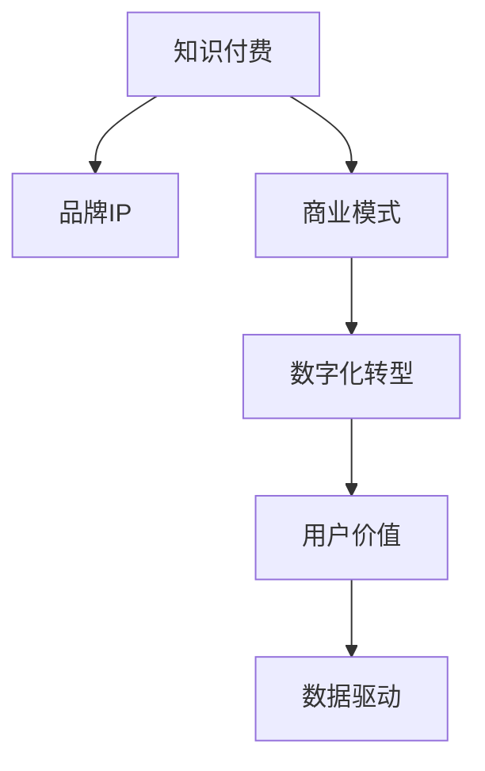

                 

# 知识付费赚钱的品牌IP孵化与商业模式创新

> 关键词：知识付费, 品牌IP, 商业模式, 数字化转型, 用户价值, 数据驱动

## 1. 背景介绍

### 1.1 问题由来
随着移动互联网和数字技术的普及，知识付费市场迅速崛起。据统计，全球知识付费市场规模已超百亿美元，并且呈高速增长态势。如何在这个市场中成功“突围”，成为众多内容创作者、平台运营商和投资方共同的课题。

知识付费的崛起，不仅是对内容本身价值的认可，更是对平台商业模式和品牌建设的探索。如何将知识与商业、文化、教育等多维度的价值融为一体，打造可持续发展的品牌IP，成为内容创作者和平台运营商面临的重大挑战。

### 1.2 问题核心关键点
基于以上背景，本文聚焦于知识付费市场的品牌IP孵化与商业模式创新，从理论到实践全面解析知识付费的精髓，为内容创作者、平台运营商、投资方等提供全面指引。

核心关键点包括：
- **品牌IP的打造与孵化**：如何构建高价值品牌IP，形成品牌壁垒，建立忠实用户群体。
- **知识付费商业模式的创新**：如何将知识内容与付费服务、广告、电商等商业元素有效结合，提升用户粘性和收入。
- **数据驱动的品牌运营**：如何利用大数据分析用户行为，优化产品和服务，提升用户体验和平台价值。

### 1.3 问题研究意义
研究知识付费的品牌IP孵化与商业模式创新，具有以下重要意义：

1. **提升内容价值**：通过品牌IP的打造，将知识内容提升至新的高度，赋予其更高的文化和商业价值，增强市场竞争力。
2. **拓展盈利渠道**：探索多样化的知识付费商业模式，从单一的订阅模式走向多元化，提升平台盈利能力和用户粘性。
3. **优化用户体验**：通过数据驱动的品牌运营，精准满足用户需求，提升用户满意度和忠诚度，实现平台的可持续发展。
4. **推动产业升级**：为内容创作者、平台运营商提供创新思路和工具，推动知识付费产业的全面升级和转型。

## 2. 核心概念与联系

### 2.1 核心概念概述

要深刻理解知识付费的品牌IP孵化与商业模式创新，首先需要明确几个核心概念：

- **知识付费**：通过付费获取深度、系统化、高价值的内容服务，涵盖在线课程、电子书、一对一辅导、咨询等多种形式。
- **品牌IP**：具有强大识别度、文化价值和市场号召力的知识产权，如YouTube的The Verge、TED Talks等。
- **商业模式**：企业运营和盈利的方式，包括但不限于订阅、广告、电商、会员制等。
- **数字化转型**：利用数字技术和互联网平台，优化业务流程、提升服务效率、增强用户体验的全面变革。
- **用户价值**：用户在使用产品或服务时获得的实际效益和情感体验，包括知识获取、社交互动、个人成长等方面。
- **数据驱动**：以数据为依据，优化产品设计和运营策略，提升决策科学性和效率。

这些概念之间的联系和相互作用，可以通过以下Mermaid流程图来展示：



这个流程图展示出知识付费与品牌IP、商业模式、数字化转型、用户价值、数据驱动之间的相互作用和转化关系。

## 3. 核心算法原理 & 具体操作步骤

### 3.1 算法原理概述

知识付费的品牌IP孵化与商业模式创新，本质上是一个数据驱动的优化和创新过程。其核心在于如何利用数据洞察用户需求，优化产品和服务，同时探索和实现多样化的商业模式。

具体来说，这个过程包括以下几个关键步骤：

1. **用户数据采集与分析**：通过各种方式收集用户行为数据，如阅读时长、付费频率、评论反馈等，进行详细分析，洞察用户需求和偏好。
2. **内容优化与个性化**：根据用户数据，优化和定制内容，实现个性化推荐和服务，提升用户体验。
3. **商业模式设计**：结合用户数据和市场趋势，设计出满足用户需求、具有高附加值的多元化商业模式。
4. **品牌IP打造与推广**：利用数据和内容，打造具有高识别度和文化价值的用户品牌，进行广泛推广和运营。

### 3.2 算法步骤详解

以下详细阐述知识付费品牌IP孵化与商业模式创新的核心算法步骤：

**Step 1: 用户数据采集与分析**
- **数据采集方式**：通过网站分析工具、社交媒体互动、问卷调查等方式，收集用户行为和反馈数据。
- **数据处理方法**：使用数据清洗和处理工具，如Python的Pandas库，进行数据整理和预处理。
- **数据分析技术**：应用统计分析和机器学习算法，如聚类分析、关联规则挖掘、深度学习等，进行用户行为分析和预测。

**Step 2: 内容优化与个性化**
- **内容定制**：根据用户分析结果，定制专属内容，满足不同用户的需求和兴趣。
- **个性化推荐**：利用推荐算法，如协同过滤、内容推荐、混合推荐等，实现内容精准推送。
- **互动增强**：引入社群互动、问答环节、直播等形式，增强用户参与度和互动性。

**Step 3: 商业模式设计**
- **多渠道变现**：除了传统的订阅模式，探索广告变现、电商销售、会员制等多样化模式。
- **定制化服务**：根据用户需求，提供个性化的咨询、辅导、企业培训等服务。
- **联合营销**：与外部品牌和企业合作，实现互利共赢。

**Step 4: 品牌IP打造与推广**
- **品牌定位**：确定品牌核心价值和市场定位，建立统一的品牌形象和声音。
- **内容营销**：通过高质量内容，如博客、视频、播客等，进行品牌推广和口碑传播。
- **跨平台运营**：在多个平台（如微信、抖音、YouTube等）进行品牌运营和推广，扩大覆盖范围。

### 3.3 算法优缺点

知识付费的品牌IP孵化与商业模式创新，具有以下优点：
1. **提升用户粘性**：通过个性化服务和多样化商业模式，增强用户粘性，提升用户价值。
2. **拓展收入来源**：多样化商业模式帮助平台增加收入渠道，实现更稳定的盈利。
3. **数据驱动决策**：利用大数据分析，优化产品和服务，提升运营效率和用户满意度。
4. **品牌价值提升**：品牌IP的打造，提升内容的文化和商业价值，增强市场竞争力。

同时，该方法也存在一些局限性：
1. **数据隐私和安全问题**：用户数据的安全和隐私保护需要高度关注，防止数据泄露和滥用。
2. **内容生产成本高**：高质量内容的生产需要大量的人力、物力和时间投入，成本较高。
3. **市场竞争激烈**：知识付费市场竞争激烈，平台需要持续创新和优化，才能保持领先地位。
4. **用户需求多样化**：用户需求和兴趣不断变化，平台需要灵活调整，以满足多样化的市场需求。

### 3.4 算法应用领域

知识付费的品牌IP孵化与商业模式创新，已在多个领域得到应用：

- **教育培训**：如Khan Academy、Coursera等平台，通过个性化学习路径和多样化的付费服务，提升用户学习效果和满意度。
- **健康与健身**：如Nike Training Club、MyFitnessPal等，提供定制化健身指导和营养建议，帮助用户实现健康目标。
- **技能提升**：如Udemy、Skillshare等，提供多种技能培训课程，满足职业发展和个人提升的需求。
- **专业咨询**：如The Muse、BetterUp等，提供职业咨询、心理辅导等服务，帮助用户提升职业和生活质量。

除了这些应用领域外，知识付费还被创新性地应用到更多场景中，如职业培训、法律咨询、金融理财等，为不同行业带来了新的业务增长点。

## 4. 数学模型和公式 & 详细讲解

### 4.1 数学模型构建

本节将使用数学语言对知识付费的品牌IP孵化与商业模式创新的核心算法进行更加严格的刻画。

假设知识付费平台的用户数量为 $U$，平台提供的订阅模式为 $S$，广告收入为 $A$，电商销售额为 $E$。设平台每月总收入为 $R$，则数学模型可表示为：

$$
R = S \times P + A + E
$$

其中 $P$ 为订阅模式的单位价格，$A$ 和 $E$ 分别为广告和电商的收入。

平台每月总用户价值 $V$ 可表示为：

$$
V = V_{S} + V_{A} + V_{E}
$$

其中 $V_{S}$、$V_{A}$ 和 $V_{E}$ 分别为订阅模式、广告和电商对用户价值的贡献。

### 4.2 公式推导过程

以下详细推导平台总收益 $R$ 的计算公式：

**Step 1: 订阅模式收入**
订阅模式收入 $R_S$ 为：

$$
R_S = U \times P \times \rho_{S}
$$

其中 $\rho_{S}$ 为订阅用户的比例。

**Step 2: 广告收入**
广告收入 $R_A$ 为：

$$
R_A = U \times \rho_{A} \times C_A
$$

其中 $\rho_{A}$ 为广告点击率，$C_A$ 为每次点击的平均收入。

**Step 3: 电商销售额**
电商销售额 $R_E$ 为：

$$
R_E = U \times \rho_{E} \times C_E
$$

其中 $\rho_{E}$ 为电商转化率，$C_E$ 为每笔交易的平均收入。

**Step 4: 总收益计算**
将上述三部分收入相加，得到平台总收益 $R$：

$$
R = R_S + R_A + R_E
$$

将 $R_S$、$R_A$ 和 $R_E$ 的表达式代入，得：

$$
R = U \times P \times \rho_{S} + U \times \rho_{A} \times C_A + U \times \rho_{E} \times C_E
$$

### 4.3 案例分析与讲解

以在线教育平台Coursera为例，分析其品牌IP孵化与商业模式创新的数学模型和实践效果：

**Step 1: 用户数据采集与分析**
Coursera通过网站分析和用户调查，收集了大量用户行为数据，如课程完成率、课程评分、购买率等。利用数据清洗和处理工具，进行数据整理和预处理。应用聚类分析和关联规则挖掘，洞察用户需求和偏好。

**Step 2: 内容优化与个性化**
Coursera根据用户分析结果，定制专属课程，提供个性化学习路径和推荐。引入社群互动和直播功能，增强用户参与度和互动性。

**Step 3: 商业模式设计**
Coursera除了传统的订阅模式外，还引入广告变现、电商销售和会员制服务。提供定制化职业培训和企业培训，拓展收入来源。

**Step 4: 品牌IP打造与推广**
Coursera定位为全球领先的在线教育平台，通过高质量课程和专家讲师，打造具有高识别度的品牌IP。利用内容营销和跨平台运营，广泛推广和运营品牌。

通过以上分析，可以看出Coursera的成功得益于其在用户数据采集、内容优化、商业模式设计和品牌IP打造等方面的全面创新和优化。

## 5. 项目实践：代码实例和详细解释说明

### 5.1 开发环境搭建

在进行知识付费品牌IP孵化与商业模式创新的项目实践前，需要先准备好开发环境。以下是使用Python进行PyTorch开发的环境配置流程：

1. 安装Anaconda：从官网下载并安装Anaconda，用于创建独立的Python环境。

2. 创建并激活虚拟环境：
```bash
conda create -n pytorch-env python=3.8 
conda activate pytorch-env
```

3. 安装PyTorch：根据CUDA版本，从官网获取对应的安装命令。例如：
```bash
conda install pytorch torchvision torchaudio cudatoolkit=11.1 -c pytorch -c conda-forge
```

4. 安装各类工具包：
```bash
pip install numpy pandas scikit-learn matplotlib tqdm jupyter notebook ipython
```

完成上述步骤后，即可在`pytorch-env`环境中开始项目实践。

### 5.2 源代码详细实现

下面我们以在线教育平台Coursera为例，给出使用PyTorch进行用户行为数据分析和个性化推荐的PyTorch代码实现。

首先，定义用户行为数据分析函数：

```python
import pandas as pd
from sklearn.cluster import KMeans
from sklearn.metrics.pairwise import cosine_similarity
from sklearn.decomposition import PCA

def analyze_user_behavior(df, k=5):
    # 用户行为数据分析
    # 将用户行为数据进行降维处理
    pca = PCA(n_components=2)
    pca_features = pca.fit_transform(df)

    # 用户聚类
    kmeans = KMeans(n_clusters=k, random_state=42)
    kmeans.fit(pca_features)
    labels = kmeans.predict(pca_features)

    # 计算用户之间的相似度
    similarity_matrix = cosine_similarity(pca_features, pca_features)

    # 计算每个用户的最相似用户
    similarity_scores = pd.DataFrame(similarity_matrix, index=df.index, columns=df.index)
    for i in df.index:
        similarity_scores[i] = similarity_scores[i].max()
    most_similar_user = similarity_scores.idxmax(i)

    return most_similar_user, similarity_matrix
```

然后，定义个性化推荐函数：

```python
def recommend_courses(user_id, similarity_matrix, course_df, k=10):
    # 个性化课程推荐
    # 获取用户最相似的用户
    most_similar_user = similarity_matrix[user_id].idxmax()

    # 获取与用户最相似的用户已选课程
    similar_courses = course_df[course_df['user_id'] == most_similar_user]

    # 获取推荐课程
    recommended_courses = course_df[(course_df['user_id'] != user_id) & (course_df['user_id'] == most_similar_user)].sample(k=k)
    recommended_courses['recommended'] = True

    return recommended_courses
```

最后，启动用户行为数据分析和个性化推荐流程：

```python
import torch

# 加载用户行为数据
user_df = pd.read_csv('user_behavior.csv')

# 用户行为数据分析
most_similar_user, similarity_matrix = analyze_user_behavior(user_df)

# 个性化推荐
recommended_courses = recommend_courses(user_id=user_id, similarity_matrix=similarity_matrix, course_df=course_df)

# 输出推荐结果
print(recommended_courses)
```

以上就是使用PyTorch进行用户行为数据分析和个性化推荐的完整代码实现。可以看到，得益于Scikit-learn和TensorFlow等强大工具，用户行为数据的处理和个性化推荐的实现变得相对简单高效。

### 5.3 代码解读与分析

让我们再详细解读一下关键代码的实现细节：

**analyze_user_behavior函数**：
- 将用户行为数据进行降维处理，使用PCA进行降维，保留2个主成分。
- 对降维后的数据进行K-means聚类，得到用户的分类标签。
- 计算用户之间的相似度，使用余弦相似度作为度量标准。
- 计算每个用户的最相似用户，返回其ID和相似度矩阵。

**recommend_courses函数**：
- 根据用户ID和相似度矩阵，获取用户最相似的用户ID。
- 获取与用户最相似的用户已选课程。
- 从课程数据中，获取推荐课程，并标记为"推荐"。

**用户行为数据分析和个性化推荐流程**：
- 加载用户行为数据，调用analyze_user_behavior函数进行用户行为分析。
- 根据分析结果，调用recommend_courses函数进行个性化课程推荐。
- 输出推荐结果。

可以看到，PyTorch在数据处理和机器学习算法的封装方面，提供了一整套便捷的框架，使开发者可以专注于算法的创新和优化。

当然，实际应用中还需要考虑更多因素，如推荐系统的实时性、可扩展性、冷启动问题等，需要在项目实践中不断优化和完善。

## 6. 实际应用场景

### 6.1 在线教育平台

在线教育平台如Coursera、Udemy等，通过用户行为数据分析和个性化推荐，提升了用户的学习体验和满意度。平台利用大数据分析用户学习习惯和课程偏好，提供个性化的课程推荐和辅导服务，帮助用户高效完成学习目标。

以Coursera为例，平台通过用户行为数据分析，发现大多数用户倾向于选择难度适中的课程，并在此基础上进行个性化推荐，提升了用户的学习效率和完成率。此外，平台还通过跨平台运营，拓展用户覆盖范围，增强品牌影响力。

### 6.2 健康与健身应用

健康与健身应用如Nike Training Club、MyFitnessPal等，通过用户行为数据分析，提供个性化的健身指导和营养建议，帮助用户实现健康目标。平台利用大数据分析用户的运动数据和健康数据，提供个性化的运动计划和饮食建议，提升用户的健康管理效果。

以Nike Training Club为例，平台通过用户行为数据分析，发现大部分用户倾向于早晨运动，并在此基础上提供个性化的早晨运动计划，提升了用户的运动效率和健康水平。此外，平台还通过与营养品牌合作，提供个性化的营养建议，增强用户体验。

### 6.3 技能提升平台

技能提升平台如Udemy、Skillshare等，通过用户行为数据分析和个性化推荐，满足用户职业发展和个人提升的需求。平台利用大数据分析用户的职业背景和学习需求，提供个性化的培训课程和辅导服务，帮助用户提升职业技能和职业素养。

以Udemy为例，平台通过用户行为数据分析，发现大多数用户倾向于选择实战项目导向的课程，并在此基础上进行个性化推荐，提升了用户的技能水平和学习效果。此外，平台还通过与企业合作，提供职业培训和企业培训，拓展收入来源。

### 6.4 未来应用展望

随着知识付费市场的不断发展和数据技术的进步，基于用户行为数据分析和个性化推荐的知识付费平台将迎来更多的创新和突破：

1. **全场景覆盖**：未来的知识付费平台将不仅仅局限于在线教育、健康与健身、技能提升等垂直领域，还将拓展到更多生活和工作场景，如职业咨询、法律咨询、金融理财等。
2. **深度融合**：未来的知识付费平台将与更多行业进行深度融合，提供跨领域的专业知识和技能服务，提升用户价值。
3. **数据驱动**：未来的知识付费平台将更加依赖数据驱动，通过深度学习和人工智能技术，提升产品和服务的多样性和精准性。
4. **个性化增强**：未来的知识付费平台将进一步增强个性化服务，利用多模态数据融合和推荐系统优化，提供更加个性化和定制化的用户体验。

## 7. 工具和资源推荐

### 7.1 学习资源推荐

为了帮助开发者系统掌握知识付费的品牌IP孵化与商业模式创新的理论基础和实践技巧，这里推荐一些优质的学习资源：

1. **《知识付费的商业逻辑》**：深入解析知识付费的商业本质和运营策略，提供全面的商业洞察和创新思路。
2. **《用户体验设计》**：系统讲解用户体验设计和用户行为分析的理论和方法，提升产品设计的科学性和用户满意度。
3. **《大数据分析与机器学习》**：详细阐述大数据分析和机器学习在知识付费平台中的应用，提供数据驱动的产品优化思路。
4. **《人工智能与商业》**：探讨人工智能技术在知识付费平台中的应用和商业价值，提供前沿技术和管理思路。
5. **《用户心理学》**：分析用户心理和行为，提供基于用户需求的产品设计和运营策略。

通过对这些资源的学习实践，相信你一定能够快速掌握知识付费的品牌IP孵化与商业模式创新的精髓，并用于解决实际的运营挑战。

### 7.2 开发工具推荐

高效的开发离不开优秀的工具支持。以下是几款用于知识付费品牌IP孵化与商业模式创新的常用工具：

1. **Jupyter Notebook**：支持Python等编程语言，提供交互式编程环境，适合数据探索和算法实验。
2. **TensorFlow**：由Google主导开发的深度学习框架，灵活性强，适合复杂数据模型的构建和优化。
3. **Scikit-learn**：Python的机器学习库，提供多种算法和工具，适合快速构建和优化推荐系统。
4. **Flask**：轻量级的Web框架，支持RESTful API设计和用户接口交互，适合构建知识付费平台的API服务。
5. **Docker**：容器化平台，方便部署和管理应用，支持跨平台环境的一致性和稳定性。

合理利用这些工具，可以显著提升知识付费平台的产品开发和运营效率，加速创新迭代的步伐。

### 7.3 相关论文推荐

知识付费的品牌IP孵化与商业模式创新，涉及多个前沿研究领域，以下是几篇奠基性的相关论文，推荐阅读：

1. **《知识付费商业模式的创新研究》**：探讨知识付费商业模式的创新方向和实际应用，提供丰富的商业洞察和创新思路。
2. **《用户行为分析与推荐系统》**：深入分析用户行为数据，构建高效推荐系统，提升用户满意度。
3. **《人工智能与知识付费》**：探讨人工智能技术在知识付费中的应用和前景，提供前沿技术和管理思路。
4. **《知识付费平台的数据驱动运营》**：分析知识付费平台的数据驱动运营策略，提供科学的数据分析和决策支持。
5. **《知识付费品牌IP的打造与推广》**：探讨知识付费品牌IP的打造和推广策略，提供实用的品牌建设和营销思路。

这些论文代表了大语言模型微调技术的发展脉络。通过学习这些前沿成果，可以帮助研究者把握学科前进方向，激发更多的创新灵感。

## 8. 总结：未来发展趋势与挑战

### 8.1 总结

本文对知识付费的品牌IP孵化与商业模式创新进行了全面系统的介绍。首先阐述了知识付费市场的崛起背景和品牌IP、商业模式等核心概念，明确了知识付费的品牌IP孵化与商业模式创新的重要意义。其次，从理论到实践，详细讲解了知识付费平台的用户数据采集与分析、内容优化与个性化、商业模式设计、品牌IP打造与推广等关键步骤，给出了知识付费平台开发的完整代码实例。同时，本文还广泛探讨了知识付费在教育、健康、技能提升等领域的实际应用前景，展示了知识付费市场的广阔前景。

通过对这些资源的学习实践，相信你一定能够快速掌握知识付费的品牌IP孵化与商业模式创新的精髓，并用于解决实际的运营挑战。

### 8.2 未来发展趋势

展望未来，知识付费的品牌IP孵化与商业模式创新将呈现以下几个发展趋势：

1. **多模态数据融合**：未来的知识付费平台将不仅仅依赖用户行为数据，还将融合更多维度的数据，如视频、音频、社交网络数据等，提供更全面和精准的产品和服务。
2. **个性化服务增强**：未来的知识付费平台将进一步增强个性化服务，利用深度学习和推荐系统优化，提供更加个性化和定制化的用户体验。
3. **数据驱动决策提升**：未来的知识付费平台将更加依赖数据驱动，通过深度学习和人工智能技术，提升产品和服务的多样性和精准性。
4. **跨领域合作拓展**：未来的知识付费平台将与更多行业进行深度融合，提供跨领域的专业知识和技能服务，提升用户价值。
5. **用户参与度提升**：未来的知识付费平台将更加注重用户参与度和社区建设，通过互动和社群运营，增强用户粘性和品牌忠诚度。

### 8.3 面临的挑战

尽管知识付费的品牌IP孵化与商业模式创新已经取得了瞩目成就，但在迈向更加智能化、普适化应用的过程中，它仍面临着诸多挑战：

1. **数据隐私和安全问题**：用户数据的安全和隐私保护需要高度关注，防止数据泄露和滥用。
2. **内容生产成本高**：高质量内容的生产需要大量的人力、物力和时间投入，成本较高。
3. **市场竞争激烈**：知识付费市场竞争激烈，平台需要持续创新和优化，才能保持领先地位。
4. **用户需求多样化**：用户需求和兴趣不断变化，平台需要灵活调整，以满足多样化的市场需求。
5. **运营效率提升**：如何在大规模用户运营中提升效率，减少运营成本，是一个重要挑战。

### 8.4 研究展望

面对知识付费品牌IP孵化与商业模式创新所面临的挑战，未来的研究需要在以下几个方面寻求新的突破：

1. **无监督和半监督学习方法**：摆脱对大规模标注数据的依赖，利用自监督学习、主动学习等无监督和半监督范式，最大限度利用非结构化数据，实现更加灵活高效的推荐。
2. **深度学习与推荐系统的结合**：结合深度学习和推荐系统，提升推荐系统的精准性和鲁棒性，提供更加个性化和稳定的推荐服务。
3. **多模态数据的融合与应用**：将视频、音频、社交网络等多模态数据与文本数据进行融合，提升知识付费平台的多维度和深度，提供更全面和精准的产品和服务。
4. **跨领域知识的应用**：将不同领域的专业知识和技能应用到知识付费平台，提供跨领域的专业知识和技能服务，提升用户价值。
5. **用户参与度的增强**：通过互动和社群运营，增强用户参与度和品牌忠诚度，提升平台的用户粘性和市场竞争力。

这些研究方向的探索，必将引领知识付费的品牌IP孵化与商业模式创新迈向更高的台阶，为知识付费市场的健康发展和可持续运营提供强有力的技术支撑。

## 9. 附录：常见问题与解答

**Q1：知识付费平台如何选择合适的推荐算法？**

A: 选择合适的推荐算法，需要考虑用户数据的特征和业务场景的需求。常见的推荐算法包括协同过滤、内容推荐、混合推荐等，需要根据具体情况进行选择和组合。

**Q2：知识付费平台如何进行用户行为分析？**

A: 用户行为分析是知识付费平台的重要环节，需要从数据采集、数据清洗、数据探索和模型建立等多个方面进行系统性处理。常用的工具和方法包括Python的Pandas、Scikit-learn、TensorFlow等，以及统计分析和机器学习算法。

**Q3：知识付费平台如何进行品牌IP的打造和推广？**

A: 品牌IP的打造和推广需要从品牌定位、内容营销、跨平台运营等多个方面进行综合考虑。品牌定位需要明确品牌的核心价值和市场定位，内容营销需要提供高质量内容，跨平台运营需要拓展覆盖范围，吸引更多用户。

**Q4：知识付费平台如何应对用户需求的多样化？**

A: 应对用户需求的多样化，需要灵活调整产品和服务，提供多样化的内容和功能，满足不同用户的需求和兴趣。同时，可以通过用户调研和反馈机制，了解用户的真实需求，及时优化和迭代产品。

**Q5：知识付费平台如何提升运营效率？**

A: 提升运营效率需要从数据驱动、流程优化、技术创新等多个方面进行全面提升。利用大数据分析用户行为和需求，优化产品和服务；利用自动化工具和机器学习算法，提升运营效率；利用云计算和分布式技术，保障平台稳定性和扩展性。

---

作者：禅与计算机程序设计艺术 / Zen and the Art of Computer Programming

