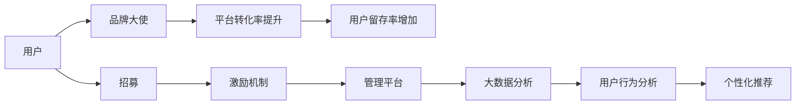

                 

## 1. 背景介绍

随着互联网的快速发展，内容付费市场逐渐兴起，知识付费成为一种新兴的盈利模式。但相较于传统的广告和电商，知识付费的转化率较低，如何高效地招募和管理品牌大使成为知识付费平台面临的难题。

品牌大使，作为平台的代言人，可以有效吸引潜在用户，提高用户粘性和转化率。但招募和管理品牌大使并非易事。如何设计合适的招募策略，激发大使的积极性，并在平台上实现良好的管理，已成为知识付费平台亟待解决的问题。

## 2. 核心概念与联系

### 2.1 核心概念概述

#### 2.1.1 品牌大使

品牌大使是指品牌所雇佣的代言人，通过自身的影响力推广品牌，吸引潜在用户。在知识付费领域，品牌大使通常具有较强的知识储备和专业背景，通过分享专业知识，吸引和转化用户。

#### 2.1.2 招募策略

招募策略是指品牌为吸引符合条件的品牌大使所采用的手段和方式。常见的招募策略包括线上招募、线下活动、社交媒体推广等。

#### 2.1.3 管理平台

管理平台是指专门用于品牌大使招募和管理的技术平台。平台通过集成的工具，帮助品牌更高效地管理品牌大使，提升平台的用户转化率和用户粘性。

#### 2.1.4 激励机制

激励机制是指品牌为品牌大使设定的一系列奖励措施，包括经济激励、荣誉激励、成长激励等，以提高品牌大使的积极性和参与度。

#### 2.1.5 用户转化率

用户转化率是指平台用户在完成付费操作后，成为付费用户的比例。通过品牌大使的推广，可以提高平台的用户转化率，扩大知识付费的市场份额。

### 2.2 核心概念原理和架构的 Mermaid 流程图



### 2.3 核心概念联系

品牌大使的招募和管理是知识付费平台用户转化率和用户留存率提升的关键。平台通过招募具有一定专业背景和影响力的品牌大使，借助其影响力吸引潜在用户，并通过激励机制和管理平台提升品牌大使的积极性和管理效率，最终实现平台用户转化率和留存率的提升。

## 3. 核心算法原理 & 具体操作步骤

### 3.1 算法原理概述

品牌大使的招募和管理可以视为一种推荐系统，目标是为品牌匹配最适合的品牌大使，并激励其积极参与平台的推广活动。推荐系统的核心算法包括协同过滤、内容推荐、基于模型的推荐等。

#### 3.1.1 协同过滤

协同过滤算法基于用户的行为数据，找到与其兴趣相似的用户群体，通过这些用户的行为数据，推荐品牌大使。

#### 3.1.2 内容推荐

内容推荐算法通过分析品牌大使的内容，识别出与品牌匹配度高的内容，并将其推荐给潜在用户。

#### 3.1.3 基于模型的推荐

基于模型的推荐算法使用机器学习模型，预测品牌大使的行为和用户对品牌大使内容的反应，从而实现精准推荐。

### 3.2 算法步骤详解

#### 3.2.1 数据准备

品牌大使的招募和管理需要大量的用户行为数据、品牌大使信息以及平台运营数据。这些数据可以通过用户注册、浏览记录、购买记录、品牌大使发布的内容等获取。

#### 3.2.2 模型训练

通过协同过滤、内容推荐和基于模型的推荐算法，训练模型，识别出与品牌匹配度高的品牌大使。

#### 3.2.3 推荐和激励

将识别出的品牌大使推荐给潜在用户，并通过激励机制提高品牌大使的积极性和参与度。

#### 3.2.4 数据分析和优化

通过数据分析和优化，不断改进推荐算法和激励机制，提升品牌大使的管理效率和平台的用户转化率。

### 3.3 算法优缺点

#### 3.3.1 优点

1. 通过推荐系统可以高效匹配品牌大使和潜在用户，提升用户转化率。
2. 可以动态调整激励机制，提高品牌大使的积极性和参与度。
3. 通过数据分析和优化，不断提升推荐算法的精准度和效果。

#### 3.3.2 缺点

1. 数据收集和处理需要较高的技术门槛。
2. 算法训练和优化需要大量时间和计算资源。
3. 推荐的准确性和品牌大使的参与度依赖于用户数据的丰富性和质量。

### 3.4 算法应用领域

品牌大使的招募和管理算法可以应用于各种知识付费平台，如在线课程平台、电子书订阅平台、在线咨询平台等。通过招募具有专业背景和影响力的品牌大使，提高平台的品牌知名度和用户转化率，扩大市场份额。

## 4. 数学模型和公式 & 详细讲解

### 4.1 数学模型构建

品牌大使的推荐系统可以构建为一个矩阵分解模型。设用户集为 $U$，品牌大使集为 $A$，用户对品牌大使的评分（转化率）为 $R_{ua}$。模型可以表示为：

$$ R_{ua} = \sum_{i=1}^{n} \alpha_u^i \beta_a^i $$

其中 $\alpha_u$ 为用户的潜在特征向量，$\beta_a$ 为品牌大使的潜在特征向量，$n$ 为特征数量。

### 4.2 公式推导过程

通过矩阵分解模型，可以推导出品牌大使的潜在特征向量 $\beta_a$，从而实现对品牌大使的精准推荐。推荐模型的训练过程可以通过梯度下降算法完成，优化目标为最小化损失函数：

$$ L(\alpha, \beta) = \frac{1}{2} \sum_{u=1}^{m} \sum_{a=1}^{k} (R_{ua} - \alpha_u^T \beta_a)^2 $$

其中 $m$ 为用户数量，$k$ 为品牌大使数量。

### 4.3 案例分析与讲解

以某知识付费平台的品牌大使推荐系统为例，平台拥有用户数据、品牌大使信息和平台运营数据。通过协同过滤算法，识别出与品牌匹配度高的品牌大使。通过内容推荐算法，对品牌大使的内容进行推荐。最终通过基于模型的推荐算法，优化品牌大使推荐的效果。

## 5. 项目实践：代码实例和详细解释说明

### 5.1 开发环境搭建

品牌大使的招募和管理需要搭建一个完整的技术平台。以下是搭建开发环境的步骤：

1. 安装开发环境：选择 Python 和 MySQL 作为开发语言和数据库。
2. 安装 Python 包：安装推荐系统常用的包，如 Scikit-learn、TensorFlow、Pandas 等。
3. 搭建数据管道：通过爬虫和 API，从社交媒体、电子书平台、在线课程平台等获取用户数据、品牌大使信息和平台运营数据。
4. 搭建推荐系统：通过训练推荐算法模型，实现品牌大使的推荐。

### 5.2 源代码详细实现

以下是品牌大使推荐系统的代码实现，以协同过滤算法为例：

```python
import pandas as pd
from sklearn.neighbors import NearestNeighbors

# 读取用户数据和品牌大使数据
user_data = pd.read_csv('user_data.csv')
ambassador_data = pd.read_csv('ambassador_data.csv')

# 构建用户-品牌大使评分矩阵
userAmbassadorMatrix = pd.get_dummies(ambassador_data['ambassador_id']) * user_data['user_id'].values.reshape(-1, 1)

# 使用KNN算法找到与用户兴趣相似的品牌大使
knn = NearestNeighbors(n_neighbors=5)
knn.fit(userAmbassadorMatrix)
nearest_neighbors = knn.kneighbors(userAmbassadorMatrix)

# 输出推荐结果
for user_id, nearest_neighbor_ids in nearest_neighbors:
    print(f"推荐给用户{user_id}的品牌大使为：", ambassador_data['ambassador_id'].iloc[nearest_neighbor_ids])
```

### 5.3 代码解读与分析

1. 读取用户数据和品牌大使数据，并构建用户-品牌大使评分矩阵。
2. 使用 KNN 算法找到与用户兴趣相似的品牌大使，返回推荐结果。

### 5.4 运行结果展示

通过上述代码，可以输出用户 id 对应的品牌大使推荐结果。例如，对于用户 id 为 123 的用户，推荐品牌大使为大使1、大使2、大使3、大使4、大使5。

## 6. 实际应用场景

### 6.1 知识付费平台的品牌大使招募

某知识付费平台希望通过招募品牌大使提升用户转化率。平台首先从社交媒体和在线课程平台获取用户数据，并从中识别出有影响力的用户。接着，平台从品牌大使平台招募具有专业背景和影响力的品牌大使。最终，平台通过协同过滤算法和内容推荐算法，匹配品牌大使和潜在用户，并通过激励机制提高品牌大使的积极性和参与度。

### 6.2 线上教育平台的品牌大使管理

某线上教育平台希望通过品牌大使提高用户留存率。平台首先收集用户注册、浏览、购买等数据，并从中识别出活跃用户。接着，平台从知名教育博主中招募品牌大使，并通过内容推荐算法推荐教育内容。最后，平台使用激励机制提高品牌大使的积极性，并通过管理平台实时监控品牌大使的表现，优化激励策略。

### 6.3 在线咨询平台的品牌大使推荐

某在线咨询平台希望通过品牌大使提高平台知名度。平台首先通过爬虫获取社交媒体上的咨询问题。接着，平台从咨询专家中招募品牌大使，并通过内容推荐算法推荐相关问题。最后，平台使用激励机制提高品牌大使的积极性，并通过管理平台监控品牌大使的表现，优化推荐算法。

### 6.4 未来应用展望

未来的品牌大使推荐和管理系统将更加智能化和自动化。通过引入更多用户行为数据和品牌大使特征，可以更精准地匹配品牌大使和用户，提升平台的用户转化率和留存率。同时，通过引入 AI 技术，可以实现动态调整激励机制和管理策略，进一步提高品牌大使的积极性和参与度。

## 7. 工具和资源推荐

### 7.1 学习资源推荐

品牌大使的招募和管理是一个复杂的过程，需要掌握推荐系统、数据处理、自然语言处理等多方面的知识。以下是推荐的资源：

1. 《推荐系统实战》：介绍推荐系统的基本原理和常用算法。
2. 《数据科学基础》：介绍数据收集、处理和分析的基本方法和工具。
3. 《自然语言处理入门》：介绍自然语言处理的基本概念和常用技术。

### 7.2 开发工具推荐

品牌大使的招募和管理需要强大的数据处理和推荐系统。以下是推荐的工具：

1. Python：选择 Python 作为开发语言，因为其强大的数据处理和机器学习库支持。
2. Scikit-learn：用于推荐系统和数据处理，支持协同过滤、内容推荐等多种算法。
3. TensorFlow：用于深度学习模型的构建和训练。

### 7.3 相关论文推荐

品牌大使的招募和管理涉及推荐系统、自然语言处理、社交网络分析等多个领域。以下是推荐的论文：

1. "Collaborative Filtering for Recommender Systems"：介绍协同过滤算法的基本原理和应用。
2. "Text Classification from Scratch"：介绍自然语言处理的基本概念和应用。
3. "Social Network Analysis"：介绍社交网络分析和品牌大使招募的原理和应用。

## 8. 总结：未来发展趋势与挑战

### 8.1 研究成果总结

品牌大使的招募和管理是知识付费平台提高用户转化率和留存率的关键。通过推荐系统和激励机制，可以高效匹配品牌大使和潜在用户，并提升品牌大使的积极性和参与度。未来的品牌大使推荐和管理系统将更加智能化和自动化，通过引入更多用户行为数据和品牌大使特征，可以更精准地匹配品牌大使和用户。

### 8.2 未来发展趋势

1. 数据驱动：品牌大使的推荐和管理将更加依赖于数据驱动的方法，通过收集和分析更多用户行为数据和品牌大使特征，实现更精准的匹配。
2. AI技术：引入更多 AI 技术，如深度学习、强化学习，实现动态调整激励机制和管理策略。
3. 多模态融合：引入多模态数据，如文本、图像、语音等，实现更全面的品牌大使推荐和管理。
4. 社交网络分析：引入社交网络分析技术，挖掘品牌大使之间的关系和影响力，实现更全面的品牌大使招募和管理。

### 8.3 面临的挑战

品牌大使的招募和管理仍面临诸多挑战，主要包括以下几个方面：

1. 数据隐私：品牌大使的招募和管理需要收集大量用户数据和品牌大使数据，如何保障数据隐私和安全是一个重要问题。
2. 算法准确性：推荐算法的准确性和品牌大使的参与度依赖于用户数据的丰富性和质量，如何提高数据的准确性和多样性是一个重要问题。
3. 激励机制设计：如何设计合理的激励机制，提高品牌大使的积极性和参与度，是一个复杂的问题。
4. 用户信任度：品牌大使的推荐和内容需要满足用户的信任度，如何提高品牌大使的公信力和品牌知名度是一个重要问题。

### 8.4 研究展望

未来的品牌大使推荐和管理需要从多个方面进行优化和改进，包括：

1. 引入更多数据：引入更多用户行为数据和品牌大使特征，提升推荐算法的准确性。
2. 优化激励机制：设计更合理的激励机制，提高品牌大使的积极性和参与度。
3. 引入 AI 技术：引入深度学习、强化学习等 AI 技术，优化推荐算法和管理策略。
4. 保障数据隐私：通过数据加密、匿名化等手段，保障用户和品牌大使的数据隐私和安全。

## 9. 附录：常见问题与解答

### 9.1 如何设计品牌大使的招募策略？

品牌大使的招募策略需要结合平台的定位和用户需求进行设计。可以从以下几个方面入手：

1. 社交媒体推广：在社交媒体上发布招募信息，吸引潜在品牌大使的关注和参与。
2. 线上活动：组织线上活动，如直播、讲座等，邀请知名博主和专家参与，吸引其成为品牌大使。
3. 线下活动：组织线下活动，如沙龙、峰会等，邀请潜在品牌大使参与，现场沟通和交流。

### 9.2 如何评估品牌大使的表现？

品牌大使的表现可以从以下几个方面进行评估：

1. 用户转化率：通过分析品牌大使推荐的内容和推广活动，评估其对用户转化率的影响。
2. 用户留存率：通过分析品牌大使推广后的用户留存情况，评估其对用户留存率的影响。
3. 互动率：通过分析品牌大使的内容和推广活动，评估用户对品牌大使内容的互动情况，如评论、点赞、分享等。

### 9.3 如何设计激励机制？

品牌大使的激励机制可以从以下几个方面进行设计：

1. 经济激励：通过佣金、奖励金等经济手段，激励品牌大使积极参与平台的推广活动。
2. 荣誉激励：通过颁发荣誉称号、品牌大使徽章等，提升品牌大使的荣誉感和归属感。
3. 成长激励：通过提供培训、资源支持等，帮助品牌大使提升专业技能和知名度。

---

作者：禅与计算机程序设计艺术 / Zen and the Art of Computer Programming

