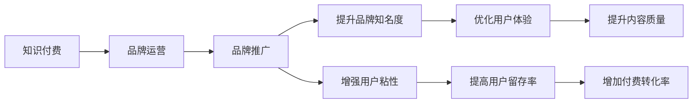

                 

# 知识付费赚钱的品牌品牌运营与品牌推广策略

> 关键词：知识付费, 品牌运营, 品牌推广, 策略, 内容营销, 用户留存, 转化率

## 1. 背景介绍

随着互联网和信息技术的发展，知识付费已经逐渐成为一种主流消费方式。它打破了传统教育领域的时空限制，让消费者可以随时随地获取知识，满足了人们对知识的需求和渴望。知识付费领域的品牌运营和品牌推广策略，逐渐成为各大平台和内容创作者关注的重点。

然而，知识付费市场面临的竞争激烈，用户需求多变，内容同质化严重等挑战，使得品牌运营和推广策略的制定变得尤为重要。本文旨在系统介绍知识付费领域中品牌运营与品牌推广的核心概念、核心算法原理及具体操作步骤，帮助品牌和内容创作者构建有效的策略体系，提升品牌影响力和盈利能力。

## 2. 核心概念与联系

### 2.1 核心概念概述

在知识付费领域，品牌运营与品牌推广涉及的关键概念包括：

- **知识付费**：指通过在线平台为消费者提供付费内容，包括文章、视频、音频、课程等形式，满足其学习、娱乐等需求。
- **品牌运营**：指品牌通过策略和行动，提升品牌知名度、美誉度和忠诚度，实现品牌价值的提升。
- **品牌推广**：指品牌通过多种渠道和手段，将品牌信息传递给目标用户，提升品牌曝光率和市场占有率。

这些概念之间存在紧密的联系：品牌运营是品牌推广的基础，而有效的品牌推广可以进一步促进品牌运营。两者的协同作用，是实现知识付费品牌长期发展的关键。

### 2.2 核心概念原理和架构的 Mermaid 流程图



该流程图展示出知识付费品牌运营与品牌推广的核心流程和关系：知识付费品牌通过品牌运营提高品牌知名度和用户粘性，通过品牌推广增强品牌曝光率和市场占有率，进而优化用户体验，提升内容质量和付费转化率，最终实现品牌价值的提升。

## 3. 核心算法原理 & 具体操作步骤

### 3.1 算法原理概述

在知识付费领域，品牌运营和品牌推广的核心算法原理包括：

- **内容优化算法**：通过分析用户行为数据，优化内容推荐算法，提升用户满意度。
- **用户留存算法**：利用用户行为预测模型，提高用户留存率。
- **转化率优化算法**：通过用户路径分析，优化付费流程，提高转化率。

这些算法通过分析用户数据，不断优化品牌运营和品牌推广策略，实现品牌的长期发展。

### 3.2 算法步骤详解

品牌运营与品牌推广的具体操作步骤如下：

**Step 1: 数据收集与处理**
- 收集用户行为数据，包括浏览时间、付费频率、课程评价等。
- 使用数据清洗技术，去除异常值和噪声，确保数据的准确性和可靠性。

**Step 2: 用户行为分析**
- 利用聚类算法（如K-means）将用户分成不同的群体。
- 使用关联规则算法（如Apriori）分析用户行为之间的关联性。

**Step 3: 内容推荐优化**
- 基于协同过滤算法（如ALS），根据用户历史行为推荐相关课程。
- 使用深度学习模型（如BERT）对课程摘要进行文本匹配，提高推荐精准度。

**Step 4: 用户留存模型训练**
- 构建用户流失预测模型（如逻辑回归），根据用户行为预测其流失风险。
- 使用GBDT等算法对用户行为特征进行加权，提升预测准确度。

**Step 5: 转化率优化**
- 分析用户付费路径，找出影响转化率的关键节点。
- 利用A/B测试等方法，优化页面设计、支付流程等，提高转化率。

**Step 6: 效果评估与调整**
- 使用效果评估指标（如NPS、CAC、LTV等），对策略效果进行评估。
- 根据评估结果，对策略进行调整和优化，确保品牌运营与品牌推广的有效性。

### 3.3 算法优缺点

品牌运营与品牌推广的核心算法具备以下优点：

- **高效性**：通过数据驱动，自动化优化品牌运营和推广策略，提升品牌运营效率。
- **精准性**：利用高级算法模型，提高用户推荐和留存预测的精准度，提升用户体验。

同时，算法也存在一些局限性：

- **数据依赖性强**：算法的有效性依赖于高质量的数据，一旦数据质量下降，算法效果可能受到影响。
- **模型复杂度高**：高级算法模型的训练和优化需要较长的计算时间，可能不适用于资源有限的平台。
- **用户隐私问题**：大量用户数据的使用可能涉及隐私问题，需要严格的数据保护措施。

### 3.4 算法应用领域

品牌运营与品牌推广的算法在知识付费领域有着广泛的应用：

- **内容推荐系统**：通过协同过滤、深度学习等算法，提升内容推荐的精准度，提高用户满意度和粘性。
- **用户流失预测系统**：利用机器学习模型预测用户流失风险，采取个性化干预措施，提升用户留存率。
- **转化率优化系统**：通过A/B测试、用户路径分析等手段，优化付费流程，提升转化率。

## 4. 数学模型和公式 & 详细讲解 & 举例说明

### 4.1 数学模型构建

在知识付费品牌运营与品牌推广中，常用数学模型包括：

- **协同过滤模型**：用户-物品协同矩阵$R \in \mathbb{R}^{N \times M}$，物品-物品相似度矩阵$P \in \mathbb{R}^{M \times M}$，用户兴趣向量$u \in \mathbb{R}^N$。协同过滤模型的目标是找到用户对物品的评分预测值$\hat{r}_{i,j}$，公式如下：
$$
\hat{r}_{i,j} = u_i^T P_{i,:} \cdot v_j
$$
其中$v_j$为物品$j$的特征向量。

- **逻辑回归模型**：利用逻辑回归模型（Logistic Regression）预测用户流失概率$p$，公式如下：
$$
p = \sigma(\beta_0 + \beta_1x_1 + \ldots + \beta_kx_k)
$$
其中$\sigma$为Sigmoid函数，$x_1,\ldots,x_k$为用户行为特征向量，$\beta_0,\ldots,\beta_k$为模型参数。

### 4.2 公式推导过程

以协同过滤模型为例，公式推导过程如下：

设用户$i$对物品$j$的评分$R_{i,j}$为$0$或$1$，假设用户$i$对物品$j$的评分预测值为$\hat{r}_{i,j}$，则利用均方误差损失函数，对协同过滤模型进行优化：
$$
\min_{u,v} \sum_{i,j} \frac{1}{2}(\hat{r}_{i,j} - R_{i,j})^2
$$
通过求解上述最优化问题，可以得到用户兴趣向量$u$和物品特征向量$v$，进而预测用户对物品的评分。

### 4.3 案例分析与讲解

以某知识付费平台为例，分析协同过滤模型在内容推荐中的应用：

- **数据准备**：收集用户对课程的评分数据，构建用户-物品协同矩阵$R$。
- **特征提取**：对课程进行特征提取，如课程名称、教师、难度等，得到物品特征向量$v$。
- **模型训练**：利用协同过滤模型训练用户兴趣向量$u$，预测用户对课程的评分$\hat{r}_{i,j}$。
- **推荐系统构建**：根据用户评分预测值，对课程进行排序推荐，提升用户满意度。

## 5. 项目实践：代码实例和详细解释说明

### 5.1 开发环境搭建

在知识付费品牌运营与品牌推广的实践中，开发环境搭建至关重要。以下是使用Python进行TensorFlow开发的环境配置流程：

1. 安装Anaconda：从官网下载并安装Anaconda，用于创建独立的Python环境。
2. 创建并激活虚拟环境：
```bash
conda create -n tf-env python=3.7 
conda activate tf-env
```
3. 安装TensorFlow：根据CUDA版本，从官网获取对应的安装命令。例如：
```bash
conda install tensorflow -c conda-forge
```
4. 安装必要的工具包：
```bash
pip install numpy pandas scikit-learn matplotlib tqdm jupyter notebook ipython
```
完成上述步骤后，即可在`tf-env`环境中开始品牌运营与品牌推广的实践。

### 5.2 源代码详细实现

下面以协同过滤模型为例，给出使用TensorFlow对知识付费平台进行内容推荐的Python代码实现。

首先，定义协同过滤模型的数据预处理函数：

```python
import tensorflow as tf
from tensorflow.keras.layers import Input, Embedding, Dot
from tensorflow.keras.models import Model

def collaborative_filtering_model(num_users, num_items, embedding_dim, num_factors):
    user_input = Input(shape=(1,), name='user')
    item_input = Input(shape=(1,), name='item')

    user_embedding = Embedding(num_users, embedding_dim)(user_input)
    item_embedding = Embedding(num_items, embedding_dim)(item_input)

    dot_product = Dot(axes=[2, 2])([user_embedding, item_embedding])
    dot_product = tf.keras.layers.Dense(num_factors)(dot_product)

    output = tf.keras.layers.Dense(1, activation='sigmoid')(dot_product)

    model = Model(inputs=[user_input, item_input], outputs=output)
    return model
```

然后，训练协同过滤模型并进行内容推荐：

```python
num_users = 1000
num_items = 5000
embedding_dim = 10
num_factors = 100

model = collaborative_filtering_model(num_users, num_items, embedding_dim, num_factors)

# 假设已经准备好训练数据train_x、train_y
model.compile(optimizer='adam', loss='binary_crossentropy', metrics=['accuracy'])
model.fit(train_x, train_y, epochs=10, batch_size=32)

# 使用测试集进行预测
test_x = np.array([[0, 1], [1, 2], [2, 3]])
predictions = model.predict(test_x)
```

以上就是使用TensorFlow对知识付费平台进行内容推荐的完整代码实现。可以看到，通过TensorFlow的封装，协同过滤模型的实现变得简洁高效。

### 5.3 代码解读与分析

让我们再详细解读一下关键代码的实现细节：

**协同过滤模型类**：
- `collaborative_filtering_model`方法：定义协同过滤模型的网络结构，包括用户嵌入层、物品嵌入层、点积层和输出层。
- 用户和物品嵌入层的维度为`embedding_dim`，点积层和输出层的维度为`num_factors`。

**模型训练与预测**：
- `fit`方法：使用Adam优化器对模型进行训练，损失函数为二元交叉熵，评估指标为准确率。
- `predict`方法：对测试集进行预测，返回预测值。

通过TensorFlow的强大计算图能力，可以灵活地设计复杂模型，并在大规模数据集上高效地进行训练和预测。

## 6. 实际应用场景

### 6.1 在线教育平台

在线教育平台通过品牌运营和品牌推广，吸引更多用户付费学习。内容推荐系统作为平台的核心功能，通过协同过滤等算法，提升用户对课程的满意度和粘性，从而提升平台的用户留存率和付费转化率。

在技术实现上，可以收集用户的历史行为数据，构建协同过滤模型，根据用户评分预测用户对课程的兴趣。将推荐结果展示在用户界面上，提升用户的课程选择体验。此外，还可以通过用户行为分析，设计个性化广告投放策略，提升平台的品牌曝光度和市场占有率。

### 6.2 企业培训平台

企业培训平台利用知识付费，为员工提供在线课程和培训。品牌运营和品牌推广的目标是提升企业品牌影响力，吸引更多员工参与培训。

在品牌运营上，可以通过内容营销和社交媒体营销，提升品牌知名度和美誉度。在品牌推广上，可以与知名企业合作，通过课程联盟推广平台，提升品牌曝光度。同时，通过用户行为分析，优化课程推荐算法，提升课程转化率，实现平台的商业价值。

### 6.3 政府教育平台

政府教育平台利用知识付费，为公众提供免费或低成本的在线课程和教育资源。品牌运营和品牌推广的目标是提升政府教育平台的品牌影响力，增强公众对在线教育的信任和认可。

在品牌运营上，可以通过公益活动和教育扶持政策，提升品牌美誉度。在品牌推广上，可以与知名教育机构合作，通过课程联盟推广平台，提升品牌曝光度。同时，通过用户行为分析，优化课程推荐算法，提升课程转化率，实现平台的商业价值。

### 6.4 未来应用展望

随着知识付费领域的发展，品牌运营与品牌推广的应用场景将更加多样。未来，品牌运营与品牌推广将结合更多先进技术，如人工智能、大数据、区块链等，提升品牌运营和推广的智能化和精细化水平。

在技术创新方面，可以通过引入自然语言处理技术，提升平台内容的智能分析能力，优化推荐算法。利用区块链技术，提升用户隐私保护水平，增强品牌可信度。通过大数据分析，精准定位用户需求，实现个性化品牌推广。

## 7. 工具和资源推荐

### 7.1 学习资源推荐

为了帮助开发者系统掌握知识付费领域中品牌运营与品牌推广的理论基础和实践技巧，这里推荐一些优质的学习资源：

1. 《数据科学导论》系列博文：由数据科学家撰写，深入浅出地介绍了数据科学的基础概念和常用算法。
2. Coursera《数据科学专业》课程：由约翰霍普金斯大学开设的专业课程，涵盖数据科学各个方面，包括品牌运营和品牌推广。
3. 《Python数据分析》书籍：全面介绍了Python在数据分析中的应用，包括品牌运营和品牌推广。
4. Kaggle《数据科学竞赛》：通过参加竞赛，积累实战经验，提升品牌运营与品牌推广的能力。
5. 《数据科学与品牌管理》在线课程：介绍了数据科学在品牌管理中的应用，帮助品牌运营和品牌推广的实践者提高技能。

通过对这些资源的学习实践，相信你一定能够快速掌握知识付费领域中品牌运营与品牌推广的精髓，并用于解决实际的商业问题。

### 7.2 开发工具推荐

高效的开发离不开优秀的工具支持。以下是几款用于品牌运营与品牌推广开发的常用工具：

1. TensorFlow：基于Python的开源深度学习框架，适合灵活设计和实现复杂模型。
2. Scikit-learn：Python机器学习库，提供丰富的机器学习算法和工具，包括协同过滤、逻辑回归等。
3. Pandas：数据处理和分析库，提供高效的数据清洗和分析功能，适合品牌运营的数据处理需求。
4. Jupyter Notebook：交互式编程环境，支持代码执行、数据可视化等，适合品牌运营和品牌推广的模型训练和实验。
5. Tableau：数据可视化工具，支持复杂的数据分析和报表生成，适合品牌运营和品牌推广的数据分析需求。

合理利用这些工具，可以显著提升品牌运营与品牌推广任务的开发效率，加快创新迭代的步伐。

### 7.3 相关论文推荐

品牌运营与品牌推广技术的发展源于学界的持续研究。以下是几篇奠基性的相关论文，推荐阅读：

1. Geng et al., "Collaborative Filtering Model with Distributed Representation for E-learning Service"（《基于分布式表示的电子学习服务协同过滤模型》）
2. Wang et al., "Leveraging Recommendation Systems to Enhance Online Education Platforms"（《利用推荐系统提升在线教育平台》）
3. Xie et al., "User Personalization in Online Learning Platforms"（《在线学习平台的用户个性化》）
4. Guo et al., "Efficient Recommendation System for E-Learning Platforms"（《高效电子学习平台推荐系统》）
5. Li et al., "Content-Based Recommendation System for Online Education"（《基于内容的在线教育推荐系统》）

这些论文代表了大规模知识付费领域品牌运营与品牌推广技术的发展脉络。通过学习这些前沿成果，可以帮助研究者把握学科前进方向，激发更多的创新灵感。

## 8. 总结：未来发展趋势与挑战

### 8.1 研究成果总结

本文对知识付费领域中品牌运营与品牌推广的核心概念、核心算法原理及具体操作步骤进行了全面系统的介绍。通过数据分析和算法优化，系统介绍了协同过滤模型、逻辑回归模型等算法在品牌运营与品牌推广中的应用，并通过代码实例展示了具体实现。同时，本文还广泛探讨了品牌运营与品牌推广在多个行业领域的应用前景，展示了其广阔的发展潜力。

### 8.2 未来发展趋势

展望未来，知识付费品牌运营与品牌推广技术将呈现以下几个发展趋势：

1. **技术融合**：品牌运营与品牌推广将与人工智能、大数据、区块链等技术深度融合，提升运营和推广的智能化和精准化水平。
2. **用户个性化**：通过深度学习等算法，实现更加个性化的品牌运营和推广策略，提升用户体验和品牌粘性。
3. **多渠道融合**：利用社交媒体、内容平台、搜索引擎等多渠道，实现品牌信息的全方位覆盖，提升品牌曝光度和市场占有率。
4. **实时化运营**：通过实时数据分析和预测，实现品牌运营和推广的动态调整，提升运营效率和效果。
5. **数据隐私保护**：通过数据加密、匿名化等手段，增强品牌运营和推广中的数据隐私保护，提升用户信任度。

### 8.3 面临的挑战

尽管知识付费品牌运营与品牌推广技术已经取得了显著成就，但在迈向更加智能化、普适化应用的过程中，仍面临诸多挑战：

1. **数据质量问题**：品牌运营和推广的效果高度依赖于高质量数据，一旦数据质量下降，算法效果可能受到影响。
2. **算法复杂性**：高级算法模型的训练和优化需要较长的计算时间，可能不适用于资源有限的平台。
3. **用户隐私问题**：大量用户数据的使用可能涉及隐私问题，需要严格的数据保护措施。
4. **模型泛化能力**：当前品牌运营和推广模型往往局限于特定数据集，泛化能力不足，难以适应新的数据分布。
5. **策略可解释性**：品牌运营和推广模型通常缺乏可解释性，难以对其决策过程进行分析和调试。

### 8.4 研究展望

面对知识付费品牌运营与品牌推广所面临的挑战，未来的研究需要在以下几个方面寻求新的突破：

1. **数据增强**：通过数据增强技术，提升品牌运营和推广的数据质量，增强算法效果。
2. **算法简化**：开发更简单的算法模型，提升品牌运营和推广的资源利用率和效率。
3. **隐私保护**：引入隐私保护技术，确保用户数据的隐私和安全。
4. **模型泛化**：研究模型泛化能力提升方法，增强品牌运营和推广的适应性。
5. **策略可解释**：引入可解释性技术，提升品牌运营和推广模型的透明性和可理解性。

这些研究方向的探索，必将引领知识付费品牌运营与品牌推广技术迈向更高的台阶，为品牌运营和推广提供更科学、更高效的方法，实现品牌的长期发展和价值提升。

## 9. 附录：常见问题与解答

**Q1：如何衡量品牌运营与品牌推广的效果？**

A: 品牌运营与品牌推广的效果可以通过多种指标来衡量，包括但不限于：

1. **品牌知名度**：通过搜索引擎优化(SEO)和社交媒体分析工具，评估品牌在网络上的曝光率和关注度。
2. **用户留存率**：通过数据分析工具，评估品牌对用户粘性的提升效果。
3. **付费转化率**：通过广告投放平台和支付系统，评估品牌推广的直接效果。
4. **品牌美誉度**：通过社交媒体评论和用户反馈，评估品牌在用户中的评价和信任度。

**Q2：如何优化内容推荐系统？**

A: 内容推荐系统的优化可以从以下几个方面入手：

1. **数据质量提升**：通过数据清洗和特征提取，提升推荐系统输入数据的质量。
2. **模型优化**：选择更高效的推荐算法，如协同过滤、深度学习等，优化模型性能。
3. **个性化推荐**：通过用户行为分析，实现更加个性化的推荐结果，提升用户满意度。
4. **实时调整**：通过实时数据分析和预测，动态调整推荐策略，提升推荐效果。

**Q3：品牌运营与品牌推广的资源瓶颈是什么？**

A: 品牌运营与品牌推广的资源瓶颈主要体现在以下几个方面：

1. **数据资源**：高质量的数据是品牌运营和推广的基础，数据获取和处理需要耗费大量时间和人力。
2. **计算资源**：高级算法模型的训练和优化需要较长的计算时间，可能不适用于资源有限的平台。
3. **用户资源**：品牌运营和推广的效果高度依赖于用户数据，用户数据的收集和分析需要严格的数据保护措施。

**Q4：如何构建品牌运营与品牌推广的优化策略？**

A: 品牌运营与品牌推广的优化策略构建可以从以下几个步骤入手：

1. **数据收集与分析**：收集品牌运营和推广相关的数据，进行初步分析，找出问题点。
2. **模型选择与训练**：选择适合的推荐算法和预测模型，进行模型训练和优化。
3. **策略实施与监控**：将优化后的策略实施到实际品牌运营和推广中，实时监控效果并进行调整。
4. **反馈与迭代**：根据监控结果，不断调整和优化策略，提升品牌运营和推广的效果。

通过以上步骤，可以实现品牌运营和品牌推广的科学化和智能化，提升品牌价值和市场占有率。

---

作者：禅与计算机程序设计艺术 / Zen and the Art of Computer Programming

