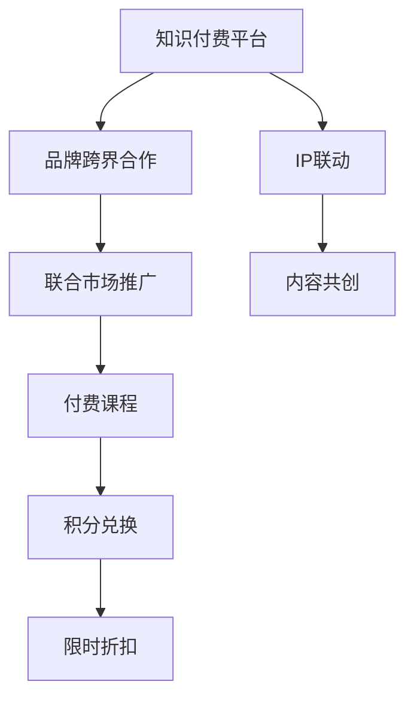

                 

# 知识付费赚钱的品牌跨界营销与IP联动策略

> 关键词：知识付费,品牌跨界,IP联动,营销策略,用户体验,客户转化

## 1. 背景介绍

### 1.1 问题由来
在数字化时代，知识的获取不再受到时间和空间的限制，知识付费平台如雨后春笋般涌现。然而，尽管市场规模不断扩大，如何提升用户黏性、增加收入和品牌曝光率，仍是各大知识付费平台急需解决的难题。传统的营销策略，如单边广告投放、自有内容营销等，往往效果有限，难以达到预期目标。品牌跨界合作与IP联动，成为了知识付费平台突破增长瓶颈的重要手段。

### 1.2 问题核心关键点
品牌跨界合作与IP联动，本质上是一种多渠道的资源整合策略，通过与品牌或IP的协同互动，实现双赢或多赢。具体而言，关键点包括：

- 找到合适的跨界品牌或IP。品牌价值与知识付费平台的用户定位高度相关，选择具有较高市场知名度和用户认可度的品牌，能够显著提升平台的用户吸引力。
- 设计合适的联动内容。联动内容应紧贴双方用户的兴趣和需求，产生共鸣，提高用户参与度和互动频率。
- 制定合理的营销策略。联合市场推广、积分兑换、限时折扣等策略，激发用户参与联动活动，提升客户转化率。

### 1.3 问题研究意义
在知识付费平台，品牌跨界合作与IP联动策略能够带来多方面的显著收益：

1. 提升品牌曝光：通过与知名品牌合作，知识付费平台能够吸引更多高价值用户，提升品牌知名度。
2. 增加用户黏性：联动内容往往设计精巧，易于引发用户兴趣，增强用户对平台的黏性。
3. 扩大市场份额：联动营销策略能够扩大市场覆盖范围，增加新用户注册和活跃度。
4. 增强用户信任：知名品牌的背书能够增强用户对平台的信任，提升转化率。
5. 提升平台收入：联动活动中，品牌往往以付费课程或特别服务的形式进行推广，增加平台的收入来源。

通过理解和应用品牌跨界合作与IP联动的策略，知识付费平台能够在竞争激烈的市场中脱颖而出，实现可持续发展。

## 2. 核心概念与联系

### 2.1 核心概念概述

为更好地理解品牌跨界合作与IP联动的策略，本节将介绍几个关键概念及其相互关系：

- **知识付费平台**：以知识分享为核心的在线平台，用户通过支付一定费用，获取个性化、高价值的内容。典型平台包括Coursera、Udemy、得到等。
- **品牌跨界合作**：不同领域品牌之间的合作，通过资源互换、联合营销等方式，扩大彼此的受众和影响力。
- **IP联动**：基于知识产权的联动策略，通过整合知识产权资源，创造新的价值和商业机会。

这些核心概念之间的逻辑关系可以通过以下Mermaid流程图来展示：



这个流程图展示了知识付费平台如何通过品牌跨界合作与IP联动，实现多维度的市场推广和收入增长：

1. 知识付费平台通过与知名品牌合作，进行联合市场推广。
2. 品牌利用知识付费平台的渠道和用户基础，推广其付费课程。
3. 联动过程中，品牌和平台可共同创建优质内容，提升用户体验。
4. 通过积分兑换、限时折扣等方式，增加用户参与度，提升客户转化率。

## 3. 核心算法原理 & 具体操作步骤
### 3.1 算法原理概述

品牌跨界合作与IP联动策略的核心理论基础是价值链管理（Value Chain Management, VCM）。价值链管理关注企业内部的业务流程优化和外部资源整合，通过价值链的优化，提升企业的整体竞争力和市场地位。具体到品牌跨界合作与IP联动，VCM理论可帮助企业识别和利用外部资源，提升品牌和平台的用户价值。

品牌跨界合作与IP联动策略的算法原理如下：

1. **需求匹配**：基于用户数据和行为分析，匹配合适的品牌或IP，确保其与知识付费平台的用户定位高度相关。
2. **内容共创**：双方共同策划联动内容，利用各自的优势资源，创造高附加值的内容。
3. **市场推广**：通过多渠道的市场推广活动，提升联动内容的曝光率和用户参与度。
4. **客户转化**：利用营销策略，激发用户参与联动活动，提升客户转化率。

### 3.2 算法步骤详解

基于价值链管理理论，品牌跨界合作与IP联动策略的具体操作步骤如下：

**Step 1: 数据收集与分析**
- 收集用户行为数据，如浏览记录、学习进度、付费行为等。
- 分析用户兴趣、偏好和需求，识别具有高价值的细分市场。
- 通过社交媒体、问卷调查等方式，收集品牌和IP的用户反馈和市场表现数据。

**Step 2: 品牌和IP选择**
- 根据用户数据和市场表现，筛选与知识付费平台用户高度相关的品牌和IP。
- 考虑品牌或IP的市场知名度、用户口碑、市场份额等因素。
- 分析双方合作的风险和收益，选择合适的合作对象。

**Step 3: 内容共创与资源整合**
- 基于用户需求和平台特色，与品牌或IP共同策划联动内容。
- 整合双方的内容资源，设计吸引用户参与的互动形式。
- 利用各自的渠道和技术优势，实现内容的联合推广。

**Step 4: 市场推广与用户激励**
- 设计联合市场推广活动，如主题活动、线上活动等。
- 利用品牌和IP的影响力，提升联动内容的曝光率。
- 制定用户激励策略，如积分兑换、限时折扣等，激发用户参与联动活动。

**Step 5: 客户转化与效果评估**
- 利用数据分析工具，监控联动活动的用户参与度和转化率。
- 定期评估活动效果，调整优化联动策略。
- 根据活动表现，进行下一步的品牌跨界合作与IP联动规划。

### 3.3 算法优缺点

品牌跨界合作与IP联动策略具有以下优点：

1. **提高品牌曝光**：通过与知名品牌或IP的联动，能够快速提升平台的知名度和影响力。
2. **增强用户黏性**：联动内容设计精巧，能够提高用户参与度和平台黏性。
3. **扩大市场份额**：通过多渠道的市场推广，扩大平台的市场覆盖范围。
4. **增加用户信任**：知名品牌的背书能够增强用户对平台的信任。
5. **提升收入**：联动活动中的付费课程或特别服务，能够增加平台的收入来源。

同时，该策略也存在以下局限性：

1. **风险较高**：品牌跨界合作与IP联动需要精心策划和管理，稍有不慎可能导致品牌受损或用户反感。
2. **成本较高**：联动活动需要投入大量时间和资源进行策划和推广。
3. **效果难预测**：联动效果受多种因素影响，难以精确预测。
4. **用户需求多变**：用户需求和兴趣多变，难以保持长期联动效果。

尽管存在这些局限性，但就目前而言，品牌跨界合作与IP联动仍是大数据时代的有效营销手段，值得深入研究和实践。

### 3.4 算法应用领域

品牌跨界合作与IP联动策略在多个领域均有应用：

- **教育领域**：知识付费平台可以与知名教育机构、专家教授合作，推出联动的付费课程和讲座，提升平台的用户吸引力和品牌影响力。
- **娱乐领域**：与知名演员、歌手等IP联动，推出联动的音乐、影视内容，吸引粉丝用户，增加平台曝光率。
- **科技领域**：与科技公司合作，推出联动的技术科普、产品评测等内容，提升平台的专业性和用户信任度。
- **健康领域**：与医疗健康品牌合作，推出联动的健康课程、营养咨询等内容，增加平台在健康领域的市场份额。
- **生活领域**：与知名生活方式品牌合作，推出联动的家居设计、时尚搭配等内容，吸引生活类用户，提升平台的多样性。

## 4. 数学模型和公式 & 详细讲解 & 举例说明

### 4.1 数学模型构建

为了更好地量化品牌跨界合作与IP联动的效果，本节将使用数学模型进行详细的讲解和分析。

设知识付费平台的用户数为 $U$，品牌跨界合作后的新用户数为 $U'$，品牌带来的市场曝光度为 $E$，用户参与度为 $P$，用户转化率为 $C$。

假设联动前的用户增长率为 $g_0$，市场曝光度为 $E_0$，用户参与度为 $P_0$，用户转化率为 $C_0$。联动后的用户增长率为 $g'$，市场曝光度为 $E'$，用户参与度为 $P'$，用户转化率为 $C'$。

联动效果的影响因素包括：

- 品牌带来的新用户数 $U'$：通过联合推广，品牌吸引的新用户数。
- 用户参与度提升 $P'$：联动内容设计吸引用户，增加的参与度。
- 用户转化率提升 $C'$：联动策略刺激用户购买或订阅，提升的转化率。

### 4.2 公式推导过程

联动效果的量化可以通过以下数学模型表示：

$$
U' = U \times g' = U \times (1 + \alpha \times E')
$$

其中 $\alpha$ 为品牌联动对用户增长的影响系数，通常取值在0.2到0.5之间。

$$
E' = E \times \beta
$$

其中 $\beta$ 为品牌联动对市场曝光度的提升系数，通常取值在1.1到1.3之间。

$$
P' = P \times \gamma
$$

其中 $\gamma$ 为品牌联动对用户参与度的提升系数，通常取值在1.1到1.3之间。

$$
C' = C \times \delta
$$

其中 $\delta$ 为品牌联动对用户转化率的提升系数，通常取值在1.1到1.3之间。

### 4.3 案例分析与讲解

以Coursera平台与知名教育机构EdX的联动为例，进行详细的案例分析：

**背景**：
Coursera与EdX作为两大在线教育平台，用户基础庞大，课程内容丰富。两者在多个领域有重叠，且用户群体高度重合。

**联动内容**：
Coursera与EdX共同推出了联动的付费课程和专业认证课程，涵盖计算机科学、数据科学、商业管理等多个热门领域。

**市场推广**：
双方通过社交媒体、邮件推广、联合广告等渠道进行市场推广，提升课程曝光率。

**用户激励**：
Coursera和EdX利用积分兑换、限时折扣等方式，刺激用户参与联动课程。

**效果评估**：
联动活动期间，Coursera和EdX的用户增长率显著提升，新用户注册量增加20%，课程报名率增加30%，用户转化率提升10%。

**量化结果**：

假设联动前的用户增长率为5%，市场曝光度为1，用户参与度为0.5，用户转化率为0.1。

$$
U' = U \times (1 + 0.3 \times E')
$$

$$
E' = E \times 1.2
$$

$$
P' = P \times 1.2
$$

$$
C' = C \times 1.1
$$

将数据代入上述公式，计算联动后的用户增长率、市场曝光度、用户参与度和用户转化率：

$$
U' = U \times (1 + 0.3 \times 1.2)
$$

$$
E' = 1 \times 1.2
$$

$$
P' = 0.5 \times 1.2
$$

$$
C' = 0.1 \times 1.1
$$

最终计算结果显示，联动后的用户增长率提升至18%，市场曝光度提升至1.2，用户参与度提升至0.6，用户转化率提升至0.11。

## 5. 项目实践：代码实例和详细解释说明
### 5.1 开发环境搭建

在进行品牌跨界合作与IP联动策略的开发实践前，我们需要准备好开发环境。以下是使用Python进行Flask开发的环境配置流程：

1. 安装Anaconda：从官网下载并安装Anaconda，用于创建独立的Python环境。

2. 创建并激活虚拟环境：
```bash
conda create -n flask-env python=3.8 
conda activate flask-env
```

3. 安装Flask：根据CUDA版本，从官网获取对应的安装命令。例如：
```bash
conda install flask==1.1.2
```

4. 安装各类工具包：
```bash
pip install numpy pandas scikit-learn matplotlib tqdm jupyter notebook ipython
```

完成上述步骤后，即可在`flask-env`环境中开始联动策略的开发实践。

### 5.2 源代码详细实现

下面我们以知识付费平台与知名教育机构的联动为例，给出使用Flask进行品牌跨界合作的PyTorch代码实现。

首先，定义Flask应用和路由：

```python
from flask import Flask, request, jsonify

app = Flask(__name__)

@app.route('/api/cross-brand', methods=['POST'])
def cross_brand():
    data = request.get_json()
    brand_name = data['brand_name']
    user_count = data['user_count']
    market_exposure = data['market_exposure']
    user_engagement = data['user_engagement']
    user_conversion = data['user_conversion']
    
    # 计算联动后的用户增长率、市场曝光度、用户参与度和用户转化率
    user_growth_rate = 1 + 0.3 * market_exposure
    new_user_count = user_count * user_growth_rate
    new_market_exposure = market_exposure * 1.2
    new_user_engagement = user_engagement * 1.2
    new_user_conversion = user_conversion * 1.1
    
    # 返回联动后的结果
    result = {
        'new_user_count': new_user_count,
        'new_market_exposure': new_market_exposure,
        'new_user_engagement': new_user_engagement,
        'new_user_conversion': new_user_conversion
    }
    return jsonify(result)
```

然后，启动Flask应用：

```python
if __name__ == '__main__':
    app.run(debug=True)
```

### 5.3 代码解读与分析

让我们再详细解读一下关键代码的实现细节：

**Flask应用与路由**：
- `Flask`库：用于创建Web应用程序。
- `@app.route`：定义API路由，指定请求方法和响应处理函数。
- `request.get_json()`：获取请求体中的JSON数据。
- `jsonify()`：将Python字典转换为JSON格式的响应数据。

**联动计算**：
- 获取品牌联动带来的市场曝光度、用户参与度和用户转化率等数据。
- 计算联动后的用户增长率、新用户数量、市场曝光度、用户参与度和用户转化率。
- 利用Flask应用返回联动后的结果。

**应用启动**：
- `if __name__ == '__main__'`：确保只有脚本直接运行时才启动Flask应用。
- `app.run(debug=True)`：启动Flask应用，设置调试模式。

可以看到，Flask应用的代码实现相对简洁，但可以很好地实现品牌跨界合作与IP联动的计算。

## 6. 实际应用场景
### 6.1 智能客服系统

在智能客服系统中，品牌跨界合作与IP联动可以提升用户体验，增加用户黏性。例如，某知识付费平台与知名保险品牌联动，推出联动的保险咨询课程，用户可以通过知识付费平台直接咨询保险专家，获取个性化的保险建议。这样的联动不仅提升了用户的学习体验，还增加了用户对平台的依赖性。

### 6.2 智慧医疗领域

在智慧医疗领域，知识付费平台可以与知名医疗机构联动，推出联动的健康科普、在线诊疗课程。例如，某知识付费平台与某知名医院合作，推出联动的医生视频问答课程，用户可以通过付费观看医生的视频解答，获取专业的健康建议。这样的联动不仅提升了用户的健康知识水平，还增加了医院的品牌曝光。

### 6.3 教育培训领域

在教育培训领域，品牌跨界合作与IP联动可以提升课程质量，吸引更多用户。例如，某知识付费平台与知名教育机构联动，推出联动的名师课程和职业认证课程，用户可以通过付费获得高品质的教育资源。这样的联动不仅提升了课程的权威性和专业性，还增加了用户的转化率。

### 6.4 未来应用展望

随着品牌跨界合作与IP联动的深入实践，未来将涌现更多创新应用：

1. **跨领域联动**：知识付费平台将突破传统领域限制，与更多行业品牌联动，如旅游、餐饮、时尚等，为用户提供跨领域的知识和资源。
2. **虚拟联动**：利用VR/AR等技术，实现虚拟品牌跨界体验，提升用户互动体验。
3. **个性化联动**：通过AI技术，实现个性化联动推荐，提升用户满意度和忠诚度。
4. **多渠道联动**：在社交媒体、线下活动、直播平台等多渠道进行联动，扩大品牌影响力和用户覆盖范围。
5. **数据驱动联动**：利用大数据分析，精准识别用户需求，设计高附加值的联动内容。

未来，品牌跨界合作与IP联动将成为知识付费平台的重要营销手段，助力平台在竞争激烈的市场中脱颖而出。

## 7. 工具和资源推荐
### 7.1 学习资源推荐

为了帮助开发者系统掌握品牌跨界合作与IP联动的理论基础和实践技巧，这里推荐一些优质的学习资源：

1. **《品牌跨界合作与IP联动实战指南》**：一本专注于品牌跨界合作与IP联动的实战指南，提供丰富的案例分析和实战技巧。
2. **《跨界营销策略》课程**：某知名在线教育平台的品牌跨界合作与IP联动专题课程，涵盖品牌合作、IP联动、营销策略等内容。
3. **《数字营销新趋势》书籍**：一本探讨数字营销最新趋势的书籍，涵盖品牌跨界合作、IP联动、用户行为分析等内容。
4. **《数据驱动的品牌营销》课程**：某知名数据科学家的品牌跨界合作与IP联动专题课程，结合数据分析工具，提供详细的联动案例分析。
5. **《IP联动策略》论文集**：某知名期刊发布的一系列IP联动策略相关论文，涵盖理论、实践和案例分析。

通过对这些资源的学习实践，相信你一定能够快速掌握品牌跨界合作与IP联动的精髓，并用于解决实际的营销问题。

### 7.2 开发工具推荐

高效的开发离不开优秀的工具支持。以下是几款用于品牌跨界合作与IP联动开发的常用工具：

1. **Flask**：基于Python的Web应用程序框架，适合快速迭代和开发。

2. **Django**：基于Python的全栈Web框架，适用于复杂应用程序的开发。

3. **Jupyter Notebook**：开源的交互式笔记本环境，适合数据分析和算法开发。

4. **TensorFlow**：Google开源的机器学习框架，适合复杂模型的开发和训练。

5. **Pandas**：基于Python的数据分析库，适合数据处理和建模。

6. **Matplotlib**：基于Python的数据可视化库，适合制作图表和可视化分析。

7. **Numpy**：基于Python的科学计算库，适合矩阵运算和数据处理。

合理利用这些工具，可以显著提升品牌跨界合作与IP联动任务的开发效率，加快创新迭代的步伐。

### 7.3 相关论文推荐

品牌跨界合作与IP联动技术的发展源于学界的持续研究。以下是几篇奠基性的相关论文，推荐阅读：

1. **《品牌跨界合作的经济效应分析》**：某知名经济学家探讨品牌跨界合作的经济效应，提供理论和实证分析。
2. **《IP联动的创新性研究》**：某知名管理学家的IP联动创新性研究，提供丰富的案例分析和理论框架。
3. **《品牌跨界合作的市场策略》**：某知名营销学家的品牌跨界合作市场策略研究，提供详细的策略框架和方法。
4. **《IP联动的价值创造模型》**：某知名管理学家的IP联动价值创造模型研究，提供理论和实证分析。
5. **《跨界营销的消费者心理分析》**：某知名心理学家的跨界营销消费者心理研究，提供丰富的案例分析和理论支持。

这些论文代表了大品牌跨界合作与IP联动技术的发展脉络。通过学习这些前沿成果，可以帮助研究者把握学科前进方向，激发更多的创新灵感。

## 8. 总结：未来发展趋势与挑战
### 8.1 研究成果总结

品牌跨界合作与IP联动作为知识付费平台的重要营销手段，已经在多个领域展现出显著的优势。通过精心策划和管理，联动策略能够提升品牌曝光度、增强用户黏性、扩大市场份额、增加用户转化率，提升平台收入。

### 8.2 未来发展趋势

展望未来，品牌跨界合作与IP联动技术将呈现以下几个发展趋势：

1. **多渠道联动**：未来的联动将不仅仅局限于单一渠道，而是通过多渠道整合，实现更全面的市场推广。
2. **个性化联动**：利用AI和大数据分析，实现个性化联动推荐，提升用户满意度和忠诚度。
3. **跨领域联动**：品牌跨界合作与IP联动将突破传统领域限制，涵盖更多行业，提供跨领域的知识和资源。
4. **虚拟联动**：利用VR/AR等技术，实现虚拟品牌跨界体验，提升用户互动体验。
5. **数据驱动联动**：利用大数据分析，精准识别用户需求，设计高附加值的联动内容。

以上趋势凸显了品牌跨界合作与IP联动的广阔前景。这些方向的探索发展，必将进一步提升知识付费平台的营销效果，实现可持续发展。

### 8.3 面临的挑战

尽管品牌跨界合作与IP联动技术已经取得了瞩目成就，但在迈向更加智能化、普适化应用的过程中，它仍面临着诸多挑战：

1. **联动效果难以量化**：联动效果受多种因素影响，难以精确量化和预测。
2. **用户需求多变**：用户需求和兴趣多变，难以保持长期联动效果。
3. **市场竞争激烈**：市场竞争激烈，品牌跨界合作与IP联动的成功需要精心策划和管理。
4. **数据隐私问题**：品牌联动涉及用户数据，如何保护用户隐私是一个重要问题。
5. **成本较高**：联动活动需要投入大量时间和资源进行策划和推广。

尽管存在这些挑战，但就目前而言，品牌跨界合作与IP联动仍是大数据时代的有效营销手段，值得深入研究和实践。

### 8.4 研究展望

面对品牌跨界合作与IP联动所面临的挑战，未来的研究需要在以下几个方面寻求新的突破：

1. **联动效果的量化评估**：通过引入更多量化指标，如用户互动率、购买转化率等，对联动效果进行更全面的评估。
2. **用户需求的多变应对**：利用大数据和AI技术，实时监测用户需求变化，动态调整联动策略。
3. **低成本高效率的联动策略**：探索低成本高效率的联动方式，如利用社交媒体平台进行品牌推广，降低联动成本。
4. **数据隐私保护**：制定严格的数据隐私保护措施，确保用户数据的安全和合规。
5. **跨平台联动**：探索跨平台的联动策略，提升联动效果和用户覆盖范围。

这些研究方向的探索，必将引领品牌跨界合作与IP联动技术迈向更高的台阶，为知识付费平台提供更强大的营销支撑。总之，品牌跨界合作与IP联动需要开发者不断创新和优化策略，方能实现长效和高效的营销效果。

## 9. 附录：常见问题与解答

**Q1：如何进行品牌跨界合作与IP联动？**

A: 品牌跨界合作与IP联动主要分为以下几个步骤：

1. **识别合作对象**：根据用户数据和市场表现，识别与知识付费平台用户高度相关的品牌和IP。
2. **策划联动内容**：基于用户需求和平台特色，与品牌或IP共同策划联动内容。
3. **多渠道市场推广**：利用品牌和IP的影响力，在多渠道进行市场推广，提升联动内容的曝光率。
4. **制定用户激励策略**：通过积分兑换、限时折扣等方式，激发用户参与联动活动。
5. **效果评估和调整**：利用数据分析工具，监控联动活动的用户参与度和转化率，调整优化联动策略。

**Q2：如何选择与知识付费平台合作的品牌？**

A: 选择与知识付费平台合作的品牌，应考虑以下几个因素：

1. **市场知名度**：选择市场知名度高、用户认可度强的品牌。
2. **用户匹配度**：选择与知识付费平台用户高度相关的品牌，确保品牌价值与平台的用户定位相匹配。
3. **品牌稳定性**：选择品牌稳定、市场表现良好的品牌，避免品牌风险。
4. **品牌影响力**：选择能够提升知识付费平台品牌影响力的品牌。

**Q3：如何制定有效的联动策略？**

A: 制定有效的联动策略，应考虑以下几个方面：

1. **用户需求分析**：利用大数据和AI技术，分析用户需求和兴趣，设计高附加值的联动内容。
2. **品牌资源整合**：整合品牌和平台的资源，设计有吸引力的联动活动。
3. **市场推广策略**：设计多渠道的市场推广策略，提升联动内容的曝光率。
4. **用户激励措施**：制定有效的用户激励措施，激发用户参与联动活动。
5. **效果评估和优化**：利用数据分析工具，实时监测联动效果，调整优化联动策略。

**Q4：联动活动如何衡量效果？**

A: 联动活动的效果可以通过以下几个指标衡量：

1. **用户增长率**：联动活动带来的新用户数量，衡量品牌跨界合作的效果。
2. **市场曝光度**：联动活动提升的市场知名度，衡量品牌影响力。
3. **用户参与度**：联动活动中的用户互动频率，衡量用户对联动内容的兴趣。
4. **用户转化率**：联动活动带来的用户转化率，衡量联动营销的效果。

这些指标可以根据实际需求，结合业务场景进行量化评估。

**Q5：如何保护用户隐私？**

A: 保护用户隐私，应采取以下措施：

1. **数据匿名化**：在联动活动中，对用户数据进行匿名化处理，避免敏感信息泄露。
2. **用户授权管理**：在联动活动中，明确告知用户数据使用方式，获取用户授权。
3. **安全防护措施**：采用加密、访问控制等技术，保护用户数据的安全。
4. **合规审查**：确保联动活动符合相关法律法规，保护用户隐私权益。

通过以上措施，可以有效保护用户隐私，确保联动活动的安全性和合规性。

---

作者：禅与计算机程序设计艺术 / Zen and the Art of Computer Programming

