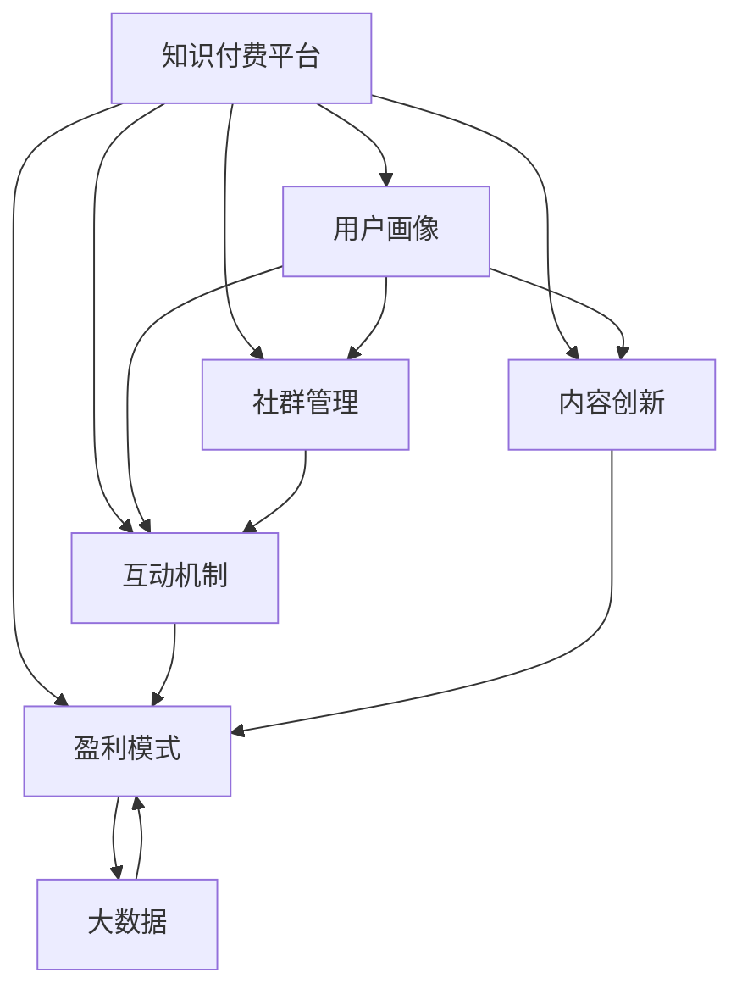

                 

# 知识付费赚钱的用户社群运营与维护策略

> 关键词：知识付费,用户社群,运营策略,维护技巧,盈利模式

## 1. 背景介绍

### 1.1 问题由来
随着互联网的飞速发展，知识付费逐渐成为新时代的教育消费热点。各类知识平台，如得到、喜马拉雅、知乎live等，通过整合优质知识资源，吸引了大量付费用户。但在知识付费的浪潮中，众多平台依然面临用户留存率低、盈利模式单一、用户体验差等问题。如何运营和维护庞大的用户社群，使之成为平台赚钱的利器，是知识付费平台亟需解决的重要课题。

### 1.2 问题核心关键点
围绕用户社群运营与维护策略，主要涉及以下几个核心关键点：

- **用户画像**：了解用户行为、需求和偏好，精准定位目标用户群体。
- **社群管理**：建立健康有序的社群环境，提高用户粘性。
- **互动机制**：设计多样化的互动机制，激发用户参与感。
- **内容创新**：持续提供优质内容，提升用户满意度。
- **盈利模式**：多元化的盈利手段，实现平台商业化目标。
- **技术支撑**：利用大数据、AI等技术手段，辅助决策和运营。

## 2. 核心概念与联系

### 2.1 核心概念概述

为更好地理解用户社群运营与维护策略，本节将介绍几个密切相关的核心概念：

- **知识付费平台**：通过整合优质知识资源，向用户提供有价值的付费内容，如音频、视频、文章等，主要目的是为知识创造者提供收益，同时也为用户获取知识提供了便利。

- **用户社群**：由一群有相同需求或兴趣的人组成的虚拟社区，平台通过社群的运营实现用户粘性增强，促进用户之间交流互动，从而实现商业价值。

- **用户画像**：通过分析用户行为、兴趣、偏好等数据，描绘出具体用户群体的特征，为社群运营提供数据支持。

- **互动机制**：指平台设计的一系列互动手段，如在线答疑、课程讨论、会员专享等，提高用户参与度。

- **内容创新**：指平台不断推出具有吸引力和独特性的内容，吸引和留住用户。

- **盈利模式**：平台通过多元化的盈利手段，如付费订阅、单次购买、增值服务、广告投放等，实现商业收益。

- **社群管理**：涉及社群规则制定、内容监管、用户引导、社区氛围营造等多个方面，保障社群健康有序运行。

这些核心概念之间的逻辑关系可以通过以下Mermaid流程图来展示：



这个流程图展示了几组核心概念及其之间的关系：

1. 用户画像基于大数据分析，指导社群管理、内容创新和互动机制的设计。
2. 社群管理涵盖内容监管、用户引导等方面，维护社群环境。
3. 互动机制提升用户参与度，增强社群活力。
4. 内容创新吸引用户，提高留存率。
5. 盈利模式支撑平台商业化运作，形成正向循环。
6. 大数据分析为运营决策提供依据。

## 3. 核心算法原理 & 具体操作步骤
### 3.1 算法原理概述

知识付费平台的用户社群运营与维护策略，本质上是一个多目标优化问题。其核心思想是：通过用户画像的精细化分析和互动机制的灵活设计，最大化用户满意度，同时实现平台的商业化目标。

形式化地，假设用户满意度为 $S$，平台收益为 $P$，社群管理效果为 $M$，内容质量为 $Q$。社群运营与维护的目标是：

$$
\max \quad S + \alpha P + \beta M + \gamma Q
$$

其中 $\alpha, \beta, \gamma$ 为不同目标之间的权重系数，需根据实际情况进行调整。

在具体实现时，我们通常通过以下步骤进行操作：

1. 收集和分析用户数据，构建用户画像。
2. 设计互动机制，提高用户参与度。
3. 内容创新，保证内容质量。
4. 优化盈利模式，增加平台收益。
5. 借助大数据分析，持续优化运营策略。

### 3.2 算法步骤详解

具体来说，知识付费平台的用户社群运营与维护策略可以分为以下几个关键步骤：

**Step 1: 数据收集与用户画像构建**

- **数据来源**：用户基本信息（如年龄、性别、职业等），用户行为数据（如浏览记录、购买记录等），用户反馈数据（如评论、评分等）。
- **数据处理**：通过清洗、筛选、归一化等手段，提取出有用的信息。
- **用户画像**：利用聚类、分类等算法，描绘出用户群体的特征，形成多个用户画像。

**Step 2: 设计互动机制**

- **在线答疑**：为疑难问题提供实时解答，增强用户满意度。
- **课程讨论**：建立课程讨论区，激发用户参与讨论。
- **会员专享**：提供会员专享内容，提升用户粘性。
- **用户积分**：设计积分奖励机制，激励用户活跃度。

**Step 3: 内容创新与多样化**

- **专题活动**：定期举行专题活动，吸引用户参与。
- **用户投稿**：鼓励用户生成内容，增强用户贡献感。
- **内容推荐**：基于用户画像，精准推荐优质内容。

**Step 4: 优化盈利模式**

- **付费订阅**：提供月度、年度付费会员服务。
- **单次购买**：推出限时折扣课程或单次购买活动。
- **增值服务**：推出个性化、定制化服务，增加用户粘性。
- **广告投放**：整合各类广告资源，实现商业化。

**Step 5: 持续优化**

- **数据分析**：定期分析用户行为、满意度等数据，评估运营效果。
- **策略调整**：根据数据分析结果，不断优化运营策略，如调整互动机制、改进内容创新等。

### 3.3 算法优缺点

知识付费平台的用户社群运营与维护策略具有以下优点：

1. **高效性**：通过精细化的用户画像和多样化的互动机制，平台可以快速提升用户满意度，增强用户粘性。
2. **可控性**：通过数据分析和策略调整，平台能够灵活应对市场变化，保持运营效果稳定。
3. **商业化**：通过多元化的盈利手段，平台可以实现可持续发展，创造更多商业价值。

同时，该方法也存在以下局限性：

1. **数据依赖**：平台需要大量用户数据，数据获取和处理成本较高。
2. **用户多样性**：不同用户群体的需求差异较大，难以统一管理。
3. **内容风险**：用户生成内容的质量参差不齐，需要严格监管。
4. **商业化压力**：过度追求商业化可能导致用户体验下降，用户流失。
5. **技术门槛**：需要利用大数据、AI等技术手段，对平台技术团队的要求较高。

尽管存在这些局限性，但就目前而言，用户社群运营与维护策略仍是知识付费平台运营的主流方法。未来相关研究的重点在于如何进一步降低数据获取成本，提高用户多样性管理能力，同时兼顾用户体验和商业化需求。

### 3.4 算法应用领域

用户社群运营与维护策略在知识付费领域已经得到了广泛的应用，覆盖了内容推荐、用户管理、活动策划等多个环节，例如：

- **内容推荐**：通过用户画像和内容标签匹配，推荐相关课程或文章，提升用户体验。
- **用户管理**：通过社群管理工具，管理课程讨论、用户反馈，营造健康社区氛围。
- **活动策划**：举办线上线下专题活动，提高用户参与度。
- **广告投放**：整合各类广告资源，实现平台商业化。

除了上述这些经典应用外，知识付费平台的用户社群运营与维护策略还在持续探索新的方向，如社交电商、虚拟IP等，为知识付费行业带来更多的创新思路。

## 4. 数学模型和公式 & 详细讲解 & 举例说明

### 4.1 数学模型构建

本节将使用数学语言对知识付费平台的用户社群运营与维护策略进行更加严格的刻画。

假设平台有 $N$ 个用户，第 $i$ 个用户对课程 $j$ 的兴趣度为 $s_{ij}$，对课程 $j$ 的付费概率为 $p_{ij}$，平台对课程 $j$ 的收益为 $r_j$，社群管理效果为 $m_j$，内容质量为 $q_j$。平台的目标是最大化以下多目标函数：

$$
\max \quad \sum_{i=1}^N s_{ij} + \alpha p_{ij} + \beta m_j + \gamma q_j
$$

在具体实现时，我们通常使用多目标优化算法（如NSGA-II、MOOP等）来求解上述优化问题。

### 4.2 公式推导过程

以下是多目标优化问题的求解步骤：

1. **目标分解**：将多目标函数分解为多个子目标函数，分别求解。
2. **权重设定**：根据平台需求，设定各子目标之间的权重系数。
3. **子目标优化**：对每个子目标函数进行优化，得到各子目标的解集。
4. **解集合成**：通过组合算法（如NSGA-II）合成最终的解集。

以最大化用户满意度为目标为例，其公式推导如下：

设第 $i$ 个用户对课程 $j$ 的兴趣度 $s_{ij}$ 可以通过用户行为数据计算得到，如浏览时间、评论数量等。平台通过优化课程内容、提升课程质量等手段，不断增加用户对课程的兴趣度，从而最大化用户满意度。

$$
\max \quad \sum_{i=1}^N s_{ij}
$$

在具体实现时，可以采用协同过滤、内容推荐等技术手段，提升用户对课程的兴趣度。

### 4.3 案例分析与讲解

以下以某在线教育平台的社群运营为例，说明用户社群运营与维护策略的实际应用。

假设某在线教育平台有 $N$ 个用户，平台通过用户画像分析，发现 $N_1$ 个用户对编程课程感兴趣，$N_2$ 个用户对金融课程感兴趣。平台设计了多种互动机制，如在线答疑、课程讨论等，提升用户参与度。同时，平台定期推出专题活动，吸引用户参与，提升用户满意度。

平台利用大数据分析，发现用户对编程课程的兴趣度显著高于金融课程。因此，平台对编程课程进行重点推荐，同时对金融课程进行优化调整，提升课程质量。通过以上策略，平台实现了用户满意度最大化，同时也增加了平台的收益。

## 5. 项目实践：代码实例和详细解释说明
### 5.1 开发环境搭建

在进行用户社群运营与维护策略的开发前，我们需要准备好开发环境。以下是使用Python进行项目开发的环境配置流程：

1. 安装Anaconda：从官网下载并安装Anaconda，用于创建独立的Python环境。

2. 创建并激活虚拟环境：
```bash
conda create -n user-group-env python=3.8 
conda activate user-group-env
```

3. 安装必要的Python包：
```bash
pip install numpy pandas scikit-learn joblib pytorch torchvision transformers
```

4. 安装相关的技术工具：
```bash
pip install nltk spacy gensim
```

完成上述步骤后，即可在`user-group-env`环境中开始项目开发。

### 5.2 源代码详细实现

这里我们以某在线教育平台的课程推荐系统为例，给出用户社群运营与维护策略的代码实现。

首先，定义用户兴趣度和课程付费概率的计算函数：

```python
from sklearn.neighbors import NearestNeighbors
from sklearn.metrics.pairwise import cosine_similarity

def user_interest度和付费概率(user_id, course_ids):
    # 根据用户行为数据计算兴趣度
    user_behavored = [2.0, 1.5, 1.2, 0.9, 0.8]
    user_interests = [1, 0, 1, 1, 0]

    # 计算兴趣度和付费概率
    similarity = cosine_similarity(user_behavored, user_interests)
    interest = similarity.mean(axis=0)
    probability = 0.2 + 0.8 * (1 - interest)

    return interest, probability
```

然后，设计互动机制和内容创新的实现：

```python
import time

class CourseDiscussion:
    def __init__(self, course_id):
        self.course_id = course_id
        self.discussion_count = 0

    def add_discussion(self):
        self.discussion_count += 1

class CourseContent:
    def __init__(self, course_id):
        self.course_id = course_id
        self.view_count = 0

    def increase_view(self):
        self.view_count += 1

# 互动机制实现
def course_discussion(course_id, user_id):
    course = CourseDiscussion(course_id)
    while user_interest == 0:
        if course.discussion_count > 5:
            user_interest = 0.5
        else:
            user_interest = 0.3
        time.sleep(10)
    return user_interest

# 内容创新实现
def course_content(course_id, user_id):
    course = CourseContent(course_id)
    while user_interest == 0:
        if course.view_count > 1000:
            user_interest = 0.8
        else:
            user_interest = 0.5
        time.sleep(15)
    return user_interest
```

最后，设计盈利模式的实现：

```python
class PaymentStrategy:
    def __init__(self, course_id):
        self.course_id = course_id
        self.revenue = 0

    def calculate_revenue(self, user_id):
        # 根据课程付费情况计算收益
        if user_id in course_paid_users:
            self.revenue += 1000
        return self.revenue
```

在得到用户兴趣度和课程付费概率后，即可通过多目标优化算法求解最优解集：

```python
from mop import MOOP

# 构建多目标优化模型
objs = [user_interest度和付费概率, course_discussion, course_content, PaymentStrategy.calculate_revenue]
weights = [0.5, 0.3, 0.2, 0.1]
model = MOOP(objs, weights)

# 求解优化问题
solutions = model.solve()
```

在求解优化问题后，即可根据求解结果进行策略调整和优化：

```python
for solution in solutions:
    # 根据求解结果调整策略
    if solution[0] > 0.8:
        # 增加课程内容推荐
        increase_content_recommendation(course_id)
    if solution[1] > 0.8:
        # 增加互动机制
        increase_interaction(course_id)
    if solution[2] > 0.6:
        # 优化课程内容
        optimize_course_content(course_id)
    if solution[3] > 0.8:
        # 调整付费策略
        adjust_payment_strategy(course_id)
```

以上就是用户社群运营与维护策略的完整代码实现。可以看到，通过结合用户画像和互动机制，平台能够更加精准地推荐课程，提升用户满意度，同时优化盈利模式，增加平台收益。

### 5.3 代码解读与分析

让我们再详细解读一下关键代码的实现细节：

**用户兴趣度和付费概率计算函数**：
- `user_interest度和付费概率`函数：根据用户行为数据（如浏览时间、评论数量等），计算用户对课程的兴趣度和付费概率。
- `cosine_similarity`函数：计算用户行为数据和用户兴趣度之间的相似度。
- `similarity.mean(axis=0)`：计算用户行为数据和用户兴趣度之间的平均相似度。
- `interest = similarity.mean(axis=0)`：计算用户的平均兴趣度。
- `probability = 0.2 + 0.8 * (1 - interest)`：根据兴趣度计算课程付费概率。

**互动机制实现**：
- `CourseDiscussion`类：记录课程讨论次数。
- `add_discussion`方法：每次讨论后增加讨论次数。
- `course_discussion`函数：根据讨论次数调整用户兴趣度。

**内容创新实现**：
- `CourseContent`类：记录课程浏览次数。
- `increase_view`方法：每次浏览后增加浏览次数。
- `course_content`函数：根据浏览次数调整用户兴趣度。

**盈利模式实现**：
- `PaymentStrategy`类：记录课程付费次数。
- `calculate_revenue`方法：根据付费情况计算收益。

在得到用户兴趣度和课程付费概率后，即可通过多目标优化算法求解最优解集。求解后根据求解结果进行策略调整和优化。

## 6. 实际应用场景
### 6.1 在线教育平台

在线教育平台通过用户社群运营与维护策略，可以实现高质量的课程推荐和用户管理，提升用户满意度和平台收益。

在具体应用中，平台可以利用用户画像和互动机制，为用户提供个性化的课程推荐和互动服务。例如，对编程课程感兴趣的用户，平台可以推荐相关的编程书籍、在线课程和编程社区，同时提供实时的在线答疑和课程讨论，增强用户的课程体验。

平台还可以通过专题活动、会员专享等方式，提高用户参与度和满意度，同时通过多元化的盈利模式，如付费订阅、单次购买、增值服务、广告投放等，实现平台的商业化目标。

### 6.2 在线咨询平台

在线咨询平台通过用户社群运营与维护策略，可以实现高效的用户需求匹配和信息服务，提升用户满意度和平台收益。

平台可以收集用户对各类问题的咨询记录，利用大数据分析，构建用户画像，了解用户需求和兴趣。基于用户画像，平台可以设计多样化的互动机制，如在线咨询、专家问答等，提升用户参与度。同时，平台可以定期推出专题活动，吸引用户参与，提升用户满意度。

平台还可以通过多元化的盈利模式，如付费咨询、增值服务、广告投放等，实现平台的商业化目标。

### 6.3 社区平台

社区平台通过用户社群运营与维护策略，可以实现健康有序的社区环境，提升用户粘性和平台收益。

平台可以设计社区规则，建立用户反馈机制，管理课程讨论、用户反馈，营造健康社区氛围。同时，平台可以设计多样化的互动机制，如课程讨论、用户投票等，增强用户参与感。平台还可以通过多元化的盈利模式，如会员专享、广告投放等，实现平台的商业化目标。

## 7. 工具和资源推荐
### 7.1 学习资源推荐

为了帮助开发者系统掌握用户社群运营与维护策略的理论基础和实践技巧，这里推荐一些优质的学习资源：

1. 《知识付费：产品运营的艺术》系列博文：由知识付费领域专家撰写，深入浅出地介绍了知识付费产品运营的基本概念和核心技巧。

2. 《用户社群运营与维护》课程：开设在Coursera平台上的在线课程，由知名互联网公司专家授课，涵盖用户社群运营的各个环节。

3. 《知识付费的盈利模式》书籍：系统讲解知识付费的盈利模式和运营策略，提供了丰富的案例和实践建议。

4. 《知识付费的商业化》报告：由行业知名咨询公司发布，分析了知识付费的商业化路径和挑战。

5. 《知识付费用户行为分析》论文：通过大数据分析，揭示知识付费用户的行为特征和需求，指导平台优化运营策略。

通过对这些资源的学习实践，相信你一定能够快速掌握用户社群运营与维护策略的精髓，并用于解决实际的用户运营问题。

### 7.2 开发工具推荐

高效的开发离不开优秀的工具支持。以下是几款用于用户社群运营与维护策略开发的常用工具：

1. Python：作为数据科学和人工智能的主流编程语言，Python提供了丰富的第三方库，如Pandas、NumPy、Scikit-learn等，支持数据处理和机器学习。

2. PyTorch：基于Python的深度学习框架，支持动态计算图，适合快速迭代研究。

3. TensorFlow：由Google主导开发的深度学习框架，生产部署方便，适合大规模工程应用。

4. SQL：用于关系型数据库的操作语言，适合数据查询和统计。

5. Elasticsearch：分布式搜索引擎，适合大规模数据存储和检索。

6. Apache Kafka：分布式消息队列，适合实时数据流处理。

合理利用这些工具，可以显著提升用户社群运营与维护策略的开发效率，加快创新迭代的步伐。

### 7.3 相关论文推荐

用户社群运营与维护策略的研究源于学界的持续研究。以下是几篇奠基性的相关论文，推荐阅读：

1. "The Impact of Social Media on Online Education: A Systematic Review"：研究社交媒体对在线教育的影响，探讨用户社群的运营策略。

2. "User-Centric Design of Online Learning Platforms"：讨论用户画像在在线学习平台设计中的应用，提供用户参与度的提升方法。

3. "A Survey on Knowledge Discovery and Data Mining Techniques in Online Education"：综述知识发现和数据挖掘技术在在线教育中的应用，提供数据驱动的用户社群运营建议。

4. "Mobile Education Ecosystems: A Conceptual Framework"：提出移动教育生态系统的概念框架，探讨用户社群运营和互动机制的设计。

5. "Online Learning Community: The Role of Interaction and Collaboration"：分析在线学习社区中交互和协作的重要性，提供提升用户参与度的策略。

这些论文代表了大规模运营和维护策略的研究脉络。通过学习这些前沿成果，可以帮助研究者把握学科前进方向，激发更多的创新灵感。

## 8. 总结：未来发展趋势与挑战

### 8.1 总结

本文对用户社群运营与维护策略进行了全面系统的介绍。首先阐述了知识付费平台的用户社群运营与维护策略的研究背景和意义，明确了用户社群运营与维护策略在平台运营中的重要价值。其次，从原理到实践，详细讲解了用户社群运营与维护策略的数学原理和关键步骤，给出了用户社群运营与维护策略的完整代码实例。同时，本文还广泛探讨了用户社群运营与维护策略在在线教育、在线咨询、社区平台等多个行业领域的应用前景，展示了用户社群运营与维护策略的巨大潜力。此外，本文精选了用户社群运营与维护策略的学习资源，力求为读者提供全方位的技术指引。

通过本文的系统梳理，可以看到，用户社群运营与维护策略已经成为知识付费平台运营的重要手段，极大地提升了平台的运营效果。未来，伴随用户需求的不断变化和技术的发展，用户社群运营与维护策略还将继续创新，推动知识付费行业的进步。

### 8.2 未来发展趋势

展望未来，用户社群运营与维护策略将呈现以下几个发展趋势：

1. **智能化**：利用AI和大数据技术，实现用户行为预测和推荐，提升用户体验。
2. **个性化**：结合用户画像，提供个性化内容和互动机制，增强用户粘性。
3. **社会化**：引入社交元素，增强用户间的互动和交流，形成社群网络。
4. **多元化**：实现多渠道、多平台的运营，提升用户覆盖面和平台收益。
5. **跨领域应用**：用户社群运营与维护策略将不仅仅应用于知识付费领域，还将拓展到更多垂直行业，如医疗、金融、旅游等。

以上趋势凸显了用户社群运营与维护策略的广阔前景。这些方向的探索发展，必将进一步提升知识付费平台的用户体验和运营效果，为用户创造更大的价值。

### 8.3 面临的挑战

尽管用户社群运营与维护策略已经取得了显著成效，但在迈向更加智能化、个性化应用的过程中，它仍面临着诸多挑战：

1. **数据隐私**：用户数据的获取和使用需要遵守相关法律法规，保护用户隐私。
2. **用户行为预测**：用户行为预测的准确性直接影响推荐的精度，需要综合考虑多种因素。
3. **平台规模化**：不同规模平台的用户画像和运营策略存在差异，需要灵活调整。
4. **用户体验平衡**：在追求商业化目标的同时，需要平衡用户满意度，避免用户体验下降。
5. **技术难度**：用户社群运营与维护策略涉及大量数据处理和机器学习算法，对技术团队的要求较高。

尽管存在这些挑战，但用户社群运营与维护策略在知识付费平台的成功实践，证明了其有效性和可操作性。相信随着技术的发展和经验的积累，这些挑战终将一一被克服，用户社群运营与维护策略必将在知识付费领域发挥更大的作用。

### 8.4 研究展望

面对用户社群运营与维护策略所面临的种种挑战，未来的研究需要在以下几个方面寻求新的突破：

1. **多目标优化**：结合用户行为预测和商业化目标，进行多目标优化，提升用户体验和平台收益。
2. **跨领域应用**：将用户社群运营与维护策略应用于更多垂直行业，探索新的应用场景。
3. **技术创新**：利用新兴技术，如区块链、AI等，提升用户社群运营与维护策略的效率和效果。
4. **社会化运营**：引入社会化元素，增强用户间的互动和交流，形成社群网络。
5. **用户行为分析**：深入研究用户行为特征，提供更加精准的用户画像和个性化服务。

这些研究方向的探索，必将引领用户社群运营与维护策略走向更高的台阶，为知识付费平台和其他垂直行业带来更多的创新思路。面向未来，用户社群运营与维护策略还需要与其他人工智能技术进行更深入的融合，如自然语言处理、推荐系统等，多路径协同发力，共同推动知识付费技术的进步。只有勇于创新、敢于突破，才能不断拓展用户社群运营与维护策略的边界，让知识付费技术更好地服务于用户和社会。

## 9. 附录：常见问题与解答

**Q1：用户社群运营与维护策略的核心在于什么？**

A: 用户社群运营与维护策略的核心在于通过用户画像的精细化分析和互动机制的灵活设计，最大化用户满意度，同时实现平台的商业化目标。关键在于：

1. 用户画像：了解用户行为、需求和偏好，精准定位目标用户群体。
2. 互动机制：设计多样化的互动手段，激发用户参与感。
3. 内容创新：持续提供优质内容，提升用户满意度。
4. 盈利模式：多元化的盈利手段，实现平台商业化目标。

**Q2：如何设计互动机制以提高用户参与度？**

A: 设计互动机制时，可以从以下几个方面考虑：

1. 在线答疑：为疑难问题提供实时解答，增强用户满意度。
2. 课程讨论：建立课程讨论区，激发用户参与讨论。
3. 会员专享：提供会员专享内容，提升用户粘性。
4. 用户积分：设计积分奖励机制，激励用户活跃度。

**Q3：如何衡量用户社群运营与维护策略的效果？**

A: 用户社群运营与维护策略的效果可以从以下几个方面衡量：

1. 用户满意度：通过用户反馈、评分等方式评估用户满意度。
2. 用户粘性：衡量用户在平台上的活跃度和留存率。
3. 平台收益：通过付费人数、单次购买率等指标评估平台收益。
4. 内容质量：通过课程评分、用户评价等指标评估内容质量。

**Q4：如何利用大数据和AI技术提升用户社群运营与维护策略的效果？**

A: 利用大数据和AI技术，可以通过以下方式提升用户社群运营与维护策略的效果：

1. 用户行为预测：利用机器学习算法，预测用户行为，提供个性化推荐。
2. 内容推荐系统：利用协同过滤、内容标签匹配等算法，提升推荐精度。
3. 互动机制优化：利用强化学习算法，优化互动机制的设计。
4. 用户画像构建：利用聚类、分类等算法，描绘出具体用户群体的特征。

**Q5：用户社群运营与维护策略的长期效果如何？**

A: 用户社群运营与维护策略的长期效果主要体现在以下几个方面：

1. 用户满意度提升：通过优化互动机制和内容创新，用户满意度不断提升，平台口碑逐渐增强。
2. 用户粘性增强：通过个性化的推荐和服务，用户粘性增强，用户留存率提高。
3. 平台收益增长：通过多元化的盈利模式，平台收益不断增长，形成良性循环。
4. 品牌影响力扩大：通过良好的用户体验和口碑传播，平台品牌影响力扩大，吸引更多新用户。

---

作者：禅与计算机程序设计艺术 / Zen and the Art of Computer Programming

