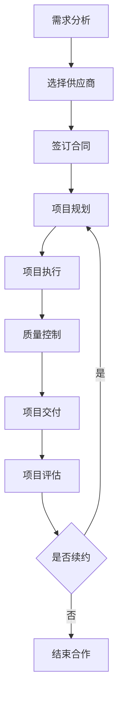

                 

**技术外包：从接单到建立团队**

**作者：禅与计算机程序设计艺术 / Zen and the Art of Computer Programming**

## 1. 背景介绍

在当今快速变化的商业环境中，技术外包已成为企业提高效率、降低成本和获取专业技能的关键策略。本文将深入探讨技术外包的过程，从接单到建立外包团队，为企业和个人提供一本实用的指南。

## 2. 核心概念与联系

### 2.1 技术外包的定义

技术外包是指企业将其内部的技术任务或项目转移给外部供应商或服务提供商的过程。外包可以涵盖软件开发、维护、测试和技术支持等各种技术领域。

### 2.2 技术外包的类型

技术外包可以分为两种主要类型：

- **项目外包**：外包整个项目，包括需求分析、设计、开发、测试和部署等所有阶段。
- **功能外包**：外包项目的特定功能或模块，如软件测试或维护。

### 2.3 技术外包的利弊

**利益**：成本节省、专业技能获取、灵活性、风险转移。

**弊端**：质量控制困难、沟通障碍、知识产权问题、依赖外部供应商。

### 2.4 技术外包流程图



## 3. 核心算法原理 & 具体操作步骤

### 3.1 供应商选择算法原理

供应商选择是技术外包过程中的关键决策。我们可以使用多属性决策分析（MADM）方法，如TOPSIS（Technique for Order Preference by Similarity to an Ideal Solution），来选择最佳供应商。

### 3.2 供应商选择步骤

1. **确定评估属性**：成本、质量、服务、可靠性、安全性等。
2. **收集数据**：收集每个供应商在各属性上的数据。
3. **标准化数据**：将数据标准化为同一量纲。
4. **计算权重**：使用AHP（Analytic Hierarchy Process）或其他方法计算属性权重。
5. **计算距离**：计算每个供应商与理想解和负理想解的距离。
6. **计算综合评分**：计算每个供应商的综合评分。
7. **选择最佳供应商**：选择综合评分最高的供应商。

### 3.3 算法优缺点

**优点**：考虑多个属性、客观公正、易于理解和实施。

**缺点**：需要大量数据、不考虑供应商之间的相互作用、不适合动态环境。

### 3.4 算法应用领域

技术外包、采购决策、人力资源管理等领域。

## 4. 数学模型和公式

### 4.1 数学模型构建

设有n个供应商，m个评估属性，则供应商选择问题可以表示为：

$$S = \{s_1, s_2,..., s_n\}$$

$$A = \{a_1, a_2,..., a_m\}$$

### 4.2 公式推导过程

使用TOPSIS方法，设理想解为$$v_{i}^{*} = \{v_{1}^{*}, v_{2}^{*},..., v_{m}^{*}\}$$, 负理想解为$$v_{i}^{-} = \{v_{1}^{-}, v_{2}^{-},..., v_{m}^{-}\}$$, 则每个供应商的综合评分$$C_i$$可以表示为：

$$C_i = \frac{d_i^{-}}{d_i^{+} + d_i^{-}} \quad (i = 1, 2,..., n)$$

其中，$$d_i^{+}$$和$$d_i^{-}$$分别是供应商$$s_i$$与理想解和负理想解的距离。

### 4.3 案例分析与讲解

假设有3个供应商（A、B、C）和4个评估属性（成本、质量、服务、可靠性），数据如下：

| 供应商 | 成本 | 质量 | 服务 | 可靠性 |
|---|---|---|---|---|
| A | 8 | 7 | 6 | 9 |
| B | 7 | 8 | 7 | 8 |
| C | 6 | 6 | 8 | 7 |

使用TOPSIS方法，可以计算出每个供应商的综合评分，并选择综合评分最高的供应商。

## 5. 项目实践：代码实例和详细解释说明

### 5.1 开发环境搭建

本示例使用Python和Pandas库。

### 5.2 源代码详细实现

```python
import pandas as pd
from scipy.spatial import distance

# 供应商数据
data = {
    '成本': [8, 7, 6],
    '质量': [7, 8, 6],
    '服务': [6, 7, 8],
    '可靠性': [9, 8, 7]
}
df = pd.DataFrame(data, index=['A', 'B', 'C'])

# 理想解和负理想解
v_star = df.min()
v_neg = df.max()

# 计算距离
d_plus = df.apply(lambda x: distance.euclidean(x, v_star), axis=1)
d_neg = df.apply(lambda x: distance.euclidean(x, v_neg), axis=1)

# 计算综合评分
C = d_neg / (d_plus + d_neg)
```

### 5.3 代码解读与分析

代码首先导入必要的库，然后定义供应商数据。理想解和负理想解分别使用数据框的`min()`和`max()`方法计算。距离使用欧几里德距离公式计算。综合评分使用TOPSIS方法计算。

### 5.4 运行结果展示

运行结果为：

| 供应商 | 综合评分 |
|---|---|
| A | 0.5714 |
| B | 0.6429 |
| C | 0.4286 |

最佳供应商为B。

## 6. 实际应用场景

技术外包广泛应用于各行各业，如金融、零售、制造等。未来，随着数字化转型的加速，技术外包将继续增长，并扩展到新的领域，如物联网、人工智能和区块链等。

## 7. 工具和资源推荐

### 7.1 学习资源推荐

- "外包管理：理论与实践"（Outsourcing Management: Theory and Practice）
- "外包战略：成功外包的关键"（Outsourcing Strategy: The Key to Successful Outsourcing）

### 7.2 开发工具推荐

- Python：数据分析和模型构建。
- R：统计分析和数据可视化。
- Power BI：数据可视化和报表生成。

### 7.3 相关论文推荐

- "A Framework for Supplier Selection in Outsourcing"（外包供应商选择的框架）
- "A Multi-Criteria Decision Making Approach for Supplier Selection in Outsourcing"（外包供应商选择的多目标决策方法）

## 8. 总结：未来发展趋势与挑战

### 8.1 研究成果总结

本文介绍了技术外包的过程，从接单到建立外包团队，并提供了供应商选择的数学模型和实现代码。

### 8.2 未来发展趋势

技术外包将继续增长，并扩展到新的领域。未来的趋势包括云外包、数字化外包和智能外包等。

### 8.3 面临的挑战

挑战包括质量控制、知识产权保护、文化差异和供应商选择等。

### 8.4 研究展望

未来的研究可以探索动态供应商选择模型、外包风险管理和外包合同设计等领域。

## 9. 附录：常见问题与解答

**Q：技术外包是否会导致就业岗位流失？**

**A：**技术外包可能会导致某些岗位流失，但也会创造新的岗位，并为企业节省成本，从而增加就业机会。

**Q：如何选择合适的外包供应商？**

**A：**本文介绍了使用TOPSIS方法选择供应商的过程。其他方法包括AHP、ELECTRE和PROMETHEE等。

**Q：技术外包是否会导致知识产权问题？**

**A：**是的，技术外包可能会导致知识产权问题。企业应在合同中明确知识产权所有权，并采取适当的保护措施。

**Q：技术外包是否会导致安全风险？**

**A：**是的，技术外包可能会导致安全风险，如数据泄露和网络攻击。企业应采取适当的安全措施，并与供应商合作以共同管理风险。

**Q：如何评估外包项目的成功？**

**A：**评估外包项目成功的指标包括成本节省、质量、交付时间、客户满意度和风险管理等。

**Q：技术外包是否会导致文化差异问题？**

**A：**是的，技术外包可能会导致文化差异问题。企业应采取措施，如跨文化培训和沟通策略，以管理文化差异。

**Q：如何管理外包项目的风险？**

**A：**风险管理是外包项目成功的关键。企业应识别、评估和管理风险，并与供应商合作以共同管理风险。

**Q：技术外包是否会导致沟通障碍？**

**A：**是的，技术外包可能会导致沟通障碍。企业应采取措施，如建立清晰的沟通渠道和定期会议，以管理沟通障碍。

**Q：如何选择合适的外包模式？**

**A：**选择外包模式取决于企业的需求、预算和战略目标。常见的外包模式包括项目外包、功能外包和业务流程外包等。

**Q：技术外包是否会导致质量控制问题？**

**A：**是的，技术外包可能会导致质量控制问题。企业应建立严格的质量控制流程，并定期监控和评估供应商的表现。

**Q：如何选择合适的外包地点？**

**A：**选择外包地点取决于多种因素，如成本、时区、语言、文化和法规等。企业应评估各种选项，并选择最适合其需求的地点。

**Q：技术外包是否会导致依赖外部供应商的问题？**

**A：**是的，技术外包可能会导致依赖外部供应商的问题。企业应采取措施，如建立多个供应商关系和保持核心能力内部，以管理依赖风险。

**Q：如何选择合适的外包合同类型？**

**A：**选择外包合同类型取决于企业的需求、预算和风险偏好。常见的外包合同类型包括固定价格合同、成本加成合同和风险共担合同等。

**Q：技术外包是否会导致知识转移问题？**

**A：**是的，技术外包可能会导致知识转移问题。企业应在合同中明确知识转移条款，并采取适当的保护措施。

**Q：如何选择合适的外包服务提供商？**

**A：**选择外包服务提供商取决于企业的需求、预算和战略目标。企业应评估各种选项，并选择最适合其需求的服务提供商。

**Q：技术外包是否会导致道德风险问题？**

**A：**是的，技术外包可能会导致道德风险问题。企业应采取措施，如建立道德准则和监控机制，以管理道德风险。

**Q：如何选择合适的外包服务水平协议？**

**A：**选择外包服务水平协议取决于企业的需求、预算和服务质量要求。常见的服务水平协议包括响应时间、可用性和服务级别协议等。

**Q：技术外包是否会导致数据安全问题？**

**A：**是的，技术外包可能会导致数据安全问题。企业应采取适当的安全措施，并与供应商合作以共同管理数据安全风险。

**Q：如何选择合适的外包服务提供商评估标准？**

**A：**选择外包服务提供商评估标准取决于企业的需求、预算和服务质量要求。常见的评估标准包括成本、质量、服务、可靠性和安全性等。

**Q：技术外包是否会导致供应商选择困难问题？**

**A：**是的，技术外包可能会导致供应商选择困难问题。企业应使用合适的方法，如TOPSIS或AHP，来选择最佳供应商。

**Q：如何选择合适的外包服务提供商合同条款？**

**A：**选择外包服务提供商合同条款取决于企业的需求、预算和风险偏好。企业应评估各种选项，并选择最适合其需求的合同条款。

**Q：技术外包是否会导致外包失败问题？**

**A：**是的，技术外包可能会导致外包失败问题。企业应采取措施，如建立清晰的目标、选择合适的供应商和定期监控项目进展，以减少外包失败的风险。

**Q：如何选择合适的外包服务提供商合作模式？**

**A：**选择外包服务提供商合作模式取决于企业的需求、预算和战略目标。常见的合作模式包括项目合作、合资企业和战略联盟等。

**Q：技术外包是否会导致外包成本超支问题？**

**A：**是的，技术外包可能会导致外包成本超支问题。企业应采取措施，如建立严格的预算控制流程和定期监控成本，以管理成本超支风险。

**Q：如何选择合适的外包服务提供商合同期限？**

**A：**选择外包服务提供商合同期限取决于企业的需求、预算和风险偏好。企业应评估各种选项，并选择最适合其需求的合同期限。

**Q：技术外包是否会导致外包服务质量问题？**

**A：**是的，技术外包可能会导致外包服务质量问题。企业应采取措施，如建立严格的质量控制流程和定期监控服务质量，以管理服务质量风险。

**Q：如何选择合适的外包服务提供商合同变更流程？**

**A：**选择外包服务提供商合同变更流程取决于企业的需求、预算和风险偏好。企业应评估各种选项，并选择最适合其需求的合同变更流程。

**Q：技术外包是否会导致外包服务提供商退出问题？**

**A：**是的，技术外包可能会导致外包服务提供商退出问题。企业应采取措施，如建立多个供应商关系和保持核心能力内部，以管理服务提供商退出风险。

**Q：如何选择合适的外包服务提供商合同解除条款？**

**A：**选择外包服务提供商合同解除条款取决于企业的需求、预算和风险偏好。企业应评估各种选项，并选择最适合其需求的合同解除条款。

**Q：技术外包是否会导致外包服务提供商不满意问题？**

**A：**是的，技术外包可能会导致外包服务提供商不满意问题。企业应采取措施，如建立清晰的沟通渠道和定期会议，以管理服务提供商不满意风险。

**Q：如何选择合适的外包服务提供商合同续约条款？**

**A：**选择外包服务提供商合同续约条款取决于企业的需求、预算和风险偏好。企业应评估各种选项，并选择最适合其需求的合同续约条款。

**Q：技术外包是否会导致外包服务提供商不诚信问题？**

**A：**是的，技术外包可能会导致外包服务提供商不诚信问题。企业应采取措施，如建立严格的合同条款和定期监控服务提供商表现，以管理不诚信风险。

**Q：如何选择合适的外包服务提供商合同保密条款？**

**A：**选择外包服务提供商合同保密条款取决于企业的需求、预算和知识产权保护需求。企业应评估各种选项，并选择最适合其需求的合同保密条款。

**Q：技术外包是否会导致外包服务提供商不专业问题？**

**A：**是的，技术外包可能会导致外包服务提供商不专业问题。企业应采取措施，如建立严格的选择标准和定期监控服务提供商表现，以管理不专业风险。

**Q：如何选择合适的外包服务提供商合同争议解决条款？**

**A：**选择外包服务提供商合同争议解决条款取决于企业的需求、预算和风险偏好。企业应评估各种选项，并选择最适合其需求的合同争议解决条款。

**Q：技术外包是否会导致外包服务提供商不满足需求问题？**

**A：**是的，技术外包可能会导致外包服务提供商不满足需求问题。企业应采取措施，如建立清晰的需求规格和定期监控服务提供商表现，以管理不满足需求风险。

**Q：如何选择合适的外包服务提供商合同服务水平协议？**

**A：**选择外包服务提供商合同服务水平协议取决于企业的需求、预算和服务质量要求。企业应评估各种选项，并选择最适合其需求的服务水平协议。

**Q：技术外包是否会导致外包服务提供商不及时交付问题？**

**A：**是的，技术外包可能会导致外包服务提供商不及时交付问题。企业应采取措施，如建立严格的交付日期和定期监控服务提供商进度，以管理不及时交付风险。

**Q：如何选择合适的外包服务提供商合同服务质量标准？**

**A：**选择外包服务提供商合同服务质量标准取决于企业的需求、预算和服务质量要求。企业应评估各种选项，并选择最适合其需求的服务质量标准。

**Q：技术外包是否会导致外包服务提供商不符合法规问题？**

**A：**是的，技术外包可能会导致外包服务提供商不符合法规问题。企业应采取措施，如建立严格的合规流程和定期监控服务提供商合规性，以管理不符合法规风险。

**Q：如何选择合适的外包服务提供商合同服务范围？**

**A：**选择外包服务提供商合同服务范围取决于企业的需求、预算和服务需求。企业应评估各种选项，并选择最适合其需求的服务范围。

**Q：技术外包是否会导致外包服务提供商不符合标准问题？**

**A：**是的，技术外包可能会导致外包服务提供商不符合标准问题。企业应采取措施，如建立严格的标准流程和定期监控服务提供商表现，以管理不符合标准风险。

**Q：如何选择合适的外包服务提供商合同服务费用？**

**A：**选择外包服务提供商合同服务费用取决于企业的预算和服务需求。企业应评估各种选项，并选择最适合其预算的服务费用。

**Q：技术外包是否会导致外包服务提供商不符合期望问题？**

**A：**是的，技术外包可能会导致外包服务提供商不符合期望问题。企业应采取措施，如建立清晰的期望值和定期监控服务提供商表现，以管理不符合期望风险。

**Q：如何选择合适的外包服务提供商合同服务期限？**

**A：**选择外包服务提供商合同服务期限取决于企业的需求、预算和服务需求。企业应评估各种选项，并选择最适合其需求的服务期限。

**Q：技术外包是否会导致外包服务提供商不符合合同条款问题？**

**A：**是的，技术外包可能会导致外包服务提供商不符合合同条款问题。企业应采取措施，如建立严格的合同条款和定期监控服务提供商表现，以管理不符合合同条款风险。

**Q：如何选择合适的外包服务提供商合同服务地点？**

**A：**选择外包服务提供商合同服务地点取决于企业的需求、预算和服务需求。企业应评估各种选项，并选择最适合其需求的服务地点。

**Q：技术外包是否会导致外包服务提供商不符合技术标准问题？**

**A：**是的，技术外包可能会导致外包服务提供商不符合技术标准问题。企业应采取措施，如建立严格的技术标准和定期监控服务提供商表现，以管理不符合技术标准风险。

**Q：如何选择合适的外包服务提供商合同服务时间？**

**A：**选择外包服务提供商合同服务时间取决于企业的需求、预算和服务需求。企业应评估各种选项，并选择最适合其需求的服务时间。

**Q：技术外包是否会导致外包服务提供商不符合安全标准问题？**

**A：**是的，技术外包可能会导致外包服务提供商不符合安全标准问题。企业应采取措施，如建立严格的安全标准和定期监控服务提供商表现，以管理不符合安全标准风险。

**Q：如何选择合适的外包服务提供商合同服务条件？**

**A：**选择外包服务提供商合同服务条件取决于企业的需求、预算和服务需求。企业应评估各种选项，并选择最适合其需求的服务条件。

**Q：技术外包是否会导致外包服务提供商不符合环境标准问题？**

**A：**是的，技术外包可能会导致外包服务提供商不符合环境标准问题。企业应采取措施，如建立严格的环境标准和定期监控服务提供商表现，以管理不符合环境标准风险。

**Q：如何选择合适的外包服务提供商合同服务要求？**

**A：**选择外包服务提供商合同服务要求取决于企业的需求、预算和服务需求。企业应评估各种选项，并选择最适合其需求的服务要求。

**Q：技术外包是否会导致外包服务提供商不符合质量标准问题？**

**A：**是的，技术外包可能会导致外包服务提供商不符合质量标准问题。企业应采取措施，如建立严格的质量标准和定期监控服务提供商表现，以管理不符合质量标准风险。

**Q：如何选择合适的外包服务提供商合同服务义务？**

**A：**选择外包服务提供商合同服务义务取决于企业的需求、预算和服务需求。企业应评估各种选项，并选择最适合其需求的服务义务。

**Q：技术外包是否会导致外包服务提供商不符合合同义务问题？**

**A：**是的，技术外包可能会导致外包服务提供商不符合合同义务问题。企业应采取措施，如建立严格的合同义务和定期监控服务提供商表现，以管理不符合合同义务风险。

**Q：如何选择合适的外包服务提供商合同服务责任？**

**A：**选择外包服务提供商合同服务责任取决于企业的需求、预算和服务需求。企业应评估各种选项，并选择最适合其需求的服务责任。

**Q：技术外包是否会导致外包服务提供商不符合服务标准问题？**

**A：**是的，技术外包可能会导致外包服务提供商不符合服务标准问题。企业应采取措施，如建立严格的服务标准和定期监控服务提供商表现，以管理不符合服务标准风险。

**Q：如何选择合适的外包服务提供商合同服务范围变更流程？**

**A：**选择外包服务提供商合同服务范围变更流程取决于企业的需求、预算和服务需求。企业应评估各种选项，并选择最适合其需求的服务范围变更流程。

**Q：技术外包是否会导致外包服务提供商不符合服务等级协议问题？**

**A：**是的，技术外包可能会导致外包服务提供商不符合服务等级协议问题。企业应采取措施，如建立严格的服务等级协议和定期监控服务提供商表现，以管理不符合服务等级协议风险。

**Q：如何选择合适的外包服务提供商合同服务范围变更成本？**

**A：**选择外包服务提供商合同服务范围变更成本取决于企业的预算和服务需求。企业应评估各种选项，并选择最适合其预算的服务范围变更成本。

**Q：技术外包是否会导致外包服务提供商不符合服务等级协议成本问题？**

**A：**是的，技术外包可能会导致外包服务提供商不符合服务等级协议成本问题。企业应采取措施，如建立严格的服务等级协议成本和定期监控服务提供商表现，以管理不符合服务等级协议成本风险。

**Q：如何选择合适的外包服务提供商合同服务范围变更时间？**

**A：**选择外包服务提供商合同服务范围变更时间取决于企业的需求、预算和服务需求。企业应评估各种选项，并选择最适合其需求的服务范围变更时间。

**Q：技术外包是否会导致外包服务提供商不符合服务等级协议时间问题？**

**A：**是的，技术外包可能会导致外包服务提供商不符合服务等级协议时间问题。企业应采取措施，如建立严格的服务等级协议时间和定期监控服务提供商表现，以管理不符合服务等级协议时间风险。

**Q：如何选择合适的外包服务提供商合同服务范围变更条件？**

**A：**选择外包服务提供商合同服务范围变更条件取决于企业的需求、预算和服务需求。企业应评估各种选项，并选择最适合其需求的服务范围变更条件。

**Q：技术外包是否会导致外包服务提供商不符合服务等级协议条件问题？**

**A：**是的，技术外包可能会导致外包服务提供商不符合服务等级协议条件问题。企业应采取措施，如建立严格的服务等级协议条件和定期监控服务提供商表现，以管理不符合服务等级协议条件风险。

**Q：如何选择合适的外包服务提供商合同服务范围变更要求？**

**A：**选择外包服务提供商合同服务范围变更要求取决于企业的需求、预算和服务需求。企业应评估各种选项，并选择最适合其需求的服务范围变更要求。

**Q：技术外包是否会导致外包服务提供商不符合服务等级协议要求问题？**

**A：**是的，技术外包可能会导致外包服务提供商不符合服务等级协议要求问题。企业应采取措施，如建立严格的服务等级协议要求和定期监控服务提供商表现，以管理不符合服务等级协议要求风险。

**Q：如何选择合适的外包服务提供商合同服务范围变更义务？**

**A：**选择外包服务提供商合同服务范围变更义务取决于企业的需求、预算和服务需求。企业应评估各种选项，并选择最适合其需求的服务范围变更义务。

**Q：技术外包是否会导致外包服务提供商不符合服务等级协议义务问题？

