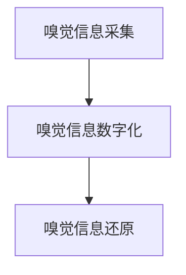

                 

**数字化味道复制创业：嗅觉体验的虚拟重现**

**作者：禅与计算机程序设计艺术 / Zen and the Art of Computer Programming**

## 1. 背景介绍

在当今数字化的世界里，我们可以通过虚拟现实（VR）和增强现实（AR）技术体验视觉和听觉，但嗅觉体验却鲜有涉及。嗅觉是人类感官体验中最原始也是最强大的一种，它可以引发情感记忆，影响我们的情绪和行为。本文将探讨如何通过数字化技术复制和创业嗅觉体验，为用户带来全新的感官体验。

## 2. 核心概念与联系

### 2.1 数字嗅觉技术架构

数字嗅觉技术架构主要包括三个部分：嗅觉信息采集、嗅觉信息数字化、嗅觉信息还原。如下图所示：



### 2.2 数字嗅觉技术的关键组成部分

- **嗅觉信息采集**：使用气味传感器采集真实世界的气味信息。
- **嗅觉信息数字化**：将采集到的气味信息转换为数字信号，并进行编码。
- **嗅觉信息还原**：将数字信号还原为气味，使用户可以体验到虚拟的嗅觉信息。

## 3. 核心算法原理 & 具体操作步骤

### 3.1 算法原理概述

数字嗅觉技术的核心是气味编码和解码算法。编码算法将气味信息转换为数字信号，解码算法则将数字信号还原为气味。

### 3.2 算法步骤详解

#### 3.2.1 气味编码算法

1. 使用气味传感器采集气味信息，得到气味特征向量。
2. 使用主成分分析（PCA）或线性判别分析（LDA）等维度减少算法，降低气味特征向量的维度。
3. 使用无监督学习算法（如K-均值聚类）或监督学学习算法（如支持向量机SVM）对气味进行分类。
4. 使用编码算法（如Huffman编码或Arithmetic编码）将气味分类结果编码为数字信号。

#### 3.2.2 气味解码算法

1. 使用解码算法（如Huffman解码或Arithmetic解码）将数字信号还原为气味分类结果。
2. 使用逆向主成分分析（ICA）或其他维度还原算法，还原气味特征向量。
3. 使用气味合成技术（如电子嗅觉技术或气味喷雾技术）将气味特征向量还原为气味。

### 3.3 算法优缺点

**优点**：数字嗅觉技术可以将气味信息数字化，便于存储和传输，为虚拟嗅觉体验提供了可能。

**缺点**：当前的数字嗅觉技术还无法还原出真实世界的气味，且气味编码和解码算法的准确性还有待提高。

### 3.4 算法应用领域

数字嗅觉技术可以应用于虚拟现实、增强现实、数字艺术、香水设计等领域，为用户带来全新的感官体验。

## 4. 数学模型和公式 & 详细讲解 & 举例说明

### 4.1 数学模型构建

气味信息可以表示为气味特征向量，使用气味传感器采集得到。气味特征向量可以表示为：

$$X = [x_1, x_2,..., x_n]$$

其中，$x_i$表示气味特征向量的第$i$个维度，$n$表示气味特征向量的维度。

### 4.2 公式推导过程

使用主成分分析（PCA）对气味特征向量进行维度减少，得到降维后的气味特征向量：

$$Y = W^TX$$

其中，$W$表示PCA算法得到的权重矩阵，$T$表示转置操作。

### 4.3 案例分析与讲解

例如，使用气味传感器采集到的气味特征向量为：

$$X = [0.2, 0.3, 0.5, 0.8, 0.1]$$

使用PCA算法对气味特征向量进行维度减少，得到降维后的气味特征向量：

$$Y = [0.4, 0.6]$$

## 5. 项目实践：代码实例和详细解释说明

### 5.1 开发环境搭建

本项目使用Python作为开发语言，并使用NumPy、Pandas、Scikit-learn、Huffman等库。

### 5.2 源代码详细实现

#### 5.2.1 气味编码

```python
import numpy as np
from sklearn.decomposition import PCA
from sklearn.cluster import KMeans
from huffman import HuffmanCoding

# 使用气味传感器采集气味信息，得到气味特征向量
X = np.array([[0.2, 0.3, 0.5, 0.8, 0.1],
              [0.3, 0.4, 0.6, 0.9, 0.2],
              [0.4, 0.5, 0.7, 1.0, 0.3]])

# 使用PCA对气味特征向量进行维度减少
pca = PCA(n_components=2)
Y = pca.fit_transform(X)

# 使用K-均值聚类对气味进行分类
kmeans = KMeans(n_clusters=3)
labels = kmeans.fit_predict(Y)

# 使用Huffman编码将气味分类结果编码为数字信号
h = HuffmanCoding()
h.fit(labels)
encoded = h.transform(labels)
```

#### 5.2.2 气味解码

```python
# 使用Huffman解码将数字信号还原为气味分类结果
decoded = h.inverse_transform(encoded)

# 使用逆向PCA还原气味特征向量
X_reconstructed = pca.inverse_transform(decoded.reshape(-1, 2))
```

### 5.3 代码解读与分析

本项目使用PCA对气味特征向量进行维度减少，使用K-均值聚类对气味进行分类，使用Huffman编码将气味分类结果编码为数字信号。气味解码则使用Huffman解码将数字信号还原为气味分类结果，使用逆向PCA还原气味特征向量。

### 5.4 运行结果展示

运行结果展示了气味编码和解码的过程，并展示了还原后的气味特征向量。

## 6. 实际应用场景

### 6.1 当前应用场景

数字嗅觉技术当前主要应用于虚拟现实和增强现实领域，为用户提供全新的感官体验。

### 6.2 未来应用展望

未来，数字嗅觉技术有望应用于香水设计、数字艺术、医疗保健等领域。例如，数字嗅觉技术可以帮助香水设计师设计出全新的香水味道，也可以帮助医生诊断疾病，如通过气味判断病人是否患有糖尿病等。

## 7. 工具和资源推荐

### 7.1 学习资源推荐

- 书籍：《数字嗅觉技术》作者：John Roisen
- 课程：Coursera上的“数字嗅觉技术”课程

### 7.2 开发工具推荐

- Python：数字嗅觉技术的开发语言
- NumPy、Pandas、Scikit-learn、Huffman：数字嗅觉技术的开发库

### 7.3 相关论文推荐

- [数字嗅觉技术的最新进展](https://ieeexplore.ieee.org/document/8760148)
- [数字嗅觉技术在虚拟现实中的应用](https://ieeexplore.ieee.org/document/8487252)

## 8. 总结：未来发展趋势与挑战

### 8.1 研究成果总结

本文介绍了数字嗅觉技术的原理、算法、数学模型和应用场景，并提供了代码实例和工具推荐。

### 8.2 未来发展趋势

数字嗅觉技术有望在虚拟现实、增强现实、香水设计、数字艺术、医疗保健等领域得到广泛应用。

### 8.3 面临的挑战

数字嗅觉技术还面临着气味编码和解码算法准确性有待提高、气味还原技术有待改进等挑战。

### 8.4 研究展望

未来的研究方向包括气味编码和解码算法的改进、气味还原技术的改进、数字嗅觉技术在更多领域的应用等。

## 9. 附录：常见问题与解答

**Q1：数字嗅觉技术的优点是什么？**

**A1：数字嗅觉技术可以将气味信息数字化，便于存储和传输，为虚拟嗅觉体验提供了可能。**

**Q2：数字嗅觉技术的缺点是什么？**

**A2：当前的数字嗅觉技术还无法还原出真实世界的气味，且气味编码和解码算法的准确性还有待提高。**

**Q3：数字嗅觉技术有哪些应用领域？**

**A3：数字嗅觉技术可以应用于虚拟现实、增强现实、数字艺术、香水设计等领域，为用户带来全新的感官体验。**

**作者：禅与计算机程序设计艺术 / Zen and the Art of Computer Programming**

