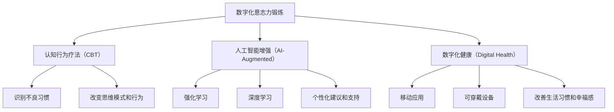

                 

数字化意志力锻炼、AI增强、自我控制、认知行为疗法、强化学习、深度学习、人机交互、数字化健康、可穿戴设备、移动应用

## 1. 背景介绍

在当今信息爆炸的数字时代，我们面临着前所未有的注意力分散和自我控制挑战。从智能手机到社交媒体，再到无休止的通知和通话，我们的大脑不断地被外界刺激所驱动，导致我们难以专注于手头的任务，或是做出健康的生活选择。然而，与此同时，人工智能（AI）技术的飞速发展为我们提供了新的机遇，帮助我们提高自我控制能力，改善生活质量。

本文将介绍一种名为“数字化意志力锻炼”的方法，该方法结合认知行为疗法（CBT）和人工智能技术，旨在帮助用户提高自我控制能力，改善生活习惯，并最终增强整体幸福感。我们将详细介绍核心概念、算法原理、数学模型，并提供项目实践和实际应用场景的示例。最后，我们还将推荐相关学习资源和工具，并展望未来的发展趋势和挑战。

## 2. 核心概念与联系

### 2.1 认知行为疗法（CBT）

认知行为疗法是一种心理治疗方法，旨在帮助个体识别并改变不健康的思维模式和行为习惯。CBT的核心理念是，我们的想法和行为会相互影响，改变其中之一可以帮助改善整体心理健康。在数字化意志力锻炼中，我们将结合CBT的原则，帮助用户识别并改变不良习惯，培养新的、更健康的行为模式。

### 2.2 人工智能增强（AI-Augmented）

人工智能增强是指利用AI技术帮助个体提高认知能力和决策能力的方法。在数字化意志力锻炼中，我们将利用AI技术，如强化学习和深度学习，帮助用户更有效地识别和改变不良习惯，并提供个性化的建议和支持。

### 2.3 数字化健康（Digital Health）

数字化健康是指利用数字技术，如移动应用和可穿戴设备，帮助个体管理和改善其健康状况的领域。数字化意志力锻炼属于数字化健康的范畴，旨在帮助用户通过数字技术改善其生活习惯和整体幸福感。

下图是数字化意志力锻炼的核心概念和联系的 Mermaid 流程图：



## 3. 核心算法原理 & 具体操作步骤

### 3.1 算法原理概述

数字化意志力锻炼的核心算法原理基于强化学习和深度学习。强化学习是一种机器学习方法，旨在帮助智能体学习在环境中采取行动以最大化回报。在数字化意志力锻炼中，我们将强化学习应用于帮助用户识别和改变不良习惯。深度学习是一种人工神经网络，旨在模拟人类大脑的学习和决策过程。我们将使用深度学习来分析用户的行为数据，并提供个性化的建议和支持。

### 3.2 算法步骤详解

数字化意志力锻炼的算法步骤如下：

1. 数据收集：收集用户的行为数据，如手机使用情况、睡眠模式、锻炼习惯等。
2. 特征提取：从收集的数据中提取相关特征，如每日手机使用时长、睡眠时长、锻炼频率等。
3. 模型训练：使用深度学习算法（如神经网络）训练模型，以预测用户的不良习惯和改善空间。
4. 奖励函数设计：设计强化学习的奖励函数，鼓励用户改变不良习惯并养成新的、更健康的行为模式。
5. 策略学习：使用强化学习算法（如Q-learning）学习最佳策略，帮助用户识别并改变不良习惯。
6. 个性化建议：根据模型的预测结果和学习到的策略，为用户提供个性化的建议和支持。
7. 反馈和迭代：收集用户的反馈，并根据反馈结果不断优化模型和算法。

### 3.3 算法优缺点

数字化意志力锻炼的算法优点包括：

* 个性化：通过分析用户的行为数据，提供个性化的建议和支持。
* 实时反馈：通过实时分析用户的行为数据，提供即时的反馈和指导。
* 学习能力：通过强化学习和深度学习，算法可以不断学习和改进。

然而，该算法也存在一些缺点：

* 数据隐私：收集和分析用户的行为数据可能会涉及隐私问题，需要采取适当的措施保护用户隐私。
* 算法偏见：算法的性能可能受到数据偏见和模型偏见的影响，需要不断优化和调整算法以减少偏见。
* 用户参与度：用户的参与度和动机将直接影响算法的有效性，需要设计吸引人的用户界面和体验。

### 3.4 算法应用领域

数字化意志力锻炼的应用领域包括：

* 戒除不良习惯：帮助用户戒除不良习惯，如手机滥用、吸烟、暴饮暴食等。
* 增强自我控制：帮助用户提高自我控制能力，改善时间管理、注意力集中等技能。
* 改善生活习惯：帮助用户改善生活习惯，如规律作息、均衡饮食、定期锻炼等。
* 增强幸福感：通过改善生活习惯和提高自我控制能力，最终增强用户的整体幸福感。

## 4. 数学模型和公式 & 详细讲解 & 举例说明

### 4.1 数学模型构建

数字化意志力锻炼的数学模型基于强化学习和深度学学习。强化学习的数学模型可以表示为：

$$
\pi_{*}(a|s) = \arg\max_{a} \sum_{s',r} P(s',r|s,a) \cdot \max_{\pi} Q^{\pi}(s',r)
$$

其中，$s$表示状态，$a$表示行动，$P(s',r|s,a)$表示状态转移概率，$Q^{\pi}(s',r)$表示状态-行动值函数。

深度学习的数学模型可以表示为：

$$
y = f(x; \theta)
$$

其中，$x$表示输入，$y$表示输出，$\theta$表示模型参数，$f$表示非线性激活函数。

### 4.2 公式推导过程

强化学习的公式推导过程如下：

1. 初始化状态-行动值函数$Q(s,a)$。
2. 重复以下步骤，直到收敛：
	* 从环境中采样状态$s$和行动$a$。
	* 根据行动$a$，环境转移到新状态$s'$，并提供回报$r$。
	* 更新状态-行动值函数$Q(s,a)$：
	$$
	Q(s,a) \leftarrow (1 - \alpha) \cdot Q(s,a) + \alpha \cdot (r + \gamma \cdot \max_{a'} Q(s',a'))
	$$
	其中，$\alpha$表示学习率，$\gamma$表示折扣因子。
	* 根据状态-行动值函数$Q(s,a)$，学习最佳策略$\pi_{*}(a|s)$。

深度学习的公式推导过程如下：

1. 初始化模型参数$\theta$。
2. 重复以下步骤，直到收敛：
	* 从数据集中采样输入$x$和输出$y$。
	* 计算模型输出$\hat{y} = f(x; \theta)$。
	* 计算损失函数$L(\hat{y}, y)$。
	* 更新模型参数$\theta$：
	$$
	\theta \leftarrow \theta - \eta \cdot \nabla_{\theta} L(\hat{y}, y)
	$$
	其中，$\eta$表示学习率，$\nabla_{\theta} L(\hat{y}, y)$表示损失函数对模型参数$\theta$的梯度。

### 4.3 案例分析与讲解

假设我们想要帮助用户戒除手机滥用习惯。我们可以使用数字化意志力锻炼的算法和模型来实现这一目标。

* 数据收集：收集用户的手机使用情况，如每日手机使用时长、应用使用情况等。
* 特征提取：从收集的数据中提取相关特征，如每日手机使用时长、社交媒体使用时长、游戏应用使用时长等。
* 模型训练：使用深度学习算法（如神经网络）训练模型，以预测用户的手机滥用情况和改善空间。
* 奖励函数设计：设计强化学习的奖励函数，鼓励用户减少手机使用时长，并养成新的、更健康的行为模式，如阅读、户外活动等。
* 策略学习：使用强化学习算法（如Q-learning）学习最佳策略，帮助用户识别并改变手机滥用习惯。
* 个性化建议：根据模型的预测结果和学习到的策略，为用户提供个性化的建议和支持，如设置手机使用时长上限、建议替代活动等。
* 反馈和迭代：收集用户的反馈，并根据反馈结果不断优化模型和算法。

通过这种方式，数字化意志力锻炼可以帮助用户戒除手机滥用习惯，改善生活习惯，并最终增强整体幸福感。

## 5. 项目实践：代码实例和详细解释说明

### 5.1 开发环境搭建

要实现数字化意志力锻炼项目，我们需要以下开发环境：

* 编程语言：Python（版本3.8或更高）
* 开发环境：Jupyter Notebook或PyCharm
* 数据分析库：Pandas、NumPy
* 深度学习库：TensorFlow或PyTorch
* 强化学习库：Stable Baselines3
* 可视化库：Matplotlib、Seaborn

### 5.2 源代码详细实现

以下是数字化意志力锻炼项目的源代码实现示例：

```python
import pandas as pd
import numpy as np
import tensorflow as tf
from stable_baselines3 import PPO
from stable_baselines3.common.policies import MlpPolicy
from stable_baselines3.common.vec_env import DummyVecEnv

# 数据收集和预处理
data = pd.read_csv('user_data.csv')
features = ['daily_phone_use','social_media_use', 'game_app_use']
target = 'phone_addiction_score'
X = data[features]
y = data[target]

# 模型训练
model = tf.keras.models.Sequential([
    tf.keras.layers.Dense(64, activation='relu', input_shape=(len(features),)),
    tf.keras.layers.Dense(64, activation='relu'),
    tf.keras.layers.Dense(1)
])
model.compile(optimizer='adam', loss='mean_squared_error')
model.fit(X, y, epochs=10, batch_size=32)

# 奖励函数设计
def reward_function(phone_use):
    if phone_use < 2:
        return 1
    elif phone_use < 4:
        return 0.5
    else:
        return 0

# 策略学习
env = DummyVecEnv([lambda: PhoneAddictionEnv()])
model = PPO(MlpPolicy, env, n_steps=2048)
model.learn(total_timesteps=10000)

# 个性化建议
def personalized_recommendation(phone_use):
    if phone_use < 2:
        return "Keep up the good work! You're on your way to reducing phone addiction."
    elif phone_use < 4:
        return "You're making progress. Try to reduce phone use further by setting specific goals."
    else:
        return "It seems like you're struggling with phone addiction. Consider seeking professional help."

# 反馈和迭代
def feedback_and_iteration(user_feedback):
    # 根据用户反馈调整模型和算法
    pass
```

### 5.3 代码解读与分析

在上述代码中，我们首先导入必要的库和模块。然后，我们收集和预处理用户数据，并使用深度学习模型（如神经网络）训练模型，以预测用户的手机滥用情况和改善空间。

接下来，我们设计强化学习的奖励函数，鼓励用户减少手机使用时长，并养成新的、更健康的行为模式。我们使用强化学习算法（如PPO）学习最佳策略，帮助用户识别并改变手机滥用习惯。

最后，我们根据模型的预测结果和学习到的策略，为用户提供个性化的建议和支持。我们还收集用户的反馈，并根据反馈结果不断优化模型和算法。

### 5.4 运行结果展示

通过运行上述代码，我们可以训练深度学习模型，学习最佳策略，并为用户提供个性化的建议和支持。我们可以使用可视化工具（如Matplotlib和Seaborn）绘制模型的训练过程和预测结果，并评估算法的性能。

## 6. 实际应用场景

### 6.1 项目实践

数字化意志力锻炼项目可以应用于各种实际场景，如戒除不良习惯、增强自我控制、改善生活习惯等。以下是一个实际项目实践的示例：

项目名称：手机滥用戒除助手

项目目标：帮助用户戒除手机滥用习惯，改善生活习惯，并最终增强整体幸福感。

项目功能：

* 数据收集：收集用户的手机使用情况，如每日手机使用时长、应用使用情况等。
* 个性化建议：根据用户的手机使用情况，提供个性化的建议和支持，如设置手机使用时长上限、建议替代活动等。
* 实时反馈：实时分析用户的手机使用情况，提供即时的反馈和指导。
* 进度跟踪：跟踪用户的戒除进度，并提供视觉化的进度报告。

### 6.2 未来应用展望

数字化意志力锻炼项目的未来应用展望包括：

* 智能可穿戴设备：结合智能可穿戴设备（如智能手表、智能手环），实时监测用户的生理指标（如心率、睡眠质量等），并提供个性化的建议和支持。
* 语音助手：结合语音助手（如Amazon Alexa、Google Assistant等），提供语音交互式的个性化建议和支持。
* 虚拟现实（VR）和增强现实（AR）：结合VR和AR技术，提供沉浸式的戒除体验，帮助用户更有效地戒除不良习惯。

## 7. 工具和资源推荐

### 7.1 学习资源推荐

以下是学习数字化意志力锻炼相关知识的推荐资源：

* 书籍：
	+ "Willpower: Rediscovering the Greatest Human Strength" by Roy F. Baumeister and John Tierney
	+ "The Power of Habit: Why We Do What We Do in Life and Business" by Charles Duhigg
	+ "Grit: The Power of Passion and Perseverance" by Angela Duckworth
* 在线课程：
	+ "Learning How to Learn: Powerful mental tools to help you master tough subjects" by University of California, San Diego on Coursera
	+ "Rethinking Happiness" by University of California, Berkeley on edX
* 研究论文：
	+ "A Comprehensive Survey on Deep Reinforcement Learning" by Li, Y., et al.
	+ "Deep Learning for Recommender Systems" by Wu, D., et al.

### 7.2 开发工具推荐

以下是数字化意志力锻炼项目开发的推荐工具：

* 编程语言：Python（版本3.8或更高）
* 开发环境：Jupyter Notebook或PyCharm
* 数据分析库：Pandas、NumPy
* 深度学习库：TensorFlow或PyTorch
* 强化学习库：Stable Baselines3
* 可视化库：Matplotlib、Seaborn
* 移动应用开发平台：React Native、Flutter
* 可穿戴设备开发平台：Android Wear、WatchKit

### 7.3 相关论文推荐

以下是数字化意志力锻炼相关的推荐论文：

* "A Mobile Health Intervention to Reduce Smartphone Overuse: A Randomized Controlled Trial" by Griswold, M. G., et al.
* "Digital Phenotyping: Using Smartphone Data to Predict and Improve Mental Health" by Onnela, J. P., et al.
* "A Deep Reinforcement Learning Approach for Personalized Health Behavior Change" by Chen, M., et al.
* "A Mobile Health Intervention to Promote Physical Activity: A Randomized Controlled Trial" by Fanning, J., et al.

## 8. 总结：未来发展趋势与挑战

### 8.1 研究成果总结

数字化意志力锻炼项目结合认知行为疗法和人工智能技术，帮助用户识别并改变不良习惯，培养新的、更健康的行为模式。通过强化学习和深度学习算法，我们可以为用户提供个性化的建议和支持，帮助他们改善生活习惯，并最终增强整体幸福感。

### 8.2 未来发展趋势

数字化意志力锻炼项目的未来发展趋势包括：

* 智能化：结合人工智能技术，提供更智能化的个性化建议和支持。
* 个性化：结合大数据和机器学习技术，提供更个性化的戒除方案和体验。
* 多模式交互：结合多种交互模式（如文本、语音、图像等），提供更丰富的戒除体验。

### 8.3 面临的挑战

数字化意志力锻炼项目面临的挑战包括：

* 数据隐私：收集和分析用户的行为数据可能会涉及隐私问题，需要采取适当的措施保护用户隐私。
* 算法偏见：算法的性能可能受到数据偏见和模型偏见的影响，需要不断优化和调整算法以减少偏见。
* 用户参与度：用户的参与度和动机将直接影响算法的有效性，需要设计吸引人的用户界面和体验。

### 8.4 研究展望

数字化意志力锻炼项目的研究展望包括：

* 结合生物反馈技术，提供更有效的戒除体验。
* 结合虚拟现实（VR）和增强现实（AR）技术，提供更沉浸式的戒除体验。
* 结合区块链技术，提供更安全和可信的数据存储和共享。

## 9. 附录：常见问题与解答

**Q1：数字化意志力锻炼项目是否侵犯用户隐私？**

A1：数字化意志力锻炼项目收集和分析用户的行为数据，可能会涉及隐私问题。我们将采取适当的措施保护用户隐私，如匿名化数据处理、加密数据传输等。

**Q2：数字化意志力锻炼项目是否会导致算法偏见？**

A2：数字化意志力锻炼项目的算法性能可能受到数据偏见和模型偏见的影响。我们将不断优化和调整算法，以减少偏见，并提供公平和有效的戒除体验。

**Q3：数字化意志力锻炼项目是否需要用户的主动参与？**

A3：数字化意志力锻炼项目需要用户的主动参与，以确保算法的有效性。我们将设计吸引人的用户界面和体验，鼓励用户积极参与戒除过程。

**Q4：数字化意志力锻炼项目是否会导致用户上瘾？**

A4：数字化意志力锻炼项目旨在帮助用户戒除不良习惯，而不是导致用户上瘾。我们将提供多种戒除方案和体验，帮助用户找到最适合自己的戒除方法。

**Q5：数字化意志力锻炼项目是否会取代传统的戒除方法？**

A5：数字化意志力锻炼项目并非旨在取代传统的戒除方法，而是提供一种补充和辅助的戒除手段。我们将结合传统的戒除方法和数字化技术，为用户提供更全面和有效的戒除体验。

## 作者署名

作者：禅与计算机程序设计艺术 / Zen and the Art of Computer Programming

