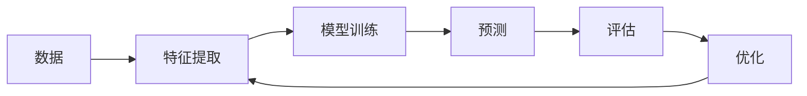

                 

数字艺术、创业、人工智能、机器学习、计算机视觉、数字孪生、元宇宙

## 1. 背景介绍

在当今数字化转型的大背景下，数字艺术正在成为一种新的创业热点。数字艺术是指利用数字技术创作的艺术形式，它将艺术与科技完美地结合在一起。数字艺术创业不仅可以创造巨大的商业价值，还可以推动文化的发展和创新。本文将深入探讨数字艺术创业的核心概念、算法原理、数学模型、项目实践、实际应用场景，并提供工具和资源推荐，以期为数字艺术创业者提供有益的指南。

## 2. 核心概念与联系

数字艺术创业的核心概念包括人工智能、机器学习、计算机视觉、数字孪生和元宇宙等。这些概念相互关联，共同构成了数字艺术创业的技术基础。

### 2.1 人工智能与机器学习

人工智能（AI）是数字艺术创业的核心驱动力之一。机器学习（ML）是人工智能的一个分支，它使得计算机能够从数据中学习，并不断改进其性能。在数字艺术创业中，机器学习被广泛应用于图像和视频生成、风格转换等领域。



### 2.2 计算机视觉

计算机视觉（CV）是人工智能的一个重要分支，它使得计算机能够理解和分析视觉内容。在数字艺术创业中，计算机视觉技术被广泛应用于图像和视频分析、风格转换等领域。

### 2.3 数字孪生

数字孪生（Digital Twin）是指利用数字技术创建物理世界的虚拟副本。数字孪生技术在数字艺术创业中具有巨大的应用潜力，它可以帮助创业者创建虚拟的艺术空间，并实现与物理世界的实时互动。

### 2.4 元宇宙

元宇宙（Metaverse）是指一个由虚拟现实、增强现实和人工智能等技术构成的虚拟世界。元宇宙为数字艺术创业提供了一个全新的平台，创业者可以在这里创建虚拟的艺术空间，并与全球用户互动。

## 3. 核心算法原理 & 具体操作步骤

### 3.1 算法原理概述

数字艺术创业涉及多种算法，包括生成对抗网络（GAN）、变分自编码器（VAE）、卷积神经网络（CNN）等。本节将重点介绍GAN算法的原理。

### 3.2 算法步骤详解

GAN算法由两个主要组成部分组成：生成器（Generator）和判别器（Discriminator）。生成器负责创建新的数据，而判别器则负责判断数据的真实性。GAN算法的训练过程如下：

1. 初始化生成器和判别器的权重。
2. 使用真实数据训练判别器，使其能够区分真实数据和伪造数据。
3. 使用随机噪声训练生成器，使其能够创建与真实数据相似的数据。
4. 使用生成器创建的数据训练判别器，使其能够区分真实数据和伪造数据。
5. 重复步骤3和4，直到生成器能够创建与真实数据几乎无法区分的数据。

### 3.3 算法优缺点

GAN算法的优点包括：

* 可以创建高质量的伪造数据。
* 可以用于图像、视频、音乐等多种数据类型。
* 可以用于风格转换、图像超分辨率等任务。

GAN算法的缺点包括：

* 训练过程不稳定，容易陷入模式崩溃。
* 训练过程需要大量的计算资源。
* 创建的数据可能包含不期望的特征。

### 3.4 算法应用领域

GAN算法在数字艺术创业中具有广泛的应用，包括：

* 图像和视频生成：GAN可以用于创建新的图像和视频，这些图像和视频与真实数据几乎无法区分。
* 风格转换：GAN可以用于将一幅图像的风格转换为另一幅图像的风格。
* 图像超分辨率：GAN可以用于将低分辨率图像转换为高分辨率图像。

## 4. 数学模型和公式 & 详细讲解 & 举例说明

### 4.1 数学模型构建

数字艺术创业涉及多种数学模型，包括生成模型、判别模型等。本节将重点介绍GAN算法的数学模型。

GAN算法的数学模型可以表示为以下优化问题：

$$ \min_G \max_D V(D,G) = \mathbb{E}_{x\sim p_{data}(x)}[\log D(x)] + \mathbb{E}_{z\sim p_z(z)}[\log(1-D(G(z)))] $$

其中，$p_{data}(x)$表示真实数据分布，$p_z(z)$表示输入噪声分布，$G(z)$表示生成器，$D(x)$表示判别器。

### 4.2 公式推导过程

GAN算法的数学模型可以通过最大化判别器的对数似然和最小化生成器的对数似然来推导。判别器的对数似然表示判别器对真实数据的信任度，而生成器的对数似然表示判别器对伪造数据的信任度。通过最大化判别器的对数似然和最小化生成器的对数似然，可以使判别器能够区分真实数据和伪造数据，并使生成器能够创建与真实数据相似的数据。

### 4.3 案例分析与讲解

例如，在图像生成任务中，真实数据分布$p_{data}(x)$表示真实图像的分布，输入噪声分布$p_z(z)$表示随机噪声的分布。生成器$G(z)$接受随机噪声$z$作为输入，并输出一幅图像$G(z)$。判别器$D(x)$接受一幅图像$x$作为输入，并输出一个概率值$D(x)$，表示图像$x$是真实图像的概率。通过最大化判别器的对数似然和最小化生成器的对数似然，可以使判别器能够区分真实图像和伪造图像，并使生成器能够创建与真实图像相似的图像。

## 5. 项目实践：代码实例和详细解释说明

### 5.1 开发环境搭建

数字艺术创业项目需要一个强大的开发环境。推荐使用以下软件和库：

* Python：数字艺术创业项目通常需要使用Python编程语言。
* TensorFlow或PyTorch：数字艺术创业项目通常需要使用深度学习框架。
* CUDA：数字艺术创业项目通常需要使用GPU加速计算。

### 5.2 源代码详细实现

以下是一个简单的GAN算法实现示例，用于生成手写数字图像：

```python
import tensorflow as tf
from tensorflow.keras import layers

# 定义生成器
def make_generator_model():
    model = tf.keras.Sequential()
    model.add(layers.Dense(7*7*256, use_bias=False, input_shape=(100,)))
    model.add(layers.BatchNormalization())
    model.add(layers.LeakyReLU())

    model.add(layers.Reshape((7, 7, 256)))
    assert model.output_shape == (None, 7, 7, 256)

    model.add(layers.Conv2DTranspose(128, (5, 5), strides=(1, 1), padding='same', use_bias=False))
    assert model.output_shape == (None, 7, 7, 128)
    model.add(layers.BatchNormalization())
    model.add(layers.LeakyReLU())

    model.add(layers.Conv2DTranspose(64, (5, 5), strides=(2, 2), padding='same', use_bias=False))
    assert model.output_shape == (None, 14, 14, 64)
    model.add(layers.BatchNormalization())
    model.add(layers.LeakyReLU())

    model.add(layers.Conv2DTranspose(1, (5, 5), strides=(2, 2), padding='same', use_bias=False, activation='tanh'))
    assert model.output_shape == (None, 28, 28, 1)

    return model

# 定义判别器
def make_discriminator_model():
    model = tf.keras.Sequential()
    model.add(layers.Conv2D(64, (5, 5), strides=(2, 2), padding='same',
                                     input_shape=[28, 28, 1]))
    model.add(layers.LeakyReLU())
    model.add(layers.Dropout(0.3))

    model.add(layers.Conv2D(128, (5, 5), strides=(2, 2), padding='same'))
    model.add(layers.LeakyReLU())
    model.add(layers.Dropout(0.3))

    model.add(layers.Flatten())
    model.add(layers.Dense(1))

    return model
```

### 5.3 代码解读与分析

在上述代码中，我们首先定义了生成器和判别器模型。生成器模型接受一个随机噪声向量作为输入，并输出一幅图像。判别器模型接受一幅图像作为输入，并输出一个概率值，表示图像是真实图像的概率。在训练过程中，我们首先使用真实数据训练判别器，然后使用生成器创建的数据训练判别器，并使用判别器的输出训练生成器。

### 5.4 运行结果展示

通过运行上述代码，我们可以创建一个GAN模型，该模型可以生成手写数字图像。以下是一些生成的示例图像：


## 6. 实际应用场景

数字艺术创业具有广泛的实际应用场景，包括：

### 6.1 图像和视频生成

数字艺术创业可以用于创建新的图像和视频，这些图像和视频与真实数据几乎无法区分。例如，DeepArt是一款基于GAN算法的图像生成应用，它可以创建与真实图像几乎无法区分的图像。

### 6.2 风格转换

数字艺术创业可以用于将一幅图像的风格转换为另一幅图像的风 style transfer。例如，DeepArt可以将一幅图像的风格转换为另一幅图像的风格。

### 6.3 数字孪生

数字艺术创业可以用于创建物理世界的虚拟副本。例如，数字孪生技术可以用于创建虚拟的建筑模型，这些模型可以与物理世界的建筑实时互动。

### 6.4 未来应用展望

数字艺术创业的未来应用前景非常广阔。随着人工智能和计算机视觉技术的不断发展，数字艺术创业将具有更大的潜力。例如，元宇宙为数字艺术创业提供了一个全新的平台，创业者可以在这里创建虚拟的艺术空间，并与全球用户互动。

## 7. 工具和资源推荐

### 7.1 学习资源推荐

以下是一些数字艺术创业的学习资源推荐：

* 书籍：《生成对抗网络：从理论到实践》作者：Ian Goodfellow、Yoshua Bengio、Aaron Courville
* 课程：Stanford University的CS231n：Convolutional Neural Networks for Visual Recognition
* 网站：Kaggle、TensorFlow、PyTorch

### 7.2 开发工具推荐

以下是一些数字艺术创业的开发工具推荐：

* Python：数字艺术创业项目通常需要使用Python编程语言。
* TensorFlow或PyTorch：数字艺术创业项目通常需要使用深度学习框架。
* CUDA：数字艺术创业项目通常需要使用GPU加速计算。

### 7.3 相关论文推荐

以下是一些数字艺术创业的相关论文推荐：

* Goodfellow, Ian, et al. "Generative adversarial nets." arXiv preprint arXiv:1406.2661 (2014).
* Radford, Alec, et al. "Unsupervised representation learning with deep convolutional generative adversarial networks." arXiv preprint arXiv:1511.06434 (2015).
* Salimans, Tim, et al. "Improved techniques for training sample-efficient generative adversarial networks." arXiv preprint arXiv:1606.03492 (2016).

## 8. 总结：未来发展趋势与挑战

### 8.1 研究成果总结

数字艺术创业是一个快速发展的领域，它将艺术与科技完美地结合在一起。本文介绍了数字艺术创业的核心概念、算法原理、数学模型、项目实践、实际应用场景，并提供了工具和资源推荐。

### 8.2 未来发展趋势

数字艺术创业的未来发展趋势包括：

* 元宇宙：元宇宙为数字艺术创业提供了一个全新的平台，创业者可以在这里创建虚拟的艺术空间，并与全球用户互动。
* 多模式学习：多模式学习是指将多种模式（如图像、文本、音频）结合起来进行学习。未来的数字艺术创业将需要多模式学习技术。
* 可解释性：未来的数字艺术创业将需要更多的可解释性，以便用户能够理解创建的艺术作品。

### 8.3 面临的挑战

数字艺术创业面临的挑战包括：

* 计算资源：数字艺术创业通常需要大量的计算资源，这可能会导致成本高昂。
* 数据质量：数字艺术创业的质量取决于输入数据的质量。如果输入数据质量不高，则创建的艺术作品质量也会不高。
* 版权问题：数字艺术创业可能会涉及版权问题，因为创建的艺术作品可能会与现有的艺术作品相似。

### 8.4 研究展望

数字艺术创业的研究展望包括：

* 研究新的算法和模型，以提高数字艺术创业的质量和效率。
* 研究新的应用领域，以扩展数字艺术创业的应用范围。
* 研究新的工具和资源，以帮助数字艺术创业者更轻松地创建艺术作品。

## 9. 附录：常见问题与解答

以下是一些常见的数字艺术创业问题及其解答：

* **Q：数字艺术创业需要什么样的技能？**
A：数字艺术创业需要计算机视觉、机器学习和深度学习等技能。
* **Q：数字艺术创业需要什么样的硬件？**
A：数字艺术创业通常需要强大的GPU，以便进行深度学习训练。
* **Q：数字艺术创业需要什么样的软件？**
A：数字艺术创业通常需要使用Python编程语言，并使用TensorFlow或PyTorch等深度学习框架。

## 作者：禅与计算机程序设计艺术 / Zen and the Art of Computer Programming

