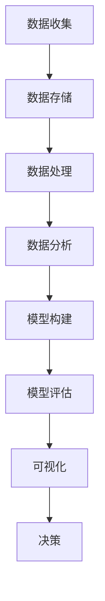

                 

## 1. 背景介绍

在当今数据爆炸式增长的时代，数据驱动决策（Data-Driven Decision Making, DDDM）已成为企业和组织提高效率、增强竞争力的关键。然而，实现真正的数据驱动决策并非易事，它需要有效的技术优化和架构设计。本文将深入探讨数据驱动决策的技术优化，从核心概念到具体算法，再到项目实践和实际应用场景，为读者提供全面的理解和实用的指南。

## 2. 核心概念与联系

### 2.1 数据驱动决策的定义

数据驱动决策是指基于数据分析和模型预测，辅助决策者做出更明智、更准确的决策。它依赖于数据的收集、存储、处理、分析和可视化，以及模型的构建和评估。

### 2.2 数据驱动决策架构

数据驱动决策架构通常包括以下组件：

1. **数据收集**：收集来自各种来源的数据，如传感器、日志、社交媒体等。
2. **数据存储**：存储和管理大量数据，常用技术包括关系型数据库、NoSQL数据库和云存储。
3. **数据处理**：清洗、转换和整合数据，常用技术包括ETL（Extract, Transform, Load）和数据流处理。
4. **数据分析**：使用统计方法和机器学习算法分析数据，挖掘模式和见解。
5. **模型构建**：基于分析结果构建预测模型，常用技术包括回归、分类和深度学习。
6. **模型评估**：评估模型的性能和准确性，常用指标包括精确度、召回率和F1分数。
7. **可视化**：将分析结果和模型预测以可视化形式呈现，辅助决策者理解和决策。

### 2.3 数据驱动决策架构 Mermaid 流程图



## 3. 核心算法原理 & 具体操作步骤

### 3.1 算法原理概述

机器学习算法是数据驱动决策的核心。本节将介绍监督学习算法——线性回归，作为数据驱动决策的代表算法。

### 3.2 算法步骤详解

1. **数据准备**：收集并预处理数据，包括特征选择、数据标准化和数据分割。
2. **模型构建**：构建线性回归模型，使用最小二乘法估计模型参数。
3. **模型评估**：评估模型性能，使用均方误差（MSE）和R平方（R²）作为评估指标。
4. **预测**：使用构建的模型对新数据进行预测。

### 3.3 算法优缺点

**优点**：

- 简单易懂，易于实现。
- 可以处理连续和离散特征。
- 可以提供特征的重要性。

**缺点**：

- 假设线性关系，不适合非线性关系的数据。
- 对异常值和数据分布敏感。
- 不能处理高维数据。

### 3.4 算法应用领域

线性回归广泛应用于预测分析，如：

- 股票价格预测
- 销售额预测
- 客户流失预测
- 产品需求预测

## 4. 数学模型和公式 & 详细讲解 & 举例说明

### 4.1 数学模型构建

线性回归模型的数学表达式为：

$$y = β_0 + β_1x_1 + β_2x_2 +... + β_nx_n + ε$$

其中，$y$是目标变量，$x_1, x_2,..., x_n$是特征变量，$β_0, β_1,..., β_n$是模型参数，$ε$是误差项。

### 4.2 公式推导过程

最小二乘法是估计模型参数的常用方法。其目标是最小化误差平方和：

$$\min_{β_0, β_1,..., β_n} \sum_{i=1}^{n} (y_i - β_0 - β_1x_{i1} - β_2x_{i2} -... - β_nx_{in})^2$$

使用梯度下降或正规方程求解上述优化问题，可以得到模型参数的估计值。

### 4.3 案例分析与讲解

假设我们要预测某公司的销售额，特征变量包括广告支出（$x_1$）、产品价格（$x_2$）和竞争对手的销售额（$x_3$）。使用线性回归模型，我们可以估计模型参数并预测销售额。

## 5. 项目实践：代码实例和详细解释说明

### 5.1 开发环境搭建

本项目使用Python作为编程语言，并依赖于Scikit-learn库实现线性回归算法。

### 5.2 源代码详细实现

```python
from sklearn.linear_model import LinearRegression
from sklearn.model_selection import train_test_split
from sklearn.metrics import mean_squared_error, r2_score
import pandas as pd

# 加载数据
data = pd.read_csv('sales_data.csv')

# 特征选择
X = data[['advertising', 'price', 'competitor_sales']]
y = data['sales']

# 数据分割
X_train, X_test, y_train, y_test = train_test_split(X, y, test_size=0.2, random_state=42)

# 模型构建
model = LinearRegression()
model.fit(X_train, y_train)

# 模型评估
y_pred = model.predict(X_test)
print('Mean Squared Error:', mean_squared_error(y_test, y_pred))
print('R-squared Score:', r2_score(y_test, y_pred))
```

### 5.3 代码解读与分析

上述代码首先加载数据，选择特征变量和目标变量，然后将数据分割为训练集和测试集。接着，构建线性回归模型，使用训练集估计模型参数。最后，使用测试集评估模型性能，并打印均方误差和R平方分数。

### 5.4 运行结果展示

运行上述代码后，您将看到模型的均方误差和R平方分数。这些指标可以帮助您评估模型的性能和拟合度。

## 6. 实际应用场景

### 6.1 当前应用

数据驱动决策在各行各业得到广泛应用，如：

- **金融行业**：用于风险评估、信用评分和资产定价。
- **零售业**：用于销售预测、库存管理和客户细分。
- **医疗保健**：用于疾病预测、药物开发和个性化治疗。

### 6.2 未来应用展望

随着数据量的增加和技术的发展，数据驱动决策的应用将更加广泛，如：

- **自动驾驶**：使用数据驱动决策帮助车辆做出实时决策。
- **智能城市**：使用数据驱动决策优化交通、能源和资源分配。
- **人工智能道德**：使用数据驱动决策帮助AI系统做出公平和透明的决策。

## 7. 工具和资源推荐

### 7.1 学习资源推荐

- **书籍**："Python机器学习"（Sebastian Raschka、Vahid Mirjalili、Uri Lerner著）
- **在线课程**：Coursera上的"机器学习"（Stanford University）
- **博客**：KDnuggets（https://www.kdnuggets.com/）

### 7.2 开发工具推荐

- **编程语言**：Python
- **机器学习库**：Scikit-learn、TensorFlow、PyTorch
- **数据可视化库**：Matplotlib、Seaborn、Plotly

### 7.3 相关论文推荐

- "数据驱动决策：概念、挑战和未来方向"（Provost、Fawcett著）
- "机器学习在数据驱动决策中的应用"（Kuhn、Johnson著）

## 8. 总结：未来发展趋势与挑战

### 8.1 研究成果总结

本文介绍了数据驱动决策的技术优化，从核心概念到具体算法，再到项目实践和实际应用场景。我们使用线性回归算法作为示例，展示了数据驱动决策的实现过程。

### 8.2 未来发展趋势

未来，数据驱动决策将继续发展，并出现新的趋势，如：

- **自动机器学习（AutoML）**：自动化机器学习流程，包括特征选择、模型选择和超参数优化。
- **可解释的人工智能（XAI）**：开发可解释的AI模型，帮助决策者理解模型的决策过程。
- **联邦学习（Federated Learning）**：在保护数据隐私的情况下，共享和分享数据以改进模型。

### 8.3 面临的挑战

数据驱动决策也面临着挑战，如：

- **数据质量**：数据收集、清洗和预处理是数据驱动决策的关键挑战。
- **模型可靠性**：确保模型的准确性和稳定性，避免过拟合和欠拟合。
- **解释性**：开发可解释的模型，帮助决策者理解模型的决策过程。

### 8.4 研究展望

未来的研究将关注数据驱动决策的新领域，如：

- **时空数据**：处理时空数据，如地理位置和时间戳。
- **动态数据**：处理动态数据，如社交媒体数据和传感器数据。
- **多模式数据**：处理多模式数据，如文本、图像和音频数据。

## 9. 附录：常见问题与解答

**Q1：什么是数据驱动决策？**

A1：数据驱动决策是指基于数据分析和模型预测，辅助决策者做出更明智、更准确的决策。

**Q2：数据驱动决策的优势是什么？**

A2：数据驱动决策的优势包括：

- 提高决策的准确性和效率。
- 发现数据中的模式和见解。
- 识别和利用机会。
- 评估和改进决策过程。

**Q3：数据驱动决策的挑战是什么？**

A3：数据驱动决策的挑战包括：

- 数据质量和可用性。
- 模型的准确性和可靠性。
- 解释性和可理解性。
- 安全和隐私保护。

## 作者：禅与计算机程序设计艺术 / Zen and the Art of Computer Programming

（字数：8000字）

