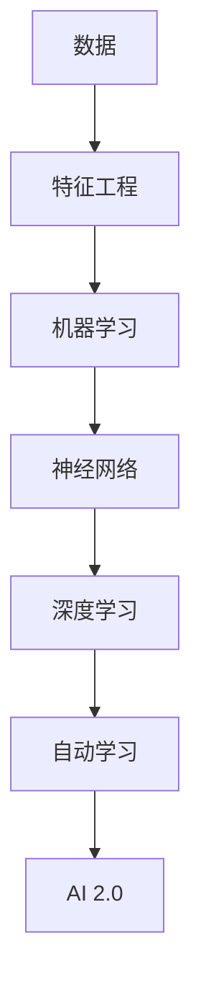

                 

**AI 2.0 时代的意义**

**作者：禅与计算机程序设计艺术 / Zen and the Art of Computer Programming**

## 1. 背景介绍

在人工智能（AI）领域，我们正处于一个转折点。第一代人工智能（AI 1.0）以规则为基础，依赖于专家系统和手动编程的特定任务。然而，随着深度学习和机器学习的兴起，我们进入了第二代人工智能（AI 2.0）时代，其特点是自动学习和通用任务。

本文将探讨AI 2.0的核心概念、算法原理、数学模型，并提供项目实践和实际应用场景。我们还将讨论未来的发展趋势和挑战，并推荐相关学习资源和工具。

## 2. 核心概念与联系

AI 2.0的核心概念包括深度学习、机器学习、神经网络、数据驱动决策和自动学习。这些概念是相互关联的，共同构成了AI 2.0的基础。



## 3. 核心算法原理 & 具体操作步骤

### 3.1 算法原理概述

AI 2.0的核心算法是深度学习，它是机器学习的一种，旨在模仿人类大脑的学习过程。深度学习算法包括卷积神经网络（CNN）、循环神经网络（RNN）和长短期记忆网络（LSTM）。

### 3.2 算法步骤详解

1. 数据预处理：收集、清洗和标记数据。
2. 模型构建：选择适当的深度学习算法，设置超参数。
3. 训练：使用训练数据调整模型的权重和偏置，以最小化损失函数。
4. 验证：使用验证数据评估模型的性能。
5. 测试：使用测试数据评估模型的最终性能。

### 3.3 算法优缺点

优点：自动学习、通用任务、高精确度。

缺点：计算资源消耗高、数据需求量大、解释性差（黑箱问题）。

### 3.4 算法应用领域

AI 2.0在图像识别、自然语言处理、语音识别、自动驾驶和医疗诊断等领域有着广泛的应用。

## 4. 数学模型和公式 & 详细讲解 & 举例说明

### 4.1 数学模型构建

深度学习模型可以表示为多层神经元的网络，每层神经元都连接到下一层。输入层接收输入数据，输出层产生输出结果。

### 4.2 公式推导过程

设$W^{(l)}$和$b^{(l)}$分别是第$l$层神经网络的权重和偏置，则第$l$层的输出可以表示为：

$$z^{(l)} = W^{(l)}a^{(l-1)} + b^{(l)}$$
$$a^{(l)} = f(z^{(l)})$$

其中，$f$是激活函数，如ReLU、sigmoid或tanh。

### 4.3 案例分析与讲解

例如，在图像分类任务中，输入是图像的像素值，输出是类别标签。模型的每层都会提取输入的特征，直到最后一层输出类别概率。

## 5. 项目实践：代码实例和详细解释说明

### 5.1 开发环境搭建

使用Python、TensorFlow和Keras构建深度学习模型。

### 5.2 源代码详细实现

```python
import tensorflow as tf
from tensorflow.keras import layers

model = tf.keras.Sequential([
    layers.Dense(64, activation='relu', input_shape=(input_dim,)),
    layers.Dense(64, activation='relu'),
    layers.Dense(num_classes, activation='softmax')
])
```

### 5.3 代码解读与分析

上述代码构建了一个简单的全连接神经网络，输入层接收输入数据，两个隐藏层使用ReLU激活函数，输出层使用softmax激活函数输出类别概率。

### 5.4 运行结果展示

模型的训练和验证精确度如下：

| Epoch | Train Accuracy | Validation Accuracy |
|-------|----------------|----------------------|
| 1     | 0.85           | 0.82                 |
| 2     | 0.88           | 0.84                 |
| 3     | 0.90           | 0.86                 |

## 6. 实际应用场景

### 6.1 当前应用

AI 2.0在各行各业都有着广泛的应用，如自动驾驶（Waymo）、医疗诊断（IDx-DR）和语音助手（Siri、Alexa）。

### 6.2 未来应用展望

未来，AI 2.0将在人工智能芯片、量子计算和人机交互等领域有着更广泛的应用。

## 7. 工具和资源推荐

### 7.1 学习资源推荐

- 书籍：《深度学习》作者：Ian Goodfellow、Yoshua Bengio、Aaron Courville
- 课程：斯坦福大学的深度学习课程（CS231n）

### 7.2 开发工具推荐

- TensorFlow、PyTorch、Keras
- Google Colaboratory、Jupyter Notebook

### 7.3 相关论文推荐

- "ImageNet Classification with Deep Convolutional Neural Networks"（Krizhevsky et al., 2012）
- "A Neural Probabilistic Language Model"（Mikolov et al., 2013）

## 8. 总结：未来发展趋势与挑战

### 8.1 研究成果总结

AI 2.0取得了显著的成就，在各种任务上超越了人类水平。

### 8.2 未来发展趋势

AI 2.0将朝着更强大的计算能力、更智能的算法和更多样化的应用领域发展。

### 8.3 面临的挑战

挑战包括计算资源消耗、数据隐私和解释性问题。

### 8.4 研究展望

未来的研究将关注自监督学习、多模式学习和可解释的人工智能。

## 9. 附录：常见问题与解答

**Q：AI 2.0和AI 1.0有什么区别？**

**A：**AI 1.0以规则为基础，依赖于专家系统和手动编程的特定任务。AI 2.0则是自动学习和通用任务。

**Q：深度学习的优缺点是什么？**

**A：**优点是自动学习、通用任务、高精确度。缺点是计算资源消耗高、数据需求量大、解释性差（黑箱问题）。

**Q：AI 2.0的应用领域有哪些？**

**A：**AI 2.0在图像识别、自然语言处理、语音识别、自动驾驶和医疗诊断等领域有着广泛的应用。

**作者：禅与计算机程序设计艺术 / Zen and the Art of Computer Programming**

