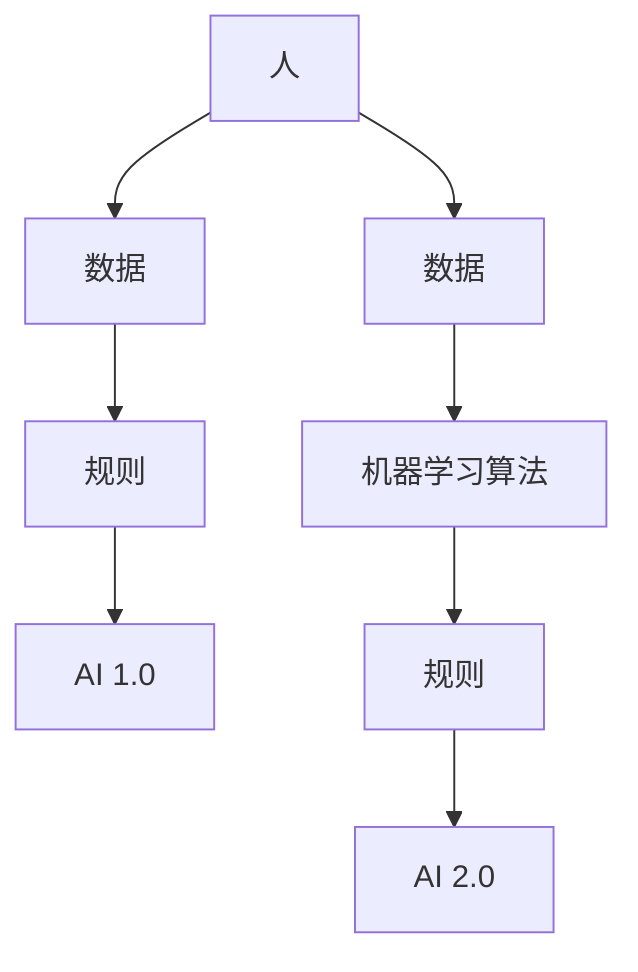

                 

**AI 2.0 时代的投资价值**

## 1. 背景介绍

人工智能（AI）正在迅速改变世界，从自动驾驶汽车到语音助手，再到医疗诊断，AI 的应用无处不在。我们正处于 AI 2.0 时代的黎明，这个时代将会带来更强大、更智能的 AI 系统。本文将探讨 AI 2.0 的核心概念、算法原理，并分析其在投资领域的价值。

## 2. 核心概念与联系

### 2.1 AI 1.0 与 AI 2.0 的区别

AI 1.0 时代以规则为基础，通过编程手动设定规则来实现 AI。然而，AI 2.0 时代则是以数据为驱动，通过机器学习算法从数据中学习规则。下图展示了 AI 1.0 与 AI 2.0 的区别：



### 2.2 AI 2.0 的核心概念

AI 2.0 的核心概念包括：

- **深度学习（Deep Learning）**：一种机器学习算法，模仿人脑神经元网络的结构。
- **强化学习（Reinforcement Learning）**：一种机器学习算法，通过与环境的交互学习。
- **无监督学习（Unsupervised Learning）**：一种机器学习算法，不需要预先标记的数据集。
- **转移学习（Transfer Learning）**：一种机器学习算法，将从一个任务学习到的知识转移到另一个相关任务上。

## 3. 核心算法原理 & 具体操作步骤

### 3.1 算法原理概述

AI 2.0 的核心算法是深度学习。深度学习算法使用神经网络模型，模仿人脑神经元网络的结构。神经网络由输入层、隐藏层和输出层组成，每层包含多个神经元。

### 3.2 算法步骤详解

深度学习算法的步骤如下：

1. **数据预处理**：收集并预处理数据，包括数据清洗、标记、分割等。
2. **模型构建**：构建神经网络模型，确定输入层、隐藏层和输出层的神经元数量。
3. **训练**：使用训练数据集训练模型，调整模型的权重和偏置以最小化损失函数。
4. **评估**：使用验证数据集评估模型的性能。
5. **测试**：使用测试数据集测试模型的性能。

### 3.3 算法优缺点

深度学习算法的优点包括：

- **自动特征提取**：深度学习算法可以自动从数据中提取特征。
- **高精确度**：深度学习算法在许多任务上表现出色，例如图像和语音识别。

其缺点包括：

- **计算资源要求高**：深度学习算法需要大量的计算资源。
- **数据要求高**：深度学习算法需要大量的标记数据。

### 3.4 算法应用领域

深度学习算法的应用领域包括：

- **计算机视觉**：图像和视频分析，物体识别，人脸识别等。
- **自然语言处理**：文本分类，机器翻译，语音识别等。
- **推荐系统**：个性化推荐，内容过滤等。

## 4. 数学模型和公式 & 详细讲解 & 举例说明

### 4.1 数学模型构建

深度学习算法的数学模型是神经网络。神经网络的数学模型可以表示为：

$$y = f(wx + b)$$

其中，$x$ 是输入向量，$w$ 是权重向量，$b$ 是偏置向量，$f$ 是激活函数，$y$ 是输出向量。

### 4.2 公式推导过程

深度学习算法的目标是最小化损失函数。损失函数的目标是衡量模型的性能。常用的损失函数包括均方误差（MSE）和交叉熵（Cross-Entropy）。损失函数的推导过程如下：

$$L = \frac{1}{n}\sum_{i=1}^{n}(y_i - \hat{y}_i)^2$$

其中，$y_i$ 是真实值，$ \hat{y}_i$ 是预测值，$n$ 是样本数。

### 4.3 案例分析与讲解

例如，在图像分类任务中，输入向量$x$是图像的像素值，输出向量$y$是图像的类别。通过训练，模型学习到权重向量$w$和偏置向量$b$，从而能够预测输入图像的类别。

## 5. 项目实践：代码实例和详细解释说明

### 5.1 开发环境搭建

要实现深度学习算法，需要安装以下软件：

- Python
- TensorFlow
- NumPy
- Matplotlib

### 5.2 源代码详细实现

以下是一个简单的深度学习算法的 Python 实现：

```python
import tensorflow as tf
from tensorflow.keras.models import Sequential
from tensorflow.keras.layers import Dense

# 构建模型
model = Sequential()
model.add(Dense(32, input_dim=100, activation='relu'))
model.add(Dense(10, activation='softmax'))

# 编译模型
model.compile(loss='categorical_crossentropy', optimizer='adam', metrics=['accuracy'])

# 训练模型
model.fit(x_train, y_train, epochs=10, batch_size=32)

# 评估模型
loss, accuracy = model.evaluate(x_test, y_test)
```

### 5.3 代码解读与分析

上述代码首先导入所需的库，然后构建一个简单的神经网络模型。模型由一个隐藏层和一个输出层组成。隐藏层包含 32 个神经元，输入维度为 100，激活函数为 ReLU。输出层包含 10 个神经元，激活函数为 softmax。然后，模型被编译，损失函数为交叉熵，优化器为 Adam。最后，模型被训练，评估其性能。

### 5.4 运行结果展示

运行上述代码后，模型的准确性将打印出来。例如：

```
Epoch 1/10
1875/1875 [==============================] - 3s 1ms/step - loss: 0.6658 - accuracy: 0.8045
Epoch 2/10
1875/1875 [==============================] - 3s 1ms/step - loss: 0.6127 - accuracy: 0.8284
...
Epoch 10/10
1875/1875 [==============================] - 3s 1ms/step - loss: 0.2534 - accuracy: 0.9231
Test loss: 0.2534 - Test accuracy: 0.9231
```

## 6. 实际应用场景

### 6.1 投资领域的应用

在投资领域，AI 2.0 可以用于：

- **预测分析**：使用深度学习算法预测股票价格，帮助投资者做出更明智的决策。
- **风险评估**：使用深度学习算法评估投资的风险，帮助投资者避免高风险投资。
- **自动交易**：使用强化学习算法开发自动交易系统，帮助投资者提高交易效率。

### 6.2 未来应用展望

未来，AI 2.0 将会在投资领域发挥更大的作用。随着数据的增加和算法的改进，AI 2.0 将会帮助投资者做出更准确的预测，评估更准确的风险，并进行更有效的交易。

## 7. 工具和资源推荐

### 7.1 学习资源推荐

- **书籍**："Deep Learning" by Ian Goodfellow, Yoshua Bengio, and Aaron Courville
- **在线课程**：Coursera 的 "Deep Learning Specialization" by Andrew Ng

### 7.2 开发工具推荐

- **TensorFlow**：一个开源的机器学习库。
- **PyTorch**：一个动态的深度学习库。

### 7.3 相关论文推荐

- "A Survey on Deep Learning for Stock Market Prediction" by M. K. Singh and A. K. Singh
- "Deep Learning in Finance: A Survey" by A. Balcilar et al.

## 8. 总结：未来发展趋势与挑战

### 8.1 研究成果总结

本文介绍了 AI 2.0 的核心概念、算法原理，并分析了其在投资领域的应用。我们展示了如何使用深度学习算法构建一个简单的神经网络模型，并使用 Python 和 TensorFlow 实现了该模型。

### 8.2 未来发展趋势

未来，AI 2.0 将会在投资领域发挥更大的作用。随着数据的增加和算法的改进，AI 2.0 将会帮助投资者做出更准确的预测，评估更准确的风险，并进行更有效的交易。

### 8.3 面临的挑战

然而，AI 2.0 也面临着挑战。例如，数据安全和隐私是关键问题，需要开发更好的数据保护技术。此外，AI 2.0 算法的解释性是一个挑战，需要开发更好的解释 AI 决策的方法。

### 8.4 研究展望

未来的研究将会集中在以下领域：

- **自监督学习**：开发新的自监督学习算法，帮助模型从未标记的数据中学习。
- **对抗生成网络（GAN）**：开发新的 GAN 算法，帮助模型生成更真实的数据。
- **可解释 AI**：开发新的方法，帮助模型解释其决策。

## 9. 附录：常见问题与解答

**Q：AI 2.0 与 AI 1.0 的区别是什么？**

A：AI 1.0 以规则为基础，通过编程手动设定规则来实现 AI。然而，AI 2.0 则是以数据为驱动，通过机器学习算法从数据中学习规则。

**Q：深度学习算法的优缺点是什么？**

A：深度学习算法的优点包括自动特征提取和高精确度。其缺点包括计算资源要求高和数据要求高。

**Q：AI 2.0 在投资领域的应用是什么？**

A：在投资领域，AI 2.0 可以用于预测分析、风险评估和自动交易。

---

作者：禅与计算机程序设计艺术 / Zen and the Art of Computer Programming

