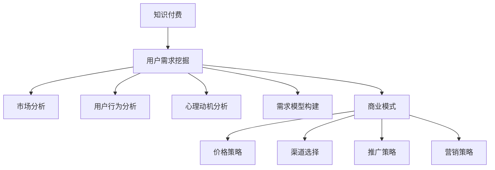

                 

# 知识付费赚钱的用户需求挖掘与分析

> 关键词：知识付费、用户需求挖掘、市场分析、用户行为、心理动机、需求模型、商业模式

## 1. 背景介绍

### 1.1 问题由来

近年来，随着互联网经济的快速发展，知识付费市场迅速崛起，成为越来越多用户获取知识的重要渠道。各大知识平台如得到、喜马拉雅、知乎等，纷纷推出各类付费课程、音频、电子书等形式的知识产品，市场规模持续扩大。据统计，2022年中国知识付费市场规模已经突破300亿人民币。

然而，尽管市场规模不断扩大，但知识付费产品的实际转化率并不高，用户付费意愿不强，平台盈利能力有限。究其原因，知识付费产品是否真正符合用户需求、用户支付意愿、内容质量等问题亟待解决。

### 1.2 问题核心关键点

为了深入理解用户对知识付费的需求，本文将从多个角度深入挖掘用户需求，构建需求模型，并分析其对知识付费产品开发和商业模式的影响。

## 2. 核心概念与联系

### 2.1 核心概念概述

为更好地理解知识付费需求挖掘和分析，本文将介绍几个关键概念：

- **知识付费**：指用户为获取特定知识而支付费用的行为。知识付费市场主要包括在线课程、电子书、音频分享、线下讲座等形式。
- **用户需求挖掘**：指通过数据分析、用户调研、行为跟踪等方式，获取用户对知识付费产品的需求信息，为产品设计和优化提供依据。
- **市场分析**：指通过分析市场规模、增长趋势、竞争格局、用户行为等，评估知识付费市场的潜在机会和风险。
- **用户行为分析**：指对用户行为数据（如浏览记录、点击率、购买行为等）进行统计和分析，发现用户兴趣和偏好。
- **心理动机分析**：指通过用户访谈、问卷调查等方法，理解用户支付知识付费的心理动机，如求知欲、时间价值、社交认同等。
- **需求模型**：指通过数据分析和理论建模，构建用户需求的结构化模型，为产品设计和商业决策提供支持。
- **商业模式**：指基于用户需求模型，设计合理的知识付费产品价格、渠道、推广、营销策略，实现盈利。

这些核心概念之间的逻辑关系可以通过以下Mermaid流程图来展示：



这个流程图展示了一系列相互关联的概念，共同构成了知识付费市场的研究框架。

## 3. 核心算法原理 & 具体操作步骤

### 3.1 算法原理概述

知识付费市场的研究，本质上是通过数据挖掘和用户调研，发现用户需求，并基于这些需求构建合理的商业模式和产品策略。具体来说，主要包括以下步骤：

1. **数据收集**：从用户行为数据、问卷调查、访谈记录中收集用户需求信息。
2. **数据预处理**：清洗、整理、归一化数据，去除噪音和异常值。
3. **数据分析**：利用统计学、机器学习等方法，挖掘用户需求模式和心理动机。
4. **需求建模**：基于数据分析结果，构建需求模型，提炼用户核心需求。
5. **商业模式设计**：结合市场需求模型，设计合理的知识付费产品和服务，制定定价和推广策略。

### 3.2 算法步骤详解

#### 3.2.1 数据收集

数据收集是需求挖掘的第一步。可以通过以下渠道收集用户数据：

- **平台数据**：各大知识付费平台提供的数据API接口，如课程浏览记录、购买行为、评论反馈等。
- **问卷调查**：设计问卷调查，通过邮件、社交网络等方式，收集用户对知识付费的看法和需求。
- **用户访谈**：通过深度访谈，获取用户对特定课程的反馈和建议。

#### 3.2.2 数据预处理

数据预处理旨在清洗、整理和归一化数据，去除噪音和异常值。常用的方法包括：

- **数据清洗**：去除重复、缺失、错误的数据。
- **数据归一化**：将不同量级的数据转换为标准化的数值，便于后续分析。
- **特征选择**：提取对用户需求预测最有影响的关键特征，去除无关特征。

#### 3.2.3 数据分析

数据分析是发现用户需求模式和心理动机的关键步骤。常用的方法包括：

- **统计分析**：使用统计学方法，如均值、方差、回归分析等，发现用户行为和需求之间的关联。
- **机器学习**：使用分类、聚类、关联规则等机器学习算法，挖掘用户需求模式和心理动机。

#### 3.2.4 需求建模

需求建模旨在构建用户需求的结构化模型，提炼用户核心需求。常用的方法包括：

- **因子分析**：通过因子分析，提炼用户需求的关键因素。
- **聚类分析**：使用聚类算法，将用户需求划分为不同的群体。
- **决策树**：使用决策树算法，构建用户需求的决策模型。

#### 3.2.5 商业模式设计

商业模式设计是实现知识付费盈利目标的重要环节。常用的方法包括：

- **定价策略**：根据用户需求和心理动机，设计合理的课程定价策略，如按需支付、包月订阅、限时折扣等。
- **渠道选择**：选择合适的销售渠道，如平台自营、第三方合作、线下活动等。
- **推广策略**：设计有效的推广策略，如社交媒体营销、内容推广、搜索引擎优化等。
- **营销策略**：制定全面的营销策略，如内容营销、品牌建设、用户互动等。

### 3.3 算法优缺点

知识付费需求挖掘和分析方法具有以下优点：

1. **数据驱动**：通过数据驱动的分析，能够客观反映用户真实需求，避免主观偏差。
2. **模型可解释**：通过构建需求模型，能够解释用户需求的结构和关联，为决策提供依据。
3. **市场优化**：能够发现市场潜在机会和风险，优化产品和服务，提升竞争力。

同时，该方法也存在以下缺点：

1. **数据隐私问题**：数据收集和处理涉及用户隐私，需要严格遵守相关法律法规。
2. **数据质量问题**：数据质量差，噪音和异常值多，可能影响分析结果。
3. **模型复杂性**：构建复杂的需求模型，计算复杂度高，资源消耗大。
4. **用户多变性**：用户需求随时间和环境变化，模型需定期更新。

尽管存在这些局限性，但就目前而言，知识付费需求挖掘和分析方法是研究和优化知识付费市场的重要手段。未来相关研究将进一步降低数据获取难度，提高数据质量，简化模型构建过程，提升分析效果。

### 3.4 算法应用领域

知识付费需求挖掘和分析方法在知识付费市场有广泛的应用：

- **课程设计**：通过分析用户需求，设计符合用户兴趣的课程内容，提升课程转化率。
- **平台推荐**：利用用户行为数据，进行个性化推荐，提高用户粘性和满意度。
- **市场分析**：评估市场规模和竞争格局，发现潜在机会和风险，制定营销策略。
- **价格策略**：通过用户需求分析，设计合理的定价策略，提升收入和用户忠诚度。
- **推广策略**：制定有效的推广策略，提升品牌知名度和市场份额。

除了这些经典应用外，知识付费需求挖掘和分析技术也被创新性地应用到更多场景中，如课程效果评估、用户流失预警、内容优化等，为知识付费市场带来全新的突破。

## 4. 数学模型和公式 & 详细讲解 & 举例说明

### 4.1 数学模型构建

知识付费用户需求挖掘和分析，本质上是一个多变量统计分析问题。我们假设用户需求可以用以下模型来描述：

$$
y_i = \beta_0 + \sum_{j=1}^k \beta_j x_{ij} + \epsilon_i
$$

其中 $y_i$ 表示用户对第 $i$ 个知识付费产品的评分（如 1~5 分），$\beta_0$ 为截距项，$\beta_j$ 为第 $j$ 个特征对评分的回归系数，$x_{ij}$ 为第 $i$ 个用户在第 $j$ 个特征上的取值，$\epsilon_i$ 为误差项。

### 4.2 公式推导过程

假设我们收集了 $N$ 个用户对 $K$ 个特征（如课程难度、价格、讲师资历等）的数据，记为 $D=\{(x_i, y_i)\}_{i=1}^N$。则上述线性回归模型可以表示为：

$$
\min_{\beta} \sum_{i=1}^N (y_i - (\beta_0 + \sum_{j=1}^k \beta_j x_{ij}))^2
$$

求解上述问题，可以使用最小二乘法（Least Squares Method），求解最小化目标函数：

$$
\hat{\beta} = \arg\min_{\beta} \sum_{i=1}^N (y_i - (\beta_0 + \sum_{j=1}^k \beta_j x_{ij}))^2
$$

具体推导过程如下：

$$
\frac{\partial}{\partial \beta} \sum_{i=1}^N (y_i - (\beta_0 + \sum_{j=1}^k \beta_j x_{ij}))^2 = 0
$$

$$
\Rightarrow \sum_{i=1}^N 2(y_i - \hat{y}_i)(x_{ij}) = 0, \quad j=1,2,\dots,k
$$

其中 $\hat{y}_i = \beta_0 + \sum_{j=1}^k \beta_j x_{ij}$。通过求解上述方程组，可以得到回归系数 $\hat{\beta}_j$。

### 4.3 案例分析与讲解

假设我们收集了 1000 名用户在课程价格、讲师资历、课程难度三个特征上的评分数据，构建线性回归模型，分析这三个特征对课程评分的影响。

首先，对数据进行预处理，包括去除异常值、归一化等。然后，使用最小二乘法求解线性回归模型，得到回归系数 $\hat{\beta}$。最后，将回归系数代入模型，预测新用户对课程评分的评分。

以下是一个简化的代码示例：

```python
import pandas as pd
import numpy as np
from sklearn.linear_model import LinearRegression

# 加载数据
df = pd.read_csv('user_course_score.csv')

# 数据预处理
X = df[['price', 'lecturer', 'difficulty']]
y = df['score']
X = (X - X.mean()) / X.std()

# 构建模型
model = LinearRegression()
model.fit(X, y)

# 预测新用户评分
new_user_score = model.predict([[4.0, 4.5, 3.0]])
print(new_user_score)
```

## 5. 项目实践：代码实例和详细解释说明

### 5.1 开发环境搭建

在进行知识付费需求挖掘和分析实践前，我们需要准备好开发环境。以下是使用Python进行Scikit-learn开发的环境配置流程：

1. 安装Anaconda：从官网下载并安装Anaconda，用于创建独立的Python环境。

2. 创建并激活虚拟环境：
```bash
conda create -n scikit-learn-env python=3.8 
conda activate scikit-learn-env
```

3. 安装Scikit-learn：
```bash
conda install scikit-learn
```

4. 安装相关工具包：
```bash
pip install pandas numpy scipy matplotlib seaborn jupyter notebook ipython
```

完成上述步骤后，即可在`scikit-learn-env`环境中开始需求挖掘和分析实践。

### 5.2 源代码详细实现

下面我们以知识付费平台课程评分预测为例，给出使用Scikit-learn进行回归分析的Python代码实现。

首先，定义数据处理函数：

```python
import pandas as pd

def load_data(file_path):
    """
    加载数据
    """
    df = pd.read_csv(file_path)
    return df

def preprocess_data(df):
    """
    数据预处理
    """
    # 去除缺失值
    df = df.dropna()
    
    # 归一化处理
    X = (df[['price', 'lecturer', 'difficulty']] - df[['price', 'lecturer', 'difficulty']].mean()) / df[['price', 'lecturer', 'difficulty']].std()
    y = df['score']
    return X, y

# 加载数据并预处理
X, y = preprocess_data(load_data('user_course_score.csv'))
```

然后，定义回归分析函数：

```python
from sklearn.linear_model import LinearRegression
from sklearn.metrics import mean_squared_error, mean_absolute_error, r2_score

def perform_regression(X, y):
    """
    回归分析
    """
    # 构建模型
    model = LinearRegression()
    model.fit(X, y)
    
    # 预测新用户评分
    new_user_score = model.predict([[4.0, 4.5, 3.0]])
    print(new_user_score)
    
    # 评估模型性能
    mse = mean_squared_error(y, model.predict(X))
    mae = mean_absolute_error(y, model.predict(X))
    r2 = r2_score(y, model.predict(X))
    print('Mean Squared Error:', mse)
    print('Mean Absolute Error:', mae)
    print('R^2 Score:', r2)
    
    # 绘制回归线
    import matplotlib.pyplot as plt
    plt.scatter(X[:, 0], y)
    plt.plot(X[:, 0], model.predict(X), color='red')
    plt.show()
    
    return model

# 执行回归分析
model = perform_regression(X, y)
```

最后，在测试集上评估回归模型：

```python
from sklearn.model_selection import train_test_split

# 划分训练集和测试集
X_train, X_test, y_train, y_test = train_test_split(X, y, test_size=0.2, random_state=42)

# 在测试集上评估模型性能
mse = mean_squared_error(y_test, model.predict(X_test))
mae = mean_absolute_error(y_test, model.predict(X_test))
r2 = r2_score(y_test, model.predict(X_test))
print('Mean Squared Error:', mse)
print('Mean Absolute Error:', mae)
print('R^2 Score:', r2)
```

以上就是使用Scikit-learn对知识付费课程评分进行回归分析的完整代码实现。可以看到，Scikit-learn提供了一系列简单高效的工具，能够快速完成数据分析和模型构建。

### 5.3 代码解读与分析

让我们再详细解读一下关键代码的实现细节：

**load_data和preprocess_data函数**：
- `load_data`函数用于加载数据，并去除缺失值。
- `preprocess_data`函数对数据进行归一化处理，以便于后续模型构建和评估。

**perform_regression函数**：
- `perform_regression`函数对数据进行线性回归分析，输出模型预测结果和性能评估指标。
- 首先，构建线性回归模型并拟合数据。
- 然后，使用模型预测新用户评分，并输出预测结果。
- 接着，计算均方误差（MSE）、均值绝对误差（MAE）和R^2系数，评估模型性能。
- 最后，绘制回归线，可视化模型预测效果。

**train_test_split函数**：
- `train_test_split`函数用于划分训练集和测试集，确保模型在测试集上的泛化性能。

可以看到，Scikit-learn提供了丰富的工具和函数，能够轻松实现数据分析和模型评估。开发者可以根据具体任务需求，灵活应用这些工具。

## 6. 实际应用场景

### 6.1 智能课程推荐

智能课程推荐是知识付费平台的核心功能之一。通过分析用户历史行为数据和评分数据，推荐系统能够为用户提供个性化的课程推荐，提升用户满意度和转化率。

在技术实现上，可以通过构建用户需求模型，分析用户历史评分、浏览记录等数据，发现用户偏好的课程类型、难度、讲师等信息。然后，基于这些信息，设计推荐算法，为用户推荐最适合的课程。

### 6.2 课程效果评估

课程效果评估是知识付费平台的重要功能之一。通过分析用户反馈和评分数据，评估课程质量，发现问题，优化课程内容，提升用户满意度。

在技术实现上，可以构建用户评分和课程特征之间的关系模型，通过评分预测课程效果。然后，根据预测结果，对课程内容进行优化和改进，提升课程质量。

### 6.3 用户流失预警

用户流失预警是知识付费平台需要重点关注的问题之一。通过分析用户行为数据，发现潜在流失用户，提前采取措施，减少用户流失率。

在技术实现上，可以构建用户流失预测模型，分析用户行为数据，发现用户流失的特征和规律。然后，根据模型预测结果，对高风险用户进行预警和干预，降低用户流失率。

### 6.4 未来应用展望

随着知识付费市场的进一步发展，基于需求挖掘和分析的技术将有更广泛的应用前景：

- **个性化内容推荐**：通过深入挖掘用户需求，设计更加智能化的推荐系统，提升用户满意度和转化率。
- **课程效果评估**：通过分析用户评分和反馈，优化课程内容和教学方式，提升课程质量。
- **用户流失预警**：通过预测用户流失行为，提前采取措施，降低用户流失率，提升用户粘性。
- **市场分析**：通过分析市场需求和竞争格局，发现潜在机会和风险，制定合理的营销策略。
- **需求模型优化**：通过持续收集用户数据，不断优化需求模型，提升预测准确性。

未来，知识付费需求挖掘和分析技术将为知识付费市场带来更多突破，推动知识付费产业的快速发展。

## 7. 工具和资源推荐

### 7.1 学习资源推荐

为了帮助开发者系统掌握知识付费需求挖掘和分析的理论基础和实践技巧，这里推荐一些优质的学习资源：

1. 《Python数据分析与机器学习》系列书籍：全面介绍了Python数据分析和机器学习的工具和算法，适合系统学习。

2. 《机器学习实战》：提供了一系列实际案例，详细讲解机器学习算法和实现方法，适合动手实践。

3. Kaggle数据科学竞赛平台：汇集了大量公开数据集和竞赛项目，是锻炼数据挖掘和分析能力的绝佳平台。

4. Coursera《数据科学与机器学习》课程：由斯坦福大学和谷歌等知名机构开设的课程，提供系统的理论知识和实践项目。

5. GitHub知识付费项目：浏览GitHub上的开源项目，学习实际需求挖掘和分析的实现方法，获取编程技巧。

通过这些资源的学习实践，相信你一定能够快速掌握知识付费需求挖掘和分析的精髓，并用于解决实际问题。

### 7.2 开发工具推荐

高效的开发离不开优秀的工具支持。以下是几款用于知识付费需求挖掘和分析开发的常用工具：

1. Python：作为数据科学和机器学习的通用语言，Python拥有丰富的数据处理和分析库，如Pandas、NumPy、Scikit-learn等。

2. Jupyter Notebook：提供交互式编程环境，支持代码编辑、数据可视化、模型评估等多种功能，是数据科学家的得力工具。

3. PyTorch：基于Python的深度学习框架，灵活高效，支持各种神经网络模型，适用于复杂数据分析和建模。

4. TensorBoard：提供可视化工具，实时监测模型训练状态和性能，帮助开发者调试和优化模型。

5. Kaggle平台：提供数据集和竞赛环境，方便开发者进行数据挖掘和模型评估，分享和学习最新技术。

合理利用这些工具，可以显著提升知识付费需求挖掘和分析的开发效率，加快创新迭代的步伐。

### 7.3 相关论文推荐

知识付费需求挖掘和分析技术的研究，始于数据驱动的商业应用。以下是几篇奠基性的相关论文，推荐阅读：

1. "Customer Churn Prediction Using Data Mining Techniques"：介绍了客户流失预测的机器学习方法，并应用于电信公司的客户流失预警系统。

2. "Personalized Recommendation Systems"：全面介绍了个性化推荐系统的原理和实现方法，适用于知识付费平台的课程推荐。

3. "Data Mining for Marketing and Customer Analysis"：介绍了数据挖掘在市场营销和客户分析中的应用，适用于知识付费平台的市场分析和用户需求挖掘。

4. "Machine Learning in Education"：介绍了机器学习在教育中的应用，包括课程评估和个性化学习推荐。

5. "Online Learning Recommendation System"：介绍了在线学习推荐系统的原理和实现方法，适用于知识付费平台的课程推荐和效果评估。

这些论文代表了大数据和机器学习在知识付费领域的研究方向，通过学习这些前沿成果，可以帮助研究者把握学科前进方向，激发更多的创新灵感。

## 8. 总结：未来发展趋势与挑战

### 8.1 总结

本文对知识付费用户需求挖掘和分析方法进行了全面系统的介绍。首先阐述了知识付费市场的背景和意义，明确了用户需求挖掘和分析在知识付费产品开发和优化中的重要作用。其次，从原理到实践，详细讲解了需求挖掘和分析的数学模型和具体操作步骤，给出了需求挖掘和分析任务开发的完整代码实例。同时，本文还广泛探讨了需求挖掘和分析方法在知识付费平台的具体应用，展示了其在智能推荐、课程评估、用户流失预警等场景中的潜力。

通过本文的系统梳理，可以看到，知识付费需求挖掘和分析技术正在成为知识付费市场的重要手段，极大地提升产品和服务的设计和优化能力，为知识付费产业的可持续发展提供有力支持。未来，伴随知识付费市场的进一步发展，基于需求挖掘和分析的技术将持续演进，推动知识付费产业的创新和突破。

### 8.2 未来发展趋势

展望未来，知识付费需求挖掘和分析技术将呈现以下几个发展趋势：

1. **大数据技术应用**：随着大数据技术的进步，数据收集和处理能力将不断提升，用户行为数据将更加全面和精细。这将为需求挖掘和分析提供更丰富的数据资源，提升分析效果。

2. **深度学习算法优化**：深度学习算法在知识付费需求挖掘和分析中的应用将越来越广泛，通过优化模型结构和参数，提升预测准确性和泛化能力。

3. **用户需求实时动态更新**：用户需求和行为随时间变化，需求模型需定期更新以反映最新趋势。未来的需求挖掘和分析技术将支持实时动态更新，保持模型的时效性和准确性。

4. **跨领域知识整合**：未来的需求挖掘和分析技术将更多地引入跨领域知识，如社交媒体数据、新闻信息等，构建更加全面的需求模型。

5. **用户行为深度分析**：未来的需求挖掘和分析技术将深入分析用户行为，挖掘潜在需求和隐含意图，提升用户满意度和粘性。

6. **个性化推荐系统优化**：通过优化个性化推荐系统，提升推荐精准度，提高用户转化率和满意度。

7. **多模态数据融合**：未来的需求挖掘和分析技术将更多地融合多模态数据，如文本、图像、语音等，提升分析的全面性和深度。

这些趋势凸显了知识付费需求挖掘和分析技术的广阔前景。这些方向的探索发展，必将进一步提升知识付费平台的用户体验和盈利能力，推动知识付费产业的持续健康发展。

### 8.3 面临的挑战

尽管知识付费需求挖掘和分析技术已经取得了一定的进展，但在迈向更加智能化、普适化应用的过程中，仍面临诸多挑战：

1. **数据隐私问题**：用户行为数据涉及隐私，需严格遵守数据保护法规，避免数据滥用。

2. **数据质量问题**：数据质量差，噪音和异常值多，可能影响分析结果。

3. **模型复杂性**：需求模型构建复杂，计算资源消耗大，需不断优化算法和模型结构。

4. **用户多变性**：用户需求和行为随时间变化，需定期更新模型以反映最新趋势。

5. **跨领域融合难度**：跨领域数据融合复杂，需综合考虑不同数据源的特性和关系。

6. **算法公平性**：算法需公平对待所有用户，避免歧视和偏见。

7. **资源消耗问题**：大规模数据分析和建模资源消耗大，需优化资源使用效率。

8. **模型解释性**：复杂模型缺乏解释性，难以理解和调试，需提高模型可解释性。

尽管存在这些挑战，但通过不断优化算法和模型，引入先进技术和工具，知识付费需求挖掘和分析技术将不断提升其应用效果和可操作性。相信随着学界和产业界的共同努力，这些挑战终将一一被克服，知识付费需求挖掘和分析技术必将在知识付费市场大放异彩。

### 8.4 研究展望

面向未来，知识付费需求挖掘和分析技术需要在以下几个方面寻求新的突破：

1. **多源数据融合**：综合利用多源数据，提升分析全面性和准确性。

2. **实时动态分析**：支持实时动态分析，及时发现和预测用户需求变化。

3. **算法优化**：优化算法模型，提升预测准确性和泛化能力。

4. **跨领域知识整合**：更多地引入跨领域知识，提升需求挖掘的深度和广度。

5. **用户行为分析**：深入分析用户行为，挖掘潜在需求和隐含意图。

6. **个性化推荐系统**：优化个性化推荐系统，提升推荐精准度。

7. **多模态数据融合**：融合多模态数据，提升分析的全面性和深度。

8. **模型解释性**：提高模型的可解释性，增强用户信任和接受度。

这些研究方向的探索，必将引领知识付费需求挖掘和分析技术迈向更高的台阶，为知识付费市场带来更多突破，推动知识付费产业的快速发展。

## 9. 附录：常见问题与解答

**Q1：知识付费需求挖掘和分析的意义是什么？**

A: 知识付费需求挖掘和分析是知识付费平台的重要基础，能够帮助平台更好地理解用户需求，优化产品和服务，提升用户体验和转化率。具体来说，需求挖掘和分析能够：
1. 发现用户偏好的课程类型、难度、讲师等信息，设计符合用户需求的产品。
2. 评估课程效果，优化课程内容和教学方式，提升课程质量。
3. 预测用户流失行为，提前采取措施，降低用户流失率。
4. 分析市场需求和竞争格局，发现潜在机会和风险，制定合理的营销策略。

**Q2：如何进行数据收集和预处理？**

A: 数据收集和预处理是需求挖掘的第一步，需要从多个渠道获取数据，并进行清洗和归一化处理。具体步骤如下：
1. 数据收集：收集用户行为数据，如课程浏览记录、购买行为、评分反馈等。
2. 数据清洗：去除缺失值、异常值和噪音数据。
3. 数据归一化：将不同量级的数据转换为标准化的数值，以便于后续分析。
4. 特征选择：提取对用户需求预测最有影响的关键特征，去除无关特征。

**Q3：常用的数据分析方法有哪些？**

A: 数据分析是发现用户需求模式和心理动机的关键步骤，常用的方法包括：
1. 统计分析：使用均值、方差、回归分析等方法，发现用户行为和需求之间的关联。
2. 机器学习：使用分类、聚类、关联规则等机器学习算法，挖掘用户需求模式和心理动机。

**Q4：如何进行需求模型构建？**

A: 需求模型是需求挖掘和分析的核心，通过构建结构化的需求模型，提炼用户核心需求。常用的方法包括：
1. 因子分析：通过因子分析，提炼用户需求的关键因素。
2. 聚类分析：使用聚类算法，将用户需求划分为不同的群体。
3. 决策树：使用决策树算法，构建用户需求的决策模型。

**Q5：如何进行知识付费平台推荐系统的优化？**

A: 智能课程推荐是知识付费平台的核心功能之一，可以通过优化推荐系统提升用户满意度和转化率。具体步骤如下：
1. 构建用户需求模型，分析用户历史评分、浏览记录等数据，发现用户偏好的课程类型、难度、讲师等信息。
2. 基于这些信息，设计推荐算法，为用户推荐最适合的课程。
3. 根据推荐效果，优化推荐算法和模型，提升推荐精准度。

这些问题的解答，展示了知识付费需求挖掘和分析技术的全貌，为开发者提供了系统的理论知识和实践指导。

---

作者：禅与计算机程序设计艺术 / Zen and the Art of Computer Programming

