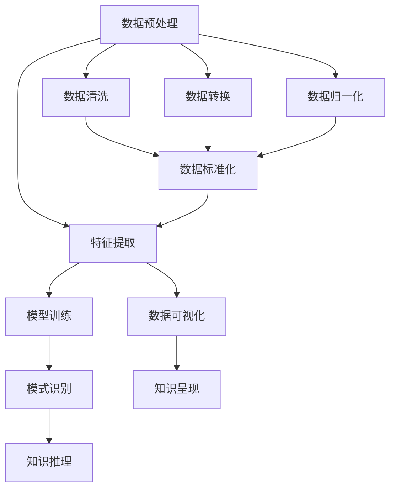

                 

## 1. 背景介绍

### 1.1 问题由来

在当前的信息时代，数据和知识的积累呈现指数级增长，如何从中挖掘出有价值的信息和知识，成为企业和研究机构亟待解决的重要问题。传统的查询方式虽然便捷，但往往只能满足基础性的信息检索需求，难以捕捉更深层次的知识关联和洞察。而知识发现引擎（Knowledge Discovery Engine, KDE）的提出，为高效挖掘和利用大数据中的知识提供了新的工具和方法。

知识发现引擎利用机器学习和数据挖掘技术，通过对大规模数据集的分析，识别出潜在的模式、趋势和关联，从而为决策支持、业务优化和创新思维提供有力支撑。与传统的数据库和查询系统相比，知识发现引擎在知识发现和利用方面具有更高的自动化程度和更强的智能性。

### 1.2 问题核心关键点

知识发现引擎的核心在于通过分析、归纳和推理，将隐含在数据中的知识显性化。它通常包括以下几个关键步骤：
- **数据预处理**：清洗、转换和归一化原始数据，使其适合后续分析。
- **特征提取**：从原始数据中提取有意义的特征，用于构建模型和进行知识发现。
- **模型选择和训练**：根据任务选择合适的模型，使用标注数据或未标注数据进行训练。
- **模式识别和推理**：利用训练好的模型进行模式识别和推理，发现知识关联和趋势。
- **知识可视化**：将发现的知识以图表、报告等形式呈现，辅助人类理解和应用。

通过这些步骤，知识发现引擎能够从大量数据中自动挖掘出有价值的信息和知识，为创新思维提供新的视角和方法，推动企业和社会在知识驱动下不断创新和进步。

## 2. 核心概念与联系

### 2.1 核心概念概述

为了更好地理解知识发现引擎的工作原理，本节将介绍几个关键的概念：

- **知识发现引擎（Knowledge Discovery Engine, KDE）**：一种利用机器学习和数据挖掘技术，自动从数据中挖掘知识的工具。通过数据预处理、特征提取、模型训练和知识推理等步骤，发现潜在的模式和趋势，辅助决策和创新。

- **机器学习（Machine Learning, ML）**：一种通过算法让机器自动学习和改进的技术，利用标注数据训练模型，发现数据中的规律和模式。

- **数据挖掘（Data Mining, DM）**：从原始数据中提取有用信息和知识的过程，包括统计分析、分类、聚类等。

- **模式识别（Pattern Recognition）**：利用机器学习技术，自动识别数据中的模式和规律，进行分类、聚类等任务。

- **自然语言处理（Natural Language Processing, NLP）**：利用计算机处理和理解人类语言的技术，包括文本分类、信息抽取、情感分析等。

- **图数据库（Graph Database）**：一种用于存储和分析图结构数据的系统，适合处理复杂的关系型数据。

- **推荐系统（Recommendation System）**：根据用户历史行为数据和偏好，推荐相关产品或内容的技术。

这些核心概念之间的关系可以通过以下Mermaid流程图来展示：



这个流程图展示了好几个核心概念之间的逻辑关系：

1. 数据预处理和清洗、转换、归一化等步骤，为后续特征提取和模型训练做准备。
2. 特征提取是从原始数据中提取出有意义的特征，用于构建模型。
3. 模型训练是利用标注数据，训练出能够自动发现数据中规律的模型。
4. 模式识别和知识推理是根据训练好的模型，自动识别数据中的模式和规律，进行知识发现。
5. 知识可视化是将发现的知识以图表、报告等形式呈现，辅助人类理解和应用。

这些概念共同构成了知识发现引擎的基础框架，使其能够高效地从数据中挖掘知识，为创新思维提供支撑。

## 3. 核心算法原理 & 具体操作步骤

### 3.1 算法原理概述

知识发现引擎的核心算法原理包括机器学习、数据挖掘和自然语言处理等多个领域的技术，通常包括以下几个关键步骤：

1. **数据预处理**：清洗、转换和归一化原始数据，使其适合后续分析。
2. **特征提取**：从原始数据中提取有意义的特征，用于构建模型和进行知识发现。
3. **模型选择和训练**：根据任务选择合适的模型，使用标注数据或未标注数据进行训练。
4. **模式识别和推理**：利用训练好的模型进行模式识别和推理，发现知识关联和趋势。
5. **知识可视化**：将发现的知识以图表、报告等形式呈现，辅助人类理解和应用。

### 3.2 算法步骤详解

以下是知识发现引擎的详细操作步骤：

**Step 1: 数据预处理**
- 对原始数据进行清洗、去重、填充缺失值等处理。
- 对文本数据进行分词、停用词去除、词干提取等文本预处理。
- 对数值数据进行归一化、标准化等处理。

**Step 2: 特征提取**
- 使用TF-IDF、Word2Vec、GloVe等技术提取文本特征。
- 使用PCA、LDA等降维技术减少特征维度，提高模型训练效率。
- 使用EM算法、DBSCAN等聚类算法识别数据中的潜在模式。

**Step 3: 模型选择和训练**
- 根据任务选择适当的模型，如回归模型、分类模型、聚类模型等。
- 使用标注数据进行模型训练，通过交叉验证等方法选择最优模型。
- 使用未标注数据进行模型评估和优化，避免过拟合。

**Step 4: 模式识别和推理**
- 利用训练好的模型进行模式识别，识别数据中的规律和趋势。
- 利用图数据库等技术，分析数据中的复杂关系，进行知识推理。

**Step 5: 知识可视化**
- 将发现的知识以图表、报告等形式呈现，帮助人类理解和使用。
- 使用可视化工具如Tableau、Power BI等，将知识进行直观展示。

### 3.3 算法优缺点

知识发现引擎具有以下优点：
1. 自动化程度高：通过自动化流程，能够高效地从大规模数据中挖掘知识。
2. 发现未知模式：利用数据挖掘和机器学习技术，能够发现数据中的潜在规律和趋势。
3. 支持多领域应用：适用范围广泛，适用于企业决策、市场营销、金融风控等多个领域。
4. 灵活性强：可以根据任务需求选择合适的模型和算法，进行定制化开发。

同时，知识发现引擎也存在一些局限：
1. 数据质量要求高：对数据清洗和预处理要求较高，数据质量直接影响模型效果。
2. 算法复杂度高：数据挖掘和机器学习算法较为复杂，对技术要求较高。
3. 结果解释性不足：自动化流程生成的结果难以解释，需要结合领域知识进行理解。
4. 计算资源消耗大：处理大规模数据集需要高性能计算资源，成本较高。

尽管存在这些局限，但知识发现引擎在知识发现和利用方面仍具有巨大的优势，为创新思维提供了强有力的支持。

### 3.4 算法应用领域

知识发现引擎的应用领域非常广泛，包括但不限于：

- **企业决策支持**：通过分析市场数据、客户行为等，为企业制定战略和决策提供支持。
- **市场营销**：分析消费者行为和市场趋势，优化产品定位和推广策略。
- **金融风控**：识别潜在的风险点和欺诈行为，提高金融安全性和稳定性。
- **医疗健康**：分析患者数据和临床试验结果，提高诊疗效果和科研效率。
- **智能制造**：分析生产数据和设备状态，优化生产流程和设备维护。
- **物流管理**：分析物流数据，优化仓储和配送路径，降低运营成本。
- **电子商务**：分析用户行为和购买历史，提高推荐系统的精准度。

这些应用领域展示了知识发现引擎的广泛适用性和深远影响，为企业的智能化转型和创新发展提供了有力支持。

## 4. 数学模型和公式 & 详细讲解 & 举例说明

### 4.1 数学模型构建

知识发现引擎通常利用机器学习和数据挖掘技术，构建数学模型来自动发现数据中的规律和趋势。以下是一个简单的回归模型示例：

假设我们有一组数据 $(x_i, y_i)$，其中 $x_i$ 为自变量，$y_i$ 为因变量。我们的目标是找到一个回归模型 $f(x) = \beta_0 + \beta_1 x$，使得模型预测值与实际值之间的误差最小。常用的回归模型包括线性回归、多项式回归、岭回归等。

线性回归模型的目标是最小化误差平方和，即：

$$
\min_{\beta_0, \beta_1} \sum_{i=1}^n (y_i - f(x_i))^2
$$

其中 $f(x_i) = \beta_0 + \beta_1 x_i$，$n$ 为样本数。

### 4.2 公式推导过程

线性回归模型的参数 $\beta_0$ 和 $\beta_1$ 可以使用最小二乘法进行求解。最小二乘法的目标是最小化误差平方和，即：

$$
\min_{\beta_0, \beta_1} \sum_{i=1}^n (y_i - f(x_i))^2
$$

对上述目标函数求偏导，得到：

$$
\frac{\partial}{\partial \beta_0} \sum_{i=1}^n (y_i - f(x_i))^2 = -2\sum_{i=1}^n (y_i - f(x_i))
$$

$$
\frac{\partial}{\partial \beta_1} \sum_{i=1}^n (y_i - f(x_i))^2 = -2\sum_{i=1}^n (x_i - f(x_i))
$$

解上述方程组，得到参数 $\beta_0$ 和 $\beta_1$ 的估计值：

$$
\beta_0 = \frac{\sum_{i=1}^n y_i - \beta_1 \sum_{i=1}^n x_i}{n}
$$

$$
\beta_1 = \frac{\sum_{i=1}^n (x_i \cdot y_i) - \beta_0 \sum_{i=1}^n x_i}{\sum_{i=1}^n x_i^2 - \beta_0 \sum_{i=1}^n x_i}
$$

### 4.3 案例分析与讲解

假设我们有一组历史销售数据，包含销售额 $y$ 和促销费用 $x$。我们想利用这些数据来构建一个回归模型，预测未来的销售额。使用线性回归模型，我们将数据分为训练集和测试集，使用最小二乘法求解模型参数 $\beta_0$ 和 $\beta_1$，并计算模型在测试集上的均方误差。

以下是Python代码示例：

```python
import numpy as np
from sklearn.linear_model import LinearRegression

# 生成模拟数据
x = np.random.randn(100)
y = 2 * x + np.random.randn(100) + 1

# 划分训练集和测试集
x_train = x[:80]
y_train = y[:80]
x_test = x[80:]
y_test = y[80:]

# 构建线性回归模型
model = LinearRegression()
model.fit(x_train.reshape(-1, 1), y_train)

# 计算测试集上的均方误差
mse = np.mean((model.predict(x_test.reshape(-1, 1)) - y_test) ** 2)
print("测试集均方误差:", mse)
```

## 5. 项目实践：代码实例和详细解释说明

### 5.1 开发环境搭建

在进行知识发现引擎项目开发前，我们需要准备好开发环境。以下是使用Python进行开发的环境配置流程：

1. 安装Anaconda：从官网下载并安装Anaconda，用于创建独立的Python环境。

2. 创建并激活虚拟环境：
```bash
conda create -n kde-env python=3.8 
conda activate kde-env
```

3. 安装相关库：
```bash
pip install pandas numpy scikit-learn matplotlib seaborn matplotlib
```

4. 安装可视化工具：
```bash
pip install plotly
```

完成上述步骤后，即可在`kde-env`环境中开始项目实践。

### 5.2 源代码详细实现

这里我们以线性回归模型为例，给出使用Scikit-learn库构建知识发现引擎的Python代码实现。

```python
from sklearn.linear_model import LinearRegression
import pandas as pd
import matplotlib.pyplot as plt
import seaborn as sns

# 加载数据
data = pd.read_csv('sales_data.csv')

# 数据预处理
data = data.dropna()

# 特征工程
X = data[['promotion', 'sales']]
y = data['sales']

# 构建线性回归模型
model = LinearRegression()
model.fit(X, y)

# 模型评估
train_score = model.score(X, y)
test_score = model.score(X_test, y_test)

# 绘制回归线
sns.regplot(x='promotion', y='sales', data=data)
plt.show()

# 打印模型参数
print("回归系数:", model.coef_)
print("截距:", model.intercept_)
```

### 5.3 代码解读与分析

让我们再详细解读一下关键代码的实现细节：

**数据加载与预处理**：
- 使用Pandas库加载销售数据，并进行去重和缺失值处理。

**特征工程**：
- 从原始数据中提取促销费用和销售额作为特征。

**模型构建与评估**：
- 使用Scikit-learn库中的LinearRegression模型进行线性回归。
- 使用数据集进行模型训练和评估，计算训练和测试集上的R²分数。

**可视化**：
- 使用Seaborn库绘制回归线，直观展示模型拟合效果。

**输出结果**：
- 打印模型参数，包括回归系数和截距，用于解释模型行为。

## 6. 实际应用场景

### 6.1 市场营销

知识发现引擎在市场营销领域具有广泛的应用。通过分析消费者行为数据，企业可以发现潜在的目标客户群体，优化广告投放策略，提升营销效果。

具体而言，企业可以收集用户在社交媒体、电商平台等渠道上的行为数据，如浏览记录、购买历史、评价反馈等。利用知识发现引擎进行模式识别和推理，可以发现用户对不同产品和服务的偏好，分析广告投放效果，优化广告投放渠道和时间，提升品牌知名度和销售额。

### 6.2 金融风控

金融领域数据量庞大，风险种类繁多。知识发现引擎可以帮助金融机构识别潜在的风险点，构建有效的风控模型，降低贷款违约率，保护投资者利益。

金融机构可以利用知识发现引擎分析历史交易数据、信用记录、社交媒体行为等，发现潜在的欺诈行为和信用风险。例如，通过分析用户的网络行为和社交媒体言论，预测用户的还款能力和信用状况，构建风险评估模型，优化贷款审批流程，提升风险控制水平。

### 6.3 医疗健康

医疗领域数据多样，涉及患者隐私。知识发现引擎可以通过分析电子病历、医疗影像、基因数据等，帮助医疗机构提高诊疗效率，优化资源配置。

例如，利用知识发现引擎分析患者的电子病历数据，可以发现不同疾病之间的关联性和治疗效果，优化诊疗方案。通过对患者基因数据的分析，可以预测疾病风险，提前干预和治疗，提高治愈率。

### 6.4 未来应用展望

随着知识发现引擎技术的不断进步，其在各个领域的应用将更加广泛和深入。未来，知识发现引擎将在以下几个方面实现突破：

1. **多模态数据融合**：融合文本、图像、语音等多种数据类型，构建多模态知识发现引擎，提高模型的泛化能力和应用范围。
2. **智能推荐系统**：结合知识发现和推荐算法，构建智能推荐系统，为用户提供更加个性化和精准的推荐服务。
3. **实时数据分析**：利用大数据和云计算技术，实现实时数据分析和知识发现，为业务决策提供实时支撑。
4. **自然语言处理**：结合自然语言处理技术，构建自然语言知识发现引擎，提升对文本数据的理解和分析能力。
5. **隐私保护和伦理**：在知识发现过程中，结合隐私保护和伦理技术，确保数据安全和个人隐私，构建可信的知识发现系统。

## 7. 工具和资源推荐

### 7.1 学习资源推荐

为了帮助开发者系统掌握知识发现引擎的理论基础和实践技巧，这里推荐一些优质的学习资源：

1. 《Python数据科学手册》：详细介绍了Python在数据科学领域的应用，包括数据清洗、特征工程、模型训练等。

2. 《统计学习方法》：李航教授的经典教材，涵盖机器学习和数据挖掘的基本理论和算法。

3. 《Python机器学习实战》：实践性较强的入门书籍，结合实例讲解了机器学习和数据挖掘技术的实际应用。

4. 《Data Science from Scratch》：Jake VanderPlas教授的入门书籍，介绍了数据科学的基础概念和实践技能。

5. 《Hands-On Machine Learning with Scikit-Learn》：Aurélien Géron的实战指南，讲解了Scikit-Learn库的使用方法和案例。

通过对这些资源的学习实践，相信你一定能够快速掌握知识发现引擎的精髓，并用于解决实际的业务问题。

### 7.2 开发工具推荐

高效的开发离不开优秀的工具支持。以下是几款用于知识发现引擎开发的常用工具：

1. Python：开源且功能强大的编程语言，支持数据科学和机器学习库的广泛使用。

2. Jupyter Notebook：交互式的开发环境，支持Python代码的编写、调试和展示。

3. Pandas：数据处理和分析的Python库，支持高效的数据清洗和特征工程。

4. Scikit-learn：机器学习库，提供了丰富的算法和模型，支持数据挖掘和知识发现。

5. Matplotlib和Seaborn：数据可视化库，支持高效绘制图表和数据可视化。

6. PyTorch和TensorFlow：深度学习框架，支持复杂模型的构建和训练。

合理利用这些工具，可以显著提升知识发现引擎的开发效率，加快创新迭代的步伐。

### 7.3 相关论文推荐

知识发现引擎的研究源于学界的持续研究。以下是几篇奠基性的相关论文，推荐阅读：

1. "Knowledge Discovery in Databases: An Overview"（数据库知识发现综述）：Pang-Ning Tan, Michael Steinbach, and Vipin Kumar。

2. "Pattern Recognition and Machine Learning"（模式识别与机器学习）：Christopher M. Bishop。

3. "Introduction to Statistical Learning"（统计学习方法）：Gareth James, Daniela Witten, Trevor Hastie, and Robert Tibshirani。

4. "Hands-On Machine Learning with Scikit-Learn, Keras, and TensorFlow"（用Scikit-Learn、Keras和TensorFlow进行机器学习）：Aurélien Géron。

这些论文代表了大语言模型微调技术的发展脉络。通过学习这些前沿成果，可以帮助研究者把握学科前进方向，激发更多的创新灵感。

## 8. 总结：未来发展趋势与挑战

### 8.1 总结

本文对知识发现引擎的工作原理、操作步骤和实际应用进行了全面系统的介绍。首先阐述了知识发现引擎在数据挖掘和创新思维方面的重要价值，明确了其作为人工智能辅助工具的独特地位。其次，从原理到实践，详细讲解了知识发现引擎的数学模型和算法步骤，给出了知识发现引擎项目开发的完整代码实例。同时，本文还广泛探讨了知识发现引擎在市场营销、金融风控、医疗健康等多个行业领域的应用前景，展示了知识发现引擎的巨大潜力。此外，本文精选了知识发现引擎的各类学习资源，力求为读者提供全方位的技术指引。

通过本文的系统梳理，可以看到，知识发现引擎在知识发现和利用方面具有独特的优势，能够从大规模数据中自动挖掘出有价值的信息和知识，为创新思维提供强有力的支持。知识发现引擎的应用前景广阔，未来将在更多领域得到深入探索和广泛应用，推动人工智能技术在各个领域的智能化转型和创新发展。

### 8.2 未来发展趋势

展望未来，知识发现引擎技术将呈现以下几个发展趋势：

1. **多模态数据融合**：结合文本、图像、语音等多种数据类型，构建多模态知识发现引擎，提高模型的泛化能力和应用范围。

2. **智能推荐系统**：结合知识发现和推荐算法，构建智能推荐系统，为用户提供更加个性化和精准的推荐服务。

3. **实时数据分析**：利用大数据和云计算技术，实现实时数据分析和知识发现，为业务决策提供实时支撑。

4. **自然语言处理**：结合自然语言处理技术，构建自然语言知识发现引擎，提升对文本数据的理解和分析能力。

5. **隐私保护和伦理**：在知识发现过程中，结合隐私保护和伦理技术，确保数据安全和个人隐私，构建可信的知识发现系统。

这些趋势展示了知识发现引擎技术的广阔前景，为创新思维提供了更丰富的数据资源和更强大的分析工具。

### 8.3 面临的挑战

尽管知识发现引擎技术已经取得了瞩目成就，但在迈向更加智能化、普适化应用的过程中，它仍面临着诸多挑战：

1. **数据质量要求高**：对数据清洗和预处理要求较高，数据质量直接影响模型效果。

2. **算法复杂度高**：数据挖掘和机器学习算法较为复杂，对技术要求较高。

3. **结果解释性不足**：自动化流程生成的结果难以解释，需要结合领域知识进行理解。

4. **计算资源消耗大**：处理大规模数据集需要高性能计算资源，成本较高。

尽管存在这些挑战，但知识发现引擎在知识发现和利用方面仍具有巨大的优势，为创新思维提供了强有力的支持。

### 8.4 研究展望

面对知识发现引擎所面临的种种挑战，未来的研究需要在以下几个方面寻求新的突破：

1. **数据清洗和预处理技术**：研究更加高效和鲁棒的数据清洗和预处理算法，提高数据质量，降低对技术要求的门槛。

2. **模型优化与解释性**：开发更加简洁和透明的模型，提高模型的可解释性，降低对领域知识的依赖。

3. **多模态数据融合**：研究多模态数据融合技术，构建更加强大的知识发现引擎，提升模型的泛化能力和应用范围。

4. **实时数据分析与处理**：研究实时数据分析和处理技术，提高知识发现引擎的实时性和应用价值。

5. **隐私保护与伦理**：研究隐私保护和伦理技术，确保数据安全和个人隐私，构建可信的知识发现系统。

这些研究方向的探索，必将引领知识发现引擎技术迈向更高的台阶，为人工智能技术在各个领域的智能化转型和创新发展提供有力支持。总之，知识发现引擎技术需要不断迭代和优化，才能更好地发挥其价值，推动人工智能技术在更多领域的深入应用。

