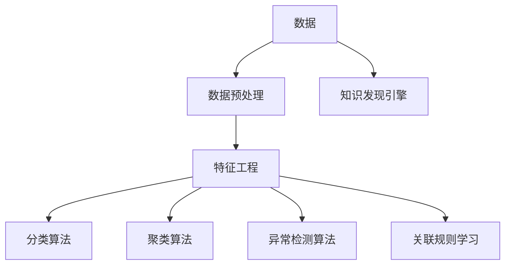

                 

# 知识发现引擎助力程序员职业转型

在当今快速发展的技术环境中，程序员面临的不仅是技术的挑战，更是一场职业转型的马拉松。如何从传统编程转变为解决复杂问题的知识发现者，成为每个程序员亟待解决的课题。本文将深入探讨知识发现引擎的原理与应用，并在此基础上提供具体的实践指导，助力程序员职业转型。

## 1. 背景介绍

### 1.1 问题由来
随着人工智能(AI)和机器学习(ML)技术的日益成熟，数据驱动的决策和知识发现成为新的生产力。程序员不再仅仅是代码的编写者，更是数据的挖掘者和知识的发现者。面对数据量和复杂度的爆炸式增长，传统的编程思维和技术框架已经难以应对。

### 1.2 问题核心关键点
知识发现引擎(Knowledge Discovery Engine, KDE)，又称为数据挖掘(Data Mining)或数据驱动分析，是通过算法从海量数据中发现有用模式、关联规则、异常值等的工具。它能够帮助程序员从数据中提取洞见，辅助业务决策，甚至自动生成代码和模型。

知识发现引擎的应用不仅限于金融、医疗、电商等数据密集型行业，对于任何需要进行复杂问题解决的领域，如智能交通、智慧城市、智能制造等，都具有重要意义。因此，掌握知识发现引擎技术，对于程序员的职业转型至关重要。

## 2. 核心概念与联系

### 2.1 核心概念概述

为更好地理解知识发现引擎的原理与应用，本节将介绍几个密切相关的核心概念：

- **知识发现引擎(KDE)**：通过算法自动从大量数据中提取有用模式、关联规则和异常值的工具。
- **数据预处理**：在数据挖掘之前，对原始数据进行清洗、归一化、降维等处理，以提高数据质量。
- **特征工程**：通过特征选择、特征提取和特征构建等方法，提高模型对数据的适应性。
- **分类算法**：如决策树、随机森林、支持向量机等，用于对数据进行分类和预测。
- **聚类算法**：如K-Means、层次聚类等，用于发现数据中的群体和结构。
- **异常检测算法**：如孤立森林、DBSCAN等，用于识别数据中的异常点或离群值。
- **关联规则学习**：如Apriori、FP-Growth等，用于发现数据中的关联规律和趋势。

这些核心概念之间的逻辑关系可以通过以下Mermaid流程图来展示：



这个流程图展示了几大核心概念及其之间的关系：

1. 数据是知识发现的基础。
2. 数据预处理和特征工程是提高数据质量的关键步骤。
3. 分类、聚类、异常检测和关联规则学习等算法，通过不同的视角和算法模型，从数据中提取有用信息。
4. 知识发现引擎将这些信息整合并反馈到业务应用中，指导决策和行动。

## 3. 核心算法原理 & 具体操作步骤

### 3.1 算法原理概述

知识发现引擎的原理可以简单概括为：在数据预处理的基础上，通过一系列算法模型从数据中发现模式和规则，并用于决策和预测。知识发现过程通常包括以下几个步骤：

1. **数据准备**：包括数据收集、数据清洗、数据归一化、缺失值处理等。
2. **特征选择和构建**：通过领域知识和算法自动选择或构建影响决策的特征。
3. **模型训练**：选择合适的算法模型，如分类、聚类、回归等，训练模型。
4. **模型评估**：使用交叉验证、AUC、精确率、召回率等指标评估模型性能。
5. **模型应用**：将训练好的模型应用于实际问题中，提供决策建议。

### 3.2 算法步骤详解

以下以分类问题为例，详细阐述知识发现引擎的构建和应用过程。

#### 3.2.1 数据准备
假设我们有一组数据集，其中包含特征$x_1, x_2, ..., x_n$和标签$y$，其中$y \in \{0,1\}$表示分类结果。

数据准备过程包括：
1. **数据收集**：收集相关数据，如用户行为记录、商品销售数据等。
2. **数据清洗**：删除重复记录、缺失值、异常值等，保证数据质量。
3. **数据归一化**：将数据转换为标准范围，如$[0,1]$或$[-1,1]$，以便算法处理。
4. **缺失值处理**：对缺失值进行填充或删除，保持数据完整性。

#### 3.2.2 特征选择和构建
特征选择和构建是知识发现中极为重要的步骤。以下是几种常见的特征处理方法：

1. **特征选择**：通过统计、领域知识、模型评估等方法，选择最有用的特征。
   - **相关系数**：计算特征与目标变量之间的相关性，选择高度相关的特征。
   - **信息增益**：计算特征对分类任务的信息贡献，选择信息增益最大的特征。
   - **嵌入式选择**：将特征选择嵌入模型训练过程中，如Lasso回归、随机森林等。

2. **特征构建**：通过组合、转换等方式，生成新的特征。
   - **组合特征**：将已有特征进行组合，如多项式特征、交互特征等。
   - **转换特征**：对已有特征进行转换，如对数值型特征进行对数、指数转换。
   - **新兴特征**：引入领域知识，生成专家特征，如用户活跃度、广告曝光率等。

#### 3.2.3 模型训练
选择适合的算法模型，如决策树、随机森林、支持向量机等，训练模型。

以决策树为例，其训练过程包括：
1. **分裂选择**：选择最优的特征和分裂点，将数据集分为左右子集。
2. **递归分裂**：对子集重复上述过程，直到满足停止条件，如节点纯度、最小样本数等。
3. **剪枝优化**：对生成的决策树进行剪枝，防止过拟合。

#### 3.2.4 模型评估
使用交叉验证、AUC、精确率、召回率等指标评估模型性能。

以精确率和召回率为例，其计算公式如下：

$$
Precision = \frac{TP}{TP+FP}
$$

$$
Recall = \frac{TP}{TP+FN}
$$

其中，TP表示真正例，FP表示假正例，FN表示假反例。

#### 3.2.5 模型应用
将训练好的模型应用于实际问题中，提供决策建议。

以用户分类问题为例，使用训练好的模型对新用户进行分类，判断其是否购买商品，并据此推荐商品或进行营销。

### 3.3 算法优缺点

知识发现引擎的优点包括：
1. 自动化程度高。通过算法自动发现数据中的规律，减少人工干预。
2. 适用范围广。适用于各种类型的数据和问题，具有较强的泛化能力。
3. 模型解释性好。决策过程透明，便于理解和调试。

同时，知识发现引擎也存在一定的局限性：
1. 数据质量要求高。数据预处理和特征工程对算法结果影响较大。
2. 模型复杂度高。高维数据和复杂算法易造成过拟合。
3. 结果解释性差。模型复杂，难以解释其内部决策机制。

尽管存在这些局限性，但知识发现引擎在解决复杂问题、辅助决策和业务优化方面具有不可替代的作用。

### 3.4 算法应用领域

知识发现引擎在金融、医疗、电商、智能交通等多个领域得到了广泛应用。以下是几个典型的应用场景：

#### 3.4.1 金融风险管理
在金融领域，知识发现引擎可以用于信用评分、欺诈检测、市场预测等。通过分析用户的历史交易数据、信用记录、行为模式等，构建风险评估模型，帮助银行和金融机构降低风险。

#### 3.4.2 医疗健康管理
在医疗领域，知识发现引擎可以用于疾病预测、药物推荐、健康管理等。通过分析患者的电子健康记录、基因数据、生活方式等，构建健康预测模型，提供个性化医疗建议。

#### 3.4.3 智能营销
在电商领域，知识发现引擎可以用于用户行为分析、商品推荐、广告优化等。通过分析用户的浏览、购买、评价等行为数据，构建推荐模型，提升用户满意度，增加销售额。

#### 3.4.4 智能交通管理
在智能交通领域，知识发现引擎可以用于交通流量预测、事故预防、路径优化等。通过分析交通流量、天气条件、道路状况等数据，构建交通预测模型，优化交通管理，减少交通拥堵。

## 4. 数学模型和公式 & 详细讲解 & 举例说明

### 4.1 数学模型构建

假设我们有一组数据集$D=\{(x_i,y_i)\}_{i=1}^N$，其中$x_i \in \mathbb{R}^n$表示特征向量，$y_i \in \{0,1\}$表示分类标签。我们使用决策树算法进行分类，其数学模型可以表示为：

$$
T = \{(r_b, C_b)\}_{b=1}^m
$$

其中，$T$表示决策树模型，$r_b \in \{0,1\}$表示叶子节点，$C_b$表示叶子节点的分类结果。

### 4.2 公式推导过程

以下以决策树为例，推导其基本算法流程。

#### 4.2.1 分裂选择
对于数据集$D$，选择一个最优特征$x_j$和一个最优分裂点$x_j^\star$，将数据集分为左子集$D_L$和右子集$D_R$。

假设我们选择特征$x_j$，其分裂点$x_j^\star$为中位数，则分裂过程可以表示为：

$$
D_L = \{(x_i,y_i)|x_j^\star \leq x_j \land y_i=1\}
$$

$$
D_R = \{(x_i,y_i)|x_j^\star > x_j \land y_i=1\}
$$

#### 4.2.2 递归分裂
对左子集和右子集重复上述过程，直到满足停止条件，如节点纯度、最小样本数等。

假设停止条件为节点包含样本数大于等于$k$，则决策树构建过程可以表示为：

$$
T = \bigcup_{b=1}^m T_b
$$

其中，$T_b$表示第$b$个叶子节点对应的决策树。

#### 4.2.3 剪枝优化
对生成的决策树进行剪枝，防止过拟合。

常用的剪枝方法包括预剪枝和后剪枝。预剪枝在构建决策树时，对节点进行剪枝；后剪枝在构建完整决策树后，对树进行剪枝。剪枝的目的是减少树的深度和叶节点数量，提高泛化性能。

### 4.3 案例分析与讲解

假设我们有一组客户购买数据，包括客户ID、年龄、性别、收入、购买金额、购买频率等特征。我们使用决策树算法进行分类，判断客户是否为高价值客户。

1. **数据准备**：收集客户购买数据，并进行清洗、归一化、缺失值处理等。
2. **特征选择**：选择高相关的特征，如收入、购买金额、购买频率等。
3. **模型训练**：构建决策树模型，并进行交叉验证，评估模型性能。
4. **模型应用**：对新客户进行分类，标记为高价值客户或普通客户，据此进行针对性营销。

## 5. 项目实践：代码实例和详细解释说明

### 5.1 开发环境搭建

在进行知识发现引擎的实践前，我们需要准备好开发环境。以下是使用Python进行Scikit-learn开发的环境配置流程：

1. 安装Anaconda：从官网下载并安装Anaconda，用于创建独立的Python环境。

2. 创建并激活虚拟环境：
```bash
conda create -n kde-env python=3.8 
conda activate kde-env
```

3. 安装Scikit-learn：
```bash
pip install scikit-learn
```

4. 安装各类工具包：
```bash
pip install numpy pandas scikit-learn matplotlib tqdm jupyter notebook ipython
```

完成上述步骤后，即可在`kde-env`环境中开始知识发现引擎的实践。

### 5.2 源代码详细实现

下面以用户分类问题为例，给出使用Scikit-learn进行决策树模型的PyTorch代码实现。

首先，定义数据处理函数：

```python
from sklearn.model_selection import train_test_split
from sklearn.preprocessing import StandardScaler
from sklearn.tree import DecisionTreeClassifier
import numpy as np

def prepare_data(X, y):
    X_train, X_test, y_train, y_test = train_test_split(X, y, test_size=0.2, random_state=42)
    scaler = StandardScaler()
    X_train = scaler.fit_transform(X_train)
    X_test = scaler.transform(X_test)
    return X_train, X_test, y_train, y_test
```

然后，定义模型和评估函数：

```python
from sklearn.metrics import accuracy_score
from sklearn.tree import DecisionTreeClassifier

def train_and_evaluate(X_train, X_test, y_train, y_test):
    model = DecisionTreeClassifier()
    model.fit(X_train, y_train)
    y_pred = model.predict(X_test)
    acc = accuracy_score(y_test, y_pred)
    print(f"Accuracy: {acc:.3f}")
    return model
```

最后，启动训练流程并在测试集上评估：

```python
from sklearn.datasets import load_breast_cancer

# 加载数据集
data = load_breast_cancer()
X = data.data
y = data.target

# 数据预处理
X_train, X_test, y_train, y_test = prepare_data(X, y)

# 模型训练和评估
model = train_and_evaluate(X_train, X_test, y_train, y_test)
```

以上就是使用Scikit-learn对决策树模型进行用户分类问题的完整代码实现。可以看到，得益于Scikit-learn的强大封装，我们可以用相对简洁的代码完成决策树模型的训练和评估。

### 5.3 代码解读与分析

让我们再详细解读一下关键代码的实现细节：

**prepare_data函数**：
- 定义数据准备过程，包括数据分割、特征归一化和数据预处理。
- 返回训练集、测试集、标签和预处理后的特征。

**train_and_evaluate函数**：
- 定义模型训练和评估过程，使用交叉验证评估模型性能。
- 输出模型的准确率，并返回训练好的模型。

**训练流程**：
- 加载乳腺癌数据集，并进行数据预处理。
- 调用训练和评估函数，得到训练好的模型和评估结果。

可以看到，Scikit-learn提供了方便的API和工具，极大地简化了模型的构建和评估过程。开发者只需关注数据处理和模型设计，而Scikit-learn负责模型的训练和优化，降低了入门的门槛。

当然，工业级的系统实现还需考虑更多因素，如模型保存和部署、超参数的自动搜索、更灵活的任务适配层等。但核心的知识发现引擎构建流程基本与此类似。

## 6. 实际应用场景

### 6.1 智能推荐系统

知识发现引擎可以用于构建智能推荐系统，提升用户体验和推荐效果。通过分析用户的历史行为数据，发现用户偏好和行为模式，构建推荐模型，生成个性化的推荐结果。

以电商推荐系统为例，知识发现引擎可以分析用户浏览、点击、购买、评价等数据，发现用户的兴趣点，构建推荐模型，提供个性化推荐服务，增加用户粘性和转化率。

### 6.2 金融风险管理

知识发现引擎可以用于金融风险管理，构建信用评分、欺诈检测等模型，辅助银行和金融机构进行风险评估和决策。

在信用评分方面，通过分析用户的收入、负债、行为记录等数据，构建信用评分模型，预测用户的还款能力和还款意愿，帮助金融机构评估贷款风险。

在欺诈检测方面，通过分析用户的交易记录、账户活动等数据，构建欺诈检测模型，识别异常交易行为，及时预警和防止欺诈风险。

### 6.3 医疗健康管理

知识发现引擎可以用于医疗健康管理，构建疾病预测、药物推荐等模型，提供个性化医疗建议和健康管理服务。

在疾病预测方面，通过分析患者的电子健康记录、基因数据、生活方式等数据，构建疾病预测模型，预测患者的疾病风险，提供预防和干预建议。

在药物推荐方面，通过分析患者的病情、用药历史、基因信息等数据，构建药物推荐模型，推荐合适的药物和剂量，提高治疗效果和减少副作用。

### 6.4 智能交通管理

知识发现引擎可以用于智能交通管理，构建交通流量预测、事故预防等模型，优化交通管理和减少交通拥堵。

在交通流量预测方面，通过分析交通流量、天气条件、道路状况等数据，构建交通预测模型，预测未来的交通状况，优化交通管理策略。

在事故预防方面，通过分析交通事故记录、天气情况、驾驶行为等数据，构建事故预测模型，预测潜在的事故风险，提前采取预防措施。

## 7. 工具和资源推荐

### 7.1 学习资源推荐

为了帮助开发者系统掌握知识发现引擎的理论基础和实践技巧，这里推荐一些优质的学习资源：

1. 《Python数据科学手册》：系统介绍了Python在数据科学中的应用，包括数据处理、特征工程、模型构建等。

2. 《机器学习实战》：详细介绍了各种机器学习算法和实际应用案例，适合初学者和从业者。

3. 《Scikit-learn实战》：介绍了Scikit-learn库的使用方法，涵盖数据预处理、模型构建、模型评估等。

4. Coursera《数据科学导论》课程：由约翰·霍普金斯大学开设，全面介绍了数据科学的基本概念和实际应用。

5. Kaggle数据科学竞赛平台：提供大量真实数据集和实际竞赛任务，通过实践积累经验。

通过对这些资源的学习实践，相信你一定能够快速掌握知识发现引擎的精髓，并用于解决实际的业务问题。

### 7.2 开发工具推荐

高效的开发离不开优秀的工具支持。以下是几款用于知识发现引擎开发的常用工具：

1. Python：广泛使用的编程语言，有丰富的库和工具支持。
2. Scikit-learn：数据挖掘和机器学习工具库，提供了丰富的算法模型和API。
3. TensorFlow：Google开源的深度学习框架，适合大规模工程应用。
4. PyTorch：Facebook开源的深度学习框架，灵活便捷，适合研究和实验。
5. Jupyter Notebook：交互式编程环境，适合数据探索和模型调试。

合理利用这些工具，可以显著提升知识发现引擎的开发效率，加快创新迭代的步伐。

### 7.3 相关论文推荐

知识发现引擎的研究源于学界的持续研究。以下是几篇奠基性的相关论文，推荐阅读：

1. ID3算法：Quinlan提出的决策树算法，是知识发现领域的重要里程碑。

2. C4.5算法：扩展了ID3算法，支持分类和回归问题，具有更好的泛化性能。

3. K-Means算法：用于聚类分析，发现数据中的群体和结构。

4. Apriori算法：用于关联规则学习，发现数据中的关联规律和趋势。

5. 集成学习算法：如Bagging、Boosting、Stacking等，通过组合多个模型，提高预测性能和鲁棒性。

这些论文代表了大规模知识发现引擎的发展脉络。通过学习这些前沿成果，可以帮助研究者把握学科前进方向，激发更多的创新灵感。

## 8. 总结：未来发展趋势与挑战

### 8.1 总结

本文对知识发现引擎的原理与应用进行了全面系统的介绍。首先阐述了知识发现引擎的研究背景和意义，明确了其对程序员职业转型的重要性。其次，从原理到实践，详细讲解了知识发现引擎的数学模型和操作步骤，给出了知识发现引擎任务开发的完整代码实例。同时，本文还广泛探讨了知识发现引擎在智能推荐、金融风险管理、医疗健康管理等实际应用场景中的应用前景，展示了知识发现引擎的巨大潜力。此外，本文精选了知识发现引擎的学习资源，力求为读者提供全方位的技术指引。

通过本文的系统梳理，可以看到，知识发现引擎已成为数据驱动决策的重要工具，其应用前景广阔，对程序员的职业转型具有重要意义。未来，伴随预训练语言模型和微调方法的持续演进，相信知识发现引擎必将与AI技术深度融合，进一步拓展其应用边界，为程序员提供更多的职业转型机会。

### 8.2 未来发展趋势

展望未来，知识发现引擎的发展趋势将呈现以下几个方向：

1. 自动化程度提升。随着机器学习技术的进步，知识发现引擎将更加自动化，减少人工干预。
2. 深度学习算法融合。结合深度学习算法，提升模型的复杂度和泛化能力。
3. 多模态数据融合。将视觉、语音、文本等多模态数据进行融合，构建更全面、准确的知识发现模型。
4. 实时性要求提高。知识发现引擎将逐渐实现实时性，及时捕捉数据变化，提供实时决策支持。
5. 隐私保护加强。对数据进行隐私保护，确保数据安全性和合法性。

以上趋势凸显了知识发现引擎的前景和潜力。这些方向的探索发展，必将进一步提升知识发现引擎的性能和应用范围，为数据驱动决策带来新的突破。

### 8.3 面临的挑战

尽管知识发现引擎已经取得了显著的进展，但在迈向更加智能化、普适化应用的过程中，它仍面临诸多挑战：

1. 数据质量瓶颈。数据质量对知识发现引擎的性能影响较大，需要有效处理缺失值、异常值等问题。
2. 模型复杂度高。高维数据和复杂算法易造成过拟合，需要采取正则化、剪枝等措施。
3. 结果解释性差。复杂模型难以解释其内部决策机制，需要进一步提升模型的可解释性。
4. 实时性要求高。实时性要求较高，需要优化算法和系统架构，提升处理速度。
5. 隐私保护问题。数据隐私和安全问题不容忽视，需要采取加密、匿名化等措施。

尽管存在这些挑战，但知识发现引擎在解决复杂问题、辅助决策和业务优化方面具有不可替代的作用。相信通过技术创新和协同合作，知识发现引擎的未来发展前景将更加广阔。

### 8.4 研究展望

面对知识发现引擎所面临的种种挑战，未来的研究需要在以下几个方面寻求新的突破：

1. 引入深度学习算法。结合深度学习算法，提高模型的复杂度和泛化能力。
2. 融合多模态数据。将视觉、语音、文本等多模态数据进行融合，构建更全面、准确的知识发现模型。
3. 引入因果推断。通过因果推断方法，提高模型的解释性和鲁棒性。
4. 加强隐私保护。对数据进行隐私保护，确保数据安全性和合法性。

这些研究方向的探索，必将引领知识发现引擎技术迈向更高的台阶，为构建安全、可靠、可解释、可控的智能系统铺平道路。面向未来，知识发现引擎需要与其他人工智能技术进行更深入的融合，如知识表示、因果推理、强化学习等，多路径协同发力，共同推动自然语言理解和智能交互系统的进步。只有勇于创新、敢于突破，才能不断拓展知识发现引擎的边界，让智能技术更好地造福人类社会。

## 9. 附录：常见问题与解答

**Q1：知识发现引擎是否适用于所有数据集？**

A: 知识发现引擎适用于大多数数据集，但需要根据数据特性进行选择和调整。对于稀疏数据和异常数据较多的数据集，可能需要采用特定的算法和处理方法。

**Q2：如何选择合适的特征进行特征选择？**

A: 特征选择的方法包括相关系数、信息增益、嵌入式选择等。通常根据领域知识和实际问题进行选择，选择与目标变量高度相关的特征。

**Q3：如何处理缺失值和异常值？**

A: 缺失值处理的方法包括均值填充、中位数填充、删除等。异常值处理的方法包括删除、替换、修正等。

**Q4：如何优化知识发现引擎的性能？**

A: 优化知识发现引擎的性能需要从数据预处理、特征选择、模型选择和超参数调优等多个方面进行综合考虑。可以通过交叉验证、AUC、精确率、召回率等指标评估模型性能，并采用网格搜索、随机搜索等方法进行超参数调优。

**Q5：知识发现引擎是否适用于分布式计算环境？**

A: 知识发现引擎可以应用于分布式计算环境，通过并行计算和分布式算法提升处理速度。

这些问答提供了对知识发现引擎相关问题的详细解答，帮助读者更好地理解和应用知识发现引擎技术。

---

作者：禅与计算机程序设计艺术 / Zen and the Art of Computer Programming

