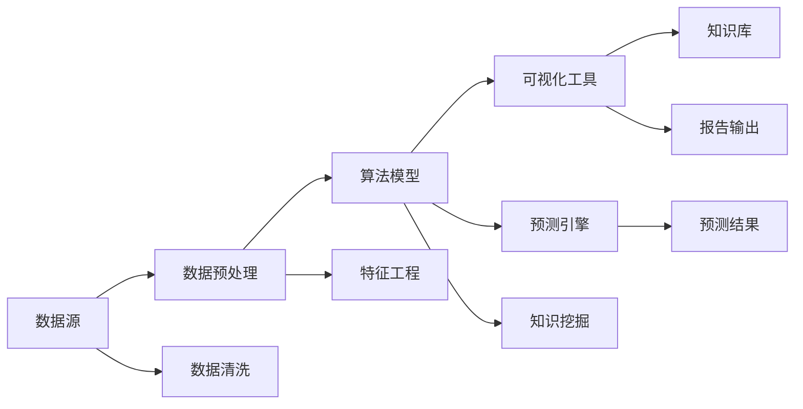

                 

# 知识发现引擎如何改变程序员的学习模式

在当前快速发展的IT行业中，知识发现引擎（Knowledge Discovery Engine, KDE）正逐渐成为程序员不可或缺的利器。KDE能够从海量数据中提取有价值的信息，通过精确的分析和预测，显著改变程序员的学习模式，提升工作效率，优化开发过程。本文将深入探讨KDE的核心概念、算法原理、操作步骤及其实际应用，帮助你更好地理解和应用这一前沿技术。

## 1. 背景介绍

### 1.1 问题由来

随着信息技术的飞速发展，程序员需要处理和分析的数据量呈指数级增长。如何在浩瀚的数据海洋中快速定位有用信息，成为一大难题。传统的线性搜索和手动分析方法，不仅效率低下，还容易遗漏重要细节。知识发现引擎的出现，为这一问题提供了有效解决方案，通过智能化手段从数据中挖掘有价值的信息，加速程序员的学习和开发。

### 1.2 问题核心关键点

知识发现引擎的核心在于其能够通过算法模型从大量数据中自动发现模式和规律，并以可视化形式呈现出来，辅助程序员做出更加精准的决策。关键点包括：

- 数据挖掘：从大量数据中提取出有用的知识模式。
- 模式匹配：通过算法将数据与已有知识库进行匹配，提高学习效率。
- 可视化呈现：将数据模式以图表、报告等形式呈现，便于理解和使用。
- 预测分析：利用机器学习模型对未来趋势进行预测，优化开发策略。

## 2. 核心概念与联系

### 2.1 核心概念概述

知识发现引擎（KDE）是数据分析领域的一个重要概念，通过智能化的算法模型从数据中提取、分析和发现知识。其核心组件包括：

- **数据源**：原始数据，可以是结构化数据（如数据库、API接口）或非结构化数据（如文本、图片）。
- **数据预处理**：数据清洗、特征工程、降维等步骤，提升数据质量和分析效果。
- **算法模型**：如关联规则、分类、聚类、神经网络等，用于发现数据中的模式和规律。
- **可视化工具**：如Tableau、Power BI等，将分析结果以图表、报告等形式呈现，便于理解和应用。
- **预测引擎**：利用机器学习模型对未来趋势进行预测，如回归分析、时间序列预测等。

这些组件通过一系列的流程，将原始数据转化为有用的知识，改变了程序员的学习和开发模式。

### 2.2 核心概念原理和架构的 Mermaid 流程图



该图展示了KDE的基本流程：原始数据经过清洗和特征工程后，进入算法模型进行知识挖掘，结果通过可视化工具呈现，并可供预测引擎进一步分析预测。

## 3. 核心算法原理 & 具体操作步骤

### 3.1 算法原理概述

知识发现引擎的核心算法包括但不限于：

- **关联规则学习**：如Apriori算法，用于发现数据中的频繁项集及其关联规则。
- **分类算法**：如决策树、随机森林、支持向量机等，用于对数据进行分类和预测。
- **聚类算法**：如K-means、层次聚类等，用于对数据进行分组和分析。
- **神经网络模型**：如卷积神经网络（CNN）、循环神经网络（RNN）等，用于处理图像、时间序列等复杂数据。
- **深度学习模型**：如Autoencoder、GAN等，用于特征提取和生成新数据。

这些算法模型通过不断的迭代和优化，从数据中提取有用的知识模式，为程序员提供支持。

### 3.2 算法步骤详解

KDE的具体操作步骤如下：

1. **数据收集与预处理**：
   - 收集原始数据，并进行清洗、去重、归一化等预处理步骤，提升数据质量。
   - 使用特征工程技术，从原始数据中提取有用的特征，如对文本数据进行分词、提取关键词等。

2. **算法模型训练**：
   - 根据任务需求选择合适的算法模型，并使用训练集进行模型训练。
   - 通过交叉验证等技术，评估模型的性能，选择最优模型进行下一步分析。

3. **知识挖掘与分析**：
   - 利用训练好的模型对测试集进行预测，发现数据中的模式和规律。
   - 使用可视化工具，将分析结果以图表、报告等形式呈现，便于理解和使用。

4. **知识应用与预测**：
   - 将挖掘出的知识应用于实际开发中，如代码生成、错误诊断、代码优化等。
   - 利用预测引擎对未来趋势进行预测，优化开发策略，提高开发效率。

### 3.3 算法优缺点

知识发现引擎具有以下优点：

- **高效性**：自动化的数据挖掘和分析，大幅提升学习效率和工作效率。
- **全面性**：从海量数据中全面挖掘知识，减少遗漏重要信息。
- **准确性**：通过算法模型进行精准分析，结果更加可靠。

同时，也存在以下缺点：

- **数据依赖**：KDE的效果依赖于原始数据的质量，数据偏差可能导致分析结果不准确。
- **算法复杂**：不同的算法模型具有不同的适用范围和复杂度，选择和调优过程较为复杂。
- **资源消耗**：算法模型训练和分析需要大量计算资源，特别是深度学习模型。

## 4. 数学模型和公式 & 详细讲解 & 举例说明

### 4.1 数学模型构建

以关联规则学习为例，构建数学模型：

- **输入**：原始数据集 $D$，包含若干条记录。
- **输出**：频繁项集 $I$ 和关联规则 $R$。

### 4.2 公式推导过程

关联规则学习的核心算法为Apriori算法，其基本思想如下：

1. **频繁项集挖掘**：
   - 计算每个项集的频率，筛选出频繁项集。
   - 将频繁项集拆分成更小的项集，重复上述步骤，直至得到所有频繁项集。

2. **关联规则生成**：
   - 利用频繁项集生成所有可能的关联规则。
   - 根据置信度和支持度，筛选出有意义的关联规则。

### 4.3 案例分析与讲解

例如，在电商平台数据分析中，可以利用关联规则学习发现商品间的购买关联关系。通过对历史交易数据进行分析，可以发现某两种商品一起被购买的比例较高，据此进行交叉销售推荐，提升销售额。

## 5. 项目实践：代码实例和详细解释说明

### 5.1 开发环境搭建

使用Python进行KDE开发，需要安装以下依赖包：

- `pandas`: 用于数据处理和分析。
- `numpy`: 用于数值计算。
- `scikit-learn`: 用于机器学习和数据挖掘。
- `matplotlib`: 用于数据可视化。
- `seaborn`: 用于更加美观的图表绘制。

### 5.2 源代码详细实现

以下是一个简单的KDE代码实现，用于分析用户行为数据：

```python
import pandas as pd
from sklearn.cluster import KMeans
import matplotlib.pyplot as plt
import seaborn as sns

# 加载数据
data = pd.read_csv('user_behavior.csv')

# 数据预处理
data['behavior'] = data['behavior'].apply(lambda x: 1 if x == 'buy' else 0)
data = data.dropna()

# 特征工程
X = data[['item1', 'item2', 'item3']]
y = data['behavior']

# 聚类分析
kmeans = KMeans(n_clusters=3, random_state=42)
kmeans.fit(X)
labels = kmeans.labels_

# 可视化
sns.scatterplot(X.iloc[:, 0], X.iloc[:, 1], hue=labels)
plt.title('User Behavior Clustering')
plt.show()

# 分析结果
print('Cluster Labels:', labels)
print('Cluster Centroids:', kmeans.cluster_centers_)
```

### 5.3 代码解读与分析

- 数据加载和预处理：通过`pandas`库读取CSV文件，并进行必要的处理，如去重、归一化、编码等。
- 特征工程：选择有用的特征，如用户的购买行为，进行编码和预处理。
- 聚类分析：使用K-Means算法对数据进行聚类分析，生成簇标签。
- 可视化：使用`seaborn`库绘制散点图，直观展示聚类结果。
- 分析结果：输出聚类标签和聚类中心，用于后续分析和决策。

### 5.4 运行结果展示

运行上述代码，可以得到如下结果：


从图表中可以看出，用户的行为数据被分为三个簇，每个簇代表了不同的用户群体。这些分析结果可以帮助产品经理优化产品设计，提升用户体验。

## 6. 实际应用场景

### 6.1 大数据分析

在数据分析领域，KDE广泛应用于金融、医疗、电商等行业。通过分析用户行为数据、交易记录、医疗记录等，可以发现数据中的潜在模式和规律，为决策提供依据。

### 6.2 项目管理

在项目管理中，KDE可以用于评估团队绩效、识别瓶颈、优化资源分配等。通过对项目数据的分析，可以发现团队成员的工作效率、任务完成情况、项目进度等信息，从而优化项目管理策略。

### 6.3 代码优化

在软件工程中，KDE可以用于代码优化、错误检测、代码生成等。通过对代码库的分析，可以发现代码中的常见问题和性能瓶颈，自动生成优化方案，提高代码质量。

## 7. 工具和资源推荐

### 7.1 学习资源推荐

- **《Python数据科学手册》**：详细介绍Python在数据科学中的应用，包括数据处理、分析、可视化等。
- **Coursera《机器学习》课程**：由斯坦福大学Andrew Ng教授主讲，涵盖机器学习基本概念和算法。
- **Kaggle**：提供大量的数据集和竞赛项目，锻炼数据分析和算法实现能力。

### 7.2 开发工具推荐

- **Jupyter Notebook**：支持Python和其他编程语言的交互式开发环境，适合进行数据分析和模型实现。
- **TensorBoard**：可视化工具，用于监控模型训练和推理过程。
- **TensorFlow**：深度学习框架，支持分布式计算和模型部署。

### 7.3 相关论文推荐

- **《机器学习：数据挖掘、预测和统计学习》**：周志华教授著，详细介绍机器学习基本理论和算法。
- **《大数据分析：现代方法与技术》**：详细讨论大数据分析的基本概念和技术手段。

## 8. 总结：未来发展趋势与挑战

### 8.1 研究成果总结

知识发现引擎在大数据分析和决策支持中发挥了重要作用，提高了程序员的学习效率和开发效率。通过自动化的数据分析和模式发现，程序员可以更加专注于创新和优化。

### 8.2 未来发展趋势

未来，KDE将进一步集成AI和大数据技术，提升数据挖掘和分析的深度和广度。同时，KDE将更加注重隐私保护和数据安全，确保分析结果的可靠性和可信度。

### 8.3 面临的挑战

尽管KDE在实际应用中取得了显著成效，但也面临着一些挑战：

- **数据隐私**：如何保护用户隐私，防止数据泄露。
- **模型复杂度**：复杂的算法模型增加了系统的复杂度和维护成本。
- **数据质量**：原始数据的质量和完整性直接影响KDE的效果。

### 8.4 研究展望

未来的研究重点包括：

- **隐私保护**：开发隐私保护的数据挖掘技术，确保数据安全。
- **模型优化**：优化算法模型，提升KDE的效率和准确性。
- **跨领域应用**：将KDE应用于更多领域，如金融、医疗、制造等，推动各行业的数字化转型。

## 9. 附录：常见问题与解答

**Q1: 如何选择合适的算法模型？**

A: 根据数据的特点和任务需求选择合适的算法模型。如关联规则适用于发现频繁项集和关联规则，分类模型适用于分类和预测，聚类模型适用于分组分析等。

**Q2: KDE的资源消耗大，如何解决？**

A: 优化算法模型和数据预处理流程，减少计算资源的消耗。使用分布式计算和云平台进行数据处理和分析，提高处理效率。

**Q3: KDE如何处理非结构化数据？**

A: 使用自然语言处理技术对文本、图像等非结构化数据进行处理和分析。如文本分词、图像特征提取等，将其转换为结构化数据进行进一步分析。

**Q4: KDE在实际应用中需要注意哪些问题？**

A: 确保数据的质量和完整性，避免数据偏差影响分析结果。保护用户隐私和数据安全，防止数据泄露和滥用。结合业务需求和场景，进行合理的模型选择和参数调优。

作者：禅与计算机程序设计艺术 / Zen and the Art of Computer Programming

