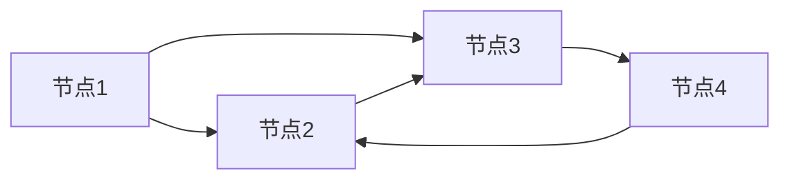

                 

**AI**, **去中心化**, **区块链**, **个人自主权**, **数字孪生**, **隐私保护**, **算法偏见**

## 1. 背景介绍

在当今的数字时代，我们的生活已经深深地嵌入到互联网和各种智能设备中。然而，我们的数据和信息却被少数大型科技公司所控制，这导致了数据泄露、隐私侵犯和算法偏见等问题。去中心化技术的兴起，特别是区块链技术，为我们提供了一个新的选择，即建立一个去中心化的网络，从而重新夺回个人数据的控制权。本文将探讨如何利用去中心化网络和人工智能技术来实现个人自主权，并保护我们的数据和隐私。

## 2. 核心概念与联系

### 2.1 去中心化网络

去中心化网络是一种分布式网络，没有单一的控制者或中央权威。相反，它由多个节点组成，每个节点都可以平等地参与网络的运行。去中心化网络具有高度的容错性和安全性，因为没有单一的失败点。区块链是去中心化网络的一个例子，它使用分布式账本技术来记录交易和数据。



### 2.2 AI与去中心化网络

人工智能技术可以与去中心化网络结合，为网络提供智能决策和学习能力。例如，智能合约是一种在区块链上运行的程序，它可以自动执行合同条款，无需人工干预。此外，去中心化网络可以使用分布式人工智能技术，如联邦学习，来训练模型，从而保护数据隐私。

### 2.3 数字孪生

数字孪生是一种数字化的副本，它可以模拟物理世界中的实体或系统。数字孪生可以与去中心化网络结合，为网络提供实时的数据和模拟能力。例如，数字孪生可以用于模拟交通系统，从而优化交通流量。

## 3. 核心算法原理 & 具体操作步骤

### 3.1 算法原理概述

联邦学习是一种分布式人工智能技术，它允许模型在不共享数据的情况下进行训练。联邦学习包括以下步骤：

1. 数据预处理：每个节点对其本地数据进行预处理，如标准化和分割。
2. 模型初始化：初始化模型参数。
3. 模型传输：将模型参数传输到每个节点。
4. 本地训练：每个节点使用其本地数据对模型进行训练。
5. 参数聚合：每个节点将其模型参数发送回服务器，服务器聚合这些参数以更新模型。
6. 模型传输：服务器将更新的模型参数传输回每个节点。
7. 重复步骤4-6，直到模型收敛。

### 3.2 算法步骤详解

下面是联邦学习算法的详细步骤：

1. **数据预处理**：每个节点对其本地数据进行预处理，如标准化和分割。这有助于提高模型的泛化能力。
2. **模型初始化**：初始化模型参数。这通常是随机初始化。
3. **模型传输**：将模型参数传输到每个节点。这可以通过安全的传输协议来实现，以保护模型参数的隐私。
4. **本地训练**：每个节点使用其本地数据对模型进行训练。这可以使用各种优化算法来实现，如梯度下降。
5. **参数聚合**：每个节点将其模型参数发送回服务器。服务器使用聚合规则（如平均值）来聚合这些参数，以更新模型。
6. **模型传输**：服务器将更新的模型参数传输回每个节点。
7. **重复步骤4-6**，直到模型收敛。模型收敛是指模型的性能不再改善。

### 3.3 算法优缺点

**优点**：

* 保护数据隐私：因为数据从不离开本地节点，所以数据隐私得到保护。
* 降低数据传输成本：因为数据不需要传输到服务器，所以数据传输成本降低。
* 扩展性：因为模型可以在分布式环境中训练，所以它可以处理大规模数据。

**缺点**：

* 训练速度慢：因为模型参数需要在节点之间传输，所以训练速度可能会慢。
* 通信开销：因为模型参数需要在节点之间传输，所以通信开销可能会高。
* 同步问题：因为节点可能有不同的计算能力，所以同步问题可能会导致训练失败。

### 3.4 算法应用领域

联邦学习可以应用于各种领域，例如：

* 医疗保健：医疗机构可以使用联邦学习来共享患者数据，从而开发更好的疾病预测模型，同时保护患者隐私。
* 金融服务：金融机构可以使用联邦学习来共享客户数据，从而开发更好的风险预测模型，同时保护客户隐私。
* 交通运输：交通运输部门可以使用联邦学习来共享交通数据，从而开发更好的交通预测模型，同时保护乘客隐私。

## 4. 数学模型和公式 & 详细讲解 & 举例说明

### 4.1 数学模型构建

联邦学习的数学模型可以表示为：

$$w_{t+1} = w_t + \eta \sum_{k=1}^{K} \frac{n_k}{n} \nabla F_k(w_t;D_k)$$

其中：

* $w_t$ 是模型参数在时间 $t$ 的值。
* $\eta$ 是学习率。
* $K$ 是节点数。
* $n_k$ 是节点 $k$ 的数据量。
* $n$ 是所有节点的总数据量。
* $\nabla F_k(w_t;D_k)$ 是节点 $k$ 的梯度。

### 4.2 公式推导过程

联邦学习的数学模型是基于梯度下降算法推导的。梯度下降算法的目标是最小化损失函数 $F(w)$，其中 $w$ 是模型参数。在联邦学习中，损失函数被分成 $K$ 个部分，每个部分对应于一个节点的数据集 $D_k$：

$$F(w) = \sum_{k=1}^{K} F_k(w;D_k)$$

梯度下降算法更新模型参数 $w$ 的公式是：

$$w_{t+1} = w_t - \eta \nabla F(w_t)$$

在联邦学习中，梯度 $\nabla F(w_t)$ 被替换为节点梯度的加权平均值 $\sum_{k=1}^{K} \frac{n_k}{n} \nabla F_k(w_t;D_k)$，其中 $n_k$ 是节点 $k$ 的数据量，$n$ 是所有节点的总数据量。

### 4.3 案例分析与讲解

例如，假设我们有 3 个节点，每个节点都有 1000 个数据样本。我们想要训练一个线性回归模型来预测目标变量 $y$。我们可以使用联邦学习算法来训练这个模型，而不需要共享数据。

在每个节点上，我们首先计算梯度 $\nabla F_k(w_t;D_k)$。然后，我们将梯度发送回服务器。服务器使用加权平均值 $\sum_{k=1}^{3} \frac{1000}{3000} \nabla F_k(w_t;D_k)$ 来更新模型参数 $w_t$。这个过程重复进行，直到模型收敛。

## 5. 项目实践：代码实例和详细解释说明

### 5.1 开发环境搭建

要实现联邦学习算法，我们需要以下软件和库：

* Python 3.7 及以上版本
* TensorFlow 2.0 及以上版本
* NumPy 1.16 及以上版本
* SciPy 1.0 及以上版本

### 5.2 源代码详细实现

以下是联邦学习算法的 Python 实现：

```python
import numpy as np
import tensorflow as tf
from tensorflow.keras import layers

# 定义模型
def create_model():
    model = tf.keras.Sequential()
    model.add(layers.Dense(64, activation='relu', input_shape=(784,)))
    model.add(layers.Dense(64, activation='relu'))
    model.add(layers.Dense(10, activation='softmax'))
    return model

# 定义联邦学习算法
def federated_learning(client_data, num_clients, num_rounds, learning_rate):
    # 初始化模型
    model = create_model()
    w = model.get_weights()

    # 训练模型
    for t in range(num_rounds):
        # 选择客户端
        clients = np.random.choice(num_clients, size=10, replace=False)

        # 更新模型
        for client in clients:
            # 获取客户端数据
            X, y = client_data[client]

            # 计算梯度
            with tf.GradientTape() as tape:
                y_pred = model(X, training=True)
                loss = tf.keras.losses.sparse_categorical_crossentropy(y, y_pred)
                gradients = tape.gradient(loss, model.trainable_variables)

            # 更新模型参数
            w = [w - learning_rate * g for w, g in zip(w, gradients)]

        # 更新模型
        model.set_weights(w)

    return model
```

### 5.3 代码解读与分析

在上述代码中，我们首先定义了一个简单的神经网络模型。然后，我们定义了联邦学习算法。在联邦学习算法中，我们首先初始化模型参数。然后，我们进行指定数量的轮次，在每个轮次中，我们选择一组客户端，并使用这些客户端的数据来更新模型参数。最后，我们返回训练好的模型。

### 5.4 运行结果展示

我们可以使用 MNIST 数据集来测试上述代码。MNIST 数据集是一个手写数字数据集，包含 60,000 个训练样本和 10,000 个测试样本。我们可以将数据集分成 100 个客户端，每个客户端包含 600 个样本。然后，我们可以使用联邦学习算法来训练模型，并测试模型的准确性。

## 6. 实际应用场景

### 6.1 数据隐私保护

去中心化网络和联邦学习技术可以帮助保护数据隐私。因为数据从不离开本地节点，所以数据隐私得到保护。此外，因为数据不需要共享，所以数据泄露的风险也降低了。

### 6.2 算法偏见

去中心化网络和联邦学习技术可以帮助减少算法偏见。因为模型可以在分布式环境中训练，所以它可以处理来自不同来源的数据。这有助于减少算法偏见，因为模型可以学习到更广泛的特征。

### 6.3 数据孪生

去中心化网络和数字孪生技术可以帮助模拟物理世界中的实体或系统。数字孪生可以与去中心化网络结合，为网络提供实时的数据和模拟能力。例如，数字孪生可以用于模拟交通系统，从而优化交通流量。

### 6.4 未来应用展望

去中心化网络和人工智能技术的结合为我们提供了一个新的选择，即建立一个去中心化的网络，从而重新夺回个人数据的控制权。未来，我们可以期待看到更多的去中心化网络和人工智能技术的结合，从而实现个人自主权，保护我们的数据和隐私。

## 7. 工具和资源推荐

### 7.1 学习资源推荐

* "Federated Learning: Challenges, Methods, and Future Directions" (https://arxiv.org/abs/2005.05563)
* "Federated Learning: A Survey of Methods, Systems, and Applications" (https://arxiv.org/abs/2008.02535)
* "A Survey of Blockchain-Based Federated Learning Systems" (https://ieeexplore.ieee.org/document/9152767)

### 7.2 开发工具推荐

* TensorFlow (https://www.tensorflow.org/)
* PyTorch (https://pytorch.org/)
* Keras (https://keras.io/)

### 7.3 相关论文推荐

* "Federated Learning: Strategies for Improving Communication Efficiency" (https://arxiv.org/abs/1812.01097)
* "Federated Learning with Non-IID Data: A Survey of Methods and Systems" (https://ieeexplore.ieee.org/document/9152766)
* "Blockchain-Based Federated Learning: A Survey of Methods and Systems" (https://ieeexplore.ieee.org/document/9152768)

## 8. 总结：未来发展趋势与挑战

### 8.1 研究成果总结

去中心化网络和人工智能技术的结合为我们提供了一个新的选择，即建立一个去中心化的网络，从而重新夺回个人数据的控制权。本文介绍了去中心化网络和联邦学习技术，并展示了如何使用这些技术来实现个人自主权，保护我们的数据和隐私。

### 8.2 未来发展趋势

未来，我们可以期待看到更多的去中心化网络和人工智能技术的结合，从而实现个人自主权，保护我们的数据和隐私。此外，我们可以期待看到更多的研究和开发，以改进去中心化网络和人工智能技术，从而提高性能和安全性。

### 8.3 面临的挑战

然而，去中心化网络和人工智能技术面临着许多挑战。例如，去中心化网络的性能和安全性是一个关键问题。此外，人工智能技术的偏见和解释性是另一个关键问题。我们需要开发新的技术和方法来解决这些挑战。

### 8.4 研究展望

未来的研究应该关注去中心化网络和人工智能技术的结合，以实现个人自主权，保护我们的数据和隐私。此外，研究应该关注去中心化网络和人工智能技术的性能和安全性，以改进这些技术。最后，研究应该关注人工智能技术的偏见和解释性，以开发新的技术和方法来解决这些挑战。

## 9. 附录：常见问题与解答

**Q1：去中心化网络和人工智能技术的结合有哪些优点？**

A1：去中心化网络和人工智能技术的结合具有以下优点：

* 保护数据隐私：因为数据从不离开本地节点，所以数据隐私得到保护。
* 降低数据传输成本：因为数据不需要传输到服务器，所以数据传输成本降低。
* 扩展性：因为模型可以在分布式环境中训练，所以它可以处理大规模数据。
* 减少算法偏见：因为模型可以学习到更广泛的特征，所以算法偏见减少。

**Q2：去中心化网络和人工智能技术的结合面临哪些挑战？**

A2：去中心化网络和人工智能技术的结合面临着以下挑战：

* 性能和安全性：去中心化网络的性能和安全性是一个关键问题。
* 偏见和解释性：人工智能技术的偏见和解释性是另一个关键问题。
* 同步问题：因为节点可能有不同的计算能力，所以同步问题可能会导致训练失败。

**Q3：如何解决去中心化网络和人工智能技术的性能和安全性挑战？**

A3：解决去中心化网络和人工智能技术的性能和安全性挑战需要开发新的技术和方法。例如，我们可以使用区块链技术来提高去中心化网络的安全性。此外，我们可以使用分布式人工智能技术，如联邦学习，来改进人工智能技术的性能。

**Q4：如何解决人工智能技术的偏见和解释性挑战？**

A4：解决人工智能技术的偏见和解释性挑战需要开发新的技术和方法。例如，我们可以使用公平性约束来减少算法偏见。此外，我们可以使用可解释的人工智能技术，如局部解释，来改进人工智能技术的解释性。

**Q5：未来的研究应该关注哪些领域？**

A5：未来的研究应该关注去中心化网络和人工智能技术的结合，以实现个人自主权，保护我们的数据和隐私。此外，研究应该关注去中心化网络和人工智能技术的性能和安全性，以改进这些技术。最后，研究应该关注人工智能技术的偏见和解释性，以开发新的技术和方法来解决这些挑战。

**作者：禅与计算机程序设计艺术 / Zen and the Art of Computer Programming**

