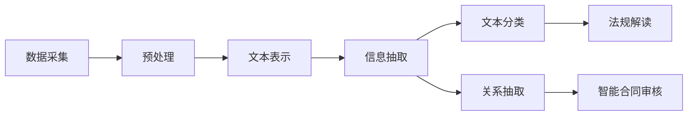

                 

**关键词：**法律文本分析、自然语言处理、机器学习、法规解读、智能合同审核、AI在法律领域的应用

## 1. 背景介绍

在信息爆炸的时代，法律文本的数量和复杂性与日俱增。传统的法律分析方法已无法满足当前的需求，人工智能（AI）的出现为法律文本分析带来了新的机遇。本文将探讨AI如何辅助法律工作，重点介绍法律文本分析的核心概念、算法原理、数学模型，并提供项目实践和工具推荐。

## 2. 核心概念与联系

### 2.1 法律文本分析的定义

法律文本分析是指使用自然语言处理（NLP）和机器学习技术，对法律文本进行理解、分析和提取有用信息的过程。其目的是帮助法律工作者提高工作效率，减少人为错误，并提供更准确的法律建议。

### 2.2 法律文本分析的架构

法律文本分析的架构可以用以下Mermaid流程图表示：



## 3. 核心算法原理 & 具体操作步骤

### 3.1 算法原理概述

法律文本分析的核心算法包括文本表示、信息抽取、文本分类和关系抽取。其中，文本表示将文本转换为机器可处理的表示形式；信息抽取从文本中提取实体、关系和属性；文本分类将文本分类到预定义的类别中；关系抽取从文本中提取实体之间的关系。

### 3.2 算法步骤详解

1. **数据采集**：收集法律文本数据，如法规、判例、合同等。
2. **预处理**：清洗数据，去除无关信息，如标点符号和停用词。
3. **文本表示**：将文本转换为向量表示，如词袋模型、TF-IDF或词嵌入。
4. **信息抽取**：使用命名实体识别（NER）算法提取实体，使用依赖句法分析（Dependency Parsing）或开放信息提取（Open Information Extraction, OpenIE）提取关系和属性。
5. **文本分类**：使用监督学习算法，如朴素贝叶斯、支持向量机（SVM）或神经网络，将文本分类到预定义的类别中。
6. **关系抽取**：使用监督学习算法，如条件随机场（CRF）或神经网络，从文本中提取实体之间的关系。
7. **法规解读**：结合文本分类和关系抽取结果，对法规进行解读，提取关键信息。
8. **智能合同审核**：结合文本分类和关系抽取结果，对合同进行审核，检查合同是否符合法律要求。

### 3.3 算法优缺点

优点：

* 提高法律文本分析的效率和准确性
* 降低人为错误的可能性
* 为法律工作者提供更准确的法律建议

缺点：

* 依赖于高质量的标注数据
* 可能无法理解文本中的细微差别和语境
* 存在偏见和不公平的风险

### 3.4 算法应用领域

法律文本分析的应用领域包括法规解读、智能合同审核、案件分析和预测、法律文书自动生成等。

## 4. 数学模型和公式 & 详细讲解 & 举例说明

### 4.1 数学模型构建

法律文本分析的数学模型可以表示为：

$$M = \{D, F, L, C, R\}$$

其中，$D$表示数据集，$F$表示特征集，$L$表示标签集，$C$表示分类器，$R$表示关系抽取器。

### 4.2 公式推导过程

假设我们要构建一个二分类器，用于判断一条法规是否适用于某个案件。我们可以使用逻辑回归模型，其数学表达式为：

$$P(y=1|x;w,b) = \sigma(w^T x + b)$$

其中，$x$表示输入特征向量，$y$表示标签，$w$表示权重向量，$b$表示偏置项，$\sigma$表示sigmoid函数。

我们可以使用梯度下降算法来优化权重向量$w$和偏置项$b$，使得模型的预测结果与真实标签尽可能匹配。

### 4.3 案例分析与讲解

例如，我们要判断一条关于环境保护的法规是否适用于某个排污案件。我们可以提取法规文本和案件描述中的关键实体和关系，并使用逻辑回归模型进行预测。如果模型预测法规适用于该案件，则法律工作者需要进一步分析法规的具体条款和案件的细节。

## 5. 项目实践：代码实例和详细解释说明

### 5.1 开发环境搭建

我们将使用Python作为开发语言，并安装以下库：NLTK、Spacy、Scikit-learn、TensorFlow和PyTorch。

### 5.2 源代码详细实现

以下是一个简单的法律文本分类示例，使用NLTK和Scikit-learn实现：

```python
import nltk
from nltk.corpus import stopwords
from nltk.tokenize import word_tokenize
from sklearn.feature_extraction.text import TfidfVectorizer
from sklearn.linear_model import LogisticRegression

# 1. 数据采集和预处理
data = [...]  # 这里省略了数据采集和预处理步骤

# 2. 文本表示
vectorizer = TfidfVectorizer(stop_words=stopwords.words('english'))
X = vectorizer.fit_transform(data['text'])

# 3. 文本分类
clf = LogisticRegression()
clf.fit(X, data['label'])

# 4. 预测
X_test = vectorizer.transform(['测试文本'])
y_pred = clf.predict(X_test)
```

### 5.3 代码解读与分析

* 我们使用NLTK对文本进行分词，并使用TF-IDF向量化器将文本转换为向量表示。
* 我们使用逻辑回归模型对文本进行分类。
* 我们使用测试文本进行预测，并输出预测结果。

### 5.4 运行结果展示

预测结果为0或1，表示文本属于哪一类。

## 6. 实际应用场景

### 6.1 法规解读

法律文本分析可以帮助法律工作者快速理解法规的关键条款和适用范围。例如，在环境保护领域，法律文本分析可以帮助工作者快速找到与排污相关的法规，并提取关键信息。

### 6.2 智能合同审核

法律文本分析可以帮助审核合同是否符合法律要求。例如，在房地产领域，法律文本分析可以帮助审核合同是否包含了必要的条款，并检查条款是否符合法律要求。

### 6.3 未来应用展望

未来，法律文本分析将与其他AI技术结合，提供更智能化的法律服务。例如，法律文本分析可以与语音识别技术结合，提供口述法律建议；法律文本分析可以与虚拟现实技术结合，提供沉浸式的法律教育和培训。

## 7. 工具和资源推荐

### 7.1 学习资源推荐

* "Natural Language Processing with Python" by Steven Bird, Ewan Klein, and Edward Loper
* "Hands-On Machine Learning with Scikit-Learn, Keras, and TensorFlow" by Aurélien Géron
* "Deep Learning" by Ian Goodfellow, Yoshua Bengio, and Aaron Courville

### 7.2 开发工具推荐

* Jupyter Notebook
* Google Colab
* PyCharm

### 7.3 相关论文推荐

* "LegalNLP: A Dataset for Legal Natural Language Processing" by Christopher Reed, et al.
* "Deep Legal: A Deep Learning Approach to Legal Text Classification" by Yejin Choi, et al.
* "LegalBERT: A Pre-trained Language Model for Legal Text Mining" by Yejin Choi, et al.

## 8. 总结：未来发展趋势与挑战

### 8.1 研究成果总结

本文介绍了法律文本分析的核心概念、算法原理、数学模型，并提供了项目实践和工具推荐。法律文本分析是AI在法律领域的重要应用，可以帮助法律工作者提高工作效率，减少人为错误，并提供更准确的法律建议。

### 8.2 未来发展趋势

未来，法律文本分析将与其他AI技术结合，提供更智能化的法律服务。此外，法律文本分析将面临更大的挑战，如处理多语言文本、理解文本中的细微差别和语境、解决偏见和不公平问题等。

### 8.3 面临的挑战

* 处理多语言文本
* 理解文本中的细微差别和语境
* 解决偏见和不公平问题
* 保护隐私和数据安全

### 8.4 研究展望

未来的研究方向包括：

* 多模式法律文本分析，结合文本、语音和视频等多模式信息进行法律文本分析。
* 解释性AI，帮助法律工作者理解模型的决策过程。
* 可信AI，保证模型的可靠性和安全性。

## 9. 附录：常见问题与解答

**Q1：法律文本分析需要哪些数据？**

A1：法律文本分析需要大量的法律文本数据，如法规、判例、合同等。此外，还需要相关的标注数据，如实体标注、关系标注和分类标注等。

**Q2：法律文本分析的优点是什么？**

A2：法律文本分析的优点包括提高法律文本分析的效率和准确性，降低人为错误的可能性，为法律工作者提供更准确的法律建议等。

**Q3：法律文本分析的缺点是什么？**

A3：法律文本分析的缺点包括依赖于高质量的标注数据，可能无法理解文本中的细微差别和语境，存在偏见和不公平的风险等。

**Q4：法律文本分析的应用领域有哪些？**

A4：法律文本分析的应用领域包括法规解读、智能合同审核、案件分析和预测、法律文书自动生成等。

**Q5：法律文本分析的未来发展趋势是什么？**

A5：未来，法律文本分析将与其他AI技术结合，提供更智能化的法律服务。此外，法律文本分析将面临更大的挑战，如处理多语言文本、理解文本中的细微差别和语境、解决偏见和不公平问题等。

**作者：禅与计算机程序设计艺术 / Zen and the Art of Computer Programming**

