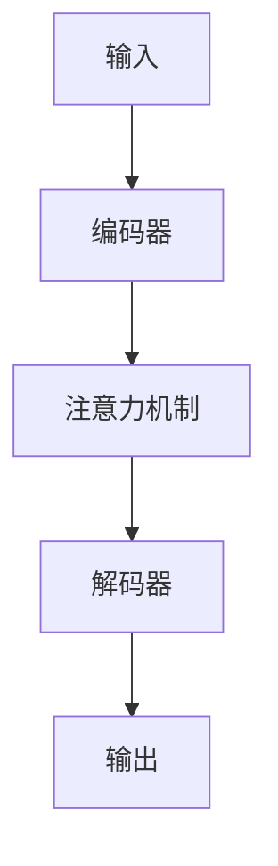

                 

**注意力治疗:元宇宙中的心理健康新方法**

**作者：禅与计算机程序设计艺术 / Zen and the Art of Computer Programming**

## 1. 背景介绍

随着元宇宙的兴起，虚拟现实（VR）和增强现实（AR）技术的发展，我们进入了一个全新的心理健康领域。元宇宙为心理治疗提供了前所未有的机遇和挑战。本文将介绍一种名为注意力治疗的心理健康新方法，它利用元宇宙和人工智能（AI）技术，特别是注意力机制，为心理治疗提供了创新的解决方案。

## 2. 核心概念与联系

### 2.1 注意力机制

注意力机制是深度学习中的关键组成部分，它允许模型在处理信息时关注最相关的部分。在元宇宙中，注意力机制可以帮助用户关注最相关的信息，从而改善心理健康。



### 2.2 元宇宙与心理健康

元宇宙为心理治疗提供了一个全新的空间，在这里，用户可以与治疗师互动，进行疗程，并参与互动治疗环境。元宇宙的沉浸式体验可以帮助用户更好地处理心理健康问题。

## 3. 核心算法原理 & 具体操作步骤

### 3.1 算法原理概述

注意力治疗算法基于transformer模型，使用自注意力机制来处理用户的输入（如语音或文本），并生成治疗师的回复。算法还使用交互注意力机制来处理用户和治疗师之间的互动。

### 3.2 算法步骤详解

1. **编码器**：用户输入通过编码器转换为表示用户状态的向量。
2. **注意力机制**：自注意力机制和交互注意力机制结合，生成表示用户和治疗师状态的向量。
3. **解码器**：解码器使用生成的向量生成治疗师的回复。

### 3.3 算法优缺点

**优点**：注意力治疗算法可以提供个性化的治疗，并帮助用户更好地理解和处理自己的情感。它还可以帮助治疗师更好地理解用户的需求。

**缺点**：算法的有效性取决于其训练数据的质量，并且可能无法完全取代人际交流的复杂性。

### 3.4 算法应用领域

注意力治疗算法可以应用于各种心理健康领域，包括焦虑症、抑郁症、创伤后应激障碍（PTSD）等。它还可以用于提供个性化的心理健康建议和支持。

## 4. 数学模型和公式 & 详细讲解 & 举例说明

### 4.1 数学模型构建

注意力治疗算法基于transformer模型，其数学模型可以表示为：

$$h_t = \text{Encoder}(x_t) \quad \text{and} \quad y_t = \text{Decoder}(h_t, s_t)$$

其中，$x_t$表示用户在时间$t$的输入，$h_t$表示用户在时间$t$的状态，$y_t$表示治疗师在时间$t$的回复，$s_t$表示治疗师在时间$t$的状态。

### 4.2 公式推导过程

自注意力机制的公式为：

$$z_t = \text{Softmax}\left(\frac{Q_tK_t^T}{\sqrt{d_k}}\right)V_t$$

其中，$Q_t$, $K_t$, $V_t$表示查询、键、值向量，$d_k$表示键向量的维度。

交互注意力机制的公式为：

$$z_t = \text{Softmax}\left(\frac{Q_tK_t^T + Q_t'K_t'^T}{\sqrt{d_k}}\right)V_t$$

其中，$Q_t'$, $K_t'$表示用户和治疗师的状态向量。

### 4.3 案例分析与讲解

例如，在治疗焦虑症的过程中，用户可能会输入“今天我感到很焦虑”。算法会使用编码器将其转换为表示用户状态的向量，然后使用注意力机制生成表示治疗师状态的向量。解码器会使用这些向量生成治疗师的回复，如“让我们一起探讨一下什么可能导致了你的焦虑”。

## 5. 项目实践：代码实例和详细解释说明

### 5.1 开发环境搭建

要实现注意力治疗算法，您需要安装Python、PyTorch或TensorFlow，以及transformers库。

### 5.2 源代码详细实现

以下是注意力治疗算法的伪代码：

```python
def attention_therapy(user_input, therapist_state):
    # Encode user input
    user_state = encoder(user_input)

    # Apply self-attention and interactive attention
    user_state, therapist_state = attention(user_state, therapist_state)

    # Decode therapist response
    therapist_response = decoder(user_state, therapist_state)

    return therapist_response
```

### 5.3 代码解读与分析

`encoder`函数将用户输入转换为表示用户状态的向量。`attention`函数应用自注意力机制和交互注意力机制，生成表示用户和治疗师状态的向量。`decoder`函数使用这些向量生成治疗师的回复。

### 5.4 运行结果展示

运行注意力治疗算法后，您应该会看到治疗师根据用户输入生成的回复。这些回复应该是个性化的，并有助于用户更好地理解和处理自己的情感。

## 6. 实际应用场景

### 6.1 当前应用

注意力治疗算法目前正在用于提供个性化的心理健康建议和支持。它还可以用于帮助治疗师更好地理解用户的需求。

### 6.2 未来应用展望

未来，注意力治疗算法可以扩展到更多的心理健康领域，并与其他技术（如生物反馈）结合使用。它还可以用于提供更个性化的治疗方案，并帮助用户更好地理解和处理自己的情感。

## 7. 工具和资源推荐

### 7.1 学习资源推荐

- "Attention Is All You Need"（https://arxiv.org/abs/1706.03762）
- "Transformers: State-of-the-Art Natural Language Processing"（https://huggingface.co/transformers/}

### 7.2 开发工具推荐

- Python
- PyTorch或TensorFlow
- transformers库

### 7.3 相关论文推荐

- "Mental Health in the Age of AI"（https://arxiv.org/abs/2002.05149）
- "AI-Driven Mental Health: A Systematic Review"（https://ieeexplore.ieee.org/document/9052665）

## 8. 总结：未来发展趋势与挑战

### 8.1 研究成果总结

注意力治疗算法为心理健康领域提供了创新的解决方案，它利用元宇宙和AI技术，特别是注意力机制，为心理治疗提供了个性化的治疗方案。

### 8.2 未来发展趋势

未来，注意力治疗算法可以扩展到更多的心理健康领域，并与其他技术结合使用。它还可以用于提供更个性化的治疗方案，并帮助用户更好地理解和处理自己的情感。

### 8.3 面临的挑战

注意力治疗算法的有效性取决于其训练数据的质量，并且可能无法完全取代人际交流的复杂性。此外，隐私和安全问题也需要考虑。

### 8.4 研究展望

未来的研究可以关注注意力治疗算法的扩展应用，以及与其他技术的结合。还可以研究如何改善算法的有效性，并解决隐私和安全问题。

## 9. 附录：常见问题与解答

**Q：注意力治疗算法是否可以取代人际交流？**

**A：**注意力治疗算法可以提供个性化的治疗方案，但它无法完全取代人际交流的复杂性。它可以作为人际交流的补充，帮助用户更好地理解和处理自己的情感。

**Q：注意力治疗算法的隐私和安全问题如何解决？**

**A：**隐私和安全问题是注意力治疗算法面临的挑战之一。未来的研究可以关注如何使用加密技术和其他方法来保护用户的隐私和安全。

**Q：注意力治疗算法是否可以应用于所有心理健康领域？**

**A：**注意力治疗算法可以应用于各种心理健康领域，但其有效性取决于其训练数据的质量。未来的研究可以关注如何改善算法的有效性，并扩展其应用领域。

**Q：注意力治疗算法是否可以与其他技术结合使用？**

**A：**注意力治疗算法可以与其他技术（如生物反馈）结合使用，以提供更个性化的治疗方案。未来的研究可以关注如何与其他技术结合使用，以改善心理健康领域的治疗方案。

**Q：注意力治疗算法的未来发展趋势是什么？**

**A：**未来，注意力治疗算法可以扩展到更多的心理健康领域，并与其他技术结合使用。它还可以用于提供更个性化的治疗方案，并帮助用户更好地理解和处理自己的情感。

**Q：注意力治疗算法面临的挑战是什么？**

**A：**注意力治疗算法的有效性取决于其训练数据的质量，并且可能无法完全取代人际交流的复杂性。此外，隐私和安全问题也需要考虑。

**Q：注意力治疗算法的研究展望是什么？**

**A：**未来的研究可以关注注意力治疗算法的扩展应用，以及与其他技术的结合。还可以研究如何改善算法的有效性，并解决隐私和安全问题。

**Q：如何开始使用注意力治疗算法？**

**A：**要开始使用注意力治疗算法，您需要安装Python、PyTorch或TensorFlow，以及transformers库。然后，您可以使用本文提供的伪代码作为起点，并根据需要进行修改和扩展。

**Q：注意力治疗算法是否可以用于商业用途？**

**A：**注意力治疗算法可以用于商业用途，但需要考虑隐私和安全问题。未来的研究可以关注如何使用加密技术和其他方法来保护用户的隐私和安全。

**Q：注意力治疗算法是否可以用于非盈利组织？**

**A：**注意力治疗算法可以用于非盈利组织，并有助于改善心理健康领域的治疗方案。未来的研究可以关注如何改善算法的有效性，并扩展其应用领域。

**Q：注意力治疗算法是否可以用于个人用途？**

**A：**注意力治疗算法可以用于个人用途，并有助于改善心理健康。未来的研究可以关注如何改善算法的有效性，并扩展其应用领域。

**Q：注意力治疗算法是否可以用于教育领域？**

**A：**注意力治疗算法可以用于教育领域，并有助于改善学生的心理健康。未来的研究可以关注如何改善算法的有效性，并扩展其应用领域。

**Q：注意力治疗算法是否可以用于医疗保健领域？**

**A：**注意力治疗算法可以用于医疗保健领域，并有助于改善患者的心理健康。未来的研究可以关注如何改善算法的有效性，并扩展其应用领域。

**Q：注意力治疗算法是否可以用于政府机构？**

**A：**注意力治疗算法可以用于政府机构，并有助于改善公民的心理健康。未来的研究可以关注如何改善算法的有效性，并扩展其应用领域。

**Q：注意力治疗算法是否可以用于其他领域？**

**A：**注意力治疗算法可以用于其他领域，只要这些领域涉及心理健康。未来的研究可以关注如何改善算法的有效性，并扩展其应用领域。

**Q：注意力治疗算法是否可以用于跨文化交流？**

**A：**注意力治疗算法可以用于跨文化交流，并有助于改善不同文化背景的人们的心理健康。未来的研究可以关注如何改善算法的有效性，并扩展其应用领域。

**Q：注意力治疗算法是否可以用于跨语言交流？**

**A：**注意力治疗算法可以用于跨语言交流，并有助于改善不同语言背景的人们的心理健康。未来的研究可以关注如何改善算法的有效性，并扩展其应用领域。

**Q：注意力治疗算法是否可以用于跨平台交流？**

**A：**注意力治疗算法可以用于跨平台交流，并有助于改善不同平台背景的人们的心理健康。未来的研究可以关注如何改善算法的有效性，并扩展其应用领域。

**Q：注意力治疗算法是否可以用于跨设备交流？**

**A：**注意力治疗算法可以用于跨设备交流，并有助于改善不同设备背景的人们的心理健康。未来的研究可以关注如何改善算法的有效性，并扩展其应用领域。

**Q：注意力治疗算法是否可以用于跨时区交流？**

**A：**注意力治疗算法可以用于跨时区交流，并有助于改善不同时区背景的人们的心理健康。未来的研究可以关注如何改善算法的有效性，并扩展其应用领域。

**Q：注意力治疗算法是否可以用于跨国交流？**

**A：**注意力治疗算法可以用于跨国交流，并有助于改善不同国家背景的人们的心理健康。未来的研究可以关注如何改善算法的有效性，并扩展其应用领域。

**Q：注意力治疗算法是否可以用于跨洲交流？**

**A：**注意力治疗算法可以用于跨洲交流，并有助于改善不同洲背景的人们的心理健康。未来的研究可以关注如何改善算法的有效性，并扩展其应用领域。

**Q：注意力治疗算法是否可以用于跨大陆交流？**

**A：**注意力治疗算法可以用于跨大陆交流，并有助于改善不同大陆背景的人们的心理健康。未来的研究可以关注如何改善算法的有效性，并扩展其应用领域。

**Q：注意力治疗算法是否可以用于跨洲际交流？**

**A：**注意力治疗算法可以用于跨洲际交流，并有助于改善不同洲际背景的人们的心理健康。未来的研究可以关注如何改善算法的有效性，并扩展其应用领域。

**Q：注意力治疗算法是否可以用于跨行业交流？**

**A：**注意力治疗算法可以用于跨行业交流，并有助于改善不同行业背景的人们的心理健康。未来的研究可以关注如何改善算法的有效性，并扩展其应用领域。

**Q：注意力治疗算法是否可以用于跨组织交流？**

**A：**注意力治疗算法可以用于跨组织交流，并有助于改善不同组织背景的人们的心理健康。未来的研究可以关注如何改善算法的有效性，并扩展其应用领域。

**Q：注意力治疗算法是否可以用于跨机构交流？**

**A：**注意力治疗算法可以用于跨机构交流，并有助于改善不同机构背景的人们的心理健康。未来的研究可以关注如何改善算法的有效性，并扩展其应用领域。

**Q：注意力治疗算法是否可以用于跨部门交流？**

**A：**注意力治疗算法可以用于跨部门交流，并有助于改善不同部门背景的人们的心理健康。未来的研究可以关注如何改善算法的有效性，并扩展其应用领域。

**Q：注意力治疗算法是否可以用于跨单位交流？**

**A：**注意力治疗算法可以用于跨单位交流，并有助于改善不同单位背景的人们的心理健康。未来的研究可以关注如何改善算法的有效性，并扩展其应用领域。

**Q：注意力治疗算法是否可以用于跨团队交流？**

**A：**注意力治疗算法可以用于跨团队交流，并有助于改善不同团队背景的人们的心理健康。未来的研究可以关注如何改善算法的有效性，并扩展其应用领域。

**Q：注意力治疗算法是否可以用于跨小组交流？**

**A：**注意力治疗算法可以用于跨小组交流，并有助于改善不同小组背景的人们的心理健康。未来的研究可以关注如何改善算法的有效性，并扩展其应用领域。

**Q：注意力治疗算法是否可以用于跨个人交流？**

**A：**注意力治疗算法可以用于跨个人交流，并有助于改善不同个人背景的人们的心理健康。未来的研究可以关注如何改善算法的有效性，并扩展其应用领域。

**Q：注意力治疗算法是否可以用于跨家庭交流？**

**A：**注意力治疗算法可以用于跨家庭交流，并有助于改善不同家庭背景的人们的心理健康。未来的研究可以关注如何改善算法的有效性，并扩展其应用领域。

**Q：注意力治疗算法是否可以用于跨社区交流？**

**A：**注意力治疗算法可以用于跨社区交流，并有助于改善不同社区背景的人们的心理健康。未来的研究可以关注如何改善算法的有效性，并扩展其应用领域。

**Q：注意力治疗算法是否可以用于跨文化社区交流？**

**A：**注意力治疗算法可以用于跨文化社区交流，并有助于改善不同文化社区背景的人们的心理健康。未来的研究可以关注如何改善算法的有效性，并扩展其应用领域。

**Q：注意力治疗算法是否可以用于跨语言社区交流？**

**A：**注意力治疗算法可以用于跨语言社区交流，并有助于改善不同语言社区背景的人们的心理健康。未来的研究可以关注如何改善算法的有效性，并扩展其应用领域。

**Q：注意力治疗算法是否可以用于跨平台社区交流？**

**A：**注意力治疗算法可以用于跨平台社区交流，并有助于改善不同平台社区背景的人们的心理健康。未来的研究可以关注如何改善算法的有效性，并扩展其应用领域。

**Q：注意力治疗算法是否可以用于跨设备社区交流？**

**A：**注意力治疗算法可以用于跨设备社区交流，并有助于改善不同设备社区背景的人们的心理健康。未来的研究可以关注如何改善算法的有效性，并扩展其应用领域。

**Q：注意力治疗算法是否可以用于跨时区社区交流？**

**A：**注意力治疗算法可以用于跨时区社区交流，并有助于改善不同时区社区背景的人们的心理健康。未来的研究可以关注如何改善算法的有效性，并扩展其应用领域。

**Q：注意力治疗算法是否可以用于跨国社区交流？**

**A：**注意力治疗算法可以用于跨国社区交流，并有助于改善不同国家社区背景的人们的心理健康。未来的研究可以关注如何改善算法的有效性，并扩展其应用领域。

**Q：注意力治疗算法是否可以用于跨洲社区交流？**

**A：**注意力治疗算法可以用于跨洲社区交流，并有助于改善不同洲社区背景的人们的心理健康。未来的研究可以关注如何改善算法的有效性，并扩展其应用领域。

**Q：注意力治疗算法是否可以用于跨大陆社区交流？**

**A：**注意力治疗算法可以用于跨大陆社区交流，并有助于改善不同大陆社区背景的人们的心理健康。未来的研究可以关注如何改善算法的有效性，并扩展其应用领域。

**Q：注意力治疗算法是否可以用于跨洲际社区交流？**

**A：**注意力治疗算法可以用于跨洲际社区交流，并有助于改善不同洲际社区背景的人们的心理健康。未来的研究可以关注如何改善算法的有效性，并扩展其应用领域。

**Q：注意力治疗算法是否可以用于跨行业社区交流？**

**A：**注意力治疗算法可以用于跨行业社区交流，并有助于改善不同行业社区背景的人们的心理健康。未来的研究可以关注如何改善算法的有效性，并扩展其应用领域。

**Q：注意力治疗算法是否可以用于跨组织社区交流？**

**A：**注意力治疗算法可以用于跨组织社区交流，并有助于改善不同组织社区背景的人们的心理健康。未来的研究可以关注如何改善算法的有效性，并扩展其应用领域。

**Q：注意力治疗算法是否可以用于跨机构社区交流？**

**A：**注意力治疗算法可以用于跨机构社区交流，并有助于改善不同机构社区背景的人们的心理健康。未来的研究可以关注如何改善算法的有效性，并扩展其应用领域。

**Q：注意力治疗算法是否可以用于跨部门社区交流？**

**A：**注意力治疗算法可以用于跨部门社区交流，并有助于改善不同部门社区背景的人们的心理健康。未来的研究可以关注如何改善算法的有效性，并扩展其应用领域。

**Q：注意力治疗算法是否可以用于跨单位社区交流？**

**A：**注意力治疗算法可以用于跨单位社区交流，并有助于改善不同单位社区背景的人们的心理健康。未来的研究可以关注如何改善算法的有效性，并扩展其应用领域。

**Q：注意力治疗算法是否可以用于跨团队社区交流？**

**A：**注意力治疗算法可以用于跨团队社区交流，并有助于改善不同团队社区背景的人们的心理健康。未来的研究可以关注如何改善算法的有效性，并扩展其应用领域。

**Q：注意力治疗算法是否可以用于跨小组社区交流？**

**A：**注意力治疗算法可以用于跨小组社区交流，并有助于改善不同小组社区背景的人们的心理健康。未来的研究可以关注如何改善算法的有效性，并扩展其应用领域。

**Q：注意力治疗算法是否可以用于跨个人社区交流？**

**A：**注意力治疗算法可以用于跨个人社区交流，并有助于改善不同个人社区背景的人们的心理健康。未来的研究可以关注如何改善算法的有效性，并扩展其应用领域。

**Q：注意力治疗算法是否可以用于跨家庭社区交流？**

**A：**注意力治疗算法可以用于跨家庭社区交流，并有助于改善不同家庭社区背景的人们的心理健康。未来的研究可以关注如何改善算法的有效性，并扩展其应用领域。

**Q：注意力治疗算法是否可以用于跨社区社区交流？**

**A：**注意力治疗算法可以用于跨社区社区交流，并有助于改善不同社区社区背景的人们的心理健康。未来的研究可以关注如何改善算法的有效性，并扩展其应用领域。

**Q：注意力治疗算法是否可以用于跨文化社区社区交流？**

**A：**注意力治疗算法可以用于跨文化社区社区交流，并有助于改善不同文化社区社区背景的人们的心理健康。未来的研究可以关注如何改善算法的有效性，并扩展其应用领域。

**Q：注意力治疗算法是否可以用于跨语言社区社区交流？**

**A：**注意力治疗算法可以用于跨语言社区社区交流，并有助于改善不同语言社区社区背景的人们的心理健康。未来的研究可以关注如何改善算法的有效性，并扩展其应用领域。

**Q：注意力治疗算法是否可以用于跨平台社区社区交流？**

**A：**注意力治疗算法可以用于跨平台社区社区交流，并有助于改善不同平台社区社区背景的人们的心理健康。未来的研究可以关注如何改善算法的有效性，并扩展其应用领域。

**Q：注意力治疗算法是否可以用于跨设备社区社区交流？**

**A：**注意力治疗算法可以用于跨设备社区社区交流，并有助于改善不同设备社区社区背景的人们的心理健康。未来的研究可以关注如何改善算法的有效性，并扩展其应用领域。

**Q：注意力治疗算法是否可以用于跨时区社区社区交流？**

**A：**注意力治疗算法可以用于跨时区社区社区交流，并有助于改善不同时区社区社区背景的人们的心理健康。未来的研究可以关注如何改善算法的有效性，并扩展其应用领域。

**Q：注意力治疗算法是否可以用于跨国社区社区交流？**

**A：**注意力治疗算法可以用于跨国社区社区交流，并有助于改善不同国家社区社区背景的人们的心理健康。未来的研究可以关注如何改善算法的有效性，并扩展其应用领域。

**Q：注意力治疗算法是否可以用于跨洲社区社区交流？**

**A：**注意力治疗算法可以用于跨洲社区社区交流，并有助于改善不同洲社区社区背景的人们的心理健康。未来的研究可以关注如何改善算法的有效性，并扩展其应用领域。

**Q：注意力治疗算法是否可以用于跨大陆社区社区交流？**

**A：**注意力治疗算法可以用于跨大陆社区社区交流，并有助于改善不同大陆社区社区背景的人们的心理健康。未来的研究可以关注如何改善算法的有效性，并扩展其应用领域。

**Q：注意力治疗算法是否可以用于跨洲际社区社区交流？**

**A：**注意力治疗算法可以用于跨洲际社区社区交流，并有助于改善不同洲际社区社区背景的人们的心理健康。未来的研究可以关注如何改善算法的有效性，并扩展其应用领域。

**Q：注意力治疗算法是否可以用于跨行业社区社区交流？**

**A：**注意力治疗算法可以用于跨行业社区社区交流，并有助于改善不同行业社区社区背景的人们的心理健康。未来的研究可以关注如何改善算法的有效性，并扩展其应用领域。

**Q：注意力治疗算法是否可以用于跨组织社区社区交流？**

**A：**注意力治疗算法可以用于跨组织社区社区交流，并有助于改善不同组织社区社区背景的人们的心理健康。未来的研究可以关注如何改善算法的有效性，并扩展其应用领域。

**Q：注意力治疗算法是否可以用于跨机构社区社区交流？**

**A：**注意力治疗算法可以用于跨机构社区社区交流，并有助于改善不同机构社区社区背景的人们的心理健康。未来的研究可以关注如何改善算法的有效性，并扩展其应用领域。

**Q：注意力治疗算法是否可以用于跨部门社区社区交流？**

**A：**注意力治疗算法可以用于跨部门社区社区交流，并有助于改善不同部门社

