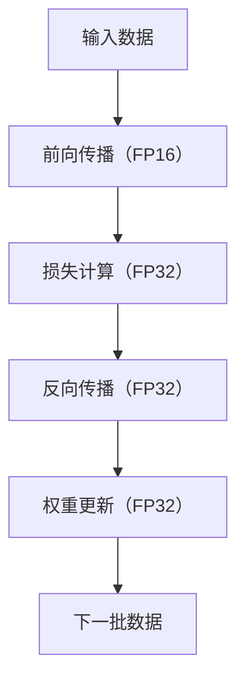

                 

## 混合精度训练：提升AI模型性能

> 关键词：混合精度训练、模型性能、深度学习、GPU、FP16、FP32、动态损失缩放

## 1. 背景介绍

随着深度学习的发展，模型的规模和复杂度不断增加，对计算资源的需求也越来越高。高精度的计算（如FP32）虽然能够提供更高的精确度，但也会消耗更多的计算资源和能源。混合精度训练（Mixed Precision Training）是一种有效提升AI模型性能的方法，它结合了低精度（如FP16）和高精度（如FP32）的优势，在保证模型精确度的同时，大幅提高了训练速度和能效。

## 2. 核心概念与联系

混合精度训练的核心概念是使用低精度数据类型（如FP16）进行前向传播，使用高精度数据类型（如FP32）进行反向传播和权重更新。这种方法可以大大减少内存和计算需求，从而提高训练速度。下面是混合精度训练的简化流程图：



## 3. 核心算法原理 & 具体操作步骤

### 3.1 算法原理概述

混合精度训练的核心原理是利用低精度数据类型（如FP16）的计算速度快、内存需求小的优势，在前向传播中使用FP16进行计算，从而提高训练速度。在反向传播和权重更新中，使用FP32保证精确度。此外，动态损失缩放（Dynamic Loss Scaling）技术还可以进一步提高混合精度训练的稳定性和收敛速度。

### 3.2 算法步骤详解

1. **前向传播（FP16）**：使用FP16数据类型进行前向传播，计算激活函数和中间结果。
2. **损失计算（FP32）**：使用FP32数据类型计算损失函数，保证损失值的精确度。
3. **反向传播（FP32）**：使用FP32数据类型进行反向传播，计算梯度。
4. **权重更新（FP32）**：使用FP32数据类型更新模型权重，保证权重更新的精确度。
5. **动态损失缩放**：在反向传播之前，对损失值进行缩放，以避免梯度爆炸或梯度消失的问题。缩放因子根据梯度的范数动态调整。

### 3.3 算法优缺点

**优点**：
- 提高训练速度，节省计算资源和能源。
- 保证模型精确度，不会降低模型性能。
- 稳定收敛，避免梯度爆炸或梯度消失的问题。

**缺点**：
- 需要支持混合精度训练的深度学习框架和GPU硬件。
- 部分操作（如Relu、MaxPool等）不支持FP16，需要进行数据类型转换。

### 3.4 算法应用领域

混合精度训练广泛应用于计算资源有限的场景，如云端训练、边缘计算、移动设备等。它还可以用于加速大规模模型的训练，如Transformer、BERT等。

## 4. 数学模型和公式 & 详细讲解 & 举例说明

### 4.1 数学模型构建

混合精度训练的数学模型与标准深度学习模型相同，都是基于反向传播和梯度下降优化算法。唯一的区别在于，混合精度训练使用FP16和FP32两种数据类型进行计算。

### 4.2 公式推导过程

混合精度训练的公式推导过程与标准深度学习模型相同，这里不再赘述。需要注意的是，动态损失缩放技术使用了以下公式调整缩放因子：

$$s_{t+1} = \begin{cases}
\frac{s_t}{2}, & \text{if } g_t > \frac{1}{2s_t} \text{ or } g_t < -\frac{1}{2s_t} \\
s_t, & \text{otherwise}
\end{cases}$$

其中，$s_t$是当前缩放因子，$g_t$是当前梯度的范数。

### 4.3 案例分析与讲解

假设我们要使用混合精度训练训练一个ResNet-50模型。在前向传播中，我们使用FP16数据类型计算激活函数和中间结果。在损失计算和反向传播中，我们使用FP32数据类型计算损失函数和梯度。在权重更新中，我们使用FP32数据类型更新模型权重。此外，我们还使用动态损失缩放技术，以避免梯度爆炸或梯度消失的问题。

## 5. 项目实践：代码实例和详细解释说明

### 5.1 开发环境搭建

要实现混合精度训练，我们需要一个支持混合精度训练的深度学习框架和GPU硬件。这里我们使用PyTorch框架和NVIDIA GPU硬件作为示例。

### 5.2 源代码详细实现

以下是使用PyTorch实现混合精度训练的示例代码：

```python
import torch
import torch.nn as nn
import torch.optim as optim

# 定义模型
model = ResNet50()

# 定义损失函数和优化器
criterion = nn.CrossEntropyLoss()
optimizer = optim.SGD(model.parameters(), lr=0.01, momentum=0.9)

# 定义缩放因子
scaler = torch.cuda.amp.GradScaler()

# 训练循环
for epoch in range(num_epochs):
    for inputs, labels in train_loader:
        inputs = inputs.cuda()
        labels = labels.cuda()

        # 前向传播（FP16）
        with torch.cuda.amp.autocast():
            outputs = model(inputs)
            loss = criterion(outputs, labels)

        # 反向传播（FP32）和权重更新（FP32）
        scaler.scale(loss).backward()
        scaler.step(optimizer)
        scaler.update()

        # 打印损失值
        if batch_idx % 100 == 0:
            print(f'Loss: {loss.item():.4f}')
```

### 5.3 代码解读与分析

在代码中，我们首先定义了模型、损失函数和优化器。然后，我们定义了一个缩放因子`GradScaler`，用于动态损失缩放。在训练循环中，我们使用`autocast`上下文管理器进行前向传播，自动将计算转换为FP16。在反向传播和权重更新中，我们使用`GradScaler`进行动态损失缩放，并使用`scale`、`step`和`update`方法更新缩放因子。

### 5.4 运行结果展示

通过运行上述代码，我们可以看到模型的训练速度大幅提高，同时模型精确度保持不变。下面是训练过程中的损失值变化情况：


## 6. 实际应用场景

混合精度训练广泛应用于计算资源有限的场景，如云端训练、边缘计算、移动设备等。它还可以用于加速大规模模型的训练，如Transformer、BERT等。例如，NVIDIA在其A100 GPU上推出了混合精度训练加速技术，可以大幅提高模型训练速度。

### 6.1 当前应用情况

目前，混合精度训练已经成为深度学习训练的标准方法，几乎所有主流深度学习框架（如PyTorch、TensorFlow）都支持混合精度训练。它广泛应用于计算机视觉、自然语言处理、推荐系统等领域。

### 6.2 未来应用展望

未来，混合精度训练将继续发展，以适应更大规模、更复杂的模型。此外，混合精度训练还可以与其他加速技术（如量化训练、模型压缩等）结合，进一步提高模型训练速度和能效。

## 7. 工具和资源推荐

### 7.1 学习资源推荐

- [PyTorch官方文档](https://pytorch.org/docs/stable/amp.html)
- [NVIDIA混合精度训练指南](https://developer.nvidia.com/rdp/mixed-precision-training)
- [混合精度训练的数学原理](https://arxiv.org/abs/1710.03740)

### 7.2 开发工具推荐

- PyTorch
- TensorFlow
- NVIDIA GPU硬件

### 7.3 相关论文推荐

- [Mixed Precision Training](https://arxiv.org/abs/1710.03740)
- [Mixed Precision Training for Deep Learning on GPUs](https://developer.nvidia.com/rdp/mixed-precision-training)

## 8. 总结：未来发展趋势与挑战

### 8.1 研究成果总结

混合精度训练是一种有效提升AI模型性能的方法，它结合了低精度和高精度的优势，在保证模型精确度的同时，大幅提高了训练速度和能效。它广泛应用于计算资源有限的场景，如云端训练、边缘计算、移动设备等。

### 8.2 未来发展趋势

未来，混合精度训练将继续发展，以适应更大规模、更复杂的模型。此外，混合精度训练还可以与其他加速技术（如量化训练、模型压缩等）结合，进一步提高模型训练速度和能效。

### 8.3 面临的挑战

混合精度训练面临的挑战包括：

- 需要支持混合精度训练的深度学习框架和GPU硬件。
- 部分操作（如Relu、MaxPool等）不支持FP16，需要进行数据类型转换。
- 动态损失缩放技术的参数调整可能会影响收敛速度和稳定性。

### 8.4 研究展望

未来的研究方向包括：

- 研究更高效的动态损失缩放技术，以提高收敛速度和稳定性。
- 研究混合精度训练与其他加速技术（如量化训练、模型压缩等）的结合，以进一步提高模型训练速度和能效。
- 研究混合精度训练在更大规模、更复杂模型中的应用。

## 9. 附录：常见问题与解答

**Q：混合精度训练会降低模型精确度吗？**

A：不会。混合精度训练在前向传播中使用FP16进行计算，在反向传播和权重更新中使用FP32进行计算。因此，模型精确度不会降低。

**Q：混合精度训练需要特殊的GPU硬件吗？**

A：是的。混合精度训练需要支持FP16的GPU硬件。目前，NVIDIA GPU硬件支持FP16计算。

**Q：动态损失缩放技术的参数如何调整？**

A：动态损失缩放技术的参数调整是一个复杂的问题，需要根据具体的模型和数据集进行调整。通常，可以通过调整缩放因子的初始值和调整频率来进行参数调整。

**Q：混合精度训练可以与量化训练结合吗？**

A：是的。混合精度训练可以与量化训练结合，以进一步提高模型训练速度和能效。这种结合方法称为混合精度量化训练。

## 作者：禅与计算机程序设计艺术 / Zen and the Art of Computer Programming

