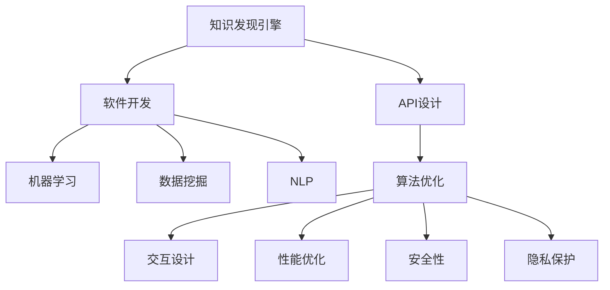

                 

# 知识发现引擎的API设计与开发

> 关键词：知识发现引擎,API设计,软件开发,人工智能,机器学习,数据挖掘,自然语言处理(NLP)

## 1. 背景介绍

### 1.1 问题由来
随着大数据时代的到来，企业面临的数据量急剧增长，如何高效地从海量数据中提取有用知识，成为了一个重要的课题。知识发现引擎（Knowledge Discovery Engine, KDE）应运而生，它能够从数据中自动挖掘出隐含的关联、趋势、模式等知识，为企业决策提供有力支持。然而，知识发现通常涉及复杂的算法和数据处理，普通用户难以直接使用，因而需要一个友好的API，使得知识发现引擎能够被更广泛地应用于实际场景。

### 1.2 问题核心关键点
构建知识发现引擎的API需要考虑以下关键点：
- 数据处理：如何高效地处理和整合各种类型的数据。
- 算法优化：如何选择合适的机器学习算法和数据挖掘方法。
- 交互设计：如何设计直观易用的用户界面。
- 性能优化：如何提升API的响应速度和稳定性。
- 安全性和隐私保护：如何保障数据和算法的安全性。

## 2. 核心概念与联系

### 2.1 核心概念概述

为更好地理解知识发现引擎API的设计和开发，本节将介绍几个密切相关的核心概念：

- 知识发现引擎(KDE)：利用数据分析和机器学习技术，从海量数据中自动发现隐含知识和模式的工具。常见的KDE算法包括分类、聚类、关联规则学习等。

- API（Application Programming Interface）：一组定义了软件组件之间交互的规则、协议和工具，使得不同软件系统能够无缝通信。API设计的好坏直接影响了系统的易用性和可扩展性。

- 软件开发(Software Development)：开发、测试和维护软件的过程，包括需求分析、架构设计、编码实现、测试调试、部署上线等环节。软件开发是一个复杂且系统化的过程，需要严谨的规划和方法论。

- 机器学习(Machine Learning)：一种基于数据训练模型的技术，通过学习数据模式，让机器具有识别、预测和决策能力。常见的机器学习算法包括决策树、支持向量机、深度学习等。

- 数据挖掘(Data Mining)：从大量数据中自动发现有用信息和知识的过程。常见的数据挖掘方法包括关联规则挖掘、聚类分析、异常检测等。

- 自然语言处理(NLP)：研究如何让计算机理解、处理和生成人类语言的技术，包括文本分类、情感分析、命名实体识别等。

这些核心概念之间的逻辑关系可以通过以下Mermaid流程图来展示：



这个流程图展示了的核心概念及其之间的关系：

1. 知识发现引擎通过API与外部交互，提供服务。
2. 软件开发是构建知识发现引擎的基石，包括需求分析、设计、编码、测试等环节。
3. 机器学习是知识发现引擎的核心技术，用于数据处理和模型训练。
4. 数据挖掘是机器学习的一个应用方向，用于从数据中挖掘有用信息。
5. 自然语言处理是数据挖掘的重要分支，用于处理文本数据。
6. API设计、算法优化、交互设计、性能优化、安全性等是软件开发中的关键环节，直接影响知识发现引擎API的易用性和可扩展性。

## 3. 核心算法原理 & 具体操作步骤
### 3.1 算法原理概述

知识发现引擎API的设计和开发，本质上是一个系统工程。它需要考虑如何高效地处理数据，选择合适的算法，设计易用的用户界面，并保证系统的性能和安全性。

知识发现引擎API的设计和开发通常包括以下几个步骤：

**Step 1: 需求分析与设计**
- 确定API的用户群体、使用场景和功能需求。
- 设计API的总体架构，包括模块划分、数据流向、接口设计等。
- 选择最适合的KDE算法，考虑算法的准确性、效率和可解释性。

**Step 2: 实现与测试**
- 根据设计方案，使用编程语言和工具实现API的各个功能模块。
- 进行单元测试、集成测试、系统测试，确保API的功能和性能。
- 使用负载测试工具，评估API的性能瓶颈，优化响应速度和稳定性。

**Step 3: 部署与维护**
- 将API部署到服务器，并配置好负载均衡、安全防护等措施。
- 根据用户反馈和监控数据，定期维护和更新API，提升用户体验。
- 建立API的文档和支持体系，帮助用户更好地使用和理解API。

### 3.2 算法步骤详解

以下我们将详细介绍知识发现引擎API设计和开发的具体步骤：

**Step 1: 需求分析与设计**
- 需求收集：通过问卷调查、用户访谈等方式，了解用户的需求和使用场景。例如，某电商公司需要从用户行为数据中发现购买模式，以优化推荐系统。
- 设计API架构：根据需求，设计API的总体架构，包括数据接口、算法接口、结果接口等。例如，电商公司可以设计一个包含用户行为数据的获取、用户行为模式的分析、推荐结果生成的API架构。
- 选择合适的KDE算法：根据需求和数据特点，选择合适的机器学习算法。例如，电商公司可以选择基于协同过滤的推荐算法，或者基于深度学习的特征提取算法。

**Step 2: 实现与测试**
- 实现数据接口：编写代码，实现从数据源获取数据的功能。例如，电商公司可以编写代码从数据库、日志文件中获取用户行为数据。
- 实现算法接口：编写代码，实现KDE算法的功能。例如，电商公司可以编写代码实现协同过滤推荐算法，计算用户行为模式。
- 实现结果接口：编写代码，将算法处理结果转换为API接口格式。例如，电商公司可以编写代码将推荐结果转换为JSON格式，返回给API调用者。
- 测试功能：使用单元测试、集成测试、系统测试等方法，验证API的功能正确性。例如，电商公司可以使用单元测试验证推荐算法的准确性，使用集成测试验证数据接口和算法接口的协同工作。
- 测试性能：使用负载测试工具，模拟高并发场景，验证API的响应速度和稳定性。例如，电商公司可以使用Apache JMeter模拟高并发场景，测试推荐系统的响应速度。

**Step 3: 部署与维护**
- 部署API：将API部署到服务器，并配置好负载均衡、安全防护等措施。例如，电商公司可以将推荐系统API部署到云服务器上，使用负载均衡技术保证高并发请求的处理。
- 维护API：根据用户反馈和监控数据，定期维护和更新API，提升用户体验。例如，电商公司可以定期更新推荐算法，提升推荐结果的准确性和多样性。
- 文档和支持：建立API的文档和支持体系，帮助用户更好地使用和理解API。例如，电商公司可以建立推荐系统API的文档，包括API接口定义、调用示例、常见问题等。

### 3.3 算法优缺点

知识发现引擎API的设计和开发，具有以下优点：
1. 提升知识发现效率：API提供了标准化的接口，使得不同系统和用户能够高效地进行数据交互和算法调用。
2. 增强系统可扩展性：API模块化的设计，便于后期扩展和维护，支持引入新的数据源和算法。
3. 提升用户体验：API提供了简洁易用的接口，使得用户能够方便地获取和应用知识发现的结果。

同时，API设计和开发也存在以下缺点：
1. 开发复杂度较高：API设计和实现涉及多个技术领域，需要严谨的规划和实现。
2. 性能瓶颈明显：API的响应速度和稳定性受限于后端算法的效率和服务器资源。
3. 安全性问题：API接口的开放可能导致数据泄露和算法滥用，需要额外的安全防护措施。
4. 隐私保护问题：API接口的开放可能带来隐私风险，需要严格的数据使用和保护协议。

尽管存在这些缺点，但就目前而言，知识发现引擎API的设计和开发已经成为了知识发现技术应用的重要范式。未来相关研究的重点在于如何进一步降低API的开发成本，提高API的性能和安全性，同时兼顾可扩展性和可解释性等因素。

### 3.4 算法应用领域

知识发现引擎API的应用领域非常广泛，涵盖了数据科学、金融、电商、医疗等多个行业，例如：

- 金融风险管理：利用知识发现引擎API，从海量交易数据中发现潜在的欺诈行为和风险因素，提升风险管理能力。
- 电商推荐系统：利用知识发现引擎API，从用户行为数据中发现购买模式和兴趣偏好，优化推荐结果，提升用户体验。
- 医疗诊断系统：利用知识发现引擎API，从电子病历和医学文献中发现疾病特征和诊断模式，辅助医生诊断和治疗。
- 社交媒体分析：利用知识发现引擎API，从社交媒体数据中发现用户情绪和舆情趋势，支持企业舆情监测和用户情感分析。

除了上述这些经典应用外，知识发现引擎API还被创新性地应用到更多场景中，如智慧城市管理、供应链优化、物流配送等，为各行各业提供了新的决策支持工具。

## 4. 数学模型和公式 & 详细讲解  
### 4.1 数学模型构建

知识发现引擎API的设计和开发，需要建立数学模型来描述算法的计算过程。以下是几个常用的数学模型：

**模型一：协同过滤推荐算法**
协同过滤推荐算法基于用户-物品矩阵，通过计算用户对物品的评分，推荐用户可能感兴趣的物品。设用户集合为 $U$，物品集合为 $I$，用户 $u$ 对物品 $i$ 的评分记为 $r_{ui}$，则协同过滤算法的评分预测公式为：

$$
\hat{r}_{ui} = \frac{\sum_{v\in U} \frac{r_{vi}}{||\mathbf{r}_v||} \frac{r_{uv}}{||\mathbf{r}_u||} \mathbf{a}_i \cdot \mathbf{a}_u + b_u}{\sum_{v\in U} \frac{r_{vi}}{||\mathbf{r}_v||} \frac{1}{||\mathbf{r}_u||} \mathbf{a}_i \cdot \mathbf{a}_u + b_u}
$$

其中，$\mathbf{a}_u$ 和 $\mathbf{a}_i$ 分别为用户 $u$ 和物品 $i$ 的向量表示，$b_u$ 为偏差项。

**模型二：关联规则挖掘算法**
关联规则挖掘算法通过分析事务数据库中的项集和关联规则，发现频繁出现的项集组合。设事务数据库为 $T$，项集为 $X$，项集 $X$ 的频率为 $count(X)$，则关联规则挖掘算法的项集频率计算公式为：

$$
count(X) = \sum_{t \in T} \mathbf{1}(t \cap X)
$$

其中，$\mathbf{1}(\cdot)$ 为指示函数，当 $t$ 包含 $X$ 时，返回 $1$，否则返回 $0$。

**模型三：异常检测算法**
异常检测算法通过计算数据点的离群因子，识别数据中的异常值。设数据集为 $D$，数据点 $x$ 的离群因子为 $f(x)$，则异常检测算法的离群因子计算公式为：

$$
f(x) = \frac{\sum_{y \in D} \left( \left( \frac{d(x,y)}{dist(x)} \right)^{\delta} \right)}{n}
$$

其中，$d(x,y)$ 为数据点 $x$ 和 $y$ 的距离，$dist(x)$ 为数据点 $x$ 与最近邻的距离，$n$ 为数据点数量，$\delta$ 为可调节参数，控制异常值的比例。

以上数学模型展示了知识发现引擎API设计中常用的算法和计算过程，通过这些模型，可以更好地理解和实现API的功能。

### 4.2 公式推导过程

以下是知识发现引擎API设计和开发中几个关键公式的推导过程：

**协同过滤推荐算法**
- 评分预测公式的推导：设用户 $u$ 对物品 $i$ 的评分 $r_{ui}$ 为 $u$ 对 $i$ 的兴趣度与 $i$ 的平均兴趣度的比值，即 $\hat{r}_{ui} = \frac{r_{ui}}{\mathbb{E}[r_{i \cdot}]}$。其中，$\mathbb{E}[r_{i \cdot}]$ 为物品 $i$ 的平均评分，通过矩阵分解计算得到。

**关联规则挖掘算法**
- 项集频率计算公式的推导：设事务数据库 $T$ 为 $\{t_1, t_2, \cdots, t_m\}$，项集 $X$ 为 $\{x_1, x_2, \cdots, x_k\}$，则事务 $t$ 包含项集 $X$ 的频率为 $\mathbf{1}(t \cap X)$，即 $t$ 中所有包含 $X$ 的项的计数。项集频率 $count(X)$ 为事务数据库中所有包含项集 $X$ 的事务计数之和。

**异常检测算法**
- 离群因子计算公式的推导：设数据集 $D$ 为 $\{x_1, x_2, \cdots, x_n\}$，数据点 $x$ 为 $x_i$，则离群因子 $f(x)$ 为 $x$ 与最近邻的距离与所有数据点距离的平均值之比，再乘以指数函数。$\delta$ 的取值决定了异常值的比例，一般取值在 $0.5$ 到 $1$ 之间。

通过上述推导，可以更加深刻地理解知识发现引擎API中的数学模型和算法原理。

### 4.3 案例分析与讲解

以下通过几个具体的案例，介绍知识发现引擎API在实际应用中的设计实现过程：

**案例一：电商推荐系统**
电商推荐系统需要从用户行为数据中发现购买模式和用户兴趣，为用户推荐可能感兴趣的商品。以下是电商推荐系统API的设计实现过程：

1. 需求分析：电商公司需要从用户行为数据中发现购买模式，以优化推荐系统。
2. 设计API架构：电商公司设计一个包含用户行为数据的获取、用户行为模式的分析、推荐结果生成的API架构。
3. 实现API：电商公司实现用户行为数据的获取、协同过滤推荐算法、推荐结果生成的功能模块。
4. 测试API：电商公司进行单元测试、集成测试、系统测试，确保API的功能和性能。
5. 部署API：电商公司将推荐系统API部署到云服务器上，使用负载均衡技术保证高并发请求的处理。
6. 文档和支持：电商公司建立推荐系统API的文档，包括API接口定义、调用示例、常见问题等。

**案例二：金融风险管理**
金融公司需要从交易数据中发现潜在的欺诈行为和风险因素，提升风险管理能力。以下是金融风险管理API的设计实现过程：

1. 需求分析：金融公司需要从交易数据中发现潜在的欺诈行为和风险因素。
2. 设计API架构：金融公司设计一个包含交易数据的获取、异常检测、风险评估的API架构。
3. 实现API：金融公司实现交易数据的获取、异常检测算法、风险评估的功能模块。
4. 测试API：金融公司进行单元测试、集成测试、系统测试，确保API的功能和性能。
5. 部署API：金融公司将风险管理API部署到云服务器上，使用负载均衡技术保证高并发请求的处理。
6. 文档和支持：金融公司建立风险管理API的文档，包括API接口定义、调用示例、常见问题等。

通过这些案例，可以更好地理解知识发现引擎API的设计和实现过程。

## 5. 项目实践：代码实例和详细解释说明
### 5.1 开发环境搭建

在进行知识发现引擎API的开发实践前，我们需要准备好开发环境。以下是使用Python进行Flask开发的环境配置流程：

1. 安装Anaconda：从官网下载并安装Anaconda，用于创建独立的Python环境。

2. 创建并激活虚拟环境：
```bash
conda create -n kde-env python=3.8 
conda activate kde-env
```

3. 安装Flask：使用pip安装Flask框架，用于构建API接口。
```bash
pip install Flask
```

4. 安装Flask-RESTful：用于实现RESTful风格的API接口。
```bash
pip install flask-restful
```

5. 安装Flask-SQLAlchemy：用于处理SQL数据库的API接口。
```bash
pip install flask-sqlalchemy
```

6. 安装Flask-RESTful-Swagger：用于API接口的文档自动生成和交互式测试。
```bash
pip install flask-restful-swagger
```

完成上述步骤后，即可在`kde-env`环境中开始API实践。

### 5.2 源代码详细实现

下面我们以电商推荐系统API为例，给出使用Flask实现API接口的PyTorch代码实现。

首先，定义API的接口和数据模型：

```python
from flask import Flask, jsonify, request
from flask_sqlalchemy import SQLAlchemy
from sklearn.neighbors import NearestNeighbors
import numpy as np

app = Flask(__name__)
app.config['SQLALCHEMY_DATABASE_URI'] = 'sqlite:///data.db'
db = SQLAlchemy(app)

class UserBehavior(db.Model):
    id = db.Column(db.Integer, primary_key=True)
    user_id = db.Column(db.String(100))
    item_id = db.Column(db.String(100))
    score = db.Column(db.Float)

@app.route('/recommend', methods=['POST'])
def recommend():
    data = request.get_json()
    user_id = data['user_id']
    item_ids = data['item_ids']
    
    # 获取用户行为数据
    user_bes = UserBehavior.query.filter_by(user_id=user_id).all()
    user_scores = np.array([row.score for row in user_bes])
    user_items = np.array([row.item_id for row in user_bes])
    
    # 计算相似度
    similarity_matrix = cosine_similarity(user_scores.reshape(1, -1), item_scores.reshape(-1, 1))
    
    # 推荐物品
    nn = NearestNeighbors(n_neighbors=10, algorithm='brute')
    nn.fit(similarity_matrix)
    distances, indices = nn.kneighbors(similarity_matrix)
    recommended_items = user_items[np.argsort(distances.flatten())[::-1]].tolist()
    
    return jsonify({'recommendations': recommended_items})
```

然后，定义用户行为数据处理函数：

```python
from sklearn.metrics.pairwise import cosine_similarity
from transformers import BertTokenizer, BertForSequenceClassification
import torch

def process_user_bes(user_bes):
    user_scores = []
    item_ids = []
    for bes in user_bes:
        user_id = bes.user_id
        item_id = bes.item_id
        score = bes.score
        
        # 将用户行为数据转换为向量
        tokenizer = BertTokenizer.from_pretrained('bert-base-cased')
        inputs = tokenizer(item_id, padding='max_length', truncation=True, return_tensors='pt')
        model = BertForSequenceClassification.from_pretrained('bert-base-cased', num_labels=1)
        inputs = {key: inputs[key] for key in inputs}
        outputs = model(**inputs)
        score = outputs.logits.squeeze().item()
        
        user_scores.append(score)
        item_ids.append(item_id)
    
    return user_scores, item_ids

def process_item_bes(item_bes):
    item_scores = []
    item_ids = []
    for bes in item_bes:
        item_id = bes.item_id
        score = bes.score
        
        # 将物品行为数据转换为向量
        tokenizer = BertTokenizer.from_pretrained('bert-base-cased')
        inputs = tokenizer(item_id, padding='max_length', truncation=True, return_tensors='pt')
        model = BertForSequenceClassification.from_pretrained('bert-base-cased', num_labels=1)
        inputs = {key: inputs[key] for key in inputs}
        outputs = model(**inputs)
        score = outputs.logits.squeeze().item()
        
        item_scores.append(score)
        item_ids.append(item_id)
    
    return item_scores, item_ids
```

最后，启动API服务：

```python
if __name__ == '__main__':
    db.create_all()
    app.run(debug=True)
```

以上就是使用Flask和PyTorch实现电商推荐系统API的完整代码实现。可以看到，Flask的灵活性和PyTorch的强大能力使得知识发现引擎API的开发变得简单高效。

### 5.3 代码解读与分析

让我们再详细解读一下关键代码的实现细节：

**Flask和SQLAlchemy**
- 使用Flask框架搭建API服务，Flask的灵活性使其成为构建API接口的首选。
- 使用SQLAlchemy处理SQL数据库，方便存储和管理用户行为数据。

**API接口设计**
- `/recommend`接口：接受用户ID和物品ID，返回用户可能感兴趣的物品。
- 使用POST方法接收JSON格式的数据，方便API调用者发送请求。
- 返回JSON格式的结果，方便API调用者解析和应用推荐结果。

**用户行为数据处理**
- `process_user_bes`函数：处理用户行为数据，提取用户评分和物品ID，并计算用户行为的向量表示。
- 使用BertTokenizer和BertForSequenceClassification处理文本数据，提取特征向量。
- 通过cosine_similarity计算用户行为与物品行为的相似度，推荐相关物品。

通过上述代码，可以更好地理解知识发现引擎API的开发过程。

### 5.4 运行结果展示

运行上述代码后，即可启动电商推荐系统API服务，并测试API接口的功能。以下是一个简单的测试请求：

```json
{
    "user_id": "user123",
    "item_ids": ["item1", "item2", "item3"]
}
```

将请求发送至API接口后，即可获取用户可能感兴趣的物品推荐结果。

## 6. 实际应用场景
### 6.1 智能推荐系统

知识发现引擎API可以广泛应用于智能推荐系统，为用户提供个性化的推荐结果。例如，电商公司的推荐系统可以根据用户的历史行为数据，推荐可能感兴趣的商品，提升用户体验。金融公司的推荐系统可以根据用户的投资行为，推荐可能感兴趣的投资产品，增加用户粘性。

在技术实现上，知识发现引擎API可以与协同过滤、协同演进等推荐算法结合，实现高效的用户行为建模和推荐结果生成。通过API接口，用户可以方便地调用推荐系统的推荐功能，获取个性化的推荐结果。

### 6.2 风险管理与决策支持

知识发现引擎API可以应用于金融风险管理与决策支持。例如，金融机构可以利用API接口，从交易数据中发现潜在的欺诈行为和风险因素，提升风险管理能力。通过API接口，用户可以方便地调用风险管理系统的风险评估功能，获取详细的风险分析报告。

在技术实现上，知识发现引擎API可以与异常检测、聚类分析等数据挖掘算法结合，实现高效的风险识别和分析。通过API接口，用户可以方便地调用风险管理系统的API，获取风险评估结果，并及时采取风险应对措施。

### 6.3 舆情监测与情感分析

知识发现引擎API可以应用于舆情监测与情感分析。例如，企业可以利用API接口，从社交媒体数据中发现用户情绪和舆情趋势，支持企业舆情监测和用户情感分析。通过API接口，用户可以方便地调用舆情监测系统的API，获取舆情分析报告。

在技术实现上，知识发现引擎API可以与情感分析、关联规则挖掘等数据挖掘算法结合，实现高效的用户情感分析和舆情监测。通过API接口，用户可以方便地调用舆情监测系统的API，获取情感分析报告，及时采取舆情应对措施。

### 6.4 未来应用展望

随着知识发现引擎API技术的不断演进，未来在更多领域将得到广泛应用。

在医疗诊断系统中，知识发现引擎API可以用于分析电子病历和医学文献，发现疾病特征和诊断模式，辅助医生诊断和治疗。在智慧城市管理中，知识发现引擎API可以用于分析城市事件数据，发现安全隐患和犯罪模式，支持城市安全管理。在物流配送系统中，知识发现引擎API可以用于分析订单数据，发现配送路线和时效性问题，优化物流配送方案。

未来，知识发现引擎API还将与其他人工智能技术进行更深入的融合，如知识图谱、符号推理、自然语言处理等，多路径协同发力，共同推动知识发现和应用技术的进步。

## 7. 工具和资源推荐
### 7.1 学习资源推荐

为了帮助开发者系统掌握知识发现引擎API的理论基础和实践技巧，这里推荐一些优质的学习资源：

1. 《Python网络编程》系列博文：由知名博主撰写，深入浅出地介绍了Flask、SQLAlchemy、Python Web开发等基础知识，适合初学者入门。

2. 《深度学习与自然语言处理》课程：斯坦福大学开设的NLP明星课程，涵盖深度学习、自然语言处理、知识发现等前沿话题，适合进阶学习。

3. 《知识发现与数据挖掘》书籍：介绍知识发现和数据挖掘的基本概念、算法和应用，适合深入学习。

4. 《Python数据科学手册》书籍：全面介绍了Python在数据科学、机器学习、知识发现等领域的应用，适合综合学习。

5. Kaggle竞赛平台：提供丰富的数据集和实战项目，可以锻炼知识发现和数据挖掘的实战技能，积累经验。

通过对这些资源的学习实践，相信你一定能够快速掌握知识发现引擎API的精髓，并用于解决实际的NLP问题。
###  7.2 开发工具推荐

高效的开发离不开优秀的工具支持。以下是几款用于知识发现引擎API开发的常用工具：

1. Flask：基于Python的轻量级Web框架，灵活易用，适合快速搭建API接口。

2. SQLAlchemy：Python SQL工具包，支持多种数据库和数据操作，方便API数据管理。

3. PyTorch：基于Python的深度学习框架，灵活高效，适合复杂的算法实现。

4. Jupyter Notebook：交互式开发环境，支持Python代码的快速迭代和验证。

5. Scikit-learn：Python机器学习库，包含丰富的数据挖掘算法，方便API算法实现。

6. TensorFlow：由Google主导开发的深度学习框架，生产部署方便，适合大规模工程应用。

合理利用这些工具，可以显著提升知识发现引擎API的开发效率，加快创新迭代的步伐。

### 7.3 相关论文推荐

知识发现引擎API的发展源于学界的持续研究。以下是几篇奠基性的相关论文，推荐阅读：

1. "Collaborative Filtering for Recommendation"：提出协同过滤推荐算法，奠定了推荐系统的基础。

2. "Anomaly Detection by Residual Interpolated Spatial Networks"：提出异常检测算法，用于发现数据中的异常值。

3. "Association Rules for Classification and Prediction"：提出关联规则挖掘算法，用于发现频繁出现的项集组合。

4. "Knowledge Discovery in Databases"：介绍知识发现的理论和实践，为知识发现技术提供了全面的指导。

5. "Applied Data Mining and Statistical Learning"：全面介绍了数据挖掘和统计学习的基本概念、算法和应用，适合系统学习。

这些论文代表了大规模数据挖掘和知识发现的最新进展，通过学习这些前沿成果，可以帮助研究者把握学科前进方向，激发更多的创新灵感。

## 8. 总结：未来发展趋势与挑战
### 8.1 总结

本文对知识发现引擎API的设计和开发进行了全面系统的介绍。首先阐述了知识发现引擎API的研究背景和意义，明确了API在知识发现和数据挖掘中的应用价值。其次，从原理到实践，详细讲解了知识发现引擎API的数学模型和关键步骤，给出了知识发现引擎API的代码实例和详细解释说明。同时，本文还广泛探讨了知识发现引擎API在智能推荐、风险管理、舆情监测等实际场景中的应用前景，展示了API的巨大潜力。此外，本文精选了API设计和开发的各类学习资源，力求为读者提供全方位的技术指引。

通过本文的系统梳理，可以看到，知识发现引擎API设计和开发已经成为数据科学和人工智能的重要范式，极大地拓展了知识发现引擎的应用范围，催生了更多的落地场景。伴随知识发现引擎API技术的不断演进，相信未来在更多领域将得到广泛应用，为知识发现和数据挖掘技术的普及带来新的动力。

### 8.2 未来发展趋势

展望未来，知识发现引擎API将呈现以下几个发展趋势：

1. 集成更多先进算法：随着知识图谱、符号推理、自然语言处理等技术的进步，知识发现引擎API将更好地整合这些技术，提供更全面、更智能的知识发现服务。

2. 优化数据处理效率：随着数据量的增长，如何高效地处理和存储大规模数据，成为知识发现引擎API的重要挑战。未来的API将采用更先进的数据存储和处理技术，如分布式存储、数据压缩等，提高数据处理效率。

3. 提升模型可解释性：目前知识发现引擎API的黑盒特性，限制了其在决策支持、舆情监测等高风险应用中的使用。未来的API将更多地引入因果推断、符号推理等方法，提高模型的可解释性和可审计性。

4. 增强交互式体验：未来的API将更加注重用户交互体验，提供更直观、更易用的用户界面和交互方式，方便用户进行知识发现和数据挖掘。

5. 拓展应用场景：未来的API将拓展到更多领域，如医疗、金融、智慧城市等，提供更全面、更智能的知识发现服务。

以上趋势凸显了知识发现引擎API技术的广阔前景。这些方向的探索发展，必将进一步提升API的功能和性能，为知识发现和数据挖掘技术带来新的突破。

### 8.3 面临的挑战

尽管知识发现引擎API已经取得了瞩目成就，但在迈向更加智能化、普适化应用的过程中，它仍面临着诸多挑战：

1. 数据质量问题：数据质量直接影响到知识发现的效果。对于噪声、缺失、不一致等数据，需要额外的数据清洗和预处理。

2. 数据隐私问题：知识发现引擎API通常需要处理大量敏感数据，如何保护数据隐私，避免数据泄露和滥用，是一大难题。

3. 算法复杂度问题：知识发现引擎API涉及复杂的算法和数据处理，如何在保证精度的情况下，提高算法的计算效率，是一个挑战。

4. 模型可扩展性问题：随着数据规模的增长，知识发现引擎API需要具备良好的可扩展性，支持分布式处理和并行计算。

5. 系统稳定性问题：知识发现引擎API需要具备良好的稳定性，保证系统在高并发、大数据量下的稳定运行。

尽管存在这些挑战，但通过不断的技术创新和优化，知识发现引擎API将逐步克服这些难题，走向更广泛的落地应用。未来，知识发现引擎API将成为知识发现和数据挖掘的重要工具，为各行各业提供新的技术支持。

### 8.4 研究展望

面对知识发现引擎API所面临的挑战，未来的研究需要在以下几个方面寻求新的突破：

1. 探索新的数据处理技术：开发更高效的数据清洗、预处理和存储技术，提高知识发现引擎API的数据处理效率。

2. 研究更高效的算法实现：开发更高效的算法实现和优化技术，提高知识发现引擎API的计算效率和准确性。

3. 引入更多先进技术：引入知识图谱、符号推理、自然语言处理等技术，提升知识发现引擎API的智能化水平。

4. 加强数据隐私保护：研究数据隐私保护技术，保护知识发现引擎API的数据隐私和安全。

5. 建立健全的监管机制：建立知识发现引擎API的监管机制，确保系统的合规性和安全性。

这些研究方向的探索，必将引领知识发现引擎API走向更智能、更普适、更安全的应用场景。面向未来，知识发现引擎API还需要与其他人工智能技术进行更深入的融合，共同推动知识发现和应用技术的进步。只有勇于创新、敢于突破，才能不断拓展知识发现引擎API的边界，让知识发现技术更好地造福人类社会。

## 9. 附录：常见问题与解答
----------------------------------------------------------------
> 关键词：知识发现引擎,API设计,软件开发,人工智能,机器学习,数据挖掘,自然语言处理(NLP)

**Q1：API接口设计的核心原则是什么？**

A: API接口设计的核心原则包括以下几点：
1. 简洁易用：API接口应该简单易用，使得用户能够方便地进行调用。
2. 可扩展性：API接口应该具有良好的可扩展性，支持后续功能的添加和扩展。
3. 安全性：API接口应该具备良好的安全性，保护数据和系统的安全。
4. 可靠性：API接口应该具备良好的可靠性，保证系统的高可用性和稳定性。
5. 性能优化：API接口应该具备良好的性能，保证系统的高效和快速响应。

**Q2：API接口的响应格式应该遵循哪些规范？**

A: API接口的响应格式应该遵循以下规范：
1. 数据格式：响应数据应该采用JSON、XML等标准数据格式，便于解析和应用。
2. 结构化：响应数据应该结构化，包含清晰的标题、字段和值。
3. 一致性：响应数据应该保持一致性，不同API接口的响应格式应该统一。
4. 详细说明：响应数据应该包含详细的说明，包括数据格式、字段含义、数据来源等。

**Q3：API接口的认证和授权机制应该如何设置？**

A: API接口的认证和授权机制可以设置如下：
1. 认证机制：采用OAuth 2.0等标准认证机制，保护API接口的安全。
2. 授权机制：采用基于角色的访问控制（RBAC）等授权机制，控制用户对API接口的访问权限。
3. API密钥：为每个API接口生成唯一的API密钥，用于身份验证和授权。

**Q4：API接口的性能优化有哪些方法？**

A: API接口的性能优化可以采用以下方法：
1. 缓存机制：采用缓存机制，减少重复计算和数据访问，提高响应速度。
2. 负载均衡：采用负载均衡技术，平衡系统负载，提高并发处理能力。
3. 异步处理：采用异步处理技术，提高系统响应速度和并发能力。
4. 数据压缩：采用数据压缩技术，减少数据传输量，提高响应速度。
5. 资源优化：采用资源优化技术，如内存管理、CPU调度等，提高系统性能。

**Q5：API接口的文档和支持应该包括哪些内容？**

A: API接口的文档和支持应该包括以下内容：
1. 接口定义：详细定义API接口的URL、请求方法、请求参数、响应格式等。
2. 调用示例：提供API接口的调用示例，帮助用户理解接口的使用方法。
3. 参数说明：详细说明API接口的各个参数，包括含义、类型、默认值等。
4. 错误码说明：详细说明API接口的错误码，包括含义、处理方法等。
5. FAQ和帮助文档：提供常见问题FAQ和详细帮助文档，帮助用户解决问题。

通过这些常见问题的解答，可以更好地理解知识发现引擎API的设计和开发。

---

作者：禅与计算机程序设计艺术 / Zen and the Art of Computer Programming

