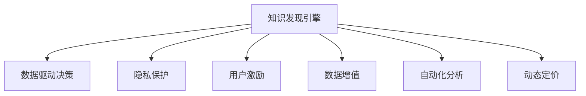

                 

# 知识发现引擎的商业模式创新

> 关键词：知识发现引擎, 商业化, 数据驱动, 隐私保护, 用户激励, 数据增值, 自动化分析, 动态定价

## 1. 背景介绍

### 1.1 问题由来
随着大数据时代的到来，信息量的爆炸式增长带来了前所未有的机遇和挑战。如何在海量数据中挖掘出有价值的知识，为决策提供支持，成为了各行各业关注的焦点。传统的信息检索系统，虽然能提供一定程度的查询服务，但无法满足深度分析、知识发现的需求。因此，知识发现引擎应运而生，旨在自动化、智能化地挖掘出数据中的隐含知识，辅助企业决策，提升竞争优势。

然而，知识发现引擎的商业化过程中，面临着诸多问题。数据来源的复杂性和多样性，隐私保护与数据分享的矛盾，技术实现的高门槛，以及用户参与度的低效，都成为了制约知识发现引擎发展的瓶颈。因此，本文将从商业模式创新的角度，探讨如何通过创新思路和技术手段，实现知识发现引擎的可持续发展。

## 2. 核心概念与联系

### 2.1 核心概念概述

为更好地理解知识发现引擎的商业模式创新，本节将介绍几个关键概念：

- **知识发现引擎(Knowledge Discovery Engine, KDE)**：自动从数据中识别模式、关联规则和异常值，辅助决策的智能系统。一般包括数据收集、预处理、特征提取、模型训练和结果呈现等多个环节。

- **数据驱动(数据驱动决策, Data-Driven Decision Making)**：基于数据和统计分析的决策制定方法，强调数据的权威性和实证性，与基于经验的决策模式形成对比。

- **隐私保护(Privacy Preservation)**：在数据收集、存储和共享过程中，保护用户隐私和数据安全的技术手段。

- **用户激励(User Engagement)**：通过各种机制，提升用户参与数据提交和互动的积极性，增加数据多样性和代表性。

- **数据增值(Data Monetization)**：通过对数据的深入分析和挖掘，提供有价值的信息和知识，实现数据价值的最大化。

- **自动化分析(Automatic Data Analysis)**：使用算法和工具，自动化地处理和分析数据，提高效率和准确性。

- **动态定价(Dynamic Pricing)**：根据市场需求和成本变化，灵活调整产品或服务的价格，以最大化收益。

这些概念之间的逻辑关系可以通过以下Mermaid流程图来展示：



这个流程图展示了一个典型的知识发现引擎商业模式的组成部分，以及各部分之间的相互关系：

1. 知识发现引擎通过自动化分析，从数据中发现知识和模式，支持数据驱动决策。
2. 隐私保护技术保障用户数据安全，增强用户信任。
3. 用户激励机制提升用户参与度，增加数据多样性和质量。
4. 数据增值通过深入分析，提供有价值的决策支持，实现商业收益。
5. 动态定价策略根据市场变化调整价格，优化资源配置。

## 3. 核心算法原理 & 具体操作步骤

### 3.1 算法原理概述

知识发现引擎的商业化主要基于数据驱动、自动化分析和用户激励等关键技术。其核心算法原理包括数据预处理、特征提取、模型训练和结果呈现等步骤，通过不断迭代优化，实现对数据价值的深度挖掘和利用。

### 3.2 算法步骤详解

1. **数据预处理**：清洗、转换、标准化数据，去除噪声和异常值，确保数据质量。
2. **特征提取**：从原始数据中抽取出有意义的特征，构建特征向量，供后续模型训练使用。
3. **模型训练**：选择合适的机器学习模型（如决策树、随机森林、神经网络等），利用训练数据进行模型训练，优化模型参数。
4. **结果呈现**：将模型预测结果以直观的图表、报表形式呈现，供决策者参考。

### 3.3 算法优缺点

知识发现引擎的算法具有以下优点：

- 自动化分析：提高了数据处理效率，减少了人工干预，提升了分析的准确性和一致性。
- 数据驱动决策：依赖数据而非经验，增加了决策的科学性和客观性。
- 动态定价：根据市场需求灵活调整价格，提高了资源配置效率。

但同时，也存在一些缺点：

- 算法复杂：不同算法和模型有不同的特点和适用场景，选择合适的算法和模型需要专业知识。
- 数据隐私：数据的收集和共享可能带来隐私泄露的风险，需要严格的数据保护措施。
- 用户激励不足：如何激励用户提交数据，以及参与数据互动，是实现数据多样性和质量的关键问题。
- 商业价值转换：如何将分析结果转化为商业价值，需要有效的商业模式设计和运营策略。

### 3.4 算法应用领域

知识发现引擎在多个领域都有广泛的应用，例如：

- **金融领域**：通过分析交易数据，识别市场趋势和异常交易，辅助投资决策。
- **零售行业**：通过分析消费数据，优化商品组合和定价策略，提升销售额和客户满意度。
- **医疗健康**：通过分析病历数据，发现疾病模式和治疗效果，提高医疗服务的质量和效率。
- **制造业**：通过分析生产数据，优化生产流程和供应链管理，提升产品质量和生产效率。
- **政府公共服务**：通过分析公共数据，优化资源分配和政策制定，提升政府服务的效率和透明度。

## 4. 数学模型和公式 & 详细讲解

### 4.1 数学模型构建

知识发现引擎的核心数学模型包括数据预处理模型、特征提取模型、机器学习模型和结果呈现模型等。以零售行业为例，数学模型构建过程如下：

1. **数据预处理模型**：
   - 清洗：去除重复、缺失和错误数据。
   - 转换：对分类数据进行编码，对日期数据进行归一化。
   - 标准化：对数值型数据进行标准化处理，使其服从标准正态分布。

2. **特征提取模型**：
   - 相关性分析：计算各特征与目标变量的相关系数，选择重要特征。
   - PCA降维：使用主成分分析法，对高维数据进行降维处理，减少计算复杂度。
   - 特征编码：将特征值映射到数值型向量中，供模型训练使用。

3. **机器学习模型**：
   - 回归模型：如线性回归、决策树回归等，用于预测销售额等连续变量。
   - 分类模型：如逻辑回归、支持向量机等，用于预测顾客是否会购买某商品。
   - 聚类模型：如K-means、层次聚类等，用于发现顾客群体的特征和行为模式。

4. **结果呈现模型**：
   - 可视化：使用散点图、直方图、热力图等可视化工具，展示分析结果。
   - 报表生成：使用Excel、Tableau等工具，生成详细的数据报表和分析报告。

### 4.2 公式推导过程

以线性回归模型为例，其公式推导过程如下：

设样本数据集为 $\{(x_i, y_i)\}_{i=1}^N$，其中 $x_i=(x_{i1}, x_{i2}, \ldots, x_{ip})$ 为自变量向量，$y_i$ 为目标变量。线性回归模型可表示为：

$$
y = \beta_0 + \beta_1 x_1 + \beta_2 x_2 + \ldots + \beta_p x_p + \epsilon
$$

其中，$\beta_0, \beta_1, \ldots, \beta_p$ 为模型系数，$\epsilon$ 为误差项。最小二乘法求解模型参数的过程如下：

- 构造误差平方和函数：$SSR=\sum_{i=1}^N(y_i - \hat{y}_i)^2$，其中 $\hat{y}_i = \beta_0 + \beta_1 x_{i1} + \beta_2 x_{i2} + \ldots + \beta_p x_{ip}$。
- 求偏导数：$\frac{\partial SSR}{\partial \beta_k} = -2\sum_{i=1}^N(x_{ik} - \bar{x}_{ik})\hat{y}_i$。
- 求解方程组：$\sum_{i=1}^N(x_{ik} - \bar{x}_{ik})\hat{y}_i = 0$，解得模型系数。

### 4.3 案例分析与讲解

以某电商平台的销售额预测为例，分析知识发现引擎的应用过程：

1. **数据预处理**：
   - 清洗：去除重复订单、退货订单和异常订单。
   - 转换：将分类变量（如商品类别）转换为数值型变量。
   - 标准化：对数值型变量（如销售额、价格）进行标准化处理。

2. **特征提取**：
   - 相关性分析：计算各特征与销售额的相关系数，选择重要特征如订单量、平均购买金额、用户活跃度等。
   - PCA降维：对高维数据进行降维处理，减少计算复杂度。
   - 特征编码：将特征值映射到数值型向量中，供模型训练使用。

3. **模型训练**：
   - 选择回归模型：如线性回归、决策树回归等，用于预测销售额。
   - 模型训练：利用训练数据，最小化误差函数，优化模型参数。

4. **结果呈现**：
   - 可视化：使用散点图、热力图等工具，展示不同特征对销售额的影响。
   - 报表生成：生成详细的数据报表和分析报告，供决策者参考。

## 5. 项目实践：代码实例和详细解释说明

### 5.1 开发环境搭建

在进行知识发现引擎的商业化开发前，我们需要准备好开发环境。以下是使用Python进行知识发现引擎开发的环境配置流程：

1. 安装Python：从官网下载并安装Python，推荐使用最新稳定版本。
2. 安装必要的库：使用pip安装Pandas、NumPy、Scikit-Learn、Matplotlib等常用库，如：
   ```bash
   pip install pandas numpy scikit-learn matplotlib
   ```
3. 配置环境：根据项目需求，配置开发环境，如设置虚拟环境、安装依赖等。

### 5.2 源代码详细实现

下面以线性回归模型为例，给出使用Scikit-Learn库进行数据预处理、特征提取和模型训练的PyTorch代码实现。

```python
import pandas as pd
from sklearn.model_selection import train_test_split
from sklearn.preprocessing import StandardScaler
from sklearn.linear_model import LinearRegression

# 数据预处理
data = pd.read_csv('sales_data.csv')
# 清洗数据
data = data.dropna()
# 特征选择
features = ['order_amount', 'avg_purchase_amount', 'user_activity']
target = 'sales'
# 分割数据集
X_train, X_test, y_train, y_test = train_test_split(data[features], data[target], test_size=0.2)
# 标准化数据
scaler = StandardScaler()
X_train = scaler.fit_transform(X_train)
X_test = scaler.transform(X_test)

# 特征编码
X_train_encoded = pd.DataFrame(X_train, columns=features)
X_test_encoded = pd.DataFrame(X_test, columns=features)

# 模型训练
model = LinearRegression()
model.fit(X_train_encoded, y_train)
```

### 5.3 代码解读与分析

让我们再详细解读一下关键代码的实现细节：

**数据预处理**：
- `pd.read_csv`：使用Pandas库读取CSV格式的数据文件。
- `data.dropna`：删除包含NaN值的行，保证数据完整性。
- `train_test_split`：使用Scikit-Learn库进行数据集的划分。

**特征提取**：
- `features`：定义用于训练的特征变量。
- `target`：定义目标变量。
- `StandardScaler`：使用Scikit-Learn库的标准化函数，对数值型数据进行标准化处理。

**模型训练**：
- `LinearRegression`：使用Scikit-Learn库的线性回归模型。
- `model.fit`：利用训练数据，最小化误差函数，优化模型参数。

### 5.4 运行结果展示

运行上述代码后，可以输出训练好的线性回归模型，对测试集进行预测，并计算预测误差。例如：

```python
from sklearn.metrics import mean_squared_error

# 模型预测
y_pred = model.predict(X_test_encoded)
# 计算预测误差
mse = mean_squared_error(y_test, y_pred)
print(f"Mean Squared Error: {mse:.2f}")
```

以上即为使用Scikit-Learn库进行知识发现引擎商业化开发的完整代码实现。

## 6. 实际应用场景

### 6.1 智能营销分析

知识发现引擎在智能营销分析中具有广泛的应用。通过分析客户行为数据，可以发现潜在客户群体，制定精准营销策略，提升客户转化率和销售额。

具体实现上，可以收集客户的浏览、点击、购买等行为数据，构建特征向量，利用回归模型或分类模型进行预测分析。通过可视化和报表生成工具，将分析结果直观呈现，供营销人员参考。例如，某电商公司利用知识发现引擎，通过分析客户数据，发现某类客户群体对某类商品的购买率较高，从而定向推出促销活动，显著提升了销售额。

### 6.2 风险评估与预警

在金融领域，风险评估和预警是防范金融风险的重要手段。知识发现引擎可以分析交易数据，识别异常交易行为，预测潜在风险，辅助决策。

例如，某银行利用知识发现引擎，通过分析客户交易数据，发现某客户的交易行为异常，及时预警并采取措施，有效避免了潜在的金融诈骗风险。

### 6.3 供应链优化

供应链优化是提高制造业效率的重要途径。知识发现引擎可以分析生产数据，优化供应链管理，提升产品质量和生产效率。

例如，某制造企业利用知识发现引擎，通过分析生产数据，发现某生产线的故障率较高，及时进行维护和优化，显著提高了生产效率。

## 7. 工具和资源推荐

### 7.1 学习资源推荐

为了帮助开发者系统掌握知识发现引擎的开发和商业化，这里推荐一些优质的学习资源：

1. **《Python数据科学手册》**：详细介绍Python在数据科学领域的应用，包括数据预处理、特征提取、模型训练等基本技能。
2. **Kaggle机器学习竞赛**：提供丰富的数据集和竞赛任务，锻炼实际问题解决能力。
3. **Coursera机器学习课程**：由斯坦福大学开设，介绍机器学习的基本理论和算法，适合初学者入门。
4. **Scikit-Learn官方文档**：详细介绍了Scikit-Learn库的使用方法和示例代码，是学习机器学习的必备资源。
5. **TensorFlow官方文档**：详细介绍TensorFlow库的使用方法和示例代码，适合深度学习领域的学习。

通过对这些资源的学习实践，相信你一定能够快速掌握知识发现引擎的开发和商业化技术，并将其应用于实际问题解决中。

### 7.2 开发工具推荐

高效的开发离不开优秀的工具支持。以下是几款用于知识发现引擎开发的常用工具：

1. **Python**：功能强大的编程语言，具有丰富的库和框架支持。
2. **Scikit-Learn**：Python数据分析和机器学习库，包含丰富的算法和工具。
3. **TensorFlow**：谷歌开源的深度学习框架，支持大规模分布式计算。
4. **Keras**：简单易用的深度学习框架，适合快速原型开发。
5. **Pandas**：数据分析和处理库，支持大规模数据集的读写和处理。
6. **NumPy**：数值计算库，提供高效的数组运算和科学计算功能。

合理利用这些工具，可以显著提升知识发现引擎的开发效率，加快创新迭代的步伐。

### 7.3 相关论文推荐

知识发现引擎的研究源于学界的持续研究。以下是几篇奠基性的相关论文，推荐阅读：

1. **《机器学习》**：Tom Mitchell，介绍了机器学习的基本概念、算法和应用。
2. **《模式识别与机器学习》**：Christopher Bishop，介绍了模式识别和机器学习的基本理论和算法。
3. **《统计学习方法》**：李航，介绍了常见的机器学习算法及其应用。
4. **《深度学习》**：Ian Goodfellow，介绍了深度学习的基本理论和算法。
5. **《数据挖掘：概念与技术》**：Jerry K. Silvapulle，介绍了数据挖掘的基本概念和技术。

这些论文代表了大数据领域的经典理论和技术，是知识发现引擎开发和商业化的重要参考。

## 8. 总结：未来发展趋势与挑战

### 8.1 研究成果总结

本文对知识发现引擎的商业模式进行了全面系统的介绍。首先阐述了知识发现引擎的商业化过程，明确了数据驱动、自动化分析和用户激励等关键技术。其次，从原理到实践，详细讲解了知识发现引擎的开发流程，给出了代码实例。同时，本文还探讨了知识发现引擎在智能营销、风险评估和供应链优化等领域的广泛应用，展示了知识发现引擎的强大能力。

通过本文的系统梳理，可以看到，知识发现引擎在数据驱动决策、自动化分析和用户激励等方面具有显著优势，成为企业决策的重要辅助手段。未来，随着技术的不断进步，知识发现引擎将在更多领域得到应用，为各行各业带来深远的变革。

### 8.2 未来发展趋势

展望未来，知识发现引擎的商业化将呈现以下几个发展趋势：

1. **数据融合与跨领域应用**：未来的知识发现引擎将更加注重跨领域数据融合，提升对复杂问题的解决能力。
2. **算法多样化与智能化**：算法多样化是知识发现引擎发展的必然趋势，未来将出现更多智能化算法，如深度学习、增强学习等。
3. **隐私保护与合规性**：隐私保护技术将进一步完善，确保数据安全和合规性，提升用户信任。
4. **用户激励与互动性**：用户激励机制将更加灵活多样，提升用户参与度和数据质量。
5. **自动化与智能化**：自动化分析将更加智能化，利用AI技术提升分析效率和准确性。
6. **动态定价与市场响应**：动态定价策略将更加灵活，根据市场变化进行灵活调整。

这些趋势将推动知识发现引擎向更高的智能水平迈进，为各行业带来更高效、更精准的决策支持。

### 8.3 面临的挑战

尽管知识发现引擎的商业化取得了显著进展，但在迈向更加智能化、普适化应用的过程中，仍面临着诸多挑战：

1. **数据来源与多样性**：数据来源广泛且多样，数据质量和格式不一致，难以直接用于分析。
2. **数据隐私与安全**：数据收集和共享可能带来隐私泄露和安全风险，需要严格的数据保护措施。
3. **算法复杂性与可解释性**：算法复杂度增加，模型的可解释性不足，难以理解和调试。
4. **资源限制与计算效率**：大规模数据处理和分析需要高性能计算资源，计算效率不高。
5. **用户参与度与数据多样性**：用户参与度不足，数据多样性不够，影响分析结果的准确性。

正视知识发现引擎商业化面临的这些挑战，积极应对并寻求突破，将是大规模知识发现引擎进一步发展的关键。

### 8.4 研究展望

未来的知识发现引擎研究需要在以下几个方面寻求新的突破：

1. **数据融合与跨领域应用**：如何实现不同数据源的融合，提升对复杂问题的解决能力。
2. **隐私保护与合规性**：如何在使用数据的同时，保障用户隐私和数据安全。
3. **算法多样性与智能化**：如何利用更多的算法和智能化技术，提升分析效率和准确性。
4. **用户激励与互动性**：如何设计更有效的用户激励机制，提升用户参与度和数据多样性。
5. **自动化与智能化**：如何利用AI技术，提升自动化分析的智能化水平。
6. **动态定价与市场响应**：如何根据市场变化，灵活调整产品或服务的价格。

这些研究方向将引领知识发现引擎技术的不断演进，推动其在更多领域得到应用，为各行各业带来深远的影响。

## 9. 附录：常见问题与解答

**Q1：如何选择合适的知识发现引擎算法？**

A: 选择知识发现引擎算法时，需要考虑数据特征、问题类型和应用场景。例如：
- 对于分类问题，选择决策树、随机森林、SVM等分类算法。
- 对于回归问题，选择线性回归、多项式回归、神经网络等回归算法。
- 对于聚类问题，选择K-means、层次聚类、DBSCAN等聚类算法。

**Q2：数据预处理过程中，如何进行特征选择？**

A: 特征选择是数据预处理的重要环节，常用的方法包括：
- 相关性分析：计算各特征与目标变量的相关系数，选择重要特征。
- 卡方检验：评估特征与目标变量之间的关联程度，筛选出具有统计显著性的特征。
- 特征重要性评估：使用决策树、随机森林等算法，评估特征对目标变量的影响。

**Q3：如何提升知识发现引擎算法的鲁棒性和泛化能力？**

A: 提升算法的鲁棒性和泛化能力，可以从以下几个方面入手：
- 数据增强：通过回译、近义替换等方式扩充训练集。
- 正则化：使用L1、L2正则化技术，防止过拟合。
- 交叉验证：使用交叉验证技术，评估模型泛化能力。
- 集成学习：采用Bagging、Boosting等集成学习方法，提升模型鲁棒性。

**Q4：知识发现引擎在商业化过程中，如何保护用户隐私？**

A: 保护用户隐私，可以采用以下技术手段：
- 数据匿名化：对用户数据进行匿名化处理，防止数据泄露。
- 差分隐私：在数据处理过程中加入噪声，保护用户隐私。
- 加密技术：对数据进行加密存储和传输，防止数据泄露。
- 访问控制：对数据访问进行严格控制，防止未经授权的数据访问。

**Q5：如何提升知识发现引擎的用户参与度？**

A: 提升用户参与度，可以采用以下措施：
- 激励机制：设计合理的激励机制，鼓励用户提交数据。
- 用户界面：设计友好的用户界面，方便用户操作。
- 数据可视化：通过可视化工具，展示分析结果，增强用户兴趣。
- 用户反馈：收集用户反馈，优化数据分析和呈现效果。

---

作者：禅与计算机程序设计艺术 / Zen and the Art of Computer Programming

