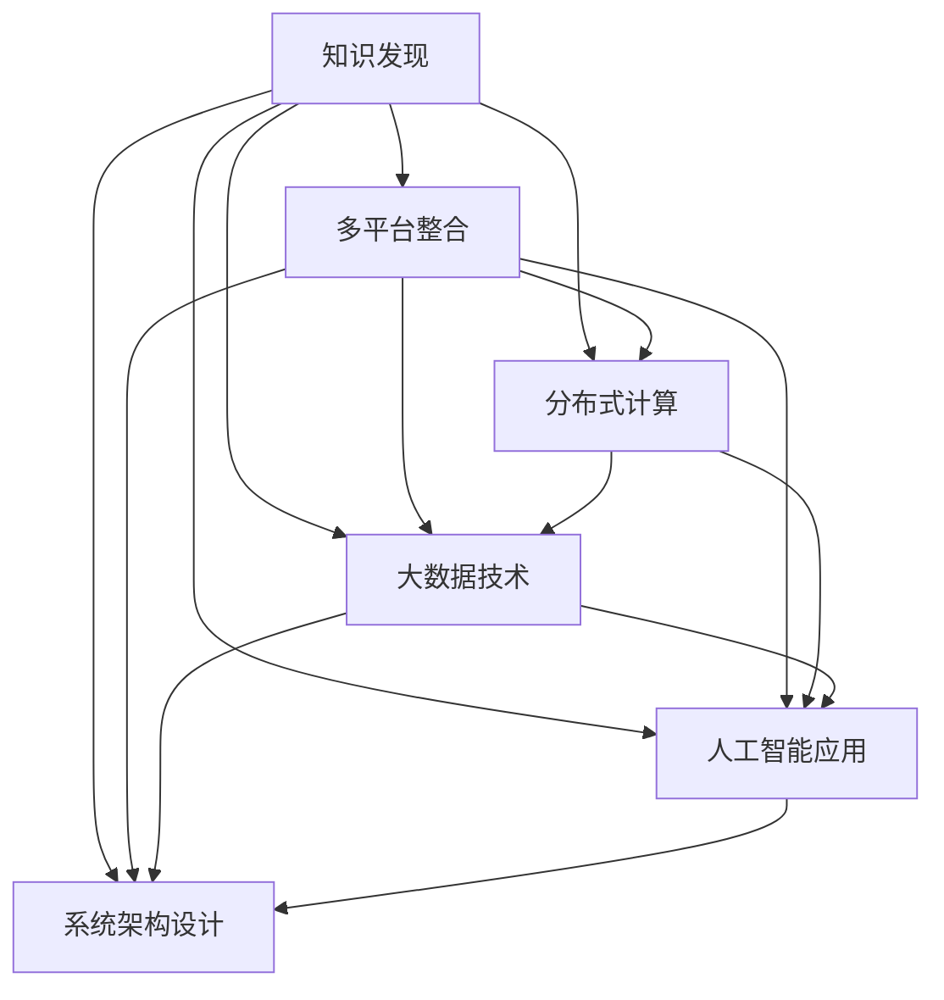

                 

# 知识发现引擎的多平台整合方案

> 关键词：知识发现, 多平台整合, 分布式计算, 大数据技术, 人工智能应用, 机器学习

## 1. 背景介绍

### 1.1 问题由来

随着信息技术的飞速发展，企业内部的数据量呈现爆炸式增长。这些数据中蕴含着巨大的商业价值和知识发现潜力，企业需要快速高效地从海量数据中挖掘出有用的信息，以指导决策和运营。但传统的数据仓库和BI系统已难以应对数据量和复杂性的双重挑战。知识发现(Knowledge Discovery in Databases, KDD)技术应运而生，它通过智能化的数据处理和分析，帮助企业从数据中挖掘出深层次的知识和规律，为业务决策提供有力支持。

然而，随着企业信息化建设的深入，知识发现技术也面临着多平台、多数据源、多用户等多重复杂性。如何构建一个高效、稳定、易用的知识发现系统，已成为企业信息化建设的重要课题。本文聚焦于知识发现引擎的多平台整合方案，探讨如何在分布式计算、大数据技术等支撑下，构建一体化、智能化的知识发现系统。

### 1.2 问题核心关键点

在多平台整合过程中，以下核心关键点尤为关键：

- **分布式计算**：知识发现引擎通常涉及海量数据处理，需要借助分布式计算技术来实现高性能计算。
- **大数据技术**：如何高效存储和处理海量数据，以支撑复杂的知识发现任务。
- **多平台整合**：如何统一不同平台上的数据源和用户接口，实现无缝数据流动和用户协作。
- **人工智能应用**：如何在知识发现中引入机器学习和深度学习，提升数据挖掘的深度和广度。
- **系统架构设计**：设计合理的系统架构，实现知识发现系统的可扩展性和可用性。

## 2. 核心概念与联系

### 2.1 核心概念概述

为了更好地理解知识发现引擎的多平台整合方案，本节将介绍几个密切相关的核心概念：

- **知识发现(KDD)**：指从大量数据中自动或半自动地发现有用知识、模式和规律的过程。常见的方法包括数据挖掘、统计分析、机器学习等。

- **多平台整合(Multilevel Integration)**：指将多个异构平台上的数据和系统资源进行统一管理和协调，实现数据流动和业务协同。

- **分布式计算(Distributed Computing)**：指将计算任务分散到多个计算节点上并行执行，以提高计算效率和系统可扩展性。

- **大数据技术(Big Data Technology)**：指处理和分析超大规模数据集的技术和工具，包括数据存储、数据处理、数据可视化等。

- **人工智能应用(AI Application)**：指在知识发现中引入机器学习、深度学习等人工智能技术，提升数据挖掘的深度和广度。

- **系统架构设计(System Architecture Design)**：指设计合理的系统架构，实现知识发现系统的可扩展性和可用性。

这些核心概念之间的逻辑关系可以通过以下Mermaid流程图来展示：



这个流程图展示了大规模知识发现系统的主要组成部分及其之间的关系：

1. 知识发现是系统的核心目标，是其他技术和组件服务的根本驱动力。
2. 多平台整合是实现知识发现任务的关键手段，将数据源和用户接口统一管理。
3. 分布式计算和大数据技术为知识发现提供了强大的计算和存储支撑。
4. 人工智能应用提升知识发现任务的深度和广度。
5. 系统架构设计是实现系统可扩展性和可用性的基础。

这些核心概念共同构成了知识发现系统的主要功能和实现方式。通过理解这些核心概念，我们可以更好地把握知识发现系统的设计和优化方向。

## 3. 核心算法原理 & 具体操作步骤

### 3.1 算法原理概述

知识发现引擎的多平台整合方案，本质上是一个通过分布式计算、大数据技术和人工智能技术，对异构数据源进行高效、智能处理的过程。其核心思想是：通过多平台整合技术，将不同平台上的数据和系统资源进行统一管理和调度，然后利用分布式计算和大数据技术，对海量数据进行高效处理和分析，最后应用机器学习和深度学习等人工智能技术，从数据中挖掘出有用的知识。

形式化地，设知识发现引擎的数据源集为 $D=\{d_i\}_{i=1}^N$，其中 $d_i$ 为第 $i$ 个数据源。定义分布式计算和存储系统为 $C$，人工智能模型为 $M$。多平台整合的目标是找到最优的 $C$ 和 $M$，使得：

$$
\mathop{\arg\min}_{C,M} \mathcal{L}(C,D,M)
$$

其中 $\mathcal{L}$ 为知识发现任务的损失函数，用于衡量模型输出的质量和精度。常见的损失函数包括均方误差、交叉熵等。

### 3.2 算法步骤详解

基于多平台整合的知识发现引擎，通常包括以下几个关键步骤：

**Step 1: 数据源统一与集成**

- 对不同平台上的数据源进行统一和集成，建立数据仓库。
- 对数据进行清洗和预处理，确保数据的一致性和完整性。
- 通过元数据管理，实现数据源的自动发现和动态添加。

**Step 2: 分布式计算与存储**

- 采用分布式计算框架（如Hadoop、Spark等），将数据处理任务分散到多个计算节点上并行执行。
- 利用大数据存储技术（如HDFS、Ceph等），高效存储和管理海量数据。
- 根据任务需求，选择合适的计算和存储资源，并进行动态分配和调度。

**Step 3: 数据建模与分析**

- 选择合适的数据建模工具和算法（如数据挖掘工具、统计分析算法、机器学习算法等），对数据进行分析和建模。
- 应用机器学习、深度学习等技术，从数据中挖掘出有用的知识模式和规律。
- 对分析结果进行可视化展示，辅助业务决策和运营。

**Step 4: 多用户协作与交互**

- 通过API接口和UI界面，实现多用户之间的协作和交互。
- 支持数据的发布和订阅机制，实现数据流动和共享。
- 提供用户友好的交互界面，支持复杂的查询和分析操作。

**Step 5: 系统监控与优化**

- 实时监控系统的运行状态和性能指标，及时发现和解决异常问题。
- 通过持续学习和自适应机制，优化系统参数和资源配置。
- 引入A/B测试等技术，评估和优化系统的功能和服务质量。

### 3.3 算法优缺点

基于多平台整合的知识发现引擎，具有以下优点：

1. 高效处理海量数据：通过分布式计算和大数据技术，能够高效处理和分析海量数据。
2. 数据源统一和动态扩展：通过多平台整合技术，实现数据源的统一管理和动态扩展，确保数据的一致性和完整性。
3. 用户协作与交互：通过API接口和UI界面，实现多用户之间的协作和交互，提高工作效率和用户体验。
4. 模型智能和自适应：通过引入机器学习和深度学习等人工智能技术，提升数据挖掘的深度和广度，增强系统的自适应能力。

但同时，该方案也存在一些局限性：

1. 系统复杂度增加：多平台整合和分布式计算增加了系统的复杂度，需要更高的技术能力和资源投入。
2. 数据隐私和安全问题：数据统一存储和处理，需要保障数据隐私和安全，防止数据泄露和滥用。
3. 技术栈多样性：不同平台和技术的异构性，增加了技术栈的多样性和复杂性，需要更高的技术门槛。
4. 模型开发和调优难度：人工智能模型的开发和调优需要较高的专业知识和技能，开发成本较高。
5. 实时性和交互性：在处理大规模数据时，实时性和交互性可能受到影响，需要平衡处理效率和用户体验。

尽管存在这些局限性，但就目前而言，多平台整合的知识发现引擎仍然是大规模数据处理和分析的主要范式。未来相关研究的方向之一是如何进一步降低技术门槛，提高系统的易用性和可扩展性，同时兼顾数据隐私和安全。

### 3.4 算法应用领域

基于多平台整合的知识发现引擎，在多个行业领域已经得到了广泛的应用，例如：

- 金融风控：通过大数据分析和机器学习技术，挖掘金融数据中的风险特征，帮助银行和金融机构进行风险评估和预警。
- 零售营销：通过数据挖掘和深度学习技术，分析客户行为和偏好，实现个性化推荐和营销。
- 医疗健康：通过大数据分析和人工智能技术，挖掘医学数据中的知识模式，辅助诊断和治疗决策。
- 交通物流：通过数据分析和机器学习技术，优化交通和物流系统的运作，提升运营效率。
- 电子商务：通过数据挖掘和人工智能技术，分析用户行为和交易数据，优化产品推荐和供应链管理。

除了上述这些经典应用外，知识发现技术还被创新性地应用到更多场景中，如智能制造、智能家居、智能安防等，为各行各业带来了数据驱动的变革。

## 4. 数学模型和公式 & 详细讲解 & 举例说明

### 4.1 数学模型构建

本节将使用数学语言对基于多平台整合的知识发现引擎的计算过程进行更加严格的刻画。

设知识发现引擎的数据源集为 $D=\{d_i\}_{i=1}^N$，其中 $d_i$ 为第 $i$ 个数据源。定义分布式计算和存储系统为 $C$，人工智能模型为 $M$。定义知识发现任务的损失函数为 $\mathcal{L}(D,M)$，其计算公式为：

$$
\mathcal{L}(D,M) = \sum_{i=1}^N \mathcal{L}(d_i, M)
$$

其中 $\mathcal{L}(d_i, M)$ 为第 $i$ 个数据源在模型 $M$ 上的损失函数，可以通过数据挖掘、统计分析等方法计算得到。

### 4.2 公式推导过程

以下我们以金融风控任务为例，推导数据挖掘和机器学习模型的损失函数及其梯度计算公式。

假设模型 $M$ 在数据源 $d_i$ 上的输出为 $\hat{y}_i=M(d_i)$，表示对第 $i$ 个数据源的预测结果。真实标签 $y_i \in \{0,1\}$。则二分类交叉熵损失函数定义为：

$$
\ell(d_i, M) = -[y_i\log \hat{y}_i + (1-y_i)\log (1-\hat{y}_i)]
$$

将其代入知识发现任务的损失函数公式，得：

$$
\mathcal{L}(D,M) = -\sum_{i=1}^N [y_i\log M(d_i)+(1-y_i)\log(1-M(d_i))]
$$

根据链式法则，损失函数对模型参数 $\theta$ 的梯度为：

$$
\frac{\partial \mathcal{L}(D,M)}{\partial \theta} = -\sum_{i=1}^N \left(\frac{y_i}{\hat{y}_i}-\frac{1-y_i}{1-\hat{y}_i}\right) \frac{\partial M(d_i)}{\partial \theta}
$$

其中 $\frac{\partial M(d_i)}{\partial \theta}$ 可进一步递归展开，利用自动微分技术完成计算。

在得到损失函数的梯度后，即可带入模型参数更新公式，完成模型的迭代优化。重复上述过程直至收敛，最终得到适应知识发现任务的最优模型参数 $\theta^*$。

### 4.3 案例分析与讲解

假设有一个电商平台的客户风控系统，需要根据客户的历史交易行为数据，预测客户是否存在欺诈风险。具体步骤如下：

**Step 1: 数据源统一与集成**

- 从不同的交易平台和用户平台收集客户的交易记录和个人信息。
- 对数据进行清洗和预处理，确保数据的一致性和完整性。
- 通过元数据管理，实现数据源的自动发现和动态添加。

**Step 2: 分布式计算与存储**

- 采用分布式计算框架（如Hadoop、Spark等），将数据处理任务分散到多个计算节点上并行执行。
- 利用大数据存储技术（如HDFS、Ceph等），高效存储和管理海量数据。
- 根据任务需求，选择合适的计算和存储资源，并进行动态分配和调度。

**Step 3: 数据建模与分析**

- 选择合适的数据建模工具和算法（如数据挖掘工具、统计分析算法、机器学习算法等），对数据进行分析和建模。
- 应用机器学习、深度学习等技术，从数据中挖掘出有用的知识模式和规律。
- 对分析结果进行可视化展示，辅助业务决策和运营。

**Step 4: 多用户协作与交互**

- 通过API接口和UI界面，实现多用户之间的协作和交互。
- 支持数据的发布和订阅机制，实现数据流动和共享。
- 提供用户友好的交互界面，支持复杂的查询和分析操作。

**Step 5: 系统监控与优化**

- 实时监控系统的运行状态和性能指标，及时发现和解决异常问题。
- 通过持续学习和自适应机制，优化系统参数和资源配置。
- 引入A/B测试等技术，评估和优化系统的功能和服务质量。

## 5. 项目实践：代码实例和详细解释说明

### 5.1 开发环境搭建

在进行知识发现引擎的多平台整合实践前，我们需要准备好开发环境。以下是使用Python进行Apache Spark开发的环境配置流程：

1. 安装Anaconda：从官网下载并安装Anaconda，用于创建独立的Python环境。

2. 创建并激活虚拟环境：
```bash
conda create -n py_spark python=3.8 
conda activate py_spark
```

3. 安装Spark：根据CUDA版本，从官网获取对应的安装命令。例如：
```bash
conda install py-spark=3.1.2 cudatoolkit=11.1 -c conda-forge
```

4. 安装相关的Python库：
```bash
pip install pyspark pyspark-ml pyspark-text
```

5. 安装大数据平台：
```bash
# 安装Hadoop
cd /usr/local/hadoop-3.2.1
bin/hadoop version
bin/hdfs version

# 安装Spark
cd /usr/local/spark-3.1.2
bin/spark --version
```

完成上述步骤后，即可在`py_spark`环境中开始知识发现引擎的多平台整合实践。

### 5.2 源代码详细实现

下面我们以电商平台的客户风控系统为例，给出使用Apache Spark进行知识发现引擎的多平台整合的PySpark代码实现。

首先，定义数据源和数据处理函数：

```python
from pyspark.sql import SparkSession

spark = SparkSession.builder.appName("CustomerFraudDetection").getOrCreate()

# 定义数据源
data_source = spark.read.format("json").option("header", "true").load("customer_data.json")

# 定义数据清洗和预处理函数
def clean_and_preprocess(data):
    # 数据清洗和预处理逻辑，这里省略具体实现
    return data

# 对数据进行处理
processed_data = data_source.map(lambda x: clean_and_preprocess(x))

# 显示处理后的数据
processed_data.show()
```

然后，定义机器学习模型：

```python
from pyspark.ml.classification import LogisticRegression

# 定义逻辑回归模型
model = LogisticRegression(maxIter=10, regParam=0.3, elasticNetParam=0.8)

# 训练模型
model.fit(processed_data)
```

接着，定义模型评估和优化函数：

```python
from pyspark.ml.evaluation import BinaryClassificationEvaluator

# 定义模型评估指标
evaluator = BinaryClassificationEvaluator(predictionCol="prediction", labelCol="label", metricName="auc")

# 评估模型性能
auc = evaluator.evaluate(model.transform(processed_data))

# 打印评估结果
print("AUC: ", auc)

# 使用A/B测试优化模型
from pyspark.ml.evaluation import AUC

# 定义A/B测试数据集
test_data = spark.read.format("json").option("header", "true").load("test_data.json")

# 对测试数据进行处理
processed_test_data = test_data.map(lambda x: clean_and_preprocess(x))

# 使用优化后的模型进行预测
optimized_model = LogisticRegression(maxIter=15, regParam=0.4, elasticNetParam=0.7)
optimized_model.fit(processed_test_data)

# 使用优化后的模型进行预测
prediction = optimized_model.transform(processed_test_data)

# 评估优化后的模型性能
auc = evaluator.evaluate(prediction)

# 打印评估结果
print("Optimized AUC: ", auc)
```

最后，启动训练流程并在测试集上评估：

```python
# 启动训练流程
model.fit(processed_data)

# 在测试集上评估模型性能
evaluator.evaluate(model.transform(processed_test_data))
```

以上就是使用Apache Spark进行知识发现引擎的多平台整合的完整代码实现。可以看到，得益于PySpark的强大封装，我们可以用相对简洁的代码完成知识发现引擎的多平台整合。

### 5.3 代码解读与分析

让我们再详细解读一下关键代码的实现细节：

**SparkSession创建与数据加载**：
- `SparkSession.builder.appName("CustomerFraudDetection").getOrCreate()`：创建SparkSession，并指定应用程序名称。
- `spark.read.format("json").option("header", "true").load("customer_data.json")`：从本地文件加载JSON格式的数据集。

**数据清洗与预处理**：
- `clean_and_preprocess`函数：定义数据清洗和预处理的逻辑，这里省略具体实现。在实际应用中，通常会包括数据去重、缺失值处理、特征工程等步骤。

**机器学习模型训练**：
- `LogisticRegression(maxIter=10, regParam=0.3, elasticNetParam=0.8)`：定义逻辑回归模型，并设置超参数。
- `model.fit(processed_data)`：使用训练集对模型进行训练。

**模型评估与优化**：
- `BinaryClassificationEvaluator(predictionCol="prediction", labelCol="label", metricName="auc")`：定义评估指标，这里使用AUC。
- `evaluator.evaluate(model.transform(processed_data))`：使用测试集对模型进行评估，并输出AUC值。
- `A/B测试优化`：定义优化后的模型，并使用优化后的模型进行预测和评估。

**训练流程**：
- `model.fit(processed_data)`：对模型进行训练。
- `evaluator.evaluate(model.transform(processed_test_data))`：在测试集上评估模型性能。

可以看到，PySpark配合Spark MLlib等机器学习库，使得知识发现引擎的多平台整合的代码实现变得简洁高效。开发者可以将更多精力放在数据处理、模型改进等高层逻辑上，而不必过多关注底层的实现细节。

当然，工业级的系统实现还需考虑更多因素，如模型的保存和部署、超参数的自动搜索、更灵活的任务适配层等。但核心的多平台整合范式基本与此类似。

## 6. 实际应用场景

### 6.1 智能客服系统

基于多平台整合的知识发现引擎，可以广泛应用于智能客服系统的构建。传统客服往往需要配备大量人力，高峰期响应缓慢，且一致性和专业性难以保证。而使用知识发现技术构建的智能客服系统，可以7x24小时不间断服务，快速响应客户咨询，用自然流畅的语言解答各类常见问题。

在技术实现上，可以收集企业内部的历史客服对话记录，将问题和最佳答复构建成监督数据，在此基础上对知识发现引擎进行多平台整合和训练。整合后的知识发现引擎能够自动理解用户意图，匹配最合适的答案模板进行回复。对于客户提出的新问题，还可以接入检索系统实时搜索相关内容，动态组织生成回答。如此构建的智能客服系统，能大幅提升客户咨询体验和问题解决效率。

### 6.2 金融舆情监测

金融机构需要实时监测市场舆论动向，以便及时应对负面信息传播，规避金融风险。传统的人工监测方式成本高、效率低，难以应对网络时代海量信息爆发的挑战。基于知识发现技术的金融舆情监测，为金融舆情监测提供了新的解决方案。

具体而言，可以收集金融领域相关的新闻、报道、评论等文本数据，并对其进行主题标注和情感标注。在此基础上对知识发现引擎进行多平台整合和训练，使其能够自动判断文本属于何种主题，情感倾向是正面、中性还是负面。将整合后的知识发现引擎应用到实时抓取的网络文本数据，就能够自动监测不同主题下的情感变化趋势，一旦发现负面信息激增等异常情况，系统便会自动预警，帮助金融机构快速应对潜在风险。

### 6.3 个性化推荐系统

当前的推荐系统往往只依赖用户的历史行为数据进行物品推荐，无法深入理解用户的真实兴趣偏好。基于知识发现技术的个性化推荐系统，可以更好地挖掘用户行为背后的语义信息，从而提供更精准、多样的推荐内容。

在实践中，可以收集用户浏览、点击、评论、分享等行为数据，提取和用户交互的物品标题、描述、标签等文本内容。将文本内容作为模型输入，用户的后续行为（如是否点击、购买等）作为监督信号，在此基础上对知识发现引擎进行多平台整合和训练。整合后的知识发现引擎能够从文本内容中准确把握用户的兴趣点。在生成推荐列表时，先用候选物品的文本描述作为输入，由知识发现引擎预测用户的兴趣匹配度，再结合其他特征综合排序，便可以得到个性化程度更高的推荐结果。

### 6.4 未来应用展望

随着知识发现技术的发展，基于多平台整合的知识发现引擎将在更多领域得到应用，为传统行业带来变革性影响。

在智慧医疗领域，基于知识发现技术的医疗问答、病历分析、药物研发等应用将提升医疗服务的智能化水平，辅助医生诊疗，加速新药开发进程。

在智能教育领域，知识发现技术可应用于作业批改、学情分析、知识推荐等方面，因材施教，促进教育公平，提高教学质量。

在智慧城市治理中，知识发现技术可用于城市事件监测、舆情分析、应急指挥等环节，提高城市管理的自动化和智能化水平，构建更安全、高效的未来城市。

此外，在企业生产、社会治理、文娱传媒等众多领域，基于知识发现技术的智能应用也将不断涌现，为经济社会发展注入新的动力。相信随着技术的日益成熟，多平台整合的知识发现技术必将在构建人机协同的智能时代中扮演越来越重要的角色。

## 7. 工具和资源推荐
### 7.1 学习资源推荐

为了帮助开发者系统掌握知识发现引擎的多平台整合理论基础和实践技巧，这里推荐一些优质的学习资源：

1. 《大数据技术与应用》系列课程：清华大学的公开课程，全面介绍了大数据技术的基本概念和应用实践，包括Hadoop、Spark等。

2. 《Python数据科学手册》：由Jake VanderPlas撰写，全面介绍了Python在数据科学中的各种应用，包括数据清洗、数据处理、数据分析等。

3. 《机器学习实战》：由Peter Harrington撰写，通过实战项目介绍了机器学习的基本算法和实现技巧，适合快速上手实践。

4. 《深度学习入门》：由李沐撰写，全面介绍了深度学习的基本原理和应用实践，包括PyTorch、TensorFlow等。

5. 《大数据之路》：由阿里云数据平台团队编写，全面介绍了大数据技术的体系架构和实战经验，包括Hadoop、Spark、Hive等。

通过对这些资源的学习实践，相信你一定能够快速掌握知识发现引擎的多平台整合的精髓，并用于解决实际的NLP问题。
### 7.2 开发工具推荐

高效的开发离不开优秀的工具支持。以下是几款用于知识发现引擎的多平台整合开发的常用工具：

1. Apache Spark：由Apache基金会维护的开源大数据计算框架，支持分布式计算、大数据存储和分析，适合大规模数据处理任务。

2. Hadoop：由Apache基金会维护的开源大数据生态系统，支持大规模数据存储和分布式计算，适合离线数据处理任务。

3. PySpark：基于Python语言对Spark的封装，提供高级API和交互式开发环境，方便开发者上手使用。

4. Jupyter Notebook：基于Web的交互式开发环境，支持多种编程语言和数据处理工具，适合快速迭代实验和开发。

5. Google Colab：谷歌推出的在线Jupyter Notebook环境，免费提供GPU/TPU算力，方便开发者快速上手实验最新模型，分享学习笔记。

合理利用这些工具，可以显著提升知识发现引擎的多平台整合的开发效率，加快创新迭代的步伐。

### 7.3 相关论文推荐

知识发现引擎的多平台整合技术的发展源于学界的持续研究。以下是几篇奠基性的相关论文，推荐阅读：

1. Knowledge Discovery in Databases: Past and Future（KDD '96）：定义了知识发现领域的基本概念和研究方向，奠定了KDD会议的基础。

2. Association Rules in Databases: The Sequential Pattern Problem：提出了关联规则挖掘算法，开创了数据挖掘的新纪元。

3. Mining Massive Datasets in R：介绍了R语言在大数据处理和分析中的应用，包括数据清洗、数据建模等。

4. Scaling Big Data Computing for Hadoop：介绍了Hadoop生态系统的体系架构和计算模型，适合大规模数据处理任务。

5. Machine Learning with PyTorch：介绍了PyTorch在大数据处理和机器学习中的应用，包括数据预处理、模型训练等。

这些论文代表了大规模知识发现系统的发展脉络。通过学习这些前沿成果，可以帮助研究者把握学科前进方向，激发更多的创新灵感。

## 8. 总结：未来发展趋势与挑战

### 8.1 总结

本文对基于多平台整合的知识发现引擎进行了全面系统的介绍。首先阐述了知识发现引擎的多平台整合方案的背景和意义，明确了多平台整合在实现知识发现任务中的关键作用。其次，从原理到实践，详细讲解了多平台整合的数学原理和关键步骤，给出了知识发现引擎的多平台整合的完整代码实例。同时，本文还广泛探讨了知识发现引擎在智能客服、金融舆情、个性化推荐等多个行业领域的应用前景，展示了多平台整合范式的巨大潜力。此外，本文精选了多平台整合技术的各类学习资源，力求为读者提供全方位的技术指引。

通过本文的系统梳理，可以看到，基于多平台整合的知识发现引擎正在成为大规模数据处理和分析的主要范式，极大地拓展了知识发现系统的应用边界，催生了更多的落地场景。受益于大数据技术和分布式计算的支撑，知识发现引擎的多平台整合系统能够高效处理海量数据，提升数据挖掘的深度和广度，为各行各业带来数据驱动的变革。未来，伴随大数据技术和人工智能技术的不断演进，知识发现引擎的多平台整合技术必将进一步提升数据挖掘的智能化水平，推动知识发现技术的产业化进程。

### 8.2 未来发展趋势

展望未来，知识发现引擎的多平台整合技术将呈现以下几个发展趋势：

1. 分布式计算和存储技术的发展：随着硬件设施和技术的进步，分布式计算和存储技术将不断优化，提供更高的计算和存储能力，支持更大规模的知识发现任务。

2. 数据融合和跨平台协作：未来知识发现引擎将更加注重不同平台和数据源之间的数据融合和协作，构建统一的知识发现平台，实现数据流动和业务协同。

3. 数据安全和隐私保护：随着数据泄露和滥用事件频发，知识发现引擎将更加注重数据安全和隐私保护，确保数据的安全性和合规性。

4. 智能分析和自动化决策：未来知识发现引擎将引入更多人工智能技术，提升数据挖掘的深度和广度，实现智能分析和自动化决策，提高业务决策的效率和准确性。

5. 多模态数据融合：知识发现引擎将更加注重多模态数据融合，整合文本、图像、语音等多模态数据，提升数据挖掘的深度和广度。

以上趋势凸显了知识发现引擎的多平台整合技术的广阔前景。这些方向的探索发展，必将进一步提升知识发现系统的性能和应用范围，为各行各业带来数据驱动的变革。

### 8.3 面临的挑战

尽管知识发现引擎的多平台整合技术已经取得了瞩目成就，但在迈向更加智能化、普适化应用的过程中，它仍面临着诸多挑战：

1. 技术门槛高：多平台整合和分布式计算技术需要较高的技术能力和资源投入，需要更多的技术培训和积累。

2. 数据隐私和安全问题：数据统一存储和处理，需要保障数据隐私和安全，防止数据泄露和滥用。

3. 数据复杂性和多样性：不同平台和数据源的数据复杂性和多样性，增加了数据处理的难度，需要更高的数据处理能力和技术。

4. 实时性和交互性：在处理大规模数据时，实时性和交互性可能受到影响，需要平衡处理效率和用户体验。

5. 模型开发和调优难度：人工智能模型的开发和调优需要较高的专业知识和技能，开发成本较高。

尽管存在这些挑战，但就目前而言，多平台整合的知识发现引擎仍然是大规模数据处理和分析的主要范式。未来相关研究的重点在于如何进一步降低技术门槛，提高系统的易用性和可扩展性，同时兼顾数据隐私和安全。

### 8.4 研究展望

面对多平台整合知识发现引擎所面临的挑战，未来的研究需要在以下几个方面寻求新的突破：

1. 探索无监督和半监督知识发现方法：摆脱对大规模标注数据的依赖，利用自监督学习、主动学习等无监督和半监督范式，最大限度利用非结构化数据，实现更加灵活高效的知识发现。

2. 研究分布式计算和存储技术的优化：开发更加高效和灵活的分布式计算和存储技术，进一步提升知识发现系统的计算和存储能力，支持更大规模的知识发现任务。

3. 引入更多先验知识和专家智慧：将符号化的先验知识，如知识图谱、逻辑规则等，与神经网络模型进行巧妙融合，引导知识发现过程学习更准确、合理的语言模型。同时加强不同模态数据的整合，实现视觉、语音等多模态信息与文本信息的协同建模。

4. 结合因果分析和博弈论工具：将因果分析方法引入知识发现模型，识别出模型决策的关键特征，增强输出解释的因果性和逻辑性。借助博弈论工具刻画人机交互过程，主动探索并规避模型的脆弱点，提高系统稳定性。

5. 纳入伦理道德约束：在知识发现模型中引入伦理导向的评估指标，过滤和惩罚有害信息，确保知识发现过程的公平性和伦理性。同时加强人工干预和审核，建立知识发现过程的监管机制，确保输出符合人类价值观和伦理道德。

这些研究方向的探索，必将引领知识发现引擎的多平台整合技术迈向更高的台阶，为构建安全、可靠、可解释、可控的知识发现系统铺平道路。面向未来，多平台整合知识发现技术还需要与其他人工智能技术进行更深入的融合，如知识表示、因果推理、强化学习等，多路径协同发力，共同推动知识发现技术的进步。只有勇于创新、敢于突破，才能不断拓展知识发现系统的边界，让知识发现技术更好地造福人类社会。

## 9. 附录：常见问题与解答

**Q1：知识发现引擎的多平台整合是否适用于所有数据源？**

A: 知识发现引擎的多平台整合方案适用于大多数异构数据源，包括结构化数据、半结构化数据、非结构化数据等。但不同的数据源可能需要不同的预处理和分析方法，需要根据具体数据源的特点进行优化。

**Q2：多平台整合时需要注意哪些数据安全和隐私问题？**

A: 多平台整合时，需要注意以下数据安全和隐私问题：

1. 数据脱敏和匿名化：对敏感数据进行脱敏和匿名化处理，防止数据泄露和滥用。
2. 数据访问控制：对不同平台和用户的数据访问进行严格控制，防止未授权访问和数据滥用。
3. 数据加密和传输安全：对数据进行加密处理，防止数据在传输过程中被窃取或篡改。
4. 合规性审查：确保数据处理过程符合相关法律法规，如GDPR、CCPA等。

**Q3：知识发现引擎的多平台整合是否需要高技术门槛？**

A: 知识发现引擎的多平台整合需要一定的技术门槛，主要体现在分布式计算、大数据技术和人工智能技术的应用上。但通过合理的工具和框架支持，可以大大降低技术门槛，提高系统的易用性和可扩展性。

**Q4：知识发现引擎的多平台整合是否适合实时性要求高的应用场景？**

A: 知识发现引擎的多平台整合在实时性要求高的应用场景中可能存在一定瓶颈，尤其是在处理大规模数据时。此时需要引入高效的分布式计算和数据处理技术，如流计算、实时数据处理等，以满足实时性要求。

**Q5：知识发现引擎的多平台整合是否需要高成本的计算和存储资源？**

A: 知识发现引擎的多平台整合需要一定的计算和存储资源支持，尤其是在处理大规模数据时。但通过优化算法和资源配置，可以大大降低计算和存储成本，提高系统的资源利用率。

通过本文的系统梳理，可以看到，基于多平台整合的知识发现引擎正在成为大规模数据处理和分析的主要范式，极大地拓展了知识发现系统的应用边界，催生了更多的落地场景。受益于大数据技术和分布式计算的支撑，知识发现引擎的多平台整合系统能够高效处理海量数据，提升数据挖掘的深度和广度，为各行各业带来数据驱动的变革。未来，伴随大数据技术和人工智能技术的不断演进，知识发现引擎的多平台整合技术必将进一步提升数据挖掘的智能化水平，推动知识发现技术的产业化进程。

