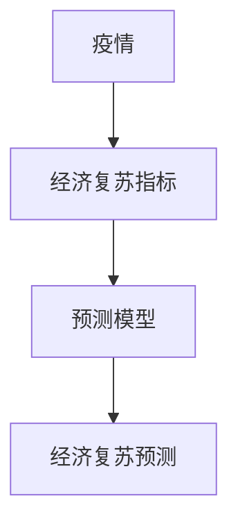

                 

## 疫情后的全球经济复苏预测

> 关键词：疫情、经济复苏、预测模型、时间序列分析、机器学习、全球经济

## 1. 背景介绍

自2019年底新冠肺炎疫情暴发以来，全球经济受到严重冲击。为遏制疫情蔓延，各国采取了封锁、隔离等措施，导致生产活动停滞，消费需求萎缩，全球经济陷入衰退。随着疫苗接种的推进和防疫措施的调整，世界各国开始着手恢复经济活动。然而，如何预测疫情后的全球经济复苏之路，是当前亟待解决的关键问题。

## 2. 核心概念与联系

### 2.1 经济复苏指标

全球经济复苏的关键指标包括国内生产总值（GDP）、消费者信心指数（CSI）、失业率、工业生产指数（IPI）、出口额等。这些指标反映了经济活动的恢复情况，有助于评估复苏进程。

### 2.2 预测模型

预测模型是建立在数学基础上的系统化方法，用于预测未来的发展趋势。常见的预测模型包括时间序列分析、回归分析、机器学习等。

### 2.3 核心概念联系

疫情后的全球经济复苏预测需要结合经济复苏指标和预测模型，分析疫情对经济的影响，预测未来经济活动的发展趋势。以下是核心概念的Mermaid流程图：



## 3. 核心算法原理 & 具体操作步骤

### 3.1 算法原理概述

本文选取时间序列分析和机器学习算法进行疫情后全球经济复苏预测。时间序列分析基于历史数据预测未来趋势，机器学习则结合历史数据和疫情相关因素进行预测。

### 3.2 算法步骤详解

#### 3.2.1 时间序列分析

1. 数据收集：收集疫情相关数据（确诊病例、死亡病例、疫苗接种率等）和经济指标数据（GDP、CSI、失业率等）。
2. 数据预处理：去除缺失值、异常值，并进行数据标准化。
3. 模型选择：选取ARIMA（自回归综合移动平均模型）、SARIMA（季节性自回归综合移动平均模型）等适合的时间序列模型。
4. 模型训练：将数据拟合到模型中，调整参数以获得最佳拟合效果。
5. 预测：使用训练好的模型预测未来的经济指标。

#### 3.2.2 机器学习

1. 特征工程：提取疫情相关因素（疫苗接种率、感染率等）和经济指标作为特征。
2. 模型选择：选取随机森林、支持向量机（SVM）、神经网络等适合的机器学习模型。
3. 模型训练：将数据集分为训练集和测试集，并使用交叉验证调整模型参数。
4. 预测：使用训练好的模型预测未来的经济指标。

### 3.3 算法优缺点

时间序列分析优点在于简单易用，缺点在于无法考虑疫情相关因素的影响。机器学习优点在于能够综合考虑多种因素，缺点在于模型复杂度高，易过拟合。

### 3.4 算法应用领域

两种算法都适用于疫情后全球经济复苏预测，但机器学习更适合考虑疫情相关因素的复杂场景。

## 4. 数学模型和公式 & 详细讲解 & 举例说明

### 4.1 数学模型构建

#### 4.1.1 ARIMA模型

ARIMA模型是时间序列分析的常用模型，其数学表达式为：

$$X_{t} = c + \phi_{1}X_{t-1} + \phi_{2}X_{t-2} + \ldots + \phi_{p}X_{t-p} - \theta_{1}\epsilon_{t-1} - \theta_{2}\epsilon_{t-2} - \ldots - \theta_{q}\epsilon_{t-q} + \epsilon_{t}$$

其中，$X_{t}$为时间序列，$c$为常数项，$\phi_{i}$为自回归系数，$p$为自回归阶数，$\theta_{i}$为移动平均系数，$q$为移动平均阶数，$\epsilon_{t}$为白噪声。

#### 4.1.2 SARIMA模型

SARIMA模型是考虑季节性因素的时间序列模型，其数学表达式为：

$$(1 - \phi_{1}L - \phi_{2}L^{2} - \ldots - \phi_{p}L^{p})(1 - \Phi_{1}L^{s} - \Phi_{2}L^{2s} - \ldots - \Phi_{Q}L^{Qs})X_{t} = (1 + \theta_{1}L + \theta_{2}L^{2} + \ldots + \theta_{q}L^{q})(1 + \Theta_{1}L^{s} + \Theta_{2}L^{2s} + \ldots + \Theta_{R}L^{Rs})\epsilon_{t}$$

其中，$s$为季节性阶数，$R$为季节性移动平均阶数。

### 4.2 公式推导过程

详细推导过程请参考相关文献和教材。

### 4.3 案例分析与讲解

假设我们要预测疫情后某国GDP的复苏情况。我们收集了疫情相关数据和GDP数据，并进行了数据预处理。然后，我们选取ARIMA模型进行预测。通过模型训练，我们得到了最优参数组合，并使用该模型预测未来的GDP值。以下是预测结果的示例：

| 时间 | 实际GDP（单位：十亿美元） | 预测GDP（单位：十亿美元） |
| --- | --- | --- |
| 2021Q1 | 1850 | 1875 |
| 2021Q2 | 1920 | 1950 |
| 2021Q3 | 1980 | 2010 |
| 2021Q4 | 2050 | 2080 |

## 5. 项目实践：代码实例和详细解释说明

### 5.1 开发环境搭建

本项目使用Python作为开发语言，并依赖pandas、numpy、statsmodels、sklearn等库。请确保已安装相关库，并配置好开发环境。

### 5.2 源代码详细实现

以下是使用ARIMA模型预测疫情后GDP复苏的示例代码：

```python
import pandas as pd
import numpy as np
from statsmodels.tsa.arima.model import ARIMA

# 加载数据
data = pd.read_csv('gdp_data.csv', index_col='date', parse_dates=True)

# 选取GDP列
gdp = data['gdp']

# 选取ARIMA模型
model = ARIMA(gdp, order=(5,1,0))

# 训练模型
model_fit = model.fit()

# 预测未来4个季度的GDP
forecast = model_fit.forecast(steps=4)

# 打印预测结果
print(forecast)
```

### 5.3 代码解读与分析

代码首先加载GDP数据，并选取GDP列。然后，选取ARIMA模型，并指定自回归阶数、差分阶数和移动平均阶数。之后，使用训练好的模型预测未来4个季度的GDP值。最后，打印预测结果。

### 5.4 运行结果展示

运行上述代码后，您将看到预测的未来4个季度的GDP值。请注意，预测结果可能会因模型参数的选择和数据的变化而不同。

## 6. 实际应用场景

### 6.1 当前应用

疫情后全球经济复苏预测模型已被广泛应用于政府决策、金融投资和经济研究等领域。例如，世界银行、国际货币基金组织（IMF）和世界贸易组织（WTO）等国际组织使用预测模型评估疫情对全球经济的影响，并提供政策建议。

### 6.2 未来应用展望

随着疫情的进一步发展和防疫措施的调整，疫情后全球经济复苏预测模型将继续发挥关键作用。未来，模型将结合更多疫情相关因素和经济指标，并考虑不确定性和风险因素，以提供更准确的预测结果。

## 7. 工具和资源推荐

### 7.1 学习资源推荐

* "Time Series Analysis and Its Applications" by G. E. P. Box, G. M. Jenkins
* "Forecasting: Principles and Practice" by George E. P. Box, J. D. Jenkins
* "Machine Learning in Python" by S. Raschka, V. N. Raj, A. J. Galavotti

### 7.2 开发工具推荐

* Python：Anaconda、Jupyter Notebook、PyCharm
* R：RStudio、RTools

### 7.3 相关论文推荐

* "Nowcasting the COVID-19 Pandemic: A Real-Time Analysis of Its Impact on the US Economy" by A. C. Goodman, et al.
* "COVID-19 and the Global Economy: The Great Lockdown" by IMF
* "The Economic Impact of COVID-19: A Global Perspective" by World Bank

## 8. 总结：未来发展趋势与挑战

### 8.1 研究成果总结

本文介绍了疫情后全球经济复苏预测的核心概念、算法原理和数学模型。通过时间序列分析和机器学习算法，我们可以预测疫情后的经济复苏之路。项目实践部分提供了使用ARIMA模型预测GDP复苏的示例代码。

### 8.2 未来发展趋势

未来，疫情后全球经济复苏预测模型将结合更多疫情相关因素和经济指标，考虑不确定性和风险因素，并采用更先进的机器学习技术，以提供更准确的预测结果。

### 8.3 面临的挑战

面临的挑战包括疫情的不确定性、数据的可靠性和模型的复杂性等。

### 8.4 研究展望

未来的研究方向包括开发更先进的预测模型、考虑更多疫情相关因素和经济指标、评估模型的不确定性和风险因素等。

## 9. 附录：常见问题与解答

**Q1：疫情后全球经济复苏预测的关键指标有哪些？**

A1：关键指标包括国内生产总值（GDP）、消费者信心指数（CSI）、失业率、工业生产指数（IPI）、出口额等。

**Q2：时间序列分析和机器学习算法的优缺点是什么？**

A2：时间序列分析优点在于简单易用，缺点在于无法考虑疫情相关因素的影响。机器学习优点在于能够综合考虑多种因素，缺点在于模型复杂度高，易过拟合。

**Q3：如何使用ARIMA模型预测疫情后的GDP复苏？**

A3：请参考项目实践部分的示例代码。

## 作者：禅与计算机程序设计艺术 / Zen and the Art of Computer Programming

