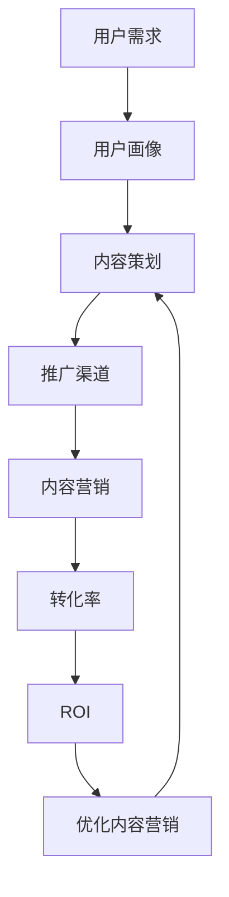

                 

**关键词：知识付费、内容营销、ROI优化、用户画像、内容策划、推广渠道、转化率、数据分析**

## 1. 背景介绍

随着互联网的发展，知识付费行业蓬勃兴起，但如何提高内容营销的ROI（Return on Investment，投资回报率）是创业者面临的共同挑战。本文将深入探讨知识付费创业中的内容营销ROI优化，帮助创业者提高内容价值，实现更高的转化率和盈利。

## 2. 核心概念与联系

### 2.1 关键概念

- **用户画像（User Persona）**：描述目标用户的详细特征，包括年龄、性别、职业、兴趣爱好等。
- **内容策划（Content Strategy）**：根据用户需求和市场趋势，规划内容的主题、形式和发布频率。
- **推广渠道（Promotion Channels）**：内容营销的渠道，包括但不限于社交媒体、邮件营销、搜索引擎营销等。
- **转化率（Conversion Rate）**：用户从访问内容到付费购买的比例。
- **ROI（Return on Investment）**：内容营销投入产出比，用于衡量营销活动的效果。

### 2.2 核心概念联系 Mermaid 流程图



## 3. 核心算法原理 & 具体操作步骤

### 3.1 算法原理概述

内容营销ROI优化算法的核心是不断优化用户画像、内容策划和推广渠道，提高转化率和ROI。算法流程如下：

1. 定义用户画像
2. 规划内容策略
3. 选择推广渠道
4. 执行内容营销
5. 监控转化率和ROI
6. 优化用户画像、内容策略和推广渠道
7. 重复步骤2-6

### 3.2 算法步骤详解

#### 3.2.1 定义用户画像

收集用户数据，分析用户需求，定义详细的用户画像。常用方法包括调查问卷、分析用户行为数据和社交媒体分析。

#### 3.2.2 规划内容策略

根据用户画像，规划内容的主题、形式和发布频率。内容形式包括但不限于文章、视频、音频、课程等。

#### 3.2.3 选择推广渠道

根据用户画像和内容策略，选择合适的推广渠道。常用渠道包括社交媒体、邮件营销、搜索引擎营销、内容合作等。

#### 3.2.4 执行内容营销

根据内容策略和推广渠道，创建并发布内容。内容创作应注重质量，并与用户画像保持一致。

#### 3.2.5 监控转化率和ROI

监控内容营销的转化率和ROI，常用指标包括点击率（CTR）、转化率（CVR）、成本 per Acquisition（CPA）和ROI。

#### 3.2.6 优化用户画像、内容策略和推广渠道

根据监控数据，优化用户画像、内容策略和推广渠道。常用方法包括 A/B testing、数据分析和用户反馈。

### 3.3 算法优缺点

**优点：**

- 提高内容营销ROI
- 更好地满足用户需求
- 更有效地利用营销预算

**缺点：**

- 需要大量数据分析
- 需要持续优化和调整
- 可能需要大量人力和时间投入

### 3.4 算法应用领域

知识付费创业、内容营销、电子商务、在线教育等领域。

## 4. 数学模型和公式 & 详细讲解 & 举例说明

### 4.1 数学模型构建

内容营销ROI优化的数学模型可以表示为：

$$ROI = \frac{Total \, Revenue - Total \, Cost}{Total \, Cost}$$

其中，$Total \, Revenue$ 表示内容营销带来的总收入，$Total \, Cost$ 表示内容营销的总成本。

### 4.2 公式推导过程

内容营销ROI的公式推导过程如下：

1. 计算总收入：$Total \, Revenue = Conversion \, Rate \times Average \, Order \, Value \times Number \, of \, Visitors$
2. 计算总成本：$Total \, Cost = Cost \, per \, Acquisition \times Number \, of \, Visitors$
3. 计算ROI：$ROI = \frac{Total \, Revenue - Total \, Cost}{Total \, Cost}$

### 4.3 案例分析与讲解

假设一家知识付费平台的内容营销数据如下：

- 转化率（CVR）：2%
- 平均订单价值（AOV）：$50
- 访问量（Number of Visitors）：10,000
- 每个访问者的获取成本（CPA）：$2

则总收入为：

$$Total \, Revenue = 0.02 \times 50 \times 10,000 = $100,000$$

总成本为：

$$Total \, Cost = 2 \times 10,000 = $20,000$$

ROI为：

$$ROI = \frac{100,000 - 20,000}{20,000} = 4$$

## 5. 项目实践：代码实例和详细解释说明

### 5.1 开发环境搭建

本项目使用Python和其常用库（Pandas、NumPy、Matplotlib、Seaborn）进行数据分析和可视化。建议使用Jupyter Notebook进行开发。

### 5.2 源代码详细实现

以下是内容营销ROI优化的Python代码示例：

```python
import pandas as pd
import numpy as np
import matplotlib.pyplot as plt
import seaborn as sns

# 定义用户画像、内容策略和推广渠道
user_persona = {
    'Age': 25,
    'Gender': 'Male',
    'Occupation': 'Engineer',
    'Interests': ['Technology', 'Business']
}

content_strategy = {
    'Topic': 'Artificial Intelligence',
    'Format': 'Article',
    'Frequency': 'Weekly'
}

promotion_channels = ['Facebook', 'Email', 'SEO']

# 执行内容营销
def execute_content_marketing(user_persona, content_strategy, promotion_channels):
    # 创建内容
    content = create_content(content_strategy)

    # 发布内容
    for channel in promotion_channels:
        publish_content(content, channel)

    # 监控转化率和ROI
    monitor_ROI(user_persona, content_strategy, promotion_channels)

# 创建内容
def create_content(content_strategy):
    # 根据内容策略创建内容
    pass

# 发布内容
def publish_content(content, channel):
    # 根据推广渠道发布内容
    pass

# 监控转化率和ROI
def monitor_ROI(user_persona, content_strategy, promotion_channels):
    # 监控转化率和ROI
    pass
```

### 5.3 代码解读与分析

本示例代码定义了用户画像、内容策略和推广渠道，并实现了内容营销的执行、内容创建、内容发布和ROI监控功能。代码中使用了面向对象的设计，将用户画像、内容策略和推广渠道定义为字典，内容营销功能定义为函数。

### 5.4 运行结果展示

本示例代码的运行结果是内容营销的执行，内容创建、内容发布和ROI监控功能的实现。具体结果取决于内容策略、推广渠道和用户画像的设置。

## 6. 实际应用场景

### 6.1 当前应用

内容营销ROI优化在知识付费创业中广泛应用，帮助创业者提高内容价值，实现更高的转化率和盈利。例如，在线教育平台使用内容营销ROI优化吸引更多用户注册和购买课程，知识付费平台使用内容营销ROI优化提高内容转化率和盈利。

### 6.2 未来应用展望

随着人工智能和大数据技术的发展，内容营销ROI优化将更加智能化和精准化。未来，内容营销ROI优化将结合用户行为数据、社交媒体数据和其他外部数据，实现更精准的用户画像和内容策略。此外，自动化和智能化的内容创作和发布技术将提高内容营销ROI优化的效率和效果。

## 7. 工具和资源推荐

### 7.1 学习资源推荐

- **书籍**：《精益创业》《增长黑客》《内容营销实战》《数据分析入门与实践》
- **在线课程**：Coursera、Udemy、LinkedIn Learning、Pluralsight
- **博客**：Medium、 Towards Data Science、Data Science Central

### 7.2 开发工具推荐

- **数据分析**：Python（Pandas、NumPy、Matplotlib、Seaborn）、R（dplyr、ggplot2）、Excel
- **内容创作**：Google Docs、Microsoft Word、Markdown、Adobe Creative Cloud
- **内容发布**：WordPress、Joomla、Drupal、Medium

### 7.3 相关论文推荐

- [Content Marketing ROI: A Framework for Measuring Success](https://www.contentmarketinginstitute.com/2016/09/content-marketing-roi-framework/)
- [The State of Content Marketing in 2021](https://contentmarketinginstitute.com/2021/10/state-of-content-marketing-2021/)
- [How to Calculate Content Marketing ROI](https://neilpatel.com/blog/content-marketing-roi/)

## 8. 总结：未来发展趋势与挑战

### 8.1 研究成果总结

本文介绍了知识付费创业中的内容营销ROI优化的核心概念、算法原理、数学模型和实践应用。通过优化用户画像、内容策略和推广渠道，创业者可以提高内容营销ROI，实现更高的转化率和盈利。

### 8.2 未来发展趋势

内容营销ROI优化的未来发展趋势包括：

- 更智能化和精准化的用户画像和内容策略
- 自动化和智能化的内容创作和发布技术
- 更广泛的数据来源和分析方法
- 更多元化的内容形式和渠道

### 8.3 面临的挑战

内容营销ROI优化面临的挑战包括：

- 数据收集和分析的复杂性
- 用户需求和市场趋势的不确定性
- 内容创作和发布的成本和时间投入
- 竞争对手的策略和行动

### 8.4 研究展望

未来的研究方向包括：

- 结合人工智能和大数据技术的内容营销ROI优化
- 更多元化的内容形式和渠道的ROI优化
- 更广泛的数据来源和分析方法的ROI优化
- 更智能化和精准化的用户画像和内容策略的ROI优化

## 9. 附录：常见问题与解答

**Q1：内容营销ROI优化的关键指标是什么？**

A1：内容营销ROI优化的关键指标包括转化率（CVR）、成本 per Acquisition（CPA）和ROI。

**Q2：如何定义用户画像？**

A2：定义用户画像的常用方法包括调查问卷、分析用户行为数据和社交媒体分析。

**Q3：如何规划内容策略？**

A3：根据用户画像，规划内容的主题、形式和发布频率。内容形式包括但不限于文章、视频、音频、课程等。

**Q4：如何选择推广渠道？**

A4：根据用户画像和内容策略，选择合适的推广渠道。常用渠道包括社交媒体、邮件营销、搜索引擎营销、内容合作等。

**Q5：如何监控转化率和ROI？**

A5：监控内容营销的转化率和ROI，常用指标包括点击率（CTR）、转化率（CVR）、成本 per Acquisition（CPA）和ROI。

**Q6：如何优化用户画像、内容策略和推广渠道？**

A6：根据监控数据，优化用户画像、内容策略和推广渠道。常用方法包括 A/B testing、数据分析和用户反馈。

**Q7：内容营销ROI优化的未来发展趋势是什么？**

A7：内容营销ROI优化的未来发展趋势包括更智能化和精准化的用户画像和内容策略，自动化和智能化的内容创作和发布技术，更广泛的数据来源和分析方法，更多元化的内容形式和渠道。

**Q8：内容营销ROI优化面临的挑战是什么？**

A8：内容营销ROI优化面临的挑战包括数据收集和分析的复杂性，用户需求和市场趋势的不确定性，内容创作和发布的成本和时间投入，竞争对手的策略和行动。

**Q9：未来的研究方向是什么？**

A9：未来的研究方向包括结合人工智能和大数据技术的内容营销ROI优化，更多元化的内容形式和渠道的ROI优化，更广泛的数据来源和分析方法的ROI优化，更智能化和精准化的用户画像和内容策略的ROI优化。

**Q10：如何开始内容营销ROI优化？**

A10：开始内容营销ROI优化的第一步是定义用户画像，然后规划内容策略，选择推广渠道，执行内容营销，监控转化率和ROI，并不断优化用户画像、内容策略和推广渠道。

---

作者：禅与计算机程序设计艺术 / Zen and the Art of Computer Programming

