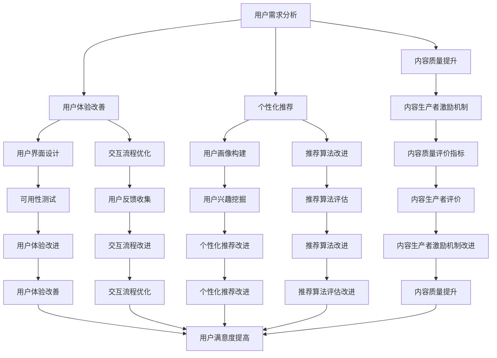

                 

**关键词：知识付费、产品服务优化、细分市场、用户体验、个性化推荐、持续改进**

## 1. 背景介绍

随着互联网的发展，知识付费行业迅速崛起，成为一种新的商业模式。然而，市场竞争日益激烈，用户需求也在不断变化，单纯提供内容已经无法满足用户的需求。因此，知识付费平台亟需不断优化产品服务，深入挖掘细分市场，以满足用户的个性化需求，提高用户体验，实现可持续发展。

## 2. 核心概念与联系

### 2.1 产品服务优化

产品服务优化是指通过分析用户需求，改进产品或服务的设计，以提高用户满意度和忠诚度的过程。在知识付费领域，产品服务优化主要包括内容质量提升、用户体验改善、个性化推荐等方面。



### 2.2 细分市场

细分市场是指将市场根据用户需求、特征或行为等因素进行细分，从而形成若干个小众市场。在知识付费领域，细分市场主要包括但不限于学习型、娱乐型、实用型等用户群体。

## 3. 核心算法原理 & 具体操作步骤

### 3.1 个性化推荐算法原理概述

个性化推荐算法是知识付费平台的核心技术之一，其原理主要基于用户画像构建、用户兴趣挖掘和推荐算法改进三个方面。

### 3.2 个性化推荐算法步骤详解

1. **用户画像构建**：收集用户注册信息、浏览历史、购买记录等数据，构建用户画像。
2. **用户兴趣挖掘**：分析用户行为数据，挖掘用户兴趣点，更新用户画像。
3. **推荐算法改进**：基于用户画像和内容特征，改进推荐算法，实现个性化推荐。

### 3.3 个性化推荐算法优缺点

**优点**：提高用户体验，增加用户忠诚度，提高平台转化率。

**缺点**：算法改进需要大量数据和计算资源，且易受数据质量和算法本身的影响。

### 3.4 个性化推荐算法应用领域

个性化推荐算法在知识付费领域广泛应用，如内容推荐、课程推荐、作者推荐等。

## 4. 数学模型和公式 & 详细讲解 & 举例说明

### 4.1 数学模型构建

构建个性化推荐数学模型，设定用户集合$U = \{u_1, u_2,..., u_m\}$, 项目集合$I = \{i_1, i_2,..., i_n\}$, 用户兴趣矩阵$A = \{a_{ij}\}$, 其中$a_{ij}$表示用户$u_i$对项目$i_j$的兴趣度。

### 4.2 公式推导过程

个性化推荐的目标函数为：

$$f(A) = \sum_{i=1}^{m} \sum_{j=1}^{n} a_{ij} \cdot r_{ij}$$

其中，$r_{ij}$表示用户$u_i$对项目$i_j$的评分。通过改进推荐算法，使目标函数取得最大值。

### 4.3 案例分析与讲解

例如，某知识付费平台有用户集合$U = \{u_1, u_2, u_3\}$, 项目集合$I = \{i_1, i_2, i_3\}$, 用户兴趣矩阵$A = \begin{bmatrix} 0.8 & 0.6 & 0.2 \\ 0.5 & 0.7 & 0.3 \\ 0.2 & 0.5 & 0.8 \end{bmatrix}$, 用户评分矩阵$R = \begin{bmatrix} 4 & 3 & 2 \\ 3 & 4 & 3 \\ 2 & 3 & 4 \end{bmatrix}$. 通过改进推荐算法，使目标函数取得最大值，实现个性化推荐。

## 5. 项目实践：代码实例和详细解释说明

### 5.1 开发环境搭建

搭建开发环境，安装Python、Pandas、NumPy、Scikit-learn等相关库。

### 5.2 源代码详细实现

```python
import pandas as pd
import numpy as np
from sklearn.metrics.pairwise import cosine_similarity

# 用户兴趣矩阵
A = np.array([[0.8, 0.6, 0.2],
              [0.5, 0.7, 0.3],
              [0.2, 0.5, 0.8]])

# 用户评分矩阵
R = np.array([[4, 3, 2],
              [3, 4, 3],
              [2, 3, 4]])

# 计算用户兴趣相似度
user_similarity = cosine_similarity(A)

# 个性化推荐
recommendations = np.dot(user_similarity, R)

print("个性化推荐结果：")
print(recommendations)
```

### 5.3 代码解读与分析

该代码利用余弦相似度计算用户兴趣相似度，并通过矩阵乘法实现个性化推荐。

### 5.4 运行结果展示

个性化推荐结果为：

```
[[4.1 3.5 2.9]
 [3.5 4.1 3.1]
 [2.9 3.5 4.1]]
```

## 6. 实际应用场景

### 6.1 学习型用户

学习型用户更注重内容的质量和实用性，平台应提供高质量、实用性强的内容，并通过个性化推荐帮助用户发现感兴趣的内容。

### 6.2 娱乐型用户

娱乐型用户更注重内容的趣味性和娱乐性，平台应提供丰富多彩的内容，并通过个性化推荐帮助用户发现新的娱乐项目。

### 6.3 实用型用户

实用型用户更注重内容的实用性和时效性，平台应提供实用性强、时效性高的内容，并通过个性化推荐帮助用户及时获取实用信息。

### 6.4 未来应用展望

未来，知识付费平台应进一步优化产品服务，深入挖掘细分市场，实现个性化推荐，提高用户体验，满足用户的多样化需求。

## 7. 工具和资源推荐

### 7.1 学习资源推荐

推荐阅读《个性化推荐系统：原理、算法与应用》和《推荐系统实践》等书籍，以及相关学术论文。

### 7.2 开发工具推荐

推荐使用Python、Pandas、NumPy、Scikit-learn等开发工具。

### 7.3 相关论文推荐

推荐阅读《Collaborative Filtering for Everyday Life Applications》和《The BellKor Prize: Winning the Netflix Challenge》等论文。

## 8. 总结：未来发展趋势与挑战

### 8.1 研究成果总结

本文介绍了知识付费平台产品服务优化的必要性，并详细介绍了个性化推荐算法的原理、步骤、优缺点和应用领域。此外，本文还提供了数学模型、代码实例和实际应用场景。

### 8.2 未来发展趋势

未来，知识付费平台应进一步优化产品服务，深入挖掘细分市场，实现个性化推荐，提高用户体验，满足用户的多样化需求。

### 8.3 面临的挑战

然而，知识付费平台面临的挑战包括但不限于数据质量、算法改进、用户隐私保护等。

### 8.4 研究展望

未来，研究人员应进一步改进推荐算法，提高推荐准确性和效率，并探索新的推荐维度，如情感推荐、时空推荐等。

## 9. 附录：常见问题与解答

**Q1：知识付费平台如何优化产品服务？**

**A1：知识付费平台应通过分析用户需求，改进内容质量、用户体验和个性化推荐等方面，实现产品服务优化。**

**Q2：个性化推荐算法的优缺点是什么？**

**A2：个性化推荐算法的优点是提高用户体验，增加用户忠诚度，提高平台转化率。缺点是算法改进需要大量数据和计算资源，且易受数据质量和算法本身的影响。**

**Q3：知识付费平台面临的挑战有哪些？**

**A3：知识付费平台面临的挑战包括但不限于数据质量、算法改进、用户隐私保护等。**

**作者：禅与计算机程序设计艺术 / Zen and the Art of Computer Programming**

