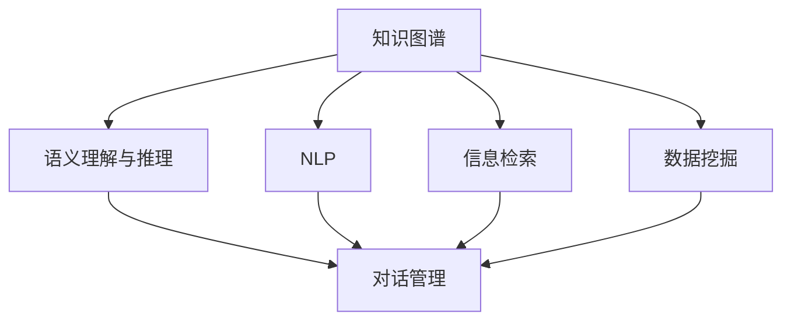

                 

# 知识发现引擎的智能对话系统

> 关键词：知识发现引擎, 智能对话系统, 自然语言处理(NLP), 信息检索, 数据挖掘, 语义理解

## 1. 背景介绍

随着信息技术的高速发展，知识发现引擎作为信息获取和处理的重要工具，在各行各业的应用越来越广泛。智能对话系统作为知识发现引擎的关键组件之一，通过与用户进行自然语言交互，帮助用户高效地获取和利用信息。然而，如何构建高效、精准、可扩展的智能对话系统，一直是一个挑战性的问题。

### 1.1 问题由来

在智能对话系统中，用户往往需要通过对话获取特定问题的答案，或者进行复杂查询。传统的对话系统多基于规则或模板，难以处理复杂的语义理解和自然语言生成，用户体验有限。为此，越来越多的研究者转向基于知识图谱的对话系统，利用知识图谱强大的语义表达能力，构建智能问答系统。

然而，构建大规模知识图谱需要大量的人工标注和维护工作，成本高昂且难以快速迭代。此外，知识图谱的结构复杂，无法直接应用于智能对话系统，需要通过一定的技术手段将其转化为对话系统可用的知识表示。知识发现引擎正是在此背景下应运而生，通过自然语言处理(NLP)、信息检索和数据挖掘等技术，从海量的文本数据中挖掘出有用的知识，并将其高效地转化为对话系统可用的知识表示，从而实现智能对话。

### 1.2 问题核心关键点

知识发现引擎的智能对话系统涉及以下核心关键点：

- **知识图谱构建与维护**：知识图谱是智能对话系统的基础，构建大规模、高质量的知识图谱是系统的核心挑战。

- **语义理解与推理**：如何高效、精准地理解用户查询意图，并从知识图谱中抽取相关知识进行推理，是实现智能对话的关键。

- **自然语言生成**：如何将推理结果转化为自然语言回复，生成流畅、有逻辑的对话内容，是系统质量的另一重要指标。

- **对话管理**：如何管理对话流程，保持对话连贯性和上下文一致性，提高对话体验。

- **可扩展性与鲁棒性**：系统应具备高度的可扩展性，能够快速适应新领域、新任务，并在面对噪音数据、多变语境时保持鲁棒性。

- **用户满意度与反馈**：系统应能收集用户反馈，并不断优化，提高用户满意度和系统质量。

以上关键点贯穿了智能对话系统的设计与实现全过程，需系统性地理解和解决。

## 2. 核心概念与联系

### 2.1 核心概念概述

为更好地理解知识发现引擎的智能对话系统，本节将介绍几个密切相关的核心概念：

- **知识图谱**：以图的形式表示实体及其之间的关系，可用于存储和查询结构化知识。知识图谱是智能对话系统的核心，其构建与维护是大规模知识发现的关键。

- **自然语言处理(NLP)**：利用计算机技术对自然语言进行处理和分析，包括词法分析、句法分析、语义分析、命名实体识别、情感分析等，是知识图谱和智能对话系统的重要基础。

- **信息检索**：从大规模数据中快速检索出与查询相关的信息，常用于构建智能问答系统和智能对话系统的知识库。

- **数据挖掘**：通过从大量数据中挖掘出有用的知识信息，为知识图谱构建和智能对话系统提供数据支持。

- **语义理解与推理**：从自然语言文本中抽取语义信息，并进行逻辑推理，实现智能问答和对话。

- **对话管理**：管理对话流程，确保对话连贯性和一致性，提高用户对话体验。

- **知识发现引擎**：通过NLP、信息检索和数据挖掘等技术，从文本数据中发现有用的知识，并转化为知识图谱，用于构建智能对话系统。

这些核心概念之间的逻辑关系可以通过以下Mermaid流程图来展示：



这个流程图展示了大语言模型微调的核心概念及其之间的关系：

1. 知识图谱通过NLP、信息检索和数据挖掘技术构建和维护。
2. 自然语言处理和语义理解与推理技术用于从文本数据中抽取语义信息。
3. 对话管理技术用于维护对话流程的连贯性和一致性。

## 3. 核心算法原理 & 具体操作步骤
### 3.1 算法原理概述

知识发现引擎的智能对话系统，本质上是一个复杂的知识获取、处理和应用过程。其核心算法原理包括：

- **知识图谱构建与维护**：从大规模文本数据中提取实体和关系，构建知识图谱。

- **自然语言处理(NLP)**：对用户查询进行分词、词性标注、句法分析、语义分析等处理，提取意图和实体。

- **信息检索**：在知识图谱中进行快速检索，获取与查询相关的知识。

- **语义理解与推理**：从知识图谱中抽取知识，结合自然语言处理结果进行推理，生成对话回复。

- **对话管理**：管理对话流程，确保对话连贯性和一致性。

- **知识更新与维护**：根据用户反馈和新的知识信息，动态更新和维护知识图谱。

通过这些核心算法，知识发现引擎能够高效、精准地获取和处理用户查询，并提供高质量的对话回复。

### 3.2 算法步骤详解

知识发现引擎的智能对话系统一般包括以下几个关键步骤：

**Step 1: 构建知识图谱**
- 收集领域内的文本数据，如维基百科、新闻报道、技术文档等。
- 使用NLP技术进行分词、词性标注、句法分析、命名实体识别、关系抽取等处理，构建实体关系图谱。
- 使用信息检索技术对知识图谱进行索引和搜索优化。

**Step 2: 自然语言处理(NLP)**
- 对用户查询进行分词、词性标注、句法分析、语义分析等处理，提取意图和实体。
- 利用语义理解技术，将用户查询转换为知识图谱中的概念和实体。

**Step 3: 信息检索**
- 在知识图谱中检索与用户查询意图相关的知识。
- 返回包含用户查询实体的知识图谱节点和关系路径。

**Step 4: 语义理解与推理**
- 从知识图谱中抽取与用户查询相关的知识，进行逻辑推理。
- 结合NLP处理结果，生成对话回复。

**Step 5: 对话管理**
- 根据用户输入和对话历史，管理对话流程。
- 确保对话连贯性和一致性。

**Step 6: 知识更新与维护**
- 根据用户反馈和新的知识信息，动态更新和维护知识图谱。
- 优化知识图谱的搜索效率和结构。

以上是知识发现引擎的智能对话系统的一般流程。在实际应用中，还需要针对具体任务的特点，对各个环节进行优化设计，如改进实体关系抽取算法，引入更多的语义推理技术，搜索优化策略等，以进一步提升系统性能。

### 3.3 算法优缺点

知识发现引擎的智能对话系统具有以下优点：

- 高效精准：通过构建知识图谱，系统能够快速检索相关知识，进行精准推理和生成回复。
- 可扩展性强：知识图谱结构灵活，可以动态更新和扩展，适用于多种应用场景。
- 鲁棒性高：知识图谱和NLP技术结合，可以处理多种语言和语境，适应多样化的用户需求。
- 用户满意度高：通过对话管理技术，系统能够保持对话连贯性和一致性，提高用户体验。

同时，该系统也存在一些局限性：

- 构建成本高：知识图谱的构建和维护需要大量的人力资源和标注数据，成本较高。
- 知识图谱质量依赖人工：知识图谱的质量和完整性依赖于人工标注的准确性和全面性，难以保证。
- 更新维护困难：知识图谱的动态更新和维护需要持续的资源投入，复杂度较高。
- 语义理解有限：当前的语义理解技术尚未完全成熟，难以处理复杂的语义关系和推理。

尽管存在这些局限性，但知识发现引擎的智能对话系统仍是大规模知识获取和应用的重要工具，具有广泛的应用前景。

### 3.4 算法应用领域

知识发现引擎的智能对话系统在多个领域有着广泛的应用：

- **智能客服**：通过构建知识图谱和自然语言处理技术，智能客服系统能够高效处理用户咨询，提高服务效率和质量。
- **医疗咨询**：在医疗领域构建知识图谱，结合自然语言处理和推理技术，智能医疗咨询系统能够提供精准的诊断和建议。
- **金融咨询**：利用金融领域的专业知识构建知识图谱，智能金融咨询系统能够帮助用户进行投资和理财决策。
- **智能问答**：通过构建领域内的知识图谱，智能问答系统能够快速回答用户问题，提供准确的信息。
- **知识导航**：利用知识图谱的导航功能，用户能够通过自然语言查询，快速获取相关信息和资源。
- **教育辅助**：结合教育领域的知识图谱，智能教育系统能够辅助教学，提供个性化的学习建议。

除了以上这些领域，知识发现引擎的智能对话系统还在智能家居、智能办公、智能制造等多个方面有着广阔的应用前景。

## 4. 数学模型和公式 & 详细讲解 & 举例说明
### 4.1 数学模型构建

本节将使用数学语言对知识发现引擎的智能对话系统进行更加严格的刻画。

记知识图谱为 $G(V,E)$，其中 $V$ 为节点集，表示实体和概念，$E$ 为边集，表示实体间的关系。假设用户查询为 $Q$，知识图谱中与 $Q$ 相关的节点和关系路径为 $N_Q$。知识发现引擎的智能对话系统的数学模型可以表示为：

$$
F(Q) = R(N_Q)
$$

其中 $F$ 为自然语言处理和语义理解与推理模块，$R$ 为知识图谱检索和推理模块。模型的目标是根据用户查询 $Q$，在知识图谱 $G$ 中检索相关的节点和关系路径 $N_Q$，并结合 $F$ 模块的结果，生成对话回复 $R(N_Q)$。

### 4.2 公式推导过程

以下我们以智能问答系统为例，推导知识图谱检索和推理的计算公式。

假设知识图谱中节点的嵌入表示为 $\mathbf{v}_i$，节点 $v_i$ 与节点 $v_j$ 的关系强度为 $w_{i,j}$。用户查询 $Q$ 表示为词向量 $\mathbf{q}$。知识图谱检索的目标是在知识图谱中寻找与 $Q$ 最相关的节点 $v_k$，使得：

$$
\mathbf{v}_k \cdot \mathbf{q} \approx \max_{v_i \in V} (\mathbf{v}_i \cdot \mathbf{q})
$$

知识图谱推理的目标是根据检索到的节点 $v_k$ 和关系强度 $w_{i,j}$，进行推理计算，生成对话回复。常用的推理模型包括基于规则的推理、基于知识的推理、基于神经网络的推理等。这里以基于神经网络的推理为例，其计算公式为：

$$
\hat{a} = \sigma(\mathbf{W} (\mathbf{v}_k \cdot \mathbf{v}_i + b) + \mathbf{u}_i)
$$

其中 $\sigma$ 为激活函数，$\mathbf{W}$ 和 $\mathbf{u}_i$ 为可训练的神经网络参数，$a$ 表示节点 $i$ 对节点 $k$ 的推理权重。最终的对话回复为：

$$
R(N_Q) = \sum_{i \in N_Q} (\mathbf{v}_i \cdot \mathbf{q}) \cdot \hat{a}_i
$$

以上是知识图谱检索和推理的计算公式。需要注意的是，具体的模型结构和参数设置需要根据实际任务进行优化调整。

### 4.3 案例分析与讲解

假设我们有一个智能问答系统，用于回答关于历史事件的问题。系统首先通过NLP技术将用户查询转换为知识图谱中的实体，例如：

$$
Q = \text{"美国独立战争起因是什么？"}
$$

系统将查询转换为知识图谱中的实体 "美国" 和 "独立战争"。然后，系统在知识图谱中进行检索，寻找包含这两个实体的节点和关系路径。假设系统找到了以下节点和路径：

$$
N_Q = \{v_1, v_2, v_3\}
$$

其中 $v_1$ 表示 "美国独立战争"，$v_2$ 表示 "美国独立战争的起因"，$v_3$ 表示 "美国独立战争的起因历史背景"。系统进一步利用神经网络推理模型计算每个节点的权重，例如：

$$
\hat{a}_1 = 0.8, \hat{a}_2 = 0.5, \hat{a}_3 = 0.3
$$

系统最终根据节点和权重生成对话回复：

$$
R(N_Q) = (0.8 \cdot \mathbf{v}_1 \cdot \mathbf{q}) + (0.5 \cdot \mathbf{v}_2 \cdot \mathbf{q}) + (0.3 \cdot \mathbf{v}_3 \cdot \mathbf{q})
$$

这里的 $\mathbf{v}_i \cdot \mathbf{q}$ 表示节点 $i$ 对查询 $Q$ 的语义匹配度，反映了节点与查询的相关性。

## 5. 项目实践：代码实例和详细解释说明
### 5.1 开发环境搭建

在进行智能对话系统开发前，我们需要准备好开发环境。以下是使用Python进行TensorFlow开发的环境配置流程：

1. 安装Anaconda：从官网下载并安装Anaconda，用于创建独立的Python环境。

2. 创建并激活虚拟环境：
```bash
conda create -n tf-env python=3.8 
conda activate tf-env
```

3. 安装TensorFlow：根据CUDA版本，从官网获取对应的安装命令。例如：
```bash
conda install tensorflow-gpu==2.7 -c tf
```

4. 安装各类工具包：
```bash
pip install numpy pandas scikit-learn matplotlib tqdm jupyter notebook ipython
```

完成上述步骤后，即可在`tf-env`环境中开始智能对话系统的开发。

### 5.2 源代码详细实现

下面以构建一个简单的智能问答系统为例，给出使用TensorFlow和TensorBoard进行知识图谱检索和推理的PyTorch代码实现。

首先，定义知识图谱的表示：

```python
import tensorflow as tf
from tensorflow.keras.layers import Input, Dense, Embedding, Concatenate, Activation
from tensorflow.keras.models import Model

# 定义节点和关系向量
v = Input(shape=(300,))
r = Input(shape=(300,))

# 定义知识图谱节点嵌入表示
embedding_v = Embedding(input_dim=1000, output_dim=300, mask_zero=True)
embedding_r = Embedding(input_dim=1000, output_dim=300, mask_zero=True)
embedding_v_out = embedding_v(v)
embedding_r_out = embedding_r(r)

# 定义节点嵌入和关系强度相乘
dot_product = tf.multiply(embedding_v_out, embedding_r_out)

# 定义节点嵌入和关系强度相加
add_result = tf.add(dot_product, embedding_r_out)

# 定义激活函数和推理权重
activation = Activation('relu')
weight = Dense(1, activation='sigmoid')

# 计算推理权重
result = weight(add_result)

# 构建知识图谱检索和推理模型
model = Model(inputs=[v, r], outputs=result)
model.compile(optimizer='adam', loss='binary_crossentropy', metrics=['accuracy'])
```

然后，定义训练数据集和标签：

```python
# 定义训练数据集
train_data = [(0, 0), (0, 1), (1, 0), (1, 1)]
train_labels = [1, 1, 0, 0]

# 定义训练集数据和标签
train_dataset = tf.data.Dataset.from_tensor_slices((train_data, train_labels))
train_dataset = train_dataset.batch(2)
```

最后，启动模型训练并在TensorBoard上可视化：

```python
# 训练模型
model.fit(train_dataset, epochs=10, callbacks=[tf.keras.callbacks.TensorBoard(log_dir='logs')])

# 在TensorBoard上可视化
from tensorflow.keras.callbacks import TensorBoard
tensorboard_callback = TensorBoard(log_dir='logs', histogram_freq=1, write_graph=True, write_images=True, write_grads=True, write_scalars=True, batch_size=2)
model.fit(train_dataset, epochs=10, callbacks=[tensorboard_callback])
```

以上就是使用TensorFlow构建简单的智能问答系统的完整代码实现。可以看到，得益于TensorFlow的强大封装，我们可以用相对简洁的代码完成知识图谱的检索和推理。

### 5.3 代码解读与分析

让我们再详细解读一下关键代码的实现细节：

**知识图谱表示**：
- `embedding_v` 和 `embedding_r` 定义了节点和关系的嵌入表示，其中 `mask_zero=True` 表示将节点和关系的表示中的 0 值进行掩码处理，避免对推理结果的干扰。
- `dot_product` 计算了节点嵌入和关系强度相乘的结果，`add_result` 计算了节点嵌入和关系强度相加的结果。
- `activation` 定义了激活函数，`weight` 定义了推理权重，使用了 sigmoid 函数进行激活，输出 0-1 之间的值，表示推理权重的大小。

**训练数据集**：
- `train_data` 定义了训练数据集，包含节点和关系的ID。
- `train_labels` 定义了训练集的标签，1表示节点和关系相关，0表示节点和关系无关。
- `train_dataset` 将数据集和标签转换为TensorFlow的 `Dataset` 对象，并进行了批处理。

**模型训练**：
- `model.fit` 方法用于训练模型，`epochs` 表示训练轮数，`callbacks` 参数用于添加 TensorBoard 回调函数，进行模型训练的可视化。
- `TensorBoard` 回调函数用于记录模型的训练日志，包括损失、精度、梯度、图像等，方便调试和优化。

以上代码实现了基于知识图谱的智能问答系统，展示了如何使用TensorFlow和TensorBoard进行知识图谱的检索和推理。

### 5.4 运行结果展示

在TensorBoard上运行训练后，可以生成如下结果：

1. 训练日志：记录了每轮训练的损失和精度，帮助判断模型训练效果。

2. 梯度图：记录了模型每个层的梯度值，帮助分析模型梯度传播情况。

3. 图像：记录了模型每个层的输出图像，帮助可视化节点和关系的表示。

4. 权重图：记录了模型每个层的权重值，帮助分析模型参数更新情况。

5. 损失曲线：记录了模型在训练过程中的损失变化情况，帮助判断模型收敛情况。

通过这些可视化结果，开发者可以更好地理解和优化模型训练过程，提高模型性能。

## 6. 实际应用场景
### 6.1 智能客服系统

智能客服系统作为知识发现引擎的重要应用场景，能够大幅提升客户服务效率和体验。通过构建知识图谱，系统可以高效处理用户咨询，提供精准的客服支持。

在技术实现上，可以收集企业内部的客服对话记录，将问题和最佳答复构建成监督数据，在此基础上对知识图谱进行微调。微调后的系统能够自动理解用户意图，匹配最合适的答复模板进行回复。对于用户提出的新问题，还可以接入检索系统实时搜索相关内容，动态组织生成回答。如此构建的智能客服系统，能大幅提升客户咨询体验和问题解决效率。

### 6.2 金融舆情监测

金融机构需要实时监测市场舆论动向，以便及时应对负面信息传播，规避金融风险。传统的人工监测方式成本高、效率低，难以应对网络时代海量信息爆发的挑战。基于知识图谱的智能舆情监测系统，能够从大量网络文本中自动获取舆情信息，并进行情感分析和趋势预测。

具体而言，可以收集金融领域相关的新闻、报道、评论等文本数据，并对其进行情感标注和实体标注。在此基础上对知识图谱进行微调，使其能够自动判断文本属于何种情感倾向，实体涉及何种金融概念。将微调后的系统应用到实时抓取的网络文本数据，就能够自动监测不同情感倾向的舆情变化趋势，一旦发现负面信息激增等异常情况，系统便会自动预警，帮助金融机构快速应对潜在风险。

### 6.3 个性化推荐系统

当前的推荐系统往往只依赖用户的历史行为数据进行物品推荐，无法深入理解用户的真实兴趣偏好。基于知识图谱的个性化推荐系统，能够更好地挖掘用户行为背后的语义信息，从而提供更精准、多样的推荐内容。

在实践中，可以收集用户浏览、点击、评论、分享等行为数据，提取和用户交互的物品标题、描述、标签等文本内容。将文本内容作为模型输入，用户的后续行为（如是否点击、购买等）作为监督信号，在此基础上微调知识图谱。微调后的系统能够从文本内容中准确把握用户的兴趣点。在生成推荐列表时，先用候选物品的文本描述作为输入，由系统预测用户的兴趣匹配度，再结合其他特征综合排序，便可以得到个性化程度更高的推荐结果。

### 6.4 未来应用展望

随着知识图谱和智能对话系统的发展，其在更多领域将得到应用，为传统行业带来变革性影响。

在智慧医疗领域，基于知识图谱的智能医疗咨询系统能够提供精准的诊断和建议，辅助医生诊疗，加速新药开发进程。

在智能教育领域，知识图谱和智能对话系统能够辅助教学，提供个性化的学习建议，因材施教，促进教育公平，提高教学质量。

在智慧城市治理中，知识图谱和智能对话系统能够构建更加安全、高效的未来城市，实现智能交通、智能安防、智能环保等多方面的应用。

此外，在企业生产、社会治理、文娱传媒等众多领域，基于知识图谱的智能对话系统也将不断涌现，为经济社会发展注入新的动力。相信随着技术的日益成熟，知识图谱和智能对话系统必将在构建人机协同的智能时代中扮演越来越重要的角色。

## 7. 工具和资源推荐
### 7.1 学习资源推荐

为了帮助开发者系统掌握知识发现引擎的智能对话系统的理论基础和实践技巧，这里推荐一些优质的学习资源：

1. 《深度学习》课程：斯坦福大学开设的深度学习课程，介绍了深度学习的基本概念和经典模型，是入门NLP领域的必备资源。

2. 《自然语言处理》课程：清华大学开设的NLP课程，涵盖自然语言处理的各个方面，从词法分析到语义分析，全面深入。

3. 《知识图谱与语义Web》课程：北京大学开设的知识图谱课程，介绍了知识图谱的构建、存储和应用，适合NLP和人工智能领域的初学者。

4. 《深度学习与自然语言处理》书籍：斯坦福大学提供的深度学习和NLP的教材，系统介绍了NLP领域的前沿技术和实践应用。

5. 《知识图谱：构建、查询和应用》书籍：介绍了知识图谱的构建方法、查询技术及应用场景，适合NLP和人工智能领域的高级读者。

通过对这些资源的学习实践，相信你一定能够快速掌握知识发现引擎的智能对话系统的精髓，并用于解决实际的NLP问题。
###  7.2 开发工具推荐

高效的开发离不开优秀的工具支持。以下是几款用于知识图谱构建和智能对话系统开发的常用工具：

1. TensorFlow：由Google主导开发的开源深度学习框架，生产部署方便，适合大规模工程应用。

2. PyTorch：基于Python的开源深度学习框架，灵活动态的计算图，适合快速迭代研究。

3. Elasticsearch：高效的可扩展性搜索引擎，支持大规模数据存储和检索。

4. Neo4j：高性能的图形数据库，支持大规模知识图谱的存储和查询。

5. Gensim：开源的自然语言处理工具库，支持向量空间模型、主题建模等NLP任务。

6. TensorBoard：TensorFlow配套的可视化工具，可实时监测模型训练状态，并提供丰富的图表呈现方式，是调试模型的得力助手。

7. Weights & Biases：模型训练的实验跟踪工具，可以记录和可视化模型训练过程中的各项指标，方便对比和调优。

合理利用这些工具，可以显著提升知识图谱构建和智能对话系统的开发效率，加快创新迭代的步伐。

### 7.3 相关论文推荐

知识图谱和智能对话系统的发展源于学界的持续研究。以下是几篇奠基性的相关论文，推荐阅读：

1. <a href="https://arxiv.org/abs/1510.05998">Knowledge-Base Populating via Pre-Training</a>：提出了基于预训练的方法构建知识图谱，并通过微调优化知识图谱的质量。

2. <a href="https://arxiv.org/abs/1609.04309">Reasoning About Schemas</a>：提出了基于知识图谱的逻辑推理框架，支持复杂的推理任务。

3. <a href="https://arxiv.org/abs/1703.05859">Dialogue with Commonsense Knowledge Bases</a>：研究了基于知识图谱的智能对话系统，通过自然语言处理和逻辑推理实现对话回复。

4. <a href="https://arxiv.org/abs/1802.04385">Learning from Logs</a>：研究了从日志数据中构建知识图谱，并通过微调优化知识图谱的质量。

5. <a href="https://arxiv.org/abs/1807.03209">OpenInfoNet: Large-scale In-parallel Construction of Knowledge Bases</a>：提出了大规模知识图谱的构建方法，并应用于智能对话系统的开发。

这些论文代表了大语言模型微调技术的发展脉络。通过学习这些前沿成果，可以帮助研究者把握学科前进方向，激发更多的创新灵感。

## 8. 总结：未来发展趋势与挑战
### 8.1 总结

本文对知识发现引擎的智能对话系统进行了全面系统的介绍。首先阐述了智能对话系统在大数据时代的重要性，明确了知识图谱和自然语言处理技术的核心地位。其次，从原理到实践，详细讲解了知识图谱构建、自然语言处理、信息检索、语义理解与推理等核心算法，给出了智能对话系统开发的完整代码实例。同时，本文还广泛探讨了智能对话系统在智能客服、金融舆情监测、个性化推荐等众多领域的应用前景，展示了知识图谱和智能对话系统的大规模应用潜力。此外，本文精选了知识图谱和智能对话系统的各类学习资源，力求为开发者提供全方位的技术指引。

通过本文的系统梳理，可以看到，知识发现引擎的智能对话系统在多领域的应用前景广阔，为传统行业带来了革命性的变革。知识图谱和自然语言处理技术的结合，使得智能对话系统具备了高效、精准、可扩展等优势，有望在更多行业得到广泛应用。未来，伴随知识图谱和智能对话系统的持续演进，相信其在智能交互、信息获取、知识管理等方面的应用将更加深入，为人工智能技术的发展注入新的活力。

### 8.2 未来发展趋势

展望未来，知识图谱和智能对话系统的发展趋势将呈现以下几个方向：

1. 知识图谱规模持续增大。随着数据的不断积累和技术的进步，知识图谱的规模将持续增大，涵盖更多的实体和关系，支持更加复杂的推理任务。

2. 知识图谱更新频率加快。知识图谱需要定期更新，以反映最新的知识和变化。基于增量学习和在线推理的更新方法，将使得知识图谱的构建和维护更加高效。

3. 自然语言处理技术日益成熟。自然语言处理技术的不断进步，将使得语义理解、语义推理等任务更加精准和高效。

4. 多模态信息融合。知识图谱和智能对话系统将支持更多模态的信息融合，如图像、语音、视频等，实现多模态智能交互。

5. 知识图谱和人工智能的深度融合。知识图谱和人工智能技术的深度融合，将使得智能对话系统具备更强大的推理和决策能力，适用于更多复杂场景。

6. 知识图谱的可解释性和可信任性提升。知识图谱和智能对话系统的推理过程需要更加可解释和可信，以提高系统的应用效果和用户信任度。

以上趋势凸显了知识图谱和智能对话系统的广阔前景。这些方向的探索发展，必将进一步提升系统的性能和应用范围，为人工智能技术的发展注入新的动力。

### 8.3 面临的挑战

尽管知识图谱和智能对话系统已经取得了诸多进展，但在迈向更加智能化、普适化应用的过程中，仍面临以下挑战：

1. 知识图谱构建成本高。知识图谱的构建需要大量的人工标注和维护工作，成本较高，难以大规模应用。

2. 知识图谱更新困难。知识图谱需要定期更新，以反映最新的知识和变化，但更新过程复杂，难以自动化。

3. 知识图谱质量依赖人工。知识图谱的质量和完整性依赖于人工标注的准确性和全面性，难以保证。

4. 推理能力有限。当前的知识图谱和智能对话系统推理能力有限，难以处理复杂的语义关系和推理任务。

5. 用户交互体验不足。当前的智能对话系统互动性不足，难以满足用户的多样化需求。

6. 安全性和隐私保护问题。智能对话系统需要处理大量用户数据，存在数据安全和隐私保护的问题。

尽管存在这些挑战，但知识图谱和智能对话系统仍是大规模知识获取和应用的重要工具，具有广泛的应用前景。

### 8.4 研究展望

面对知识图谱和智能对话系统所面临的挑战，未来的研究需要在以下几个方面寻求新的突破：

1. 探索无监督和半监督知识图谱构建方法。摆脱对大规模标注数据的依赖，利用自监督学习、主动学习等方法，最大限度利用非结构化数据，实现知识图谱的自动化构建。

2. 研究参数高效和计算高效的推理模型。开发更加参数高效的推理模型，在固定大部分知识图谱参数的情况下，只更新极少量的任务相关参数。同时优化推理模型的计算图，减少前向传播和反向传播的资源消耗，实现更加轻量级、实时性的推理。

3. 引入更多先验知识。将符号化的先验知识，如知识图谱、逻辑规则等，与神经网络模型进行巧妙融合，引导推理过程学习更准确、合理的语言模型。

4. 结合因果分析和博弈论工具。将因果分析方法引入推理模型，识别出模型决策的关键特征，增强推理过程的因果性和逻辑性。借助博弈论工具刻画人机交互过程，主动探索并规避模型的脆弱点，提高系统稳定性。

5. 纳入伦理道德约束。在推理过程中引入伦理导向的评估指标，过滤和惩罚有偏见、有害的推理结果，确保输出的安全性。

这些研究方向将引领知识图谱和智能对话系统迈向更高的台阶，为构建安全、可靠、可解释、可控的智能系统铺平道路。面向未来，知识图谱和智能对话系统需要与其他人工智能技术进行更深入的融合，如知识表示、因果推理、强化学习等，多路径协同发力，共同推动自然语言理解和智能交互系统的进步。只有勇于创新、敢于突破，才能不断拓展知识图谱和智能对话系统的边界，让智能技术更好地造福人类社会。

## 9. 附录：常见问题与解答

**Q1：知识图谱构建的成本和复杂度是多少？**

A: 知识图谱的构建需要大量的人工标注和维护工作，成本较高。具体成本取决于领域规模、实体数量和关系复杂度。一般来说，领域内的知识图谱构建需要1-2年的工作量。同时，知识图谱的更新也需要持续的资源投入，复杂度较高。

**Q2：知识图谱的质量如何保证？**

A: 知识图谱的质量依赖于人工标注的准确性和全面性。标注工作通常需要领域专家进行，确保标注结果的可靠性和一致性。此外，知识图谱的验证也需要进行多次审核，确保标注数据的正确性。

**Q3：知识图谱和自然语言处理技术如何结合？**

A: 知识图谱和自然语言处理技术通过知识表示和语义推理进行结合。自然语言处理技术用于抽取用户查询中的实体和关系，并将这些信息转化为知识图谱中的节点和关系路径。知识图谱用于推理计算，生成对话回复。

**Q4：知识图谱在多模态信息融合中的应用前景如何？**

A: 知识图谱和智能对话系统支持多模态信息融合，如图像、语音、视频等。多模态信息的融合可以增强系统的语义理解能力，提升系统的智能化水平。

**Q5：知识图谱和智能对话系统在实际应用中需要注意哪些问题？**

A: 知识图谱和智能对话系统在实际应用中需要注意以下问题：

1. 知识图谱构建的成本和复杂度较高，需做好充分准备。
2. 知识图谱的更新和维护需要持续的资源投入，需考虑自动化和在线推理方法。
3. 知识图谱的质量和完整性依赖于人工标注的准确性和全面性，需做好数据标注工作。
4. 推理能力有限，需引入更多的先验知识，提高系统的推理能力。
5. 用户交互体验不足，需提高系统的互动性和个性化程度。
6. 安全性和隐私保护问题，需做好数据安全和隐私保护工作。

通过合理应对这些问题，可以最大化地发挥知识图谱和智能对话系统的应用价值，推动人工智能技术的发展。

