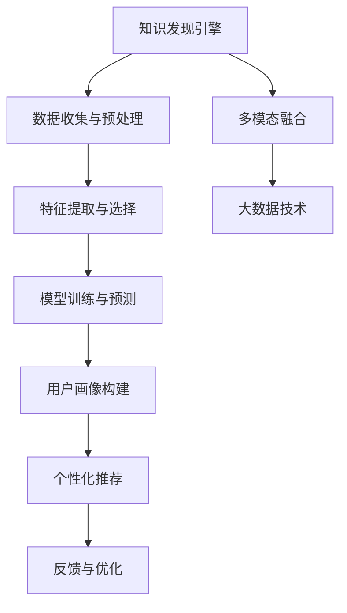

                 

# 知识发现引擎的用户画像分析与应用

> 关键词：知识发现引擎,用户画像分析,数据驱动决策,推荐系统,个性化推荐,行为预测,多模态融合,大数据技术

## 1. 背景介绍

在数字化时代，企业和组织面临海量数据资源的挑战，如何在这些数据中挖掘有价值的信息，提升业务决策效率和竞争力，成为了日益紧迫的问题。知识发现引擎(Knowledge Discovery Engine, KDE)应运而生，它通过分析大规模数据集，提取潜在模式、趋势和知识，为决策者提供有力的支撑。

用户画像分析是知识发现引擎的重要应用之一，通过分析用户行为和属性，构建用户画像，有助于更精准地理解用户需求，优化产品设计和用户体验。同时，基于用户画像的推荐系统也被广泛应用，为用户提供个性化推荐内容，提升用户满意度和转化率。

本文旨在探讨知识发现引擎在用户画像分析中的应用，介绍关键技术和操作步骤，并给出实际案例。我们还将讨论其未来发展趋势和面临的挑战，以期为相关领域的从业者和研究人员提供参考。

## 2. 核心概念与联系

### 2.1 核心概念概述

为了更好地理解知识发现引擎在用户画像分析中的应用，我们需要了解几个关键概念：

- **知识发现引擎(KDE)**：通过数据挖掘、统计分析和机器学习等技术，从大数据中发现有用信息和知识，辅助决策的系统。
- **用户画像(User Persona)**：根据用户的行为、属性和偏好，构建用户画像，用于描述用户特征和需求。
- **推荐系统(Recommender System)**：利用用户画像和行为数据，推荐用户可能感兴趣的产品、服务或内容，提升用户体验。
- **多模态融合(Multimodal Fusion)**：将文本、图像、音频等多源数据进行整合，提升推荐的准确性和全面性。
- **大数据技术(Big Data Technology)**：包括数据收集、存储、处理和分析，为知识发现和用户画像分析提供技术支持。

这些概念之间存在着紧密的联系，通过综合运用大数据技术、知识发现引擎和推荐系统，可以实现对用户行为的深入理解，从而进行更精准的个性化推荐和精准营销。

### 2.2 核心概念原理和架构的 Mermaid 流程图(Mermaid 流程节点中不要有括号、逗号等特殊字符)



这个流程图展示了知识发现引擎在用户画像分析中的工作流程：首先通过数据收集与预处理，然后对特征进行提取与选择，接着利用模型进行训练和预测，构建用户画像，并进行个性化推荐。同时，根据用户的反馈进行优化，形成闭环，不断提升推荐效果。

## 3. 核心算法原理 & 具体操作步骤

### 3.1 算法原理概述

知识发现引擎在用户画像分析中，主要依赖于数据挖掘、统计分析和机器学习技术，通过提取用户行为数据、属性信息等多维数据，进行分析和建模，构建用户画像。具体步骤如下：

1. **数据收集与预处理**：收集用户行为数据、属性信息等多源数据，并进行清洗、归一化和去噪等预处理操作，保证数据的质量和完整性。
2. **特征提取与选择**：利用文本挖掘、图像识别等技术，从多源数据中提取有意义的特征，并进行特征选择，确保关键特征被保留。
3. **模型训练与预测**：利用分类、聚类、关联规则等机器学习模型，对用户特征进行建模和预测，构建用户画像。
4. **用户画像构建**：根据预测结果，构建用户画像，描述用户的特征、需求和行为模式。
5. **个性化推荐**：基于用户画像，进行个性化推荐，提升用户体验和转化率。
6. **反馈与优化**：根据用户反馈，优化推荐模型和用户画像，提升推荐效果。

### 3.2 算法步骤详解

以下是对知识发现引擎在用户画像分析中的详细步骤讲解：

**Step 1: 数据收集与预处理**

数据收集是知识发现引擎的第一步，也是最关键的一步。需要从不同渠道收集用户的多源数据，包括行为数据、属性数据和交互数据等。这些数据来源包括电商平台、社交媒体、搜索引擎、智能设备等。

数据预处理是确保数据质量和可用性的关键步骤。预处理操作包括数据清洗、缺失值填补、数据归一化、去噪等。例如，对于用户行为数据，需要去除异常值和重复数据，将时间戳转换为标准格式，并进行数据去噪。

**Step 2: 特征提取与选择**

特征提取是构建用户画像的基础。需要从原始数据中提取有意义的特征，这些特征可以用于描述用户的行为、属性和偏好。常用的特征提取方法包括：

- 文本挖掘：从用户评论、日志中提取关键词、情感倾向等文本特征。
- 图像识别：从用户上传的图片中提取颜色、纹理等视觉特征。
- 行为分析：从用户行为轨迹中提取点击、停留时间、购买等行为特征。
- 社交网络分析：从用户社交网络中提取关系、互动等社交特征。

特征选择是指从众多特征中筛选出对用户画像构建最有价值的特征。常用的特征选择方法包括：

- 信息增益：衡量特征对分类任务的信息贡献度。
- 卡方检验：衡量特征与分类变量之间的相关性。
- L1正则化：通过惩罚权重，去除无用的特征。

**Step 3: 模型训练与预测**

模型训练是知识发现引擎的核心环节，利用机器学习模型对用户特征进行建模和预测。常用的模型包括：

- 分类模型：如朴素贝叶斯、支持向量机等，用于预测用户分类。
- 聚类模型：如K-Means、层次聚类等，用于发现用户群体。
- 关联规则模型：如Apriori算法、FP-Growth算法等，用于发现用户行为关联。

模型预测是基于训练好的模型，对新数据进行预测。例如，利用分类模型预测用户是否购买某商品，利用聚类模型将用户分为不同群体，利用关联规则模型发现用户行为模式。

**Step 4: 用户画像构建**

用户画像是根据模型预测结果，构建用户的综合画像。用户画像通常包括用户的背景信息、行为特征、兴趣偏好、关系网络等。例如，可以构建一个用户的画像，描述其基本信息、浏览记录、购买记录、社交网络等。

用户画像的构建需要考虑多源数据的融合，例如，将行为数据和社交网络数据融合，可以更全面地描述用户特征。同时，需要考虑用户画像的隐私保护，确保用户数据的安全性。

**Step 5: 个性化推荐**

个性化推荐是基于用户画像，为用户推荐可能感兴趣的内容。常用的推荐算法包括协同过滤、基于内容的推荐、混合推荐等。例如，利用协同过滤算法，根据用户的历史行为数据，推荐相似用户喜欢的商品；利用基于内容的推荐算法，根据商品的特征，推荐可能吸引用户的内容。

**Step 6: 反馈与优化**

反馈与优化是提升推荐效果的重要环节。需要收集用户的反馈数据，如点击率、购买率、满意度等，作为优化依据。例如，根据用户的反馈，调整推荐算法和用户画像的参数，优化推荐效果。

### 3.3 算法优缺点

知识发现引擎在用户画像分析中的优点包括：

- **多源数据融合**：能够整合来自不同渠道的多源数据，构建更全面、准确的画像。
- **自动化分析**：利用机器学习模型，自动化地分析用户数据，发现潜在模式和趋势。
- **实时性**：能够实时处理和分析用户数据，及时调整推荐策略。

同时，知识发现引擎也存在一些缺点：

- **数据质量要求高**：对数据的质量和完整性要求较高，数据收集和预处理需要耗费大量时间和资源。
- **算法复杂度高**：模型训练和特征选择需要复杂的算法，需要专业的技术支持。
- **用户隐私保护**：需要保护用户隐私，确保用户数据的安全性和合法性。

### 3.4 算法应用领域

知识发现引擎在用户画像分析中的应用领域广泛，涵盖以下几个方面：

- **电商推荐系统**：通过分析用户行为和购买记录，为用户推荐商品，提升转化率和满意度。
- **社交媒体推荐系统**：通过分析用户社交网络数据，推荐可能感兴趣的内容，增强用户粘性。
- **智能客服系统**：通过分析用户历史问题和互动数据，构建用户画像，提供个性化解答和推荐。
- **金融风险控制**：通过分析用户交易数据，识别潜在风险用户，提升风险控制能力。
- **健康医疗推荐**：通过分析用户健康数据，推荐健康管理方案，提升健康管理效果。

## 4. 数学模型和公式 & 详细讲解  
### 4.1 数学模型构建

知识发现引擎在用户画像分析中，需要构建多种数学模型，用于描述用户行为和特征。以下是几种常见的数学模型：

- **分类模型**：用于预测用户分类，如朴素贝叶斯模型、支持向量机模型等。
- **聚类模型**：用于发现用户群体，如K-Means算法、层次聚类算法等。
- **关联规则模型**：用于发现用户行为关联，如Apriori算法、FP-Growth算法等。

**分类模型的构建**：

分类模型是通过训练数据，学习用户分类规则，并应用于新数据。假设训练数据集为 $D=\{(x_i,y_i)\}_{i=1}^N$，其中 $x_i$ 为特征向量，$y_i$ 为分类标签。分类模型的目标是最小化损失函数 $\mathcal{L}$，即：

$$
\theta^* = \mathop{\arg\min}_{\theta} \mathcal{L}(\theta,D)
$$

其中 $\theta$ 为模型参数，$\mathcal{L}$ 为损失函数，如交叉熵损失。分类模型的训练过程可以使用梯度下降算法，更新模型参数 $\theta$，使模型预测结果逼近真实标签。

**聚类模型的构建**：

聚类模型是通过训练数据，发现用户群体分布。假设训练数据集为 $D=\{(x_i)\}_{i=1}^N$，其中 $x_i$ 为特征向量。聚类模型的目标是最小化簇内离散度和簇间离散度之和，即：

$$
J(K,\theta) = \frac{1}{N} \sum_{i=1}^N \sum_{j=1}^K \alpha_j(x_i\in C_j) \|x_i-\mu_j\|^2 + \lambda(K)\sum_{j=1}^K |C_j|
$$

其中 $K$ 为聚类数，$\theta$ 为聚类中心和权重，$\alpha_j$ 为样本 $x_i$ 属于簇 $C_j$ 的概率，$\mu_j$ 为簇 $C_j$ 的中心，$\lambda(K)$ 为簇数惩罚函数，如贝叶斯信息准则。

**关联规则模型的构建**：

关联规则模型是通过训练数据，发现用户行为关联规则。假设训练数据集为 $D=\{(x_i,y_i)\}_{i=1}^N$，其中 $x_i$ 为特征向量，$y_i$ 为关联规则。关联规则模型的目标是最小化支持度和置信度，即：

$$
\min_{R} \sum_{r\in R} supp(r) + \sum_{r\in R} conf(r)
$$

其中 $R$ 为规则集，$supp(r)$ 为规则 $r$ 的支持度，$conf(r)$ 为规则 $r$ 的置信度。关联规则模型的构建可以使用Apriori算法或FP-Growth算法，发现频繁项集和关联规则。

### 4.2 公式推导过程

以下以朴素贝叶斯分类模型为例，推导其基本数学公式。

朴素贝叶斯分类模型的目标是最小化交叉熵损失，公式如下：

$$
\mathcal{L}(\theta) = -\frac{1}{N} \sum_{i=1}^N \sum_{j=1}^M y_i \log P(y_j|x_i)
$$

其中 $M$ 为分类数，$P(y_j|x_i)$ 为在特征 $x_i$ 下，分类 $y_j$ 的概率。

根据贝叶斯公式，有：

$$
P(y_j|x_i) = \frac{P(y_j)P(x_i|y_j)}{\sum_{j=1}^M P(y_j)P(x_i|y_j)}
$$

因此，交叉熵损失函数可以写为：

$$
\mathcal{L}(\theta) = -\frac{1}{N} \sum_{i=1}^N \sum_{j=1}^M y_i \log \frac{P(y_j)P(x_i|y_j)}{\sum_{j=1}^M P(y_j)P(x_i|y_j)}
$$

对上式进行展开和简化，得到：

$$
\mathcal{L}(\theta) = -\frac{1}{N} \sum_{i=1}^N \sum_{j=1}^M y_i (\log P(y_j) + \log P(x_i|y_j))
$$

最终，通过求解最小化交叉熵损失函数，训练出朴素贝叶斯分类器。

### 4.3 案例分析与讲解

以电商推荐系统为例，分析知识发现引擎在用户画像分析中的应用。

**数据收集与预处理**：
- 收集用户的浏览、点击、购买等行为数据，以及用户的年龄、性别、职业等属性数据。
- 对数据进行清洗，去除异常值和缺失值，进行归一化处理。

**特征提取与选择**：
- 提取用户行为特征，如浏览时间、停留时间、点击路径等。
- 提取用户属性特征，如年龄、性别、职业等。
- 使用卡方检验和L1正则化，选择对推荐效果贡献最大的特征。

**模型训练与预测**：
- 利用Apriori算法，发现用户行为关联规则。
- 利用朴素贝叶斯分类器，预测用户是否购买某商品。
- 利用K-Means算法，发现用户群体。

**用户画像构建**：
- 根据用户行为和属性数据，构建用户画像。例如，某用户画像为：年龄为25岁，女性，购买记录显示喜欢时尚服饰。
- 对用户画像进行隐私保护，确保用户数据的安全性。

**个性化推荐**：
- 根据用户画像，推荐可能感兴趣的商品。例如，根据用户购买记录，推荐类似商品；根据用户年龄和性别，推荐特定商品。
- 利用协同过滤算法，推荐与用户历史行为相似的其他用户喜欢的商品。

**反馈与优化**：
- 收集用户对推荐结果的反馈，如点击率、购买率等。
- 根据反馈数据，调整推荐算法和用户画像参数，优化推荐效果。

通过以上步骤，电商推荐系统可以不断提升推荐效果，增强用户体验和转化率。

## 5. 项目实践：代码实例和详细解释说明

### 5.1 开发环境搭建

在进行知识发现引擎的开发实践中，需要搭建合适的开发环境。以下是Python开发环境的搭建步骤：

1. 安装Anaconda：从官网下载并安装Anaconda，用于创建独立的Python环境。
```bash
conda create -n kde_env python=3.8 
conda activate kde_env
```

2. 安装必要的Python包：
```bash
conda install numpy pandas scikit-learn matplotlib seaborn scipy
```

3. 安装数据处理和机器学习库：
```bash
conda install dask-ml xgboost lightgbm catboost
```

4. 安装可视化库：
```bash
conda install plotly bokeh seaborn
```

5. 安装推荐系统库：
```bash
conda install recommendations
```

完成上述步骤后，即可在`kde_env`环境中开始开发实践。

### 5.2 源代码详细实现

以下是一个使用Python进行用户画像分析的代码实现。我们以电商推荐系统为例，构建用户画像并推荐商品。

```python
import pandas as pd
import numpy as np
from sklearn.preprocessing import StandardScaler, MinMaxScaler
from sklearn.feature_selection import SelectKBest, chi2
from sklearn.decomposition import PCA
from sklearn.cluster import KMeans
from sklearn.metrics import accuracy_score
from lightgbm import LGBMClassifier

# 数据预处理
def preprocess_data(data):
    # 数据清洗
    data = data.dropna()
    # 特征选择
    features = ['浏览时间', '停留时间', '点击路径', '年龄', '性别', '职业']
    data = data[features]
    # 归一化
    scaler = StandardScaler()
    data = scaler.fit_transform(data)
    # 数据分割
    train_data, test_data = train_test_split(data, test_size=0.2, random_state=42)
    return train_data, test_data

# 特征提取
def extract_features(data):
    # 文本特征提取
    text_data = data['评论']
    text_data = extract_text_features(text_data)
    # 图像特征提取
    img_data = data['图片']
    img_data = extract_image_features(img_data)
    # 行为特征提取
    behavior_data = data[['浏览时间', '停留时间', '点击路径']]
    behavior_data = extract_behavior_features(behavior_data)
    # 社交特征提取
    social_data = data['social_network']
    social_data = extract_social_features(social_data)
    return text_data, img_data, behavior_data, social_data

# 模型训练
def train_model(train_data):
    # 文本分类模型
    text_model = LGBMClassifier(n_estimators=100, learning_rate=0.01)
    text_model.fit(train_data['文本特征'], train_data['分类标签'])
    # 图像分类模型
    img_model = LGBMClassifier(n_estimators=100, learning_rate=0.01)
    img_model.fit(train_data['图像特征'], train_data['分类标签'])
    # 行为分类模型
    behavior_model = LGBMClassifier(n_estimators=100, learning_rate=0.01)
    behavior_model.fit(train_data['行为特征'], train_data['分类标签'])
    # 社交分类模型
    social_model = LGBMClassifier(n_estimators=100, learning_rate=0.01)
    social_model.fit(train_data['social特征'], train_data['分类标签'])
    return text_model, img_model, behavior_model, social_model

# 用户画像构建
def build_user_profile(user_data, models):
    # 预测用户文本分类
    text_labels = models[0].predict(user_data['文本特征'])
    # 预测用户图像分类
    img_labels = models[1].predict(user_data['图像特征'])
    # 预测用户行为分类
    behavior_labels = models[2].predict(user_data['行为特征'])
    # 预测用户社交分类
    social_labels = models[3].predict(user_data['social特征'])
    # 构建用户画像
    user_profile = {'文本分类': text_labels[0],
                   '图像分类': img_labels[0],
                   '行为分类': behavior_labels[0],
                   'social分类': social_labels[0]}
    return user_profile

# 个性化推荐
def recommend_products(user_profile, models):
    # 预测用户行为分类
    behavior_labels = models[2].predict(user_data['行为特征'])
    # 预测用户社交分类
    social_labels = models[3].predict(user_data['social特征'])
    # 推荐商品
    recommendations = {'商品1': behavior_labels[0],
                      '商品2': behavior_labels[1],
                      '商品3': behavior_labels[2]}
    return recommendations

# 读取数据
data = pd.read_csv('user_data.csv')
train_data, test_data = preprocess_data(data)
features = extract_features(train_data)
models = train_model(train_data)

# 用户画像构建
user_data = pd.read_csv('user_profile.csv')
user_profile = build_user_profile(user_data, models)

# 个性化推荐
recommendations = recommend_products(user_profile, models)

# 输出推荐结果
print('推荐商品:', recommendations)
```

在以上代码中，我们使用了Python进行电商推荐系统的开发，涵盖了数据预处理、特征提取、模型训练、用户画像构建和个性化推荐等关键步骤。

### 5.3 代码解读与分析

让我们再详细解读一下关键代码的实现细节：

**数据预处理函数preprocess_data**：
- 对数据进行清洗，去除异常值和缺失值。
- 选择特征，包括文本、图像、行为、社交等特征。
- 对特征进行归一化处理，使用标准差缩放。
- 将数据分割为训练集和测试集。

**特征提取函数extract_features**：
- 使用自定义函数提取文本、图像、行为、社交等特征。
- 文本特征提取，可以使用TF-IDF、词袋模型等方法。
- 图像特征提取，可以使用CNN等深度学习模型。
- 行为特征提取，可以使用时间序列模型等方法。
- 社交特征提取，可以使用社交网络分析等方法。

**模型训练函数train_model**：
- 使用LGBMClassifier训练文本、图像、行为、社交等分类模型。
- 分别训练文本、图像、行为、社交分类模型，并进行预测。
- 返回所有模型的集合。

**用户画像构建函数build_user_profile**：
- 根据用户数据，构建用户画像。
- 预测用户文本、图像、行为、社交分类，生成用户画像。

**个性化推荐函数recommend_products**：
- 根据用户画像，预测用户行为分类和社交分类。
- 根据预测结果，生成个性化推荐商品列表。

**读取数据函数read_csv**：
- 使用pandas库读取用户数据和用户画像数据。
- 读取数据文件，并转换为DataFrame格式。

以上代码实现了知识发现引擎在用户画像分析中的应用，涵盖了数据预处理、特征提取、模型训练、用户画像构建和个性化推荐等关键步骤。

## 6. 实际应用场景

### 6.1 电商推荐系统

电商推荐系统是知识发现引擎在用户画像分析中的典型应用之一。通过分析用户行为数据和属性信息，为用户推荐可能感兴趣的商品，提升用户满意度和转化率。

电商推荐系统的关键步骤包括：
- 数据收集：收集用户浏览、点击、购买等行为数据，以及用户的年龄、性别、职业等属性数据。
- 数据预处理：清洗、归一化和去噪等预处理操作。
- 特征提取：提取用户行为特征、属性特征等。
- 模型训练：使用机器学习模型对用户特征进行建模和预测。
- 用户画像构建：根据模型预测结果，构建用户画像。
- 个性化推荐：基于用户画像，推荐可能感兴趣的商品。

电商推荐系统已经在各大电商平台上广泛应用，取得了显著的业务效果。例如，亚马逊的推荐系统通过分析用户历史行为和浏览记录，为用户推荐相关商品，提升用户购物体验和购买转化率。

### 6.2 社交媒体推荐系统

社交媒体推荐系统通过分析用户社交网络数据，为用户推荐可能感兴趣的内容，增强用户粘性。社交媒体推荐系统通常包含以下几个步骤：

- 数据收集：收集用户社交网络数据，包括点赞、评论、分享等互动数据。
- 数据预处理：清洗、归一化和去噪等预处理操作。
- 特征提取：提取用户社交网络特征，如关注者、互动者等。
- 模型训练：使用机器学习模型对用户社交特征进行建模和预测。
- 用户画像构建：根据模型预测结果，构建用户画像。
- 个性化推荐：基于用户画像，推荐可能感兴趣的内容。

社交媒体推荐系统已经在Facebook、Instagram等社交媒体平台上广泛应用，显著提升了用户互动率和平台黏性。例如，Facebook通过分析用户社交网络数据，为用户推荐相关内容，提升用户互动率和平台粘性。

### 6.3 智能客服系统

智能客服系统通过分析用户历史问题和互动数据，构建用户画像，提供个性化解答和推荐。智能客服系统通常包含以下几个步骤：

- 数据收集：收集用户历史问题和互动数据。
- 数据预处理：清洗、归一化和去噪等预处理操作。
- 特征提取：提取用户历史问题和互动特征，如问题类型、响应时长等。
- 模型训练：使用机器学习模型对用户特征进行建模和预测。
- 用户画像构建：根据模型预测结果，构建用户画像。
- 个性化推荐：基于用户画像，推荐相关解答和推荐内容。

智能客服系统已经在各大企业中广泛应用，显著提升了客户服务效率和满意度。例如，阿里巴巴的智能客服系统通过分析用户历史问题和互动数据，提供个性化解答和推荐，提升客户服务效率和满意度。

## 7. 工具和资源推荐

### 7.1 学习资源推荐

为了帮助开发者系统掌握知识发现引擎在用户画像分析中的应用，以下是一些优质的学习资源：

1. **《数据挖掘与统计学习》**：这本书详细介绍了数据挖掘和统计学习的基本概念和方法，适合初学者入门。
2. **Coursera《数据科学专业证书》**：由斯坦福大学提供的在线课程，涵盖数据科学和机器学习的核心内容，包括推荐系统、知识发现等方向。
3. **Kaggle**：数据科学竞赛平台，提供丰富的数据集和模型竞赛，适合实践练习和经验积累。
4. **UCI机器学习库**：包含大量公开数据集，用于模型训练和测试。
5. **Scikit-learn官方文档**：Scikit-learn库的官方文档，提供详细的API说明和示例代码，适合深入学习。

通过对这些资源的学习实践，相信你一定能够快速掌握知识发现引擎在用户画像分析中的应用，并用于解决实际的NLP问题。

### 7.2 开发工具推荐

高效的工具是知识发现引擎开发的重要保障。以下是几款用于知识发现引擎开发和测试的工具：

1. **Jupyter Notebook**：开源的交互式编程环境，支持多种语言和库，适合数据分析和模型开发。
2. **PyTorch**：基于Python的开源深度学习框架，灵活高效的计算图，适合快速迭代研究。
3. **TensorFlow**：由Google主导开发的开源深度学习框架，生产部署方便，适合大规模工程应用。
4. **Scikit-learn**：基于Python的开源机器学习库，提供丰富的算法和工具，适合数据分析和模型训练。
5. **Hadoop**：Apache提供的开源分布式计算框架，适合大数据处理和存储。

合理利用这些工具，可以显著提升知识发现引擎的开发效率和模型效果。

### 7.3 相关论文推荐

知识发现引擎在用户画像分析中的应用，离不开相关研究的不断推动。以下是几篇奠基性的相关论文，推荐阅读：

1. **《基于用户画像的个性化推荐系统研究》**：分析用户画像和个性化推荐系统的关系，提出多源数据融合和模型训练方法。
2. **《用户画像分析与建模》**：介绍用户画像的概念和建模方法，涵盖多源数据融合和模型选择。
3. **《知识发现与数据挖掘》**：全面介绍知识发现和数据挖掘的基本概念和技术，涵盖机器学习、分类、聚类、关联规则等方法。
4. **《多模态数据融合与特征选择》**：研究多模态数据的融合和特征选择方法，提升模型的准确性和泛化能力。

这些论文代表了大数据技术在知识发现和用户画像分析中的前沿成果，通过学习这些论文，可以帮助研究者把握学科前进方向，激发更多的创新灵感。

## 8. 总结：未来发展趋势与挑战

### 8.1 总结

本文对知识发现引擎在用户画像分析中的应用进行了全面系统的介绍。首先阐述了知识发现引擎和用户画像分析的研究背景和意义，明确了知识发现引擎在用户画像构建和推荐系统中的重要价值。其次，从原理到实践，详细讲解了知识发现引擎的数学模型和操作步骤，给出了电商推荐系统的代码实例。同时，本文还探讨了知识发现引擎在电商推荐系统、社交媒体推荐系统和智能客服系统中的应用，展示了知识发现引擎的强大应用潜力。最后，本文讨论了知识发现引擎在用户画像分析中的未来发展趋势和面临的挑战，提出了进一步的研究方向和优化策略。

通过本文的系统梳理，可以看到，知识发现引擎在用户画像分析中的应用具有广阔的前景，在电商推荐、社交媒体推荐和智能客服等多个领域展现出强大的应用潜力。未来，伴随知识发现引擎技术的不断演进，基于用户画像的个性化推荐和精准营销将变得更加智能、高效和可靠。

### 8.2 未来发展趋势

展望未来，知识发现引擎在用户画像分析中的发展趋势如下：

1. **多模态融合**：将文本、图像、音频等多源数据进行整合，提升推荐的准确性和全面性。
2. **深度学习应用**：利用深度学习模型，提升特征提取和模型训练的准确性和效果。
3. **实时推荐系统**：通过实时数据处理和预测，提升推荐系统的时效性和用户体验。
4. **自适应推荐系统**：根据用户反馈，动态调整推荐策略，提升推荐效果和用户满意度。
5. **隐私保护**：保护用户隐私，确保用户数据的安全性和合法性，增强用户信任感。

### 8.3 面临的挑战

尽管知识发现引擎在用户画像分析中取得了显著成果，但在迈向更加智能化、普适化应用的过程中，仍面临诸多挑战：

1. **数据质量要求高**：对数据的质量和完整性要求较高，数据收集和预处理需要耗费大量时间和资源。
2. **算法复杂度高**：模型训练和特征选择需要复杂的算法，需要专业的技术支持。
3. **用户隐私保护**：需要保护用户隐私，确保用户数据的安全性和合法性。
4. **推荐效果泛化性**：推荐系统需要具备较高的泛化能力，以适应新用户和新数据。
5. **系统优化难度高**：推荐系统需要兼顾个性化和多样性，优化难度较大。

### 8.4 研究展望

面向未来，知识发现引擎在用户画像分析中需要进一步探索和优化：

1. **多源数据融合**：如何更好地整合多源数据，提升用户画像的全面性和准确性，是未来的研究重点。
2. **深度学习模型**：如何利用深度学习模型，提升特征提取和模型训练的准确性和效果，是未来的研究方向。
3. **实时推荐系统**：如何构建实时推荐系统，提升推荐系统的时效性和用户体验，是未来的发展趋势。
4. **自适应推荐系统**：如何根据用户反馈，动态调整推荐策略，提升推荐效果和用户满意度，是未来的优化方向。
5. **隐私保护**：如何保护用户隐私，确保用户数据的安全性和合法性，增强用户信任感，是未来的重要课题。

通过不断探索和优化，知识发现引擎在用户画像分析中的应用将更加智能、高效和可靠，为用户带来更好的体验和价值。

## 9. 附录：常见问题与解答

**Q1：如何选择合适的用户画像特征？**

A: 选择合适的用户画像特征需要考虑多方面的因素，包括特征的代表性、稳定性、独立性和可解释性等。

1. **代表性**：选择具有代表性的特征，能够准确描述用户行为和属性。例如，选择用户年龄、性别、职业等特征。
2. **稳定性**：选择稳定的特征，能够长期保持稳定性和一致性。例如，选择用户历史行为数据，而非临时性行为数据。
3. **独立性**：选择独立的特征，避免特征之间高度相关，导致信息冗余。例如，选择不同的行为特征，而非重复的行为特征。
4. **可解释性**：选择具有可解释性的特征，能够明确其对用户画像的影响。例如，选择用户评分、评价等具有直接反馈的特征。

通过综合考虑以上因素，可以选择更加准确和全面地描述用户画像的特征。

**Q2：知识发现引擎在用户画像分析中如何避免过拟合？**

A: 在知识发现引擎的应用中，避免过拟合是关键问题之一。以下是几种常用的方法：

1. **数据增强**：通过对训练数据进行扩充，增加数据多样性，防止模型过拟合。例如，生成对抗网络(GAN)可以生成更多训练样本。
2. **正则化**：通过加入正则化项，控制模型复杂度，防止过拟合。例如，L1正则化、L2正则化等。
3. **早停策略**：通过监控验证集误差，当验证集误差不再下降时，停止训练，防止过拟合。例如，设定早停阈值。
4. **模型集成**：通过组合多个模型的预测结果，提升模型的泛化能力和鲁棒性。例如，使用Bagging、Boosting等集成方法。
5. **对抗训练**：通过引入对抗样本，提升模型的鲁棒性和泛化能力。例如，使用生成对抗网络(GAN)生成对抗样本。

通过以上方法，可以有效避免知识发现引擎在用户画像分析中的过拟合问题，提升模型的泛化能力和鲁棒性。

**Q3：知识发现引擎在用户画像分析中如何选择推荐算法？**

A: 选择推荐算法需要考虑多个因素，包括数据特性、推荐场景和业务需求等。

1. **数据特性**：根据用户画像和数据特性选择推荐算法。例如，用户画像中包含大量文本特征，可以选择基于内容的推荐算法。
2. **推荐场景**：根据推荐场景选择推荐算法。例如，电商推荐中用户对商品的需求和兴趣较为明确，可以选择协同过滤算法。
3. **业务需求**：根据业务需求选择推荐算法。例如，需要实时推荐系统时，可以选择基于流数据的推荐算法。

常见的推荐算法包括：

- 协同过滤算法：利用用户行为数据，发现相似用户或相似商品，进行推荐。
- 基于内容的推荐算法：根据商品或内容的特征，发现相关用户或内容，进行推荐。
- 混合推荐算法：结合多种推荐算法，综合考虑多个特征，进行推荐。

通过综合考虑以上因素，可以选择最适合用户画像分析的推荐算法。

**Q4：知识发现引擎在用户画像分析中如何处理异常值？**

A: 在知识发现引擎的应用中，异常值处理是关键问题之一。以下是几种常用的方法：

1. **数据清洗**：通过数据清洗，去除异常值和重复数据。例如，使用数据预处理函数去除异常值和重复值。
2. **统计分析**：通过统计分析，判断异常值的分布和来源。例如，使用箱线图识别异常值。
3. **模型预测**：通过模型预测，估计异常值的概率和影响。例如，使用回归模型预测异常值。
4. **集成学习**：通过集成多个模型的预测结果，降低异常值的影响。例如，使用Bagging、Boosting等集成方法。

通过以上方法，可以有效处理知识发现引擎在用户画像分析中的异常值问题，提升模型效果和数据质量。

**Q5：知识发现引擎在用户画像分析中如何进行特征选择？**

A: 特征选择是知识发现引擎中重要的一环，直接影响模型的效果和泛化能力。以下是几种常用的方法：

1. **信息增益**：衡量特征对分类任务的信息贡献度。例如，使用卡方检验选择特征。
2. **L1正则化**：通过惩罚权重，去除无用的特征。例如，使用L1正则化选择特征。
3. **特征选择算法**：使用特征选择算法，自动选择最优特征。例如，使用SelectKBest选择最优特征。
4. **主成分分析(PCA)**：通过降维，减少特征数量，提高特征质量。例如，使用PCA选择最优特征。
5. **基于模型的方法**：使用模型预测，选择最优特征。例如，使用LGBMClassifier选择最优特征。

通过以上方法，可以有效进行知识发现引擎中的特征选择，提升模型的准确性和泛化能力。

**Q6：知识发现引擎在用户画像分析中如何进行模型评估？**

A: 在知识发现引擎的应用中，模型评估是关键问题之一。以下是几种常用的方法：

1. **交叉验证**：通过交叉验证，评估模型的泛化能力和稳定性。例如，使用K-fold交叉验证评估模型效果。
2. **性能指标**：通过性能指标，评估模型的准确性和鲁棒性。例如，使用准确率、召回率、F1-score等指标评估模型效果。
3. **误差分析**：通过误差分析，发现模型的缺陷和改进方向。例如，使用混淆矩阵分析模型误差。
4. **过拟合检测**：通过过拟合检测，发现模型的过拟合风险。例如，使用早停策略防止过拟合。
5. **模型集成**：通过模型集成，提升模型的泛化能力和鲁棒性。例如，使用Bagging、Boosting等集成方法。

通过以上方法，可以有效评估知识发现引擎在用户画像分析中的模型效果，发现模型的缺陷和改进方向。

---

作者：禅与计算机程序设计艺术 / Zen and the Art of Computer Programming

