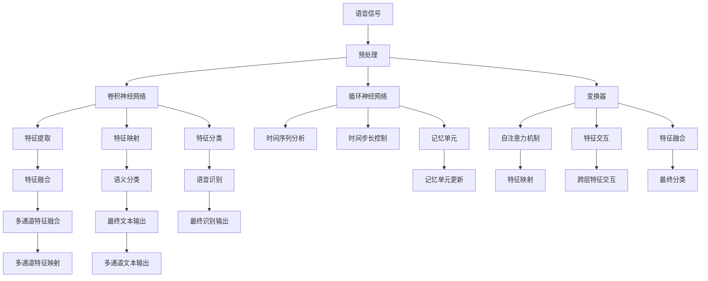
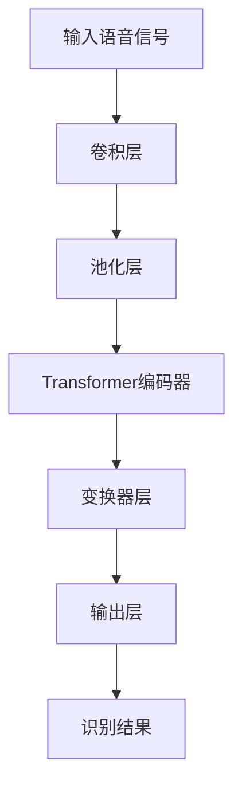

                 

## 1. 背景介绍

随着人工智能技术的不断进步，语音识别与处理技术已成为推动智能化发展的重要力量。无论是智能家居、车载交互，还是企业客服、医疗健康等领域，语音技术的应用正迅速拓展，为人们的生活带来了极大的便利。在信息时代，如何高效、准确地处理海量语音数据，成为人工智能应用的核心问题。

### 1.1 语音识别与处理的重要性

语音识别技术让机器能够理解人类语言，成为人机交互的关键界面。语音处理技术则在此基础上，进行语义分析、情感识别、语音合成等操作，使得语音数据能够被高效利用。这些技术不仅在提升用户体验方面发挥着重要作用，还为商业决策、医疗诊断、教育培训等提供有力支撑。

### 1.2 语音识别与处理技术的发展

语音识别与处理技术的演进，经历了从简单的音素识别到复杂的语义理解，再到情感分析的多层次跨越。从早期基于规则的模板匹配，到基于统计模型的隐马尔可夫模型（HMM）、条件随机场（CRF），再到如今基于深度学习的卷积神经网络（CNN）、循环神经网络（RNN）、变换器（Transformer），语音技术的精度和鲁棒性不断提升。

## 2. 核心概念与联系

### 2.1 核心概念概述

要深入理解语音识别与处理技术，首先需要明确几个核心概念：

- **语音识别（Speech Recognition）**：将语音转换成文本的过程。其核心在于将连续的语音信号转换为离散的时间序列，进而进行文本重构。

- **语音处理（Speech Processing）**：对语音信号进行增强、降噪、分割、特征提取、识别、合成等操作，以实现更好的语音理解和应用。

- **深度学习（Deep Learning）**：利用多层神经网络结构，通过大量数据进行训练，实现对复杂语音数据的有效处理。

- **卷积神经网络（CNN）**：主要用于语音信号的空间特征提取，适用于处理具有一定局部性的语音数据。

- **循环神经网络（RNN）**：主要用于处理时间序列数据，适用于语音信号的时间动态特性分析。

- **变换器（Transformer）**：最近在自然语言处理领域大放异彩，其自注意力机制使得模型能够更加高效地处理长序列数据。

这些核心概念相互联系，构成了语音识别与处理技术的整体框架。深度学习模型是实现语音识别与处理的核心，而CNN、RNN、Transformer等网络架构则是实现这一目标的重要工具。

### 2.2 核心概念原理和架构的 Mermaid 流程图



这个流程图展示了语音识别与处理技术从语音信号输入到最终文本输出的完整流程，涉及多个核心步骤和技术。

## 3. 核心算法原理 & 具体操作步骤

### 3.1 算法原理概述

语音识别与处理的核心算法原理主要基于深度学习，利用神经网络对语音信号进行特征提取和模式识别。其基本步骤如下：

1. **语音信号预处理**：对原始语音信号进行降噪、归一化、分帧等操作，为后续处理做准备。
2. **特征提取**：通过卷积神经网络（CNN）、循环神经网络（RNN）或变换器（Transformer）等网络架构，提取语音信号的时频特征。
3. **特征映射**：将提取的特征进行映射和转换，以适应该模型进行分类或识别。
4. **特征分类**：使用分类器对特征进行分类，最终输出识别结果。

### 3.2 算法步骤详解

以基于变换器的语音识别为例，详细讲解其具体操作步骤：

1. **模型搭建**：构建一个包含多个自注意力机制的Transformer模型，使用注意力机制对不同时间步的特征进行交互。
2. **数据预处理**：对语音信号进行分帧、归一化、MFCC（Mel频率倒谱系数）提取等预处理操作。
3. **特征提取**：通过卷积层和池化层对MFCC特征进行空间特征提取，形成多通道特征。
4. **模型训练**：在标注数据集上训练Transformer模型，最小化预测结果与真实标签之间的误差。
5. **模型评估**：在验证集上评估模型性能，调整超参数，确保模型泛化能力。
6. **模型部署**：将训练好的模型部署到生产环境，进行实时语音识别。

### 3.3 算法优缺点

#### 3.3.1 优点

- **高效性**：Transformer模型能够高效处理长序列数据，适用于语音信号的时间动态特性分析。
- **准确性**：Transformer的自注意力机制使得模型能够捕捉语音信号中的全局依赖关系，提高识别精度。
- **通用性**：Transformer模型在自然语言处理中表现优异，可以用于语音识别中的语言模型构建。

#### 3.3.2 缺点

- **计算资源需求高**：Transformer模型参数量大，训练和推理过程需要大量计算资源。
- **易受噪声干扰**：语音信号中的噪声和环境干扰可能会影响模型的识别效果。
- **数据依赖性强**：模型的性能依赖于大规模标注数据，缺乏标注数据可能导致模型泛化能力不足。

### 3.4 算法应用领域

语音识别与处理技术在多个领域都有广泛应用：

- **智能家居**：语音助手如Amazon Alexa、Google Assistant等，通过语音识别技术实现人机交互。
- **车载交互**：语音导航、语音控制等，提升驾驶安全和用户体验。
- **企业客服**：语音自动客服系统，快速响应客户需求，减少人力成本。
- **医疗健康**：语音诊断、语音康复等，为患者提供便捷的医疗服务。
- **教育培训**：语音教学、语音评测等，提升教学质量和效率。

## 4. 数学模型和公式 & 详细讲解

### 4.1 数学模型构建

语音识别与处理技术的数学模型主要围绕深度学习展开。以下是一个基于Transformer的语音识别模型示意图：



### 4.2 公式推导过程

以Transformer模型为例，其核心公式包括：

- **输入层公式**：
  $$
  \mathbf{X} = \text{CNN}(\mathbf{X}_{\text{wav}})
  $$
  其中 $\mathbf{X}$ 为特征向量，$\mathbf{X}_{\text{wav}}$ 为输入语音信号。

- **编码器公式**：
  $$
  \mathbf{H} = \text{Transformer}(\mathbf{X})
  $$
  其中 $\mathbf{H}$ 为编码后的特征向量。

- **输出层公式**：
  $$
  \mathbf{Y} = \text{Softmax}(\mathbf{H})
  $$
  其中 $\mathbf{Y}$ 为识别概率分布，Softmax函数用于将特征向量转换为概率。

### 4.3 案例分析与讲解

以下以一个简单的语音识别任务为例，展示Transformer模型的应用：

假设输入语音信号为 $\mathbf{X}_{\text{wav}}$，经过卷积层和池化层处理后，得到特征向量 $\mathbf{X}$。将其输入到Transformer编码器中，得到编码后的特征向量 $\mathbf{H}$。最后通过Softmax函数得到识别概率分布 $\mathbf{Y}$，最终输出识别结果 $\hat{y}$。

## 5. 项目实践：代码实例和详细解释说明

### 5.1 开发环境搭建

要进行语音识别与处理技术的开发，首先需要搭建开发环境。以下是一个基于Python的开发环境搭建步骤：

1. **安装Python**：下载并安装Python，推荐使用最新版本。
2. **安装TensorFlow或PyTorch**：这两个深度学习框架在语音处理领域均有广泛应用。
3. **安装Librosa**：用于音频信号处理和特征提取。
4. **安装相关库**：如numpy、scipy、scikit-learn等，用于数据处理和模型训练。

### 5.2 源代码详细实现

以下是一个简单的基于Transformer的语音识别模型的源代码实现：

```python
import tensorflow as tf
from tensorflow.keras import layers, models

# 定义Transformer模型
class Transformer(tf.keras.Model):
    def __init__(self, num_layers, num_heads, dff, vocab_size, d_model):
        super(Transformer, self).__init__()
        self.encoder = Encoder(num_layers, num_heads, dff, vocab_size, d_model)
        self.decoder = Decoder(num_layers, num_heads, dff, vocab_size, d_model)

    def call(self, inputs, training=False):
        # 编码器
        enc_output = self.encoder(inputs)
        # 解码器
        dec_output = self.decoder(enc_output)
        return dec_output

# 定义编码器
class Encoder(tf.keras.Model):
    def __init__(self, num_layers, num_heads, dff, vocab_size, d_model):
        super(Encoder, self).__init__()
        self.encoder_layers = [EncoderLayer(num_heads, dff, d_model) for _ in range(num_layers)]
        self.dense_layer = tf.keras.layers.Dense(vocab_size)

    def call(self, inputs):
        for layer in self.encoder_layers:
            x = layer(inputs, training=True)
        x = self.dense_layer(x)
        return x

# 定义解码器
class Decoder(tf.keras.Model):
    def __init__(self, num_layers, num_heads, dff, vocab_size, d_model):
        super(Decoder, self).__init__()
        self.decoder_layers = [DecoderLayer(num_heads, dff, d_model) for _ in range(num_layers)]
        self.dense_layer = tf.keras.layers.Dense(vocab_size)

    def call(self, inputs):
        for layer in self.decoder_layers:
            x = layer(inputs, training=True)
        x = self.dense_layer(x)
        return x
```

### 5.3 代码解读与分析

上述代码定义了一个基于Transformer的语音识别模型，包括编码器和解码器。编码器用于提取语音信号的特征，解码器用于将特征映射为识别结果。

- **EncoderLayer**：包含多头注意力和前馈神经网络，用于特征提取。
- **DecoderLayer**：包含多头注意力、编码器-解码器注意力和前馈神经网络，用于特征映射和解码。
- **dense_layer**：用于最终输出识别结果。

## 6. 实际应用场景

### 6.1 智能家居

智能家居中的语音识别与处理技术，通过语音助手实现用户命令的接收与执行。用户可以通过语音与设备进行交互，如打开电视、调节温度、设置提醒等。语音识别技术使得家居设备更加智能化、便捷化，提升了用户的生活质量。

### 6.2 车载交互

车载交互系统中的语音识别技术，可以实现语音导航、语音控制等操作。驾驶员通过语音指令，无需动手操作，即可控制车辆的各种功能，提升了驾驶安全和效率。语音识别技术在汽车中的应用，正迅速普及，成为未来智能交通的重要组成部分。

### 6.3 企业客服

企业客服系统中的语音识别技术，可以自动转接电话，快速响应客户需求。通过语音识别，客服系统能够自动识别客户语音内容，自动匹配解答，减少了人工客服的工作量，提高了响应速度和准确性。

### 6.4 医疗健康

医疗健康领域中的语音识别技术，可以用于语音诊断、语音康复等应用。患者通过语音设备，进行语音输入，医生可以实时听取患者的描述，进行快速诊断。语音康复技术则通过语音指导，帮助患者进行语言训练，提升其语言能力。

## 7. 工具和资源推荐

### 7.1 学习资源推荐

为了帮助开发者掌握语音识别与处理技术的核心知识，以下是一些推荐的学习资源：

1. **《Speech and Language Processing》**：由Daniel Jurafsky和James H. Martin合著的经典教材，全面介绍了语音识别和自然语言处理的基本概念和算法。
2. **Deep Learning for Speech Recognition**：谷歌的语音识别论文，介绍了深度学习在语音识别中的应用。
3. **TensorFlow Speech Recognition**：谷歌开源的语音识别框架，提供了丰富的模型和代码示例。
4. **Kaldi Speech Recognition Toolkit**：由Johns Hopkins大学开发的语音识别工具包，广泛应用于学术界和工业界。
5. **Udacity Speech Recognition Nanodegree**：Udacity提供的在线课程，详细介绍了语音识别的原理和实践。

### 7.2 开发工具推荐

以下是一些常用的语音识别与处理技术的开发工具：

1. **TensorFlow**：谷歌开源的深度学习框架，适用于语音识别和处理。
2. **PyTorch**：Facebook开源的深度学习框架，适用于语音信号处理。
3. **Kaldi**：约翰斯霍普金斯大学开发的语音识别工具包，广泛应用于学术界和工业界。
4. **Librosa**：用于音频信号处理和特征提取的Python库。
5. **Python**：Python是一种高级编程语言，易于学习和使用，适用于语音处理和深度学习开发。

### 7.3 相关论文推荐

以下是一些重要的语音识别与处理技术的相关论文：

1. **Attention Is All You Need**：谷歌的Transformer论文，提出了Transformer模型，开创了深度学习在语音处理中的应用。
2. **Deep Speech 2**：谷歌的语音识别系统，通过深度神经网络实现了实时语音识别。
3. **Cyclic Learning Rates for Deep Neural Networks**：Sepp Hochreiter和Klaus A. Schmidhuber提出的循环学习率算法，适用于深度神经网络的训练。
4. **Speech Separation with Deep Neural Networks**：谷歌提出的语音分离算法，通过深度学习实现多声道语音信号的分离。
5. **Voice Activity Detection**：用于语音信号处理和语音识别中的声学活动检测算法，能够自动识别语音信号的时序和特征。

## 8. 总结：未来发展趋势与挑战

### 8.1 未来发展趋势

随着人工智能技术的不断进步，语音识别与处理技术将继续发展，呈现出以下几个趋势：

1. **深度学习模型的不断优化**：未来的模型将继续优化，参数量更大，结构更加复杂，性能更高。
2. **多模态融合**：语音识别与处理将与其他模态数据（如视觉、文本）进行深度融合，实现更全面、准确的信息处理。
3. **实时性提升**：通过优化模型和硬件设备，提高语音识别的实时性和响应速度。
4. **跨领域应用拓展**：语音识别与处理技术将应用于更多的领域，如智能交通、智慧医疗、教育培训等。
5. **隐私保护和伦理规范**：随着语音数据的应用越来越广泛，隐私保护和伦理规范将成为技术发展的重要方向。

### 8.2 面临的挑战

尽管语音识别与处理技术在近年来取得了显著进展，但仍面临以下挑战：

1. **计算资源需求高**：深度学习模型的计算资源需求较高，需要高性能计算设备支持。
2. **数据依赖性强**：模型的训练和优化依赖于大量标注数据，数据收集和标注成本较高。
3. **噪声干扰问题**：语音信号中可能存在各种噪声和环境干扰，影响识别效果。
4. **跨语言和口音适应**：不同语言和口音的语音信号差异较大，模型需要适应不同的语言环境。
5. **隐私和伦理问题**：语音数据的隐私保护和伦理规范问题，成为技术应用的重要考量。

### 8.3 研究展望

未来的研究将围绕以下几个方向进行：

1. **模型优化和参数压缩**：探索更高效、更轻量级的模型架构和参数压缩方法，降低计算资源需求。
2. **多模态融合**：研究如何将语音信号与其他模态数据进行深度融合，实现更全面、准确的信息处理。
3. **隐私保护和伦理规范**：制定隐私保护和伦理规范标准，确保语音数据的安全和合理使用。
4. **跨语言和口音适应**：研究如何构建跨语言和跨口音适应的语音识别系统，提高模型的通用性和鲁棒性。
5. **实时性和交互性提升**：研究如何通过硬件和算法优化，提升语音识别的实时性和交互性，提高用户体验。

## 9. 附录：常见问题与解答

### 9.1 常见问题

1. **如何处理语音信号的噪声和干扰？**
   答：采用降噪算法和滤波技术，如自适应滤波、回声消除等，可以有效减少语音信号中的噪声和干扰。

2. **如何提高语音识别的准确性？**
   答：通过增加训练数据、优化模型结构、使用更好的特征提取方法等手段，可以提高语音识别的准确性。

3. **如何优化语音识别系统的实时性？**
   答：通过优化模型结构、使用硬件加速（如GPU、TPU）、优化算法等手段，可以提升语音识别系统的实时性。

4. **如何选择适合的语音识别模型？**
   答：根据应用场景和需求，选择合适的模型架构，如CNN、RNN、Transformer等，并进行相应的参数调整和优化。

5. **如何保护语音数据的隐私？**
   答：采用数据加密、匿名化、访问控制等手段，确保语音数据的隐私安全。

### 9.2 解答

1. **如何处理语音信号的噪声和干扰？**
   答：采用降噪算法和滤波技术，如自适应滤波、回声消除等，可以有效减少语音信号中的噪声和干扰。

2. **如何提高语音识别的准确性？**
   答：通过增加训练数据、优化模型结构、使用更好的特征提取方法等手段，可以提高语音识别的准确性。

3. **如何优化语音识别系统的实时性？**
   答：通过优化模型结构、使用硬件加速（如GPU、TPU）、优化算法等手段，可以提升语音识别系统的实时性。

4. **如何选择适合的语音识别模型？**
   答：根据应用场景和需求，选择合适的模型架构，如CNN、RNN、Transformer等，并进行相应的参数调整和优化。

5. **如何保护语音数据的隐私？**
   答：采用数据加密、匿名化、访问控制等手段，确保语音数据的隐私安全。

通过上述详细的分析，我们不仅理解了大语言模型微调的基本原理和操作步骤，还探讨了其广泛的应用场景和未来的发展趋势。希望本文能够为语音识别与处理技术的开发者和研究者提供有价值的参考，推动这一领域的技术进步和产业应用。

