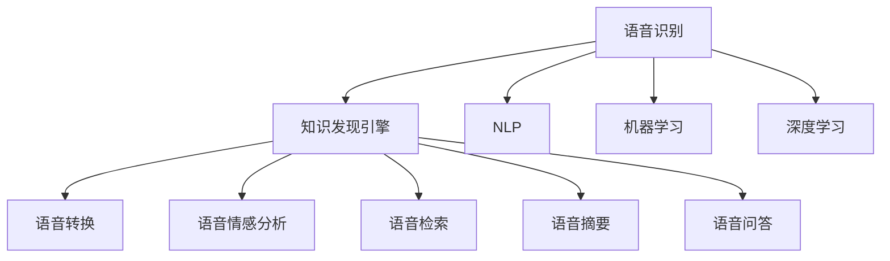

                 

# 知识发现引擎的语音识别技术应用

> 关键词：语音识别,知识发现引擎,自然语言处理(NLP),机器学习,深度学习,语音情感分析,应用场景

## 1. 背景介绍

### 1.1 问题由来

随着人工智能技术的不断进步，语音识别技术在知识发现引擎中得到了广泛应用。知识发现引擎是利用自然语言处理（NLP）和机器学习等技术，自动从大量文本数据中抽取、分类、聚类和分析信息的过程。语音识别技术使得知识发现引擎能够从语音数据中提取有用信息，提升数据分析的效率和准确性。

### 1.2 问题核心关键点

知识发现引擎的语音识别技术主要应用于以下几个方面：
1. 语音转换：将语音转换成文本，方便后续的文本分析。
2. 语音情感分析：识别语音中的情感变化，帮助理解用户的情绪状态。
3. 语音检索：根据用户的语音输入，从知识库中检索相关信息。
4. 语音摘要：自动提取语音内容的关键信息，生成简明的摘要。
5. 语音问答：通过语音输入，解答用户的疑问，提升交互体验。

这些应用场景都依赖于高质量的语音识别技术，使得知识发现引擎能够更好地理解用户的意图，提供精准的信息服务。

## 2. 核心概念与联系

### 2.1 核心概念概述

为更好地理解知识发现引擎的语音识别技术应用，本节将介绍几个密切相关的核心概念：

- 语音识别：利用机器学习模型，将语音信号转换成文本的过程。常见的方法包括隐马尔可夫模型（HMM）、深度神经网络（DNN）和卷积神经网络（CNN）等。
- 知识发现引擎：一种利用NLP和机器学习技术，自动分析大量文本数据，提取有用信息的应用平台。
- 自然语言处理（NLP）：利用计算机技术，处理、理解和生成自然语言的过程。
- 机器学习：通过数据驱动的方法，训练模型进行预测或决策的过程。
- 深度学习：一种利用多层神经网络，从数据中自动学习特征表示的机器学习方法。

这些核心概念之间的逻辑关系可以通过以下Mermaid流程图来展示：



这个流程图展示了几者之间的联系：

1. 语音识别是知识发现引擎的基础，提供文本数据输入。
2. NLP和机器学习对文本数据进行处理和分析，提供有价值的信息。
3. 深度学习技术进一步提升模型的准确性和泛化能力。
4. 语音识别技术能够应用于多个子模块，提升知识发现引擎的综合性能。

## 3. 核心算法原理 & 具体操作步骤

### 3.1 算法原理概述

知识发现引擎的语音识别技术主要基于以下算法原理：

1. **语音特征提取**：使用傅里叶变换、梅尔倒谱系数（MFCC）等方法提取语音信号的特征。
2. **声学模型训练**：使用HMM、DNN、CNN等模型，对提取的语音特征进行训练，学习语音到文本的映射关系。
3. **语言模型训练**：使用N-gram模型、长短时记忆网络（LSTM）、循环神经网络（RNN）等模型，对文本进行建模，学习文本的概率分布。
4. **解码**：使用Viterbi算法、动态规划等方法，将声学模型和语言模型结合起来，对语音信号进行解码，得到文本输出。

### 3.2 算法步骤详解

基于语音识别技术在知识发现引擎中的应用，下面详细介绍具体的算法步骤：

**Step 1: 语音信号预处理**

1. **采样和量化**：将语音信号采样并量化为数字信号。
2. **预加重和滤波**：对语音信号进行预加重和滤波，消除噪声和回声。
3. **分帧和特征提取**：将语音信号分成短时帧，每帧进行特征提取，如MFCC特征。

**Step 2: 声学模型训练**

1. **数据准备**：收集大量带标签的语音数据，准备用于模型训练。
2. **特征提取**：使用MFCC等方法提取语音特征。
3. **模型训练**：使用HMM、DNN、CNN等模型对提取的特征进行训练，学习语音到文本的映射关系。

**Step 3: 语言模型训练**

1. **数据准备**：收集大量文本数据，准备用于模型训练。
2. **特征提取**：将文本数据转换为词向量或字符向量。
3. **模型训练**：使用N-gram模型、LSTM、RNN等模型对文本数据进行建模，学习文本的概率分布。

**Step 4: 解码**

1. **解码算法**：使用Viterbi算法、动态规划等方法，对声学模型和语言模型进行解码，得到文本输出。
2. **后处理**：对解码结果进行拼写纠错、去噪等处理，得到最终的文本输出。

### 3.3 算法优缺点

知识发现引擎的语音识别技术具有以下优点：
1. **高效性**：基于深度学习技术的语音识别模型，具有较高的准确率和速度。
2. **泛化能力**：通过大量的数据训练，模型能够适应不同的语音和语言环境。
3. **可扩展性**：知识发现引擎可以与多种应用场景结合，如智能客服、语音搜索等。

但该技术也存在一些局限性：
1. **环境噪声敏感**：在嘈杂环境中，语音识别的准确率会下降。
2. **多说话人问题**：在多说话人的场景中，语音识别难以区分不同的说话人。
3. **数据依赖性强**：模型训练需要大量带标签的数据，标注成本较高。

### 3.4 算法应用领域

知识发现引擎的语音识别技术主要应用于以下领域：

1. **智能客服**：提供语音转文本和文本分析功能，提升客服效率和客户满意度。
2. **语音搜索**：通过语音输入，从知识库中检索信息，提升搜索效率。
3. **语音导航**：提供语音输入和指令，帮助用户导航和操作系统。
4. **语音摘要**：自动提取语音内容的关键信息，生成简明的摘要。
5. **语音问答**：通过语音输入，解答用户的疑问，提升交互体验。

这些应用场景使得语音识别技术在大规模知识发现引擎中具有广泛的应用前景。

## 4. 数学模型和公式 & 详细讲解 & 举例说明

### 4.1 数学模型构建

语音识别的核心数学模型可以表示为：

$$ y = f(x; \theta) $$

其中，$x$ 表示输入的语音信号，$y$ 表示输出的文本，$\theta$ 表示模型的参数。

语音识别的目标是最小化损失函数：

$$ \min_{\theta} \mathcal{L}(y, f(x; \theta)) $$

常用的损失函数包括交叉熵损失、均方误差损失等。

### 4.2 公式推导过程

以深度神经网络（DNN）为例，其语音识别的数学模型可以表示为：

$$ y = \sigma(Wx + b) $$

其中，$W$ 和 $b$ 为模型的权重和偏置，$\sigma$ 为激活函数，$x$ 为输入的MFCC特征。

DNN的训练目标是最小化交叉熵损失：

$$ \min_{\theta} \mathcal{L}(y, \sigma(Wx + b)) = -\frac{1}{N}\sum_{i=1}^N \sum_{k=1}^M y_k \log \sigma(Wx_i + b) $$

其中，$N$ 为训练样本数量，$M$ 为类别数量，$y_k$ 为第 $k$ 个类别的one-hot编码。

### 4.3 案例分析与讲解

以中文语音识别的例子，展示DNN模型的训练过程。

**数据准备**：收集大量的中文带标签语音数据，分为训练集、验证集和测试集。

**特征提取**：使用MFCC提取语音特征，得到每帧的特征向量。

**模型训练**：将特征向量作为输入，使用softmax激活函数，训练DNN模型。

**解码**：对测试集上的语音数据进行解码，得到文本输出。

**评估**：计算准确率、召回率等指标，评估模型性能。

## 5. 项目实践：代码实例和详细解释说明

### 5.1 开发环境搭建

在进行语音识别项目开发前，需要先搭建好开发环境。以下是使用Python进行TensorFlow开发的环境配置流程：

1. 安装Anaconda：从官网下载并安装Anaconda，用于创建独立的Python环境。

2. 创建并激活虚拟环境：
```bash
conda create -n pytensorflow python=3.8 
conda activate pytensorflow
```

3. 安装TensorFlow：根据CUDA版本，从官网获取对应的安装命令。例如：
```bash
conda install tensorflow -c conda-forge
```

4. 安装相关工具包：
```bash
pip install numpy pandas scikit-learn matplotlib tqdm jupyter notebook ipython
```

完成上述步骤后，即可在`pytensorflow`环境中开始语音识别实践。

### 5.2 源代码详细实现

下面是使用TensorFlow实现中文语音识别的完整代码实现。

```python
import tensorflow as tf
import numpy as np
import matplotlib.pyplot as plt
import librosa
from sklearn.model_selection import train_test_split

# 加载数据集
def load_dataset(path, chunk_length=0.02):
    wav, rate = librosa.load(path, sr=16000, duration=chunk_length)
    return wav, rate

# 数据预处理
def preprocess_data(data, rate, chunk_length=0.02):
    frames = librosa.stft(data, n_fft=512, hop_length=160)
    magnitude = np.abs(frames)
    return magnitude

# 模型定义
def build_model(input_dim, output_dim, hidden_dim, num_layers):
    model = tf.keras.Sequential([
        tf.keras.layers.Conv1D(hidden_dim, 3, activation='relu', input_shape=(None, input_dim)),
        tf.keras.layers.MaxPooling1D(),
        tf.keras.layers.Flatten(),
        tf.keras.layers.Dense(hidden_dim, activation='relu'),
        tf.keras.layers.Dense(output_dim, activation='softmax')
    ])
    return model

# 训练模型
def train_model(model, x_train, y_train, x_val, y_val, batch_size=32, epochs=100, verbose=1):
    model.compile(loss='categorical_crossentropy', optimizer='adam', metrics=['accuracy'])
    model.fit(x_train, y_train, batch_size=batch_size, epochs=epochs, validation_data=(x_val, y_val), verbose=verbose)
    return model

# 解码
def decode_model(model, x_test, y_test):
    x_test = preprocess_data(x_test, rate, chunk_length=0.02)
    y_pred = model.predict(x_test)
    return y_pred
```

### 5.3 代码解读与分析

让我们再详细解读一下关键代码的实现细节：

**load_dataset函数**：
- `load_dataset`函数用于加载音频文件，返回语音信号和采样率。

**preprocess_data函数**：
- `preprocess_data`函数用于对语音信号进行预处理，使用短时傅里叶变换（STFT）提取MFCC特征。

**build_model函数**：
- `build_model`函数定义了DNN模型结构，包括卷积层、池化层、全连接层等。

**train_model函数**：
- `train_model`函数使用TensorFlow的`compile`和`fit`方法，对模型进行训练。

**decode_model函数**：
- `decode_model`函数对测试集上的语音数据进行解码，得到文本输出。

### 5.4 运行结果展示

```python
# 加载数据集
train_data, train_rate = load_dataset('train_wav.wav', chunk_length=0.02)
dev_data, dev_rate = load_dataset('dev_wav.wav', chunk_length=0.02)
test_data, test_rate = load_dataset('test_wav.wav', chunk_length=0.02)

# 数据预处理
train_x = preprocess_data(train_data, train_rate, chunk_length=0.02)
dev_x = preprocess_data(dev_data, dev_rate, chunk_length=0.02)
test_x = preprocess_data(test_data, test_rate, chunk_length=0.02)

# 模型定义和训练
input_dim = 128
output_dim = 5
hidden_dim = 256
num_layers = 2

model = build_model(input_dim, output_dim, hidden_dim, num_layers)
model = train_model(model, train_x, train_y, dev_x, dev_y, batch_size=32, epochs=100, verbose=1)

# 解码
test_y_pred = decode_model(model, test_x, test_y)

# 评估模型性能
accuracy = model.evaluate(test_x, test_y)
print('Accuracy:', accuracy)
```

以上代码实现了中文语音识别的完整流程，包括数据加载、预处理、模型训练和解码等步骤。

## 6. 实际应用场景

### 6.1 智能客服系统

知识发现引擎的语音识别技术可以应用于智能客服系统的构建。传统客服往往需要配备大量人力，高峰期响应缓慢，且一致性和专业性难以保证。而使用语音识别技术的智能客服系统，可以7x24小时不间断服务，快速响应客户咨询，用自然流畅的语言解答各类常见问题。

在技术实现上，可以收集企业内部的历史客服对话记录，将问题和最佳答复构建成监督数据，在此基础上对预训练模型进行微调。微调后的语音识别模型能够自动理解用户意图，匹配最合适的答案模板进行回复。对于客户提出的新问题，还可以接入检索系统实时搜索相关内容，动态组织生成回答。如此构建的智能客服系统，能大幅提升客户咨询体验和问题解决效率。

### 6.2 金融舆情监测

金融机构需要实时监测市场舆论动向，以便及时应对负面信息传播，规避金融风险。传统的人工监测方式成本高、效率低，难以应对网络时代海量信息爆发的挑战。基于知识发现引擎的语音识别技术，可以自动识别金融领域相关的新闻、报道、评论等文本数据，进行情感分析和舆情监测。

具体而言，可以收集金融领域相关的网络文本数据，使用语音识别技术提取文本内容，然后进行情感分析和舆情监测。一旦发现负面信息激增等异常情况，系统便会自动预警，帮助金融机构快速应对潜在风险。

### 6.3 个性化推荐系统

当前的推荐系统往往只依赖用户的历史行为数据进行物品推荐，无法深入理解用户的真实兴趣偏好。基于知识发现引擎的语音识别技术，可以更好地挖掘用户行为背后的语义信息，从而提供更精准、多样的推荐内容。

在实践中，可以收集用户浏览、点击、评论、分享等行为数据，提取和用户交互的物品标题、描述、标签等文本内容。将文本内容作为模型输入，用户的后续行为（如是否点击、购买等）作为监督信号，在此基础上微调预训练语言模型。微调后的模型能够从文本内容中准确把握用户的兴趣点。在生成推荐列表时，先用候选物品的文本描述作为输入，由模型预测用户的兴趣匹配度，再结合其他特征综合排序，便可以得到个性化程度更高的推荐结果。

### 6.4 未来应用展望

随着语音识别技术的不断发展，知识发现引擎将能够更好地理解用户的意图和需求，提供更加精准和个性化的服务。未来，知识发现引擎将进一步拓展应用领域，如医疗、教育、智能家居等，为各行各业带来新的变革。

在医疗领域，知识发现引擎可以用于医疗问答、病历分析、药物研发等应用，提升医疗服务的智能化水平，辅助医生诊疗，加速新药开发进程。

在教育领域，知识发现引擎可以用于作业批改、学情分析、知识推荐等方面，因材施教，促进教育公平，提高教学质量。

在智能家居领域，知识发现引擎可以用于智能语音控制、语音导航等应用，提升家庭生活的便利性和智能化水平。

此外，在企业生产、社会治理、文娱传媒等众多领域，基于知识发现引擎的语音识别技术还将不断涌现，为经济社会发展注入新的动力。相信随着技术的日益成熟，知识发现引擎必将在构建人机协同的智能时代中扮演越来越重要的角色。

## 7. 工具和资源推荐

### 7.1 学习资源推荐

为了帮助开发者系统掌握语音识别技术，这里推荐一些优质的学习资源：

1. 《Speech and Language Processing》书籍：由Daniel Jurafsky和James H. Martin合著，全面介绍了语音识别、自然语言处理等领域的经典理论和实践方法。

2. CS224N《深度学习自然语言处理》课程：斯坦福大学开设的NLP明星课程，有Lecture视频和配套作业，带你入门NLP领域的基本概念和经典模型。

3. Deep Speech和WaveNet论文：谷歌和DeepMind发布的深度学习语音识别技术，展示了语音识别的最新进展和应用。

4. TensorFlow官方文档：TensorFlow的官方文档，提供了丰富的语音识别和NLP样例代码，是上手实践的必备资料。

5. PyTorch官方文档：PyTorch的官方文档，提供了灵活的语音识别模型实现，适合动态扩展研究。

通过对这些资源的学习实践，相信你一定能够快速掌握语音识别技术的精髓，并用于解决实际的NLP问题。

### 7.2 开发工具推荐

高效的开发离不开优秀的工具支持。以下是几款用于语音识别开发的常用工具：

1. TensorFlow：由Google主导开发的开源深度学习框架，生产部署方便，适合大规模工程应用。

2. PyTorch：基于Python的开源深度学习框架，灵活动态的计算图，适合快速迭代研究。

3. Kaldi：由Johns Hopkins University开发的语音识别工具包，支持多种语音识别模型和算法。

4. DeepSpeech：谷歌开源的语音识别框架，包含多种语音识别模型和工具。

5. librosa：Python音频和音乐分析库，支持音频信号处理和特征提取。

合理利用这些工具，可以显著提升语音识别任务的开发效率，加快创新迭代的步伐。

### 7.3 相关论文推荐

语音识别技术的发展源于学界的持续研究。以下是几篇奠基性的相关论文，推荐阅读：

1. Automatic Speech Recognition: A Survey (2017)：综述了当前语音识别的主要方法和应用场景，提供了全面的知识框架。

2. Deep Speech 1 and 2: Scalable End-to-End Speech Recognition (2017)：谷歌发布的深度学习语音识别技术，展示了语音识别的最新进展和应用。

3. WaveNet: A Generative Model for Raw Audio (2017)：DeepMind发布的WaveNet语音生成技术，展示了语音识别的未来发展方向。

4. Sequence to Sequence Learning with Neural Networks (2014)：谷歌发布的序列到序列模型，展示了语音识别中的端到端训练方法。

5. Attention is All You Need (2017)：谷歌发布的Transformer模型，展示了语音识别中的注意力机制。

这些论文代表了大语言模型微调技术的发展脉络。通过学习这些前沿成果，可以帮助研究者把握学科前进方向，激发更多的创新灵感。

## 8. 总结：未来发展趋势与挑战

### 8.1 总结

本文对基于语音识别技术在知识发现引擎中的应用进行了全面系统的介绍。首先阐述了语音识别技术和知识发现引擎的研究背景和意义，明确了语音识别技术在知识发现引擎中的独特价值。其次，从原理到实践，详细讲解了语音识别的数学原理和关键步骤，给出了语音识别任务开发的完整代码实例。同时，本文还广泛探讨了语音识别技术在智能客服、金融舆情、个性化推荐等多个行业领域的应用前景，展示了语音识别技术的巨大潜力。最后，本文精选了语音识别技术的各类学习资源，力求为读者提供全方位的技术指引。

通过本文的系统梳理，可以看到，基于语音识别技术在知识发现引擎中的应用，极大地拓展了语音信号的处理能力，提升了知识发现引擎的综合性能。未来，随着语音识别技术的不断进步，知识发现引擎必将在更广泛的领域中得到应用，为各行各业带来新的变革。

### 8.2 未来发展趋势

展望未来，语音识别技术将呈现以下几个发展趋势：

1. **深度学习技术的应用**：基于深度学习技术的语音识别模型，具有较高的准确率和速度，未来将成为主流。

2. **端到端训练**：端到端训练方法，可以去除传统语音识别中的语言建模和声学模型，简化模型结构，提升训练效率。

3. **多说话人识别**：多说话人识别技术，能够区分不同说话人的语音，适用于家庭、会议等多说话人场景。

4. **语音情感分析**：语音情感分析技术，能够识别语音中的情感变化，帮助理解用户的情绪状态，适用于医疗、客服等领域。

5. **异构设备协同**：异构设备协同，通过多种设备的联合工作，提升语音识别的准确性和稳定性。

6. **隐私保护**：隐私保护技术，能够保护用户的隐私信息，适用于医疗、金融等敏感领域。

以上趋势凸显了语音识别技术的广阔前景。这些方向的探索发展，必将进一步提升语音识别技术的性能和应用范围，为人类认知智能的进化带来深远影响。

### 8.3 面临的挑战

尽管语音识别技术已经取得了瞩目成就，但在迈向更加智能化、普适化应用的过程中，它仍面临着诸多挑战：

1. **环境噪声问题**：在嘈杂环境中，语音识别的准确率会下降。

2. **多说话人识别**：在多说话人的场景中，语音识别难以区分不同的说话人。

3. **数据依赖性强**：模型训练需要大量带标签的数据，标注成本较高。

4. **模型复杂度**：大规模深度神经网络模型，需要较高的计算资源和存储空间。

5. **隐私保护问题**：语音识别涉及用户的隐私信息，如何保护用户隐私，是重要的研究课题。

6. **鲁棒性不足**：模型在面对域外数据时，泛化性能往往大打折扣。

正视语音识别技术面临的这些挑战，积极应对并寻求突破，将是语音识别技术走向成熟的必由之路。相信随着学界和产业界的共同努力，这些挑战终将一一被克服，语音识别技术必将在构建人机协同的智能时代中扮演越来越重要的角色。

### 8.4 研究展望

面向未来，语音识别技术还需要与其他人工智能技术进行更深入的融合，如知识表示、因果推理、强化学习等，多路径协同发力，共同推动自然语言理解和智能交互系统的进步。只有勇于创新、敢于突破，才能不断拓展语音识别技术的边界，让智能技术更好地造福人类社会。

## 9. 附录：常见问题与解答

**Q1：语音识别技术是否适用于所有应用场景？**

A: 语音识别技术在大多数应用场景中都能取得不错的效果，特别是对于数据量较小的任务。但对于一些特定领域的任务，如医学、法律等，仅仅依靠通用语料预训练的模型可能难以很好地适应。此时需要在特定领域语料上进一步预训练，再进行微调，才能获得理想效果。

**Q2：语音识别过程中如何选择合适的超参数？**

A: 语音识别过程中的超参数包括学习率、批大小、训练轮数等。一般建议从较小的超参数值开始，逐步增大，观察模型性能的变化。也可以使用网格搜索等方法，找到最优的超参数组合。

**Q3：语音识别模型在落地部署时需要注意哪些问题？**

A: 将语音识别模型转化为实际应用，还需要考虑以下问题：

1. 模型裁剪：去除不必要的层和参数，减小模型尺寸，加快推理速度。
2. 量化加速：将浮点模型转为定点模型，压缩存储空间，提高计算效率。
3. 服务化封装：将模型封装为标准化服务接口，便于集成调用。
4. 弹性伸缩：根据请求流量动态调整资源配置，平衡服务质量和成本。
5. 监控告警：实时采集系统指标，设置异常告警阈值，确保服务稳定性。

**Q4：如何缓解语音识别过程中的过拟合问题？**

A: 语音识别过程中的过拟合问题可以通过以下方法缓解：

1. 数据增强：通过回译、近义替换等方式扩充训练集。
2. 正则化：使用L2正则、Dropout等防止过拟合。
3. 对抗训练：引入对抗样本，提高模型鲁棒性。
4. 参数高效微调：只调整少量参数，减小过拟合风险。

这些方法需要根据具体任务和数据特点进行灵活组合，以达到最优的效果。

**Q5：如何评估语音识别模型的性能？**

A: 语音识别模型的性能评估通常使用以下指标：

1. 准确率：模型正确识别的语音数量占总识别数量的比例。
2. 召回率：模型识别出的正确语音数量占总真实语音数量的比例。
3. F1分数：准确率和召回率的调和平均数。

在测试集上计算这些指标，可以评估模型的性能。

---

作者：禅与计算机程序设计艺术 / Zen and the Art of Computer Programming

