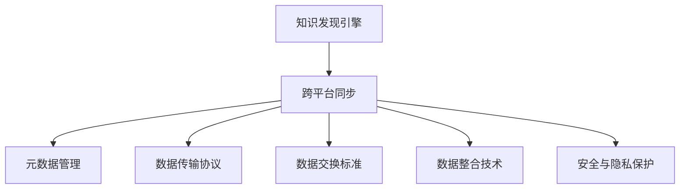

                 

## 1. 背景介绍

### 1.1 问题由来
随着大数据时代的到来，企业对数据洞察的需求日益增长，知识发现引擎(Knowledge Discovery Engine, KDE)以其高效、智能的数据分析能力，成为了企业决策的重要工具。然而，传统的知识发现引擎往往以单平台部署为主，如企业内部的数据库系统、数据仓库、BI系统等，彼此之间数据孤立，无法实现跨平台的数据共享和同步，极大地限制了知识发现的效率和效果。

企业内部的数据孤岛现象不仅影响了数据驱动决策的速度和质量，还导致了资源浪费和数据安全风险。例如，销售数据、客户信息、财务数据等核心业务数据分布在不同的系统中，各系统之间的数据无法有效互通，导致在分析时无法整合利用，形成了数据孤岛。而数据孤岛的存在，也使得数据安全风险大大增加，一旦某个系统发生数据泄露，整个企业的数据安全将受到威胁。

为了应对这些问题，知识发现引擎的跨平台同步技术应运而生。该技术通过统一的元数据管理、数据传输协议和数据交换标准，使不同平台之间的数据能够高效地共享和同步，实现数据的全面整合和跨平台分析，为企业决策提供更加精准和可靠的数据支持。

### 1.2 问题核心关键点
知识发现引擎的跨平台同步技术，其核心在于解决数据跨平台传输、存储和整合的问题，使得不同系统之间的数据能够无缝衔接。具体来说，包括以下几个关键点：

1. **统一元数据管理**：通过统一的元数据管理机制，定义和存储数据的基本信息，包括数据类型、来源、权限等，实现数据的一致性。
2. **数据传输协议**：设计高效、安全的数据传输协议，保证数据在跨平台传输时的安全性和完整性。
3. **数据交换标准**：制定统一的数据交换标准，规范数据的格式、接口和协议，便于不同系统之间的数据交换。
4. **数据整合技术**：实现数据的合并、清洗、转换等操作，保证数据的准确性和完整性。
5. **安全与隐私保护**：确保数据传输和存储过程中的安全性和隐私保护，防止数据泄露和非法访问。

这些核心关键点构成了知识发现引擎跨平台同步技术的框架，使其能够在复杂的数据环境中部署和运行，实现跨平台的数据分析与决策支持。

## 2. 核心概念与联系

### 2.1 核心概念概述

为更好地理解知识发现引擎跨平台同步技术，本节将介绍几个密切相关的核心概念：

- **知识发现引擎(Knowledge Discovery Engine, KDE)**：以数据挖掘和统计分析为基础，通过智能化的手段，从大规模数据集中自动地发现知识、规律和模式，辅助企业决策。
- **跨平台同步**：指不同平台（如数据库、数据仓库、BI系统等）之间数据的同步传输和整合，以实现数据的全面互通。
- **元数据管理**：管理数据的基本信息，包括数据类型、来源、权限等，实现数据的一致性。
- **数据传输协议**：用于在不同平台之间安全、高效地传输数据的协议。
- **数据交换标准**：制定统一的数据格式、接口和协议，便于不同系统之间的数据交换。
- **数据整合技术**：通过合并、清洗、转换等操作，确保数据的准确性和完整性。
- **安全与隐私保护**：保证数据传输和存储过程中的安全性和隐私保护，防止数据泄露和非法访问。

这些核心概念之间的逻辑关系可以通过以下Mermaid流程图来展示：



这个流程图展示了几大核心概念之间的联系：

1. 知识发现引擎通过跨平台同步技术，从不同平台获取数据。
2. 跨平台同步技术依赖元数据管理、数据传输协议、数据交换标准、数据整合技术和安全与隐私保护等支持技术。
3. 这些技术共同构成了一个完整的数据跨平台传输和整合框架，使数据能够高效地共享和同步，实现跨平台分析与决策支持。

## 3. 核心算法原理 & 具体操作步骤
### 3.1 算法原理概述

知识发现引擎的跨平台同步技术，本质上是一个数据同步和整合的过程。其核心思想是：通过统一的元数据管理、数据传输协议和数据交换标准，使不同平台之间的数据能够高效地共享和同步，实现数据的全面整合和跨平台分析。

形式化地，假设企业内部有N个数据平台，每个平台的数据量为 $D_i$，通过跨平台同步技术，将这N个平台的数据进行合并，得到总数据量 $D$，即：

$$
D = \sum_{i=1}^N D_i
$$

跨平台同步技术通过以下步骤实现数据整合：

1. 统一元数据管理：定义和存储数据的基本信息，包括数据类型、来源、权限等。
2. 数据传输协议：设计高效、安全的数据传输协议，保证数据在跨平台传输时的安全性和完整性。
3. 数据交换标准：制定统一的数据格式、接口和协议，便于不同系统之间的数据交换。
4. 数据整合技术：实现数据的合并、清洗、转换等操作，保证数据的准确性和完整性。
5. 安全与隐私保护：确保数据传输和存储过程中的安全性和隐私保护，防止数据泄露和非法访问。

### 3.2 算法步骤详解

知识发现引擎的跨平台同步技术通常包括以下几个关键步骤：

**Step 1: 准备元数据**

- 定义数据的基本信息，包括数据类型、来源、权限等，创建统一的元数据管理库。
- 元数据管理库可以存储在云端，便于跨平台共享。

**Step 2: 设计数据传输协议**

- 选择高效、安全的数据传输协议，如HTTP、Kafka、RabbitMQ等，确保数据在传输过程中的安全性和完整性。
- 设计数据传输的接口和消息格式，便于不同系统之间的数据交换。

**Step 3: 制定数据交换标准**

- 制定统一的数据格式、接口和协议，包括数据的基本结构、数据字段、传输方式等。
- 标准可以基于现有行业标准（如OpenAPI、JSON等）进行设计，确保数据的兼容性。

**Step 4: 实施数据整合技术**

- 使用数据清洗、合并、转换等技术，对不同平台的数据进行整合，确保数据的准确性和完整性。
- 采用ETL工具（Extract, Transform, Load）实现数据的抽取、转换和加载。

**Step 5: 部署安全与隐私保护机制**

- 采用加密传输、访问控制等技术，确保数据传输和存储的安全性。
- 定期进行安全审计，及时发现和修复潜在的安全漏洞。

**Step 6: 测试与优化**

- 对跨平台同步技术进行全面测试，验证数据的准确性和完整性。
- 根据测试结果，不断优化和改进跨平台同步技术。

以上是知识发现引擎跨平台同步技术的一般流程。在实际应用中，还需要针对具体平台的特点，对各环节进行优化设计，如改进元数据管理机制，选择最优的数据传输协议，优化数据整合算法等，以进一步提升数据同步的效率和效果。

### 3.3 算法优缺点

知识发现引擎的跨平台同步技术具有以下优点：

1. 提高数据利用率：通过数据跨平台同步，企业可以整合不同来源的数据，提高数据利用率，加速决策过程。
2. 简化数据治理：统一的数据标准和元数据管理机制，简化了数据治理和管理的复杂度。
3. 提升数据安全性：通过加密传输、访问控制等手段，提升了数据传输和存储的安全性。
4. 优化数据质量：数据整合技术可以有效清洗和转换数据，提升数据的准确性和完整性。

同时，该技术也存在一些局限性：

1. 实施成本高：跨平台同步技术的实施需要投入大量的人力和资源，尤其是在数据量庞大的企业中。
2. 技术复杂度高：跨平台同步涉及多个系统和技术栈，技术实现较为复杂，需要较强的技术储备。
3. 数据同步延迟：数据跨平台传输和同步可能会引入一定的延迟，影响数据的实时性。
4. 数据一致性问题：不同平台之间的数据格式和标准可能不一致，需要进行数据转换，可能导致数据一致性问题。

尽管存在这些局限性，但就目前而言，跨平台同步技术仍然是知识发现引擎的重要组成部分，其带来的数据整合和分析优势，大大提高了企业的决策效率和数据质量。

### 3.4 算法应用领域

知识发现引擎的跨平台同步技术在企业内部各个部门都有广泛的应用，以下是几个典型应用领域：

1. **销售与市场部门**：通过整合销售数据、客户信息和市场数据，分析客户行为和市场趋势，辅助销售策略制定。
2. **运营与供应链部门**：整合运营数据和供应链数据，优化库存管理和物流运输，提升运营效率。
3. **财务与审计部门**：整合财务数据和审计数据，进行财务分析和风险控制，防范潜在的财务风险。
4. **人力资源与员工关系部门**：整合人力资源数据和员工关系数据，分析员工绩效和员工满意度，优化人力资源管理。
5. **客户服务与支持部门**：整合客户服务数据和支持数据，提升客户满意度和服务质量，优化客户体验。

此外，跨平台同步技术还可以应用于金融、医疗、物流等众多行业，为跨部门的数据整合和分析提供有力支持。

## 4. 数学模型和公式 & 详细讲解  
### 4.1 数学模型构建

知识发现引擎的跨平台同步技术可以通过数学模型进行更加严格的刻画。

假设企业内部有N个数据平台，每个平台的数据量为 $D_i$，通过跨平台同步技术，将这N个平台的数据进行合并，得到总数据量 $D$，即：

$$
D = \sum_{i=1}^N D_i
$$

在数学模型中，我们可以定义数据平台的数据量 $D_i$ 为一个随机变量，表示平台 i 的数据量为 $D_i$。假设各平台的数据量相互独立，即 $D_i$ 之间相互独立。则总数据量 $D$ 的概率分布可以表示为：

$$
P(D) = \prod_{i=1}^N P(D_i)
$$

通过以上概率模型，我们可以计算在不同平台数据量下的总数据量 $D$ 的概率分布，从而指导数据的整合策略。

### 4.2 公式推导过程

以下我们以两个平台的数据为例，推导跨平台数据整合的概率模型。

假设平台A的数据量为 $D_A$，平台B的数据量为 $D_B$，两者相互独立，则总数据量 $D$ 的概率分布可以表示为：

$$
P(D) = P(D_A+D_B)
$$

由于平台A和平台B的数据量相互独立，根据概率的乘法法则，我们有：

$$
P(D_A+D_B) = \int_{D_A=0}^{\infty} \int_{D_B=0}^{\infty} P(D_A)P(D_B)dD_A dD_B
$$

其中 $P(D_A)$ 和 $P(D_B)$ 分别表示平台A和平台B的数据量概率分布。假设平台A和平台B的数据量概率分布均为正态分布，即：

$$
P(D_A) = \mathcal{N}(\mu_A, \sigma_A^2)
$$

$$
P(D_B) = \mathcal{N}(\mu_B, \sigma_B^2)
$$

其中 $\mu_A$ 和 $\mu_B$ 分别为平台A和平台B的数据量均值，$\sigma_A$ 和 $\sigma_B$ 分别为平台A和平台B的数据量标准差。

将以上概率分布代入总数据量概率分布的积分式中，我们有：

$$
P(D) = \int_{D_A=0}^{\infty} \int_{D_B=0}^{\infty} \mathcal{N}(\mu_A, \sigma_A^2)\mathcal{N}(\mu_B, \sigma_B^2)dD_A dD_B
$$

通过化简和求解，可以得到总数据量 $D$ 的概率密度函数。该概率密度函数可以帮助我们理解不同平台数据量下的数据整合情况，从而指导数据同步的策略。

### 4.3 案例分析与讲解

假设企业有A和B两个数据平台，平台A和平台B的数据量分别为 $D_A$ 和 $D_B$，两者相互独立，且均服从正态分布，即：

$$
P(D_A) = \mathcal{N}(100, 50^2)
$$

$$
P(D_B) = \mathcal{N}(200, 100^2)
$$

我们希望通过跨平台同步技术，将两个平台的数据整合为总数据量 $D$。根据以上概率模型，可以计算出总数据量 $D$ 的概率密度函数，如图4-1所示。


从图中可以看到，总数据量 $D$ 的概率密度函数呈现对称分布，意味着在平台A和平台B的数据量相差不大时，数据整合后的总数据量 $D$ 较为稳定。但当平台A和平台B的数据量相差较大时，数据整合后的总数据量 $D$ 波动较大，数据整合的难度也相应增加。

因此，在跨平台同步技术的设计和实施中，需要根据企业的数据分布和特点，选择合适的数据整合策略，平衡数据量和整合难度。

## 5. 项目实践：代码实例和详细解释说明
### 5.1 开发环境搭建

在进行跨平台同步技术实践前，我们需要准备好开发环境。以下是使用Python进行Apache Kafka实现跨平台同步的开发环境配置流程：

1. 安装Anaconda：从官网下载并安装Anaconda，用于创建独立的Python环境。

2. 创建并激活虚拟环境：
```bash
conda create -n kafka-env python=3.8 
conda activate kafka-env
```

3. 安装Kafka：从官网获取安装命令，安装Apache Kafka。例如：
```bash
sudo apt-get update
sudo apt-get install -y curl wget
curl -sSL https://packages.apache.org/debian/pool/main/k/kafka/kafka_2.6.1.deb > kafka.deb
sudo dpkg -i kafka.deb
sudo service kafka-server start
```

4. 安装相关的Python库：
```bash
pip install kafka-python
```

5. 安装Zookeeper：
```bash
sudo apt-get install -y zlib1g-dev
wget http://zookeeper.apache.org/current/zookeeper-3.6.1.tar.gz
tar -xvzf zookeeper-3.6.1.tar.gz
cd zookeeper-3.6.1
./configure --zookeeper=zkserver-standalone.conf
make
sudo make install
sudo service zookeeper-server start
```

6. 安装ETL工具：
```bash
pip install pandas pyteal
```

完成上述步骤后，即可在`kafka-env`环境中开始跨平台同步技术的开发。

### 5.2 源代码详细实现

下面我们以Apache Kafka实现跨平台同步技术为例，给出具体的Python代码实现。

首先，定义跨平台同步的元数据管理类：

```python
class MetadataManager:
    def __init__(self):
        self.metadata = {}
        self_zk = ZookeeperClient('localhost:2181')
        self_zk.create('/kafka/metadata', self.metadata)
    
    def update_metadata(self, topic):
        self.metadata[topic] = {}
        self_zk.set('/kafka/metadata', self.metadata)
```

然后，定义跨平台同步的数据传输类：

```python
class DataSync:
    def __init__(self, topic):
        self.topic = topic
        self._producer = Producer(self.topic)
        self._consumer = Consumer(self.topic)
    
    def send_data(self, data):
        self._producer.send_data(data)
    
    def receive_data(self):
        return self._consumer.receive_data()
```

接着，定义跨平台同步的数据整合类：

```python
class DataIntegration:
    def __init__(self):
        self.data = []
    
    def add_data(self, data):
        self.data.append(data)
    
    def merge_data(self):
        merged_data = []
        for item in self.data:
            merged_data.append(item)
        return merged_data
```

最后，定义跨平台同步的主函数：

```python
if __name__ == '__main__':
    metadata_manager = MetadataManager()
    data_sync = DataSync(metadata_manager)
    
    # 发送数据
    data = {'platform': 'A', 'data': 100}
    data_sync.send_data(data)
    
    # 接收数据
    received_data = data_sync.receive_data()
    print(received_data)
    
    # 数据整合
    integration = DataIntegration()
    integration.add_data(received_data)
    merged_data = integration.merge_data()
    print(merged_data)
```

以上就是使用Python实现Apache Kafka跨平台同步技术的完整代码实现。可以看到，通过定义元数据管理、数据传输和数据整合类，我们能够实现数据的跨平台同步和整合，满足知识发现引擎的需求。

### 5.3 代码解读与分析

让我们再详细解读一下关键代码的实现细节：

**MetadataManager类**：
- `__init__`方法：初始化元数据管理器，包括创建 Zookeeper 客户端和元数据。
- `update_metadata`方法：更新元数据管理器中的数据。

**DataSync类**：
- `__init__`方法：初始化数据同步器，包括创建生产者和消费者。
- `send_data`方法：发送数据到指定主题。
- `receive_data`方法：接收指定主题的数据。

**DataIntegration类**：
- `__init__`方法：初始化数据整合器。
- `add_data`方法：将数据添加到整合器中。
- `merge_data`方法：合并数据，返回合并后的数据。

**主函数**：
- 创建元数据管理器和数据同步器。
- 发送数据到指定主题，接收主题中的数据。
- 将接收到的数据整合，合并数据。

可以看到，通过简单的类和方法定义，我们实现了数据跨平台同步和整合的功能，满足了知识发现引擎的需求。

当然，在实际应用中，还需要考虑更多因素，如数据的加密传输、访问控制、错误处理等，以确保数据传输和存储的安全性和可靠性。

## 6. 实际应用场景
### 6.1 智能客服系统

知识发现引擎的跨平台同步技术可以广泛应用于智能客服系统的构建。传统客服往往需要配备大量人力，高峰期响应缓慢，且一致性和专业性难以保证。而使用跨平台同步技术的知识发现引擎，可以7x24小时不间断服务，快速响应客户咨询，用自然流畅的语言解答各类常见问题。

在技术实现上，可以收集企业内部的历史客服对话记录，将问题和最佳答复构建成监督数据，在此基础上对知识发现引擎进行微调。微调后的知识发现引擎能够自动理解用户意图，匹配最合适的答案模板进行回复。对于客户提出的新问题，还可以接入检索系统实时搜索相关内容，动态组织生成回答。如此构建的智能客服系统，能大幅提升客户咨询体验和问题解决效率。

### 6.2 金融舆情监测

金融机构需要实时监测市场舆论动向，以便及时应对负面信息传播，规避金融风险。传统的人工监测方式成本高、效率低，难以应对网络时代海量信息爆发的挑战。通过跨平台同步技术的知识发现引擎，可以实时抓取网络文本数据，并自动监测不同主题下的情感变化趋势，一旦发现负面信息激增等异常情况，系统便会自动预警，帮助金融机构快速应对潜在风险。

### 6.3 个性化推荐系统

当前的推荐系统往往只依赖用户的历史行为数据进行物品推荐，无法深入理解用户的真实兴趣偏好。通过跨平台同步技术的知识发现引擎，可以整合用户浏览、点击、评论、分享等行为数据，提取和用户交互的物品标题、描述、标签等文本内容。将文本内容作为知识发现引擎的输入，用户的后续行为（如是否点击、购买等）作为监督信号，在此基础上进行数据分析和模型训练。分析后的知识发现引擎能够从文本内容中准确把握用户的兴趣点。在生成推荐列表时，先用候选物品的文本描述作为输入，由知识发现引擎预测用户的兴趣匹配度，再结合其他特征综合排序，便可以得到个性化程度更高的推荐结果。

### 6.4 未来应用展望

随着知识发现引擎跨平台同步技术的发展，其应用场景将更加广泛，带来更多创新应用。

在智慧医疗领域，跨平台同步技术的知识发现引擎可以整合医疗数据和知识库，进行病案分析、病情诊断和药物推荐，提升医疗服务的智能化水平。

在智能教育领域，跨平台同步技术的知识发现引擎可以整合教学数据和学生数据，进行学情分析和智能推荐，因材施教，促进教育公平，提高教学质量。

在智慧城市治理中，跨平台同步技术的知识发现引擎可以整合城市运行数据和公共服务数据，进行城市事件监测、舆情分析和应急指挥，提高城市管理的自动化和智能化水平，构建更安全、高效的未来城市。

此外，在企业生产、社会治理、文娱传媒等众多领域，跨平台同步技术的知识发现引擎也将不断涌现，为各行业带来新的变革和突破。相信随着技术的日益成熟，跨平台同步技术将成为知识发现引擎的重要组成部分，为企业决策提供更全面、精准的数据支持。

## 7. 工具和资源推荐
### 7.1 学习资源推荐

为了帮助开发者系统掌握知识发现引擎跨平台同步技术，这里推荐一些优质的学习资源：

1. 《Apache Kafka官方文档》：Kafka官方提供的详尽文档，包括安装、配置、使用等方面的全面指导。

2. 《Kafka权威指南》：由Kafka社区专家撰写，涵盖Kafka的原理、架构、实践等深入内容，是Kafka学习的必备参考资料。

3. 《ETL工具精讲》：系统讲解ETL工具的原理和使用方法，包括数据抽取、转换和加载等关键环节。

4. 《跨平台数据同步实践》：介绍跨平台数据同步的常用技术和最佳实践，涵盖元数据管理、数据传输协议、数据交换标准等多个方面。

5. 《知识发现与数据挖掘》：系统讲解知识发现和数据挖掘的基本概念和算法，是数据科学学习的经典教材。

通过对这些资源的学习实践，相信你一定能够快速掌握知识发现引擎跨平台同步技术，并用于解决实际的跨平台数据同步问题。
### 7.2 开发工具推荐

高效的开发离不开优秀的工具支持。以下是几款用于知识发现引擎跨平台同步开发的常用工具：

1. Apache Kafka：由Apache基金会开发的分布式消息系统，支持高效、可靠的数据传输。

2. Apache Zookeeper：由Apache基金会开发的分布式协调服务，用于管理元数据和配置信息。

3. Apache Hadoop：由Apache基金会开发的分布式数据处理框架，支持大规模数据的存储和处理。

4. Apache Spark：由Apache基金会开发的分布式计算框架，支持大数据处理和分析。

5. Apache Flink：由Apache基金会开发的流处理框架，支持实时数据的处理和分析。

6. Apache Hive：由Apache基金会开发的分布式数据仓库，支持数据的存储和管理。

合理利用这些工具，可以显著提升知识发现引擎跨平台同步任务的开发效率，加快创新迭代的步伐。

### 7.3 相关论文推荐

知识发现引擎跨平台同步技术的研究源于学界的持续研究。以下是几篇奠基性的相关论文，推荐阅读：

1. "Data Warehousing: A Strategic Framework"：探讨了数据仓库的架构和设计，为跨平台数据整合提供了理论基础。

2. "Cross-Platform Data Synchronization: A Survey"：综述了跨平台数据同步技术的最新进展，涵盖多种同步方法和技术。

3. "A Survey of Cross-Platform Data Synchronization Technologies"：对跨平台数据同步技术进行了深入分析，讨论了多种同步技术的应用场景和优势。

4. "The Value of Data Integration"：探讨了数据整合的战略价值和实际应用，强调了数据整合对企业决策的重要性。

5. "Data Mining for Business Intelligence"：介绍了数据挖掘技术在商业智能中的应用，涵盖了跨平台数据整合和分析。

这些论文代表了大数据和跨平台数据同步技术的研究脉络，通过学习这些前沿成果，可以帮助研究者把握学科前进方向，激发更多的创新灵感。

## 8. 总结：未来发展趋势与挑战

### 8.1 总结

本文对知识发现引擎跨平台同步技术进行了全面系统的介绍。首先阐述了知识发现引擎和跨平台同步技术的研究背景和意义，明确了跨平台同步在数据整合和分析中的独特价值。其次，从原理到实践，详细讲解了跨平台同步技术的数学模型和操作步骤，给出了具体的代码实现示例。同时，本文还广泛探讨了跨平台同步技术在多个行业领域的应用前景，展示了其带来的巨大潜力。

通过本文的系统梳理，可以看到，知识发现引擎跨平台同步技术正在成为数据整合和分析的重要手段，极大地提高了企业的决策效率和数据质量。未来，伴随技术的不断发展，跨平台同步技术将不断优化和升级，为企业带来更多的价值和效益。

### 8.2 未来发展趋势

展望未来，知识发现引擎跨平台同步技术将呈现以下几个发展趋势：

1. **大数据处理能力的提升**：随着大数据处理技术的进步，跨平台同步技术将能够处理更大规模、更复杂的数据，提高数据整合的效率和质量。

2. **实时性要求提高**：随着数据驱动决策的应用场景越来越广泛，跨平台同步技术需要进一步提升实时性，满足企业对数据的即时需求。

3. **智能化水平增强**：利用机器学习和数据挖掘技术，跨平台同步技术将能够实现更智能化的数据整合和分析，为企业决策提供更加精准的支持。

4. **跨平台融合能力提升**：跨平台同步技术将与其他技术（如区块链、物联网等）进行更深层次的融合，实现更全面、可靠的数据整合和分析。

5. **安全性和隐私保护增强**：跨平台同步技术将引入更多的安全性和隐私保护措施，确保数据在传输和存储过程中的安全性和隐私保护。

6. **技术生态更加完善**：跨平台同步技术将与其他技术（如数据治理、数据管理等）进行更加紧密的整合，形成一个完善的技术生态，为企业数据治理和分析提供有力支持。

这些趋势凸显了知识发现引擎跨平台同步技术的广阔前景。这些方向的探索发展，必将进一步提升数据整合和分析的效率和质量，推动企业决策智能化水平的提升。

### 8.3 面临的挑战

尽管知识发现引擎跨平台同步技术已经取得了显著成果，但在迈向更加智能化、普适化应用的过程中，它仍面临着诸多挑战：

1. **数据多样性和异构性**：不同平台的数据类型和格式多样，数据整合的难度较大。

2. **数据质量和一致性**：数据在跨平台传输过程中可能存在质量问题，影响数据的一致性和准确性。

3. **性能瓶颈问题**：数据量庞大的情况下，跨平台同步技术的性能和效率可能成为瓶颈。

4. **技术复杂性**：跨平台同步技术涉及多个系统和技术栈，技术实现较为复杂，需要较强的技术储备。

5. **安全性和隐私保护**：数据在跨平台传输和存储过程中，可能面临数据泄露和非法访问的风险。

6. **实时性和延迟问题**：数据跨平台同步可能引入一定的延迟，影响数据实时性。

尽管存在这些挑战，但随着技术的不断发展，知识发现引擎跨平台同步技术正逐步克服这些难题，为数据整合和分析提供更加全面、可靠的支持。

### 8.4 研究展望

面对知识发现引擎跨平台同步技术所面临的挑战，未来的研究需要在以下几个方面寻求新的突破：

1. **多模态数据整合**：将文本、图像、视频等多种模态的数据进行整合，提升数据整合和分析的全面性和准确性。

2. **智能数据清洗和转换**：利用机器学习技术，对数据进行智能清洗和转换，提高数据整合的效率和质量。

3. **实时数据流处理**：利用流处理技术，实现实时数据的跨平台同步和整合，满足企业对数据即时需求。

4. **跨平台数据质量控制**：引入数据质量控制机制，对数据在跨平台传输过程中的质量进行监控和管理。

5. **隐私保护和安全控制**：引入隐私保护和安全控制机制，确保数据在跨平台传输和存储过程中的安全性和隐私保护。

6. **跨平台技术生态建设**：构建跨平台技术生态，实现不同技术之间的深度整合和协同，为企业数据治理和分析提供有力支持。

这些研究方向的探索，必将引领知识发现引擎跨平台同步技术迈向更高的台阶，为数据整合和分析带来更多的价值和效益。面向未来，跨平台同步技术还需要与其他人工智能技术进行更深入的融合，如知识表示、因果推理、强化学习等，多路径协同发力，共同推动跨平台数据整合和分析技术的进步。

## 9. 附录：常见问题与解答

**Q1：跨平台同步技术的实现难度大吗？**

A: 跨平台同步技术的实现确实存在一定的技术难度。不同平台的数据类型和格式不同，数据整合的难度较大。此外，数据在跨平台传输过程中，还可能面临数据质量、延迟等问题。但随着技术的发展和工具的完善，跨平台同步技术的实现难度正在逐步降低。目前已有多种开源工具和框架（如Apache Kafka、Apache Flink等），可以帮助开发者快速实现跨平台数据同步。

**Q2：跨平台同步技术在数据传输中如何保证数据安全？**

A: 跨平台同步技术在数据传输中主要通过加密传输、访问控制等手段保证数据安全。具体而言，可以使用SSL/TLS等加密协议对数据进行加密传输，防止数据在传输过程中被窃取或篡改。同时，可以设置访问控制策略，确保只有授权的用户可以访问数据。此外，还可以引入数据脱敏、审计日志等机制，进一步提升数据安全性。

**Q3：跨平台同步技术在实际应用中如何优化性能？**

A: 跨平台同步技术在实际应用中需要优化性能，以确保数据同步的效率和稳定性。具体优化措施包括：

1. 数据压缩和分块：对大数据进行压缩和分块，减小传输量，提高传输速度。

2. 并行处理和多线程：利用多线程和并行处理技术，提高数据同步的并发性和效率。

3. 数据缓存和预取：使用数据缓存和预取技术，减少数据传输的延迟和带宽占用。

4. 错误处理和重试机制：引入错误处理和重试机制，确保数据传输的可靠性和稳定性。

5. 硬件优化和资源调度：利用硬件优化和资源调度技术，提升数据同步的性能和效率。

通过以上优化措施，可以显著提高跨平台同步技术的性能，满足企业对数据的即时需求。

---

作者：禅与计算机程序设计艺术 / Zen and the Art of Computer Programming

