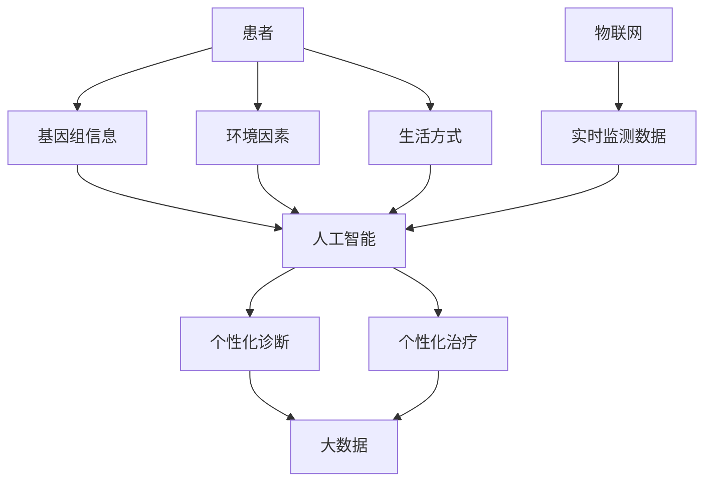

                 

## 1. 背景介绍

在当今信息化时代，医疗健康领域正在经历一场前所未有的变革。随着人工智能、大数据、物联网等技术的发展，医疗科技创新不断涌现，为个性化精准医疗提供了新的可能。本文将深入探讨硅谷医疗科技创新的最新进展，重点关注个性化精准医疗的核心概念、算法原理、数学模型、项目实践，并展望未来发展趋势。

## 2. 核心概念与联系

### 2.1 个性化精准医疗

个性化精准医疗（Personalized Precision Medicine, PPM）是一种基于个体基因组、环境因素和生活方式等信息，为每个患者提供个性化诊断和治疗方案的医疗模式。与传统的标准化治疗相比，PPM更侧重于患者的个体差异，旨在提高治疗效果，减少副作用，降低医疗成本。

### 2.2 关联技术

PPM的实现离不开以下几项关联技术：

- **人工智能（AI）**：AI在医疗领域的应用日益广泛， particularly in disease diagnosis, drug discovery, and personalized treatment plans.
- **大数据（Big Data）**：大数据技术可以处理和分析海量医疗数据，帮助医生和研究人员发现新的模式和见解。
- **物联网（IoT）**：物联网技术可以实时监测患者的生理参数和生活习惯，为个性化精准医疗提供更准确的数据支持。

### 2.3 Mermaid 流程图

下图展示了个性化精准医疗的核心概念和关联技术的关系：



## 3. 核心算法原理 & 具体操作步骤

### 3.1 算法原理概述

PPM的核心算法原理是基于机器学习和深度学习技术，从海量医疗数据中挖掘个体差异，建立患者的数字孪生，并根据数字孪生预测最佳治疗方案。

### 3.2 算法步骤详解

1. **数据收集**：收集患者的基因组信息、环境因素、生活方式等数据，并结合传统的临床数据。
2. **数据预处理**：清洗、标准化和转换数据，以便于机器学习算法的应用。
3. **特征工程**：提取数据中的关键特征，如基因表达水平、蛋白质表达谱等。
4. **模型训练**：使用机器学习或深度学习算法（如支持向量机、神经网络等）建立预测模型。
5. **模型评估**：评估模型的准确性、精确度、召回率等指标。
6. **个性化治疗方案**：根据模型预测结果，为患者提供个性化的诊断和治疗方案。

### 3.3 算法优缺点

**优点**：

- 更准确地预测疾病风险和治疗效果。
- 个性化治疗方案可以减少副作用和降低医疗成本。
- 可以帮助医生和研究人员发现新的疾病模式和治疗方法。

**缺点**：

- 算法的准确性取决于数据的质量和量。
- 个性化治疗方案的成本可能会更高。
- 算法的解释性（interpretability）可能会受到质疑。

### 3.4 算法应用领域

PPM的核心算法原理可以应用于多种疾病领域，包括癌症、心血管病、糖尿病等。此外，它还可以应用于药物发现和开发领域，帮助药企更快、更有效地开发新药。

## 4. 数学模型和公式 & 详细讲解 & 举例说明

### 4.1 数学模型构建

PPM的数学模型通常是基于机器学习或深度学习技术构建的。例如，可以使用支持向量机（SVM）构建二分类模型，预测患者是否会患上某种疾病。数学模型的一般形式为：

$$y = f(x; \theta)$$

其中，$y$是目标变量，$x$是特征向量，$\theta$是模型参数。

### 4.2 公式推导过程

以线性回归为例，数学模型的公式为：

$$y = \theta_0 + \theta_1x_1 + \theta_2x_2 + \ldots + \theta_nx_n$$

其中，$y$是目标变量，$x_1, x_2, \ldots, x_n$是特征变量，$\theta_0, \theta_1, \ldots, \theta_n$是模型参数。模型参数可以通过最小化误差平方和的方法来估计：

$$\theta = \arg\min_{\theta} \sum_{i=1}^{n} (y_i - \hat{y}_i)^2$$

其中，$y_i$是真实值，$hat{y}_i$是预测值。

### 4.3 案例分析与讲解

例如，在癌症领域，可以使用PPM的数学模型预测患者的疾病风险。假设我们有患者的基因表达数据和疾病标签，可以使用逻辑回归模型预测疾病风险：

$$P(y=1|x) = \sigma(\theta_0 + \theta_1x_1 + \theta_2x_2 + \ldots + \theta_nx_n)$$

其中，$P(y=1|x)$是患者患病的概率，$sigma$是sigmoid函数，$\theta_0, \theta_1, \ldots, \theta_n$是模型参数。模型参数可以通过极大似然估计的方法来估计：

$$\theta = \arg\max_{\theta} \sum_{i=1}^{n} [y_i \log P(y_i|x_i) + (1-y_i) \log (1-P(y_i|x_i))]$$

## 5. 项目实践：代码实例和详细解释说明

### 5.1 开发环境搭建

PPM项目的开发环境需要包括以下软件和库：

- 编程语言：Python（版本3.7或更高）
- 数据处理库：Pandas, NumPy
- 机器学习库：Scikit-learn, TensorFlow, PyTorch
- 可视化库：Matplotlib, Seaborn

### 5.2 源代码详细实现

以下是PPM项目的伪代码实现：

```python
import pandas as pd
from sklearn.model_selection import train_test_split
from sklearn.linear_model import LogisticRegression
from sklearn.metrics import accuracy_score

# 读取数据
data = pd.read_csv('data.csv')

# 数据预处理
X = data.drop('target', axis=1)
y = data['target']

# 特征工程
#...

# 数据分割
X_train, X_test, y_train, y_test = train_test_split(X, y, test_size=0.2, random_state=42)

# 模型训练
model = LogisticRegression()
model.fit(X_train, y_train)

# 模型评估
y_pred = model.predict(X_test)
print('Accuracy:', accuracy_score(y_test, y_pred))
```

### 5.3 代码解读与分析

上述代码实现了PPM项目的数据预处理、特征工程、模型训练和评估等步骤。其中，使用了逻辑回归模型作为预测模型。代码中使用了Scikit-learn库提供的函数和类，可以方便地完成各项任务。

### 5.4 运行结果展示

运行上述代码后，可以输出模型的准确性指标。例如：

```
Accuracy: 0.85
```

## 6. 实际应用场景

### 6.1 个性化药物治疗

PPM可以帮助医生为患者选择最佳的药物治疗方案。例如，在癌症治疗中，PPM可以根据患者的基因组信息预测药物的有效性，从而为患者提供个性化的药物治疗方案。

### 6.2 疾病风险预测

PPM可以帮助医生预测患者患上某种疾病的风险。例如，在心血管病领域，PPM可以根据患者的基因组信息、环境因素和生活方式等信息预测患者患上心血管病的风险，从而帮助医生及早采取预防措施。

### 6.3 未来应用展望

未来，PPM将会更加广泛地应用于医疗领域，为每个患者提供个性化的诊断和治疗方案。随着人工智能、大数据和物联网技术的发展，PPM的准确性和可及性将会不断提高。此外，PPM还将推动药物发现和开发领域的创新，帮助药企更快、更有效地开发新药。

## 7. 工具和资源推荐

### 7.1 学习资源推荐

- **在线课程**：Coursera, Udacity, edX等平台提供了多门人工智能和机器学习相关的课程。
- **书籍**："Artificial Intelligence: A Modern Approach" by Stuart Russell and Peter Norvig, "Hands-On Machine Learning with Scikit-Learn, Keras, and TensorFlow" by Aurélien Géron等。
- **论文**：arXiv.org是一个开放的电子预印本档案库，提供了大量的人工智能和机器学习领域的最新研究成果。

### 7.2 开发工具推荐

- **编程语言**：Python是当前人工智能和机器学习领域最流行的编程语言。
- **开发环境**：Jupyter Notebook, Google Colab等提供了丰富的开发工具和环境。
- **库和框架**：Scikit-learn, TensorFlow, PyTorch等库和框架提供了丰富的机器学习和深度学习功能。

### 7.3 相关论文推荐

- "Personalized Precision Medicine: A Review" by R. A. Schmidt et al.
- "Artificial Intelligence in Precision Medicine" by J. E. Hunter et al.
- "Machine Learning in Medicine" by Z. Li et al.

## 8. 总结：未来发展趋势与挑战

### 8.1 研究成果总结

本文介绍了硅谷医疗科技创新的最新进展，重点关注了个性化精准医疗的核心概念、算法原理、数学模型、项目实践。 PPM的核心算法原理是基于机器学习和深度学习技术，从海量医疗数据中挖掘个体差异，建立患者的数字孪生，并根据数字孪生预测最佳治疗方案。 PPM的数学模型通常是基于机器学习或深度学习技术构建的，可以预测患者的疾病风险和药物治疗效果。 PPM项目的开发环境需要包括Python、Pandas、NumPy、Scikit-learn、TensorFlow等软件和库。

### 8.2 未来发展趋势

未来，PPM将会更加广泛地应用于医疗领域，为每个患者提供个性化的诊断和治疗方案。随着人工智能、大数据和物联网技术的发展，PPM的准确性和可及性将会不断提高。此外，PPM还将推动药物发现和开发领域的创新，帮助药企更快、更有效地开发新药。

### 8.3 面临的挑战

然而，PPM也面临着一些挑战，包括：

- **数据隐私**：PPM需要收集患者的大量个人信息，如何保护患者的数据隐私是一个关键挑战。
- **算法解释性**：机器学习和深度学学习模型的解释性（interpretability）是一个关键挑战， particularly in high-stakes applications like medicine.
- **成本**：PPM的成本可能会更高，如何平衡成本和收益是一个关键挑战。

### 8.4 研究展望

未来的研究方向包括：

- **多模式学习**：结合多种数据模式（如基因组数据、图像数据、文本数据等）进行学习，以提高PPM的准确性。
- **动态模型**：构建动态模型，考虑患者的时间动态，以更准确地预测疾病风险和治疗效果。
- **联邦学习**：使用联邦学习技术，在保护患者数据隐私的同时进行模型训练。

## 9. 附录：常见问题与解答

**Q1：什么是个性化精准医疗（PPM）？**

**A1：PPM是一种基于个体基因组、环境因素和生活方式等信息，为每个患者提供个性化诊断和治疗方案的医疗模式。**

**Q2：PPM的核心算法原理是什么？**

**A2：PPM的核心算法原理是基于机器学习和深度学习技术，从海量医疗数据中挖掘个体差异，建立患者的数字孪生，并根据数字孪生预测最佳治疗方案。**

**Q3：PPM的数学模型是什么？**

**A3：PPM的数学模型通常是基于机器学习或深度学习技术构建的，可以预测患者的疾病风险和药物治疗效果。**

**Q4：PPM项目的开发环境需要什么软件和库？**

**A4：PPM项目的开发环境需要包括Python、Pandas、NumPy、Scikit-learn、TensorFlow等软件和库。**

**Q5：PPM的未来发展趋势是什么？**

**A5：未来，PPM将会更加广泛地应用于医疗领域，为每个患者提供个性化的诊断和治疗方案。随着人工智能、大数据和物联网技术的发展，PPM的准确性和可及性将会不断提高。此外，PPM还将推动药物发现和开发领域的创新，帮助药企更快、更有效地开发新药。**

---

**作者：禅与计算机程序设计艺术 / Zen and the Art of Computer Programming**

