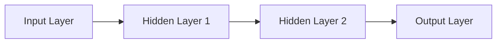

                 

## 1. 背景介绍

神经网络（Neural Network）是人工智能（Artificial Intelligence）领域的一个关键组成部分，它模仿人类大脑的结构和功能，以一种高度非线性的方式处理信息。自从1943年Warren McCulloch和Walter Pitts首次提出神经元模型以来，神经网络已经发展成为一种强大的工具，被广泛应用于图像识别，语音识别，自然语言处理，推荐系统，自动驾驶等领域。

## 2. 核心概念与联系

神经网络的核心是神经元（Neuron），它们通过权重（Weights）连接在一起，形成层（Layers）。神经网络可以分为输入层（Input Layer），隐藏层（Hidden Layers），和输出层（Output Layer）。神经网络的学习过程涉及到调整权重，以最小化预测误差。



## 3. 核心算法原理 & 具体操作步骤

### 3.1 算法原理概述

神经网络的学习过程可以分为两个主要阶段：前向传播（Forward Propagation）和反向传播（Backpropagation）。前向传播是指信息从输入层传递到输出层的过程。反向传播则是指调整权重以最小化预测误差的过程。

### 3.2 算法步骤详解

1. **前向传播**：输入数据通过输入层进入网络，然后通过隐藏层，最后由输出层生成输出。
2. **计算误差**：计算输出层的预测值与真实值之间的误差。
3. **反向传播**：误差信息从输出层反向传播到隐藏层，调整每个神经元的权重。
4. **重复**：步骤1-3，直到误差小于阈值或达到最大迭代次数。

### 3.3 算法优缺点

**优点**：神经网络可以学习复杂的非线性关系，具有高度的泛化能力。

**缺点**：神经网络易于过拟合（Overfitting），需要大量的数据和计算资源，并且训练过程缺乏解释性。

### 3.4 算法应用领域

神经网络广泛应用于图像识别，语音识别，自然语言处理，推荐系统，自动驾驶等领域。

## 4. 数学模型和公式 & 详细讲解 & 举例说明

### 4.1 数学模型构建

神经网络的数学模型可以表示为：

$$y = f(w*x + b)$$

其中，$x$是输入，$w$是权重，$b$是偏置，$f$是激活函数，$y$是输出。

### 4.2 公式推导过程

神经网络的学习过程可以表示为最小化损失函数（Loss Function）的过程。常用的损失函数包括均方误差（Mean Squared Error）和交叉熵（Cross-Entropy）。

### 4.3 案例分析与讲解

例如，在图像识别任务中，输入是图像特征向量，$y$是图像的类别标签。神经网络的目标是学习权重$w$和偏置$b$，使得输出$y$与真实标签尽可能接近。

## 5. 项目实践：代码实例和详细解释说明

### 5.1 开发环境搭建

我们将使用Python和TensorFlow构建神经网络。首先，安装必要的库：

```bash
pip install tensorflow
```

### 5.2 源代码详细实现

以下是一个简单的神经网络实现，用于分类任务：

```python
import tensorflow as tf
from tensorflow.keras.models import Sequential
from tensorflow.keras.layers import Dense

# 定义模型
model = Sequential()
model.add(Dense(32, activation='relu', input_shape=(input_dim,)))
model.add(Dense(10, activation='softmax'))

# 编译模型
model.compile(optimizer='adam',
              loss='categorical_crossentropy',
              metrics=['accuracy'])

# 训练模型
model.fit(x_train, y_train, epochs=10, batch_size=32)
```

### 5.3 代码解读与分析

我们定义了一个顺序模型（Sequential Model），添加了一个密集连接层（Dense Layer）和一个输出层。我们使用ReLU激活函数和Adam优化器。模型的训练过程使用交叉熵损失函数和准确度指标。

### 5.4 运行结果展示

训练完成后，模型的准确度将显示在控制台上。

## 6. 实际应用场景

神经网络在各种领域都有广泛的应用。例如，在图像识别领域，神经网络可以用于人脸识别，物体检测，图像分类等任务。在自然语言处理领域，神经网络可以用于文本分类，机器翻译，语言模型等任务。

### 6.4 未来应用展望

未来，神经网络将继续发展，可能会出现更深层次的网络，更复杂的架构，更高效的训练算法。此外，神经网络与其他人工智能技术的结合，如强化学习（Reinforcement Learning）和生成式对抗网络（Generative Adversarial Networks），也将是一个重要的研究方向。

## 7. 工具和资源推荐

### 7.1 学习资源推荐

- "Deep Learning" by Ian Goodfellow, Yoshua Bengio, and Aaron Courville
- "Hands-On Machine Learning with Scikit-Learn, Keras, and TensorFlow" by Aurélien Géron
- Andrew Ng's Machine Learning course on Coursera

### 7.2 开发工具推荐

- TensorFlow
- PyTorch
- Keras

### 7.3 相关论文推荐

- "A Neural Network for Recognizing Handwritten Digits" by Yann LeCun, Léon Bottou, Yoshua Bengio, and Patrick Haffner
- "ImageNet Classification with Deep Convolutional Neural Networks" by Karen Simonyan and Andrew Zisserman

## 8. 总结：未来发展趋势与挑战

### 8.1 研究成果总结

神经网络已经取得了巨大的成功，在各种领域都有广泛的应用。然而，仍然存在许多挑战，需要进一步的研究。

### 8.2 未来发展趋势

未来，神经网络的发展将朝着更深层次，更复杂的架构，更高效的训练算法，以及与其他人工智能技术的结合等方向发展。

### 8.3 面临的挑战

神经网络面临的挑战包括过拟合，需要大量的数据和计算资源，训练过程缺乏解释性，以及如何处理小样本学习（Small Sample Learning）等问题。

### 8.4 研究展望

未来的研究将关注如何提高神经网络的泛化能力，如何处理小样本学习，如何提高训练过程的解释性，以及如何将神经网络与其他人工智能技术结合等问题。

## 9. 附录：常见问题与解答

**Q：神经网络是如何学习的？**

A：神经网络通过调整权重和偏置来学习，以最小化预测误差。这个过程称为反向传播。

**Q：神经网络需要大量的数据吗？**

A：是的，神经网络需要大量的数据来训练。数据的质量和数量都对神经网络的性能有很大的影响。

**Q：神经网络是如何泛化的？**

A：神经网络的泛化能力来自于其复杂的非线性关系和权重的调整。通过调整权重，神经网络可以学习到更一般化的特征，从而提高泛化能力。

**作者：禅与计算机程序设计艺术 / Zen and the Art of Computer Programming**

